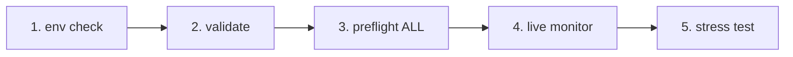

# IrsanAI TPM Agent Forge

[🇬🇧 English](./README.md) | [🇩🇪 Deutsch](./README.de.md)

Ein sauberer Bootstrap für ein autonomes Multi-Agent-Setup (BTC, COFFEE und weitere Märkte) mit plattformübergreifenden Laufoptionen.

## Inhalt

- `production/preflight_manager.py` – robustes Source-Probing mit Alpha-Vantage-Priorität, Fallback-Kette und lokalem Cache-Fallback.
- `production/tpm_agent_process.py` – einfacher Agent-Loop pro Markt.
- `production/tpm_live_monitor.py` – BTC-Live-Monitor mit optionalem CSV-Warmstart und Termux-Benachrichtigungen.
- `core/tpm_scientific_validation.py` – Backtest + statistische Validierung.
- `scripts/tpm_cli.py` – einheitlicher Launcher für Termux/Linux/macOS/Windows.
- `scripts/stress_test_suite.py` – Failover-/Latenz-Stresstest.
- `scripts/start_agents.sh`, `scripts/health_monitor_v3.sh` – Prozess-/Betriebshelfer.
- `core/scout.py`, `core/reserve_manager.py`, `core/init_db_v2.py` – operative Core-Tools.

## Universal Quickstart

```bash
python scripts/tpm_cli.py env
python scripts/tpm_cli.py validate
python scripts/tpm_cli.py preflight --market ALL
python scripts/tpm_cli.py live --history-csv btc_real_24h.csv --poll-seconds 3600
```

## Ablauf- und Kausalketten-Check (Reihenfolge-Sanity)

Der empfohlene Repo-Flow ist bewusst linear, damit keine versteckten Zustandsfehler oder „falsche Sicherheit" im Live-Betrieb entstehen.



### Gate-Logik (was vor dem nächsten Schritt erfüllt sein muss)
- **Gate 1 – Environment:** Python-/Plattform-Kontext ist korrekt (`env`).
- **Gate 2 – Scientific sanity:** Basisverhalten ist reproduzierbar (`validate`).
- **Gate 3 – Source reliability:** Datenquellen + Fallback-Kette sind erreichbar (`preflight --market ALL`).
- **Gate 4 – Runtime execution:** Live-Loop läuft mit bekannter Input-Historie (`live`).
- **Gate 5 – Adversarial confidence:** Latenz-/Failover-Ziele halten unter Last (`stress_test_suite.py`).

✅ Bereits im Code korrigiert: CLI-Preflight unterstützt jetzt `--market ALL` und ist damit konsistent zu Quickstart + Docker-Flow.

## Wähle deine Mission (rollenbasierte CTA)

> **Du bist X? Klick auf deine Spur. Start in <60 Sekunden.**

| Rolle | Was dir wichtig ist | Klick-Pfad | Erster Command |
|---|---|---|---|
| 📈 **Trader** | Schneller Puls, direkt verwertbarer Runtime-Status | [`tpm_live_monitor.py`](./production/tpm_live_monitor.py) | `python scripts/tpm_cli.py live --history-csv btc_real_24h.csv --poll-seconds 3600` |
| 💼 **Investor** | Stabilität, Quellenvertrauen, Resilienz | [`preflight_manager.py`](./production/preflight_manager.py) | `python scripts/tpm_cli.py preflight --market ALL` |
| 🔬 **Wissenschaftler** | Evidenz, Tests, statistisches Signal | [`tpm_scientific_validation.py`](./core/tpm_scientific_validation.py) | `python scripts/tpm_cli.py validate` |
| 🧠 **Theoretiker** | Kausalstruktur + zukünftige Architektur | [`core/scout.py`](./core/scout.py) + [`Nächste Ausbaustufen`](#nächste-ausbaustufen) | `python scripts/tpm_cli.py validate` |
| 🛡️ **Skeptiker (Priorität)** | Annahmen brechen, bevor Produktion startet | [`stress_test_suite.py`](./scripts/stress_test_suite.py) + [`preflight_manager.py`](./production/preflight_manager.py) | `python scripts/tpm_cli.py preflight --market ALL && python scripts/stress_test_suite.py` |
| ⚙️ **Operator / DevOps** | Uptime, Prozessgesundheit, Recoverability | [`start_agents.sh`](./scripts/start_agents.sh) + [`health_monitor_v3.sh`](./scripts/health_monitor_v3.sh) | `bash scripts/start_agents.sh` |

### Skeptiker-Challenge (für neue Besucher empfohlen)
Wenn du **nur eine Sache** testest, dann diese Sequenz und den Report prüfen:

```bash
python scripts/tpm_cli.py preflight --market ALL
python scripts/stress_test_suite.py
```

Wenn diese Spur überzeugt, resoniert in der Regel auch der Rest des Repos.

## Plattform-Hinweise

- **Android / Termux (Samsung etc.)**
  ```bash
  pkg install termux-api -y
  python scripts/tpm_cli.py live --history-csv btc_real_24h.csv --notify --vibrate-ms 1000
  ```
- **iPhone (im Rahmen des Möglichen)**: Shell-Apps wie iSH / a-Shell nutzen. Termux-spezifische Notification-Hooks sind dort nicht verfügbar.
- **Windows / Linux / macOS**: identische CLI-Befehle; für Dauerbetrieb via tmux/Scheduler/cron starten.

## Docker (einfachster Cross-OS-Weg)

```bash
docker compose run --rm tpm-preflight
docker compose run --rm tpm-live
```

Optional für bessere COFFEE-Quelle:

```bash
export ALPHAVANTAGE_KEY="<dein_key>"
docker compose run --rm tpm-preflight
```

## Validierung

Statistische Validierung ausführen:

```bash
python core/tpm_scientific_validation.py
```

Artefakte:
- `state/TPM_Scientific_Report.md`
- `state/TPM_test_results.json`

## Datenquellen & Failover

`production/preflight_manager.py` unterstützt:
- Alpha Vantage zuerst für COFFEE (wenn `ALPHAVANTAGE_KEY` gesetzt ist)
- TradingView + Yahoo als Fallback-Kette
- lokales Cache-Fallback in `state/latest_prices.json`

Preflight direkt ausführen:

```bash
export ALPHAVANTAGE_KEY="<dein_key>"
python production/preflight_manager.py --market ALL
```

Outage-Stresstest (Ziel `p95 < 1000ms`):

```bash
python scripts/stress_test_suite.py
```

Output: `state/stress_test_report.json`


## Nächste Ausbaustufen

- Transfer-Entropy-Modul für Kausalitätsanalyse zwischen Märkten.
- Optimizer mit Policy-Updates auf Basis historischer Performance.
- Alerting (Telegram/Signal) + Boot-Persistenz.