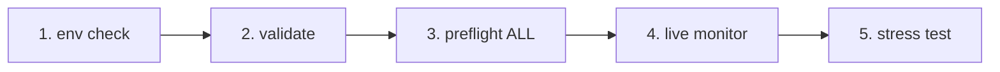
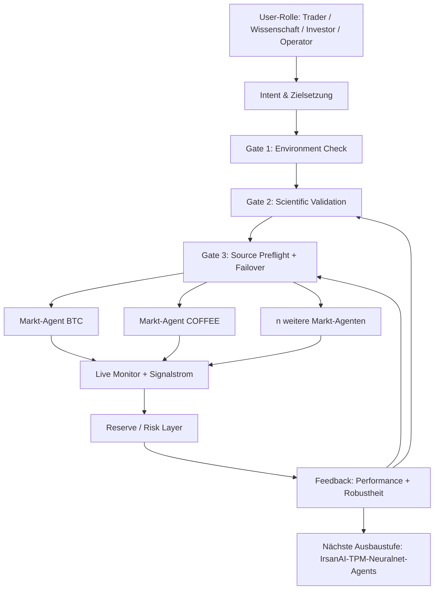

# IrsanAI TPM Agent Forge

[🇬🇧 English](./README.md) | [🇩🇪 Deutsch](./README.de.md) | [🇪🇸 Español](./docs/i18n/README.es.md) | [🇮🇹 Italiano](./docs/i18n/README.it.md) | [🇧🇦 Bosanski](./docs/i18n/README.bs.md) | [🇷🇺 Русский](./docs/i18n/README.ru.md) | [🇨🇳 中文](./docs/i18n/README.zh-CN.md) | [🇫🇷 Français](./docs/i18n/README.fr.md) | [🇧🇷 Português (BR)](./docs/i18n/README.pt-BR.md) | [🇮🇳 हिन्दी](./docs/i18n/README.hi.md) | [🇹🇷 Türkçe](./docs/i18n/README.tr.md) | [🇯🇵 日本語](./docs/i18n/README.ja.md)

Ein sauberer Bootstrap für ein autonomes Multi-Agent-Setup (BTC, COFFEE und weitere Märkte) mit plattformübergreifenden Laufoptionen.

## Inhalt

- `production/preflight_manager.py` – robustes Source-Probing mit Alpha-Vantage-Priorität, Fallback-Kette und lokalem Cache-Fallback.
- `production/tpm_agent_process.py` – einfacher Agent-Loop pro Markt.
- `production/tpm_live_monitor.py` – BTC-Live-Monitor mit optionalem CSV-Warmstart und Termux-Benachrichtigungen.
- `core/tpm_scientific_validation.py` – Backtest + statistische Validierung.
- `scripts/tpm_cli.py` – einheitlicher Launcher für Termux/Linux/macOS/Windows.
- `scripts/stress_test_suite.py` – Failover-/Latenz-Stresstest.
- `scripts/start_agents.sh`, `scripts/health_monitor_v3.sh` – Prozess-/Betriebshelfer.
- `core/scout.py`, `core/reserve_manager.py`, `core/init_db_v2.py` – operative Core-Tools.

## Universal Quickstart

```bash
python scripts/tpm_cli.py env
python scripts/tpm_cli.py validate
python scripts/tpm_cli.py preflight --market ALL
python scripts/tpm_cli.py live --history-csv btc_real_24h.csv --poll-seconds 3600
```

## Ablauf- und Kausalketten-Check (Reihenfolge-Sanity)

Der empfohlene Repo-Flow ist bewusst linear, damit keine versteckten Zustandsfehler oder „falsche Sicherheit" im Live-Betrieb entstehen.



### Gate-Logik (was vor dem nächsten Schritt erfüllt sein muss)
- **Gate 1 – Environment:** Python-/Plattform-Kontext ist korrekt (`env`).
- **Gate 2 – Scientific sanity:** Basisverhalten ist reproduzierbar (`validate`).
- **Gate 3 – Source reliability:** Datenquellen + Fallback-Kette sind erreichbar (`preflight --market ALL`).
- **Gate 4 – Runtime execution:** Live-Loop läuft mit bekannter Input-Historie (`live`).
- **Gate 5 – Adversarial confidence:** Latenz-/Failover-Ziele halten unter Last (`stress_test_suite.py`).

✅ Bereits im Code korrigiert: CLI-Preflight unterstützt jetzt `--market ALL` und ist damit konsistent zu Quickstart + Docker-Flow.

## Wähle deine Mission (rollenbasierte CTA)

> **Du bist X? Klick auf deine Spur. Start in <60 Sekunden.**

| Rolle | Was dir wichtig ist | Klick-Pfad | Erster Command |
|---|---|---|---|
| 📈 **Trader** | Schneller Puls, direkt verwertbarer Runtime-Status | [`tpm_live_monitor.py`](./production/tpm_live_monitor.py) | `python scripts/tpm_cli.py live --history-csv btc_real_24h.csv --poll-seconds 3600` |
| 💼 **Investor** | Stabilität, Quellenvertrauen, Resilienz | [`preflight_manager.py`](./production/preflight_manager.py) | `python scripts/tpm_cli.py preflight --market ALL` |
| 🔬 **Wissenschaftler** | Evidenz, Tests, statistisches Signal | [`tpm_scientific_validation.py`](./core/tpm_scientific_validation.py) | `python scripts/tpm_cli.py validate` |
| 🧠 **Theoretiker** | Kausalstruktur + zukünftige Architektur | [`core/scout.py`](./core/scout.py) + [`Nächste Ausbaustufen`](#nächste-ausbaustufen) | `python scripts/tpm_cli.py validate` |
| 🛡️ **Skeptiker (Priorität)** | Annahmen brechen, bevor Produktion startet | [`stress_test_suite.py`](./scripts/stress_test_suite.py) + [`preflight_manager.py`](./production/preflight_manager.py) | `python scripts/tpm_cli.py preflight --market ALL && python scripts/stress_test_suite.py` |
| ⚙️ **Operator / DevOps** | Uptime, Prozessgesundheit, Recoverability | [`start_agents.sh`](./scripts/start_agents.sh) + [`health_monitor_v3.sh`](./scripts/health_monitor_v3.sh) | `bash scripts/start_agents.sh` |

### Skeptiker-Challenge (für neue Besucher empfohlen)
Wenn du **nur eine Sache** testest, dann diese Sequenz und den Report prüfen:

```bash
python scripts/tpm_cli.py preflight --market ALL
python scripts/stress_test_suite.py
```

Wenn diese Spur überzeugt, resoniert in der Regel auch der Rest des Repos.

## Plattform-Hinweise

- **Android / Termux (Samsung etc.)**
  ```bash
  pkg install termux-api -y
  python scripts/tpm_cli.py live --history-csv btc_real_24h.csv --notify --vibrate-ms 1000
  ```
- **iPhone (im Rahmen des Möglichen)**: Shell-Apps wie iSH / a-Shell nutzen. Termux-spezifische Notification-Hooks sind dort nicht verfügbar.
- **Windows / Linux / macOS**: identische CLI-Befehle; für Dauerbetrieb via tmux/Scheduler/cron starten.

## Docker (einfachster Cross-OS-Weg)

```bash
docker compose run --rm tpm-preflight
docker compose run --rm tpm-live
```

Optional für bessere COFFEE-Quelle:

```bash
export ALPHAVANTAGE_KEY="<dein_key>"
docker compose run --rm tpm-preflight
```

## Validierung

Statistische Validierung ausführen:

```bash
python core/tpm_scientific_validation.py
```

Artefakte:
- `state/TPM_Scientific_Report.md`
- `state/TPM_test_results.json`

## Datenquellen & Failover

`production/preflight_manager.py` unterstützt:
- Alpha Vantage zuerst für COFFEE (wenn `ALPHAVANTAGE_KEY` gesetzt ist)
- TradingView + Yahoo als Fallback-Kette
- lokales Cache-Fallback in `state/latest_prices.json`

Preflight direkt ausführen:

```bash
export ALPHAVANTAGE_KEY="<dein_key>"
python production/preflight_manager.py --market ALL
```

Outage-Stresstest (Ziel `p95 < 1000ms`):

```bash
python scripts/stress_test_suite.py
```

Output: `state/stress_test_report.json`


## Live-Status: Was der TPM-Agent aktuell kann

**Aktueller Stand (heute):**
- Produktive Forge-Web-Runtime ist vorhanden (`production.forge_runtime:app`).
- Startkonfiguration ist finance-first mit **BTC + COFFEE**.
- Live-Frame, Agent-Fitness, Transfer-Entropy und Domain-Summary sind im Web-Dashboard sichtbar.
- User können neue Markt-Agenten zur Laufzeit hinzufügen (`POST /api/agents`).

**Was er können sollte (Sollbild):**
- Realdaten-Benchmarking mit klaren Akzeptanzgrenzen (Precision/Recall/FPR/Drift).
- Harte reflexive Governance-Regeln für Auto-Safe-Mode.
- Collective-Memory-Prozess für versionierte Lernmuster je Domäne.

**Nächste Ausbaustufe:**
- Regime-basierter Policy-Orchestrator (Trend/Schock/Sideways) über allen Agenten.
- Domänenpilot außerhalb Finance (z. B. Medical oder Seismic) mit klaren Datenverträgen.


## Merge-Hilfe für PR-Konflikte

- Merge-Checkliste (GitHub Konflikte): `docs/MERGE_CONFLICT_CHECKLIST.de.md`

## Windows Live-Test (2-Wege-System)

### Weg A — Developer/Power-User (PowerShell, CMD, PyCharm, IDE)

```powershell
python -m venv .venv
.\.venv\Scripts\Activate.ps1
pip install -r requirements.txt
python scripts/tpm_cli.py forge-dashboard --open-browser --port 8787
```

### Weg B — Low-Level User (Klick & Start)

1. Doppelklick auf `scripts/windows_click_start.bat`
2. Script wählt automatisch den besten Pfad:
   - Python vorhanden → venv + pip + Runtime-Start
   - sonst Docker Compose (falls verfügbar)

Technische Basis: `scripts/windows_bootstrap.ps1`.

## Forge Production Web Runtime (BTC + COFFEE, erweiterbar)

Ja, das ist im Repo **bereits begonnen** worden und jetzt weitergeführt:

- Startet standardmäßig mit einem Finanz-TPM-Agenten für **BTC** und einem für **COFFEE**.
- User können weitere Märkte/Agenten direkt im Web-UI hinzufügen (`/api/agents`).
- Läuft als persistenter Runtime-Service mit Live-Frame (`/api/frame`) für immersive Einsicht.

### Start (lokal)

```bash
uvicorn production.forge_runtime:app --host 0.0.0.0 --port 8787
# öffne http://localhost:8787
```

### Start (Docker)

```bash
docker compose up tpm-forge-web
# öffne http://localhost:8787
```

## TPM Playground (interaktiver MVP)

Du kannst das TPM-Verhalten jetzt interaktiv im Browser testen:

```bash
python -m http.server 8765
# öffne http://localhost:8765/playground/index.html
```

Enthalten:
- Single-Agent-Ansicht für Weak-Signal-Anomalien
- Mini-Schwarm (BTC/COFFEE/VOL) mit Konsensdruck
- Cross-Domain-Transfer-Resonanz (synthetisch: Finance/Wetter/Health)

Siehe: `playground/README.md`.
## Nächste Ausbaustufen

- Transfer-Entropy-Modul für Kausalitätsanalyse zwischen Märkten.
- Optimizer mit Policy-Updates auf Basis historischer Performance.
- Alerting (Telegram/Signal) + Boot-Persistenz.

---

## IrsanAI Deep Dive: Wie das Herzstück des TPM Agent "tickt"

> **Kurzform:** TPM ist kein einzelner Bot, sondern ein *entscheidungsökologisches System* aus Daten-Validierung, Markt-Agenten, Feedback-Loops und Governance-Gates.

### 1) Architektonischer Prozessablauf (immersiv)



Interpretation:
- **Links (Intent):** Jede Rolle startet mit anderer Frage, aber im selben sicheren Pipeline-Rahmen.
- **Mitte (Gates):** Keine Runtime ohne überprüfte Daten- und Modellbasis.
- **Rechts (Swarm):** Mehrere Agenten erzeugen kollektive Marktwahrnehmung statt Monoperspektive.

---

### 2) Perspektive "Wissenschaft" (epistemische Qualität)

Der wissenschaftliche Kern liegt nicht nur in "Backtest vorhanden", sondern in einer **stufenweisen Falsifikationskette**:

1. **Reproduzierbarkeit** über `validate`.
2. **Datenquellen-Härtung** über Preflight + Fallback.
3. **Adversarial Testing** über Latenz-/Outage-Simulation.

Warum das zählt:
- Der Agent trennt **Signal** von **Datenartefakt**.
- Er reduziert Scheinsicherheit durch explizite Gates.
- Er erzeugt artefaktbasierte Evidenz (`state/*.json`, Reports), nicht bloß "gefühlte" Performance.

---

### 3) Perspektive "Trader" (entscheidungsnahe Runtime)

Aus Trader-Sicht ist TPM stark, weil es drei Dinge koppelt:

- **Taktische Reaktionsfähigkeit:** Live-Monitoring mit kontrollierter Polling-Frequenz.
- **Operational Trust:** Preflight verhindert blinde Signale bei API-/Quellenproblemen.
- **Kontinuität:** Fallbacks + Cache halten den Prozess lauffähig, auch bei Teil-Ausfällen.

Praktischer Effekt: weniger "Noise-Trading", mehr **zustandsbewusste Entscheidung**.

---

### 4) Perspektive "Investor / Stratege" (Systemresilienz)

TPM ist nicht auf kurzfristigen Output optimiert, sondern auf **persistente Robustheit**:

- Mehrschichtige Datenbeschaffung (Primary + Secondary + Cache).
- Klare Trennung zwischen Validierung, Preflight und Live-Betrieb.
- Stress-Tests als Pflichtteil der Betriebsrealität.

Das verschiebt das Narrativ von "ein Bot trifft Trades" zu **"ein Betriebssystem für verlässliche Agentenentscheidungen"**.

---

### 5) Meta-kognitiver Blick (IrsanAI-Stil)

IrsanAI-Logik bedeutet hier:

- **Der Agent beobachtet nicht nur den Markt, sondern auch sich selbst.**
- **Jede Entscheidung ist kontextgebunden an Datenqualität, Latenz und Modus.**
- **Fehler ("Glitches") sind Diagnosesignale, keine Defekte, die man versteckt.**

Typische Glitches, die bewusst adressiert werden:
- Quelleninstabilität / API-Drift
- Latenzspitzen im Retrieval
- Regimewechsel im Markt (historisches Muster bricht)

Die Architektur antwortet darauf mit: Gatekeeping, Fallback, Monitoring, Re-Validation.

---

### 6) Warum Schwarmintelligenz (BTC + COFFEE + n Märkte) unumkehrbar wird

Einzelagenten sehen lokal. Swarms sehen **Interdependenz**.

Wenn BTC-Agent, Coffee-Agent und weitere Markt-Agenten parallel laufen, entsteht:

- **Cross-Market-Sensitivität** (Frühsignale über Märkte hinweg)
- **Redundanz gegen Blindspots**
- **Emergente Hypothesenbildung** (was isoliert unsichtbar bleibt, wird im Verbund messbar)

Damit wächst TPM von Multi-Agent-Setup zu einem **IrsanAI-TPM-Neuralnet-Ökomikrokosmos**:

- Knoten = spezialisierte Markt-Agenten
- Kanten = Informationsfluss / Kausalbezug
- Plastizität = adaptive Gewichtung je Regime und Qualität

---

### 7) Nächste Ausbaustufe (promotet)

Die nächste Evolutionsstufe ist ein **koordiniertes Meta-Layer** über allen Agenten:

1. **Transfer-Entropy / Kausalitäts-Graphen** als dynamische Verknüpfungsmatrix.
2. **Policy-Orchestrator**, der Agentengewichte nach Regime (Trend, Schock, Sideways) re-kalibriert.
3. **Collective Memory**, die erfolgreiche Reaktionsmuster versionssicher speichert.
4. **Reflexive Governance**, die bei Unsicherheit automatisch in konservative Modi schaltet.

So entsteht aus "mehreren Bots" ein lernendes, kontrollierbares Netzwerk mit wissenschaftlichem Rückgrat.

---

### 8) Rollenbasierter immersiver Einstieg (1-Command-Matrix)

| Rolle | Primäre Frage | Immersiver Start |
|---|---|---|
| 🔬 Wissenschaft | "Ist das Signal robust oder nur Zufall?" | `python scripts/tpm_cli.py validate` |
| 📈 Trader | "Ist der Marktmodus jetzt handelbar?" | `python scripts/tpm_cli.py live --history-csv btc_real_24h.csv --poll-seconds 3600` |
| 💼 Investor | "Wie resilient ist der Betrieb unter Ausfall?" | `python scripts/tpm_cli.py preflight --market ALL` |
| 🛡️ Skeptiker | "Wo bricht das System zuerst?" | `python scripts/stress_test_suite.py` |
| ⚙️ Operator | "Wie halte ich das System gesund im Dauerlauf?" | `bash scripts/start_agents.sh` |

Wenn alle Rollen dieselbe Architektur aus ihrem Blick als sinnvoll erleben, ist das der stärkste Hinweis auf ein tragfähiges TPM-Kernsystem.


### 9) Repo-Resonanzcheck (System im Verbund)

Damit Architektur-Story und reale Ausführung zusammenpassen, gilt im TPM-Kontext dieser Kurz-Check:

- `env` muss Plattform + Python sauber melden (Betriebsbasis).
- `validate` liefert wissenschaftliche Artefakte auch dann, wenn nicht alle internen Tests "grün" sind — entscheidend ist die transparente Reportlage statt Blackbox-Optimismus.
- `preflight --market ALL` bleibt der Realitätsanker für externe Feeds; in restriktiven Netzwerkumgebungen (z. B. 403/Tunnel) zeigt der Output bewusst degradierte Quellverfügbarkeit.
- `stress_test_suite.py` quantifiziert Robustheit trotz Fehlerpfaden (z. B. p95-Latenz unter Zielgrenze bei gleichzeitigen Source-Exceptions).

**Resonanz-Prinzip:** Nicht "alles perfekt", sondern **alles messbar, erklärbar und steuerbar**. Genau daraus entsteht die IrsanAI-typische Betriebssicherheit über Rollen hinweg.

---

## 10) Visionäre Transformationssektion: Vom Trading-Agent zum universellen TPM-Ökosystem

### Das Unique des IrsanAI-TPM-Algorithmus (präzisiert)

Arbeitshypothese des TPM-Kerns:

- In komplexen, chaotischen Systemen liegt der Frühhinweis oft nicht im dominanten Signal, sondern im **Mikrorest**: in minimalen Abweichungen, schwachen Korrelationen, scheinbar „leeren" Datenpunkten.
- Wo klassische Systeme ein „0" oder „zu wenig Relevanz" sehen, sucht TPM nach **strukturierter Anomalie** (Glitch-Muster) im Kontextfluss.
- Der Algorithmus bewertet nicht nur den Wert selbst, sondern dessen **Beziehungsänderung über Zeit, Quelle, Regime und Kausalnähe**.

Wichtig zur Korrektheit: TPM „sieht" nicht magisch in die Zukunft. Es liefert eine **frühere probabilistische Detektion** von Regimewechseln, Ausbrüchen oder Störungen — vorausgesetzt, Datenqualität, Kontext und Validierungsgates sind erfüllt.

### Think BIG: Warum das mehr als Finanzmärkte sein kann

Wenn ein TPM-Agent im Marktumfeld (Index, WKN, ISIN, Volumen, Mikrostruktur) Frühsignale findet, dann ist das Prinzip auf viele Domänen übertragbar:

- **Sensor-/Ereignisstrom + Kontextmodell + Anomalie-Layer + Rückkopplung**.
- Jedes Berufsfeld kann als „Markt" mit eigenen Features, Knoten, Korrelationen und Glitches modelliert werden.
- Ein künftiger Cluster aus spezialisierten TPM-Agenten könnte domänenübergreifend voneinander lernen, ohne die jeweilige Fachlogik zu verlieren.

Ergebnisbild: ein organisch wachsender, selbstoptimierender Verbund aus Agentenklassen — ein immersives, wissenschaftlich steuerbares Neuro-Ökosystem.

### 100 Berufe als TPM-Zielräume (inkl. jeweiliger "Marktdaten" für Glitch-Detektion)

| # | Beruf | Analoges Datenfeld für TPM | Ziel der Anomalie-/Musterdetektion |
|---|---|---|---|
| 1 | Polizei | Einsatzprotokolle, Tatort-Geozeit, Netzwerke, Wiederholungsmuster | Frühindikatoren für eskalierende Kriminalitätscluster |
| 2 | Feuerwehr | Sensorik, Alarmketten, Wetter, Gebäudeprofile | Vorhersage von Brand-/Gefahrenausbreitung |
| 3 | Rettungsdienst | Notrufgründe, Wegezeiten, Klinikbelegung | Früherkennung von Versorgungsengpässen |
| 4 | Notaufnahme-Arzt | Triage-Daten, Vitalparameter, Wartezeiten | Kritische Verläufe vor sichtbarer Dekompensation erkennen |
| 5 | Intensivpflege | Beatmungs-/Labortrends, Medikationsreaktionen | Sepsis-/Schocksignale im Mikrotrend erkennen |
| 6 | Epidemiologe | Fallzahlen, Mobility, Abwasser- und Labordaten | Ausbruchsfrühwarnung vor exponentieller Phase |
| 7 | Hausarzt | EHR-Muster, Verordnungen, Follow-up-Lücken | Chronifizierungs- und Risikoübergänge früh markieren |
| 8 | Psychologe | Sitzungsverläufe, Sprachmarker, Schlaf-/Alltagsdaten | Krisen- oder Rückfallindikatoren früher erkennen |
| 9 | Pharmaforscher | Wirkstoff-Screenings, Nebenwirkungsprofile, Genomdaten | Unerwartete Wirkpfade und Nebenwirkungscluster identifizieren |
| 10 | Biotechnologe | Sequenzdaten, Prozessparameter, Zellkulturverläufe | Drift und Kontaminationsrisiken detektieren |
| 11 | Klimaforscher | Ozean-/Atmosphärenzeitreihen, Satellitendaten | Kipppunkte und Extremereignis-Muster früh erfassen |
| 12 | Meteorologe | Druck-, Feuchte-, Wind-, Radar-Felder | Lokale chaotische Umschwünge antizipieren |
| 13 | Seismologe | Mikrobeben, Spannungsfelder, Bodensensorik | Vorboten größerer tektonischer Entladungen erkennen |
| 14 | Vulkanologe | Gasemissionen, Tremor, Deformation | Eruptionsfenster präziser eingrenzen |
| 15 | Hydrologe | Pegel, Niederschlag, Bodenfeuchte | Flash-Flood- und Dürrewechsel früh detektieren |
| 16 | Ozeanograf | Strömung, Temperatur, Salinität, Bojenströme | Anomalien mit Tsunami-/Ökosystemrelevanz erkennen |
| 17 | Energiehändler | Lastprofile, Spotpreise, Wetter, Netzzustand | Preis- und Lastsprünge vorweg probabilistisch signalisieren |
| 18 | Netzleitstelle Strom | Netzfrequenz, Leitungszustände, Schaltvorgänge | Kaskadenausfallrisiken früh erkennen |
| 19 | Windpark-Betrieb | Turbinensensorik, Windfelder, Wartungsdaten | Ausfallwahrscheinlichkeiten und Leistungsdrift erkennen |
| 20 | Solaranlagen-Manager | Einstrahlung, Wechselrichterdaten, Temperatur | Degradation und Ertragsabweichungen früh finden |
| 21 | Wasserwerk-Leitung | Durchfluss, Qualitätssensorik, Verbrauchsmuster | Kontaminations- und Engpasssignale erkennen |
| 22 | Verkehrsmanager | Verkehrsdichte, Unfälle, Baustellen, Events | Stau- und Kollisions-Hotspots vor Eskalation identifizieren |
| 23 | Bahnleitstelle | Fahrplandaten, Streckenzustand, Verspätungsketten | Systemische Verspätungskaskaden früh brechen |
| 24 | Fluglotse | Radartracks, Wetter, Slot-Auslastung | Konfliktpfade und Engpässe früher sehen |
| 25 | Hafenlogistiker | Liegezeiten, Containerfluss, Zollstatus | Lieferkettenstörungen vorlaufend erkennen |
| 26 | Supply-Chain-Manager | ETA, Lagerstände, Nachfragepuls, Risiken | Bullwhip-Effekte und Stockout-Risiken minimieren |
| 27 | Produktionsleiter | OEE, Sensorik, Ausschuss, Rüstzeiten | Qualitätsdrift und Maschinenanomalien früh finden |
| 28 | Qualitätsingenieur | Messreihen, Toleranzfenster, Prozessparameter | Null-Fehler-Anomalien im „fast unsichtbaren" Bereich erkennen |
| 29 | Robotik-Ingenieur | Telemetrie, Bewegungsprofile, Aktorlasten | Präventive Fehlererkennung vor Stillstand |
| 30 | Luftfahrtwartung | Triebwerks-/Flugdaten, Wartungshistorie | Predictive Maintenance auf Komponentenebene |
| 31 | Bauleiter | Baufortschritt, Liefertermine, Wetter, Sensorik | Termin-/Kostenrisiken früher quantifizieren |
| 32 | Statiker | Belastungssensorik, Materialalterung, Schwingungen | Strukturkritische Übergänge früh entdecken |
| 33 | Stadtplaner | Mobilität, Demografie, Emission, Flächennutzung | Urbane Fehlentwicklungen früh antizipieren |
| 34 | Architekt | Gebäudebetriebsdaten, Nutzerströme, Energie | Fehlanpassungen zwischen Entwurf und Nutzung erkennen |
| 35 | Landwirt | Boden-, Wetter-, Pflanzen- und Marktdaten | Ertrags-/Krankheitsanomalien früh detektieren |
| 36 | Agronom | Satellit, Nährstoffprofile, Bewässerungsdaten | Präzise Intervention statt pauschaler Behandlung |
| 37 | Forstmanager | Feuchte, Schädlingsmuster, Brandindikatoren | Waldschäden und Brandfenster vorlaufend sehen |
| 38 | Fischereimanager | Fangdaten, Wasserqualität, Wanderbewegungen | Überfischungs- und Kollapsmuster rechtzeitig erkennen |
| 39 | Lebensmittelkontrolleur | Labordaten, Lieferketten, Temperaturprotokolle | Kontaminationsketten früh unterbrechen |
| 40 | Koch/Küchenchef | Nachfrage, Lagerzustand, Ausfallquoten | Verderb- und Engpassanomalien minimieren |
| 41 | Einzelhändler | POS-Daten, Kundenfluss, Warenrotation | Nachfrageausbrüche und Diebstahlmuster erkennen |
| 42 | E-Commerce-Manager | Clickstream, Warenkorbpfade, Retouren | Fraud- und Churn-Signale früh identifizieren |
| 43 | Marketing-Analyst | Kampagnenmetriken, Segmentreaktionen, Zeitmuster | Mikrotrends vor Mainstream erkennen |
| 44 | Vertriebler | Pipeline, Touchpoints, Abschlussmuster | Deal-Risiken und Chancenfenster antizipieren |
| 45 | Customer-Support-Lead | Ticketströme, Themencluster, SLA-Daten | Eskalationen und Root-Causes früh sehen |
| 46 | Produktmanager | Nutzungsdaten, Feature-Adoption, Feedback | Product-Market-Misfit früh detektieren |
| 47 | UX-Researcher | Heatmaps, Session-Pfade, Abbruchpunkte | Unsichtbare Friktion im Interface aufdecken |
| 48 | Softwareentwickler | Logs, Traces, Deploy-Metriken, Incidentdaten | Fehlerkaskaden vor Produktionsimpact erkennen |
| 49 | Site Reliability Engineer | Latency, Error Budget, Ressourcenmuster | Degradationssignale vor Outage abfangen |
| 50 | Cybersecurity-Analyst | Netzwerkflows, IAM, Threat-Intel, SIEM | Angriffspfade und Lateralmovement früh detektieren |
| 51 | Fraud-Analyst | Transaktionsgraphen, Gerätefingerprints | Betrugsmuster in Mikroanomalien erkennen |
| 52 | Banker (Risikomanagement) | Portfolio-, Makro-, Kredit- und Liquiditätsdaten | Stressregime und Klumpenrisiken früh lokalisieren |
| 53 | Versicherungsaktuar | Schadenverläufe, Exponierung, Umweltfaktoren | Schadenswellen und Reservierungsrisiken antizipieren |
| 54 | Steuerberater | Buchungen, Fristen, Abweichungsmuster | Compliance-Risiken und Optimierungspotenziale finden |
| 55 | Wirtschaftsprüfer | Ledger-Muster, Kontrollpfade, Ausnahmefälle | Bilanzanomalien mit hoher Präzision entdecken |
| 56 | Jurist | Aktenchronologien, Präzedenzfälle, Fristdaten | Prozessrisiken und Erfolgsmuster erkennen |
| 57 | Richter | Falldaten, Delikttypen, Verfahrensdauer | Ressourcenengpässe im Justizsystem früh erkennen |
| 58 | Gefängnisleitung | Belegungsdaten, Vorfallmuster, Netzwerke | Gewalt- und Rückfallcluster präventiv adressieren |
| 59 | Zollbeamter | Warenströme, Deklarationen, Herkunftsnetzwerke | Schmuggel-/Sanktionsumgehungsmuster identifizieren |
| 60 | Militärischer Analyst | ISR-Daten, Logistik, Lagebilder | Frühwarnung für Eskalationsdynamiken |
| 61 | Diplomatischer Analyst | Ereignis- und Kommunikationsmuster | Geopolitische Spannungswechsel früh markieren |
| 62 | Lehrer | Lernstands- und Beteiligungsdaten | Abkopplung und Förderbedarfe früh erkennen |
| 63 | Schulleitung | Anwesenheit, Leistungscluster, Ressourcenlage | Systemische Schulrisiken früh steuern |
| 64 | Hochschuldozent | Kursaktivität, Abbruchraten, Feedbackmuster | Studienerfolg früh stabilisieren |
| 65 | Bildungsforscher | Kohortendaten, Didaktikvariablen | Wirksame Lerninterventionen robust identifizieren |
| 66 | Sozialarbeiter | Fallnetzwerke, Terminmuster, Risikoindikatoren | Krisenlagen vor Eskalation erkennen |
| 67 | NGO-Koordinator | Bedarfssignale, Feldberichte, Mittelverwendung | Wirkungslücken und humanitäre Hotspots erkennen |
| 68 | Arbeitsvermittler | Qualifikationsprofile, Stellenmarkt, Verläufe | Mismatch-Muster und Upskilling-Bedarf erkennen |
| 69 | HR-Manager | Bewerbungsdaten, Fluktuation, Performancepfade | Burnout- und Retentionsrisiken früh entdecken |
| 70 | Recruiter | Funnel-Daten, Skill-Taxonomien, Marktpreise | Talentfenster und Fehlbesetzungsrisiken erkennen |
| 71 | Organisationsberater | Meeting-/Entscheidungsdaten, KPI-Drift | Dysfunktionale Teamdynamiken früh sichtbar machen |
| 72 | Projektmanager | Milestones, Abhängigkeiten, Blocker-Muster | Termin- und Scope-Risiken proaktiv steuern |
| 73 | Journalist | Quellenmuster, Ereignisdaten, Verifikationsketten | Desinformationscluster und Story-Signale erkennen |
| 74 | Investigativreporter | Dokumentennetze, Geldflüsse, Kommunikationspfade | Verdeckte Strukturen und Anomalien aufdecken |
| 75 | Content-Moderator | Post-/Kommentarströme, Netzwerke, Semantik | Radikalisierungs- und Missbrauchswellen früh erkennen |
| 76 | Künstler | Publikumsreaktionen, Stilmetriken, Kulturtrends | Emerging Aesthetics vor dem Mainstream erfassen |
| 77 | Musikproduzent | Hörmuster, Arrangementfeatures, Trenddaten | Hit-/Nischenpotenzial früher bewerten |
| 78 | Game-Designer | Player-Telemetrie, Progressionsdaten, Churn | Frustrationsspitzen und Balancing-Probleme erkennen |
| 79 | Sporttrainer | Leistungsdaten, Biometrie, Belastungssteuerung | Verletzungs- und Formdellen früh antizipieren |
| 80 | Athletiktrainer | Bewegungsanalysen, Recovery-Muster | Überlastungssignale vor Ausfall erkennen |
| 81 | Teamarzt Sport | Diagnostik, Belastungsprofile, Verlaufsdaten | Re-Injury-Risiken und Belastungsfenster optimieren |
| 82 | Schiedsrichter-Analyst | Spielszenen, Entscheidungsprofile, Tempo | Regel- und Fairnessanomalien identifizieren |
| 83 | Eventmanager | Ticketing, Mobilität, Wetter, Sicherheitslage | Besucherfluss- und Sicherheitsrisiken steuern |
| 84 | Tourismusmanager | Buchungsströme, Bewertungen, Saisonmuster | Nachfrage- und Reputationswechsel früh erkennen |
| 85 | Hotelmanager | Auslastung, Servicequalität, Beschwerdedaten | Qualitätsabfälle und Nachfrageknicke früh sehen |
| 86 | Immobilienmanager | Mietflüsse, Instandhaltung, Marktpreise | Leerstands- und Ausfallrisiken minimieren |
| 87 | Facility-Manager | Gebäude-IoT, Energie, Wartungsintervalle | Störungen und Ineffizienzen früh detektieren |
| 88 | Entsorgungsmanager | Abfallströme, Touren, Umweltmessdaten | Illegale Muster und Effizienzpotenziale erkennen |
| 89 | Umweltinspektor | Emissionsdaten, Betriebsprotokolle, Satellitenbilder | Umweltverstöße und Kipppunkte früh erkennen |
| 90 | Kreislaufwirtschafts-Analyst | Materialpässe, Rücklaufquoten, Recyclingdaten | Verlustpfade und Closed-Loop-Chancen finden |
| 91 | Astrophysiker | Teleskopzeitreihen, Spektren, Störsignale | Seltene kosmische Ereignisse isolieren |
| 92 | Raumfahrt-Operations | Telemetrie, Bahnparameter, Systemdiagnostik | Missionskritische Anomalien vor Ausfall detektieren |
| 93 | Quanteningenieur | Rauschprofile, Kalibrierung, Fehlerraten | Dekohärenz- und Gate-Drift früh identifizieren |
| 94 | Data Scientist | Featuredrift, Modellmetriken, Datenqualität | Modellkollaps und Bias-Shifts früh erkennen |
| 95 | KI-Ethiker | Entscheidungsdaten, Bias-Indikatoren, Wirkungsmessung | Unfaire Muster und Governance-Lücken aufdecken |
| 96 | Philosoph der Wissenschaft | Theorie- und Evidenzpfade, Paradigmenwechsel | Brüche zwischen Modell und Wirklichkeit markieren |
| 97 | Mathematiker | Symbolische Strukturen, Residuen, Fehlerterme | Verborgene Invarianten und Ausreißerklassen entdecken |
| 98 | Systemtheoretiker | Knoten-Kanten-Dynamik, Rückkopplungen, Verzögerungen | Kipppunkte in komplexen Netzwerken antizipieren |
| 99 | Ethnologe | Feldbeobachtungen, Ritual-/Sprachmuster, Netzwerke | Kulturwandel und Konfliktfrühsignale erkennen |
| 100 | Zukunftsforscher | Technologiekurven, Regulierung, Verhaltensdaten | Plausible Zukunftsszenarien mit Frühindikatoren koppeln |

### Philosophisch-mathematischer Ausblick: Wohin kann das führen?

- **Vom Tool zur epistemischen Infrastruktur:** TPM wird zum Instrument, mit dem Domänen ihr „unsichtbares Frühwissen" operationalisieren.
- **Von Silos zu Agenten-Föderationen:** Jeder Beruf hat eigene Datenethik und Fachlogik, aber ein gemeinsames Anomalie-Protokoll.
- **Von reaktiver zu antizipativer Gesellschaft:** Prävention gewinnt gegenüber spätem Krisenmanagement.
- **Von statischen Modellen zu lebenden Theorien:** Modelle werden laufend an Realitätsschocks re-kalibriert.

Große Leitidee: Ein verantwortungsvoll orchestriertes TPM-Cluster könnte helfen, chaotische Systeme nicht zu „beherrschen", aber **früher zu verstehen, robuster zu steuern und menschlicher zu entscheiden**.


### Sprachübergreifende Resonanz (Ausbau gestartet)

Die visionäre TPM-Logik ist jetzt auch in der englischen Hauptdokumentation enthalten (`README.md`) — inkl. 100-Berufe-Matrix und Länder-Äquivalenz-Hinweisen.

Zusätzliche Sprach-Landingpages:

- Spanisch: `docs/i18n/README.es.md`
- Italienisch: `docs/i18n/README.it.md`
- Bosnisch: `docs/i18n/README.bs.md`
- Russisch: `docs/i18n/README.ru.md`
- Chinesisch (vereinfacht): `docs/i18n/README.zh-CN.md`
- Französisch: `docs/i18n/README.fr.md`
- Portugiesisch (Brasilien): `docs/i18n/README.pt-BR.md`
- Hindi: `docs/i18n/README.hi.md`
- Japanisch: `docs/i18n/README.ja.md`

Hinweis: Wo Berufe zwischen Ländern nicht 1:1 existieren, wird im TPM-Kontext mit **funktionalen Äquivalenten** gearbeitet (gleicher Kern-Intent, unterschiedliche Bezeichnung/Institution).

## Hinweis für Entwickler (LOP – Liste offener Punkte)

Was aus meiner Sicht noch offen ist (fachlich, nicht technisch blockiert):

| Punkt | Aktueller Stand | Wie man sinnvoll fortsetzt |
|---|---|---|
| **Transfer-Entropy-Modul für Cross-Market-Kausalität** | **Erledigt ✅** – als `TransferEntropyEngine` implementiert und im Forge-Orchestrator verdrahtet. | Fachliche Kalibrierung ergänzen: domänenspezifische Schwellen und Interpretationsregeln definieren. |
| **Optimizer/Policy-Update auf Basis Historie** | **Erledigt ✅** – Fitness-Scoring, Reward-Update und Candidate-Culling laufen im Tick-Zyklus. | Betriebsmodi dokumentieren (konservativ/aggressiv) und als Governance-Profile testbar machen. |
| **Alerting (Telegram/Signal)** | **Teilweise erledigt 🟡** – Infrastruktur ist vorhanden, standardmäßig aber deaktiviert. | Alarmrichtlinie festlegen: welche Events, welche Schweregrade, welcher Kanal, wer reagiert. |
| **Boot-Persistenz / Dauerbetrieb** | **Teilweise erledigt 🟡** – Start- und Health-Monitoring per tmux existieren, aber kein einheitliches Boot-Runbook für alle Zielplattformen. | Plattformprofile (Termux/Linux/Docker) mit Start-bei-Boot, Restart-Policy und Eskalationspfad schriftlich definieren. |
| **Koordiniertes Meta-Layer (aus „Nächste Ausbaustufe (promotet)“)** | **Teilweise erledigt 🟡** – Teile sind vorhanden (Orchestrator + Entropie + Reward), aber noch nicht als vollständiger Regime-Policy-Orchestrator beschrieben. | Ein explizites fachliches Steuerungsmodell (Trend/Schock/Sideways) für Agentengewichte ergänzen. |
| **Collective Memory (versionssicheres Lernmuster-Archiv)** | **Offen 🔴** – in den Vision/Weiterentwicklungsabschnitten genannt, aber noch ohne klaren fachlichen Speicher- und Review-Prozess. | Lernmuster-Format, Versionslogik und Qualitätskriterien (wann Muster „gültig“ wird) definieren. |
| **Reflexive Governance (automatisch konservativer Modus bei Unsicherheit)** | **Offen 🔴** – als Zielbild benannt, aber noch nicht als fachliche Entscheidungsregel formalisiert. | Unsicherheitsindikatoren und harte Umschaltbedingungen in ein Governance-Regelwerk überführen. |
| **Domänenausbau über Finance/Weather hinaus** | **Offen 🔴** – weitere Domänen sind als Vision/Templates angelegt, aber fachlich noch nicht in produktive Datenverträge überführt. | Einen nächsten Domänenpiloten (z. B. Medical oder Seismic) mit klaren Metriken und Datenquellen starten. |
| **Wissenschaftliche Evidenz auf Realdaten erweitern** | **Offen 🔴** – aktuelle Validierung ist robust, jedoch auf synthetischen Regime-Segmenten aufgebaut. | Realdaten-Benchmarking mit festen Akzeptanzkriterien (Precision/Recall/FPR/Drift) ergänzen. |
| **Sprachübergreifende Resonanz / i18n-Ausbau** | **Teilweise erledigt 🟡** – mehrere Sprach-Landingpages existieren; Ausbau ist explizit als „in progress“ markiert. | Synchronisationsprozess definieren (wann Änderungen aus Root-README in alle i18n-READMEs propagiert werden). |

Kurzfazit: Die früheren „Nächsten Ausbaustufen“ sind **technisch zu großen Teilen gestartet oder umgesetzt**; der größte Hebel liegt jetzt in **fachlicher Operationalisierung** (Governance, Policies, Domänenlogik, Realdaten-Evidenz) und **konsistentem Doku-/i18n-Betrieb**.

## LOP (Endnote – priorisiert)

1. **P1 Realdaten-Evidenz ausbauen:** Benchmarking mit festen Akzeptanzkriterien (Precision/Recall/FPR/Drift).
2. **P2 Reflexive Governance finalisieren:** harte Auto-Safe-Mode-Regeln bei Unsicherheit definieren.
3. **P3 Collective Memory standardisieren:** versionssichere Lernmuster inkl. Review-Prozess je Domäne.
4. **P4 Web-Immersion weiter ausrollen:** Rollenansichten für weitere TPM-Branchen auf Basis des neuen responsiven Layouts.

**Plattform-Hinweis:** Aktuell primär auf **Windows + Smartphone** ausgerichtet. **Später am Ende der LOP ergänzen:** macOS, Linux und weitere Plattformprofile.

