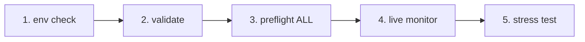
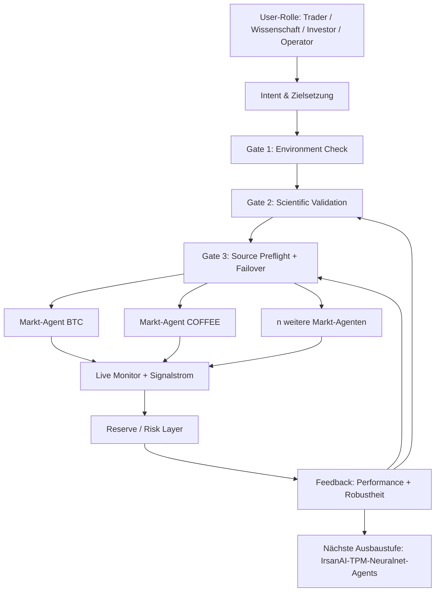

# IrsanAI TPM Agent Forge

[🇬🇧 English](./README.md) | [🇩🇪 Deutsch](./README.de.md)

Ein sauberer Bootstrap für ein autonomes Multi-Agent-Setup (BTC, COFFEE und weitere Märkte) mit plattformübergreifenden Laufoptionen.

## Inhalt

- `production/preflight_manager.py` – robustes Source-Probing mit Alpha-Vantage-Priorität, Fallback-Kette und lokalem Cache-Fallback.
- `production/tpm_agent_process.py` – einfacher Agent-Loop pro Markt.
- `production/tpm_live_monitor.py` – BTC-Live-Monitor mit optionalem CSV-Warmstart und Termux-Benachrichtigungen.
- `core/tpm_scientific_validation.py` – Backtest + statistische Validierung.
- `scripts/tpm_cli.py` – einheitlicher Launcher für Termux/Linux/macOS/Windows.
- `scripts/stress_test_suite.py` – Failover-/Latenz-Stresstest.
- `scripts/start_agents.sh`, `scripts/health_monitor_v3.sh` – Prozess-/Betriebshelfer.
- `core/scout.py`, `core/reserve_manager.py`, `core/init_db_v2.py` – operative Core-Tools.

## Universal Quickstart

```bash
python scripts/tpm_cli.py env
python scripts/tpm_cli.py validate
python scripts/tpm_cli.py preflight --market ALL
python scripts/tpm_cli.py live --history-csv btc_real_24h.csv --poll-seconds 3600
```

## Ablauf- und Kausalketten-Check (Reihenfolge-Sanity)

Der empfohlene Repo-Flow ist bewusst linear, damit keine versteckten Zustandsfehler oder „falsche Sicherheit" im Live-Betrieb entstehen.



### Gate-Logik (was vor dem nächsten Schritt erfüllt sein muss)
- **Gate 1 – Environment:** Python-/Plattform-Kontext ist korrekt (`env`).
- **Gate 2 – Scientific sanity:** Basisverhalten ist reproduzierbar (`validate`).
- **Gate 3 – Source reliability:** Datenquellen + Fallback-Kette sind erreichbar (`preflight --market ALL`).
- **Gate 4 – Runtime execution:** Live-Loop läuft mit bekannter Input-Historie (`live`).
- **Gate 5 – Adversarial confidence:** Latenz-/Failover-Ziele halten unter Last (`stress_test_suite.py`).

✅ Bereits im Code korrigiert: CLI-Preflight unterstützt jetzt `--market ALL` und ist damit konsistent zu Quickstart + Docker-Flow.

## Wähle deine Mission (rollenbasierte CTA)

> **Du bist X? Klick auf deine Spur. Start in <60 Sekunden.**

| Rolle | Was dir wichtig ist | Klick-Pfad | Erster Command |
|---|---|---|---|
| 📈 **Trader** | Schneller Puls, direkt verwertbarer Runtime-Status | [`tpm_live_monitor.py`](./production/tpm_live_monitor.py) | `python scripts/tpm_cli.py live --history-csv btc_real_24h.csv --poll-seconds 3600` |
| 💼 **Investor** | Stabilität, Quellenvertrauen, Resilienz | [`preflight_manager.py`](./production/preflight_manager.py) | `python scripts/tpm_cli.py preflight --market ALL` |
| 🔬 **Wissenschaftler** | Evidenz, Tests, statistisches Signal | [`tpm_scientific_validation.py`](./core/tpm_scientific_validation.py) | `python scripts/tpm_cli.py validate` |
| 🧠 **Theoretiker** | Kausalstruktur + zukünftige Architektur | [`core/scout.py`](./core/scout.py) + [`Nächste Ausbaustufen`](#nächste-ausbaustufen) | `python scripts/tpm_cli.py validate` |
| 🛡️ **Skeptiker (Priorität)** | Annahmen brechen, bevor Produktion startet | [`stress_test_suite.py`](./scripts/stress_test_suite.py) + [`preflight_manager.py`](./production/preflight_manager.py) | `python scripts/tpm_cli.py preflight --market ALL && python scripts/stress_test_suite.py` |
| ⚙️ **Operator / DevOps** | Uptime, Prozessgesundheit, Recoverability | [`start_agents.sh`](./scripts/start_agents.sh) + [`health_monitor_v3.sh`](./scripts/health_monitor_v3.sh) | `bash scripts/start_agents.sh` |

### Skeptiker-Challenge (für neue Besucher empfohlen)
Wenn du **nur eine Sache** testest, dann diese Sequenz und den Report prüfen:

```bash
python scripts/tpm_cli.py preflight --market ALL
python scripts/stress_test_suite.py
```

Wenn diese Spur überzeugt, resoniert in der Regel auch der Rest des Repos.

## Plattform-Hinweise

- **Android / Termux (Samsung etc.)**
  ```bash
  pkg install termux-api -y
  python scripts/tpm_cli.py live --history-csv btc_real_24h.csv --notify --vibrate-ms 1000
  ```
- **iPhone (im Rahmen des Möglichen)**: Shell-Apps wie iSH / a-Shell nutzen. Termux-spezifische Notification-Hooks sind dort nicht verfügbar.
- **Windows / Linux / macOS**: identische CLI-Befehle; für Dauerbetrieb via tmux/Scheduler/cron starten.

## Docker (einfachster Cross-OS-Weg)

```bash
docker compose run --rm tpm-preflight
docker compose run --rm tpm-live
```

Optional für bessere COFFEE-Quelle:

```bash
export ALPHAVANTAGE_KEY="<dein_key>"
docker compose run --rm tpm-preflight
```

## Validierung

Statistische Validierung ausführen:

```bash
python core/tpm_scientific_validation.py
```

Artefakte:
- `state/TPM_Scientific_Report.md`
- `state/TPM_test_results.json`

## Datenquellen & Failover

`production/preflight_manager.py` unterstützt:
- Alpha Vantage zuerst für COFFEE (wenn `ALPHAVANTAGE_KEY` gesetzt ist)
- TradingView + Yahoo als Fallback-Kette
- lokales Cache-Fallback in `state/latest_prices.json`

Preflight direkt ausführen:

```bash
export ALPHAVANTAGE_KEY="<dein_key>"
python production/preflight_manager.py --market ALL
```

Outage-Stresstest (Ziel `p95 < 1000ms`):

```bash
python scripts/stress_test_suite.py
```

Output: `state/stress_test_report.json`


## Nächste Ausbaustufen

- Transfer-Entropy-Modul für Kausalitätsanalyse zwischen Märkten.
- Optimizer mit Policy-Updates auf Basis historischer Performance.
- Alerting (Telegram/Signal) + Boot-Persistenz.

---

## IrsanAI Deep Dive: Wie das Herzstück des TPM Agent "tickt"

> **Kurzform:** TPM ist kein einzelner Bot, sondern ein *entscheidungsökologisches System* aus Daten-Validierung, Markt-Agenten, Feedback-Loops und Governance-Gates.

### 1) Architektonischer Prozessablauf (immersiv)



Interpretation:
- **Links (Intent):** Jede Rolle startet mit anderer Frage, aber im selben sicheren Pipeline-Rahmen.
- **Mitte (Gates):** Keine Runtime ohne überprüfte Daten- und Modellbasis.
- **Rechts (Swarm):** Mehrere Agenten erzeugen kollektive Marktwahrnehmung statt Monoperspektive.

---

### 2) Perspektive "Wissenschaft" (epistemische Qualität)

Der wissenschaftliche Kern liegt nicht nur in "Backtest vorhanden", sondern in einer **stufenweisen Falsifikationskette**:

1. **Reproduzierbarkeit** über `validate`.
2. **Datenquellen-Härtung** über Preflight + Fallback.
3. **Adversarial Testing** über Latenz-/Outage-Simulation.

Warum das zählt:
- Der Agent trennt **Signal** von **Datenartefakt**.
- Er reduziert Scheinsicherheit durch explizite Gates.
- Er erzeugt artefaktbasierte Evidenz (`state/*.json`, Reports), nicht bloß "gefühlte" Performance.

---

### 3) Perspektive "Trader" (entscheidungsnahe Runtime)

Aus Trader-Sicht ist TPM stark, weil es drei Dinge koppelt:

- **Taktische Reaktionsfähigkeit:** Live-Monitoring mit kontrollierter Polling-Frequenz.
- **Operational Trust:** Preflight verhindert blinde Signale bei API-/Quellenproblemen.
- **Kontinuität:** Fallbacks + Cache halten den Prozess lauffähig, auch bei Teil-Ausfällen.

Praktischer Effekt: weniger "Noise-Trading", mehr **zustandsbewusste Entscheidung**.

---

### 4) Perspektive "Investor / Stratege" (Systemresilienz)

TPM ist nicht auf kurzfristigen Output optimiert, sondern auf **persistente Robustheit**:

- Mehrschichtige Datenbeschaffung (Primary + Secondary + Cache).
- Klare Trennung zwischen Validierung, Preflight und Live-Betrieb.
- Stress-Tests als Pflichtteil der Betriebsrealität.

Das verschiebt das Narrativ von "ein Bot trifft Trades" zu **"ein Betriebssystem für verlässliche Agentenentscheidungen"**.

---

### 5) Meta-kognitiver Blick (IrsanAI-Stil)

IrsanAI-Logik bedeutet hier:

- **Der Agent beobachtet nicht nur den Markt, sondern auch sich selbst.**
- **Jede Entscheidung ist kontextgebunden an Datenqualität, Latenz und Modus.**
- **Fehler ("Glitches") sind Diagnosesignale, keine Defekte, die man versteckt.**

Typische Glitches, die bewusst adressiert werden:
- Quelleninstabilität / API-Drift
- Latenzspitzen im Retrieval
- Regimewechsel im Markt (historisches Muster bricht)

Die Architektur antwortet darauf mit: Gatekeeping, Fallback, Monitoring, Re-Validation.

---

### 6) Warum Schwarmintelligenz (BTC + COFFEE + n Märkte) unumkehrbar wird

Einzelagenten sehen lokal. Swarms sehen **Interdependenz**.

Wenn BTC-Agent, Coffee-Agent und weitere Markt-Agenten parallel laufen, entsteht:

- **Cross-Market-Sensitivität** (Frühsignale über Märkte hinweg)
- **Redundanz gegen Blindspots**
- **Emergente Hypothesenbildung** (was isoliert unsichtbar bleibt, wird im Verbund messbar)

Damit wächst TPM von Multi-Agent-Setup zu einem **IrsanAI-TPM-Neuralnet-Ökomikrokosmos**:

- Knoten = spezialisierte Markt-Agenten
- Kanten = Informationsfluss / Kausalbezug
- Plastizität = adaptive Gewichtung je Regime und Qualität

---

### 7) Nächste Ausbaustufe (promotet)

Die nächste Evolutionsstufe ist ein **koordiniertes Meta-Layer** über allen Agenten:

1. **Transfer-Entropy / Kausalitäts-Graphen** als dynamische Verknüpfungsmatrix.
2. **Policy-Orchestrator**, der Agentengewichte nach Regime (Trend, Schock, Sideways) re-kalibriert.
3. **Collective Memory**, die erfolgreiche Reaktionsmuster versionssicher speichert.
4. **Reflexive Governance**, die bei Unsicherheit automatisch in konservative Modi schaltet.

So entsteht aus "mehreren Bots" ein lernendes, kontrollierbares Netzwerk mit wissenschaftlichem Rückgrat.

---

### 8) Rollenbasierter immersiver Einstieg (1-Command-Matrix)

| Rolle | Primäre Frage | Immersiver Start |
|---|---|---|
| 🔬 Wissenschaft | "Ist das Signal robust oder nur Zufall?" | `python scripts/tpm_cli.py validate` |
| 📈 Trader | "Ist der Marktmodus jetzt handelbar?" | `python scripts/tpm_cli.py live --history-csv btc_real_24h.csv --poll-seconds 3600` |
| 💼 Investor | "Wie resilient ist der Betrieb unter Ausfall?" | `python scripts/tpm_cli.py preflight --market ALL` |
| 🛡️ Skeptiker | "Wo bricht das System zuerst?" | `python scripts/stress_test_suite.py` |
| ⚙️ Operator | "Wie halte ich das System gesund im Dauerlauf?" | `bash scripts/start_agents.sh` |

Wenn alle Rollen dieselbe Architektur aus ihrem Blick als sinnvoll erleben, ist das der stärkste Hinweis auf ein tragfähiges TPM-Kernsystem.


### 9) Repo-Resonanzcheck (System im Verbund)

Damit Architektur-Story und reale Ausführung zusammenpassen, gilt im TPM-Kontext dieser Kurz-Check:

- `env` muss Plattform + Python sauber melden (Betriebsbasis).
- `validate` liefert wissenschaftliche Artefakte auch dann, wenn nicht alle internen Tests "grün" sind — entscheidend ist die transparente Reportlage statt Blackbox-Optimismus.
- `preflight --market ALL` bleibt der Realitätsanker für externe Feeds; in restriktiven Netzwerkumgebungen (z. B. 403/Tunnel) zeigt der Output bewusst degradierte Quellverfügbarkeit.
- `stress_test_suite.py` quantifiziert Robustheit trotz Fehlerpfaden (z. B. p95-Latenz unter Zielgrenze bei gleichzeitigen Source-Exceptions).

**Resonanz-Prinzip:** Nicht "alles perfekt", sondern **alles messbar, erklärbar und steuerbar**. Genau daraus entsteht die IrsanAI-typische Betriebssicherheit über Rollen hinweg.
