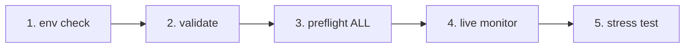

# IrsanAI TPM Agent Forge

[🇬🇧 English](./README.md) | [🇩🇪 Deutsch](./README.de.md) | [🇪🇸 Español](./docs/i18n/README.es.md) | [🇮🇹 Italiano](./docs/i18n/README.it.md) | [🇧🇦 Bosanski](./docs/i18n/README.bs.md) | [🇷🇺 Русский](./docs/i18n/README.ru.md) | [🇨🇳 中文](./docs/i18n/README.zh-CN.md) | [🇫🇷 Français](./docs/i18n/README.fr.md) | [🇧🇷 Português (BR)](./docs/i18n/README.pt-BR.md) | [🇮🇳 हिन्दी](./docs/i18n/README.hi.md) | [🇹🇷 Türkçe](./docs/i18n/README.tr.md) | [🇯🇵 日本語](./docs/i18n/README.ja.md)

Ein sauberes Bootstrap für ein autonomes Multi-Agenten-Setup (BTC, COFFEE und mehr) mit plattformübergreifenden Laufzeitoptionen.

## Was ist enthalten

- `production/preflight_manager.py` – robuste Markterkennung mit Alpha Vantage + Fallback-Kette und lokalem Cache-Fallback.
- `production/tpm_agent_process.py` – einfache Agenten-Schleife pro Markt.
- `production/tpm_live_monitor.py` – Live-BTC-Monitor mit optionalem CSV-Warmstart und Termux-Benachrichtigungen.
- `core/tpm_scientific_validation.py` – Backtest + Pipeline zur statistischen Validierung.
- `scripts/tpm_cli.py` – vereinheitlichter Launcher für Termux/Linux/macOS/Windows.
- `scripts/stress_test_suite.py` – Failover/Latenz-Stresstest.
- `scripts/start_agents.sh`, `scripts/health_monitor_v3.sh` – Helfer für Prozessoperationen.
- `core/scout.py`, `core/reserve_manager.py`, `core/init_db_v2.py` – operative Kern-Tools.

## Universeller Schnellstart

```bash
python scripts/tpm_cli.py env
python scripts/tpm_cli.py validate
python scripts/tpm_cli.py preflight --market ALL
python scripts/tpm_cli.py live --history-csv btc_real_24h.csv --poll-seconds 3600
```

## Laufzeitkettenprüfung (kausale/Reihenfolge-Konsistenz)

Der Standard-Repo-Flow ist absichtlich linear, um Hidden-State-Drift und "falsches Vertrauen" während Live-Läufen zu vermeiden.


```mermaid
flowchart LR
  A[1. env check] --> B[2. validate]
  B --> C[3. preflight ALL]
  C --> D[4. live monitor]
  D --> E[5. stress test]
```

### Gate-Logik (was vor dem nächsten Schritt wahr sein muss)
- **Gate 1 – Umgebung:** Python/Plattform-Kontext ist korrekt (`env`).
- **Gate 2 – Wissenschaftliche Konsistenz:** Basismodellverhalten ist reproduzierbar (`validate`).
- **Gate 3 – Quellenverlässlichkeit:** Marktdaten + Fallback-Kette sind erreichbar (`preflight --market ALL`).
- **Gate 4 – Laufzeitausführung:** Live-Schleife läuft mit bekannter Eingabehistorie (`live`).
- **Gate 5 – Adversarielles Vertrauen:** Latenz-/Failover-Ziele werden unter Stress gehalten (`stress_test_suite.py`).

✅ Bereits im Code behoben: CLI preflight unterstützt jetzt `--market ALL`, passend zum Schnellstart + Docker-Flow.

## Wählen Sie Ihre Mission (rollenbasierter CTA)

> **Sie sind X? Klicken Sie auf Ihre Spur. Starten Sie in <60 Sekunden.**

| Persona | Was Ihnen wichtig ist | Klickpfad | Erster Befehl |
|---|---|---|---|
| 📈 **Trader** | Schneller Puls, umsetzbare Laufzeit | [`tpm_live_monitor.py`](./production/tpm_live_monitor.py) | `python scripts/tpm_cli.py live --history-csv btc_real_24h.csv --poll-seconds 3600` |
| 💼 **Investor** | Stabilität, Quellenvertrauen, Resilienz | [`preflight_manager.py`](./production/preflight_manager.py) | `python scripts/tpm_cli.py preflight --market ALL` |
| 🔬 **Wissenschaftler** | Evidenz, Tests, statistisches Signal | [`tpm_scientific_validation.py`](./core/tpm_scientific_validation.py) | `python scripts/tpm_cli.py validate` |
| 🧠 **Theoretiker** | Kausale Struktur + zukünftige Architektur | [`core/scout.py`](./core/scout.py) + [`Nächste Schritte`](#next-steps) | `python scripts/tpm_cli.py validate` |
| 🛡️ **Skeptiker (Priorität)** | Annahmen vor der Produktion brechen | [`stress_test_suite.py`](./scripts/stress_test_suite.py) + [`preflight_manager.py`](./production/preflight_manager.py) | `python scripts/tpm_cli.py preflight --market ALL && python scripts/stress_test_suite.py` |
| ⚙️ **Operator / DevOps** | Verfügbarkeit, Prozessgesundheit, Wiederherstellbarkeit | [`start_agents.sh`](./scripts/start_agents.sh) + [`health_monitor_v3.sh`](./scripts/health_monitor_v3.sh) | `bash scripts/start_agents.sh` |

### Skeptiker-Challenge (für neue Besucher zuerst empfohlen)
Wenn Sie **nur eine Sache** tun, führen Sie dies aus und überprüfen Sie die Berichtsausgabe:

```bash
python scripts/tpm_cli.py preflight --market ALL
python scripts/stress_test_suite.py
```

Wenn Sie diese Spur überzeugt, wird der Rest des Repositories wahrscheinlich auch Anklang finden.

## Plattformhinweise

- **Android / Termux (Samsung, etc.)**
  ```bash
  bash scripts/termux_bootstrap.sh
  cd ~/TPM-Agent
  python scripts/tpm_cli.py env
  python scripts/tpm_cli.py preflight --market ALL
  python scripts/tpm_cli.py live --history-csv btc_real_24h.csv --notify --vibrate-ms 1000
  ```
  Für eine direkte Android (Termux) Web-UI-Demo starten Sie die Forge-Laufzeit lokal:
  ```bash
  cd ~/TPM-Agent
  bash scripts/termux_forge.sh start
  # stop: bash scripts/termux_forge.sh stop
  # status: bash scripts/termux_forge.sh status
  ```
  Das Skript öffnet den Browser automatisch (falls verfügbar) und hält den Dienst im Hintergrund am Laufen.
  Wenn Sie einen `pydantic-core`/Rust oder `scipy`/Fortran Build-Fehler auf Android sehen, verwenden Sie
  `python -m pip install -r requirements-termux.txt` (Termux-sicherer Satz, keine Rust-Toolchain erforderlich).
  In der Weboberfläche können Sie den Laufzeitstart/-stopp steuern; eine Fortschrittsleiste zeigt den Übergangsstatus an.
- **iPhone (Best Effort)**: Verwenden Sie Shell-Apps wie iSH / a-Shell. Termux-spezifische Benachrichtigungs-Hooks sind dort nicht verfügbar.
- **Windows / Linux / macOS**: Verwenden Sie die gleichen CLI-Befehle; führen Sie sie über tmux/Scheduler/cron für Persistenz aus.

## Docker (einfachster plattformübergreifender Pfad)

Verwenden Sie Docker in dieser genauen Reihenfolge (kein Rätselraten):

### Schritt 1: Erstellen Sie das Web-Laufzeit-Image

```bash
docker compose build --no-cache tpm-forge-web
```

### Schritt 2: Starten Sie den Web-Dashboard-Dienst

```bash
docker compose up tpm-forge-web
```

Öffnen Sie nun `http://localhost:8787` in Ihrem Browser (**nicht** `http://0.0.0.0:8787`). Uvicorn bindet intern an `0.0.0.0`, aber Clients sollten `localhost` (oder die Host-LAN-IP) verwenden.

### Schritt 3 (optionale Prüfungen): Verstehen Sie die Nicht-Web-Dienste

```bash
docker compose run --rm tpm-preflight
docker compose run --rm tpm-live
```

- `tpm-preflight` = Quell-/Konnektivitätsprüfungen (nur CLI-Ausgabe).
- `tpm-live` = Terminal-Live-Monitor-Protokolle (nur CLI-Ausgabe, **keine Web-UI**).
- `tpm-forge-web` = FastAPI + Dashboard-UI (diejenige mit Layout/Fortschritt/Laufzeitsteuerung).

Wenn `tpm-preflight` meldet `ALPHAVANTAGE_KEY not set`, funktioniert COFFEE immer noch über Fallbacks.

Wenn die Seite leer aussieht:
- Testen Sie die API direkt: `http://localhost:8787/api/frame`
- Testen Sie die FastAPI-Dokumentation: `http://localhost:8787/docs`
- Führen Sie einen Hard-Refresh des Browsers durch (`Strg+F5`)
- Falls erforderlich, starten Sie nur den Webdienst neu: `docker compose restart tpm-forge-web`

Optional für bessere COFFEE-Qualität:

```bash
export ALPHAVANTAGE_KEY="<your_key>"
docker compose run --rm tpm-preflight
```

## Glitch-Vorhersagen & mobile Benachrichtigungen

- Das Forge Live Cockpit zeigt jetzt pro Markt kurzfristige Prognosen (`up/down/sideways`) mit Konfidenz unter `/api/markets/live` an.
- Wenn ein Markt-Glitch erkannt wird (Beschleunigungsspitze), kann die Laufzeit auslösen:
  - Termux Toast + Vibration
  - optionaler Benachrichtigungs-/Piepton-Hook
  - optionaler Telegram-Push (wenn Bot-Token/Chat-ID in `config/config.yaml` konfiguriert sind).
- Konfigurieren Sie im Dashboard über **Save Alerts** / **Test Alert** oder API:
  - `GET /api/alerts/preferences`
  - `POST /api/alerts/preferences`
  - `POST /api/alerts/test`

## Validierung

Führen Sie die wissenschaftliche Validierungspipeline aus:

```bash
python core/tpm_scientific_validation.py
```

Artefakte:
- `state/TPM_Scientific_Report.md`
- `state/TPM_test_results.json`

## Quellen & Failover

`production/preflight_manager.py` unterstützt:
- Alpha Vantage zuerst für COFFEE (wenn `ALPHAVANTAGE_KEY` gesetzt ist)
- TradingView + Yahoo Fallback-Kette
- lokaler zwischengespeicherter Fallback in `state/latest_prices.json`

Führen Sie den Preflight direkt aus:

```bash
export ALPHAVANTAGE_KEY="<your_key>"
python production/preflight_manager.py --market ALL
```

Führen Sie einen Ausfall-Stresstest durch (Ziel `p95 < 1000ms`):

```bash
python scripts/stress_test_suite.py
```

Ausgabe: `state/stress_test_report.json`


## Live-Status: Was der TPM-Agent heute leisten kann

**Aktueller Zustand:**
- Die Produktions-Forge-Web-Laufzeit ist verfügbar (`production.forge_runtime:app`).
- Die finanzorientierte Startkonfiguration verwendet **BTC + COFFEE**.
- Live-Frame, Agenten-Fitness, Transferentrophie und Domänenzusammenfassung sind im Web-Dashboard sichtbar.
- Benutzer können neue Markt-Agenten zur Laufzeit hinzufügen (`POST /api/agents`).

**Zielkapazität (Soll-Zustand):**
- Real-Daten-Benchmarking mit expliziten Akzeptanzschwellen (Präzision/Recall/FPR/Drift).
- Strenge reflexive Governance-Regeln für den automatischen Sicherheitsmodus.
- Workflow für kollektives Gedächtnis für versionierte Lernmuster pro Domäne.

**Nächste Ausbaustufe:**
- Regime-basierter Policy-Orchestrator (Trend/Schock/Seitwärts) über alle Agenten hinweg.
- Ein nicht-finanzieller Domänenpilot (z.B. medizinisch oder seismisch) mit expliziten Datenverträgen.


## PR Merge-Konflikt-Helfer

- Merge-Checkliste (GitHub Konflikte): `docs/MERGE_CONFLICT_CHECKLIST.de.md`


### Heutiger Umfang: Windows + Smartphone für Finanz-TPM

- **Windows:** Forge-Laufzeit + Weboberfläche + Docker/PowerShell/Click-Start sind betriebsbereit.
- **Smartphone:** Android/Termux Live-Monitoring ist betriebsbereit; Web-UI ist auf Mobilgeräten responsiv.
- **Echtzeit-Multi-Agent:** BTC + COFFEE standardmäßig aktiv; weitere Märkte können dynamisch in der Web-UI hinzugefügt werden.
- **Quell-Grenzregel:** Wenn der angeforderte Markt nicht von integrierten Quellen abgedeckt wird, geben Sie eine explizite Quell-URL + Autorisierungsdaten an.

## Windows Live-Test (Zwei-Pfade-System)

### Pfad A — Entwickler/Power-User (PowerShell, CMD, PyCharm, IDE)

```powershell
python -m venv .venv
.\.venv\Scripts\Activate.ps1
pip install -r requirements.txt
python scripts/tpm_cli.py forge-dashboard --open-browser --port 8787
```

### Pfad B — Low-Level-Benutzer (Klicken & Starten)

1. Doppelklicken Sie auf `scripts/windows_click_start.bat`
2. Das Skript wählt automatisch den besten verfügbaren Pfad:
   - Python verfügbar -> venv + pip + Laufzeit
   - sonst Docker Compose (falls verfügbar)

Technische Basis: `scripts/windows_bootstrap.ps1`.

## Forge Produktions-Web-Laufzeit (BTC + COFFEE, erweiterbar)

Ja, dies hat **bereits begonnen** im Repo und wird nun erweitert:

- Startet standardmäßig mit einem Finanz-TPM-Agenten für **BTC** und einem für **COFFEE**.
- Benutzer können weitere Märkte/Agenten direkt über die Web-UI hinzufügen (`/api/agents`).
- Läuft als persistenter Laufzeitdienst mit Live-Frame-Ausgabe (`/api/frame`) für immersive Einblicke.

### Start (lokal)

```bash
uvicorn production.forge_runtime:app --host 0.0.0.0 --port 8787
# open http://localhost:8787
```

### Start (Docker)

```bash
docker compose up tpm-forge-web
# open http://localhost:8787
```

## TPM Playground (interaktives MVP)

Sie können TPM-Verhalten jetzt interaktiv im Browser erkunden:

```bash
python -m http.server 8765
# open http://localhost:8765/playground/index.html
```

Beinhaltet:
- Einzelagenten-Ansicht für schwache Signalanomalien
- Mini-Schwarm (BTC/COFFEE/VOL) Konsensdruck
- Domänenübergreifende Transferresonanz (synthetische Finanz-/Wetter-/Gesundheitsdaten)

Siehe: `playground/README.md`.
## Nächste Schritte

- Transferentrophie-Modul für kausale Analysen über Märkte hinweg.
- Optimierer mit Richtlinienaktualisierungen basierend auf historischer Performance.
- Alarmkanäle (Telegram/Signal) + Boot-Persistenz.


---

## IrsanAI Deep Dive: Wie der TPM-Kern in komplexen Systemen „denkt“

### 1) Visionäre Transformation: vom Handelsagenten zum universellen TPM-Ökosystem

### Was ist einzigartig am IrsanAI-TPM-Algorithmus? (korrigierte Formulierung)

Arbeitshypothese des TPM-Kerns:

- In komplexen, chaotischen Systemen verbirgt sich das Frühwarnsignal oft im **Mikro-Residuum**: winzige Abweichungen, schwache Korrelationen, fast leere Datenpunkte.
- Wo klassische Systeme nur `0` oder „nicht genügend Relevanz“ sehen, sucht TPM nach **strukturierten Anomalien** (Glitch-Mustern) im Kontextfluss.
- TPM bewertet nicht nur einen Wert selbst, sondern die **Änderung der Beziehungen über die Zeit, Quellqualität, Regime und kausale Nachbarschaft**.

Wichtiger Korrektheitshinweis: TPM prognostiziert die Zukunft **nicht** auf magische Weise. Es zielt auf eine **frühere probabilistische Erkennung** von Regimewechseln, Ausbrüchen und Störungen ab – wenn Datenqualität und Validierungsgates erfüllt sind.

### Denken Sie GROSS: Warum dies über Finanzen hinausgeht

Wenn TPM schwache Vorläufermuster in Finanzinstrumenten (Index/Ticker/ISIN-ähnliche Kenn