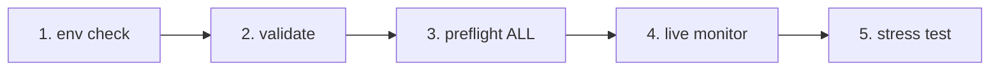

# IrsanAI TPM Agent Forge
[🇬🇧 English](./README.md) | [🇩🇪 Deutsch](./README.de.md) | [🇪🇸 Español](./docs/i18n/README.es.md) | [🇮🇹 Italiano](./docs/i18n/README.it.md) | [🇧🇦 Bosanski](./docs/i18n/README.bs.md) | [🇷🇺 Русский](./docs/i18n/README.ru.md) | [🇨🇳 中文](./docs/i18n/README.zh-CN.md) | [🇫🇷 Français](./docs/i18n/README.fr.md) | [🇧🇷 Português (BR)](./docs/i18n/README.pt-BR.md) | [🇮🇳 हिन्दी](./docs/i18n/README.hi.md) | [🇹🇷 Türkçe](./docs/i18n/README.tr.md) | [🇯🇵 日本語](./docs/i18n/README.ja.md)

[🇬🇧 English](./README.md) | [🇩🇪 Deutsch](./README.de.md) | [🇪🇸 Español](./docs/i18n/README.es.md) | [🇮🇹 Italiano](./docs/i18n/README.it.md) | [🇧🇦 Bosanski](./docs/i18n/README.bs.md) | [🇷🇺 Русский](./docs/i18n/README.ru.md) | [🇨🇳 中文](./docs/i18n/README.zh-CN.md) | [🇫🇷 Français](./docs/i18n/README.fr.md) | [🇧🇷 Português (BR)](./docs/i18n/README.pt-BR.md) | [🇮🇳 हिन्दी](./docs/i18n/README.hi.md) | [🇹🇷 Türkçe](./docs/i18n/README.tr.md) | [🇯🇵 日本語](./docs/i18n/README.ja.md)

Ein sauberes Bootstrap für ein autonomes Multi-Agenten-Setup (BTC, COFFEE und mehr) mit plattformübergreifenden Laufzeitoptionen.

## Enthaltene Komponenten

- `production/preflight_manager.py` – widerstandsfähige Marktquellen-Abfrage mit Alpha Vantage + Fallback-Kette und lokalem Cache-Fallback.
- `production/tpm_agent_process.py` – einfacher Agenten-Loop pro Markt.
- `production/tpm_live_monitor.py` – Live-BTC-Monitor mit optionalem CSV-Warmstart und Termux-Benachrichtigungen.
- `core/tpm_scientific_validation.py` – Backtest- und statistische Validierungspipeline.
- `scripts/tpm_cli.py` – einheitlicher Launcher für Termux/Linux/macOS/Windows.
- `scripts/stress_test_suite.py` – Failover-/Latenz-Stresstest.
- `scripts/start_agents.sh`, `scripts/health_monitor_v3.sh` – Prozess-Operationen Helfer.
- `core/scout.py`, `core/reserve_manager.py`, `core/init_db_v2.py` – operationale Kernwerkzeuge.

## Universeller Schnellstart

```bash
python scripts/tpm_cli.py env
python scripts/tpm_cli.py validate
python scripts/tpm_cli.py preflight --market ALL
python scripts/tpm_cli.py live --history-csv btc_real_24h.csv --poll-seconds 3600
```

## Laufzeit-Kettenprüfung (kausale / Reihenfolge-Validität)

Der Standard-Repo-Flow ist bewusst linear gestaltet, um versteckten Zustandsdrift und „falsches Vertrauen“ während Live-Läufen zu vermeiden.


```mermaid
flowchart LR
  A[1. env check] --> B[2. validate]
  B --> C[3. preflight ALL]
  C --> D[4. live monitor]
  D --> E[5. stress test]
```

### Gate-Logik (Was vor dem nächsten Schritt erfüllt sein muss)
- **Gate 1 – Umgebung:** Python-/Plattform-Kontext ist korrekt (`env`).
- **Gate 2 – Wissenschaftliche Plausibilität:** Basis-Modellverhalten ist reproduzierbar (`validate`).
- **Gate 3 – Quellenvertrauen:** Marktdaten + Fallback-Kette sind erreichbar (`preflight --market ALL`).
- **Gate 4 – Laufzeitausführung:** Live-Loop läuft mit bekannter Input-Historie (`live`).
- **Gate 5 – Adversariale Sicherheit:** Latenz- und Failover-Ziele werden unter Belastung eingehalten (`stress_test_suite.py`).

✅ Bereits im Code korrigiert: CLI preflight unterstützt jetzt `--market ALL`, passend zu Schnellstart + Docker-Flow.

## Wählen Sie Ihre Mission (rollenbasierter Aufruf)

> **Sie sind X? Klicken Sie Ihren Pfad an. Start in <60 Sekunden.**

| Persona | Ihr Fokus | Klickpfad | Erstbefehl |
|---|---|---|---|
| 📈 **Trader** | Schneller Puls, handlungsfähige Laufzeit | [`tpm_live_monitor.py`](./production/tpm_live_monitor.py) | `python scripts/tpm_cli.py live --history-csv btc_real_24h.csv --poll-seconds 3600` |
| 💼 **Investor** | Stabilität, Quellvertrauen, Resilienz | [`preflight_manager.py`](./production/preflight_manager.py) | `python scripts/tpm_cli.py preflight --market ALL` |
| 🔬 **Wissenschaftler** | Evidenz, Tests, statistisches Signal | [`tpm_scientific_validation.py`](./core/tpm_scientific_validation.py) | `python scripts/tpm_cli.py validate` |
| 🧠 **Theoretiker** | Kausale Struktur + zukünftige Architektur | [`core/scout.py`](./core/scout.py) + [`Nächste Schritte`](#next-steps) | `python scripts/tpm_cli.py validate` |
| 🛡️ **Skeptiker (Priorität)** | Annahmen vor Produktion hinterfragen | [`stress_test_suite.py`](./scripts/stress_test_suite.py) + [`preflight_manager.py`](./production/preflight_manager.py) | `python scripts/tpm_cli.py preflight --market ALL && python scripts/stress_test_suite.py` |
| ⚙️ **Operator / DevOps** | Uptime, Prozessgesundheit, Wiederherstellbarkeit | [`start_agents.sh`](./scripts/start_agents.sh) + [`health_monitor_v3.sh`](./scripts/health_monitor_v3.sh) | `bash scripts/start_agents.sh` |

### Skeptiker-Challenge (empfohlen für neue Besucher)
Wenn Sie **nur eine Sache** tun, führen Sie dies aus und prüfen Sie den Bericht:

```bash
python scripts/tpm_cli.py preflight --market ALL
python scripts/stress_test_suite.py
```

Wenn Sie dieser Pfad überzeugt, wird Sie der Rest des Repositories wahrscheinlich ebenfalls ansprechen.

## Plattformhinweise

- **Android / Termux (Samsung etc.)**
  ```bash
  bash scripts/termux_bootstrap.sh
  cd ~/TPM-Agent
  python scripts/tpm_cli.py env
  python scripts/tpm_cli.py preflight --market ALL
  python scripts/tpm_cli.py live --history-csv btc_real_24h.csv --notify --vibrate-ms 1000
  ```
  Für eine direkte Android (Termux) Web-UI-Demo starten Sie die Forge Runtime lokal:
  ```bash
  cd ~/TPM-Agent
  bash scripts/termux_forge.sh start
  # stop: bash scripts/termux_forge.sh stop
  # status: bash scripts/termux_forge.sh status
  ```
  Das Script öffnet automatisch den Browser (sofern verfügbar) und hält den Dienst im Hintergrund aktiv.
  Wenn Sie einen `pydantic-core`/Rust- oder `scipy`/Fortran-Build-Fehler auf Android gesehen haben, installieren Sie mit
  `python -m pip install -r requirements-termux.txt` (Termux-sichere Auswahl, keine Rust-Toolchain notwendig).
  In der Web-Oberfläche können Sie Laufzeit-Start/Stop steuern; eine Fortschrittsanzeige zeigt den Übergangsstatus.
- **iPhone (best effort)**: Verwenden Sie Shell-Apps wie iSH / a-Shell. Termux-spezifische Benachrichtigungshooks sind dort nicht verfügbar.
- **Windows / Linux / macOS**: Nutzen Sie dieselben CLI-Kommandos; idealerweise via tmux/scheduler/cron für Persistenz.

## Docker (plattformübergreifend einfachster Weg)

Verwenden Sie Docker in genau folgender Reihenfolge (kein Raten):

### Schritt 1: Web-Runtime-Image bauen

```bash
docker compose build --no-cache tpm-forge-web
```

### Schritt 2: Web-Dashboard Service starten

```bash
docker compose up tpm-forge-web
```

Öffnen Sie nun `http://localhost:8787` in Ihrem Browser (**nicht** `http://0.0.0.0:8787`). Uvicorn bindet intern an `0.0.0.0`, Clients sollen aber `localhost` (oder LAN-IP des Hosts) nutzen.

### Schritt 3 (optionale Checks): Nicht-Web-Dienste verstehen

```bash
docker compose run --rm tpm-preflight
docker compose run --rm tpm-live
```

- `tpm-preflight` = Quell-/Konnektivitäts-Checks (nur CLI-Ausgabe).
- `tpm-live` = Terminal Live-Monitor Logs (nur CLI-Ausgabe, **keine Web-UI**).
- `tpm-forge-web` = FastAPI + Dashboard UI (mit Layout, Fortschritt, Runtime-Kontrolle).

Wenn `tpm-preflight` meldet `ALPHAVANTAGE_KEY not set`, funktioniert COFFEE weiterhin über Fallbacks.

Wenn die Seite leer erscheint:
- API direkt testen: `http://localhost:8787/api/frame`
- FastAPI-Dokumentation: `http://localhost:8787/docs`
- Browser komplett neu laden (`Ctrl+F5`)
- Falls nötig, nur Webservice neu starten: `docker compose restart tpm-forge-web`

Optional für bessere COFFEE-Qualität:

```bash
export ALPHAVANTAGE_KEY="<Ihr_Schlüssel>"
docker compose run --rm tpm-preflight
```

## Glitch-Vorhersagen & mobile Alerts

- Das Forge Live-Cockpit zeigt jetzt pro Markt eine kurzfristige Prognose (`up/down/sideways`) mit Konfidenz unter `/api/markets/live`.
- Wird ein Markt-Glitch erkannt (Beschleunigungsspitze), kann der Runtime folgende Aktionen auslösen:
  - Termux-Toast + Vibration
  - optionaler Benachrichtigungs-/Signalton-Hook
  - optionaler Telegram-Push (wenn Bot-Token/Chat-ID in `config/config.yaml` konfiguriert).
- Einstellungen im Dashboard über **Save Alerts** / **Test Alert** oder API:
  - `GET /api/alerts/preferences`
  - `POST /api/alerts/preferences`
  - `POST /api/alerts/test`

## Validierung

Führen Sie die wissenschaftliche Validierungspipeline aus:

```bash
python core/tpm_scientific_validation.py
```

Artefakte:
- `state/TPM_Scientific_Report.md`
- `state/TPM_test_results.json`

## Quellen & Failover

`production/preflight_manager.py` unterstützt:
- Alpha Vantage als erste Wahl für COFFEE (wenn `ALPHAVANTAGE_KEY` gesetzt ist)
- TradingView + Yahoo Fallback-Kette
- Lokales Cache-Fallback in `state/latest_prices.json`

Direkt Preflight ausführen:

```bash
export ALPHAVANTAGE_KEY="<Ihr_Schlüssel>"
python production/preflight_manager.py --market ALL
```

Ausfall-Stresstest ausführen (Ziel `p95 < 1000ms`):

```bash
python scripts/stress_test_suite.py
```

Ausgabe: `state/stress_test_report.json`


## Live-Status: Was der TPM-Agent heute kann

**Aktueller Stand:**
- Produktions-Forge-Web-Laufzeit ist verfügbar (`production.forge_runtime:app`).
- Finanz-fokussierte Startkonfiguration verwendet **BTC + COFFEE**.
- Live-Frame, Agent-Fitness, Transfer-Entropy und Domänenübersicht sind im Web-Dashboard sichtbar.
- Nutzer können zur Laufzeit neue Marktagenten hinzufügen (`POST /api/agents`).

**Ziel-Fähigkeiten (Soll):**
- Reales Benchmarking mit expliziten Akzeptanzschwellen (Precision/Recall/FPR/Drift).
- Strenge reflexive Governance-Regeln für automatischen Safe-Modus.
- Kollektiver Memory-Workflow für versionierte domänenspezifische Lernmuster.

**Nächste Ausbaustufe:**
- Regime-basierter Policy-Orchestrator (Trend/Schock/Sideways) über alle Agenten.
- Ein Domänenpilot außerhalb Finanzen (z. B. Medizin oder Seismik) mit klaren Datenverträgen.


## PR Merge-Konflikt-Hilfe

- Merge-Checkliste (GitHub Konflikte): `docs/MERGE_CONFLICT_CHECKLIST.de.md`


### Heuteiger Fokus: Windows + Smartphone für Finance TPM

- **Windows:** Forge Runtime + Web-Interface + Docker/PowerShell/Klickstart funktionsfähig.
- **Smartphone:** Android/Termux Live-Monitoring funktionsfähig; Web-UI ist mobil responsiv.
- **Echtzeit-Multi-Agent:** BTC + COFFEE standardmäßig aktiv; weitere Märkte können dynamisch in Web UI hinzugefügt werden.
- **Quellgrenzen-Regel:** Wenn angefragter Markt nicht durch eingebaute Quellen abgedeckt ist, werden explizite Quellen-URLs + Autorisierungsdaten bereitgestellt.

## Windows Live-Test (Zwei-Pfad-System)

### Pfad A — Entwickler/Power-User (PowerShell, CMD, PyCharm, IDE)

```powershell
python -m venv .venv
.\.venv\Scripts\Activate.ps1
pip install -r requirements.txt
python scripts/tpm_cli.py forge-dashboard --open-browser --port 8787
```

### Pfad B — Low-Level-User (Klick & Start)

1. Doppelklick auf `scripts/windows_click_start.bat`
2. Script wählt automatisch den besten verfügbaren Pfad aus:
   - Python vorhanden -> venv + pip + Runtime
   - andernfalls Docker Compose (wenn verfügbar)

Technische Basis: `scripts/windows_bootstrap.ps1`.

## Forge Production Web Runtime (BTC + COFFEE, erweiterbar)

Ja, dieser Fokus wurde bereits im Repo gestartet und wird aktuell ausgebaut:

- Startet standardmäßig mit einem Finance-TPM-Agenten für **BTC** und einem für **COFFEE**.
- Nutzer können weitere Märkte/Agenten direkt über das Web UI (`/api/agents`) hinzufügen.
- Läuft als persistenter Runtime-Dienst mit Live-Frame-Ausgabe (`/api/frame`) für immersive Einblicke.

### Start (lokal)

```bash
uvicorn production.forge_runtime:app --host 0.0.0.0 --port 8787
# http://localhost:8787 öffnen
```

### Start (Docker)

```bash
docker compose up tpm-forge-web
# http://localhost:8787 öffnen
```

## TPM Playground (interaktives MVP)

Erkunden Sie jetzt das TPM-Verhalten interaktiv im Browser:

```bash
python -m http.server 8765
# http://localhost:8765/playground/index.html öffnen
```

Beinhaltet:
- Einzelagenten-Schwachsignal-Anomalie-Ansicht
- Mini-Schwarm (BTC/COFFEE/VOL) Konsens-Druck
- Cross-Domain Transfer-Resonanz (synthetisch: Finanzen/Wetter/Gesundheit)

Siehe: `playground/README.md`.

## Nächste Schritte

- Transfer-Entropy-Modul für cross-market kausale Analyse.
- Optimierer mit Policy-Updates basierend auf historischer Performance.
- Alarmkanäle (Telegram/Signal) + Boot-Persistenz.


---

## IrsanAI Deep Dive: Wie der TPM-Kern in komplexen Systemen „denkt“

### 1) Visionäre Transformation: Vom Trading-Agent zum universellen TPM-Ökosystem

### Was ist das Besondere am IrsanAI-TPM-Algorithmus? (korrigierte Einordnung)

Arbeitshypothese des TPM-Kerns:

- In komplexen, chaotischen Systemen ist das Frühwarnsignal oft in den **Mikroresiduen** verborgen: winzige Abweichungen, schwache Korrelationen, fast leere Datenpunkte.
- Wo klassische Systeme nur `0` oder „nicht ausreichend relevant“ sehen, sucht TPM nach **strukturierten Anomalien** (Glitch-Mustern) im Kontextfluss.
- TPM bewertet nicht nur einen Einzelwert, sondern die **Veränderung von Beziehungen über Zeit, Quellenqualität, Regime und kausale Nachbarschaft**.

Wichtiger Korrektheits-Hinweis: TPM sagt die Zukunft **nicht** magisch voraus. Es zielt auf eine **frühere probabilistische Erkennung** von Regimewechseln, Ausbrüchen und Störungen ab – wenn Datenqualität und Validierungsgates erfüllt sind.

### Denken Sie groß: Warum das über Finanzen hinausgeht

Wenn TPM schwache Präfigurmuster in Finanzinstrumenten (Index/Ticker/ISIN-ähnliche IDs, Liquidität, Mikrostruktur) erkennt, lässt sich dieses Prinzip auf viele Domänen übertragen:

- **Ereignis-/Sensorstrom + Kontextmodell + Anomalielage + Rückkopplungsschleife**
- Jede Profession lässt sich als „Markt“ mit domänenspezifischen Features, Knoten, Korrelationen und Anomalien modellieren.
- Spezialisierte TPM-Agenten können domänenübergreifend lernen und dennoch lokale fachliche Logik und Ethik bewahren.

### 100 Berufe als TPM-Zielräume

| # | Beruf | TPM-Datenanalogon | Ziel der Anomalie-/Mustererkennung |
|---|---|---|---|
| 1 | Polizeianalyst | Vorfalllogs, geotemporale Kriminalitätskarten, Netzwerke | Frühsignale eskalierender Kriminalitätscluster |
| 2 | Feuerwehrkommandant | Alarmketten, Sensorfeeds, Wetter, Gebäudeprofile | Prognose von Brand-/Gefahren-Ausbreitungsfenstern |
| 3 | Rettungssanitäter/EMS | Dispatch-Gründe, Einsatzzeiten, Krankenhausauslastung | Kapazitätsstress vor Ausfall erkennen |
| 4 | Notfallarzt | Triage-Fluss, Vitalwerte, Wartezeitdynamik | Kritische Dekompensation frühzeitig melden |
| 5 | Intensivpflegekraft | Beatmungs-/Labordaten, Medikamentenreaktionen | Sepsis-/Schock-Mikrosignale identifizieren |
| 6 | Epidemiologe | Fallzahlen, Mobilität, Abwasser/Labordaten | Ausbruchfrühwarnung vor exponentieller Phase |
| 7 | Hausarzt | EHR-Muster, Verschreibungen, Lücken bei Kontrolluntersuchungen | Frühzeitige Risikoübergänge bei chronischen Erkrankungen |
| 8 | Klinischer Psychologe | Sitzungsverläufe, Sprachmarker, Schlaf/Aktivität | Rückfall-/Krisenindikatoren früher erkennen |
| 9 | Pharmaforscher | Wirkstoffscreenings, Nebenwirkungsprofile, Genomik | Verborgene Wirksamkeits-/Nebenwirkungscluster enthüllen |
| 10 | Biotechnologe | Sequenz-/Prozess-/Zellkulturtrajektorien | Drift- und Kontaminationsrisiken detektieren |
| 11 | Klimawissenschaftler | Atmosphären-/Ozean-Zeitreihen, Satellitenfelder | Kipppunkt-Vorläufer erkennen |
| 12 | Meteorologe | Druck/Feuchtigkeit/Wind/Radar-Daten | Lokale chaotische Wetterumschwünge vorhersagen |
| 13 | Seismologe | Mikro-Erdbeben, Spannungsfelder, Sensor-Arrays | Vorläufer großer Spannungsentladungen erkennen |
| 14 | Vulkanologe | Gas, Erschütterungen, Deformationszeitreihen | Eng begrenzte Ausbruchswahrscheinlichkeitsfenster benennen |
| 15 | Hydrologe | Flusspegel, Niederschlag, Bodenfeuchte | Flash-Flood- und Dürrephasenwechsel detektieren |
| 16 | Ozeanograph | Strömungen, Temperatur, Salzgehalt, Bojenströme | Tsunami-/ökosystemrelevante Anomalien finden |
| 17 | Energetiker (Trader) | Last, Spotpreise, Wetter, Netzstatus | Frühzeitige Signale für Preis/Last-Brüche |
| 18 | Netzbetreiber | Netfrequenz, Leitungsstatus, Schaltvorgänge | Risiko kaskadierender Ausfälle identifizieren |
| 19 | Windparkbetreiber | Turbinentelemetrie, Windfelder, Wartungslogs | Ausfälle und Leistungsdrift vorhersagen |
| 20 | Solarparkbetreiber | Einstrahlung, Wechselrichterdaten, thermische Last | Degradations- und Ertragsanomalien erkennen |
| 21 | Wasserversorger | Durchfluss, Qualitätssensoren, Verbrauchsmuster | Kontamination/Mangel frühzeitig erkennen |
| 22 | Verkehrsleiter | Dichte, Unfälle, Baustellen, Events | Stau- und Unfalleskalation prognostizieren |
| 23 | Bahnsteuerung | Fahrpläneinhaltung, Gleisstatus, Verspätungsketten | Systemische Verspätungskaskaden frühzeitig durchbrechen |
| 24 | Fluglotsen | Flugbahnen, Wetter, Slot-Sättigung | Konfliktwege und Engpässe detektieren |
| 25 | Hafenlogistik | Liegezeiten, Containerfluss, Zollstatus | Lieferkettenausfall-Vorläufer erkennen |
| 26 | Supply-Chain-Manager | ETA, Inventar, Nachfragetrends, Risikoevents | Bullwhip- und Ausfallanomalien minimieren |
| 27 | Fertigungsleiter | OEE, Prozess-Telemetrie, Ausschuss, Rüstzeiten | Qualitätsdrift und Maschinenanomalien identifizieren |
| 28 | Qualitätsingenieur | Toleranzverteilungen, Prozesssignale | Nahe Null Fehler-Vorläufer aufdecken |
| 29 | Robotikingenieur | Bewegungsbahnen, Aktuatorlast, Steuerloops | Steuerungsinstabilität/-ausfall vorhersagen |
| 30 | Luftfahrt-Instandhalter | Triebwerk-/Flugtelemetrie, Wartungshistorie | Komponenten-Ebene Prädiktive Wartung |
| 31 | Bauleiter | Fortschritt, Wetter, Liefertermine, IoT-Sensoren | Risiko für Termin-/Kostenabweichungen quantifizieren |
| 32 | Tragwerksingenieur | Last, Vibration, Ermüdungs-/Alterungsindikatoren | Strukturell kritische Übergänge früh erkennen |
| 33 | Stadtplaner | Mobilität, Demografie, Emissionen, Flächennutzung | Aufkommende urbane Stressmuster finden |
| 34 | Architekt | Gebäudebetrieb, Belegung, Energieverläufe | Design-Nutzungs-Mismatch-Muster erkennen |
| 35 | Landwirt | Boden-/Wetter-/Ernte-/Marktdatenströme | Erkrankungs-/Ertragsanomalien frühzeitig erkennen |
| 36 | Agronom | Satellitendaten zu Nährstoff/Hydration | Zielgenaue Interventionen früh initiieren |
| 37 | Forstmanager | Feuchtigkeit, Schädlingsmuster, Brandindikatoren | Forstschäden/Brandfenster früh erkennen |
| 38 | Fischereimanager | Fangdaten, Wasserqualität, Migration | Überfischungs-/Kollapsrisiken erkennen |
| 39 | Lebensmittelsicherheitsinspektor | Labordaten, Kühlketten-Logs, Lieferketten | Kontaminationsketten frühzeitig unterbrechen |
| 40 | Chefkoch | Nachfragepulse, Lagergesundheit, Abfallraten | Verderb- und Mangelanomalien minimieren |
| 41 | Einzelhändler | POS-Daten, Kundenfrequenz, Lagerumschlag | Nachfragesteigerungen und Schwund erkennen |
| 42 | E-Commerce-Manager | Klickstrom, Warenkorbverläufe, Retouren | Betrugs-/Abwanderungsvorläufer finden |
| 43 | Marketinganalyst | Kampagnenmetrik, Segmentreaktionen | Mikrotendenzen vorm Mainstream erkennen |
| 44 | Sales-Lead | Pipeline-Geschwindigkeit, Kontaktgraph | Deal-Risiko und Timing-Gelegenheiten erkennen |
| 45 | Kundenservice-Leiter | Ticket-Fluss, Themencluster, SLA-Drift | Eskalations-/Ursachenwellen erkennen |
| 46 | Produktmanager | Feature-Adaption, Retention, Feedback | Produkt-Markt-Mismatch früh erkennen |
| 47 | UX-Forscher | Heatmaps, Pfade, Absprungpunkte | Versteckte Interaktionsprobleme aufdecken |
| 48 | Softwareentwickler | Logs, Traces, Deploy-Metriken | Fehler-Kaskaden vor Incident erkennen |
| 49 | Site Reliability Engineer | Latenz, Fehlerbudgets, Auslastung | Degradierung vor Ausfällen erfassen |
| 50 | Cybersecurity-Analyst | Netzwerkflüsse, IAM-Events, SIEM-Alerts | Angriffswege und Laterale Bewegung erkennen |
| 51 | Betrugsanalyst | Transaktionsgraphen, Gerätefingerprints | Betrug im Schwachsignalraum identifizieren |
| 52 | Bank-Risikomanager | Portfolio/Makro/Liquiditäts-Exposures | Stressregime und Konzentrationsrisiken erkennen |
| 53 | Versicherungsaktuare | Schadenverlauf, Exposure-Karten, Klimabezug | Schadenswellen- und Reservestress prognostizieren |
| 54 | Steuerberater | Ledger-Muster, Einreichungsfristen | Compliance-Risiken und Optimierung erkennen |
| 55 | Wirtschaftsprüfer | Kontrollspuren, Ausnahme-Muster | Buchhaltungsanomalien im großen Stil erkennen |
| 56 | Rechtsanwalt | Fallchronologie, Präzedenzgraphen, Fristen | Prozessrisiken und -ergebnis-Muster erkennen |
| 57 | Richter / Gerichtsverwaltung | Fallmischung, Zykluszeiten | Engpässe im Justizsystem erkennen |
| 58 | Justizvollzugsleiter | Belegung, Vorfallsnetzwerke, Verhaltensmuster | Gewalt- und Rückfälligkeitscluster erkennen |
| 59 | Zollbeamter | Handelsmanifeste, Deklarationen, Routenmuster | Schmuggel- und Umgehungssignale erkennen |
| 60 | Militärische Geheimdienste-Analyst | ISR-Feeds, Logistik, Operationstempo | Eskalationsdynamiken früh erkennen |
| 61 | Diplomatischer Analyst | Ereignisketten, Kommunikationssignale | Geopolitische Regimewechsel erkennen |
| 62 | Lehrer | Lernfortschritt, Anwesenheit, Engagement | Dropout-Risiko und Förderbedarf erkennen |
| 63 | Schulleiter | Leistungskluster, Anwesenheit, Ressourcen | Systemische Schulstressmuster erkennen |
| 64 | Hochschuldozent | Kursaktivität, Rücktritte, Feedback | Studierenderfolg früher stabilisieren |
| 65 | Bildungsforscher | Kohortentrajektorien, pädagogische Variablen | Robuste Interventionseffekte identifizieren |
| 66 | Sozialarbeiter | Fallnetzwerke, Termine, Risikomarker | Kriseneskalationspfade erkennen |
| 67 | NGO-Koordinator | Feldberichte, Hilfsströme, Bedarfssignale | Wirkungslücken und Hotspot-Veränderungen erkennen |
| 68 | Arbeitsvermittler | Skillprofile, Arbeitsnachfrage, Übergänge | Qualifikationslücken und Upskilling erkennen |
| 69 | HR-Manager | Einstellungs-/Fluktuations-/Performance-Verläufe | Burnout und Retentionsrisiken früh erkennen |
| 70 | Personalvermittler | Funnel-Raten, Skill-Taxonomie, Marktimpulse | Passungsrisiko und Einstellungsfenster erkennen |
| 71 | Organisationsberater | Entscheidungsrhythmus, KPI-Drift, Netzwerk-Muster | Teaminstabilitäten früh erkennen |
| 72 | Projektmanager | Meilensteine, Abhängigkeiten, Blocker-Graph | Termin-/Umfangsbrüche antizipieren |
| 73 | Journalist | Quellenvertrauensgraph, Ereignisströme | Falschmeldungscluster früh erkennen |
| 74 | Investigativer Reporter | Dokumentnetzwerke, Geld-/Kommunikationsspuren | Verborgene systemische Anomalien entlarven |
| 75 | Content-Moderator | Post-/Kommentarströme, semantische Verschiebungen | Missbrauchs-/Radikalisierungswellen früh erkennen |
| 76 | Künstler | Publikum-Reaktionsverläufe, Stilvektoren | Aufkommende Ästhetiken erkennen |
| 77 | Musikproduzent | Hörmerkmale, Arrangementvektoren | Durchbruch- und Nischenpotenziale früh erkennen |
| 78 | Game-Designer | Telemetrie, Progression, Abwanderungskurven | Frustrations- und Balancing-Anomalien erkennen |
| 79 | Sporttrainer | Leistungs-/Biometrische Belastungsströme | Verletzungs- und Formeinbruchssignale erkennen |
| 80 | Athletiktrainer | Bewegungs-/Erholungsmarker | Überlastungen vor Ausfällen erkennen |
| 81 | Sportarzt | Diagnostik, Reha-Last, Rückfallrisiko | Return-to-Play-Zeitfenster optimieren |
| 82 | Schiedsrichter-Analyst | Entscheidungsstrom, Tempo, Vorfallskontext | Konsistenz- und Fairness-Drift erkennen |
| 83 | Eventmanager | Ticketing, Mobilität, Wetter, Sicherheitsfeeds | Besucher- und Sicherheitsrisiken eskalieren |
| 84 | Tourismusmanager | Buchungsmuster, Reputationssignale | Nachfrage- und Stimmungsschwankungen erkennen |
| 85 | Hotelmanager | Belegung, Servicequalität, Beschwerden | Qualität/Nachfrageinstabilitäten früh entdecken |
| 86 | Immobilienverwalter | Mieteinnahmen, Wartung, Marktvergleiche | Leerstands- und Zahlungsausfallrisiko erkennen |
| 87 | Facility-Manager | Gebäude-IoT, Energie, Wartungsintervalle | Ausfälle und Ineffizienzmuster erkennen |
| 88 | Abfallwirtschaftsbetreiber | Abfallströme, Routen, Umweltmetriken | Illegale Entsorgung und Prozesslücken erkennen |
| 89 | Umweltinspektor | Emissionen, Berichte, Satellitenüberlagerungen | Compliance-Verstöße und Kipppunkte erkennen |
| 90 | Circular Economy Analyst | Materialpässe, Rückgewinnungsraten | Verluste und Kreislaufschlusschancen erkennen |
| 91 | Astrophysiker | Teleskopströme, Spektren, Rauschmodelle | Seltene kosmische Ereignisse erkennen |
| 92 | Raumfahrtoperationsingenieur | Telemetrie, Orbitparameter, Systemdiagnostik | Missionskritische Anomalien früh erkennen |
| 93 | Quanteningenieur | Rauschprofile, Kalibrierungsdrift, Gate-Fehler | Dekohärenz- und Steuerdrift erkennen |
| 94 | Data Scientist | Feature-Drift, Modellqualität, Datenintegrität | Modellzusammenbruch und Bias-Verschiebung erkennen |
| 95 | KI-Ethiker | Entscheidungsresultate, Fairnessmetriken | Ungerechte Muster und Governance-Lücken erkennen |
| 96 | Wissenschaftsphilosoph | Theorie-Evidenz-Pfade | Paradigmenfehlanpassungen erkennen |
| 97 | Mathematiker | Residualstrukturen, Invarianten, Fehlerterme | Verborgene Regelmäßigkeiten und Ausreißer erkennen |
| 98 | Systemtheoretiker | Knoten-Kanten-Dynamiken, Feedback-Verzögerungen | Tipping-Dynamiken im Netzwerk erkennen |
| 99 | Anthropologe | Feldbeobachtungen, Sprache/Soziale Netzwerke | Kulturelle Konfliktvorläufer erkennen |
| 100 | Zukunftsstratege | Technologiekurven, Regulierung, Verhaltensdaten | Szenarien mit Frühindikatoren verbinden |

### Länder-spezifische Hinweise (Berufsequivalenz quer zu Jurisdiktionen)

Um die Liste logischerweise über Regionen richtig zu halten, soll die TPM-Rollenzuordnung als **funktionale Äquivalenz**, nicht als wörtliche Jobtitelübersetzung verstanden werden:

- **Deutschland ↔ USA/UK:** `Polizei` vs aufgeteilte Funktionen (`Police Department`, `Sheriff`, `State Trooper`) und Unterschiede bei Staatsanwaltschaft (`Staatsanwaltschaft` vs `District Attorney/Crown Prosecution`).
- **Spanien / Italien:** Zivilrechtssysteme mit separaten Gerichts- und Polizeiprozessen; Datenpipelines oft regional/national geteilt.
- **Bosnien und Herzegowina:** Mehrgliedrige Governance mit fragmentiertem Datenbesitz; TPM profitiert von föderierter Anomaliefusion.
- **Russland / China:** Rollen-Definition und Datenschutz-Beschränkungen unterschiedlich; TPM muss lokale Compliance-Grenzen und institutionelle Äquivalente berücksichtigen.
- **Weitere relevante Regionen:** Frankreich, Brasilien, Indien, Japan, MENA-Staaten und Subsahara-Afrika können durch Mapping entsprechender Funktionen und Telemetrie eingebunden werden.

### Philosophisch-wissenschaftliche Perspektive

- Vom Werkzeug zur **epistemischen Infrastruktur**: Domänen operationalisieren „schwaches Frühwissen“.
- Von isolierten Systemen zu **Agenten-Föderationen**: lokale Ethik + gemeinsame Anomalie-Grammatik.
- Von reaktiver Reaktion zu **antizipativer Governance**: Prävention vor verspäteter Krisensteuerung.
- Von statischen Modellen zu **lebendigen Theorien**: kontinuierliche Neukalibrierung unter Realweltschocks.

Kernidee: Ein verantwortungsvoll geführter TPM-Cluster kann das Chaos nicht kontrollieren — aber er kann Institutionen helfen, es früher zu verstehen, robuster zu steuern und menschlicher zu entscheiden.

## Mehrsprachiger Ausbau (in Arbeit)

Zur Unterstützung sprachübergreifender Resonanz sind lokalisierte strategische Übersichten verfügbar in:

- Spanisch (`docs/i18n/README.es.md`)
- Italienisch (`docs/i18n/README.it.md`)
- Bosnisch (`docs/i18n/README.bs.md`)
- Russisch (`docs/i18n/README.ru.md`)
- Chinesisch (vereinfacht) (`docs/i18n/README.zh-CN.md`)
- Französisch (`docs/i18n/README.fr.md`)
- Portugiesisch Brasilien (`docs/i18n/README.pt-BR.md`)
- Hindi (`docs/i18n/README.hi.md`)
- Türkisch (`docs/i18n/README.tr.md`)
- Japanisch (`docs/i18n/README.ja.md`)

Jede lokalisierte Datei enthält regionsspezifische Hinweise und verweist zurück auf diesen kanonischen englischen Abschnitt mit der vollständigen 100-Berufe-Matrix.

## IrsanAI Quality Meta (SOLL vs IST)

Für den aktuellen Reifegrad des Repos, den Qualitätszwischenstand und die kausale Roadmap basierend auf realen Nutzererwartungen siehe:

- `docs/IRSANAI_QUALITY_META.md`

Dieses Dokument ist ab sofort Referenz für:
- Anspruchstiefe bei Features (UX/UI + operative Robustheit),
- Docker/Android-Paritätsanforderungen,
- sowie Akzeptanz-Qualitätsgates für kommende PRs.

## i18n-Paritätsmodus (vollständiges Spiegeln)

Um sicherzustellen, dass keine Sprachgemeinschaft benachteiligt wird, werden i18n-Dateien jetzt vollständig kanonisch synchron mit `README.md` gepflegt.

Sync-Befehl:

```bash
python scripts/i18n_full_mirror_sync.py
```

## Hinweis für Entwickler (LOP – Liste offener Punkte)

Was aus meiner Sicht noch offen ist (fachlich, nicht technisch blockiert):

| Punkt | Aktueller Stand | Wie man sinnvoll fortsetzt |
|---|---|---|
| **Transfer-Entropy-Modul für Cross-Market-Kausalität** | **Erledigt ✅** – als `TransferEntropyEngine` implementiert und im Forge-Orchestrator verdrahtet. | Fachliche Kalibrierung ergänzen: domänenspezifische Schwellen und Interpretationsregeln definieren. |
| **Optimizer/Policy-Update auf Basis Historie** | **Erledigt ✅** – Fitness-Scoring, Reward-Update und Candidate-Culling laufen im Tick-Zyklus. | Betriebsmodi dokumentieren (konservativ/aggressiv) und als Governance-Profile testbar machen. |
| **Alerting (Telegram/Signal)** | **Teilweise erledigt 🟡** – Infrastruktur ist vorhanden, standardmäßig aber deaktiviert. | Alarmrichtlinie festlegen: welche Events, welche Schweregrade, welcher Kanal, wer reagiert. |
| **Boot-Persistenz / Dauerbetrieb** | **Teilweise erledigt 🟡** – Start- und Health-Monitoring per tmux existieren, aber kein einheitliches Boot-Runbook für alle Zielplattformen. | Plattformprofile (Termux/Linux/Docker) mit Start-bei-Boot, Restart-Policy und Eskalationspfad schriftlich definieren. |
| **Koordiniertes Meta-Layer (aus „Nächste Ausbaustufe (promotet)“)** | **Teilweise erledigt 🟡** – Teile sind vorhanden (Orchestrator + Entropie + Reward), aber noch nicht als vollständiger Regime-Policy-Orchestrator beschrieben. | Ein explizites fachliches Steuerungsmodell (Trend/Schock/Sideways) für Agentengewichte ergänzen. |
| **Collective Memory (versionssicheres Lernmuster-Archiv)** | **Offen 🔴** – in den Vision/Weiterentwicklungsabschnitten genannt, aber noch ohne klaren fachlichen Speicher- und Review-Prozess. | Lernmuster-Format, Versionslogik und Qualitätskriterien (wann Muster „gültig“ wird) definieren. |
| **Reflexive Governance (automatisch konservativer Modus bei Unsicherheit)** | **Offen 🔴** – als Zielbild benannt, aber noch nicht als fachliche Entscheidungsregel formalisiert. | Unsicherheitsindikatoren und harte Umschaltbedingungen in ein Governance-Regelwerk überführen. |
| **Domänenausbau über Finance/Weather hinaus** | **Offen 🔴** – weitere Domänen sind als Vision/Templates angelegt, aber fachlich noch nicht in produktive Datenverträge überführt. | Einen nächsten Domänenpiloten (z. B. Medical oder Seismic) mit klaren Metriken und Datenquellen starten. |
| **Wissenschaftliche Evidenz auf Realdaten erweitern** | **Offen 🔴** – aktuelle Validierung ist robust, jedoch auf synthetischen Regime-Segmenten aufgebaut. | Realdaten-Benchmarking mit festen Akzeptanzkriterien (Precision/Recall/FPR/Drift) ergänzen. |
| **Sprachübergreifende Resonanz / i18n-Ausbau** | **Teilweise erledigt 🟡** – mehrere Sprach-Landingpages existieren; Ausbau ist explizit als „in progress“ markiert. | Synchronisationsprozess definieren (wann Änderungen aus Root-README in alle i18n-READMEs propagiert werden). |

Kurzfazit: Die früheren „Next Steps“ sind **technisch zu großen Teilen gestartet oder umgesetzt**; der größte Hebel liegt jetzt in **fachlicher Operationalisierung** (Governance, Policies, Domänenlogik, Realdaten-Evidenz) und **konsistentem Doku-/i18n-Betrieb**.

### LOP-Ausführungsplan

Für Implementierungsreihenfolge, Erledigungskriterien und Evidenz-Gates für jeden offenen LOP-Punkt siehe:

- `docs/LOP_EXECUTION_PLAN.md`

## LOP (Endnote – priorisiert)

1. **P1 Realdaten-Evidenz ausbauen:** Benchmarking mit festen Akzeptanzkriterien (Precision/Recall/FPR/Drift).
2. **P2 Reflexive Governance finalisieren:** harte Auto-Safe-Mode-Regeln bei Unsicherheit definieren.
3. **P3 Collective Memory standardisieren:** versionssichere Lernmuster inkl. Review-Prozess je Domäne.
4. **P4 Web-Immersion weiter ausrollen:** Rollenansichten für weitere TPM-Branchen auf Basis des neuen responsiven Layouts.

**Plattform-Hinweis:** Aktuell primär auf **Windows + Smartphone** ausgerichtet. **Später am Ende der LOP ergänzen:** macOS, Linux und weitere Plattformprofile.