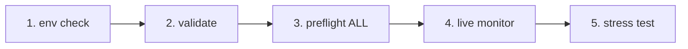

# IrsanAI TPM Agent Forge

[🇬🇧 English](./README.md) | [🇩🇪 Deutsch](./README.de.md)

A clean bootstrap for an autonomous multi-agent setup (BTC, COFFEE, and more) with cross-platform runtime options.

## What's Included

- `production/preflight_manager.py` – resilient market source probing with Alpha Vantage + fallback chain and local cache fallback.
- `production/tpm_agent_process.py` – simple per-market agent loop.
- `production/tpm_live_monitor.py` – live BTC monitor with optional CSV warm-start and Termux notifications.
- `core/tpm_scientific_validation.py` – backtest + statistical validation pipeline.
- `scripts/tpm_cli.py` – unified launcher for Termux/Linux/macOS/Windows.
- `scripts/stress_test_suite.py` – failover/latency stress test.
- `scripts/start_agents.sh`, `scripts/health_monitor_v3.sh` – process ops helpers.
- `core/scout.py`, `core/reserve_manager.py`, `core/init_db_v2.py` – operational core tooling.

## Universal Quickstart

```bash
python scripts/tpm_cli.py env
python scripts/tpm_cli.py validate
python scripts/tpm_cli.py preflight --market ALL
python scripts/tpm_cli.py live --history-csv btc_real_24h.csv --poll-seconds 3600
```

## Runtime Chain Check (causal/order sanity)

The default repo flow is intentionally linear to avoid hidden-state drift and "false confidence" during live runs.



### Gate logic (what must be true before the next step)
- **Gate 1 – Environment:** Python/platform context is correct (`env`).
- **Gate 2 – Scientific sanity:** baseline model behavior is reproducible (`validate`).
- **Gate 3 – Source reliability:** market data + fallback chain are reachable (`preflight --market ALL`).
- **Gate 4 – Runtime execution:** live loop runs with known input history (`live`).
- **Gate 5 – Adversarial confidence:** latency/failover targets hold under stress (`stress_test_suite.py`).

✅ Already fixed in code: CLI preflight now supports `--market ALL`, matching quickstart + docker flow.

## Choose Your Mission (role-based CTA)

> **You are X? Click your lane. Start in <60 seconds.**

| Persona | What you care about | Click path | First command |
|---|---|---|---|
| 📈 **Trader** | Fast pulse, actionable runtime | [`tpm_live_monitor.py`](./production/tpm_live_monitor.py) | `python scripts/tpm_cli.py live --history-csv btc_real_24h.csv --poll-seconds 3600` |
| 💼 **Investor** | Stability, source trust, resilience | [`preflight_manager.py`](./production/preflight_manager.py) | `python scripts/tpm_cli.py preflight --market ALL` |
| 🔬 **Scientist** | Evidence, tests, statistical signal | [`tpm_scientific_validation.py`](./core/tpm_scientific_validation.py) | `python scripts/tpm_cli.py validate` |
| 🧠 **Theoretician** | Causal structure + future architecture | [`core/scout.py`](./core/scout.py) + [`Next Steps`](#next-steps) | `python scripts/tpm_cli.py validate` |
| 🛡️ **Skeptic (priority)** | Break assumptions before production | [`stress_test_suite.py`](./scripts/stress_test_suite.py) + [`preflight_manager.py`](./production/preflight_manager.py) | `python scripts/tpm_cli.py preflight --market ALL && python scripts/stress_test_suite.py` |
| ⚙️ **Operator / DevOps** | Uptime, process health, recoverability | [`start_agents.sh`](./scripts/start_agents.sh) + [`health_monitor_v3.sh`](./scripts/health_monitor_v3.sh) | `bash scripts/start_agents.sh` |

### Skeptic Challenge (recommended first for new visitors)
If you do **only one thing**, run this and inspect the report output:

```bash
python scripts/tpm_cli.py preflight --market ALL
python scripts/stress_test_suite.py
```

If this lane convinces you, the rest of the repository will likely resonate too.

## Platform Notes

- **Android / Termux (Samsung, etc.)**
  ```bash
  pkg install termux-api -y
  python scripts/tpm_cli.py live --history-csv btc_real_24h.csv --notify --vibrate-ms 1000
  ```
- **iPhone (best effort)**: use shell apps such as iSH / a-Shell. Termux-specific notification hooks are not available there.
- **Windows / Linux / macOS**: use the same CLI commands; run via tmux/scheduler/cron for persistence.

## Docker (Cross-OS Easiest Path)

```bash
docker compose run --rm tpm-preflight
docker compose run --rm tpm-live
```

Optional for COFFEE source quality:

```bash
export ALPHAVANTAGE_KEY="<your_key>"
docker compose run --rm tpm-preflight
```

## Validation

Run the scientific validation pipeline:

```bash
python core/tpm_scientific_validation.py
```

Artifacts:
- `state/TPM_Scientific_Report.md`
- `state/TPM_test_results.json`

## Sources & Failover

`production/preflight_manager.py` supports:
- Alpha Vantage first for COFFEE (when `ALPHAVANTAGE_KEY` is set)
- TradingView + Yahoo fallback chain
- local cached fallback in `state/latest_prices.json`

Run preflight directly:

```bash
export ALPHAVANTAGE_KEY="<your_key>"
python production/preflight_manager.py --market ALL
```

Run outage stress test (target `p95 < 1000ms`):

```bash
python scripts/stress_test_suite.py
```

Output: `state/stress_test_report.json`


## Next Steps

- Transfer entropy module for cross-market causal analysis.
- Optimizer with policy updates based on historical performance.
- Alert channels (Telegram/Signal) + boot persistence.
