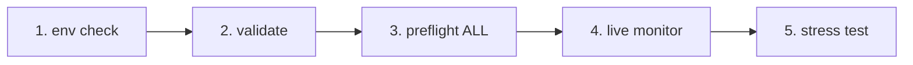

# IrsanAI TPM Agent Forge

[🇬🇧 English](../../README.md) | [🇩🇪 Deutsch](../../README.de.md) | [🇪🇸 Español](./README.es.md) | [🇮🇹 Italiano](./README.it.md) | [🇧🇦 Bosanski](./README.bs.md) | [🇷🇺 Русский](./README.ru.md) | [🇨🇳 中文](./README.zh-CN.md) | [🇫🇷 Français](./README.fr.md) | [🇧🇷 Português (BR)](./README.pt-BR.md) | [🇮🇳 हिन्दी](./README.hi.md) | [🇹🇷 Türkçe](./README.tr.md) | [🇯🇵 日本語](./README.ja.md)

Čist bootstrap za autonomno multi-agent podešavanje (BTC, COFFEE i više), sa cross-platform runtime opcijama.

## Šta je uključeno

- `production/preflight_manager.py` – robusno ispitivanje tržišnih izvora uz Alpha Vantage + fallback lanac i lokalni cache fallback.
- `production/tpm_agent_process.py` – jednostavna agentska petlja po tržištu.
- `production/tpm_live_monitor.py` – live BTC monitor sa opcionalnim CSV warm-startom i Termux notifikacijama.
- `core/tpm_scientific_validation.py` – backtest + statistički validacijski pipeline.
- `scripts/tpm_cli.py` – objedinjeni launcher za Termux/Linux/macOS/Windows.
- `scripts/stress_test_suite.py` – stres test failovera/latencije.
- `scripts/start_agents.sh`, `scripts/health_monitor_v3.sh` – pomoćni alati za operacije procesa.
- `core/scout.py`, `core/reserve_manager.py`, `core/init_db_v2.py` – operativni core alati.

## Univerzalni brzi početak

```bash
python scripts/tpm_cli.py env
python scripts/tpm_cli.py validate
python scripts/tpm_cli.py preflight --market ALL
python scripts/tpm_cli.py live --history-csv btc_real_24h.csv --poll-seconds 3600
```

## Provjera runtime lanca (kauzalni/redoslijedni sanity)

Podrazumijevani tok repozitorija je namjerno linearan kako bi se izbjegao drift skrivenih stanja i "lažno samopouzdanje" tokom live rada.



### Logika gate-ova (šta mora važiti prije sljedećeg koraka)
- **Gate 1 – Okruženje:** Python/platform kontekst je ispravan (`env`).
- **Gate 2 – Naučna provjera:** bazno ponašanje modela je reproduktivno (`validate`).
- **Gate 3 – Pouzdanost izvora:** tržišni podaci + fallback lanac su dostupni (`preflight --market ALL`).
- **Gate 4 – Runtime izvršavanje:** live petlja radi s poznatom ulaznom historijom (`live`).
- **Gate 5 – Adversarialno povjerenje:** ciljevi latencije/failovera drže pod stresom (`stress_test_suite.py`).

✅ Već ispravljeno u kodu: CLI preflight sada podržava `--market ALL`, usklađeno s quickstart + docker tokom.

## Odaberi svoju misiju (CTA po ulozi)

> **Ti si X? Odaberi svoju stazu. Kreni za <60 sekundi.**

| Persona | Šta ti je važno | Putanja klika | Prva komanda |
|---|---|---|---|
| 📈 **Trader** | Brz puls, operativno upotrebljiv runtime | [`tpm_live_monitor.py`](./production/tpm_live_monitor.py) | `python scripts/tpm_cli.py live --history-csv btc_real_24h.csv --poll-seconds 3600` |
| 💼 **Investitor** | Stabilnost, povjerenje u izvore, otpornost | [`preflight_manager.py`](./production/preflight_manager.py) | `python scripts/tpm_cli.py preflight --market ALL` |
| 🔬 **Naučnik** | Dokazi, testovi, statistički signal | [`tpm_scientific_validation.py`](./core/tpm_scientific_validation.py) | `python scripts/tpm_cli.py validate` |
| 🧠 **Teoretičar** | Kauzalna struktura + buduća arhitektura | [`core/scout.py`](./core/scout.py) + [`Next Steps`](#next-steps) | `python scripts/tpm_cli.py validate` |
| 🛡️ **Skeptik (prioritet)** | Razbij pretpostavke prije produkcije | [`stress_test_suite.py`](./scripts/stress_test_suite.py) + [`preflight_manager.py`](./production/preflight_manager.py) | `python scripts/tpm_cli.py preflight --market ALL && python scripts/stress_test_suite.py` |
| ⚙️ **Operator / DevOps** | Uptime, zdravlje procesa, oporavljivost | [`start_agents.sh`](./scripts/start_agents.sh) + [`health_monitor_v3.sh`](./scripts/health_monitor_v3.sh) | `bash scripts/start_agents.sh` |

### Skeptik izazov (preporučeno prvo za nove posjetioce)
Ako uradiš **samo jednu stvar**, pokreni ovo i pregledaj izlaz izvještaja:

```bash
python scripts/tpm_cli.py preflight --market ALL
python scripts/stress_test_suite.py
```

Ako te ova staza uvjeri, vjerovatno će ti i ostatak repozitorija imati smisla.

## Napomene po platformama

- **Android / Termux (Samsung itd.)**
  ```bash
  pkg install termux-api -y
  python scripts/tpm_cli.py live --history-csv btc_real_24h.csv --notify --vibrate-ms 1000
  ```
- **iPhone (best effort)**: koristi shell aplikacije poput iSH / a-Shell. Termux-specifični notification hookovi tamo nisu dostupni.
- **Windows / Linux / macOS**: koristi iste CLI komande; za trajnost pokreći preko tmux/scheduler/cron.

## Docker (najlakši put preko različitih OS-ova)

```bash
docker compose run --rm tpm-preflight
docker compose run --rm tpm-live
```

Opcionalno za bolji kvalitet COFFEE izvora:

```bash
export ALPHAVANTAGE_KEY="<your_key>"
docker compose run --rm tpm-preflight
```

## Validacija

Pokreni naučni validacijski pipeline:

```bash
python core/tpm_scientific_validation.py
```

Artefakti:
- `state/TPM_Scientific_Report.md`
- `state/TPM_test_results.json`

## Izvori i failover

`production/preflight_manager.py` podržava:
- Alpha Vantage prvo za COFFEE (kada je `ALPHAVANTAGE_KEY` postavljen)
- TradingView + Yahoo fallback lanac
- lokalni cache fallback u `state/latest_prices.json`

Pokreni preflight direktno:

```bash
export ALPHAVANTAGE_KEY="<your_key>"
python production/preflight_manager.py --market ALL
```

Pokreni stres test prekida (cilj `p95 < 1000ms`):

```bash
python scripts/stress_test_suite.py
```

Izlaz: `state/stress_test_report.json`


## Forge Production Web Runtime (BTC + COFFEE, extensible)

This runtime is now synchronized with the EN/DE canonical versions:

- Starts by default with one finance TPM agent for **BTC** and one for **COFFEE**.
- Users can add more markets/agents directly in the web UI (`/api/agents`).
- Runs as a persistent service with live frame visibility (`/api/frame`).

### Start (local)

```bash
uvicorn production.forge_runtime:app --host 0.0.0.0 --port 8787
# open http://localhost:8787
```

### Start (Docker)

```bash
docker compose up tpm-forge-web
# open http://localhost:8787
```

## TPM Playground (interaktivni MVP)

Sada možeš interaktivno istraživati TPM ponašanje u pregledniku:

```bash
python -m http.server 8765
# open http://localhost:8765/playground/index.html
```

Sadrži:
- Single-agent prikaz anomalija slabih signala
- Mini roj (BTC/COFFEE/VOL) i pritisak konsenzusa
- Cross-domain transfer rezonanca (sintetički: finansije/vrijeme/zdravlje)

Pogledaj: `playground/README.md`.
## Sljedeći koraci

- Transfer-entropy modul za kauzalnu analizu između tržišta.
- Optimizer s policy ažuriranjima na osnovu historijskog učinka.
- Alert kanali (Telegram/Signal) + boot perzistencija.


---

## IrsanAI Deep Dive: kako TPM jezgro "razmišlja" u kompleksnim sistemima

### 1) Vizionarska transformacija: od trading agenta do univerzalnog TPM ekosistema

### Šta je jedinstveno kod IrsanAI-TPM algoritma? (korektno uokvirenje)

Radna hipoteza TPM jezgra:

- In complex, chaotic systems, early-warning signal is often hidden in the **micro-residual**: tiny deviations, weak correlations, almost-empty data points.
- Where classic systems see only `0` or "not enough relevance", TPM searches for **structured anomalies** (glitch patterns) in context flow.
- TPM evaluates not only a value itself, but the **change of relationships over time, source quality, regime, and causal neighborhood**.

Važna napomena o ispravnosti: TPM **ne** predviđa budućnost magično. Cilj je **ranija probabilistička detekcija** promjena režima, proboja i poremećaja — kada su ispunjeni uslovi kvaliteta podataka i validacijskih gate-ova.

### Razmišljaj VELIKO: zašto ovo nadilazi finansije

If TPM can detect weak precursor patterns in financial instruments (index/ticker/ISIN-like identifiers, liquidity, microstructure), the same principle can generalize to many domains:

- **Event/sensor stream + context model + anomaly layer + feedback loop**
- Every profession can be modeled as a "market" with domain-specific features, nodes, correlations, and anomalies
- Specialized TPM agents can learn across domains while preserving local professional logic and ethics

### 100 profesija kao TPM ciljna polja

| # | Profession | TPM data analog | Anomaly/pattern-detection target |
|---|---|---|---|
| 1 | Police analyst | Incident logs, geotemporal crime maps, networks | Early signals of escalating crime clusters |
| 2 | Fire service commander | Alarm chains, sensor feeds, weather, building profiles | Predict fire and hazard propagation windows |
| 3 | Paramedic/EMS | Dispatch reasons, response times, hospital load | Detect capacity stress before breakdown |
| 4 | Emergency physician | Triage flows, vitals, waiting-time dynamics | Flag critical decompensation earlier |
| 5 | ICU nurse | Ventilation/lab trends, medication responses | Identify sepsis/shock micro-signals |
| 6 | Epidemiologist | Case rates, mobility, wastewater/lab data | Outbreak early warning before exponential phase |
| 7 | Family physician | EHR patterns, prescriptions, follow-up gaps | Detect chronic-risk transitions early |
| 8 | Clinical psychologist | Session trajectories, language markers, sleep/activity | Detect relapse/crisis indicators sooner |
| 9 | Pharma researcher | Compound screens, adverse-event profiles, genomics | Reveal hidden efficacy and side-effect clusters |
| 10 | Biotechnologist | Sequence/process/cell-culture trajectories | Detect drift and contamination risk |
| 11 | Climate scientist | Atmosphere/ocean time series, satellite fields | Identify tipping-point precursors |
| 12 | Meteorologist | Pressure/humidity/wind/radar fields | Anticipate local chaotic weather shifts |
| 13 | Seismologist | Microquakes, stress fields, sensor arrays | Detect precursors to major releases |
| 14 | Volcanologist | Gas, tremor, deformation time series | Narrow eruption probability windows |
| 15 | Hydrologist | River gauges, rain, soil moisture | Detect flash-flood and drought phase changes |
| 16 | Oceanographer | Currents, temperature, salinity, buoy streams | Detect tsunami/ecosystem-relevant anomalies |
| 17 | Energy trader | Load, spot prices, weather, grid state | Signal probable price/load breakouts early |
| 18 | Grid operator | Grid frequency, line state, switching events | Detect cascading-failure risk |
| 19 | Wind farm operator | Turbine telemetry, wind fields, maintenance logs | Predict failures and performance drift |
| 20 | Solar plant operator | Irradiance, inverter telemetry, thermal load | Detect degradation and yield anomalies |
| 21 | Water utility manager | Flow, quality sensors, consumption patterns | Detect contamination/shortage early |
| 22 | Traffic operations manager | Density, collisions, roadworks, events | Predict congestion and crash escalation |
| 23 | Railway control manager | Timetable adherence, track state, delay chains | Break systemic delay cascades early |
| 24 | Air traffic controller | Flight tracks, weather, slot saturation | Detect conflict paths and bottlenecks |
| 25 | Port logistics manager | Berth times, container flow, customs status | Detect supply disruption precursors |
| 26 | Supply-chain manager | ETA, inventory, demand pulse, risk events | Minimize bullwhip and stockout anomalies |
| 27 | Manufacturing lead | OEE, process telemetry, scrap, setup times | Detect quality drift and machine anomalies |
| 28 | Quality engineer | Tolerance distributions, process signals | Detect near-zero defect precursors |
| 29 | Robotics engineer | Motion trajectories, actuator load, control loops | Predict control instability/failure |
| 30 | Aviation maintenance engineer | Engine/flight telemetry, maintenance history | Component-level predictive maintenance |
| 31 | Construction manager | Progress, weather, supply dates, IoT sensors | Quantify schedule/cost anomaly risk |
| 32 | Structural engineer | Load, vibration, fatigue/aging indicators | Detect structural-critical transitions |
| 33 | Urban planner | Mobility, demographics, emissions, land use | Detect emerging urban stress patterns |
| 34 | Architect | Building operations, occupancy, energy curves | Detect design-use mismatch patterns |
| 35 | Farmer | Soil/weather/crop/market streams | Detect disease/yield anomalies early |
| 36 | Agronomist | Satellite nutrition/hydration data | Target precise interventions early |
| 37 | Forestry manager | Moisture, pest patterns, fire indicators | Detect forest damage/fire windows early |
| 38 | Fisheries manager | Catch records, water quality, migration | Detect overfishing/collapse risks |
| 39 | Food safety inspector | Lab findings, cold-chain logs, supply links | Interrupt contamination chains early |
| 40 | Executive chef | Demand pulse, stock health, waste ratios | Minimize spoilage and shortage anomalies |
| 41 | Retail operator | POS streams, footfall, inventory rotation | Detect demand spikes and shrinkage patterns |
| 42 | E-commerce manager | Clickstream, cart journeys, returns | Detect fraud/churn precursor patterns |
| 43 | Marketing analyst | Campaign metrics, segment response curves | Detect micro-trends before mainstream |
| 44 | Sales lead | Pipeline velocity, touchpoint graph | Detect deal-risk and timing opportunities |
| 45 | Customer support lead | Ticket flow, topic clusters, SLA drift | Detect escalation/root-cause waves |
| 46 | Product manager | Feature adoption, retention, feedback | Detect product-market misfit early |
| 47 | UX researcher | Heatmaps, pathing, drop-off points | Surface hidden interaction friction |
| 48 | Software engineer | Logs, traces, deploy metrics | Detect fault cascades pre-incident |
| 49 | Site reliability engineer | Latency, error budgets, saturation | Catch degradation before outage |
| 50 | Cybersecurity analyst | Network flows, IAM events, SIEM alerts | Detect attack-path and lateral movement |
| 51 | Fraud analyst | Transaction graphs, device fingerprints | Detect fraud in weak-signal space |
| 52 | Bank risk manager | Portfolio/macro/liquidity exposures | Detect stress regimes and concentration risk |
| 53 | Insurance actuary | Claims flow, exposure maps, climate links | Anticipate claims waves and reserve stress |
| 54 | Tax advisor | Ledger patterns, filing timelines | Detect compliance risk and optimization paths |
| 55 | Auditor | Control trails, exception patterns | Detect accounting anomalies at scale |
| 56 | Attorney | Case chronology, precedent graphs, deadlines | Detect litigation risk and outcome patterns |
| 57 | Judge/court administrator | Caseload mix, cycle times | Detect justice-system bottlenecks |
| 58 | Corrections manager | Occupancy, incident networks, behavior trends | Detect violence/recidivism clusters |
| 59 | Customs officer | Trade manifests, declarations, routing patterns | Detect smuggling/evasion signals |
| 60 | Defense intelligence analyst | ISR feeds, logistics, operational tempo | Detect escalation dynamics early |
| 61 | Diplomatic analyst | Event chains, communications signals | Detect geopolitical regime shifts |
| 62 | Teacher | Learning progress, attendance, engagement | Detect dropout-risk and support need |
| 63 | School principal | Performance clusters, attendance, resources | Detect systemic school stress patterns |
| 64 | University lecturer | Course activity, withdrawals, feedback | Stabilize student success earlier |
| 65 | Education researcher | Cohort trajectories, pedagogy variables | Identify robust intervention effects |
| 66 | Social worker | Case networks, appointments, risk markers | Detect crisis escalation pathways |
| 67 | NGO coordinator | Field reports, aid flows, need signals | Detect impact gaps and hotspot changes |
| 68 | Employment advisor | Skill profiles, labor demand, transitions | Detect mismatch and upskilling needs |
| 69 | HR manager | Hiring/attrition/performance trajectories | Detect burnout and retention risk early |
| 70 | Recruiter | Funnel rates, skills taxonomy, market pulse | Detect fit risk and hiring opportunity windows |
| 71 | Org consultant | Decision cadence, KPI drift, network patterns | Detect team dysfunction early |
| 72 | Project manager | Milestones, dependencies, blocker graph | Anticipate schedule/scope breakdowns |
| 73 | Journalist | Source reliability graph, event streams | Detect misinformation clusters early |
| 74 | Investigative reporter | Document networks, money/communication traces | Expose hidden systemic anomalies |
| 75 | Content moderator | Post/comment streams, semantic shifts | Detect abuse/radicalization waves early |
| 76 | Artist | Audience response trajectories, style vectors | Detect emerging aesthetics |
| 77 | Music producer | Listening features, arrangement vectors | Detect breakout/niche potential early |
| 78 | Game designer | Telemetry, progression, churn curves | Detect frustration and balance anomalies |
| 79 | Sports coach | Performance/biometric load streams | Detect injury/form-drop precursors |
| 80 | Athletic trainer | Motion/recovery markers | Detect overload before downtime |
| 81 | Sports physician | Diagnostics, rehab load, recurrence risk | Optimize return-to-play windows |
| 82 | Referee analyst | Decision stream, tempo, incident context | Detect consistency/fairness drift |
| 83 | Event manager | Ticketing, mobility, weather, safety feeds | Detect crowd and safety risk escalation |
| 84 | Tourism manager | Booking patterns, reputation signals | Detect demand and sentiment shifts |
| 85 | Hotel manager | Occupancy, service quality, complaints | Detect quality-demand instability early |
| 86 | Property manager | Rent flow, maintenance, market comps | Detect vacancy/default risk early |
| 87 | Facility manager | Building IoT, energy, maintenance intervals | Detect failures and inefficiency patterns |
| 88 | Waste management operator | Waste streams, routing, environmental metrics | Detect illegal dumping and process gaps |
| 89 | Environmental inspector | Emissions, reports, satellite overlays | Detect compliance violations and tipping risk |
| 90 | Circular economy analyst | Material passports, recovery rates | Detect leakage and loop-closure opportunities |
| 91 | Astrophysicist | Telescope streams, spectra, noise models | Detect rare cosmic events |
| 92 | Space operations engineer | Telemetry, orbit params, system diagnostics | Detect mission-critical anomalies early |
| 93 | Quantum engineer | Noise profiles, calibration drifts, gate errors | Detect decoherence and control drift |
| 94 | Data scientist | Feature drift, model quality, data integrity | Detect model collapse and bias shift |
| 95 | AI ethicist | Decision outcomes, fairness metrics | Detect unfair patterns/governance gaps |
| 96 | Philosophy of science researcher | Theory-evidence pathways | Detect paradigm mismatch signals |
| 97 | Mathematician | Residual structures, invariants, error terms | Detect hidden regularities/outlier classes |
| 98 | Systems theorist | Node-edge dynamics, feedback delays | Detect network tipping dynamics |
| 99 | Anthropologist | Field observations, language/social networks | Detect cultural-shift conflict precursors |
| 100 | Foresight strategist | Tech curves, regulation, behavior data | Connect scenarios with early indicators |

### Country-fit napomene (ekvivalencija profesija kroz jurisdikcije)

To keep the list logically correct across regions, TPM role-mapping should be interpreted as **functional equivalents**, not literal job-title translation:

- **Germany ↔ US/UK:** `Polizei` vs split functions (`Police Department`, `Sheriff`, `State Trooper`) and prosecution differences (`Staatsanwaltschaft` vs `District Attorney/Crown Prosecution`).
- **Spain / Italy:** civil-law structures with distinct court and policing workflows; data pipelines often split between regional and national systems.
- **Bosnia and Herzegovina:** multi-entity governance means fragmented data ownership; TPM benefits from federated anomaly fusion.
- **Russia / China:** role definitions and data-governance constraints differ; TPM must be configured with local compliance boundaries and institutional equivalents.
- **Additional high-impact regions:** France, Brazil, India, Japan, MENA states, and Sub-Saharan Africa can be onboarded by mapping equivalent functions and available telemetry.

### Filozofsko-naučni pogled

- From tool to **epistemic infrastructure**: domains operationalize "weak early knowledge".
- From isolated systems to **agent federations**: local ethics + shared anomaly grammar.
- From reactive response to **anticipatory governance**: prevention over late crisis control.
- From static models to **living theories**: continuous recalibration under real-world shocks.

Suštinska ideja: TPM klaster kojim se odgovorno upravlja ne može kontrolisati haos — ali može pomoći institucijama da ga ranije razumiju, robusnije usmjeravaju i humanije odlučuju.

## Višejezično proširenje (u toku)

Kako bi se podržala rezonanca kroz jezike, lokalizirani strateški pregledi dostupni su na:

- Spanish (`docs/i18n/README.es.md`)
- Italian (`docs/i18n/README.it.md`)
- Bosnian (`docs/i18n/README.bs.md`)
- Russian (`docs/i18n/README.ru.md`)
- Chinese Simplified (`docs/i18n/README.zh-CN.md`)
- French (`docs/i18n/README.fr.md`)
- Portuguese Brazil (`docs/i18n/README.pt-BR.md`)
- Hindi (`docs/i18n/README.hi.md`)
- Turkish (`docs/i18n/README.tr.md`)
- Japanese (`docs/i18n/README.ja.md`)

Svaki lokalizirani fajl uključuje napomene prilagođene regiji i upućuje na ovu kanonsku englesku sekciju za kompletnu matricu od 100 profesija.

## LOP (Endnote – prioritized)

1. **P1 Expand real-data evidence:** benchmarking with explicit acceptance criteria (precision/recall/FPR/drift).
2. **P2 Finalize reflexive governance:** define strict auto safe-mode rules for uncertainty.
3. **P3 Standardize collective memory:** versioned learning patterns with per-domain review process.
4. **P4 Continue web immersion rollout:** role-based views for additional TPM sectors on top of the responsive runtime layout.

**Platform note:** current primary focus is **Windows + smartphone**. **Add later at the end of LOP:** macOS, Linux, and further platform profiles.

