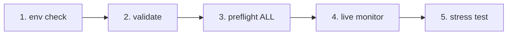

# IrsanAI TPM Agent Forge
[🇬🇧 English](../../README.md) | [🇩🇪 Deutsch](../../README.de.md) | [🇪🇸 Español](../../docs/i18n/README.es.md) | [🇮🇹 Italiano](../../docs/i18n/README.it.md) | [🇧🇦 Bosanski](../../docs/i18n/README.bs.md) | [🇷🇺 Русский](../../docs/i18n/README.ru.md) | [🇨🇳 中文](../../docs/i18n/README.zh-CN.md) | [🇫🇷 Français](../../docs/i18n/README.fr.md) | [🇧🇷 Português (BR)](../../docs/i18n/README.pt-BR.md) | [🇮🇳 हिन्दी](../../docs/i18n/README.hi.md) | [🇹🇷 Türkçe](../../docs/i18n/README.tr.md) | [🇯🇵 日本語](../../docs/i18n/README.ja.md)

[🇬🇧 English](../../README.md) | [🇩🇪 Deutsch](../../README.de.md) | [🇪🇸 Español](./README.es.md) | [🇮🇹 Italiano](./README.it.md) | [🇧🇦 Bosanski](./README.bs.md) | [🇷🇺 Русский](./README.ru.md) | [🇨🇳 中文](./README.zh-CN.md) | [🇫🇷 Français](./README.fr.md) | [🇧🇷 Português (BR)](./README.pt-BR.md) | [🇮🇳 हिन्दी](./README.hi.md) | [🇹🇷 Türkçe](./README.tr.md) | [🇯🇵 日本語](./README.ja.md)

Čist bootstrap za autonomni multi-agent setup (BTC, COFFEE i drugo) sa opcijama za cross-platform runtime.

## Šta je uključeno

- `production/preflight_manager.py` – otporna provjera izvora tržišta sa Alpha Vantage + lanac rezervnih izvora i lokalna keš rezervna opcija.
- `production/tpm_agent_process.py` – jednostavan agent petlja po tržištu.
- `production/tpm_live_monitor.py` – live BTC monitor sa opcionalnim CSV warm-startom i Termux notifikacijama.
- `core/tpm_scientific_validation.py` – pipeline za backtest + statističku validaciju.
- `scripts/tpm_cli.py` – jedinstveni launcher za Termux/Linux/macOS/Windows.
- `scripts/stress_test_suite.py` – test stresa za failover/latenciju.
- `scripts/start_agents.sh`, `scripts/health_monitor_v3.sh` – pomoćni alati za upravljanje procesima.
- `core/scout.py`, `core/reserve_manager.py`, `core/init_db_v2.py` – osnovni alati za operacije.

## Univerzalni Quickstart

```bash
python scripts/tpm_cli.py env
python scripts/tpm_cli.py validate
python scripts/tpm_cli.py preflight --market ALL
python scripts/tpm_cli.py live --history-csv btc_real_24h.csv --poll-seconds 3600
```

## Provjera lanca izvršavanja u runtime-u (kausalni/redoslijed sanitet)

Podrazumijevani tok repozitorijuma je namjerno linearan kako bi se izbjegao drift skrivenog stanja i „lažni osjećaj sigurnosti“ tokom live izvršavanja.


```mermaid
flowchart LR
  A[1. env check] --> B[2. validate]
  B --> C[3. preflight ALL]
  C --> D[4. live monitor]
  D --> E[5. stress test]
```

### Logika gate-ova (šta mora biti tačno prije sljedećeg koraka)
- **Gate 1 – Okruženje:** Python/platforma je ispravno postavljena (`env`).
- **Gate 2 – Naučna ispravnost:** bazno ponašanje modela je reproducibilno (`validate`).
- **Gate 3 – Pouzdanost izvora:** podaci tržišta i lanac rezervnih izvora su dostupni (`preflight --market ALL`).
- **Gate 4 – Runtime izvršavanje:** live petlja radi sa poznatom historijom ulaza (`live`).
- **Gate 5 – Adversarijalna sigurnost:** ciljevi latencije/failovera se održavaju pod stresom (`stress_test_suite.py`).

✅ Već je sređeno u kodu: CLI preflight sada podržava `--market ALL`, što odgovara quickstart-u i docker toku.

## Izaberite svoju misiju (poziv na akciju po ulozi)

> **Jeste li vi X? Kliknite svoju stazu. Pokrenite za <60 sekundi.**

| Persona | Šta vam je važno | Putanja za klik | Prva komanda |
|---|---|---|---|
| 📈 **Trgovac** | Brz puls, akcione informacije u runtime-u | [`tpm_live_monitor.py`](./production/tpm_live_monitor.py) | `python scripts/tpm_cli.py live --history-csv btc_real_24h.csv --poll-seconds 3600` |
| 💼 **Investitor** | Stabilnost, povjerenje u izvor, otpornost | [`preflight_manager.py`](./production/preflight_manager.py) | `python scripts/tpm_cli.py preflight --market ALL` |
| 🔬 **Naučnik** | Dokazi, testovi, statistički signal | [`tpm_scientific_validation.py`](./core/tpm_scientific_validation.py) | `python scripts/tpm_cli.py validate` |
| 🧠 **Teoretičar** | Kausalna struktura + buduća arhitektura | [`core/scout.py`](./core/scout.py) + [`Next Steps`](#next-steps) | `python scripts/tpm_cli.py validate` |
| 🛡️ **Skeptik (prioritet)** | Prekini pretpostavke prije produkcije | [`stress_test_suite.py`](./scripts/stress_test_suite.py) + [`preflight_manager.py`](./production/preflight_manager.py) | `python scripts/tpm_cli.py preflight --market ALL && python scripts/stress_test_suite.py` |
| ⚙️ **Operator / DevOps** | Uptime, zdravlje procesa, oporavak | [`start_agents.sh`](./scripts/start_agents.sh) + [`health_monitor_v3.sh`](./scripts/health_monitor_v3.sh) | `bash scripts/start_agents.sh` |

### Skeptički izazov (preporučeno kao prvo za nove korisnike)
Ako uradite **samo jednu stvar**, pokrenite ovo i pregledajte izlazni izvještaj:

```bash
python scripts/tpm_cli.py preflight --market ALL
python scripts/stress_test_suite.py
```

Ako vas ova staza uvjeri, ostatak repozitorijuma će najvjerovatnije takođe biti relevantan.

## Napomene o platformi

- **Android / Termux (Samsung i drugi)**
  ```bash
  bash scripts/termux_bootstrap.sh
  cd ~/TPM-Agent
  python scripts/tpm_cli.py env
  python scripts/tpm_cli.py preflight --market ALL
  python scripts/tpm_cli.py live --history-csv btc_real_24h.csv --notify --vibrate-ms 1000
  ```
  Za direktnu Android (Termux) web UI demonstraciju, pokrenite Forge runtime lokalno:
  ```bash
  cd ~/TPM-Agent
  bash scripts/termux_forge.sh start
  # stop: bash scripts/termux_forge.sh stop
  # status: bash scripts/termux_forge.sh status
  ```
  Skripta automatski otvara browser (ako je dostupan) i drži servis aktivnim u pozadini.
  Ako ste naišli na `pydantic-core`/Rust ili `scipy`/Fortran build grešku na Androidu, koristite
  `python -m pip install -r requirements-termux.txt` (Termux-safe set, ne zahtijeva Rust toolchain).
  U web interfejsu možete kontrolisati start/stop runtime-a; progress bar pokazuje status tranzicije.
- **iPhone (najbolji trud):** koristite shell aplikacije poput iSH / a-Shell. Termux specifični hook-ovi za notifikacije nisu dostupni.
- **Windows / Linux / macOS**: koristite iste CLI komande; pokrećite putem tmux/scheduler/cron za postojanost.

## Docker (najlakši put na svim OS)

Koristite Docker u tačno ovom redoslijedu (bez nagađanja):

### Korak 1: Izgradnja web runtime slike

```bash
docker compose build --no-cache tpm-forge-web
```

### Korak 2: Pokretanje web dashboard servisa

```bash
docker compose up tpm-forge-web
```

Otvorite sada `http://localhost:8787` u vašem browseru (**ne** `http://0.0.0.0:8787`). Uvicorn interno veže na `0.0.0.0`, ali klijenti treba da koriste `localhost` (ili lokalnu LAN IP adresu).

### Korak 3 (opcionalno): provjera ne-web servisa

```bash
docker compose run --rm tpm-preflight
docker compose run --rm tpm-live
```

- `tpm-preflight` = provjere izvora/konektivnosti (samo CLI output).
- `tpm-live` = live-monitor logovi u terminalu (samo CLI output, **bez web UI**).
- `tpm-forge-web` = FastAPI + dashboard UI (onaj sa layoutom/progresom/kontrolom runtime-a).

Ako `tpm-preflight` javlja `ALPHAVANTAGE_KEY not set`, COFFEE i dalje radi preko rezervnih izvora.

Ako je stranica prazna:
- testirajte API direktno: `http://localhost:8787/api/frame`
- testirajte FastAPI dokumentaciju: `http://localhost:8787/docs`
- hard refresh browser-a (`Ctrl+F5`)
- po potrebi, restartujte samo web servis: `docker compose restart tpm-forge-web`

Opcionalno za bolji kvalitet COFFEE:

```bash
export ALPHAVANTAGE_KEY="<your_key>"
docker compose run --rm tpm-preflight
```

## Predviđanja grešaka & mobilne alerti

- Forge live kokpit sada izlaže per-marketski kratkoročni outlook (`up/down/sideways`) sa stepenom pouzdanosti na `/api/markets/live`.
- Kada se detektuje tržišni glitch (ubrzanje), runtime može pokrenuti:
  - Termux toast + vibraciju
  - opcionalni notifikacioni / zvučni hook
  - opcionalni Telegram push (ako je bot token/chat id konfigurisan u `config/config.yaml`).
- Konfigurišite u dashboardu preko **Save Alerts** / **Test Alert** ili API:
  - `GET /api/alerts/preferences`
  - `POST /api/alerts/preferences`
  - `POST /api/alerts/test`

## Validacija

Pokrenite pipeline za naučnu validaciju:

```bash
python core/tpm_scientific_validation.py
```

Artefakti:
- `state/TPM_Scientific_Report.md`
- `state/TPM_test_results.json`

## Izvori & Failover

`production/preflight_manager.py` podržava:
- Alpha Vantage kao prvi izvor za COFFEE (kad je `ALPHAVANTAGE_KEY` postavljen)
- TradingView + Yahoo lanac rezervnih izvora
- lokalni keširani fallback u `state/latest_prices.json`

Pokrenite preflight direktno:

```bash
export ALPHAVANTAGE_KEY="<your_key>"
python production/preflight_manager.py --market ALL
```

Pokrenite stres test prekida (cilj `p95 < 1000ms`):

```bash
python scripts/stress_test_suite.py
```

Izlaz: `state/stress_test_report.json`


## Live status: šta TPM agent može trenutno

**Trenutno stanje:**
- Produkcioni Forge web runtime je dostupan (`production.forge_runtime:app`).
- Finance-prioritet start konfiguracije koristi **BTC + COFFEE**.
- Live frame, fitnes agenta, transfer entropija i sažetak domena su vidljivi u web dashboardu.
- Korisnici mogu dodavati nove market agente za vrijeme rada (`POST /api/agents`).

**Ciljna mogućnost (obavezno imati):**
- Benchmarking pravih podataka sa eksplicitnim pragovima prihvatanja (preciznost/pronalaženje/lažni alarm).
- Stroga refleksivna pravila upravljanja za automatski safe-mode.
- Radni tok kolektivne memorije za arhiviranje verzionisanih obrazaca učenja po domenima.

**Sljedeća faza proširenja:**
- Orkestrator politika baziran na režimima (trend/šok/sideways) za sve agente.
- Jedan pilot bez finansijske domene (npr. medicinski ili seizmički) sa eksplicitnim data ugovorima.

## Pomoć pri spajanju PR-ova

- Merge lista za provjeru (GitHub konflikti): `docs/MERGE_CONFLICT_CHECKLIST.de.md`


### Današnji fokus: Windows + smartphone za financijski TPM

- **Windows:** Forge runtime + web interfejs + Docker/PowerShell/klik-start su operativni.
- **Smartphone:** Android/Termux live-monitoring je operativan; web UI je responzivan na mobilnim uređajima.
- **Realtime multi-agent:** BTC + COFFEE su aktivni po defaultu; dodatna tržišta mogu se dinamički dodavati iz web UI.
- **Pravilo granica izvora:** ako je traženo tržište izvan dostupnih izvora, pružiti eksplicitan URL izvora + podatke o ovlašćenju.

## Windows live test (sistem sa dva puta)

### Put A — Razvojni/napredni korisnici (PowerShell, CMD, PyCharm, IDE)

```powershell
python -m venv .venv
.\.venv\Scripts\Activate.ps1
pip install -r requirements.txt
python scripts/tpm_cli.py forge-dashboard --open-browser --port 8787
```

### Put B — Korisnici sa jednostavnim pristupom (klik i start)

1. Dvaput kliknite `scripts/windows_click_start.bat`
2. Skripta automatski odabire najbolji dostupni put:
   - Python dostupan -> venv + pip + runtime
   - inače Docker Compose (ako je dostupan)

Tehnička osnova: `scripts/windows_bootstrap.ps1`.

## Forge Production Web Runtime (BTC + COFFEE, proširivo)

Da, ovo je **već započeto** u repozitoriju i sada prošireno:

- Početno se pokreće sa jednim finansijskim TPM agentom za **BTC** i jednim za **COFFEE**.
- Korisnici mogu dodavati više tržišta/agenta direktno iz web UI (`/api/agents`).
- Radi kao postojana runtime usluga sa live frame izlazom (`/api/frame`) za dubinsku analizu.

### Start (lokalno)

```bash
uvicorn production.forge_runtime:app --host 0.0.0.0 --port 8787
# otvorite http://localhost:8787
```

### Start (Docker)

```bash
docker compose up tpm-forge-web
# otvorite http://localhost:8787
```

## TPM Playground (interaktivni MVP)

Sada možete istraživati TPM ponašanje interaktivno u browseru:

```bash
python -m http.server 8765
# otvorite http://localhost:8765/playground/index.html
```

Obuhvata:
- Prikaz anomalija sa slabim signalom jednog agenta
- Mini roj (BTC/COFFEE/VOL) pritisak konsenzusa
- Prenos između domena u rezonanci (synthetic finance/weather/health)

Vidi: `playground/README.md`.

## Sljedeći koraci

- Modul za transfer entropiju za uzročnu analizu između tržišta.
- Optimizator sa ažuriranjem politika na osnovu historijskog učinka.
- Kanali za alerte (Telegram/Signal) + trajna boot persistencija.


---

## IrsanAI dubinska analiza: Kako TPM core „razmišlja“ u kompleksnim sistemima

### 1) Vizionarska transformacija: od trgovačkog agenta do univerzalnog TPM ekosistema

### Šta je jedinstveno kod IrsanAI-TPM algoritma? (ispravno postavljanje okvira)

Radna hipoteza TPM core-a:

- U složenim, haotičnim sistemima, signal ranog upozorenja često je skriven u **mikro-residualu**: sitne devijacije, slabe korelacije, gotovo prazni podaci.
- Gdje klasični sistemi vide samo `0` ili „nedovoljnu relevantnost“, TPM traži **strukturirane anomalije** (uzorke grešaka) u kontekstualnom toku.
- TPM procjenjuje ne samo vrijednost samu po sebi, već i **promjenu odnosa tokom vremena, kvalitet izvora, režim i uzročnu okolinu**.

Važna napomena o ispravnosti: TPM ne predviđa čarobno budućnost. Cilj mu je **ranije probabilističko detektovanje** promjena režima, proboja i poremećaja — kada su kvaliteta podataka i validacioni gate-ovi zadovoljeni.

### Razmišljajte VELIKO: zašto ovo prelazi finansije

Ako TPM može otkriti slabe prethodne obrasce u finansijskim instrumentima (indeks/ticker/ISIN identifikatori, likvidnost, mikrostruktura), isti princip se može generalizovati na mnoge domene:

- **Tok događaja/senzora + model konteksta + sloj anomalija + feedback petlja**
- Svaka profesija se može modelirati kao „tržište“ sa specifičnim domenskim karakteristikama, čvorovima, korelacijama i anomalijama.
- Specijalizirani TPM agenti mogu učiti preko domena uz očuvanje lokalne profesionalne logike i etike.

### 100 profesija kao TPM ciljne oblasti

| # | Profesija | TPM podatkovni analog | Cilj detekcije anomalija/uzoraka |
|---|---|---|---|
| 1 | Policijski analitičar | Zapisnici incidenata, geo-temporalne mape kriminala, mreže | Rani znakovi eskalacije kriminalnih klastera |
| 2 | Komandant vatrogasaca | Lanci alarma, senzorski podaci, vremenske prilike, profili zgrada | Predvidjeti prozore širenja požara i opasnosti |
| 3 | Hitna pomoć / Medicinski tehničar | Razlozi dispečinga, vrijeme reakcije, opterećenje bolnica | Detektovati stres kapaciteta prije kvara |
| 4 | Ljekar hitne pomoći | Triage tokovi, vitalni znaci, dinamika čekanja | Označiti ranu kritičnu dekompenzaciju |
| 5 | Medicinska sestra na intenzivnoj njezi | Trendovi ventilacije/laboratorija, reakcije na lijekove | Identifikovati mikro-signale sepse/šoka |
| 6 | Epidemiolog | Stope slučajeva, mobilnost, podaci iz otpadnih voda/laboratorija | Rano upozorenje na izbijanja prije faze eksponencijalnog rasta |
| 7 | Porodični ljekar | Obrasci u EHR-u, prepisane terapije, praznine u praćenju | Detektovati rane prijelaze u hronični rizik |
| 8 | Klinički psiholog | Tokovi seansi, jezički markeri, san/aktivnost | Detektovati pokazatelje recidiva/krize ranije |
| 9 | Farmaceutski istraživač | Testiranja spojeva, profili nuspojava, genomika | Otkrivanje skrivenih klastera efikasnosti i nuspojava |
| 10 | Biotehnolog | Sekvencijski/procesni/tokovi ćelijske kulture | Detekcija driftova i rizika od kontaminacije |
| 11 | Klimatolog | Atmosferski/oceanski vremenski nizovi, satelitski podaci | Identifikacija predizvika tačaka preokreta |
| 12 | Meteorolog | Polja pritiska/vlage/vjetra/radara | Predviđanje lokalnih haotičnih vremenskih promjena |
| 13 | Seizmolog | Mikrozemljotresi, stresna polja, senzorske mreže | Otkrivanje znakova pred velikim oslobađanjima |
| 14 | Vulkanolog | Gasovi, podrhtavanja, deformacije kroz vrijeme | Precizno određivanje prozora za vjerovatnoću erupcije |
| 15 | Hidrolog | Mjerne postaje rijeka, padavine, vlažnost tla | Detekcija flash poplava i promjena u sušnim fazama |
| 16 | Okeanograf | Struje, temperatura, salinitet, podatkovni tokovi bova | Detekcija tsumani i ekosistemskih anomalija |
| 17 | Trgovac energijom | Opterećenje, spot cijene, vrijeme, stanje mreže | Rano signaliziranje cijena/opterećenja |
| 18 | Operater mreže | Frekvencija mreže, stanje linija, događaji preklapanja | Otkrivanje rizika od kaskadnih kvarova |
| 19 | Operater vjetroelektrane | Telemetrija turbina, polja vjetra, zapisnici održavanja | Predviđanje kvarova i drifta performansi |
| 20 | Operater solarne elektrane | Iradiacija, telemetrija invertera, termalno opterećenje | Detekcija degradacije i anomalija prinosa |
| 21 | Menadžer vodovoda | Tok, senzori kvaliteta, potrošački obrasci | Rano detektovanje kontaminacije i nestašica |
| 22 | Menadžer saobraćajnih operacija | Gustina, nesreće, radovi na cestama, događaji | Predviđanje zagušenja i eskalacije nesreća |
| 23 | Menadžer željezničke kontrole | Poštivanje rasporeda, stanje pruge, lanac kašnjenja | Rano prekidanje kaskade sistemskih kašnjenja |
| 24 | Kontrolor vazdušnog saobraćaja | Tragovi letenja, vremenski uslovi, saturacija slotova | Detekcija konfliktnih putanja i gužvi |
| 25 | Menadžer logistike luke | Vrijeme pristajanja, protok kontejnera, carinski status | Detekcija predznaka prekida snabdijevanja |
| 26 | Menadžer lanca snabdijevanja | ETA, inventar, tražnja, rizični događaji | Minimizacija bullwhip efekata i nestašica |
| 27 | Vođa proizvodnje | OEE, procesna telemetrija, otpad, vrijeme postavljanja | Detekcija drifta kvaliteta i mašinskih anomalija |
| 28 | Inženjer kontrole kvaliteta | Distribucije tolerancije, signali procesa | Detekcija predznaka skoro nulte greške |
| 29 | Inženjer robotike | Putanje kretanja, opterećenje aktuatora, kontrolne petlje | Predviđanje nestabilnosti/failura kontrole |
| 30 | Inženjer održavanja avijacije | Motorna/leteća telemetrija, istorija održavanja | Prediktivno održavanje na nivou komponenti |
| 31 | Menadžer gradnje | Napredak, vrijeme, datumi isporuke, IoT senzori | Kvantifikacija rizika anomalija u rasporedu/troškovima |
| 32 | Strukturni inženjer | Opterećenje, vibracije, indikatori zamora/starenja | Otkrivanje kritičnih prijelaza strukture |
| 33 | Urbanista | Mobilnost, demografija, emisije, korištenje zemljišta | Detekcija novonastalih urbanih stresnih obrazaca |
| 34 | Arhitekta | Operacije zgrade, zauzetost, energetski obrasci | Detekcija neslaganja dizajna i upotrebe |
| 35 | Farmer | Tlo/vrijeme/usjev/tržište | Rano otkrivanje bolesti/anomalija prinosa |
| 36 | Agronom | Satelitski podaci o nutriciji/vlažnosti | Fokusirane intervencije ranije |
| 37 | Menadžer šumarstva | Vlažnost, obrasci štetočina, indikatori požara | Rani znakovi šumskih oštećenja/požara |
| 38 | Menadžer ribarstva | Evidencija ulova, kvaliteta vode, migracija | Detekcija rizika od prekomjernog ribolova/kolapsa |
| 39 | Inspektor bezbjednosti hrane | Laboratorijski nalazi, cold-chain logovi, lanci snabdijevanja | Prekid lanaca kontaminacije ranije |
| 40 | Izvršni kuhar | Puls potražnje, stanje zaliha, omjeri otpada | Minimizacija kvarenja i nestašica |
| 41 | Menadžer maloprodaje | POS podaci, posjeta, rotacija inventara | Detekcija naglih zahtjeva i obrazaca gubitaka |
| 42 | Menadžer e-trgovine | Klik tok, korpe, povratke | Otkrivanje prevara / prethodnih obrazaca napuštanja |
| 43 | Marketing analitičar | Metrike kampanja, segmentni odgovori | Detekcija mikro-trendova prije nego što postanu mainstream |
| 44 | Menadžer prodaje | Brzina pipeline-a, graf dodira | Otkrivanje rizika poslova i prilika za vremensko usklađivanje |
| 45 | Menadžer korisničke podrške | Tok tiketa, klasteri tema, drift SLA | Otkrivanje eskalacije i uzročnih talasa |
| 46 | Menadžer proizvoda | Usvajanje funkcija, zadržavanje, povratne informacije | Detekcija ranih neusklađenosti produkta i tržišta |
| 47 | UX istraživač | Heatmape, putanje, tačke odustajanja | Izvlačenje skrivene interakcione frikcije |
| 48 | Softverski inženjer | Logovi, praćenja, metrika deploy-a | Otkrivanje kaskada kvarova prije incidenata |
| 49 | Inženjer pouzdanosti sajta | Latencija, error budžeti, saturacija | Prijem degradacije prije zastoja |
| 50 | Analitičar sajber sigurnosti | Mrežni tokovi, IAM događaji, SIEM alerti | Otkrivanje puteva napada i lateralnog pokretanja |
| 51 | Analitičar prevara | Grafovi transakcija, otisci uređaja | Otkrivanje prevara u prostoru slabih signala |
| 52 | Menadžer rizika banke | Portfolio/makro/li likvidnosni ekposuri | Otkrivanje stresnih režima i koncentracije rizika |
| 53 | Aktuar osiguranja | Tok zahtjeva, mape izloženosti, klimatske veze | Predviđanje valova šteta i stresa rezervi |
| 54 | Porezni savjetnik | Obrasci izvodnih knjiga, rokovi podnošenja | Otkrivanje rizika usklađenosti i optimizacijske puteve |
| 55 | Revizor | Kontrolni zapisi, obrasci izuzetaka | Otkrivanje anomalija u računovodstvu u velikom obimu |
| 56 | Advokat | Hronologija slučajeva, grafikoni presedana, rokovi | Otkrivanje rizika tužbi i obrazaca ishoda |
| 57 | Sudija/administrator suda | Mješavina predmeta, trajanje ciklusa | Otkrivanje uskih grla pravosudnog sistema |
| 58 | Menadžer zatvora | Zauzetost, mreže incidenata, trendovi ponašanja | Otkrivanje klastera nasilja/recidivizma |
| 59 | Carinski službenik | Trgovinski manifesti, deklaracije, obrasci rutiranja | Otkrivanje signala krijumčarenja/poreza |
| 60 | Analitičar odbrambene inteligencije | ISR feedovi, logistika, operativni tempo | Rano otkrivanje dinamike eskalacije |
| 61 | Diplomat | Lanci događaja, komunikacioni signali | Otkrivanje geopolitičkih promjena režima |
| 62 | Nastavnik | Napredak u učenju, prisustvo, angažovanje | Detekcija rizika od napuštanja i potrebe za podrškom |
| 63 | Ravnatelj škole | Klasteri uspjeha, prisustvo, resursi | Otkrivanje sistemskih školskih stresnih obrazaca |
| 64 | Univerzitetski predavač | Aktivnost na kursu, povlačenja, povratne informacije | Stabilizacija studentskog uspjeha ranije |
| 65 | Istraživač obrazovanja | Tokovi kohorte, pedagoške varijable | Identifikacija robustnih efekata intervencija |
| 66 | Socijalni radnik | Mreže slučajeva, sastanci, markeri rizika | Otkrivanje puteva eskalacije krize |
| 67 | Koordinator NVO | Terenski izvještaji, tokovi pomoći, signali potreba | Otkrivanje nedostataka uticaja i promjena hot-spotova |
| 68 | Savjetnik za zapošljavanje | Profili vještina, potražnja rada, tranzicije | Otkrivanje nesklada i potreba za prekvalifikacijom |
| 69 | HR menadžer | Tokovi zapošljavanja/odlazaka/učinka | Otkrivanje ranog sagorijevanja i rizika zadržavanja |
| 70 | Regruter | Stope toka kandidata, taksonomija vještina, puls tržišta | Otkrivanje rizika neprilagođenosti i prilika za zapošljavanje |
| 71 | Konsultant za organizaciju | Ritmovi donošenja odluka, drift KPI, mrežni obrasci | Rano otkrivanje disfunkcije tima |
| 72 | Menadžer projekata | Prekretnice, zavisnosti, graf blokada | Predviđanje prekida rasporeda/opsega |
| 73 | Novinar | Graf pouzdanosti izvora, tokovi događaja | Detekcija klastera dezinformacija ranije |
| 74 | Istraživački novinar | Mreže dokumenata, tragovi novca/komunikacije | Otkriće skrivenih sistemskih anomalija |
| 75 | Moderator sadržaja | Tok postova/komentara, semantičke promjene | Otkrivanje talasa zloupotreba/radikalizacije ranije |
| 76 | Umjetnik | Tokovi publike, vektori stila | Detekcija novih estetskih trendova |
| 77 | Producent muzike | Karakteristike slušanja, vektori aranžmana | Detekcija potencijala za proboj/nišu ranije |
| 78 | Dizajner igara | Telemetrija, progresija, krive napuštanja | Otkrivanje frustracija i anomalija balansa |
| 79 | Sportski trener | Performanse/biometrijski tokovi | Otkrivanje predznaka povreda/pada forme |
| 80 | Trener atletike | Pokret/marker oporavka | Otkrivanje preopterećenja prije pauze |
| 81 | Sportski ljekar | Dijagnostika, opterećenje rehabilitacije, rizik od ponavljanja | Optimizacija povratka u igru |
| 82 | Analitičar sudija | Tok odluka, tempo, kontekst incidenata | Detekcija driftova u konzistentnosti/pravičnosti |
| 83 | Menadžer događaja | Prodaja karata, mobilnost, vrijeme, sigurnosni feedovi | Otkrivanje eskalacije opasnosti za gužve i sigurnost |
| 84 | Menadžer turizma | Obrasci rezervacija, signali reputacije | Otkrivanje promjena u potražnji i sentimentu |
| 85 | Menadžer hotela | Zauzetost, kvalitet usluge, žalbe | Detekcija nestabilnosti kvaliteta i potražnje ranije |
| 86 | Menadžer nekretnina | Tok najma, održavanje, usporedbe tržišta | Otkrivanje rizika od praznina/nezadovoljstva ranije |
| 87 | Menadžer objekata | IoT u zgradama, energija, intervali održavanja | Otkrivanje kvarova i obrazaca neučinkovitosti |
| 88 | Operater upravljanja otpadom | Tokovi otpada, rutiranje, mjerenja okoliša | Otkrivanje ilegalnog odlaganja i procesnih praznina |
| 89 | Inspektor okoliša | Emisije, izvještaji, satelitske nadgradnje | Otkrivanje kršenja propisa i rizika tačke preloma |
| 90 | Analitičar cirkularne ekonomije | Materijalni pasoši, stope oporavka | Otkrivanje curenja i prilika za zatvaranje krugova |
| 91 | Astrofizičar | Tokovi teleskopa, spektar, modeli šuma | Detekcija rijetkih kosmičkih događaja |
| 92 | Inženjer svemirskih operacija | Telemetrija, parametri orbite, sistemska dijagnostika | Rano otkrivanje kritičnih anomalija misije |
| 93 | Kvantni inženjer | Profil šuma, drift kalibracija, greške vrata | Detekcija dekoherencije i drifta kontrole |
| 94 | Data scientist | Drift karakteristika, kvaliteta modela, integritet podataka | Otkrivanje kolapsa modela i promjene pristranosti |
| 95 | Etnik AI | Ishodi odluka, metrički pravičnosti | Otkrivanje nefer obrazaca i praznina u upravljanju |
| 96 | Filozof nauke | Putanje teorija i dokaza | Detekcija nesklada paradigmi |
| 97 | Matematičar | Rezidualne strukture, invarianti, termini greške | Otkrivanje skrivenih regularnosti i outliera |
| 98 | Sistem teorijski stručnjak | Dinamika čvorova/grana, kašnjenja povratne veze | Otkrivanje dinamike tačaka preloma u mrežama |
| 99 | Antropolog | Terenska opažanja, jezik/socijalne mreže | Otkrivanje predznaka kulturnih sukoba |
| 100 | Strateg za budućnost | Tehnološki kurve, regulacija, podaci o ponašanju | Povezivanje scenarija sa ranim indikatorima |

### Napomene o prilikama u zemljama (ekvivalencija profesija među jurisdikcijama)

Da bi lista bila logički tačna u različitim regijama, TPM mapiranje uloga treba se tumačiti kao **funkcionalni ekvivalenti**, a ne doslovni prevodi naziva poslova:

- **Njemačka ↔ SAD/UK:** `Polizei` protiv podijeljenih funkcija (`Police Department`, `Sheriff`, `State Trooper`) i razlike u tužilaštvu (`Staatsanwaltschaft` vs `District Attorney/Crown Prosecution`).
- **Španija / Italija:** civilno-pravni sistemi sa različitim sudskim i policijskim procesima; pipelines podataka često su podijeljeni između regionalnih i nacionalnih sistema.
- **Bosna i Hercegovina:** višementitetsko upravljanje znači fragmentisano vlasništvo nad podacima; TPM koristi fuziju anomalija kroz federaciju.
- **Rusija / Kina:** definicije uloga i pravila upravljanja podacima su različita; TPM se mora konfigurisati u skladu sa lokalnim propisima i institucionalnim ekvivalentima.
- **Dodatne oblasti velikog uticaja:** Francuska, Brazil, Indija, Japan, MENA države i podsaharska Afrika mogu biti uključene mapiranjem ekvivalentnih funkcija i dostupne telemetrije.

### Filozofsko-naučni pogled

- Od alata do **epistemološke infrastrukture**: domeni operacionaliziraju „slabo rano znanje“.
- Od izolovanih sistema do **federacija agenata**: lokalna etika + zajednička gramatika anomalija.
- Od reaktivnog odgovora do **anticipativnog upravljanja**: prevencija umjesto kasne kontrole kriza.
- Od statičnih modela do **živih teorija**: kontinuirana rekalibracija pod stvarnim šokovima.

Suštinska ideja: odgovorno vođena TPM grupa ne može kontrolisati haos — ali može pomoći institucijama da ga ranije shvate, sigurnije upravljaju i humanije odlučuju.

## Višejezična ekspanzija (u toku)

Za podršku cross-jezične rezonance dostupni su lokalizirani strateški pregledi na:

- Španski (`docs/i18n/README.es.md`)
- Italijanski (`docs/i18n/README.it.md`)
- Bosanski (`docs/i18n/README.bs.md`)
- Ruski (`docs/i18n/README.ru.md`)
- Kineski pojednostavljeni (`docs/i18n/README.zh-CN.md`)
- Francuski (`docs/i18n/README.fr.md`)
- Portugalski Brazil (`docs/i18n/README.pt-BR.md`)
- Hindi (`docs/i18n/README.hi.md`)
- Turski (`docs/i18n/README.tr.md`)
- Japanski (`docs/i18n/README.ja.md`)

Svaki lokalizirani fajl uključuje napomene o regionalnoj prilagodbi i upućuje nazad na ovu kanonsku englesku sekciju sa kompletnom matricom od 100 profesija.

## IrsanAI kvalitet Meta (SOLL vs IST)

Za trenutni nivo zrelosti repozitorijuma, status kvaliteta i kaizalnu mapu puta baziranu na stvarnim korisničkim očekivanjima pogledajte:

- `docs/IRSANAI_QUALITY_META.md`

Ovaj dokument je od sada referenca za:
- Dubinu zahtjeva kod funkcija (UX/UI + operativna robusnost),
- Docker/Android zahtjeve za paritet,
- kao i vrata kvaliteta prihvatanja za buduće PR-ove.

## i18n parity mode (puna sinhronizacija)

Da ne bi neka jezička zajednica bila u nepovoljnom položaju, i18n fajlovi se sada održavaju u punoj kanonskoj pariteti sa `README.md`.

Komanda za sinhronizaciju:

```bash
python scripts/i18n_full_mirror_sync.py
```

## Napomena za developere (LOP – Lista otvorenih pitanja)

Ono što je po mom mišljenju još otvoreno (strukturno, ne tehnički blokirano):

| Stavka | Trenutno stanje | Kako se smisleno nastavlja |
|---|---|---|
| **Modul za transfer entropiju za cross-market uzročnost** | **Završeno ✅** – implementirano kao `TransferEntropyEngine` i povezano u Forge orkestratoru. | Dodati strukturnu kalibraciju: definisati domensko-specifične pragove i pravila interpretacije. |
| **Optimizator/Policy update na osnovu istorije** | **Završeno ✅** – score fitnes, reward update i candidate culling se odvijaju u tick ciklusu. | Dokumentovati režime rada (konzervativni/agresivni) i omogućiti testiranje kao profile upravljanja. |
| **Alerting (Telegram/Signal)** | **Djelomično urađeno 🟡** – infrastruktura postoji ali je po defaultu isključena. | Definisati pravila alarma: koji događaji, stepen ozbiljnosti, kanal, ko reaguje. |
| **Boot-persistencija / trajni rad** | **Djelomično urađeno 🟡** – postoje start i health monitoring putem tmux, ali bez jedinstvenog boot runbooka za sve platforme. | Definisati platformske profile (Termux/Linux/Docker) sa startom pri boot-u, politikom restartovanja i eskalacionim rutama. |
| **Koordinisani meta-layers (iz „Sljedeće faze proširenja“) ** | **Djelomično urađeno 🟡** – postoje dijelovi (orkestrator + entropija + reward), ali nije formalizovan kao kompletan Regime Policy Orchestrator. | Dodati eksplicitan model upravljanja politikama za trend/šok/sideways težine agenata. |
| **Collective Memory (sigurna verzionisana arhiva obrazaca učenja)** | **Otvoreno 🔴** – spomenuto u vizijama/razvojim sekcijama, ali bez jasnog procesa skladištenja i pregleda. | Definisati format obrazaca učenja, verzionisanje i kriterije kvaliteta (kad obrazac postaje „važeći“). |
| **Refleksivna uprava (automatski konzervativni mod pri neizvjesnosti)** | **Otvoreno 🔴** – cilj je definisan, ali nema formalizovanih pravila odlučivanja. | Prevesti indikatore nesigurnosti i uslove promjene u skup pravila upravljanja. |
| **Proširenje domena izvan Finance/Weather** | **Otvoreno 🔴** – dodatni domeni su kao vizija/template, ali nisu formalno u produkcijske ugovore podataka. | Pokrenuti pilot narednog domena (npr. Medical ili Seismic) sa jasnim metrikama i izvorima podataka. |
| **Naučni dokazi na realnim podacima** | **Otvoreno 🔴** – trenutna validacija je robusna ali zasnovana na sintetičkim segmentima režima. | Dopuniti realnodata benchmarking sa fiksnim kriterijima prihvatanja (preciznost/pronalaženje/lažni alarm/drift). |
| **Višejezična rezonanca / razvoj i18n** | **Djelomično urađeno 🟡** – postoji više jezičkih landing stranica; razvoj je označen kao „u toku“. | Definisati proces sinhronizacije (kada se promjene iz glavnog README propagiraju u sve i18n README fajlove). |

Kratki zaključak: raniji „Sljedeći koraci“ su **tehnički uglavnom započeti ili implementirani**; većina uticaja sad je u **strukturnoj operacionalizaciji** (upravljanje, politike, logika domena, dokazi iz realnih podataka) i **konzistentnom vođenju dokumentacije/i18n**.

### Plan izvršenja LOP

Za redoslijed implementacije, kriterije završetka i vrata validacije za svaku otvorenu stavku, vidi:

- `docs/LOP_EXECUTION_PLAN.md`

## LOP (Zaključak – prioritet)

1. **P1 Proširiti dokaze iz realnih podataka:** benchmarking sa fiksnim kriterijima prihvatanja (preciznost/pronalaženje/lažni alarm/drift).
2. **P2 Finalizirati refleksivno upravljanje:** definisati stroga pravila za automatski safe-mode pri neizvjesnosti.
3. **P3 Standardizovati Collective Memory:** sigurna verzionisana arhiva obrazaca učenja sa procesom pregleda po domenu.
4. **P4 Dalje razvijati web imerziju:** uvođenje prikaza po ulogama za dodatne TPM industrije na osnovu novog responsivnog layouta.

**Platforma – napomena:** trenutno je primarno fokusirano na **Windows + smartphone**. **Naknadno će biti dodati:** macOS, Linux i drugi platformski profili.