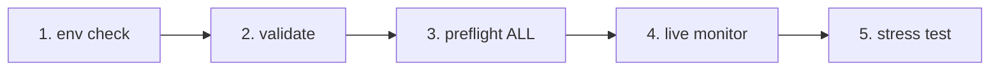

# IrsanAI TPM Agent Forge
[🇬🇧 English](../../README.md) | [🇩🇪 Deutsch](../../README.de.md) | [🇪🇸 Español](../../docs/i18n/README.es.md) | [🇮🇹 Italiano](../../docs/i18n/README.it.md) | [🇧🇦 Bosanski](../../docs/i18n/README.bs.md) | [🇷🇺 Русский](../../docs/i18n/README.ru.md) | [🇨🇳 中文](../../docs/i18n/README.zh-CN.md) | [🇫🇷 Français](../../docs/i18n/README.fr.md) | [🇧🇷 Português (BR)](../../docs/i18n/README.pt-BR.md) | [🇮🇳 हिन्दी](../../docs/i18n/README.hi.md) | [🇹🇷 Türkçe](../../docs/i18n/README.tr.md) | [🇯🇵 日本語](../../docs/i18n/README.ja.md)

[🇬🇧 English](../../README.md) | [🇩🇪 Deutsch](../../README.de.md) | [🇪🇸 Español](./README.es.md) | [🇮🇹 Italiano](./README.it.md) | [🇧🇦 Bosanski](./README.bs.md) | [🇷🇺 Русский](./README.ru.md) | [🇨🇳 中文](./README.zh-CN.md) | [🇫🇷 Français](./README.fr.md) | [🇧🇷 Português (BR)](./README.pt-BR.md) | [🇮🇳 हिन्दी](./README.hi.md) | [🇹🇷 Türkçe](./README.tr.md) | [🇯🇵 日本語](./README.ja.md)

Čist bootstrap za autonomni multi-agentni sistem (BTC, COFFEE i drugi) sa opcijama za izvođenje na više platformi.

## Šta je uključeno

- `production/preflight_manager.py` – otpornije ispitivanje izvora tržišta sa Alpha Vantage + lanac rezervnih izvora i lokalna keš rezerva.
- `production/tpm_agent_process.py` – jednostavna petlja za agenta po tržištu.
- `production/tpm_live_monitor.py` – monitor uživo za BTC sa opcionalnim CSV startom i Termux notifikacijama.
- `core/tpm_scientific_validation.py` – pipeline za backtest i statističku validaciju.
- `scripts/tpm_cli.py` – jedinstveni pokretač za Termux/Linux/macOS/Windows.
- `scripts/stress_test_suite.py` – stres test za failover i latenciju.
- `scripts/start_agents.sh`, `scripts/health_monitor_v3.sh` – pomoćni skripti za operacije procesa.
- `core/scout.py`, `core/reserve_manager.py`, `core/init_db_v2.py` – operativni osnovni alati.

## Univerzalni Quickstart

```bash
python scripts/tpm_cli.py env
python scripts/tpm_cli.py validate
python scripts/tpm_cli.py preflight --market ALL
python scripts/tpm_cli.py live --history-csv btc_real_24h.csv --poll-seconds 3600
```

## Provjera toka izvršavanja (kauzalna/redoslijedna validnost)

Zadani tok repozitorija je namjerno linearan da bi se izbjegla neprimijećena promjena stanja i “lažni osjećaj sigurnosti” tokom rada uživo.


```mermaid
flowchart LR
  A[1. env check] --> B[2. validate]
  B --> C[3. preflight ALL]
  C --> D[4. live monitor]
  D --> E[5. stress test]
```

### Logika kapija (što mora biti ispunjeno prije sljedećeg koraka)
- **Kapija 1 – Okruženje:** Python/okruženje platforme je ispravno (`env`).
- **Kapija 2 – Znanstvena ispravnost:** bazni model se može reproducirati (`validate`).
- **Kapija 3 – Pouzdanost izvora:** tržišni podaci + lanac rezervnih izvora su dostupni (`preflight --market ALL`).
- **Kapija 4 – Izvršavanje u runtime-u:** petlja uživo se izvodi sa poznatom poviješću podataka (`live`).
- **Kapija 5 – Povjerenje u stresnim uslovima:** ciljevi latencije i failovera se postižu pod stresom (`stress_test_suite.py`).

✅ Već ispravljeno u kodu: CLI preflight sada podržava `--market ALL`, što odgovara quickstart i docker toku.

## Izaberite svoju misiju (poziv na akciju po ulozi)

> **Jeste li X? Kliknite vašu kategoriju. Počnite za manje od 60 sekundi.**

| Persona | Ono što vas zanima | Put klika | Prva komanda |
|---|---|---|---|
| 📈 **Trgovac** | Brz puls, izvršne informacije u runtime-u | [`tpm_live_monitor.py`](./production/tpm_live_monitor.py) | `python scripts/tpm_cli.py live --history-csv btc_real_24h.csv --poll-seconds 3600` |
| 💼 **Investitor** | Stabilnost, povjerenje u izvor, otpornost | [`preflight_manager.py`](./production/preflight_manager.py) | `python scripts/tpm_cli.py preflight --market ALL` |
| 🔬 **Naučnik** | Dokazi, testovi, statistički signal | [`tpm_scientific_validation.py`](./core/tpm_scientific_validation.py) | `python scripts/tpm_cli.py validate` |
| 🧠 **Teoretičar** | Kauzalna struktura + buduća arhitektura | [`core/scout.py`](./core/scout.py) + [`Next Steps`](#next-steps) | `python scripts/tpm_cli.py validate` |
| 🛡️ **Skeptik (prioritet)** | Razbiti pretpostavke prije produkcije | [`stress_test_suite.py`](./scripts/stress_test_suite.py) + [`preflight_manager.py`](./production/preflight_manager.py) | `python scripts/tpm_cli.py preflight --market ALL && python scripts/stress_test_suite.py` |
| ⚙️ **Operator / DevOps** | Radni status, zdravlje procesa, oporavak | [`start_agents.sh`](./scripts/start_agents.sh) + [`health_monitor_v3.sh`](./scripts/health_monitor_v3.sh) | `bash scripts/start_agents.sh` |

### Izazov skeptika (preporučeno kao prvi korak za nove korisnike)
Ako uradite **samo jednu stvar**, pokrenite ovo i pregledajte izvještaj:

```bash
python scripts/tpm_cli.py preflight --market ALL
python scripts/stress_test_suite.py
```

Ako vas ovaj put uvjeri, ostatak repozitorija će vam vjerovatno također biti zanimljiv.

## Napomene za platformu

- **Android / Termux (Samsung i drugi)**
  ```bash
  bash scripts/termux_bootstrap.sh
  cd ~/TPM-Agent
  python scripts/tpm_cli.py env
  python scripts/tpm_cli.py preflight --market ALL
  python scripts/tpm_cli.py live --history-csv btc_real_24h.csv --notify --vibrate-ms 1000
  ```
  Za direktnu Android (Termux) demo web UI, pokrenite Forge runtime lokalno:
  ```bash
  cd ~/TPM-Agent
  bash scripts/termux_forge.sh start
  # stop: bash scripts/termux_forge.sh stop
  # status: bash scripts/termux_forge.sh status
  ```
  Skripta automatski otvara browser (ako je dostupan) i održava servis u pozadini.
  Ako ste na Androidu dobili grešku oko `pydantic-core`/Rust ili `scipy`/Fortran kompajliranja, koristite
  `python -m pip install -r requirements-termux.txt` (siguran set za Termux, nije potrebna Rust alatka).
  U web interfejsu možete kontrolisati start/stop runtime-a; progress bar prikazuje status tranzicije.
- **iPhone (best effort)**: koristite shell aplikacije kao što su iSH / a-Shell. Termux-specifične notifikacijske funkcionalnosti tu nisu dostupne.
- **Windows / Linux / macOS**: koristite iste CLI komande; pokretati preko tmux/scheduler/cron za trajnost rada.

## Docker (najlakši put za više OS)

Koristite Docker tačno ovim redoslijedom (bez nagađanja):

### Korak 1: Buildajte web runtime image

```bash
docker compose build --no-cache tpm-forge-web
```

### Korak 2: Pokrenite web dashboard servis

```bash
docker compose up tpm-forge-web
```

Sada otvorite `http://localhost:8787` u browseru (**ne** `http://0.0.0.0:8787`). Uvicorn interno vezuje na `0.0.0.0`, ali klijenti trebaju koristiti `localhost` (ili LAN IP hosta).

### Korak 3 (opcionalne provjere): razumite ne-web servise

```bash
docker compose run --rm tpm-preflight
docker compose run --rm tpm-live
```

- `tpm-preflight` = provera izvora i konektivnosti (samo CLI izlaz).
- `tpm-live` = live monitor logovi u terminalu (samo CLI izlaz, **nema web UI**).
- `tpm-forge-web` = FastAPI + dashboard UI (ono sa izgledom/progresom/kontrolom runtime-a).

Ako `tpm-preflight` javlja `ALPHAVANTAGE_KEY not set`, COFFEE i dalje radi preko rezervnih izvora.

Ako je stranica prazna:
- testirajte API direktno: `http://localhost:8787/api/frame`
- testirajte FastAPI dokumentaciju: `http://localhost:8787/docs`
- napravite hard refresh browsera (`Ctrl+F5`)
- po potrebi restartujte samo web servis: `docker compose restart tpm-forge-web`

Opcionalno za bolji COFFEE kvalitet:

```bash
export ALPHAVANTAGE_KEY="<your_key>"
docker compose run --rm tpm-preflight
```

## Predikcije grešaka & mobilne notifikacije

- Forge live kokpit sada izlaže kratkoročni pogled po tržištima (`up/down/sideways`) sa povjerenjem u `/api/markets/live`.
- Kad se otkrije greška tržišta (nagli skok akceleracije), runtime može pokrenuti:
  - Termux toast + vibraciju
  - opcionalni signal/notifikaciju/bip
  - opcionalno Telegram potiskivanje (ako su bot token/chat id podešeni u `config/config.yaml`).
- Konfigurišite u dashboardu putem **Save Alerts** / **Test Alert** ili API-ja:
  - `GET /api/alerts/preferences`
  - `POST /api/alerts/preferences`
  - `POST /api/alerts/test`

## Validacija

Pokrenite pipeline za naučnu validaciju:

```bash
python core/tpm_scientific_validation.py
```

Artefakti:
- `state/TPM_Scientific_Report.md`
- `state/TPM_test_results.json`

## Izvori & Failover

`production/preflight_manager.py` podržava:
- Prvo Alpha Vantage za COFFEE (ako je postavljen `ALPHAVANTAGE_KEY`)
- TradingView + Yahoo lanac rezervnih izvora
- lokalnu keš rezervu u `state/latest_prices.json`

Pokrenite preflight direktno:

```bash
export ALPHAVANTAGE_KEY="<your_key>"
python production/preflight_manager.py --market ALL
```

Pokrenite stres test prekida (cilj `p95 < 1000ms`):

```bash
python scripts/stress_test_suite.py
```

Izlaz: `state/stress_test_report.json`


## Status uživo: šta TPM agent može danas

**Trenutno stanje:**
- Production Forge web runtime dostupan (`production.forge_runtime:app`).
- Finansijski start koristi **BTC + COFFEE**.
- Live frame, kondicija agenta, transfer entropija i rezime domene vidljivi su u web dashboardu.
- Korisnici mogu dodavati nove tržišne agente tokom rada (`POST /api/agents`).

**Ciljane mogućnosti (should-have):**
- Benchmarking realnih podataka sa eksplicitnim pragovima prihvatanja (preciznost/pronalazak/lažni pozitivni).
- Stroga pravila refleksivne uprave za automatski safe-mode.
- Radni tok kolektivnog pamćenja za verzirane per-domain obrasce učenja.

**Sljedeća faza ekspanzije:**
- Orkestrator politika baziran na režimima (trend/šok/bočno) za sve agente.
- Pilot projekat izvan finansija (npr. medicinski ili seizmički) sa eksplicitnim ugovorima o podacima.

## Pomoć pri spajanju PR konflikata

- Merge-Checkliste (GitHub konflikti): `docs/MERGE_CONFLICT_CHECKLIST.de.md`

### Obuhvat danas: Windows + pametni telefon za finansijski TPM

- **Windows:** Forge runtime + web interfejs + Docker/PowerShell/klik-start su operativni.
- **Pametni telefon:** Android/Termux live monitoring radi; web UI responzivan na mobilnom.
- **Realtime multi-agent:** BTC + COFFEE aktivni po defaultu; dodatna tržišta mogu se dinamički dodavati u web UI.
- **Pravilo izvora granice:** ako traženo tržište nije pokriveno ugrađenim izvorima, dostaviti eksplicitan URL izvora + podatke za autorizaciju.

## Windows test uživo (sistem sa dva puta)

### Put A — programeri/power korisnici (PowerShell, CMD, PyCharm, IDE)

```powershell
python -m venv .venv
.\.venv\Scripts\Activate.ps1
pip install -r requirements.txt
python scripts/tpm_cli.py forge-dashboard --open-browser --port 8787
```

### Put B — korisnici niskog nivoa (klik i start)

1. Dvaput kliknite `scripts/windows_click_start.bat`
2. Skripta automatski bira najbolji dostupan put:
   - Ako je Python dostupan -> venv + pip + runtime
   - inače Docker Compose (ako je dostupan)

Tehnička osnova: `scripts/windows_bootstrap.ps1`.

## Forge Production Web Runtime (BTC + COFFEE, proširivo)

Da, ovo je **već započeto** u repozitoriju i sada se proširuje:

- Po defaultu starta sa jednim finansijskim TPM agentom za **BTC** i jednim za **COFFEE**.
- Korisnici mogu direktno iz web UI dodavati više tržišta/agenta (`/api/agents`).
- Radi kao postojana runtime usluga sa live frame izlazom (`/api/frame`) za duboku inspekciju.

### Start (lokalno)

```bash
uvicorn production.forge_runtime:app --host 0.0.0.0 --port 8787
# open http://localhost:8787
```

### Start (Docker)

```bash
docker compose up tpm-forge-web
# open http://localhost:8787
```

## TPM Playground (interaktivni MVP)

Sada možete interaktivno istražiti ponašanje TPM-a u browseru:

```bash
python -m http.server 8765
# open http://localhost:8765/playground/index.html
```

Obuhvata:
- Pogled anomalija sa jednim agentom sa slabim signalom
- Mini roj (BTC/COFFEE/VOL) konsenzusni pritisak
- Prenos rezonance između domena (sintetička finansija/vrijeme/zdravlje)

Pogledajte: `playground/README.md`.

## Sljedeći koraci

- Modul transfer entropije za kauzalnu analizu između tržišta.
- Optimizator sa ažuriranjima politika na osnovu historijskog učinka.
- Kanali za notifikacije (Telegram/Signal) + boot persistenacija.


---

## IrsanAI Dubinska analiza: Kako TPM jezgra „misli“ u složenim sistemima

### 1) Vizionarska transformacija: od trgovačkog agenta do univerzalnog TPM ekosistema

### Šta je jedinstveno u IrsanAI-TPM algoritmu? (ispravljena formulacija)

Radna hipoteza TPM jezgra:

- U složenim, haotičnim sistemima, signal ranog upozorenja često je sakriven u **mikro-rezidualima**: sitne devijacije, slabe korelacije, skoro prazne tačke podataka.
- Gdje klasični sistemi vide samo `0` ili "nedovoljnu relevantnost", TPM traži **strukturisane anomalije** (glitch obrasce) u kontekstualnom toku.
- TPM ne procjenjuje samo vrijednost, već i **promjenu odnosa kroz vrijeme, kvalitet izvora, režim i kauzalno okruženje**.

Važna napomena o ispravnosti: TPM **ne predviđa magično budućnost**. Cilj mu je **ranije probabilističko otkrivanje** promjena režima, probijanja i poremećaja — pod uslovom zadovoljavanja kvaliteta podataka i validacijskih kapija.

### Razmišljajte VELIKO: zašto je ovo više od finansija

Ako TPM može detektovati slabe predikcijske obrasce u finansijskim instrumentima (indeks/ticker/ISIN identifikatori, likvidnost, mikrostruktura), isti princip se može generalizirati na mnoge oblasti:

- **Tok događaja/senzora + model konteksta + sloj anomalija + povratna sprega**
- Svaka profesija može se modelirati kao „tržište“ sa domen-specifičnim karakteristikama, čvorovima, korelacijama i anomalijama
- Specijalizovani TPM agenti mogu učiti preko domena zadržavajući lokalnu profesionalnu logiku i etiku

### 100 profesija kao ciljna polja TPM-a

| # | Profesija | TPM analog podataka | Cilj otkrivanja anomalija/obrazaca |
|---|---|---|---|
| 1 | Policijski analitičar | Evidencije incidenata, geotemporalne karte kriminala, mreže | Rani signali eskalacije klastera kriminala |
| 2 | Komandant vatrogasne službe | Lanac alarma, senzorski podaci, vremenski uslovi, profili objekata | Predviđanje širenja požara i rizika |
| 3 | Hitni medicinski tehničar | Razlozi dispečera, vrijeme reakcije, opterećenje bolnice | Otkrivanje stresa kapaciteta prije kvara |
| 4 | Ljekar hitne pomoći | Tokovi trijaže, vitalni znakovi, dinamika vremena čekanja | Označavanje ranog pogoršanja stanja |
| 5 | Medicinska sestra na ICU | Ventilacija/laboratorijski trendovi, reakcija na lijekove | Identifikacija mikro signala sepse/šoka |
| 6 | Epidemiolog | Stopa slučajeva, mobilnost, vodovodni/laboratorijski podaci | Rano upozorenje izbijanja bolesti prije eksponencijalne faze |
| 7 | Porodični ljekar | Obrasci EHR, recepti, praznine u daljnjoj brizi | Rano otkrivanje prijelaza na hronični rizik |
| 8 | Klinički psiholog | Tokovi sesija, jezički markeri, spavanje/aktivnost | Rano otkrivanje relapsa/kriza |
| 9 | Farmaceutski istraživač | Pregled spojeva, profil neželjenih događaja, genomika | Otkrivanje skrivenih klastera efikasnosti i nuspojava |
| 10 | Biotehnolog | Sekvenca/proces/kulture ćelija | Detekcija drifta i rizika kontaminacije |
| 11 | Klimatolog | Atmosferski/oceanski vremenski nizovi, satelitski podaci | Identifikacija prediktora tačke preokreta |
| 12 | Meteorolog | Pritisak/vlažnost/vjetar/radarski podaci | Predviđanje lokalnih haotičnih pomjeranja vremena |
| 13 | Seizmolog | Mikro potresi, polja napetosti, senzorske mreže | Detekcija predznakova velikih oslobađanja energije |
| 14 | Vulkanolog | Gasovi, tremor, deformacije kroz vrijeme | Sužavanje prozora verovatnoće erupcije |
| 15 | Hidrolog | Mjerni instrumenti rijeka, kiša, vlažnost tla | Otkrivanje flash poplava i sušnih faza |
| 16 | Okeanograf | Struje, temperatura, slanost, podaci bova | Detekcija tsunami/anomalija od značaja za ekosistem |
| 17 | Trgovački energetski broker | Opterećenje, spot cijene, vremenski uslovi, stanje mreže | Rana signalizacija mogućih probijanja cijena/opterećenja |
| 18 | Operater elektrodistributivne mreže | Frekvencija mreže, stanje linija, događaji preklapanja | Otkrivanje rizika lančanih kvarova |
| 19 | Operater vjetroelektrane | Telemtrija turbine, vjetrovi, dnevnik održavanja | Predviđanje kvarova i drifta performansi |
| 20 | Operater solarne elektrane | Irradijacija, telemetrija invertera, toplinsko opterećenje | Otkrivanje degradacije i anomalija prinosa |
| 21 | Menadžer vodovodnog preduzeća | Protok, senzori kvaliteta, obrasci potrošnje | Rana detekcija kontaminacije/nedostatka |
| 22 | Menadžer saobraćaja | Gustina, sudari, radovi na putu, događaji | Predviđanje gužvi i eskalacije sudara |
| 23 | Kontrolor železnice | Poštivanje reda vožnje, stanje pruge, lanac kašnjenja | Rana detekcija lančanih kašnjenja |
| 24 | Kontrolor avionskog saobraćaja | Tragovi letova, vremenski uslovi, popunjenost slotova | Detekcija konfliktnih putanja i uskih grla |
| 25 | Menadžer luke | Vrijeme boravka, tok kontejnera, status carine | Predviđanje poremećaja u lancu snabdijevanja |
| 26 | Menadžer lanca snabdijevanja | Očekivano vrijeme dolaska, inventar, pulz potražnje, rizici | Minimizacija efekta biča i zalihe praznjenja |
| 27 | Vođa proizvodnje | OEE, telemetrija procesa, otpad, vreme podešavanja | Detekcija problema kvaliteta i anomalija mašina |
| 28 | Inženjer kvaliteta | Distribucije tolerancija, signali procesa | Otkrivanje predznakova gotovo bezgrešnog rada |
| 29 | Inženjer robotike | Putanje kretanja, opterećenje aktuatora, kontrolne petlje | Predviđanje nestabilnosti i kvarova kontrole |
| 30 | Inženjer održavanja aviona | Telemtrija motora/leta, istorija održavanja | Prediktivno održavanje na nivou komponenti |
| 31 | Menadžer gradnje | Napredak, vremenski uslovi, datumi isporuke, IoT senzori | Kvantifikacija rizika anomalija u rasporedu i troškovima |
| 32 | Strukturni inženjer | Opterećenje, vibracije, indikatori zamora/starenja | Otkrivanje kritičnih prelaza u strukturi |
| 33 | Urbanista | Mobilnost, demografija, emisije, upotreba zemljišta | Detekcija pojave urbanih stresnih obrazaca |
| 34 | Arhitekta | Rad zgrada, popunjenost, krivulje energije | Otkrivanje obrazaca nesaglasnosti dizajna i upotrebe |
| 35 | Poljoprivrednik | Podaci o tlu/vremenu/usjevu/tržištu | Rana detekcija bolesti i anomalija prinosa |
| 36 | Agronom | Satelitski podaci o hranjivosti i hidrataciji | Ciljane rane intervencije |
| 37 | Menadžer šumarstva | Vlažnost, obrasci štetočina, indikatori požara | Rana detekcija oštećenja šuma i prozori za požar |
| 38 | Menadžer ribarstva | Evidencije ulova, kvalitet vode, migracije | Otkrivanje rizika od prekomjernog ribolova/kollapsa |
| 39 | Inspektor sigurnosti hrane | Laboratorijski nalazi, evidencija hladnog lanca, veze u lancu opskrbe | Prekidanje lanaca kontaminacije na vrijeme |
| 40 | Izvršni kuhar | Pulz potražnje, stanje zaliha, omjeri otpada | Minimizacija propadanja i anomalija nestašice |
| 41 | Operater maloprodaje | POS tokovi, protok kupaca, rotacija inventara | Detekcija vrhova potražnje i obrazaca smanjenja zaliha |
| 42 | Menadžer e-trgovine | Klik tok, putanje korpe, povrati | Otkrivanje obrazaca prijevara i rizika od gubitka kupaca |
| 43 | Marketinški analitičar | Metričke kampanje, segmentni odgovori | Otkrivanje mikro-trendova prije šire javnosti |
| 44 | Vođa prodaje | Brzina toka prodajnog tunela, graf dodira | Otkrivanje rizika i prilika u vremenu sklapanja ugovora |
| 45 | Vođa korisničke podrške | Tok tiketa, klasteri tema, odstupanje SLA | Otkrivanje vala eskalacija i korijenskih uzroka |
| 46 | Menadžer proizvoda | Prihvat funkcija, zadržavanje, povratne informacije | Rano otkrivanje nesklada proizvod-tržište |
| 47 | Istraživač UX-a | Heatmap, putanje, tačke odustajanja | Otkrivanje skrivenih prepreka u interakciji |
| 48 | Softverski inženjer | Logovi, tragovi, metričke deploy-a | Otkrivanje kaskada kvarova prije incidenta |
| 49 | Inženjer pouzdanosti lokacije | Latencija, budžeti grešaka, saturacija | Hvatanje degradacije prije prekida rada |
| 50 | Analitičar sajber sigurnosti | Mrežni tokovi, IAM događaji, SIEM upozorenja | Otkrivanje putanja napada i lateralnih pokreta |
| 51 | Analitičar prevara | Grafici transakcija, otisci uređaja | Detekcija prevara u prostorima slabog signala |
| 52 | Menadžer rizika u banci | Izloženost portfolija/makro/liquditeta | Otkrivanje stres režima i koncentracionih rizika |
| 53 | Aktuari osiguranja | Tok šteta, karte izloženosti, klimatske veze | Predviđanje valova šteta i stresa rezervi |
| 54 | Savjetnik za porez | Obrasci knjigovodstva, rokovi podnošenja | Otkrivanje rizika usklađenosti i puteva optimizacije |
| 55 | Revizor | Kontrolni tragovi, obrasci izuzetaka | Otkrivanje anomalija u računovodstvu na velikoj skali |
| 56 | Advokat | Kronologija slučajeva, grafikoni presedana, rokovi | Otkrivanje rizika parnica i obrazaca ishoda |
| 57 | Sudija/administrator suda | Mješavina slučajeva, ciklus vremena | Otkrivanje uskih grla pravosudnog sistema |
| 58 | Menadžer zatvora | Popunjenost, mreže incidenata, trendovi ponašanja | Otkrivanje klastera nasilja/recidiva |
| 59 | Carinski službenik | Manifesti trgovine, deklaracije, obrasci ruta | Otkrivanje signala krijumčarenja/izbjegavanja |
| 60 | Analitičar obrambenih obavještajnih službi | ISR podaci, logistika, operativni tempo | Rana detekcija eskalacijskih dinamika |
| 61 | Diplomat | Lanac događaja, komunikacijski signali | Otkrivanje geopolitičkih promjena režima |
| 62 | Nastavnik | Napredak u učenju, prisustvo, angažman | Otkrivanje rizika od napuštanja škole i potreba za podrškom |
| 63 | Ravnatelj škole | Klasteri uspjeha, prisustvo, resursi | Otkrivanje sistemskih obrazaca stresa u školi |
| 64 | Univerzitetski predavač | Aktivnost na kursu, odustajanje, povratne informacije | Rano stabiliziranje uspjeha studenata |
| 65 | Istraživač obrazovanja | Tragovi kohorti, pedagoške varijable | Identifikacija robusnih efekata intervencija |
| 66 | Socijalni radnik | Mreže slučajeva, zakazani pregledi, rizici | Otkrivanje puteva eskalacije kriza |
| 67 | Koordinator nevladinih organizacija | Terenski izvještaji, tokovi pomoći, signali potreba | Otkrivanje praznina utjecaja i promjena žarišta |
| 68 | Savjetnik za zapošljavanje | Profil vještina, potražnja na tržištu, tranzicije | Otkrivanje nesklada i potreba za prekvalifikacijom |
| 69 | Menadžer ljudskih resursa | Zapošljavanje/otpusti/performanse | Rana detekcija sagorijevanja i rizika zadržavanja |
| 70 | Regruter | Stopu prolaska funnelom, taksonomija vještina, puls tržišta | Otkrivanje rizika pogodnosti i mogućnosti zapošljavanja |
| 71 | Konsultant za organizacije | Ritam donošenja odluka, drift KPI, mrežni obrasci | Rana detekcija disfunkcije tima |
| 72 | Menadžer projekata | Prekretnice, zavisnosti, graf prepreka | Predviđanje prekida u rasporedu/opsegu |
| 73 | Novinar | Graf povjerenja izvora, tokovi događaja | Rana detekcija klastera dezinformacija |
| 74 | Istraživački novinar | Mreže dokumenata, tragovi para/komunikacija | Otkrivanje skrivenih sistemskih anomalija |
| 75 | Moderator sadržaja | Tokovi postova/komentara, semantičke promjene | Rana detekcija talasa zloupotreba/radikalizacije |
| 76 | Umjetnik | Tokovi reakcija publike, vektori stila | Otkrivanje rastućih estetskih trendova |
| 77 | Producent muzike | Karakteristike slušanja, aranžmanski vektori | Rana detekcija potencijala za probijanje/niche |
| 78 | Dizajner igara | Telemtrija, progresija, krive odustajanja | Detekcija frustracije i anomalija balansa |
| 79 | Sportski trener | Tokovi performansi/biometrije | Otkrivanje predznakova povreda/pada forme |
| 80 | Sportski trener kondicije | Pokreti/markeri oporavka | Otkrivanje preopterećenja prije pauze |
| 81 | Sportski ljekar | Dijagnostika, opterećenje rehabilitacije, rizik ponavljanja | Optimizacija perioda povratka u igru |
| 82 | Analitičar sudijskih odluka | Tok odluka, tempo, kontekst incidenta | Detekcija drifta konzistentnosti/pravednosti |
| 83 | Menadžer događaja | Prodaja ulaznica, mobilnost, vrijeme, sigurnosni tokovi | Otkrivanje talasa povećanog rizika za masu i sigurnost |
| 84 | Menadžer turizma | Obrasci rezervacija, signali reputacije | Otkrivanje promjena potražnje i sentimenta |
| 85 | Menadžer hotela | Popunjenost, kvaliteta usluga, žalbe | Rana detekcija nestabilnosti kvaliteta i potražnje |
| 86 | Menadžer nekretnina | Tok zakupa, održavanje, lokalne komparacije | Otkrivanje rizika praznina i neplaćanja |
| 87 | Menadžer objekata | IoT u zgradama, energija, intervali održavanja | Otkrivanje kvarova i neefikasnosti |
| 88 | Operater upravljanja otpadom | Tokovi otpada, rute, metrički podaci o okolišu | Otkrivanje ilegalnih odlagališta i praznina procesa |
| 89 | Inspektor zaštite okoliša | Emisije, izvještaji, satelitske snimke | Otkrivanje kršenja propisa i rizika tačke preokreta |
| 90 | Analitičar cirkularne ekonomije | Materijalni pasoši, stope oporavka | Otkrivanje curenja i prilika za zatvaranje krugova |
| 91 | Astrofizičar | Tokovi teleskopa, spektar, modeli šuma | Otkrivanje rijetkih kosmičkih događaja |
| 92 | Inženjer svemirskih operacija | Telemtrija, parametri orbite, sistemska dijagnostika | Rana detekcija kritičnih anomalija misije |
| 93 | Kvantni inženjer | Profili šuma, drifti kalibracije, greške na vratima | Detekcija dekoherencije i drifta kontrole |
| 94 | Data naučnik | Drift osobina, kvalitet modela, integritet podataka | Otkrivanje kolapsa modela i promena pristranosti |
| 95 | AI etičar | Ishodi odluka, metrički pravednosti | Otkrivanje nepoštenih obrazaca i praznina u upravljanju |
| 96 | Istraživač filozofije nauke | Putevi teorija-dokaza | Otkrivanje signala nesklada paradigme |
| 97 | Matematičar | Rezidualne strukture, invarianti, termini grešaka | Otkrivanje skrivenih regularnosti/klasa odstupanja |
| 98 | Sistemski teoretičar | Dinamika čvorova i veza, kašnjenja povratnih sprega | Otkrivanje mrežne dinamičke tačke preokreta |
| 99 | Antropolog | Terenska opažanja, jezik/socijalne mreže | Otkrivanje predznakova sukoba kulturnih pomaka |
| 100 | Strateg budućnosti | Tehnološke krivulje, regulativa, podaci o ponašanju | Povezivanje scenarija sa ranim indikatorima |

### Napomene o prilagođenosti po zemljama (ekvivalencija profesija preko jurisdikcija)

Da bi lista bila logički ispravna u različitim regijama, mapiranje TPM uloga treba tumačiti kao **funkcionalne ekvivalente**, a ne doslovne prevode naziva zanimanja:

- **Njemačka ↔ SAD/UK:** `Polizei` vs podijeljene funkcije (`Police Department`, `Sheriff`, `State Trooper`) i razlike u tužilaštvu (`Staatsanwaltschaft` vs `District Attorney/Crown Prosecution`).
- **Španija / Italija:** sistemi civilnog prava sa posebnim sudskim i policijskim tokovima; često podaci prolaze regionalne i državne nivoe.
- **Bosna i Hercegovina:** višientitetska uprava znači fragmentisanost vlasništva podataka; TPM koristi fuziju anomalija u federiranom obliku.
- **Rusija / Kina:** definicije uloga i ograničenja upravljanja podacima se razlikuju; TPM mora biti konfigurisano prema lokalnim pravilima i institucionalnim ekvivalentima.
- **Dodatne važne regije:** Francuska, Brazil, Indija, Japan, MENA države i podsaharska Afrika moguće su uključene mapiranjem ekvivalentnih funkcija i dostupne telemetrije.

### Filozofsko-znanstveni pogled

- Od alata do **epistemske infrastrukture**: domeni operacionaliziraju “slabo rano znanje”.
- Od izolovanih sistema do **federacija agenata**: lokalna etika + zajednička gramatika anomalija.
- Od reaktivnog reagovanja do **anticipatorne uprave**: prevencija prije kasne kontrole krize.
- Od statičnih modela do **živih teorija**: kontinuirana prilagodba pod realnim udarima.

Osnovna ideja: odgovorno vođen TPM klaster ne može kontrolisati haos — ali može pomoći institucijama da ga ranije shvate, stabilnije usmjeravaju i donose humane odluke.

## Višejezična ekspanzija (u toku)

Za podršku rezonanci u više jezika dostupni su lokalizovani strateški pregledi na:

- Španski (`docs/i18n/README.es.md`)
- Italijanski (`docs/i18n/README.it.md`)
- Bosanski (`docs/i18n/README.bs.md`)
- Ruski (`docs/i18n/README.ru.md`)
- Kineski pojednostavljeni (`docs/i18n/README.zh-CN.md`)
- Francuski (`docs/i18n/README.fr.md`)
- Portugalski Brazil (`docs/i18n/README.pt-BR.md`)
- Hindi (`docs/i18n/README.hi.md`)
- Turski (`docs/i18n/README.tr.md`)
- Japanski (`docs/i18n/README.ja.md`)

Svaki lokalizovani fajl uključuje region-prilagođene napomene i upućuje na ovaj kanonski engleski odjeljak sa kompletnom matricom od 100 profesija.

## IrsanAI Kvalitet Meta (SOLL vs IST)

Za trenutni nivo zrelosti repozitorija, status kvaliteta i kauzalnu putanju razvoja zasnovanu na stvarnim korisničkim očekivanjima pogledajte:

- `docs/IRSANAI_QUALITY_META.md`

Ovaj dokument je od sada referenca za:
- Dubinu zahtjeva kod funkcionalnosti (UX/UI + operativna otpornost),
- Zahtjeve za paritet Docker/Android,
- Kao i kapije kvaliteta prihvatanja za buduće PR-ove.

## i18n paritetni mod (puna zrcalna sinhronizacija)

Da bi se osiguralo da nijedna jezička zajednica nije u nepovoljnom položaju, i18n fajlovi se sada održavaju u punom kanonskom paritetu sa `README.md`.

Komanda za sinhronizaciju:

```bash
python scripts/i18n_full_mirror_sync.py
```

## Napomena za developere (LOP – Lista otvorenih tačaka)

Šta je po mom mišljenju još otvoreno (strukturno, ne tehnički blokirano):

| Tačka | Trenutni status | Kako smisaono nastaviti |
|---|---|---|
| **Transfer-Entropy modul za Cross-Market kauzalnost** | **Završeno ✅** – implementiran kao `TransferEntropyEngine` i povezan u Forge orkestratoru. | Dodati strukturnu kalibraciju: definisati pragove i pravila tumačenja po domenima. |
| **Optimizer/Policy update baziran na historiji** | **Završeno ✅** – fitness skoring, reward update i candidate culling rade u ciklusu takta. | Dokumentovati režime rada (konzervativni/agresivni) i testirati kao profile uprave. |
| **Alerting (Telegram/Signal)** | **Djelomično dovršeno 🟡** – infrastruktura je postojala, po defaultu deaktivirana. | Definisati politiku alarma: koji događaji, koji nivoi težine, koji kanal, ko reaguje. |
| **Boot perzistencija / trajni rad** | **Djelomično dovršeno 🟡** – start i health monitor putem tmuxa postoje, ali nema jedinstvenog boot-runbooka za sve platforme. | Definisati profili platformi (Termux/Linux/Docker) sa startom pri boot-u, restart politikom i eskalacionim putem. |
| **Koordinirani meta-layer (iz „Naredna faza razvoja (promotet)“)** | **Djelomično dovršeno 🟡** – delovi postoje (orkestrator + entropija + reward), ali nije još opisano kao pun režimski orkestrator politika. | Dodati eksplicitan strukturni model uprave za trend/šok/bočno težine agenata. |
| **Kolektivno pamćenje (verzionirani arhiv obrazaca učenja)** | **Otvoreno 🔴** – spomenuto u vizijama/razvojnim odjeljcima, ali bez jasnog procesa skladištenja i pregleda. | Definisati format obrazaca učenja, verzionisanu logiku i kriterije kvaliteta (kada je obrazac „važeći“). |
| **Refleksivna uprava (automatski konzervativni mod u nesigurnosti)** | **Otvoreno 🔴** – kao ciljna slika navedeno, ali nije formalizovano kao strukturno pravilo odlučivanja. | Prevesti indikatore nesigurnosti i jake uslove prebacivanja u pravila uprave. |
| **Proširenje domena preko finansija i vremena** | **Otvoreno 🔴** – dodatni domeni su definirani kao vizija/šabloni, ali nisu pretvoreni u produkcijske ugovore o podacima. | Pokrenuti sledeći domenski pilot (npr. medicinski ili seizmički) sa jasnim metrikama i izvorima podataka. |
| **Proširenje naučnih dokaza na realne podatke** | **Otvoreno 🔴** – trenutna validacija je robusna, ali bazirana na sintetičkim režimskim segmentima. | Dodati benchmarking sa realnim podacima i fiksne kriterije prihvatanja (preciznost/pronalazak/lažni pozitivni/drift). |
| **Višejezična rezonanca / razvoj i18n** | **Djelomično dovršeno 🟡** – postoje višejezične landing stranice; razvoj je označen kao „u toku“. | Definisati proces sinhronizacije (kada se izmjene iz root README propagiraju u sve i18n README). |

Kratki zaključak: Prethodni „Naredni koraci“ su **tehnički uglavnom započeti ili urađeni**; najveći potencijal je sada u **strukturnoj operacionalizaciji** (uprava, politike, domeni, naučni dokazi) i **konzistentnom radu sa dokumentacijom/i18n**.

### Plan izvršenja LOP-a

Za raspored implementacije, kriterije završetka i kapije dokaza za svaku tačku LOP-a pogledajte:

- `docs/LOP_EXECUTION_PLAN.md`

## LOP (završni prioriteti)

1. **P1 Proširenje dokaza na realne podatke:** benchmarking sa fiksnim kriterijima prihvatanja (preciznost/pronalazak/lažni pozitivni/drift).
2. **P2 Finalizacija refleksivne uprave:** definirati stroga pravila za automatski safe-mode u nesigurnosti.
3. **P3 Standardizacija kolektivnog pamćenja:** verzionirani obrasci učenja sa procesom pregleda po domenima.
4. **P4 Dalje širenje web imerzije:** prikazi uloga za više TPM industrija bazirani na novom responzivnom dizajnu.

**Napomena platforme:** trenutno primarno fokusirano na **Windows + pametni telefon**. **Kasnije nakon LOP dodati:** macOS, Linux i dodatne platforme.