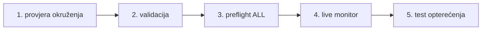

# IrsanAI TPM Agent Forge

[🇬🇧 English](./README.md) | [🇩🇪 Deutsch](./README.de.md) | [🇪🇸 Español](./docs/i18n/README.es.md) | [🇮🇹 Italiano](./docs/i18n/README.it.md) | [🇧🇦 Bosanski](./docs/i18n/README.bs.md) | [🇷🇺 Русский](./docs/i18n/README.ru.md) | [🇨🇳 中文](./docs/i18n/README.zh-CN.md) | [🇫🇷 Français](./docs/i18n/README.fr.md) | [🇧🇷 Português (BR)](./docs/i18n/README.pt-BR.md) | [🇮🇳 हिन्दी](./docs/i18n/README.hi.md) | [🇹🇷 Türkçe](./docs/i18n/README.tr.md) | [🇯🇵 日本語](./docs/i18n/README.ja.md)

Čisto pokretanje za autonomno postavljanje više agenata (BTC, COFFEE i više) s mogućnostima izvršavanja na više platformi.

## Što je uključeno

- `production/preflight_manager.py` – otporno sondiranje tržišnog izvora s Alpha Vantage + rezervnim lancem i lokalnom predmemorijom.
- `production/tpm_agent_process.py` – jednostavna petlja agenta po tržištu.
- `production/tpm_live_monitor.py` – live BTC monitor s opcionalnim CSV-om za toplo pokretanje i Termux obavijestima.
- `core/tpm_scientific_validation.py` – backtest + cjevovod za statističku validaciju.
- `scripts/tpm_cli.py` – unificirani pokretač za Termux/Linux/macOS/Windows.
- `scripts/stress_test_suite.py` – test otpornosti na kvarove/latenciju.
- `scripts/start_agents.sh`, `scripts/health_monitor_v3.sh` – pomoćnici za operacije procesa.
- `core/scout.py`, `core/reserve_manager.py`, `core/init_db_v2.py` – operativni osnovni alati.

## Univerzalni brzi početak

```bash
python scripts/tpm_cli.py env
python scripts/tpm_cli.py validate
python scripts/tpm_cli.py preflight --market ALL
python scripts/tpm_cli.py live --history-csv btc_real_24h.csv --poll-seconds 3600
```

## Provjera lanca izvršavanja (uzročna/redovna ispravnost)

Zadani tijek repozitorija namjerno je linearan kako bi se izbjeglo pomicanje skrivenog stanja i "lažna sigurnost" tijekom izvršavanja uživo.


```mermaid
flowchart LR
  A[1. provjera okruženja] --> B[2. validacija]
  B --> C[3. preflight ALL]
  C --> D[4. live monitor]
  D --> E[5. test opterećenja]
```

### Logika vrata (što mora biti istina prije sljedećeg koraka)
- **Vrata 1 – Okruženje:** Python/platformski kontekst je ispravan (`env`).
- **Vrata 2 – Znanstvena ispravnost:** ponašanje osnovnog modela je reproducibilno (`validate`).
- **Vrata 3 – Pouzdanost izvora:** tržišni podaci + rezervni lanac su dohvatljivi (`preflight --market ALL`).
- **Vrata 4 – Izvršavanje u stvarnom vremenu:** petlja uživo radi s poznatom povijesti unosa (`live`).
- **Vrata 5 – Protivnička sigurnost:** ciljevi latencije/otpornosti na kvarove drže se pod stresom (`stress_test_suite.py`).

✅ Već popravljeno u kodu: CLI preflight sada podržava `--market ALL`, što odgovara brzom pokretanju + docker tijeku.

## Odaberite svoju misiju (CTA po ulozi)

> **Jeste li X? Kliknite svoju traku. Počnite za <60 sekundi.**

| Persona | Što vas zanima | Put klika | Prva naredba |
|---|---|---|---|
| 📈 **Trgovac** | Brzi puls, djelotvorno izvršavanje | [`tpm_live_monitor.py`](./production/tpm_live_monitor.py) | `python scripts/tpm_cli.py live --history-csv btc_real_24h.csv --poll-seconds 3600` |
| 💼 **Investitor** | Stabilnost, povjerenje u izvor, otpornost | [`preflight_manager.py`](./production/preflight_manager.py) | `python scripts/tpm_cli.py preflight --market ALL` |
| 🔬 **Znanstvenik** | Dokazi, testovi, statistički signal | [`tpm_scientific_validation.py`](./core/tpm_scientific_validation.py) | `python scripts/tpm_cli.py validate` |
| 🧠 **Teoretičar** | Uzročna struktura + buduća arhitektura | [`core/scout.py`](./core/scout.py) + [`Sljedeći koraci`](#next-steps) | `python scripts/tpm_cli.py validate` |
| 🛡️ **Skeptik (prioritet)** | Prekinite pretpostavke prije proizvodnje | [`stress_test_suite.py`](./scripts/stress_test_suite.py) + [`preflight_manager.py`](./production/preflight_manager.py) | `python scripts/tpm_cli.py preflight --market ALL && python scripts/stress_test_suite.py` |
| ⚙️ **Operator / DevOps** | Neprekidan rad, zdravlje procesa, mogućnost oporavka | [`start_agents.sh`](./scripts/start_agents.sh) + [`health_monitor_v3.sh`](./scripts/health_monitor_v3.sh) | `bash scripts/start_agents.sh` |

### Izazov skeptika (preporučeno prvo za nove posjetitelje)
Ako učinite **samo jednu stvar**, pokrenite ovo i pregledajte izlaz izvješća:

```bash
python scripts/tpm_cli.py preflight --market ALL
python scripts/stress_test_suite.py
```

Ako vas ova traka uvjeri, ostatak repozitorija će vjerojatno također rezonirati.

## Bilješke o platformi

- **Android / Termux (Samsung, itd.)**
  ```bash
  bash scripts/termux_bootstrap.sh
  cd ~/TPM-Agent
  python scripts/tpm_cli.py env
  python scripts/tpm_cli.py preflight --market ALL
  python scripts/tpm_cli.py live --history-csv btc_real_24h.csv --notify --vibrate-ms 1000
  ```
  Za izravnu Android (Termux) web UI demonstraciju, pokrenite Forge runtime lokalno:
  ```bash
  cd ~/TPM-Agent
  bash scripts/termux_forge.sh start
  # stop: bash scripts/termux_forge.sh stop
  # status: bash scripts/termux_forge.sh status
  ```
  Skripta automatski otvara preglednik (ako je dostupan) i drži uslugu pokrenutom u pozadini.
  Ako ste vidjeli grešku `pydantic-core`/Rust ili `scipy`/Fortran builda na Androidu, koristite
  `python -m pip install -r requirements-termux.txt` (Termux-sigurno postavljanje, nije potreban Rust alat).
  U web sučelju možete kontrolirati pokretanje/zaustavljanje runtimea; traka napretka prikazuje status prijelaza.
- **iPhone (najbolji pokušaj)**: koristite shell aplikacije kao što su iSH / a-Shell. Obavijesti specifične za Termux nisu tamo dostupne.
- **Windows / Linux / macOS**: koristite iste CLI naredbe; pokrenite putem tmux/scheduler/cron za postojanost.

## Docker (najlakši put između OS-a)

Koristite Docker ovim točnim redoslijedom (bez nagađanja):

### Korak 1: Izgradite web runtime sliku

```bash
docker compose build --no-cache tpm-forge-web
```

### Korak 2: Pokrenite web nadzornu ploču

```bash
docker compose up tpm-forge-web
```

Sada otvorite `http://localhost:8787` u svom pregledniku (**ne** `http://0.0.0.0:8787`). Uvicorn se interno veže na `0.0.0.0`, ali klijenti bi trebali koristiti `localhost` (ili IP adresu lokalne mreže).

### Korak 3 (opcionalne provjere): razumijevanje ne-web usluga

```bash
docker compose run --rm tpm-preflight
docker compose run --rm tpm-live
```

- `tpm-preflight` = provjere izvora/povezivosti (samo CLI izlaz).
- `tpm-live` = dnevnici terminala uživo (samo CLI izlaz, **bez web sučelja**).
- `tpm-forge-web` = FastAPI + nadzorna ploča (ona s izgledom/napretkom/kontrolom izvršavanja).

Ako `tpm-preflight` prijavi `ALPHAVANTAGE_KEY not set`, COFFEE i dalje radi putem rezervnih opcija.

Ako stranica izgleda prazno:
- testirajte API izravno: `http://localhost:8787/api/frame`
- testirajte FastAPI dokumentaciju: `http://localhost:8787/docs`
- tvrdo osvježite preglednik (`Ctrl+F5`)
- ako je potrebno, ponovno pokrenite samo web uslugu: `docker compose restart tpm-forge-web`

Opcionalno za bolju COFFEE kvalitetu:

```bash
export ALPHAVANTAGE_KEY="<vaš_ključ>"
docker compose run --rm tpm-preflight
```

## Predviđanja grešaka i mobilna upozorenja

- Forge live kokpit sada prikazuje kratkoročne izglede po tržištu (`gore/dolje/bočno`) s pouzdanošću u `/api/markets/live`.
- Kada se otkrije tržišna greška (naglo ubrzanje), runtime može pokrenuti:
  - Termux toast + vibraciju
  - opcionalnu kuku za obavijesti/zvučni signal
  - opcionalno Telegram push (ako je token bota/ID chata konfiguriran u `config/config.yaml`).
- Konfigurirajte na nadzornoj ploči putem **Spremi upozorenja** / **Testiraj upozorenje** ili API-ja:
  - `GET /api/alerts/preferences`
  - `POST /api/alerts/preferences`
  - `POST /api/alerts/test`

## Validacija

Pokrenite cjevovod znanstvene validacije:

```bash
python core/tpm_scientific_validation.py
```

Artefakti:
- `state/TPM_Scientific_Report.md`
- `state/TPM_test_results.json`

## Izvori i prebacivanje na rezervni sustav

`production/preflight_manager.py` podržava:
- Alpha Vantage prvo za COFFEE (kada je `ALPHAVANTAGE_KEY` postavljen)
- TradingView + Yahoo rezervni lanac
- lokalna keširana rezervna opcija u `state/latest_prices.json`

Pokrenite preflight izravno:

```bash
export ALPHAVANTAGE_KEY="<vaš_ključ>"
python production/preflight_manager.py --market ALL
```

Pokrenite test opterećenja u slučaju prekida (cilj `p95 < 1000ms`):

```bash
python scripts/stress_test_suite.py
```

Izlaz: `state/stress_test_report.json`


## Status uživo: što TPM agent može učiniti danas

**Trenutno stanje:**
- Dostupan je proizvodni Forge web runtime (`production.forge_runtime:app`).
- Konfiguracija pokretanja s prioritetom na financije koristi **BTC + COFFEE**.
- Okvir uživo, agent fitness, transfer entropija i sažetak domene vidljivi su na web nadzornoj ploči.
- Korisnici mogu dodati nove tržišne agente u runtime-u (`POST /api/agents`).

**Ciljana sposobnost (trebalo bi imati):**
- Referentna analiza stvarnih podataka s eksplicitnim pragovima prihvaćanja (preciznost/odziv/FPR/drift).
- Stroga refleksivna pravila upravljanja za automatski sigurni način rada.
- Radni tijek kolektivnog pamćenja za verzirane obrasce učenja po domeni.

**Sljedeća faza proširenja:**
- Orkestrator politika temeljen na režimu (trend/šok/bočno) za sve agente.
- Jedan nefinancijski pilot projekt (npr. medicinski ili seizmički) s eksplicitnim ugovorima o podacima.


## Pomoćnik za spajanje PR-a

- Popis za provjeru spajanja (GitHub konflikti): `docs/MERGE_CONFLICT_CHECKLIST.de.md`


### Opseg danas: Windows + pametni telefon za financijski TPM

- **Windows:** Forge runtime + web sučelje + Docker/PowerShell/click-start su operativni.
- **Pametni telefon:** Android/Termux nadzor uživo je operativan; web UI je responsivan na mobilnim uređajima.
- **Više agenata u stvarnom vremenu:** BTC + COFFEE aktivni su po zadanim postavkama; dodatna tržišta mogu se dinamički dodati u web sučelju.
- **Pravilo granice izvora:** ako traženo tržište nije pokriveno ugrađenim izvorima, navedite eksplicitni URL izvora + podatke o autorizaciji.

## Windows test uživo (dvostazni sustav)

### Put A — Programeri/napredni korisnici (PowerShell, CMD, PyCharm, IDE)

```powershell
python -m venv .venv
.\.venv\Scripts\Activate.ps1
pip install -r requirements.txt
python scripts/tpm_cli.py forge-dashboard --open-browser --port 8787
```

### Put B — Korisnici niske razine (klikni i pokreni)

1. Dvostruki klik `scripts/windows_click_start.bat`
2. Skripta automatski odabire najbolji dostupan put:
   - Python dostupan -> venv + pip + runtime
   - inače Docker Compose (ako je dostupan)

Tehnička osnova: `scripts/windows_bootstrap.ps1`.

## Forge Production Web Runtime (BTC + COFFEE, proširivo)

Da, ovo je **već započelo** u repozitoriju i sada je prošireno:

- Pokreće se prema zadanim postavkama s jednim financijskim TPM agentom za **BTC** i jednim za **COFFEE**.
- Korisnici mogu dodati više tržišta/agenata izravno iz web sučelja (`/api/agents`).
- Radi kao trajna runtime usluga s izlazom okvira uživo (`/api/frame`) za impresivan uvid.

### Pokretanje (lokalno)

```bash
uvicorn production.forge_runtime:app --host 0.0.0.0 --port 8787
# otvori http://localhost:8787
```

### Pokretanje (Docker)

```bash
docker compose up tpm-forge-web
# otvori http://localhost:8787
```

## TPM igralište (interaktivni MVP)

Sada možete istraživati TPM ponašanje interaktivno u pregledniku:

```bash
python -m http.server 8765
# otvori http://localhost:8765/playground/index.html
```

Uključuje:
- Prikaz anomalija slabog signala jednog agenta
- Mini roj (BTC/COFFEE/VOL) konsenzusni pritisak
- Unakrsna domenska transfer rezonancija (sintetičke financije/vrijeme/zdravlje)

Pogledajte: `playground/README.md`.
## Sljedeći koraci

- Modul za prijenos entropije za uzročnu analizu između tržišta.
- Optimizator s ažuriranjem politike na temelju povijesnih performansi.
- Kanali za upozorenja (Telegram/Signal) + postojanost pri pokretanju.


---

## IrsanAI dubinska analiza: Kako TPM jezgra "razmišlja" u složenim sustavima

### 1) Vizionarska transformacija: od trgovinskog agenta do univerzalnog TPM ekosustava

### Što je jedinstveno kod IrsanAI-TP