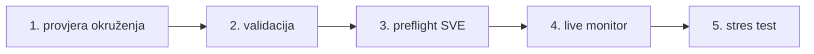

# IrsanAI TPM Agent Forge
[🇬🇧 English](../../README.md) | [🇩🇪 Deutsch](../../README.de.md) | [🇪🇸 Español](../../docs/i18n/README.es.md) | [🇮🇹 Italiano](../../docs/i18n/README.it.md) | [🇧🇦 Bosanski](../../docs/i18n/README.bs.md) | [🇷🇺 Русский](../../docs/i18n/README.ru.md) | [🇨🇳 中文](../../docs/i18n/README.zh-CN.md) | [🇫🇷 Français](../../docs/i18n/README.fr.md) | [🇧🇷 Português (BR)](../../docs/i18n/README.pt-BR.md) | [🇮🇳 हिन्दी](../../docs/i18n/README.hi.md) | [🇹🇷 Türkçe](../../docs/i18n/README.tr.md) | [🇯🇵 日本語](../../docs/i18n/README.ja.md)

[🇬🇧 English](../../README.md) | [🇩🇪 Deutsch](../../README.de.md) | [🇪🇸 Español](./README.es.md) | [🇮🇹 Italiano](./README.it.md) | [🇧🇦 Bosanski](./README.bs.md) | [🇷🇺 Русский](./README.ru.md) | [🇨🇳 中文](./README.zh-CN.md) | [🇫🇷 Français](./README.fr.md) | [🇧🇷 Português (BR)](./README.pt-BR.md) | [🇮🇳 हिन्दी](./README.hi.md) | [🇹🇷 Türkçe](./README.tr.md) | [🇯🇵 日本語](./README.ja.md)

Čist bootstrap za autonomnu multi-agent konfiguraciju (BTC, COFFEE i više) sa cross-platform runtime opcijama.

## Šta je uključeno

- `production/preflight_manager.py` – otporna provjera izvora tržišta sa Alpha Vantage + lanac rezervi i lokalno keširanje kao rezervna opcija.
- `production/tpm_agent_process.py` – jednostavan po-tržišni agentski loop.
- `production/tpm_live_monitor.py` – live BTC monitoring sa opcionalnim CSV warm-startom i Termux notifikacijama.
- `core/tpm_scientific_validation.py` – backtest + pipeline za statističku validaciju.
- `scripts/tpm_cli.py` – unificirani launcher za Termux/Linux/macOS/Windows.
- `scripts/stress_test_suite.py` – stres test za failover i latenciju.
- `scripts/start_agents.sh`, `scripts/health_monitor_v3.sh` – pomoćni alati za upravljanje procesima.
- `core/scout.py`, `core/reserve_manager.py`, `core/init_db_v2.py` – operativni core alati.

## Univerzalni Quickstart

```bash
python scripts/tpm_cli.py env
python scripts/tpm_cli.py validate
python scripts/tpm_cli.py preflight --market ALL
python scripts/tpm_cli.py live --history-csv btc_real_24h.csv --poll-seconds 3600
```

## Provjera lanca u runtime-u (uzročno/redoslijedna provjera)

Podrazumijevani tok repozitorija je namjerno linearan da bi se izbjegla drifta skrivljenog stanja i "lažna sigurnost" tokom živih sesija.


```mermaid
flowchart LR
  A[1. provjera okruženja] --> B[2. validacija]
  B --> C[3. preflight SVE]
  C --> D[4. live monitor]
  D --> E[5. stres test]
```

### Logika prolaznih vrata (šta mora biti tačno prije sljedećeg koraka)
- **Vrata 1 – Okruženje:** Python/platforma mora biti ispravno podešena (`env`).
- **Vrata 2 – Naučna ispravnost:** osnovno ponašanje modela je reproduktivno (`validate`).
- **Vrata 3 – Pouzdanost izvora:** podaci o tržištu i lanac rezervi moraju biti dostupni (`preflight --market ALL`).
- **Vrata 4 – Runtime izvršenje:** live loop radi sa poznatom historijom unosa (`live`).
- **Vrata 5 – Povjerenje u stres situacijama:** ciljane latencije/failover funkcije drže pod stresom (`stress_test_suite.py`).

✅ Već ispravljeno u kodu: CLI preflight sada podržava `--market ALL`, što se podudara sa quickstart + docker tijekom.

## Izaberite svoju misiju (poziv na akciju prema ulozi)

> **Jeste li vi X? Kliknite svoju traku. Počnite za manje od 60 sekundi.**

| Persona | Šta vas zanima | Put klika | Prva naredba |
|---|---|---|---|
| 📈 **Trgovac** | Brz puls, akcioni runtime | [`tpm_live_monitor.py`](./production/tpm_live_monitor.py) | `python scripts/tpm_cli.py live --history-csv btc_real_24h.csv --poll-seconds 3600` |
| 💼 **Investitor** | Stabilnost, povjerenje u izvore, otpornost | [`preflight_manager.py`](./production/preflight_manager.py) | `python scripts/tpm_cli.py preflight --market ALL` |
| 🔬 **Naučnik** | Dokazi, testovi, statistički signal | [`tpm_scientific_validation.py`](./core/tpm_scientific_validation.py) | `python scripts/tpm_cli.py validate` |
| 🧠 **Teoretičar** | Uzročna struktura + buduća arhitektura | [`core/scout.py`](./core/scout.py) + [`Next Steps`](#next-steps) | `python scripts/tpm_cli.py validate` |
| 🛡️ **Skeptik (prioritet)** | Razbijanje pretpostavki prije produkcije | [`stress_test_suite.py`](./scripts/stress_test_suite.py) + [`preflight_manager.py`](./production/preflight_manager.py) | `python scripts/tpm_cli.py preflight --market ALL && python scripts/stress_test_suite.py` |
| ⚙️ **Operator / DevOps** | Uptime, zdravlje procesa, oporavak | [`start_agents.sh`](./scripts/start_agents.sh) + [`health_monitor_v3.sh`](./scripts/health_monitor_v3.sh) | `bash scripts/start_agents.sh` |

### Skeptikov izazov (preporučeno prvo za nove posjetioce)
Ako radite **samo jednu stvar**, pokrenite ovo i pregledajte izlazni izvještaj:

```bash
python scripts/tpm_cli.py preflight --market ALL
python scripts/stress_test_suite.py
```

Ako vas ovaj put uvjeri, vjerovatno će vam se svidjeti i ostatak repozitorija.

## Napomene o platformi

- **Android / Termux (Samsung, itd.)**
  ```bash
  bash scripts/termux_bootstrap.sh
  cd ~/TPM-Agent
  python scripts/tpm_cli.py env
  python scripts/tpm_cli.py preflight --market ALL
  python scripts/tpm_cli.py live --history-csv btc_real_24h.csv --notify --vibrate-ms 1000
  ```
  Za direktnu Android (Termux) web UI demo, pokrenite Forge runtime lokalno:
  ```bash
  cd ~/TPM-Agent
  bash scripts/termux_forge.sh start
  # zaustavljanje: bash scripts/termux_forge.sh stop
  # status: bash scripts/termux_forge.sh status
  ```
  Skripta automatski otvara browser (ako je dostupan) i održava servis u pozadini.
  Ako ste primijetili grešku pri gradnji `pydantic-core`/Rust ili `scipy`/Fortran na Androidu, koristite
  `python -m pip install -r requirements-termux.txt` (Termux-safe set, bez potrebe za Rust alatima).
  U web sučelju možete kontrolisati start/stop runtime-a; progres bar prikazuje status tranzicije.
- **iPhone (najbolji napor)**: koristite shell aplikacije poput iSH / a-Shell. Termux-specifični notifikacioni hookovi nisu dostupni.
- **Windows / Linux / macOS**: koristite iste CLI naredbe; pokrećite kroz tmux/scheduler/cron za trajnost.

## Docker (najlakši cross-OS put)

Koristite Docker tačno redom navedenim ispod (bez nagađanja):

### Korak 1: Sastavite sliku web runtime-a

```bash
docker compose build --no-cache tpm-forge-web
```

### Korak 2: Pokrenite web dashboard servis

```bash
docker compose up tpm-forge-web
```

Sada otvorite `http://localhost:8787` u browseru (**ne** `http://0.0.0.0:8787`). Uvicorn veže internu adresu na `0.0.0.0`, ali klijenti trebaju koristiti `localhost` (ili LAN IP hosta).

### Korak 3 (opcionalne provjere): razumite non-web servise

```bash
docker compose run --rm tpm-preflight
docker compose run --rm tpm-live
```

- `tpm-preflight` = provjere izvora/konekcije (samo CLI izlaz).
- `tpm-live` = live-monitor logovi u terminalu (samo CLI, **bez web UI**).
- `tpm-forge-web` = FastAPI + dashboard UI (onaj sa layout-om/progresom/kontrolom runtime-a).

Ako `tpm-preflight` prijavi `ALPHAVANTAGE_KEY not set`, COFFEE i dalje funkcioniše preko rezervi.

Ako stranica izgleda prazno:
- testirajte API direktno: `http://localhost:8787/api/frame`
- testirajte FastAPI dokumentaciju: `http://localhost:8787/docs`
- hard refresh browsera (`Ctrl+F5`)
- ako treba, restartajte samo web servis: `docker compose restart tpm-forge-web`

Opcionalno za bolji kvalitet COFFEE-a:

```bash
export ALPHAVANTAGE_KEY="<your_key>"
docker compose run --rm tpm-preflight
```

## Predviđanja grešaka & mobilna upozorenja

- Forge live kokpit sada prikazuje kratkoročne prognoze po tržištu (`gore/dole/bočno`) sa povjerenjem u `/api/markets/live`.
- Kad se otkrije greška na tržištu (ubrzanje), runtime može aktivirati:
  - Termux toast + vibracija
  - opcionalni notifikacioni/signali
  - opcionalni Telegram push (ako je bot token/chat ID konfigurisan u `config/config.yaml`).
- Konfigurišite u dashboard-u putem **Save Alerts** / **Test Alert** ili API-ja:
  - `GET /api/alerts/preferences`
  - `POST /api/alerts/preferences`
  - `POST /api/alerts/test`

## Validacija

Pokrenite pipeline za naučnu validaciju:

```bash
python core/tpm_scientific_validation.py
```

Artefakti:
- `state/TPM_Scientific_Report.md`
- `state/TPM_test_results.json`

## Izvori & failover

`production/preflight_manager.py` podržava:
- Prvenstveno Alpha Vantage za COFFEE (ako je `ALPHAVANTAGE_KEY` postavljen)
- TradingView + Yahoo lanac rezervi
- lokalni cache rezervnu opciju u `state/latest_prices.json`

Pokrenite preflight direktno:

```bash
export ALPHAVANTAGE_KEY="<your_key>"
python production/preflight_manager.py --market ALL
```

Pokrenite stres test za prekide (cilj `p95 < 1000ms`):

```bash
python scripts/stress_test_suite.py
```

Izlaz: `state/stress_test_report.json`


## Trenutni status: šta TPM agent može danas

**Trenutno stanje:**
- Production Forge web runtime je dostupan (`production.forge_runtime:app`).
- Finansijski početni set koristi **BTC + COFFEE**.
- Live frame, agent fitness, transfer entropija i domain summary vidljivi su na web dashboard-u.
- Korisnici mogu dodavati nove agentske instance za tržišta u runtime-u (`POST /api/agents`).

**Ciljane mogućnosti (trebalo bi biti):**
- Benchmarking sa realnim podacima sa eksplicitnim prihvatnim pragovima (preciznost/poziv/lažni pozitivni i drift).
- Stroge refleksivne upravljačke procedure za automatski safe-mode.
- Workflow za kolektivno pamćenje sa verzionim per-domain obrascima učenja.

**Sljedeća faza proširenja:**
- Regime-based policy orchestrator (trend/šok/bočno) za sve agente.
- Jedan pilot nefinansijske domene (npr. medicinska ili seizmička) sa jasnim data ugovorima.

## Pomoć za merge konflikate PR

- Merge-checklista (GitHub konflikti): `docs/MERGE_CONFLICT_CHECKLIST.de.md`

### Današnji domet: Windows + pametni telefon za finansijski TPM

- **Windows:** Forge runtime + web sučelje + Docker/PowerShell/klik start su u funkciji.
- **Pametni telefon:** Android/Termux live-monitoring je u funkciji; web UI je responzivan na mobilnim uređajima.
- **Realtime multi-agent:** BTC + COFFEE su aktivni po defaultu; dodatna tržišta se mogu dinamički dodavati u web UI.
- **Pravila izvora:** ako traženo tržište nije pokriveno ugrađenim izvorima, obezbijedite eksplicitan URL izvora + autorizacione podatke.

## Windows live test (dva puta sistem)

### Put A — Developer/power korisnici (PowerShell, CMD, PyCharm, IDE)

```powershell
python -m venv .venv
.\.venv\Scripts\Activate.ps1
pip install -r requirements.txt
python scripts/tpm_cli.py forge-dashboard --open-browser --port 8787
```

### Put B — Niskonivo korisnici (klik & start)

1. Dvaput kliknite `scripts/windows_click_start.bat`
2. Skripta automatski bira najbolji dostupni put:
   - Ako je Python dostupan -> venv + pip + runtime
   - inače Docker Compose (ako je dostupan)

Tehnička osnova: `scripts/windows_bootstrap.ps1`.

## Forge Production Web Runtime (BTC + COFFEE, proširivo)

Da, ovo je **već započeto** u repozitoriju i sada prošireno:

- Po defaultu pokreće jednog finansijskog TPM agenta za **BTC** i jednog za **COFFEE**.
- Korisnici mogu direktno iz web UI dodavati više tržišta/agenta (`/api/agents`).
- Radi kao trajna runtime usluga sa live frame output-om (`/api/frame`) za dubok uvid.

### Početak (lokalno)

```bash
uvicorn production.forge_runtime:app --host 0.0.0.0 --port 8787
# otvorite http://localhost:8787
```

### Početak (Docker)

```bash
docker compose up tpm-forge-web
# otvorite http://localhost:8787
```

## TPM Playground (interaktivni MVP)

Sada možete interaktivno proučavati ponašanje TPM-a u browseru:

```bash
python -m http.server 8765
# otvorite http://localhost:8765/playground/index.html
```

Uključuje:
- Pogled anomaličnih slabih signala pojedinačnog agenta
- Mini roj (BTC/COFFEE/VOL) konsenzus pritisak
- Među-domen transfer rezonancu (sintetička finansija/vrijeme/zdravlje)

Pogledajte: `playground/README.md`.

## Sljedeći koraci

- Modul transfer entropije za uzročnu analizu između tržišta.
- Optimizator sa policy update-ima na bazi historijskih performansi.
- Kanali za upozorenja (Telegram/Signal) + persistencija pri pokretanju.

---

## IrsanAI dubinska analiza: Kako TPM core "misli" u složenim sistemima

### 1) Vizionarska transformacija: od trgovačkog agenta do univerzalnog TPM ekosistema

### Šta je jedinstveno u IrsanAI-TPM algoritmu? (popravljena formulacija)

Radna hipoteza TPM core-a:

- U složenim, haotičnim sistemima, signal ranog upozorenja često je sakriven u **mikro-rezidualu**: sitna odstupanja, slabe korelacije, skoro prazni podaci.
- Gdje klasični sistemi vide samo `0` ili "nedovoljnu relevantnost", TPM traži **strukturisane anomalije** (pattern-e grešaka) u kontekstu toka.
- TPM ne procjenjuje samo vrijednost, već **promjenu odnosa tokom vremena, kvalitet izvora, režim i uzročnu okolinu**.

Važna napomena o ispravnosti: TPM ne predviđa magično budućnost. Cilj mu je **ranija probabilistička detekcija** promjena režima, probijanja i poremećaja — kada su kvalitet podataka i validacijska vrata zadovoljena.

### Razmišljajte VELIKO: zašto ovo prelazi granice finansija

Ako TPM može detektovati slabe predtke u finansijskim instrumentima (indeksi/tikeri/ISIN-like identifikatori, likvidnost, mikrostruktura), isti princip se može generalizovati na mnoge domene:

- **Tok događaja/senzora + model konteksta + sloj anomalija + povratna sprega**
- Svaki poziv može biti modeliran kao "tržište" sa specifičnim domenim karakteristikama, čvorovima, korelacijama i anomalijama
- Specijalizovani TPM agenti mogu učiti kroz domene uz očuvanje lokalne profesionalne logike i etike

### 100 profesija kao TPM ciljni prostori

| # | Profesija | TPM analogija podataka | Cilj detekcije anomalija/patterna |
|---|---|---|---|
| 1 | Policijski analitičar | Incidentni zapisi, geotemporalne kriminalne mape, mreže | Rani signali eskalacije kriminalnih klastera |
| 2 | Komandant vatrogasaca | Lanac alarma, senzorski podaci, vremenski uslovi, karte objekata | Predvidjeti širenje požara i opasnosti |
| 3 | Hitni medicinski tehničar | Razlozi dispatcha, vrijeme odziva, opterećenje bolnice | Detektovati stres kapaciteta prije sloma sistema |
| 4 | Hitni ljekar | Triage tokovi, vitalni znaci, dinamika čekanja | Rano obavještavanje o kritičnoj dekompenzaciji |
| 5 | Medicinska sestra ICU | Trendovi ventilacije/lab-a, reakcije na lijekove | Identifikovati microsignale sepse/šoka |
| 6 | Epidemiolog | Stope slučajeva, mobilnost, otpadne vode/lab podaci | Rano upozorenje na epidemiju prije eksponencijalnog rasta |
| 7 | Porodični ljekar | EHR obrasci, propisi, praznine u praćenju | Rano detektovanje prelaza u hronični rizik |
| 8 | Klinički psiholog | Tokovi sesija, jezični markeri, spavanje/aktivnost | Prijevremena detekcija recidiva/kriza |
| 9 | Farmaceutski istraživač | Skrining spojeva, profil neželjenih efekata, genomika | Otkrivanje skrivenih klastera efikasnosti/škodljivosti |
| 10 | Biotehnolog | Tokovi sekvenci/procesa/kulturi ćelija | Detekcija drifta i rizika kontaminacije |
| 11 | Klimatolog | Atmosferski/oceanski vremenski nizovi, satelitski podaci | Identifikovanje predskazivača ključnih tačaka |
| 12 | Meteorolog | Polja pritiska/vlažnosti/vjetra/radara | Predviđanje lokalnih haotičnih vremenskih promjena |
| 13 | Seizmolog | Mikro potresi, stresna polja, senzorski sklopovi | Detekcija predskazivača velikih događaja |
| 14 | Vulkanolog | Gasovi, tresenje, deformacije vremenskih nizova | Sužavanje prozora vjerovatnoće erupcije |
| 15 | Hidrolog | Mjeriči rijeka, kiša, vlažnost tla | Detekcija promjena u flash flood/fazi suše |
| 16 | Oceanograf | Struje, temperatura, slanost, plovni podaci | Detekcija tsunamija/ekosistemskih anomalija |
| 17 | Energetski trgovac | Potrošnja, spot cijene, vrijeme, stanje mreže | Rani signal mogućih procjena/pucanja cijena i potrošnje |
| 18 | Operator mreže | Frekvencija mreže, status linije, prekidački događaji | Detekcija rizika kaskadnih otkaza |
| 19 | Operator vjetroelektrane | Telematika turbine, vjetrovi, dnevnici održavanja | Predviđanje kvarova i drifta performansi |
| 20 | Operator solarne elektrane | Insolacija, telematika inverterskih uređaja, termalno opterećenje | Detekcija degradacije i anomalija prinosa |
| 21 | Menadžer vodovoda | Protok, senzori kvaliteta, obrasci potrošnje | Rano otkrivanje kontaminacije/nedostatka |
| 22 | Menadžer saobraćaja | Gustina, sudari, radovi na cesti, događaji | Predviđanje zagušenja i eskalacije nesreća |
| 23 | Menadžer željezničke kontrole | Poštivanje voznog reda, stanje pruge, lanci kašnjenja | Rano prekidanje sistemskih kaskada kašnjenja |
| 24 | Kontrolor vazdušnog saobraćaja | Putanje letova, vrijeme, zasićenost slotova | Detekcija sukobljenih putanja i uskih grla |
| 25 | Menadžer lučke logistike | Vrijeme pristajanja, protok kontejnera, carinska situacija | Predpostavljanje prekida u lancu snabdijevanja |
| 26 | Menadžer lanca snabdijevanja | ETA, inventar, impuls potražnje, rizici | Minimizacija bullwhip efekta i nestašica |
| 27 | Vođa proizvodnje | OEE, telemetrija procesa, otpad, podešavanja vremena | Detekcija kvalitativnih driftova i anomalija mašina |
| 28 | Inženjer kvaliteta | Raspodjela tolerancije, signali procesa | Detekcija predskazivača skoro nulte greške |
| 29 | Inženjer robotike | Trajektorije pokreta, opterećenje aktuatora, upravljačke petlje | Predviđanje nestabilnosti/kvara kontrole |
| 30 | Inženjer održavanja avijacije | Telematika motora/leta, historija održavanja | Prediktivno održavanje na nivou komponenti |
| 31 | Menadžer građevine | Napredak, vremenski uslovi, datumi isporuke, IoT senzori | Kvantificiranje rizika od anomalija u planu i troškovima |
| 32 | Strukturni inženjer | Opterećenje, vibracije, indikator starenja/umora | Detekcija prelazaka kritičnih za strukturu |
| 33 | Urbanistički planer | Mobilnost, demografija, emisije, korištenje zemljišta | Detekcija rastućih urbanih stresnih obrazaca |
| 34 | Arhitekta | Operacije zgrade, popunjenost, energetski obrasci | Detekcija neslaganja dizajna i upotrebe |
| 35 | Poljoprivrednik | Podaci o tlu/vremenu/usjevu/tržištu | Rano otkrivanje anomalija bolesti/prinosa |
| 36 | Agronom | Satelitski podaci o ishrani/vlažnosti | Precizno ciljanje intervencija rano |
| 37 | Menadžer šumarstva | Vlažnost, obrasci štetočina, indikatori požara | Rano otkrivanje štete od šume/požarnih prozora |
| 38 | Menadžer ribarstva | Evidencija ulova, kvalitet vode, migracije | Otkrivanje rizika od prekomjernog izlova/kolapsa |
| 39 | Inspektor bezbjednosti hrane | Nalazi iz laboratorija, hladni lanci, dobavni lanac | Prekid lanaca kontaminacije rano |
| 40 | Glavni kuvar | Puls potražnje, stanje zaliha, omjeri otpada | Minimizacija kvarenja i anomalija nestašice |
| 41 | Menadžer maloprodaje | Tokovi sa POS, broj posjetitelja, rotacija zaliha | Detekcija skokova potražnje i obrazaca krađe |
| 42 | Menadžer e-trgovine | Tok kliktanja, korpe, povrati | Otkrivanje prevara i predznakova odustajanja |
| 43 | Marketinški analitičar | Mjerni podaci kampanja, krivulje odziva segmenata | Detekcija mikrotrendova prije masovne popularnosti |
| 44 | Vođa prodaje | Brzina prodajnog pipeline-a, grafika dodira | Detekcija rizika poslova i vremenskih prilika |
| 45 | Vođa korisničke podrške | Tok tiketa, klasteri tema, drift SLA | Detekcija eskalacije i talasa korjenskih uzroka |
| 46 | Menadžer proizvoda | Prihvaćanje funkcija, zadržavanje, povratne informacije | Rano otkrivanje neusaglašenosti proizvoda i tržišta |
| 47 | UX istraživač | Toplinski kartovi, putevi, tačke odustajanja | Iznošenje skrivenih trenja u interakciji |
| 48 | Softverski inženjer | Logovi, tragi, metričke deploya | Otkrivanje kaskada grešaka prije incidenata |
| 49 | SRE inženjer | Latencija, budžeti grešaka, saturacija | Prepoznavanje degradacije prije pada sistema |
| 50 | Analitičar sajber bezbjednosti | Mrežni tokovi, IAM događaji, SIEM upozorenja | Detekcija napada i lateralnog kretanja |
| 51 | Analitičar prevara | Graf transakcija, otisak uređaja | Detekcija prevara u prostoru slabog signala |
| 52 | Bankarski menadžer rizika | Portfolio/makro/liquidity izloženosti | Detekcija stres režima i koncentracionih rizika |
| 53 | Aktuar osiguranja | Tok zahtjeva, mape izloženosti, klimatske veze | Predviđanje ciklusa zahtjeva i stres rezervi |
| 54 | Poreski savjetnik | Obrasci knjiga, rokovi podnošenja | Detekcija rizika usklađenosti i optimizacije |
| 55 | Revizor | Podaci o kontrolama, obrasci izuzetaka | Otkrivanje računovodstvenih anomalija u obimu |
| 56 | Advokat | Kronologija slučajeva, grafovi presedana, rokovi | Detekcija rizika parnica i obrazaca ishoda |
| 57 | Sudija/upravnik suda | Mješavina poslova, vremena ciklusa | Detekcija uskih grla u pravosudnom sistemu |
| 58 | Menadžer zatvorskog sistema | Popunjenost, mreže incidenata, obrasci ponašanja | Otkrivanje klastera nasilja/recidiva |
| 59 | Carinski službenik | Manifesti, deklaracije, obrasci rutiranja | Detekcija krijumčarenja/izbjegavanja |
| 60 | Analitičar odbrane i obavještaja | ISR feedovi, logistika, tempo operacija | Rano prepoznavanje dinamičkih eskalacija |
| 61 | Diplomatic analyst | Lanac događaja, komunikacijski signali | Detekcija geopolitičkih promjena režima |
| 62 | Nastavnik | Napredak u učenju, dolasci, angažman | Detekcija rizika ispadanja i potrebe za podrškom |
| 63 | Ravnatelj škole | Klasteri učinka, prisutnosti, resursi | Otkrivanje sistemskih obrazaca stresa škole |
| 64 | Univerzitetski profesor | Aktivnosti na kursu, povlačenja, povratne informacije | Rano stabiliziranje uspjeha studenata |
| 65 | Istraživač obrazovanja | Trajektorije kohorti, pedagoške varijable | Identifikacija robusnih efekata intervencija |
| 66 | Socijalni radnik | Mreže slučajeva, termini, markeri rizika | Detekcija puteva eskalacije krize |
| 67 | Koordinator NVO | Terenski izvještaji, tokovi pomoći, signali potreba | Otkrivanje praznina uticaja i promjena u žarištima |
| 68 | Savjetnik za zapošljavanje | Profili vještina, potražnja, tranzicije | Otkrivanje neusklađenosti i potreba za prekvalifikacijom |
| 69 | HR menadžer | Tok zapošljavanja/odlazaka/učinka | Otkrivanje rizika sagorijevanja i zadržavanja |
| 70 | Regruter | Stope lijevanja u funelu, klasifikacija vještina, tržišni puls | Otkrivanje rizika pogodnosti i prozora zapošljavanja |
| 71 | Konsultant za organizacije | Ritmika odluka, drift KPI, mrežni obrasci | Rana detekcija disfunkcije tima |
| 72 | Menadžer projekta | Prekretnice, zavisnosti, graf blokada | Predviđanje rasporeda i prekida obima posla |
| 73 | Novinar | Graf pouzdanosti izvora, tokovi događaja | Rano otkrivanje klastera dezinformacija |
| 74 | Istraživački novinar | Mreže dokumenata, tragovi novca/komunikacija | Razotkrivanje skrivenih sistemskih anomalija |
| 75 | Moderator sadržaja | Tok postova/komentara, semantičke promjene | Rano otkrivanje valova zloupotrebe/radikalizacije |
| 76 | Umjetnik | Trajektorije reakcija publike, vektori stila | Detekcija novonastalih estetika |
| 77 | Producent muzike | Karakteristike slušanja, vektori aranžmana | Predviđanje jerbi probijanja niša |
| 78 | Dizajner igara | Telematika, progresija, krivulje churn-a | Detekcija frustracija i neravnoteže |
| 79 | Sportski trener | Performanse/biometrijski tokovi opterećenja | Predskazivanje povreda/pada forme |
| 80 | Sportski trener (fitnes) | Pokret/markeri oporavka | Detekcija preopterećenja prije pauze |
| 81 | Sportski ljekar | Dijagnostika, opterećenje rehabilitacije, rizik ponavljanja povreda | Optimizacija perioda povratka u igru |
| 82 | Analitičar sudija | Tok odluka, tempo, kontekst incidenata | Otkrivanje driftova dosljednosti/pravednosti |
| 83 | Menadžer događaja | Prodaja ulaznica, mobilnost, vrijeme, sigurnosni feedovi | Otkrivanje rizika od gužvi i sigurnosnih eskalacija |
| 84 | Menadžer turizma | Obrasci rezervacija, signali reputacije | Otkrivanje promjena potražnje i sentimenta |
| 85 | Menadžer hotela | Popunjenost, kvaliteta usluge, žalbe | Rano otkrivanje nestabilnosti kvaliteta i potražnje |
| 86 | Menadžer nekretnina | Tokovi najma, održavanje, tržišne usporedbe | Rano otkrivanje rizika od praznina/neosnovanosti |
| 87 | Menadžer objekata | IoT zgrade, energija, intervali održavanja | Otkrivanje kvarova i neučinkovitosti |
| 88 | Operator upravljanja otpadom | Tokovi otpada, rutiranje, metrički ekološki pokazatelji | Otkrivanje ilegalnog odlaganja i praznina procesa |
| 89 | Inspektor za zaštitu životne sredine | Emisije, izvještaji, satelitski slojevi | Detekcija kršenja propisa i rizika preklapanja |
| 90 | Analitičar cirkularne ekonomije | Materijalni pasoši, stope reciklaže | Otkrivanje curenja i prilika za zatvaranje petlji |
| 91 | Astrofizičar | Tokovi teleskopa, spektar, modeli šuma | Detekcija rijetkih kosmičkih događaja |
| 92 | Inženjer svemirskih operacija | Telematika, parametri orbite, sistemska dijagnostika | Rano otkrivanje kritičnih anomalija misija |
| 93 | Kvantni inženjer | Profili buke, drifti kalibracije, greške kapija | Detekcija dekoherencije i drifta kontrole |
| 94 | Data scientist | Drift karakteristika, kvaliteta modela, integritet podataka | Otkrivanje kolapsa modela i promjene pristranosti |
| 95 | AI etičar | Ishodi odluka, metrički pravičnosti | Otkrivanje nepoštenih obrazaca i propusta u upravljanju |
| 96 | Istraživač filozofije nauke | Putanje teorija i dokaza | Otkrivanje nesklada paradigmi |
| 97 | Matematičar | Rezidualne strukture, invarianti, greške | Otkrivanje skrivenih regularnosti i klasa outliera |
| 98 | Teoretičar sistema | Dinamika čvorova i ivica, kašnjenja u povratnim informacijama | Detekcija dinamičkih preokreta mreže |
| 99 | Antropolog | Terenska zapažanja, jezik/mreže društva | Otkrivanje predskazača kulturnih sukoba |
| 100 | Strateg budućnosti | Tehnološke krivulje, regulacija, podaci o ponašanju | Povezivanje scenarija s ranim indikatorima |

### Napomene o prikladnosti po državama (ekvivalencija profesija po jurisdikcijama)

Da bi lista bila logički tačna u različitim regijama, TPM mapiranje uloge treba tumačiti kao **funkcionalne ekvivalente**, a ne bukvalni prevod naziva poslova:

- **Njemačka ↔ SAD/UK:** `Polizei` naspram podijeljenih funkcija (`Police Department`, `Sheriff`, `State Trooper`) i razlika u tužilačkim sistemima (`Staatsanwaltschaft` vs `District Attorney/Crown Prosecution`).
- **Španija / Italija:** civilno-pravni sistemi sa zasebnim sudskim i policijskim tijekovima; podaci se često dijele između regionalnih i državnih sistema.
- **Bosna i Hercegovina:** višedržavna uprava dovodi do fragmentirane vlasničke strukture podataka; TPM koristi federativnu fuziju anomalija.
- **Rusija / Kina:** definicije uloga i ograničenja upravljanja podacima se razlikuju; TPM mora biti konfigurisana sa lokalnim uslovima usklađenosti i institucionalnim ekvivalentima.
- **Dodatne regije visokog uticaja:** Francuska, Brazil, Indija, Japan, MENA države i subsaharska Afrika mogu se uključiti mapiranjem ekvivalentnih funkcija i dostupne telemetrije.

### Filozofsko-naučni pogled

- Od alata do **epistemološke infrastrukture**: domene operativno koriste „slabo rano znanje“.
- Od izolovanih sistema do **federacija agenata**: lokalna etika + zajednički jezik anomalija.
- Od reaktivnog odgovora do **anticipativnog upravljanja**: prevencija prije kasne krizne kontrole.
- Od statičnih modela do **živih teorija**: kontinuirana rekalibracija pod stvarnim šokovima.

Osnovna ideja: odgovorno upravljani TPM cluster ne može kontrolisati haos — ali može pomoći institucijama da ga ranije razumiju, robustnije usmjeravaju i humanije odlučuju.

## Višejezično proširenje (u toku)

Da bi podržali rezonancu između jezika, lokalizovani strateški pregledi dostupni su na:

- Španski (`docs/i18n/README.es.md`)
- Italijanski (`docs/i18n/README.it.md`)
- Bosanski (`docs/i18n/README.bs.md`)
- Ruski (`docs/i18n/README.ru.md`)
- Kineski pojednostavljeni (`docs/i18n/README.zh-CN.md`)
- Francuski (`docs/i18n/README.fr.md`)
- Portugalski Brazil (`docs/i18n/README.pt-BR.md`)
- Hindi (`docs/i18n/README.hi.md`)
- Turski (`docs/i18n/README.tr.md`)
- Japanski (`docs/i18n/README.ja.md`)

Svaki lokalizovani fajl sadrži napomene o prilagođenosti regiji i referiše se na ovu kanoničku englesku sekciju sa kompletnom 100-profesija matricom.

## IrsanAI Quality Meta (SOLL vs IST)

Za trenutno stanje zrelosti repozitorija, status kvaliteta i uzročnu roadmapu zasnovanu na realnim očekivanjima korisnika pogledajte:

- `docs/IRSANAI_QUALITY_META.md`

Ovaj dokument je od sada referenca za:
- Dubinu zahtjeva za funkcije (UX/UI + operativnu otpornost),
- Docker/Android zahtjeve za paritet,
- kao i prihvatne gate-ove kvaliteta za nadolazeće PR-e.

## i18n paritet mod (puna sinhronizacija)

Kako bi se osiguralo da nijedna jezička zajednica ne bude u nepovoljnom položaju, i18n fajlovi se sada održavaju u punoj kanoničnoj paritetu sa `README.md`.

Naredba za sinhronizaciju:

```bash
python scripts/i18n_full_mirror_sync.py
```

## Napomena za razvojne inženjere (LOP – Lista otvorenih pitanja)

Šta je iz mog ugla još otvoreno (strukturno, ne tehnički blokirano):

| Stavka | Trenutno stanje | Kako nastaviti smisleno |
|---|---|---|
| **Modul transfer entropije za cross-market uzročnost** | **Završeno ✅** – implementirano kao `TransferEntropyEngine` i vezano u Forge orchestratoru. | Dodati strukturnu kalibraciju: definirati domenski pragovi i pravila interpretacije. |
| **Optimizator/policy update baziran na historiji** | **Završeno ✅** – fitness scoring, reward update i candidate culling rade unutar tick ciklusa. | Dokumentovati režime rada (konzervativni/agresivni) i omogućiti testiranje kao profile upravljanja. |
| **Alerting (Telegram/Signal)** | **Djelomično ✅** – infrastruktura postoji, standardno je isključena. | Definisati pravila alarma: koji događaji, ozbiljnost, kanal, ko reaguje. |
| **Boot-persistencija / trajni rad** | **Djelimično ✅** – postoje start i health monitoring kroz tmux, ali nema jedinstvenog boot runbook-a za sve platforme. | Definisati pisane profile platformi (Termux/Linux/Docker) sa pokretanjem pri podizanju, politikom restartovanja i eskalacionim stazama. |
| **Koordinirani meta-layer (iz „Sljedeće faze proširenja“) ** | **Djelimično ✅** – dijelovi su prisutni (orchestrator + entropija + reward), ali nije opisano kao kompletni orchestrator režima. | Dodati eksplicitan strukturni model upravljanja (trend/shock/sideways) za težine agenata. |
| **Kolektivno pamćenje (versijski sigurna arhiva obrazaca učenja)** | **Otvoreno 🔴** – spomenuto u vizijama/razvoju, ali bez definiranog procesa za pohranu i reviziju. | Definisati format obrazaca, verzionu logiku i kriterije kvaliteta (kada je obrazac „važeći“). |
| **Refleksivna uprava (automatski konzervativni mod pri neizvjesnosti)** | **Otvoreno 🔴** – definisano kao cilj, ali nije formalizirano kao pravilo odlučivanja. | Pretvoriti indikatore nesigurnosti i stroge uvjete za automatsku promjenu u set upravljačkih pravila. |
| **Proširenje domena izvan finansija/vremena** | **Otvoreno 🔴** – dodatne domene su planirane kao vizija/šabloni, ali još nisu u produkciji sa data ugovorima. | Pokrenuti sljedećeg pilota domene (npr. medicinska ili seizmička) sa jasnim metrikama i podacima. |
| **Naučni dokazi na realnim podacima** | **Otvoreno 🔴** – trenutačna validacija je robusna ali bazirana na sintetičkim režimima. | Dodati benchmarking realnih podataka sa fiksnim prihvatnim kriterijima (preciznost/poziv/FPR/drift). |
| **Višejezična rezonanca / razvoj i18n** | **Djelomično ✅** – postoji više landing stranica; razvoj je označen kao „u toku“. | Definisati proces sinhronizacije (kada se promjene iz root README propagiraju u sve i18n README-je). |

Kratki zaključak: Ranije „Sljedeće faze“ su **tehnički u velikoj mjeri započete ili implementirane**; najveći potencijal je sada u **strukturnoj operacionalizaciji** (upravljanje, politike, domenska logika, dokazi realnih podataka) i **konzistentnom radu sa dokumentacijom/i18n**.

### Plan izvršenja LOP

Za redoslijed implementacije, kriterijume završetka i gate-ove dokaza za svaku otvorenu stavku, pogledajte:

- `docs/LOP_EXECUTION_PLAN.md`

## LOP (zadnje – prioriteti)

1. **P1 Proširenje dokaza na realnim podacima:** Benchmarking sa fiksnim pristupnim kriterijima (preciznost/poziv/FPR/drift).
2. **P2 Finalizacija refleksivne uprave:** Stroga automatska pravila safe-mode u slučaju neizvjesnosti.
3. **P3 Standardizacija kolektivnog pamćenja:** verzijski sigurni obrasci učenja sa procesom revizije po domeni.
4. **P4 Dalje širenje web uranjanja:** prikazi uloga za dodatne TPM industrije na bazi novog responsivnog layouta.

**Napomena o platformi:** Trenutno je primarno fokusirano na **Windows + pametne telefone**. **Kasnije na kraju LOP dopuniti:** macOS, Linux i drugi profili platformi.