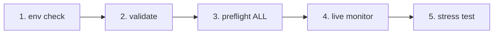

# IrsanAI TPM Agent Forge
[🇬🇧 English](../../README.md) | [🇩🇪 Deutsch](../../README.de.md) | [🇪🇸 Español](../../docs/i18n/README.es.md) | [🇮🇹 Italiano](../../docs/i18n/README.it.md) | [🇧🇦 Bosanski](../../docs/i18n/README.bs.md) | [🇷🇺 Русский](../../docs/i18n/README.ru.md) | [🇨🇳 中文](../../docs/i18n/README.zh-CN.md) | [🇫🇷 Français](../../docs/i18n/README.fr.md) | [🇧🇷 Português (BR)](../../docs/i18n/README.pt-BR.md) | [🇮🇳 हिन्दी](../../docs/i18n/README.hi.md) | [🇹🇷 Türkçe](../../docs/i18n/README.tr.md) | [🇯🇵 日本語](../../docs/i18n/README.ja.md)

[🇬🇧 English](../../README.md) | [🇩🇪 Deutsch](../../README.de.md) | [🇪🇸 Español](./README.es.md) | [🇮🇹 Italiano](./README.it.md) | [🇧🇦 Bosanski](./README.bs.md) | [🇷🇺 Русский](./README.ru.md) | [🇨🇳 中文](./README.zh-CN.md) | [🇫🇷 Français](./README.fr.md) | [🇧🇷 Português (BR)](./README.pt-BR.md) | [🇮🇳 हिन्दी](./README.hi.md) | [🇹🇷 Türkçe](./README.tr.md) | [🇯🇵 日本語](./README.ja.md)

Un arranque limpio para una configuración autónoma de múltiples agentes (BTC, COFFEE y más) con opciones de ejecución multiplataforma.

## Qué Incluye

- `production/preflight_manager.py` – sondeo resiliente de fuentes de mercado con Alpha Vantage + cadena de respaldo y caché local de reserva.
- `production/tpm_agent_process.py` – bucle simple de agente por mercado.
- `production/tpm_live_monitor.py` – monitor en vivo de BTC con inicio en caliente opcional desde CSV y notificaciones Termux.
- `core/tpm_scientific_validation.py` – pipeline de backtest + validación estadística.
- `scripts/tpm_cli.py` – lanzador unificado para Termux/Linux/macOS/Windows.
- `scripts/stress_test_suite.py` – test de estrés para failover/latencia.
- `scripts/start_agents.sh`, `scripts/health_monitor_v3.sh` – helpers para operaciones de procesos.
- `core/scout.py`, `core/reserve_manager.py`, `core/init_db_v2.py` – herramientas operativas clave.

## Inicio Rápido Universal

```bash
python scripts/tpm_cli.py env
python scripts/tpm_cli.py validate
python scripts/tpm_cli.py preflight --market ALL
python scripts/tpm_cli.py live --history-csv btc_real_24h.csv --poll-seconds 3600
```

## Verificación de Cadena en Tiempo de Ejecución (causalidad/sana lógica del orden)

El flujo por defecto del repositorio es intencionalmente lineal para evitar desviaciones por estado oculto y "falsa confianza" durante las ejecuciones en vivo.


```mermaid
flowchart LR
  A[1. env check] --> B[2. validate]
  B --> C[3. preflight ALL]
  C --> D[4. live monitor]
  D --> E[5. stress test]
```

### Lógica de las puertas (qué debe ser verdadero antes del siguiente paso)
- **Puerta 1 – Entorno:** Contexto Python/plataforma correcto (`env`).
- **Puerta 2 – Sanidad científica:** comportamiento del modelo base reproducible (`validate`).
- **Puerta 3 – Confiabilidad de la fuente:** datos de mercado + cadena de respaldo accesibles (`preflight --market ALL`).
- **Puerta 4 – Ejecución en tiempo de ejecución:** bucle en vivo con historial de entrada conocido (`live`).
- **Puerta 5 – Confianza adversaria:** objetivos de latencia/failover se mantienen bajo estrés (`stress_test_suite.py`).

✅ Ya corregido en el código: la preflight de CLI ahora soporta `--market ALL`, correspondiente al flujo de inicio rápido + docker.

## Elija su Misión (CTA basada en rol)

> **¿Usted es X? Haga clic en su camino. Comience en menos de 60 segundos.**

| Persona | Qué le interesa | Ruta de clic | Primer comando |
|---|---|---|---|
| 📈 **Trader** | Pulso rápido, ejecución accionable | [`tpm_live_monitor.py`](./production/tpm_live_monitor.py) | `python scripts/tpm_cli.py live --history-csv btc_real_24h.csv --poll-seconds 3600` |
| 💼 **Inversionista** | Estabilidad, confianza en fuentes, resiliencia | [`preflight_manager.py`](./production/preflight_manager.py) | `python scripts/tpm_cli.py preflight --market ALL` |
| 🔬 **Científico** | Evidencia, pruebas, señal estadística | [`tpm_scientific_validation.py`](./core/tpm_scientific_validation.py) | `python scripts/tpm_cli.py validate` |
| 🧠 **Teórico** | Estructura causal + arquitectura futura | [`core/scout.py`](./core/scout.py) + [`Next Steps`](#next-steps) | `python scripts/tpm_cli.py validate` |
| 🛡️ **Escéptico (prioridad)** | Romper suposiciones antes de producción | [`stress_test_suite.py`](./scripts/stress_test_suite.py) + [`preflight_manager.py`](./production/preflight_manager.py) | `python scripts/tpm_cli.py preflight --market ALL && python scripts/stress_test_suite.py` |
| ⚙️ **Operador / DevOps** | Tiempo activo, salud de procesos, recuperabilidad | [`start_agents.sh`](./scripts/start_agents.sh) + [`health_monitor_v3.sh`](./scripts/health_monitor_v3.sh) | `bash scripts/start_agents.sh` |

### Desafío del Escéptico (recomendado primero para nuevos visitantes)
Si haces **solo una cosa**, ejecuta esto e inspecciona el informe generado:

```bash
python scripts/tpm_cli.py preflight --market ALL
python scripts/stress_test_suite.py
```

Si esta vía te convence, probablemente el resto del repositorio también será de tu interés.

## Notas de la Plataforma

- **Android / Termux (Samsung, etc.)**
  ```bash
  bash scripts/termux_bootstrap.sh
  cd ~/TPM-Agent
  python scripts/tpm_cli.py env
  python scripts/tpm_cli.py preflight --market ALL
  python scripts/tpm_cli.py live --history-csv btc_real_24h.csv --notify --vibrate-ms 1000
  ```
  Para demo directa de UI web en Android (Termux), inicia el runtime Forge localmente:
  ```bash
  cd ~/TPM-Agent
  bash scripts/termux_forge.sh start
  # para detener: bash scripts/termux_forge.sh stop
  # para estado: bash scripts/termux_forge.sh status
  ```
  El script abre el navegador automáticamente (si está disponible) y mantiene el servicio corriendo en segundo plano.
  Si viste un error de compilación `pydantic-core`/Rust o `scipy`/Fortran en Android, usa
  `python -m pip install -r requirements-termux.txt` (conjunto seguro para Termux, no requiere toolchain Rust).
  En la interfaz web puedes controlar inicio/parada del runtime; una barra de progreso muestra el estado de transición.
- **iPhone (mejor esfuerzo)**: usa apps shell como iSH / a-Shell. Los hooks de notificación específicos de Termux no están disponibles.
- **Windows / Linux / macOS**: usa los mismos comandos CLI; ejecútalos vía tmux/cron/programador para persistencia.

## Docker (Camino más Fácil Multisistema Operativo)

Usa Docker en este orden exacto (sin conjeturas):

### Paso 1: Construir la imagen del runtime web

```bash
docker compose build --no-cache tpm-forge-web
```

### Paso 2: Iniciar el servicio del dashboard web

```bash
docker compose up tpm-forge-web
```

Ahora abre `http://localhost:8787` en tu navegador (**no** `http://0.0.0.0:8787`). Uvicorn se enlaza internamente a `0.0.0.0`, pero los clientes deben usar `localhost` (o IP LAN del host).

### Paso 3 (chequeos opcionales): entender servicios no web

```bash
docker compose run --rm tpm-preflight
docker compose run --rm tpm-live
```

- `tpm-preflight` = chequeos de fuente/conectividad (solo salida CLI).
- `tpm-live` = logs de monitor en vivo en terminal (solo CLI, **sin UI web**).
- `tpm-forge-web` = FastAPI + UI dashboard (la de layout/progreso/control runtime).

Si `tpm-preflight` reporta `ALPHAVANTAGE_KEY not set`, COFFEE sigue funcionando vía fallbacks.

Si la página aparece en blanco:
- prueba la API directamente: `http://localhost:8787/api/frame`
- prueba docs FastAPI: `http://localhost:8787/docs`
- refresca duro el navegador (`Ctrl+F5`)
- si es necesario, reinicia solo el servicio web: `docker compose restart tpm-forge-web`

Opcional para mejor calidad COFFEE:

```bash
export ALPHAVANTAGE_KEY="<tu_clave>"
docker compose run --rm tpm-preflight
```

## Predicciones de fallos y alertas móviles

- El cockpit en vivo Forge ahora expone la perspectiva de corto horizonte por mercado (`up/down/sideways`) con confianza en `/api/markets/live`.
- Cuando se detecta un fallo de mercado (pico de aceleración), el runtime puede activar:
  - toast + vibración en Termux
  - hook opcional de notificación/sonido
  - push opcional por Telegram (si token del bot / id del chat están configurados en `config/config.yaml`).
- Configura en el dashboard vía **Save Alerts** / **Test Alert** o API:
  - `GET /api/alerts/preferences`
  - `POST /api/alerts/preferences`
  - `POST /api/alerts/test`

## Validación

Ejecuta la pipeline de validación científica:

```bash
python core/tpm_scientific_validation.py
```

Artefactos:
- `state/TPM_Scientific_Report.md`
- `state/TPM_test_results.json`

## Fuentes y Failover

`production/preflight_manager.py` soporta:
- Alpha Vantage primero para COFFEE (cuando `ALPHAVANTAGE_KEY` está configurado)
- Cadena de respaldo TradingView + Yahoo
- Reserva local en caché en `state/latest_prices.json`

Ejecuta preflight directamente:

```bash
export ALPHAVANTAGE_KEY="<tu_clave>"
python production/preflight_manager.py --market ALL
```

Ejecuta test de estrés por apagones (objetivo `p95 < 1000ms`):

```bash
python scripts/stress_test_suite.py
```

Salida: `state/stress_test_report.json`

## Estado en vivo: qué puede hacer hoy el agente TPM

**Estado actual:**
- Runtime web Forge para producción disponible (`production.forge_runtime:app`).
- Configuración inicial orientada a finanzas con **BTC + COFFEE**.
- Frame en vivo, fitness de agentes, entropía de transferencia y resumen de dominio visibles en dashboard web.
- Usuarios pueden agregar nuevos agentes de mercado en tiempo de ejecución (`POST /api/agents`).

**Capacidades objetivo (debería tener):**
- Benchmarking con datos reales y umbrales explícitos de aceptación (precisión/recall/FPR/desviación).
- Reglas de gobernanza reflexiva estrictas para modo seguro automático.
- Flujo de trabajo con memoria colectiva para patrones de aprendizaje versionados por dominio.

**Próxima etapa de expansión:**
- Orquestador de políticas basado en régimen (tendencia/shock/sideways) para todos los agentes.
- Piloto en un dominio no financiero (ej. médico o sísmico) con contratos de datos explícitos.

## Ayuda para conflictos de merge en PR

- Lista de verificación para merges (conflictos GitHub): `docs/MERGE_CONFLICT_CHECKLIST.de.md`

### Alcance hoy: Windows + smartphone para TPM financiero

- **Windows:** Runtime Forge + interfaz web + Docker/PowerShell/inicio clic están operativos.
- **Smartphone:** monitoreo en vivo Android/Termux operativo; UI web responsive en móvil.
- **Multi-agente en tiempo real:** BTC + COFFEE activos por defecto; mercados adicionales se pueden agregar dinámicamente via UI web.
- **Norma de frontera de fuente:** si mercado solicitado no está cubierto por fuentes internas, se provee URL y autorización explícita.

## Prueba en vivo Windows (sistema de dos vías)

### Ruta A — Usuarios avanzados / desarrolladores (PowerShell, CMD, PyCharm, IDE)

```powershell
python -m venv .venv
.\.venv\Scripts\Activate.ps1
pip install -r requirements.txt
python scripts/tpm_cli.py forge-dashboard --open-browser --port 8787
```

### Ruta B — Usuarios básicos (clic & start)

1. Doble clic en `scripts/windows_click_start.bat`
2. El script selecciona automáticamente el mejor camino disponible:
   - Python disponible -> venv + pip + runtime
   - si no, Docker Compose (si está instalado)

Base técnica: `scripts/windows_bootstrap.ps1`.

## Runtime web Forge para producción (BTC + COFFEE, extensible)

Sí, esto ya ha **comenzado** en el repositorio y ahora se ha extendido:

- Arranca por defecto con un agente TPM financiero para **BTC** y otro para **COFFEE**.
- Los usuarios pueden añadir más mercados/agentes directamente desde la UI web (`/api/agents`).
- Corre como servicio runtime persistente con salida del frame en vivo (`/api/frame`) para una visión inmersiva.

### Inicio (local)

```bash
uvicorn production.forge_runtime:app --host 0.0.0.0 --port 8787
# abre http://localhost:8787
```

### Inicio (Docker)

```bash
docker compose up tpm-forge-web
# abre http://localhost:8787
```

## TPM Playground (MVP interactivo)

Ahora puedes explorar el comportamiento TPM interactivamente en el navegador:

```bash
python -m http.server 8765
# abre http://localhost:8765/playground/index.html
```

Incluye:
- Vista de anomalías de señal débil para un solo agente
- Mini enjambre (BTC/COFFEE/VOL) con presión de consenso
- Resonancia cross-domain (finanzas sintéticas/clima/salud)

Consulta: `playground/README.md`.

## Próximos Pasos

- Módulo de entropía de transferencia para análisis causal cross-market.
- Optimizador con actualizaciones de política basadas en desempeño histórico.
- Canales de alerta (Telegram/Signal) + persistencia en arranque.

---

## IrsanAI Deep Dive: Cómo "piensa" el core TPM en sistemas complejos

### 1) Transformación visionaria: de agente de trading a ecosistema TPM universal

### ¿Qué hace único al algoritmo IrsanAI-TPM? (reformulación corregida)

Hipótesis de trabajo del core TPM:

- En sistemas complejos y caóticos, la señal de alerta temprana suele estar oculta en el **micro-residual**: desvíos diminutos, correlaciones débiles, puntos de datos casi vacíos.
- Donde sistemas clásicos solo ven `0` o "relevancia insuficiente", TPM busca **anomalías estructuradas** (patrones glitch) en el flujo contextual.
- TPM evalúa no solo un valor, sino el **cambio de relaciones en el tiempo, calidad de fuente, régimen y vecindad causal**.

Nota importante de corrección: TPM **no** predice mágicamente el futuro. Su objetivo es **detección probabilística anticipada** de cambios de régimen, rupturas y disrupciones — cuando se cumplen calidad de datos y puertas de validación.

### Piense en GRANDE: por qué esto se extiende más allá de finanzas

Si TPM puede detectar patrones débiles precursores en instrumentos financieros (índice/ticker/identificadores tipo ISIN, liquidez, microestructura), el mismo principio puede generalizarse a muchos dominios:

- **Flujo de eventos/sensores + modelo contextual + capa de anomalías + bucle de feedback**
- Toda profesión puede modelarse como un "mercado" con características, nodos, correlaciones y anomalías propias de su dominio
- Agentes TPM especializados pueden aprender entre dominios preservando lógica local profesional y ética

### 100 profesiones como espacios objetivo TPM

| # | Profesión | Análogo de datos TPM | Objetivo de detección de anomalías/patrones |
|---|---|---|---|
| 1 | Analista policial | Registros de incidentes, mapas geotemporales del crimen, redes | Señales tempranas de clusters criminales en escalada |
| 2 | Jefe de bomberos | Cadenas de alarmas, feed de sensores, clima, perfil de edificios | Predecir ventanas de propagación de incendios y riesgos |
| 3 | Paramédico/EMS | Motivos de despacho, tiempos de respuesta, carga hospitalaria | Detectar estrés en capacidad antes de colapso |
| 4 | Médico de emergencias | Flujo de triage, signos vitales, dinámica de tiempos de espera | Señalar descompensación crítica más temprano |
| 5 | Enfermera UCI | Tendencias de ventilación/lab, respuesta a medicación | Identificar micro-señales de sepsis/shock |
| 6 | Epidemiólogo | Tasas de casos, movilidad, datos de aguas residuales/laboratorios | Alerta temprana de brotes antes de fase exponencial |
| 7 | Médico de familia | Patrones EHR, prescripciones, brechas en seguimiento | Detectar tempranamente transiciones de riesgo crónico |
| 8 | Psicólogo clínico | Trayectorias de sesiones, marcadores lingüísticos, sueño/actividad | Detectar indicadores tempranos de recaídas/crisis |
| 9 | Investigador farmacéutico | Pantallas de compuestos, perfiles de eventos adversos, genómica | Revelar clusters ocultos de eficacia y efectos secundarios |
| 10 | Biotecnólogo | Secuencias/procesos/trajectorias de cultivos celulares | Detectar deriva y riesgo de contaminación |
| 11 | Científico climático | Series temporales atmósfera/océano, campos satelitales | Identificar precursores de puntos de inflexión |
| 12 | Meteorólogo | Campos presión/humedad/viento/radar | Anticipar cambios climáticos caóticos locales |
| 13 | Sismólogo | Microterremotos, campos de estrés, redes de sensores | Detectar precursores de grandes liberaciones sísmicas |
| 14 | Vulcanólogo | Series temporales de gases, temblores, deformación | Delimitar ventanas de probabilidad de erupción |
| 15 | Hidrólogo | Medidores de río, lluvia, humedad del suelo | Detectar cambios en fases de inundaciones/desequilibrios |
| 16 | Oceanógrafo | Corrientes, temperatura, salinidad, datos de boyas | Detectar anomalías relevantes para tsunamis/ecosistemas |
| 17 | Trader energético | Carga, precios spot, clima, estado de red | Señalizar rupturas tempranas en precios/carga |
| 18 | Operador de red eléctrica | Frecuencia de red, estado de líneas, eventos de conmutación | Detectar riesgo de fallos en cascada |
| 19 | Operador parque eólico | Telemetría turbinas, campos de viento, logs de mantenimiento | Predecir fallos y deriva en rendimiento |
| 20 | Operador planta solar | Irradiancia, telemetría de inversores, carga térmica | Detectar degradación y anomalías en rendimiento |
| 21 | Gerente de servicios de agua | Flujo, sensores de calidad, patrones de consumo | Detectar contaminación/falta temprana |
| 22 | Gerente de operaciones de tráfico | Densidad, accidentes, obras viales, eventos | Predecir congestión y escalada de accidentes |
| 23 | Gerente de control ferroviario | Cumplimiento de horarios, estado de vías, cadena de retrasos | Romper cascadas sistémicas de retrasos temprano |
| 24 | Controlador aéreo | Trayectorias de vuelos, clima, saturación de slots | Detectar rutas en conflicto y cuellos de botella |
| 25 | Gerente logístico portuario | Tiempos de atraque, flujo de contenedores, estado aduanero | Detectar precursores de interrupción de suministros |
| 26 | Gerente cadena de suministro | ETA, inventario, pulso de demanda, eventos de riesgo | Minimizar efecto látigo y anomalías por desabasto |
| 27 | Líder manufactura | OEE, telemetría de procesos, scrap, tiempos de setup | Detectar deriva de calidad y anomalías de máquina |
| 28 | Ingeniero de calidad | Distribuciones de tolerancia, señales de proceso | Detectar precursores de defectos cercanos a cero |
| 29 | Ingeniero robótico | Trayectorias de movimiento, carga de actuadores, bucles de control | Predecir inestabilidad o fallo en control |
| 30 | Ingeniero mantenimiento aeronáutico | Telemetría motor/vuelo, históricos de mantenimiento | Mantenimiento predictivo a nivel de componente |
| 31 | Gerente de construcción | Progreso, clima, fechas suministro, sensores IoT | Cuantificar riesgo de anomalías en cronograma/costo |
| 32 | Ingeniero estructural | Carga, vibración, indicadores de fatiga/envejecimiento | Detectar transiciones críticas estructurales |
| 33 | Planificador urbano | Movilidad, demografía, emisiones, uso suelo | Detectar patrones emergentes de estrés urbano |
| 34 | Arquitecto | Operaciones del edificio, ocupación, curvas de energía | Detectar desconexión diseño-uso |
| 35 | Agricultor | Datos suelo/clima/cultivo/mercado | Detectar anomalías tempranas en enfermedades/rendimientos |
| 36 | Agrónomo | Datos satelitales de nutrición/hidratación | Dirigir intervenciones precisas tempranas |
| 37 | Gerente forestal | Humedad, patrones de plagas, indicadores de fuego | Detectar ventanas tempranas de daño/incendios forestales |
| 38 | Gerente de pesca | Registros de captura, calidad de agua, migración | Detectar riesgos de sobrepesca/colapso |
| 39 | Inspector de seguridad alimentaria | Hallazgos de laboratorio, registros cadena fría, vínculos de suministro | Interrumpir cadenas de contaminación temprano |
| 40 | Chef ejecutivo | Pulso de demanda, salud de stock, ratios de desperdicio | Minimizar desperdicios y anomalías de falta |
| 41 | Operador minorista | Flujos POS, afluencia, rotación de inventario | Detectar picos de demanda y patrones de merma |
| 42 | Gerente e-commerce | Clickstream, trayectorias de carrito, devoluciones | Detectar patrones precursores de fraude/churn |
| 43 | Analista de marketing | Métricas de campaña, curvas de respuesta de segmentos | Detectar microtendencias antes del mainstream |
| 44 | Líder de ventas | Velocidad del pipeline, grafo de puntos de contacto | Detectar riesgo en cerrados y oportunidades de timing |
| 45 | Líder de soporte al cliente | Flujo de tickets, clusters temáticos, desviación de SLA | Detectar olas de escalamiento/causa raíz |
| 46 | Product manager | Adopción de features, retención, feedback | Detectar desajustes producto-mercado temprano |
| 47 | Investigador UX | Mapas de calor, rutas, puntos de abandono | Revelar fricción oculta de interacción |
| 48 | Ingeniero software | Logs, trazas, métricas de despliegue | Detectar cascadas de fallos pre-incidente |
| 49 | Ingeniero confiabilidad sitio | Latencia, presupuesto de errores, saturación | Detectar degradación antes de caída |
| 50 | Analista ciberseguridad | Flujos de red, eventos IAM, alertas SIEM | Detectar rutas de ataque y movimientos laterales |
| 51 | Analista de fraude | Grafos de transacciones, huellas de dispositivos | Detectar fraude en espacio de señal débil |
| 52 | Gerente de riesgo bancario | Exposiciones cartera/macro/liquidez | Detectar regímenes de estrés y riesgo de concentración |
| 53 | Actuario de seguros | Flujo de reclamos, mapas de exposición, vínculos climáticos | Anticipar olas de reclamos y estrés en reservas |
| 54 | Asesor fiscal | Patrones en libros contables, cronogramas de presentación | Detectar riesgos y optimización en cumplimiento |
| 55 | Auditor | Trazas de control, patrones de excepción | Detectar anomalías contables a gran escala |
| 56 | Abogado | Cronología de casos, grafos de precedentes, plazos | Detectar riesgo y patrones en litigios |
| 57 | Juez/administrador judicial | Mezcla de carga de casos, tiempos de ciclo | Detectar cuellos de botella en sistema judicial |
| 58 | Gerente de correccionales | Ocupación, redes de incidentes, tendencias comportamiento | Detectar clusters de violencia/recidivismo |
| 59 | Oficial de aduanas | Manifiestos de comercio, declaraciones, patrones de ruta | Detectar señales de contrabando/evasión |
| 60 | Analista inteligencia defensa | Feed ISR, logística, tempo operacional | Detectar dinámica de escalamiento temprano |
| 61 | Analista diplomático | Cadenas de eventos, señales de comunicaciones | Detectar cambios de régimen geopolítico |
| 62 | Profesor | Progreso de aprendizaje, asistencia, compromiso | Detectar riesgo de abandono y necesidades de soporte |
| 63 | Director de escuela | Clusters de desempeño, asistencia, recursos | Detectar patrones de estrés sistémico escolar |
| 64 | Profesor universitario | Actividad de curso, retiros, feedback | Estabilizar éxito estudiantil más temprano |
| 65 | Investigador educativo | Trayectorias de cohortes, variables pedagógicas | Identificar efectos robustos de intervención |
| 66 | Trabajador social | Redes de casos, citas, marcadores de riesgo | Detectar rutas de escalamiento de crisis |
| 67 | Coordinador ONGs | Reportes de campo, flujos de ayuda, señales de necesidad | Detectar brechas de impacto y cambios de hotspot |
| 68 | Asesor de empleo | Perfiles de habilidades, demanda laboral, transiciones | Detectar desajustes y necesidades de upskilling |
| 69 | Gerente RRHH | Trayectorias de contratación/deserción/desempeño | Detectar burnout y riesgo de retención temprano |
| 70 | Reclutador | Tasas de funnel, taxonomía de habilidades, pulso de mercado | Detectar riesgo de ajuste y ventanas de oportunidad de contratación |
| 71 | Consultor organizacional | Cadencia de decisiones, desviación de KPI, patrones de red | Detectar disfunción de equipo temprano |
| 72 | Gerente de proyectos | Hitos, dependencias, grafo de bloqueos | Anticipar rupturas en cronograma/alcance |
| 73 | Periodista | Grafo de confiabilidad de fuentes, flujos de eventos | Detectar clusters de desinformación temprano |
| 74 | Reportero de investigación | Redes documentales, rastros de dinero/comunicación | Exponer anomalías sistémicas ocultas |
| 75 | Moderador de contenido | Flujos de posts/comentarios, desplazamientos semánticos | Detectar olas de abuso/radicalización temprano |
| 76 | Artista | Trayectorias de respuesta de audiencia, vectores de estilo | Detectar estéticas emergentes |
| 77 | Productor musical | Características de escucha, vectores de arreglos | Detectar potencial de breakout/nicho temprano |
| 78 | Diseñador de juegos | Telemetría, progresión, curvas de churn | Detectar frustración y anomalías de balance |
| 79 | Entrenador deportivo | Rendimiento/flujo biométrico | Detectar precursores de lesión/caída de forma |
| 80 | Entrenador atlético | Marcadores de movimiento/recuperación | Detectar sobrecarga antes de tiempo fuera |
| 81 | Médico deportivo | Diagnósticos, carga de rehabilitación, riesgo de recurrencia | Optimizar ventanas de retorno a juego |
| 82 | Analista árbitro | Flujo de decisiones, tempo, contexto de incidentes | Detectar desviación de consistencia/imparcialidad |
| 83 | Gerente de eventos | Ticketing, movilidad, clima, feeds de seguridad | Detectar escalamiento de riesgo de multitud y seguridad |
| 84 | Gerente de turismo | Patrones de reserva, señales de reputación | Detectar cambios de demanda y sentimiento |
| 85 | Gerente hotelero | Ocupación, calidad de servicio, quejas | Detectar inestabilidad temprana en calidad-demanda |
| 86 | Gerente de propiedades | Flujo de rentas, mantenimiento, comparables de mercado | Detectar riesgo temprano de vacancia/incumplimiento |
| 87 | Gerente de instalaciones | IoT edificios, energía, intervalos de mantenimiento | Detectar fallos y patrones de ineficiencia |
| 88 | Operador de gestión de residuos | Flujos de residuos, rutas, métricas ambientales | Detectar vertidos ilegales y brechas de proceso |
| 89 | Inspector ambiental | Emisiones, reportes, superposiciones satelitales | Detectar incumplimientos y riesgo de tipping point |
| 90 | Analista economía circular | Pasaportes de materiales, tasas de recuperación | Detectar fugas y oportunidades de cierre de ciclo |
| 91 | Astrofísico | Flujos de telescopio, espectros, modelos de ruido | Detectar eventos cósmicos raros |
| 92 | Ingeniero de operaciones espaciales | Telemetría, parámetros orbitales, diagnóstico de sistemas | Detectar anomalías críticas tempranas |
| 93 | Ingeniero cuántico | Perfiles de ruido, drift en calibración, fallos en gates | Detectar decoherencia y deriva de control |
| 94 | Científico de datos | Deriva de características, calidad de modelo, integridad datos | Detectar colapso de modelos y cambio de sesgo |
| 95 | Ético de IA | Resultados de decisiones, métricas de equidad | Detectar patrones injustos o brechas de gobernanza |
| 96 | Investigador en filosofía de la ciencia | Vías teoría-evidencia | Detectar señales de disonancia paradigmática |
| 97 | Matemático | Estructuras residuales, invariantes, términos de error | Detectar regularidades ocultas/clases de outliers |
| 98 | Teórico de sistemas | Dinámica nodo-arista, retardos de feedback | Detectar dinámica de tipping en redes |
| 99 | Antropólogo | Observaciones de campo, redes lingüísticas/sociales | Detectar precursores de conflictos de cambio cultural |
| 100 | Estratega de prospectiva | Curvas tecnológicas, regulación, datos de comportamiento | Conectar escenarios con indicadores tempranos |

### Notas de ajuste por país (equivalencia profesional por jurisdicción)

Para mantener la lista lógicamente correcta en regiones, el mapeo de roles TPM debe interpretarse como **equivalentes funcionales**, no traducción literal de títulos:

- **Alemania ↔ EE.UU./UK:** `Polizei` vs funciones divididas (`Police Department`, `Sheriff`, `State Trooper`) y diferencias en fiscalía (`Staatsanwaltschaft` vs `District Attorney/Crown Prosecution`).
- **España / Italia:** estructuras de derecho civil con flujos de trabajo judiciales y policiales separados; pipelines de datos a menudo entre sistemas regionales y nacionales.
- **Bosnia y Herzegovina:** gobernanza multi-entidad con propiedad fragmentada de datos; TPM se beneficia de fusión federada de anomalías.
- **Rusia / China:** definición de roles y restricciones de gobernanza de datos difieren; TPM debe configurarse con límites de cumplimiento locales y equivalentes institucionales.
- **Otras regiones de alto impacto:** Francia, Brasil, India, Japón, estados MENA y África Subsahariana pueden integrarse mapeando funciones equivalentes y telemetría disponible.

### Perspectiva filosófico-científica

- De herramienta a **infraestructura epistémica**: los dominios operacionalizan el "conocimiento temprano débil".
- De sistemas aislados a **federaciones de agentes**: ética local + gramática compartida de anomalías.
- De respuesta reactiva a **gobernanza anticipatoria**: prevención sobre control tardío de crisis.
- De modelos estáticos a **teorías vivas**: recalibración continua bajo shocks reales.

Idea central: un cluster TPM gobernado responsablemente no puede controlar el caos — pero puede ayudar a las instituciones a entenderlo antes, a dirigirlo con mayor robustez y a decidir con más humanidad.

## Expansión multilingüe (en progreso)

Para soportar resonancia cross-idioma, vistas estratégicas localizadas están disponibles en:

- Español (`docs/i18n/README.es.md`)
- Italiano (`docs/i18n/README.it.md`)
- Bosnio (`docs/i18n/README.bs.md`)
- Ruso (`docs/i18n/README.ru.md`)
- Chino Simplificado (`docs/i18n/README.zh-CN.md`)
- Francés (`docs/i18n/README.fr.md`)
- Portugués Brasil (`docs/i18n/README.pt-BR.md`)
- Hindi (`docs/i18n/README.hi.md`)
- Turco (`docs/i18n/README.tr.md`)
- Japonés (`docs/i18n/README.ja.md`)

Cada archivo localizado incluye notas de ajuste regional y remite a esta sección canónica en inglés para la matriz completa de 100 profesiones.

## IrsanAI Quality Meta (SOLL vs IST)

Para el grado actual de madurez del repositorio, estado intermedio de calidad y hoja de ruta causal basada en expectativas reales de usuarios, consulte:

- `docs/IRSANAI_QUALITY_META.md`

Este documento es ahora referencia para:
- Profundidad de requerimientos en funcionalidades (UX/UI + robustez operativa),
- Requerimientos de paridad Docker/Android,
- así como puertas de aceptación de calidad para PRs futuros.

## Modo de paridad i18n (espejo completo)

Para asegurar que ninguna comunidad lingüística esté en desventaja, los archivos i18n se mantienen ahora en paridad canónica completa con `README.md`.

Comando de sincronización:

```bash
python scripts/i18n_full_mirror_sync.py
```

## Nota para desarrolladores (LOP – Lista de puntos abiertos)

Qué queda abierto desde mi punto de vista (funcional, no técnicamente bloqueado):

| Punto | Estado actual | Cómo continuar de forma productiva |
|---|---|---|
| **Módulo Transfer Entropy para causalidad cross-market** | **Completado ✅** – implementado como `TransferEntropyEngine` e integrado en Forge-Orchestrator. | Completar calibración funcional: definir umbrales específicos de dominio y reglas de interpretación. |
| **Optimizador/actualización de políticas basado en historial** | **Completado ✅** – scoring de fitness, actualización de recompensa y pruning de candidatos funcionando en ciclo tick. | Documentar modos de operación (conservador/agresivo) y exponer como perfiles de gobernanza para test. |
| **Alertas (Telegram/Signal)** | **Parcialmente completado 🟡** – infraestructura disponible, pero desactivada por defecto. | Definir política de alertas: qué eventos, severidades, canales, responsabilidades. |
| **Persistencia de arranque/duración** | **Parcialmente completado 🟡** – monitoreo de arranque y salud via tmux existe, pero sin runbook unificado para todas las plataformas target. | Definir perfiles de plataforma (Termux/Linux/Docker) con inicio en boot, política de reinicio y escalamiento documentados. |
| **Meta-capa coordinada (de “Próxima etapa de expansión (promoted)”)** | **Parcialmente completado 🟡** – partes presentes (orquestador + entropía + recompensa), pero no descripto como orquestador completo de políticas de régimen. | Añadir modelo explícito de control funcional (tendencia/shock/sideways) para pesos de agentes. |
| **Memoria colectiva (archivo versionado de patrones de aprendizaje)** | **Abierto 🔴** – nombrado en secciones de visión/expansión, pero sin gestión clara de almacenamiento y revisión funcional. | Definir formato de patrones, lógica de versiones y criterios de calidad (cuándo patrón se considera "válido"). |
| **Gobernanza reflexiva (modo conservador auto al detectar incertidumbre)** | **Abierto 🔴** – identificado como objetivo, pero no formalizado como regla funcional de decisión. | Convertir indicadores de incertidumbre y condiciones de cambio en reglamento de gobernanza. |
| **Expansión de dominios fuera de Finanzas/Clima** | **Abierto 🔴** – otros dominios temáticos planteados como visión/plantillas, pero no convertidos en contratos de datos productivos. | Lanzar piloto para un dominio próximo (ej. Médico o Sísmico) con métricas y fuentes claras. |
| **Evidencia científica sobre datos reales** | **Abierto 🔴** – validación actual robusta pero basada en segmentos sintéticos de régimen. | Agregar benchmarking con datos reales y criterios de aceptación fijos (precisión/recall/FPR/drift). |
| **Resonancia multilingüe / expansión i18n** | **Parcialmente completado 🟡** – landing pages en varios idiomas existen; expansión marcada claramente como en progreso. | Definir proceso de sincronización (cuándo cambios desde Root README se propagan a todos los README i18n). |

Resumen corto: Los “Próximos Pasos” anteriores están **técnicamente iniciados o implementados en gran medida**; la palanca más importante hoy está en **operacionalización funcional** (gobernanza, políticas, lógica de dominio, evidencia en datos reales) y **operación consistente de documentación/i18n**.

### Plan de ejecución LOP

Para secuenciación de implementación, criterios de finalización y puertas de evidencia para cada punto LOP abierto, consultar:

- `docs/LOP_EXECUTION_PLAN.md`

## LOP (Nota final – priorizado)

1. **P1 Ampliar evidencia en datos reales:** benchmarking con criterios fijos de aceptación (precisión/recall/FPR/desviación).
2. **P2 Finalizar gobernanza reflexiva:** definir reglas estrictas de modo seguro automático ante incertidumbre.
3. **P3 Estandarizar memoria colectiva:** patrones versionados de aprendizaje con proceso de revisión por dominio.
4. **P4 Extender inmersión web:** vistas por roles para más industrias TPM basadas en el nuevo layout responsivo.

**Nota de plataforma:** Actualmente foco principalmente en **Windows + Smartphone**. **Más adelante en LOP:** sumar perfiles para macOS, Linux y otras plataformas.

