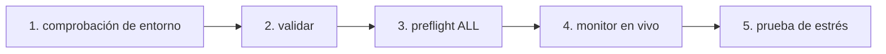

# IrsanAI TPM Agent Forge

[🇬🇧 English](./README.md) | [🇩🇪 Deutsch](./README.de.md) | [🇪🇸 Español](./docs/i18n/README.es.md) | [🇮🇹 Italiano](./docs/i18n/README.it.md) | [🇧🇦 Bosanski](./docs/i18n/README.bs.md) | [🇷🇺 Русский](./docs/i18n/README.ru.md) | [🇨🇳 中文](./docs/i18n/README.zh-CN.md) | [🇫🇷 Français](./docs/i18n/README.fr.md) | [🇧🇷 Português (BR)](./docs/i18n/README.pt-BR.md) | [🇮🇳 हिन्दी](./docs/i18n/README.hi.md) | [🇹🇷 Türkçe](./docs/i18n/README.tr.md) | [🇯🇵 日本語](./docs/i18n/README.ja.md)

Un bootstrap limpio para una configuración autónoma multi-agente (BTC, COFFEE y más) con opciones de tiempo de ejecución multiplataforma.

## Qué incluye

- `production/preflight_manager.py` – sondeo resiliente de fuentes de mercado con Alpha Vantage + cadena de respaldo y respaldo de caché local.
- `production/tpm_agent_process.py` – bucle de agente simple por mercado.
- `production/tpm_live_monitor.py` – monitor de BTC en vivo con inicio en caliente CSV opcional y notificaciones de Termux.
- `core/tpm_scientific_validation.py` – backtest + pipeline de validación estadística.
- `scripts/tpm_cli.py` – lanzador unificado para Termux/Linux/macOS/Windows.
- `scripts/stress_test_suite.py` – prueba de estrés de conmutación por error/latencia.
- `scripts/start_agents.sh`, `scripts/health_monitor_v3.sh` – ayudantes de operaciones de proceso.
- `core/scout.py`, `core/reserve_manager.py`, `core/init_db_v2.py` – herramientas operativas centrales.

## Inicio rápido universal

```bash
python scripts/tpm_cli.py env
python scripts/tpm_cli.py validate
python scripts/tpm_cli.py preflight --market ALL
python scripts/tpm_cli.py live --history-csv btc_real_24h.csv --poll-seconds 3600
```

## Comprobación de la cadena de ejecución (causalidad/orden)

El flujo predeterminado del repositorio es intencionalmente lineal para evitar la deriva de estados ocultos y la "falsa confianza" durante las ejecuciones en vivo.


```mermaid
flowchart LR
  A[1. comprobación de entorno] --> B[2. validar]
  B --> C[3. preflight ALL]
  C --> D[4. monitor en vivo]
  D --> E[5. prueba de estrés]
```

### Lógica de puerta (lo que debe ser cierto antes del siguiente paso)
- **Puerta 1 – Entorno:** El contexto de Python/plataforma es correcto (`env`).
- **Puerta 2 – Sanidad científica:** El comportamiento del modelo de referencia es reproducible (`validate`).
- **Puerta 3 – Fiabilidad de la fuente:** Los datos del mercado + la cadena de respaldo son accesibles (`preflight --market ALL`).
- **Puerta 4 – Ejecución en tiempo de ejecución:** El bucle en vivo se ejecuta con un historial de entrada conocido (`live`).
- **Puerta 5 – Confianza adversaria:** Los objetivos de latencia/conmutación por error se mantienen bajo estrés (`stress_test_suite.py`).

✅ Ya corregido en el código: `preflight` de la CLI ahora admite `--market ALL`, coincidiendo con el inicio rápido + el flujo de Docker.

## Elige tu misión (CTA basada en roles)

> **¿Eres X? Haz clic en tu carril. Empieza en <60 segundos.**

| Persona | Lo que te importa | Ruta de acceso | Primer comando |
|---|---|---|---|
| 📈 **Trader** | Pulso rápido, tiempo de ejecución accionable | [`tpm_live_monitor.py`](./production/tpm_live_monitor.py) | `python scripts/tpm_cli.py live --history-csv btc_real_24h.csv --poll-seconds 3600` |
| 💼 **Inversor** | Estabilidad, confianza en la fuente, resiliencia | [`preflight_manager.py`](./production/preflight_manager.py) | `python scripts/tpm_cli.py preflight --market ALL` |
| 🔬 **Científico** | Evidencia, pruebas, señal estadística | [`tpm_scientific_validation.py`](./core/tpm_scientific_validation.py) | `python scripts/tpm_cli.py validate` |
| 🧠 **Teórico** | Estructura causal + arquitectura futura | [`core/scout.py`](./core/scout.py) + [`Próximos pasos`](#next-steps) | `python scripts/tpm_cli.py validate` |
| 🛡️ **Escéptico (prioridad)** | Romper suposiciones antes de la producción | [`stress_test_suite.py`](./scripts/stress_test_suite.py) + [`preflight_manager.py`](./production/preflight_manager.py) | `python scripts/tpm_cli.py preflight --market ALL && python scripts/stress_test_suite.py` |
| ⚙️ **Operador / DevOps** | Tiempo de actividad, estado del proceso, recuperabilidad | [`start_agents.sh`](./scripts/start_agents.sh) + [`health_monitor_v3.sh`](./scripts/health_monitor_v3.sh) | `bash scripts/start_agents.sh` |

### Desafío del escéptico (recomendado primero para nuevos visitantes)
Si haces **solo una cosa**, ejecuta esto e inspecciona la salida del informe:

```bash
python scripts/tpm_cli.py preflight --market ALL
python scripts/stress_test_suite.py
```

Si este carril te convence, el resto del repositorio probablemente también te resultará interesante.

## Notas de la plataforma

- **Android / Termux (Samsung, etc.)**
  ```bash
  bash scripts/termux_bootstrap.sh
  cd ~/TPM-Agent
  python scripts/tpm_cli.py env
  python scripts/tpm_cli.py preflight --market ALL
  python scripts/tpm_cli.py live --history-csv btc_real_24h.csv --notify --vibrate-ms 1000
  ```
  Para una demostración directa de la interfaz de usuario web de Android (Termux), inicia el tiempo de ejecución de Forge localmente:
  ```bash
  cd ~/TPM-Agent
  bash scripts/termux_forge.sh start
  # detener: bash scripts/termux_forge.sh stop
  # estado: bash scripts/termux_forge.sh status
  ```
  El script abre automáticamente el navegador (si está disponible) y mantiene el servicio ejecutándose en segundo plano.
  Si viste un error de compilación de `pydantic-core`/Rust o `scipy`/Fortran en Android, usa
  `python -m pip install -r requirements-termux.txt` (conjunto seguro para Termux, no se requiere la cadena de herramientas de Rust).
  En la interfaz web puedes controlar el inicio/parada del tiempo de ejecución; una barra de progreso muestra el estado de la transición.
- **iPhone (mejor esfuerzo)**: usa aplicaciones de shell como iSH / a-Shell. Los hooks de notificación específicos de Termux no están disponibles allí.
- **Windows / Linux / macOS**: usa los mismos comandos CLI; ejecútalos a través de tmux/scheduler/cron para la persistencia.

## Docker (la ruta más fácil entre sistemas operativos)

Usa Docker en este orden exacto (sin adivinar):

### Paso 1: Construye la imagen del tiempo de ejecución web

```bash
docker compose build --no-cache tpm-forge-web
```

### Paso 2: Inicia el servicio del panel web

```bash
docker compose up tpm-forge-web
```

Ahora abre `http://localhost:8787` en tu navegador (**no** `http://0.0.0.0:8787`). Uvicorn se enlaza a `0.0.0.0` internamente, pero los clientes deben usar `localhost` (o la IP de la LAN del host).

### Paso 3 (comprobaciones opcionales): comprende los servicios no web

```bash
docker compose run --rm tpm-preflight
docker compose run --rm tpm-live
```

- `tpm-preflight` = comprobaciones de fuente/conectividad (solo salida CLI).
- `tpm-live` = registros del monitor en vivo del terminal (solo salida CLI, **sin interfaz de usuario web**).
- `tpm-forge-web` = FastAPI + interfaz de usuario del panel (la que tiene diseño/progreso/control de tiempo de ejecución).

Si `tpm-preflight` informa `ALPHAVANTAGE_KEY not set`, COFFEE sigue funcionando a través de los fallbacks.

Si la página aparece en blanco:
- prueba la API directamente: `http://localhost:8787/api/frame`
- prueba la documentación de FastAPI: `http://localhost:8787/docs`
- actualiza el navegador (`Ctrl+F5`)
- si es necesario, reinicia solo el servicio web: `docker compose restart tpm-forge-web`

Opcional para una mejor calidad de COFFEE:

```bash
export ALPHAVANTAGE_KEY="<tu_clave>"
docker compose run --rm tpm-preflight
```

## Predicciones de fallos y alertas móviles

- La cabina en vivo de Forge ahora expone la perspectiva a corto plazo por mercado (`arriba/abajo/lateral`) con confianza en `/api/markets/live`.
- Cuando se detecta un fallo de mercado (pico de aceleración), el tiempo de ejecución puede activar:
  - Tostada + vibración de Termux
  - Hook de notificación/pitido opcional
  - Push de Telegram opcional (si el token del bot/id de chat está configurado en `config/config.yaml`).
- Configura en el panel a través de **Guardar alertas** / **Probar alerta** o API:
  - `GET /api/alerts/preferences`
  - `POST /api/alerts/preferences`
  - `POST /api/alerts/test`

## Validación

Ejecuta el pipeline de validación científica:

```bash
python core/tpm_scientific_validation.py
```

Artefactos:
- `state/TPM_Scientific_Report.md`
- `state/TPM_test_results.json`

## Fuentes y respaldo

`production/preflight_manager.py` soporta:
- Alpha Vantage primero para COFFEE (cuando `ALPHAVANTAGE_KEY` está configurada)
- Cadena de respaldo de TradingView + Yahoo
- Respaldo en caché local en `state/latest_prices.json`

Ejecuta `preflight` directamente:

```bash
export ALPHAVANTAGE_KEY="<tu_clave>"
python production/preflight_manager.py --market ALL
```

Ejecuta la prueba de estrés de interrupción (objetivo `p95 < 1000ms`):

```bash
python scripts/stress_test_suite.py
```

Salida: `state/stress_test_report.json`

## Estado en vivo: lo que el agente TPM puede hacer hoy

**Estado actual:**
- El tiempo de ejecución web de Forge en producción está disponible (`production.forge_runtime:app`).
- La configuración de inicio centrada en finanzas utiliza **BTC + COFFEE**.
- El marco en vivo, la aptitud del agente, la entropía de transferencia y el resumen del dominio son visibles en el panel web.
- Los usuarios pueden agregar nuevos agentes de mercado en tiempo de ejecución (`POST /api/agents`).

**Capacidad objetivo (debería tener):**
- Benchmarking con datos reales con umbrales de aceptación explícitos (precisión/recuperación/FPR/deriva).
- Reglas estrictas de gobernanza reflexiva para el modo seguro automático.
- Flujo de trabajo de memoria colectiva para patrones de aprendizaje versionados por dominio.

**Siguiente etapa de expansión:**
- Orquestador de políticas basado en regímenes (tendencia/choque/lateral) en todos los agentes.
- Un piloto de dominio no financiero (por ejemplo, médico o sísmico) con contratos de datos explícitos.

## Ayuda para conflictos de fusión de PR

- Lista de verificación para fusiones (conflictos de GitHub): `docs/MERGE_CONFLICT_CHECKLIST.de.md` (Nota: este archivo está en alemán, pero la referencia es válida)

### Alcance actual: Windows + smartphone para TPM financiero

- **Windows:** El tiempo de ejecución de Forge + interfaz web + Docker/PowerShell/inicio con un clic están operativos.
- **Smartphone:** La monitorización en vivo de Android/Termux está operativa; la interfaz de usuario web es receptiva en dispositivos móviles.
- **Multi-agente en tiempo real:** BTC + COFFEE activos por defecto; se pueden agregar mercados adicionales dinámicamente en la interfaz de usuario web.
- **Regla de límite de fuente:** si el mercado solicitado no está cubierto por las fuentes incorporadas, proporcione una URL de fuente explícita + datos de autorización.

## Prueba en vivo de Windows (sistema de dos rutas)

### Ruta A — Usuarios desarrolladores/avanzados (PowerShell, CMD, PyCharm, IDE)

```powershell
python -m venv .venv
.\.venv\Scripts\Activate.ps1
pip install -r requirements.txt
python scripts/tpm_cli.py forge-dashboard --open-browser --port 8787
```

### Ruta B — Usuarios de bajo nivel (hacer clic e iniciar)

1. Haz doble clic en `scripts/windows_click_start.bat`
2. El script selecciona automáticamente la mejor ruta disponible:
   - Python disponible -> venv + pip + tiempo de ejecución
   - de lo contrario, Docker Compose (si está disponible)

Base técnica: `scripts/windows_bootstrap.ps1`.

## Tiempo de ejecución web de producción de Forge (BTC + COFFEE, extensible)

Sí, esto **ya ha comenzado** en el repositorio y ahora se extiende:

- Se inicia por defecto con un agente TPM financiero para **BTC** y otro para **COFFEE**.
- Los usuarios pueden añadir más mercados/agentes directamente desde la interfaz de usuario web (`/api/agents`).
- Se ejecuta como un servicio de tiempo de ejecución persistente con salida de marco en vivo (`/api/frame`) para una visión inmersiva.

### Iniciar (local)

```bash
uvicorn production.forge_runtime:app --host 0.0.0.0 --port 8787
# abrir http://localhost:8787
```

### Iniciar (Docker)

```bash
docker compose up tpm-forge-web
# abrir http://localhost:8787
```

## Arenero TPM (MVP interactivo)

Ahora puedes explorar el comportamiento de TPM de forma interactiva en el navegador:

```bash
python -m http.server 8765
# abrir http://localhost:8765/playground/index.html
```

Incluye:
- Vista de anomalía de señal débil de agente único
- Presión de consenso de mini enjambre (BTC/COFFEE/VOL)
- Resonancia de transferencia entre dominios (finanzas/clima/salud sintéticos)

Ver: `playground/README.md`.
## Próximos pasos

- Módulo de entropía de transferencia para análisis causal entre mercados.
- Optimizador con actualizaciones de políticas basado en el rendimiento histórico.
- Canales de alerta (Telegram/Signal) + persistencia de arranque.

---

## IrsanAI Deep Dive: Cómo el núcleo de TPM "piensa" en sistemas complejos

### 1) Transformación visionaria: de agente de negociación a ecosistema universal TPM

### ¿Qué hace único al algoritmo IrsanAI-TPM? (marco corregido)

Hipótesis de trabajo del núcleo de TPM:

- En sistemas complejos y caóticos, la señal de alerta temprana a menudo se esconde en el **microrresidual**: pequeñas desviaciones, correlaciones débiles, puntos de datos casi vacíos.
- Donde los sistemas clásicos solo ven `0` o "no hay suficiente relevancia", TPM busca **anomalías estructuradas** (patrones de fallos) en el flujo de contexto.
- TPM evalúa no solo un valor en sí mismo, sino el **cambio de relaciones a lo largo del tiempo, la calidad de la fuente, el régimen y la vecindad causal**.

Nota importante de corrección: TPM **no** predice mágicamente el futuro. Su objetivo es la **detección probabilística más temprana** de cambios de régimen, rupturas e interrupciones, cuando la calidad de los datos y las puertas de validación están satisfechas.

### Piensa en GRANDE: por qué esto se extiende más allá de las finanzas

Si TPM puede detectar patrones precursores débiles en instrumentos financieros (identificadores tipo índice/ticker/ISIN, liquidez, microestructura), el mismo principio puede generalizarse a muchos dominios:

- **Flujo de eventos/sensores + modelo de contexto + capa de anomalías + bucle de retroalimentación**
- Cada profesión puede modelarse como un "mercado" con características, nodos, correlaciones y anomalías específicas del dominio
- Los agentes TPM especializados pueden aprender entre dominios mientras preservan la lógica