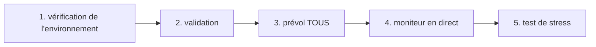

# IrsanAI Agent TPM Forge

[🇬🇧 English](./README.md) | [🇩🇪 Deutsch](./README.de.md) | [🇪🇸 Español](./docs/i18n/README.es.md) | [🇮🇹 Italiano](./docs/i18n/README.it.md) | [🇧🇦 Bosanski](./docs/i18n/README.bs.md) | [🇷🇺 Русский](./docs/i18n/README.ru.md) | [🇨🇳 中文](./docs/i18n/README.zh-CN.md) | [🇫🇷 Français](./docs/i18n/README.fr.md) | [🇧🇷 Português (BR)](./docs/i18n/README.pt-BR.md) | [🇮🇳 हिन्दी](./docs/i18n/README.hi.md) | [🇹🇷 Türkçe](./docs/i18n/README.tr.md) | [🇯🇵 日本語](./docs/i18n/README.ja.md)

Un bootstrap propre pour une configuration multi-agents autonome (BTC, COFFEE, et plus) avec des options d'exécution multi-plateformes.

## Ce qui est inclus

- `production/preflight_manager.py` – sondage résilient des sources de marché avec Alpha Vantage + chaîne de secours et cache local.
- `production/tpm_agent_process.py` – boucle d'agent simple par marché.
- `production/tpm_live_monitor.py` – moniteur BTC en direct avec démarrage à chaud CSV optionnel et notifications Termux.
- `core/tpm_scientific_validation.py` – pipeline de backtest + validation statistique.
- `scripts/tpm_cli.py` – lanceur unifié pour Termux/Linux/macOS/Windows.
- `scripts/stress_test_suite.py` – test de stress de basculement/latence.
- `scripts/start_agents.sh`, `scripts/health_monitor_v3.sh` – assistants d'opérations de processus.
- `core/scout.py`, `core/reserve_manager.py`, `core/init_db_v2.py` – outils opérationnels de base.

## Démarrage rapide universel

```bash
python scripts/tpm_cli.py env
python scripts/tpm_cli.py validate
python scripts/tpm_cli.py preflight --market ALL
python scripts/tpm_cli.py live --history-csv btc_real_24h.csv --poll-seconds 3600
```

## Vérification de la chaîne d'exécution (cohérence causale/ordre)

Le flux par défaut du dépôt est intentionnellement linéaire pour éviter la dérive d'état caché et la "fausse confiance" lors des exécutions en direct.



### Logique de porte (ce qui doit être vrai avant l'étape suivante)
- **Porte 1 – Environnement :** Le contexte Python/plateforme est correct (`env`).
- **Porte 2 – Cohérence scientifique :** Le comportement du modèle de base est reproductible (`validate`).
- **Porte 3 – Fiabilité de la source :** Les données de marché + la chaîne de secours sont accessibles (`preflight --market ALL`).
- **Porte 4 – Exécution en direct :** La boucle en direct s'exécute avec un historique d'entrée connu (`live`).
- **Porte 5 – Confiance adversaire :** Les cibles de latence/basculement tiennent sous stress (`stress_test_suite.py`).

✅ Déjà corrigé dans le code : le prévol CLI prend désormais en charge `--market ALL`, correspondant au démarrage rapide + flux Docker.

## Choisissez votre mission (CTA basé sur les rôles)

> **Vous êtes X ? Cliquez sur votre voie. Commencez en moins de 60 secondes.**

| Persona | Ce qui vous intéresse | Chemin de clic | Première commande |
|---|---|---|---|
| 📈 **Trader** | Rythme rapide, exécution actionnable | [`tpm_live_monitor.py`](./production/tpm_live_monitor.py) | `python scripts/tpm_cli.py live --history-csv btc_real_24h.csv --poll-seconds 3600` |
| 💼 **Investisseur** | Stabilité, confiance dans la source, résilience | [`preflight_manager.py`](./production/preflight_manager.py) | `python scripts/tpm_cli.py preflight --market ALL` |
| 🔬 **Scientifique** | Preuves, tests, signal statistique | [`tpm_scientific_validation.py`](./core/tpm_scientific_validation.py) | `python scripts/tpm_cli.py validate` |
| 🧠 **Théoricien** | Structure causale + architecture future | [`core/scout.py`](./core/scout.py) + [`Prochaines étapes`](#next-steps) | `python scripts/tpm_cli.py validate` |
| 🛡️ **Sceptique (priorité)** | Casser les hypothèses avant la production | [`stress_test_suite.py`](./scripts/stress_test_suite.py) + [`preflight_manager.py`](./production/preflight_manager.py) | `python scripts/tpm_cli.py preflight --market ALL && python scripts/stress_test_suite.py` |
| ⚙️ **Opérateur / DevOps** | Temps de disponibilité, santé des processus, récupérabilité | [`start_agents.sh`](./scripts/start_agents.sh) + [`health_monitor_v3.sh`](./scripts/health_monitor_v3.sh) | `bash scripts/start_agents.sh` |

### Défi du sceptique (recommandé en premier pour les nouveaux visiteurs)
Si vous ne faites **qu'une seule chose**, exécutez ceci et inspectez le rapport généré :

```bash
python scripts/tpm_cli.py preflight --market ALL
python scripts/stress_test_suite.py
```

Si cette voie vous convainc, le reste du dépôt vous parlera probablement aussi.

## Notes sur la plateforme

- **Android / Termux (Samsung, etc.)**
  ```bash
  bash scripts/termux_bootstrap.sh
  cd ~/TPM-Agent
  python scripts/tpm_cli.py env
  python scripts/tpm_cli.py preflight --market ALL
  python scripts/tpm_cli.py live --history-csv btc_real_24h.csv --notify --vibrate-ms 1000
  ```
  Pour une démo directe de l'interface utilisateur web Android (Termux), démarrez Forge localement :
  ```bash
  cd ~/TPM-Agent
  bash scripts/termux_forge.sh start
  # stop: bash scripts/termux_forge.sh stop
  # status: bash scripts/termux_forge.sh status
  ```
  Le script ouvre automatiquement le navigateur (si disponible) et maintient le service en arrière-plan.
  Si vous avez rencontré une erreur de construction `pydantic-core`/Rust ou `scipy`/Fortran sur Android, utilisez
  `python -m pip install -r requirements-termux.txt` (ensemble Termux-safe, aucune chaîne d'outils Rust requise).
  Dans l'interface web, vous pouvez contrôler le démarrage/arrêt de l'exécution ; une barre de progression indique l'état de la transition.
- **iPhone (meilleur effort)** : utilisez des applications shell telles que iSH / a-Shell. Les hooks de notification spécifiques à Termux n'y sont pas disponibles.
- **Windows / Linux / macOS** : utilisez les mêmes commandes CLI ; exécutez via tmux/scheduler/cron pour la persistance.

## Docker (Le chemin le plus simple multi-OS)

Utilisez Docker dans cet ordre exact (pas de devinettes) :

### Étape 1 : Construire l'image d'exécution web

```bash
docker compose build --no-cache tpm-forge-web
```

### Étape 2 : Démarrer le service de tableau de bord web

```bash
docker compose up tpm-forge-web
```

Ouvrez maintenant `http://localhost:8787` dans votre navigateur (**pas** `http://0.0.0.0:8787`). Uvicorn se lie à `0.0.0.0` en interne, mais les clients doivent utiliser `localhost` (ou l'adresse IP du réseau local hôte).

### Étape 3 (vérifications optionnelles) : comprendre les services non-web

```bash
docker compose run --rm tpm-preflight
docker compose run --rm tpm-live
```

- `tpm-preflight` = vérifications de source/connectivité (sortie CLI uniquement).
- `tpm-live` = journaux du moniteur en direct du terminal (sortie CLI uniquement, **pas d'interface utilisateur web**).
- `tpm-forge-web` = FastAPI + interface utilisateur du tableau de bord (celle avec la mise en page/progression/contrôle d'exécution).

Si `tpm-preflight` indique `ALPHAVANTAGE_KEY not set`, COFFEE fonctionne toujours via les mécanismes de secours.

Si la page semble vide :
- tester directement l'API : `http://localhost:8787/api/frame`
- tester la documentation FastAPI : `http://localhost:8787/docs`
- rafraîchissez le navigateur (`Ctrl+F5`)
- si nécessaire, redémarrez uniquement le service web : `docker compose restart tpm-forge-web`

Optionnel pour une meilleure qualité COFFEE :

```bash
export ALPHAVANTAGE_KEY="<votre_clé>"
docker compose run --rm tpm-preflight
```

## Prédictions de glitch et alertes mobiles

- Le cockpit live de Forge expose désormais une perspective à court terme par marché (`up/down/sideways`) avec confiance dans `/api/markets/live`.
- Lorsqu'un glitch de marché est détecté (pic d'accélération), l'exécution peut déclencher :
  - une notification toast + vibration Termux
  - un hook de notification/bip optionnel
  - une notification push Telegram optionnelle (si le jeton de bot/l'identifiant de chat sont configurés dans `config/config.yaml`).
- Configurez dans le tableau de bord via **Enregistrer les alertes** / **Tester l'alerte** ou l'API :
  - `GET /api/alerts/preferences`
  - `POST /api/alerts/preferences`
  - `POST /api/alerts/test`

## Validation

Exécutez le pipeline de validation scientifique :

```bash
python core/tpm_scientific_validation.py
```

Artefacts :
- `state/TPM_Scientific_Report.md`
- `state/TPM_test_results.json`

## Sources et basculement

`production/preflight_manager.py` prend en charge :
- Alpha Vantage en premier pour COFFEE (lorsque `ALPHAVANTAGE_KEY` est défini)
- Chaîne de secours TradingView + Yahoo
- Sauvegarde locale en cache dans `state/latest_prices.json`

Exécutez le prévol directement :

```bash
export ALPHAVANTAGE_KEY="<votre_clé>"
python production/preflight_manager.py --market ALL
```

Exécutez le test de stress de panne (cible `p95 < 1000ms`) :

```bash
python scripts/stress_test_suite.py
```

Sortie : `state/stress_test_report.json`

## Statut en direct : ce que l'agent TPM peut faire aujourd'hui

**État actuel :**
- L'exécution web de Forge en production est disponible (`production.forge_runtime:app`).
- La configuration de démarrage axée sur la finance utilise **BTC + COFFEE**.
- Le cadre en direct, l'aptitude de l'agent, l'entropie de transfert et le résumé du domaine sont visibles dans le tableau de bord web.
- Les utilisateurs peuvent ajouter de nouveaux agents de marché au moment de l'exécution (`POST /api/agents`).

**Capacité cible (souhaitable) :**
- Évaluation comparative des données réelles avec des seuils d'acceptation explicites (précision/rappel/FPR/dérive).
- Règles de gouvernance réflexives strictes pour le mode sécurisé automatique.
- Flux de travail de mémoire collective pour les modèles d'apprentissage versionnés par domaine.

**Prochaine étape d'expansion :**
- Orchestrateur de politiques basé sur les régimes (tendance/choc/latent) sur tous les agents.
- Un pilote de domaine non financier (par exemple, médical ou sismique) avec des contrats de données explicites.

## Aide à la résolution des conflits de fusion de PR

- Liste de contrôle de fusion (conflits GitHub) : `docs/MERGE_CONFLICT_CHECKLIST.fr.md`

### Portée aujourd'hui : Windows + smartphone pour la finance TPM

- **Windows :** L'exécution de Forge + l'interface web + Docker/PowerShell/démarrage en un clic sont opérationnels.
- **Smartphone :** La surveillance en direct Android/Termux est opérationnelle ; l'interface utilisateur web est réactive sur mobile.
- **Multi-agents en temps réel :** BTC + COFFEE sont actifs par défaut ; des marchés supplémentaires peuvent être ajoutés dynamiquement dans l'interface utilisateur web.
- **Règle de limite de source :** si le marché demandé n'est pas couvert par les sources intégrées, fournissez l'URL de source explicite + les données d'autorisation.

## Test en direct Windows (système à deux chemins)

### Chemin A — Développeurs/utilisateurs avancés (PowerShell, CMD, PyCharm, IDE)

```powershell
python -m venv .venv
.\.venv\Scripts\Activate.ps1
pip install -r requirements.txt
python scripts/tpm_cli.py forge-dashboard --open-browser --port 8787
```

### Chemin B — Utilisateurs novices (clic et démarrage)

1. Double-cliquez sur `scripts/windows_click_start.bat`
2. Le script sélectionne automatiquement le meilleur chemin disponible :
   - Python disponible -> venv + pip + exécution
   - sinon Docker Compose (si disponible)

Base technique : `scripts/windows_bootstrap.ps1`.

## Runtime Web de Production Forge (BTC + COFFEE, extensible)

Oui, cela a **déjà commencé** dans le dépôt et est maintenant étendu :

- Démarre par défaut avec un agent TPM financier pour **BTC** et un pour **COFFEE**.
- Les utilisateurs peuvent ajouter plus de marchés/agents directement depuis l'interface utilisateur web (`/api/agents`).
- Fonctionne comme un service d'exécution persistant avec une sortie de cadre en direct (`/api/frame`) pour une vision immersive.

### Démarrage (local)

```bash
uvicorn production.forge_runtime:app --host 0.0.0.0 --port 8787
# ouvrir http://localhost:8787
```

### Démarrage (Docker)

```bash
docker compose up tpm-forge-web
# ouvrir http://localhost:8787
```

## Aire de jeu TPM (MVP interactif)

Vous pouvez maintenant explorer le comportement du TPM de manière interactive dans le navigateur :

```bash
python -m http.server 8765
# ouvrir http://localhost:8765/playground/index.html
```

Comprend :
- Vue d'anomalie à signal faible d'un seul agent
- Pression de consensus d'un mini-essaim (BTC/COFFEE/VOL)
- Résonance de transfert inter-domaine (finance/météo/santé synthétiques)

Voir : `playground/README.md`.
## Prochaines étapes

- Module d'entropie de transfert pour l'analyse causale inter-marchés.
- Optimiseur avec mises à jour de politique basées sur les performances historiques.
- Canaux d'alerte (Telegram/Signal) + persistance au démarrage.

---

## IrsanAI Plongée Profonde : Comment le cœur TPM "pense" dans les systèmes complexes

### 1) Transformation visionnaire : d'agent de trading à écosystème TPM universel

### Qu'est-ce qui est unique dans l'algorithme IrsanAI-TPM ? (cadre corrigé)

Hypothèse de travail du cœur TPM :

- Dans les systèmes complexes et chaotiques, le signal d'alerte précoce est souvent caché dans le **micro-résiduel** : de minuscules déviations, de faibles corrélations, des points de données presque vides.
- Là où les systèmes classiques ne voient que `0` ou "pertinence insuffisante", le TPM recherche des **anomalies structurées** (modèles de glitch) dans le flux de contexte.
- Le TPM évalue non seulement une valeur en soi, mais le **changement des relations au fil du temps, la qualité de la source, le régime et le voisinage causal**.

Note de correction importante : le TPM ne prédit **pas** magiquement l'avenir. Il vise une **détection probabiliste plus précoce** des changements de régime, des ruptures et des perturbations — lorsque la qualité des données et les portes de validation sont satisfaites.

### Pensez GRAND : pourquoi cela s'étend au-delà de la finance

Si le TPM peut détecter des modèles précurseurs faibles dans les instruments financiers (