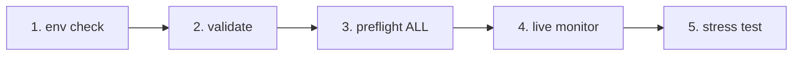

# IrsanAI TPM Agent Forge
[🇬🇧 English](../../README.md) | [🇩🇪 Deutsch](../../README.de.md) | [🇪🇸 Español](../../docs/i18n/README.es.md) | [🇮🇹 Italiano](../../docs/i18n/README.it.md) | [🇧🇦 Bosanski](../../docs/i18n/README.bs.md) | [🇷🇺 Русский](../../docs/i18n/README.ru.md) | [🇨🇳 中文](../../docs/i18n/README.zh-CN.md) | [🇫🇷 Français](../../docs/i18n/README.fr.md) | [🇧🇷 Português (BR)](../../docs/i18n/README.pt-BR.md) | [🇮🇳 हिन्दी](../../docs/i18n/README.hi.md) | [🇹🇷 Türkçe](../../docs/i18n/README.tr.md) | [🇯🇵 日本語](../../docs/i18n/README.ja.md)

[🇬🇧 English](../../README.md) | [🇩🇪 Deutsch](../../README.de.md) | [🇪🇸 Español](./README.es.md) | [🇮🇹 Italiano](./README.it.md) | [🇧🇦 Bosanski](./README.bs.md) | [🇷🇺 Русский](./README.ru.md) | [🇨🇳 中文](./README.zh-CN.md) | [🇫🇷 Français](./README.fr.md) | [🇧🇷 Português (BR)](./README.pt-BR.md) | [🇮🇳 हिन्दी](./README.hi.md) | [🇹🇷 Türkçe](./README.tr.md) | [🇯🇵 日本語](./README.ja.md)

Un bootstrap propre pour une configuration multi-agent autonome (BTC, COFFEE, et plus) avec des options d’exécution multiplateforme.

## Contenu inclus

- `production/preflight_manager.py` – détection résiliente des sources de marché avec Alpha Vantage + chaîne de secours et cache local de secours.
- `production/tpm_agent_process.py` – boucle simple par agent/market.
- `production/tpm_live_monitor.py` – moniteur BTC en direct avec démarrage à chaud CSV optionnel et notifications Termux.
- `core/tpm_scientific_validation.py` – pipeline de backtest et validation statistique.
- `scripts/tpm_cli.py` – lanceur unifié pour Termux/Linux/macOS/Windows.
- `scripts/stress_test_suite.py` – test de résistance latence/failles.
- `scripts/start_agents.sh`, `scripts/health_monitor_v3.sh` – assistants pour opérations de process.
- `core/scout.py`, `core/reserve_manager.py`, `core/init_db_v2.py` – outils fondamentaux opérationnels.

## Démarrage universel rapide

```bash
python scripts/tpm_cli.py env
python scripts/tpm_cli.py validate
python scripts/tpm_cli.py preflight --market ALL
python scripts/tpm_cli.py live --history-csv btc_real_24h.csv --poll-seconds 3600
```

## Contrôle de chaîne d’exécution (causalité / ordre logique)

Le flux du dépôt par défaut est intentionnellement linéaire pour éviter la dérive d’état caché et la « fausse confiance » lors des exécutions en direct.



### Logique des seuils (ce qui doit être vrai avant l’étape suivante)
- **Seuil 1 – Environnement :** contexte Python/plateforme correct (`env`).
- **Seuil 2 – Sanité scientifique :** comportement de base du modèle reproductible (`validate`).
- **Seuil 3 – Fiabilité des sources :** données de marché + chaîne de secours accessibles (`preflight --market ALL`).
- **Seuil 4 – Exécution runtime :** boucle live fonctionnant avec historique d’entrée connu (`live`).
- **Seuil 5 – Confiance adversariale :** objectifs latence/recouvrement valides sous stress (`stress_test_suite.py`).

✅ Déjà corrigé dans le code : la pré-vérification CLI supporte désormais `--market ALL`, conforme au quickstart et au flux Docker.

## Choisissez votre mission (CTA par rôle)

> **Vous êtes X ? Cliquez sur votre profil. Démarrage en moins de 60 secondes.**

| Persona | Ce qui vous importe | Chemin de clic | Première commande |
|---|---|---|---|
| 📈 **Trader** | Rythme rapide, runtime exploitable | [`tpm_live_monitor.py`](./production/tpm_live_monitor.py) | `python scripts/tpm_cli.py live --history-csv btc_real_24h.csv --poll-seconds 3600` |
| 💼 **Investisseur** | Stabilité, confiance en la source, résilience | [`preflight_manager.py`](./production/preflight_manager.py) | `python scripts/tpm_cli.py preflight --market ALL` |
| 🔬 **Scientifique** | Preuves, tests, signal statistique | [`tpm_scientific_validation.py`](./core/tpm_scientific_validation.py) | `python scripts/tpm_cli.py validate` |
| 🧠 **Théoricien** | Structure causale + architecture future | [`core/scout.py`](./core/scout.py) + [`Prochaines étapes`](#next-steps) | `python scripts/tpm_cli.py validate` |
| 🛡️ **Sceptique (prioritaire)** | Briser les hypothèses avant la production | [`stress_test_suite.py`](./scripts/stress_test_suite.py) + [`preflight_manager.py`](./production/preflight_manager.py) | `python scripts/tpm_cli.py preflight --market ALL && python scripts/stress_test_suite.py` |
| ⚙️ **Opérateur / DevOps** | Disponibilité, santé des processus, récupérabilité | [`start_agents.sh`](./scripts/start_agents.sh) + [`health_monitor_v3.sh`](./scripts/health_monitor_v3.sh) | `bash scripts/start_agents.sh` |

### Défi du sceptique (fortement recommandé pour nouveaux visiteurs)
Si vous ne faites **qu’une seule chose**, exécutez ceci et inspectez le rapport :

```bash
python scripts/tpm_cli.py preflight --market ALL
python scripts/stress_test_suite.py
```

Si cette voie vous convainc, le reste du dépôt résonnera probablement aussi.

## Notes sur les plateformes

- **Android / Termux (Samsung, etc.)**
  ```bash
  bash scripts/termux_bootstrap.sh
  cd ~/TPM-Agent
  python scripts/tpm_cli.py env
  python scripts/tpm_cli.py preflight --market ALL
  python scripts/tpm_cli.py live --history-csv btc_real_24h.csv --notify --vibrate-ms 1000
  ```
  Pour une démo UI web directe Android (Termux), démarrez localement le runtime Forge :
  ```bash
  cd ~/TPM-Agent
  bash scripts/termux_forge.sh start
  # arrêter : bash scripts/termux_forge.sh stop
  # statut : bash scripts/termux_forge.sh status
  ```
  Le script ouvre automatiquement le navigateur (si disponible) et maintient le service en tâche de fond.
  Si vous avez rencontré une erreur de build `pydantic-core`/Rust ou `scipy`/Fortran sur Android, utilisez
  `python -m pip install -r requirements-termux.txt` (jeu sûr pour Termux, sans toolchain Rust nécessaire).
  Dans l’interface web, vous pouvez contrôler le démarrage/arrêt du runtime ; une barre de progression affiche le statut de transition.
- **iPhone (au mieux)** : utilisez des applications shell telles que iSH / a-Shell. Les hooks de notification spécifiques Termux ne sont pas disponibles.
- **Windows / Linux / macOS** : utilisez les mêmes commandes CLI ; lancez via tmux/scheduler/cron pour persistance.

## Docker (chemin multiplateforme le plus simple)

Utilisez Docker dans cet ordre exact (pas de devinettes) :

### Étape 1 : Construire l’image runtime web

```bash
docker compose build --no-cache tpm-forge-web
```

### Étape 2 : Démarrer le service tableau de bord web

```bash
docker compose up tpm-forge-web
```

Ouvrez ensuite `http://localhost:8787` dans votre navigateur (**pas** `http://0.0.0.0:8787`). Uvicorn écoute `0.0.0.0` en interne, mais les clients doivent utiliser `localhost` (ou l’IP LAN hôte).

### Étape 3 (vérifications optionnelles) : comprendre les services non-web

```bash
docker compose run --rm tpm-preflight
docker compose run --rm tpm-live
```

- `tpm-preflight` = contrôles source/connectivité (sortie CLI uniquement).
- `tpm-live` = logs du moniteur live terminal (CLI uniquement, **pas d’interface web**).
- `tpm-forge-web` = FastAPI + interface tableau de bord (celui avec mise en page/progression/contrôle runtime).

Si `tpm-preflight` indique `ALPHAVANTAGE_KEY not set`, COFFEE fonctionne toujours via les secours.

Si la page est blanche :
- tester l’API directement : `http://localhost:8787/api/frame`
- tester la doc FastAPI : `http://localhost:8787/docs`
- rafraîchir fortement le navigateur (`Ctrl+F5`)
- si besoin, redémarrer seulement le service web : `docker compose restart tpm-forge-web`

Optionnel pour meilleure qualité COFFEE :

```bash
export ALPHAVANTAGE_KEY="<your_key>"
docker compose run --rm tpm-preflight
```

## Prédictions de glitchs & alertes mobiles

- Le cockpit live Forge expose désormais les perspectives à court terme par marché (`up/down/sideways`) avec niveau de confiance via `/api/markets/live`.
- Lorsqu’un glitch de marché est détecté (pic d’accélération), le runtime peut déclencher :
  - toast + vibration Termux
  - hook notification / bip optionnel
  - notification push Telegram optionnelle (si jeton bot / chat id configurés dans `config/config.yaml`).
- Configuration possible dans le tableau de bord via **Sauvegarder alertes** / **Tester alerte** ou API :
  - `GET /api/alerts/preferences`
  - `POST /api/alerts/preferences`
  - `POST /api/alerts/test`

## Validation

Exécutez le pipeline de validation scientifique :

```bash
python core/tpm_scientific_validation.py
```

Artifacts :
- `state/TPM_Scientific_Report.md`
- `state/TPM_test_results.json`

## Sources & secours

`production/preflight_manager.py` supporte :
- Alpha Vantage en premier pour COFFEE (si `ALPHAVANTAGE_KEY` défini)
- TradingView + chaîne de secours Yahoo
- secours local dans le cache `state/latest_prices.json`

Exécutez directement la pré-vérification :

```bash
export ALPHAVANTAGE_KEY="<your_key>"
python production/preflight_manager.py --market ALL
```

Exécutez le test de résistance sur panne (objectif `p95 < 1000ms`) :

```bash
python scripts/stress_test_suite.py
```

Sortie : `state/stress_test_report.json`

## État live : ce que l’agent TPM peut faire aujourd’hui

**État actuel :**
- Le runtime web Forge de production est disponible (`production.forge_runtime:app`).
- La configuration de démarrage priorise la finance avec **BTC + COFFEE**.
- Frame live, fitness agent, entropie de transfert, et synthèse domaine sont visibles dans le tableau de bord web.
- Les utilisateurs peuvent ajouter de nouveaux agents marché à l’exécution (`POST /api/agents`).

**Capacités ciblées (devoir-être) :**
- Benchmarking sur données réelles avec seuils d’acceptation explicites (précision/rappel/FPR/dérive).
- Règles de gouvernance réflexive strictes pour un mode sûr automatique.
- Workflow de mémoire collective pour archivage et apprentissage multi-version par domaine.

**Prochaine étape d’expansion :**
- Orchestrateur de politiques basé sur régime (tendance/choc/lateral) sur tous les agents.
- Premier pilote hors finance (ex. médical ou sismique) avec contrats de données explicites.

## Aide en cas de conflits de fusion PR

- Checklist de fusion (conflits GitHub) : `docs/MERGE_CONFLICT_CHECKLIST.de.md`

### Portée à ce jour : Windows + smartphone pour TPM finance

- **Windows :** runtime Forge + interface web + Docker/PowerShell/démarrage par clic sont opérationnels.
- **Smartphone :** monitoring live Android/Termux opérationnel ; UI web responsive sur mobile.
- **Multi-agent temps réel :** BTC + COFFEE activés par défaut ; marchés additionnels ajoutables dynamiquement via l’UI web.
- **Règle frontière source :** si marché demandé hors sources intégrées, fournir URL source explicite + données d’autorisation.

## Test live Windows (système deux-chemins)

### Chemin A — Développeurs/utilisateurs avancés (PowerShell, CMD, PyCharm, IDE)

```powershell
python -m venv .venv
.\.venv\Scripts\Activate.ps1
pip install -r requirements.txt
python scripts/tpm_cli.py forge-dashboard --open-browser --port 8787
```

### Chemin B — Utilisateurs basiques (clic & démarrage)

1. Double-cliquez `scripts/windows_click_start.bat`
2. Le script sélectionne automatiquement le meilleur chemin disponible :
   - Python dispo -> venv + pip + runtime
   - sinon Docker Compose (si dispo)

Base technique : `scripts/windows_bootstrap.ps1`.

## Runtime web de production Forge (BTC + COFFEE, extensible)

Oui, cela a **déjà démarré** dans le dépôt et s’étend maintenant :

- Démarre par défaut avec un agent TPM finance pour **BTC** et un pour **COFFEE**.
- Les utilisateurs peuvent ajouter plus de marchés/agents directement depuis l’UI web (`/api/agents`).
- Fonctionne comme un service runtime persistant avec sortie live frame (`/api/frame`) pour une immersion avancée.

### Démarrer (local)

```bash
uvicorn production.forge_runtime:app --host 0.0.0.0 --port 8787
# ouvrir http://localhost:8787
```

### Démarrer (Docker)

```bash
docker compose up tpm-forge-web
# ouvrir http://localhost:8787
```

## TPM Playground (MVP interactif)

Vous pouvez désormais explorer le comportement TPM de façon interactive dans le navigateur :

```bash
python -m http.server 8765
# ouvrir http://localhost:8765/playground/index.html
```

Inclut :
- Vue anomalie signal faible agent unique
- Mini essaim (BTC/COFFEE/VOL) consensus pression
- Résonance transfert cross-domaine (finance synthétique/météo/santé)

Voir : `playground/README.md`.

## Prochaines étapes

- Module d’entropie de transfert pour analyse causale cross-market.
- Optimiseur avec mise à jour de politique basée sur performances historiques.
- Canaux d’alerte (Telegram/Signal) + persistance boot.

---

## IrsanAI Deep Dive : Comment le cœur TPM « pense » dans les systèmes complexes

### 1) Transformation visionnaire : de l’agent trading à l’écosystème universel TPM

### Qu’est-ce qui rend unique l’algorithme IrsanAI-TPM ? (reformulation corrigée)

Hypothèse de travail du cœur TPM :

- Dans les systèmes complexes et chaotiques, le signal d’alerte précoce est souvent caché dans le **micro-résiduel** : écarts minuscules, corrélations faibles, points de données quasi-vides.
- Là où les systèmes classiques voient seulement `0` ou « pertinence insuffisante », TPM recherche des **anomalies structurées** (schémas glitch) dans le flux contextuel.
- TPM évalue non seulement une valeur isolée, mais le **changement des relations dans le temps, qualité source, régime et voisinage causal**.

Note importante de rigueur : TPM ne prédit **pas** magiquement le futur. Il vise une **détection probabiliste plus précoce** des changements de régime, ruptures et disruptions — lorsque la qualité des données et les seuils de validation sont validés.

### Pensez GRAND : pourquoi cela dépasse la finance

Si TPM peut détecter des motifs précurseurs faibles sur instruments financiers (index/ticker/identifiants ISIN, liquidité, microstructure), ce même principe peut se généraliser à de nombreux domaines :

- **Flux événements/capteurs + modèle contextuel + couche anomalie + boucle de rétroaction**
- Chaque métier peut être modélisé comme un « marché » avec caractéristiques, nœuds, corrélations et anomalies spécifiques au domaine
- Des agents TPM spécialisés peuvent apprendre à travers les domaines tout en préservant logique et éthique professionnelle locales

### 100 professions cibles pour TPM

| # | Profession | Données analogues TPM | Cible détection anomalie/motif |
|---|---|---|---|
| 1 | Analyste police | Logs incidents, cartes spatio-temporelles, réseaux | Signaux précoces clusters criminels |
| 2 | Commandant pompiers | Chaînes d’alarme, capteurs, météo, profils bâtiments | Prévoir propagation feu/risques |
| 3 | Paramédic/EMS | Motifs dispatch, temps réponse, charge hôpitaux | Détecter stress capacité avant rupture |
| 4 | Médecin urgences | Flux triage, constantes, dynamique attente | Identifier décompensation critique précoce |
| 5 | Infirmier réa | Tendances ventilation/labo, médications | Identifier micro-signaux sepsis/choc |
| 6 | Épidémiologiste | Taux cas, mobilité, eaux usées/labo | Alerte précoce avant phase exponentielle |
| 7 | Médecin généraliste | Données EHR, prescriptions, suivis | Détecter transitions risque chronique |
| 8 | Psychologue clinique | Trajectoires sessions, marqueurs language, sommeil/activité | Indicateurs rechute/crise plus tôt |
| 9 | Chercheur pharma | Criblage composés, profils effets secondaires, génomique | Révéler clusters efficacité/effets cachés |
| 10 | Biotechnologiste | Séquences/processus/culture cellulaire | Détecter dérive et risque contamination |
| 11 | Climatologue | Séries atmosphère/océan, données satellite | Identifier précurseurs points de basculement |
| 12 | Météorologue | Pression/humidité/vent/radar | Anticiper changements météo chaotiques locaux |
| 13 | Sismologue | Micro-séismes, champs de contrainte, capteurs | Détecter précurseurs libérations majeures |
| 14 | Volcanologue | Gaz, tremblements, déformation | Restreindre fenêtres probabilité éruption |
| 15 | Hydrologue | Jauges rivière, pluie, humidité sol | Détecter crues-éclairs et phases sécheresse |
| 16 | Océanographe | Courants, température, salinité, bouées | Détecter anomalies tsunami/écosystèmes |
| 17 | Trader énergie | Charge, prix spot, météo, état réseau | Signaler ruptures prix/charge probables |
| 18 | Opérateur réseau | Fréquence réseau, état lignes, commutations | Détecter risque panne en cascade |
| 19 | Opérateur parc éolien | Télémétrie turbines, vents, maintenance | Prévoir pannes et dérives performances |
| 20 | Opérateur solaire | Irradiance, télémétrie onduleurs, charge thermique | Détecter dégradation / anomalies rendement |
| 21 | Gestionnaire eau | Flux, capteurs qualité, consommation | Détecter contamination/pénuries tôt |
| 22 | Gestion trafic | Densité, collisions, travaux, événements | Prédire congestion et escalade accidents |
| 23 | Contrôle ferroviaire | Respect horaires, état voies, chaînes retards | Casser cascades retards systémiques tôt |
| 24 | Contrôle trafic aérien | Trajets vols, météo, saturation créneaux | Détecter conflits et goulets d’étranglement |
| 25 | Logistique portuaire | Temps quai, flux conteneurs, douanes | Détecter précurseurs ruptures d’approvisionnement |
| 26 | Gestion chaîne appro | ETA, inventaire, demande, risques | Minimiser effets bullwhip et ruptures stock |
| 27 | Responsable prod | OEE, télémétrie process, rebut, temps réglage | Détecter dérives qualité et anomalies machine |
| 28 | Ingénieur qualité | Distributions tolérance, signaux process | Détecter précurseurs quasi zéro défaut |
| 29 | Ingénieur robotique | Trajectoires mouvements, charge actionneurs, contrôle | Prévoir instabilités/pannes contrôle |
| 30 | Ingénieur maintenance aéronautique | Télémétrie moteur/vol, historiques maintenance | Maintenance prédictive composants |
| 31 | Chef chantier | Avancement, météo, dates fournitures, IoT | Quantifier risques anomaly délais/coûts |
| 32 | Ingénieur structure | Charge, vibrations, indicateurs fatigue/vieillissement | Détecter transitions critiques structurelles |
| 33 | Urbaniste | Mobilité, démographie, émissions, occupation sols | Détecter stress urbain émergent |
| 34 | Architecte | Exploitation batiment, occupation, consommations | Détecter mésusage design/utilisation |
| 35 | Agriculteur | Sol/météo/culture/marché | Détecter anomalies maladies/rendement tôt |
| 36 | Agronome | Nutrition/hydratation satellite | Cibler interventions précises tôt |
| 37 | Gestionnaire forêt | Humidité, parasites, indicateurs incendie | Détecter dégâts forêt/fenêtres incendie tôt |
| 38 | Gestionnaire pêcheries | Registres prises, qualité eau, migrations | Détecter risques surpêche/effondrement |
| 39 | Inspecteur sécurité alimentaire | Résultats labo, logs chaîne froide, liens fournisseurs | Interrompre chaînes contamination tôt |
| 40 | Chef exécutif | Demande, santé stocks, ratios gaspillages | Minimiser pertes et ruptures |
| 41 | Exploitant retail | Flux caisse, fréquentation, rotation stock | Détecter pics demande et pertes volume |
| 42 | Manager e-commerce | Clickstream, parcours panier, retours | Détecter fraude/précurseurs churn |
| 43 | Analyste marketing | Campagnes, réponse segments | Détecter micro-tendances avant généralisation |
| 44 | Responsable ventes | Vitesse pipeline, graphe points contacts | Détecter risques opportunités timing deals |
| 45 | Chef support client | Flux tickets, clusters sujets, dérive SLA | Détecter vagues escalade / causes racines |
| 46 | Chef produit | Adoption fonctionnalités, rétention, retours | Détecter inadéquation produit-marché tôt |
| 47 | Chercheur UX | Heatmaps, parcours, points chute | Mettre au jour frictions interaction cachées |
| 48 | Ingénieur logiciel | Logs, traces, métriques déploiement | Détecter cascades de défauts avant incident |
| 49 | Ingénieur fiabilité site | Latence, budgets erreurs, saturation | Identifier dégradation avant panne |
| 50 | Analyste cybersécurité | Flux réseau, événements IAM, alertes SIEM | Détecter chemins d’attaque et mouvements latéraux |
| 51 | Analyste fraude | Graphes transactions, empreintes devices | Détecter fraude dans espace signal faible |
| 52 | Gestionnaire risque banque | Portefeuille/macro/exposition liquidité | Détecter stress régimes et risque concentration |
| 53 | Actuaire assurance | Flux sinistres, cartes exposition, liens climat | Anticiper vagues sinistres et stress réserves |
| 54 | Conseiller fiscal | Motifs comptables, calendriers déclarations | Détecter risque conformité et optimisation |
| 55 | Auditeur | Traces contrôle, motifs exceptions | Détecter anomalies comptables à l’échelle |
| 56 | Avocat | Chronologie dossiers, graphes jurisprudence, délais | Détecter risque contentieux et issues probables |
| 57 | Juge/administrateur tribunal | Mix charge dossiers, durées cycles | Identifier goulets d’étranglement justice |
| 58 | Responsable détention | Occupation, réseaux incidents, tendances comportement | Détecter clusters violence/récidive |
| 59 | Douanier | Manifestes, déclarations, patterns routage | Détecter signaux contrebande/contournement |
| 60 | Analyste renseignement défense | Flux ISR, logistique, tempo opérations | Détecter dynamique escalade tôt |
| 61 | Analyste diplomatie | Chaînes événements, communications | Détecter basculements régimes géopolitiques |
| 62 | Enseignant | Progression apprentissage, présence, engagement | Détecter risque décrochage et besoins soutien |
| 63 | Proviseur | Clusters performances, fréquentation, ressources | Détecter stress systémique scolaire |
| 64 | Enseignant universitaire | Activité cours, désistements, retours | Stabiliser réussite étudiants tôt |
| 65 | Chercheur éducation | Trajectoires cohortes, variables pédagogiques | Identifier effets robustes interventions |
| 66 | Assistant social | Réseaux cas, rendez-vous, marqueurs risques | Détecter voies escalade crises |
| 67 | Coordinateur ONG | Rapports terrains, flux aide, signaux besoins | Détecter lacunes impact et hotspots |
| 68 | Conseiller emploi | Profils compétences, demande, transitions | Détecter inadéquation/upskilling besoins |
| 69 | Responsable RH | Embauche/attrition/perf trajectoires | Détecter burn-out et risque de rétention |
| 70 | Recruteur | Taux entonnoir, taxonomie compétences, pulse marché | Détecter risque ajustement/opportunité embauche |
| 71 | Consultant organisation | Cadence décisionnelle, dérives KPI, motifs réseau | Détecter dysfonction équipe tôt |
| 72 | Chef projet | Jalons, dépendances, graph de blocages | Anticiper ruptures planning/portée |
| 73 | Journaliste | Fiabilité sources, flux événements | Détecter clusters désinformation tôt |
| 74 | Reporter enquêteur | Réseaux documents, traces argent/communication | Exposer anomalies systémiques cachées |
| 75 | Modérateur contenu | Flux posts/commentaires, décalages sémantiques | Détecter vagues abus/radicalisation tôt |
| 76 | Artiste | Trajectoires audience, vecteurs style | Détecter esthétiques émergentes |
| 77 | Producteur musique | Traits écoute, vecteurs arrangement | Prévoir potentiel percée/niche tôt |
| 78 | Concepteur jeu | Télémétrie, progression, courbes churn | Détecter frustr. et anomalies équilibrage |
| 79 | Entraîneur sportif | Performances/biométrie charge | Repérer précurseurs blessure/baisse forme |
| 80 | Préparateur physique | Marqueurs mouvements/récupération | Détecter surcharge avant arrêt |
| 81 | Médecin du sport | Diagnostics, charge rééducation, risques récidive | Optimiser fenêtres retour au jeu |
| 82 | Analyste arbitre | Flux décisions, tempo, contexte incidents | Détecter dérives consistance/équité |
| 83 | Responsable événementiel | Billetterie, mobilité, météo, sécurité | Détecter risques foule et sécurité |
| 84 | Gestionnaire tourisme | Réservations, signaux réputation | Détecter variations demande et sentiment |
| 85 | Directeur hôtel | Occupation, qualité service, plaintes | Détecter instabilité qualité-demande tôt |
| 86 | Gestionnaire immobilier | Flux loyers, maintenance, comparables | Détecter risques vacance/défaut tôt |
| 87 | Gestionnaire installations | IoT bâtiments, énergie, maintenance | Détecter pannes et inefficacités |
| 88 | Exploitant gestion déchets | Flux déchets, routage, métriques environnement | Détecter dépôts illégaux et ruptures processus |
| 89 | Inspecteur environnement | Émissions, rapports, superpositions satellite | Détecter violations conformité et risques basculement |
| 90 | Analyste économie circulaire | Passeports matériaux, taux récupération | Détecter fuites et opportunités boucle fermée |
| 91 | Astrophysicien | Flux télescope, spectres, modèles bruit | Détecter évènements cosmiques rares |
| 92 | Ingénieur opérations spatiales | Télémétrie, paramètres orbite, diag système | Détecter anomalies critiques missions tôt |
| 93 | Ingénieur quantique | Profils bruit, dérives calibration, erreurs portes | Détecter décohérence et dérive contrôle |
| 94 | Data scientist | Dérive features, qualité modèles, intégrité données | Détecter effondrement modèle et dérive biais |
| 95 | Éthicien IA | Résultats décisions, métriques équité | Détecter biais injustice / lacunes gouvernance |
| 96 | Philosophe sciences | Chemins théorie-preuve | Détecter signaux inadéquation paradigme |
| 97 | Mathématicien | Structures résiduelles, invariants, termes d’erreur | Détecter régularités cachées / classes outliers |
| 98 | Théoricien systèmes | Dynamique nœuds-arêtes, retards feedback | Détecter dynamique basculement réseau |
| 99 | Anthropologue | Observations terrain, réseaux sociaux/langage | Détecter précurseurs conflits de changement culturel |
| 100 | Stratège prospective | Courbes techno, régulations, données comportementales | Relier scénarios et indicateurs précoces |

### Notes country-fit (équivalence professionnelle selon juridictions)

Pour garder la liste cohérente entre régions, le mapping des rôles TPM doit être interprété comme des **équivalents fonctionnels**, pas une traduction littérale des intitulés :

- **Allemagne ↔ US/UK:** `Polizei` vs fonctions fragmentées (`Police Department`, `Sheriff`, `State Trooper`) et différences en poursuites (`Staatsanwaltschaft` vs `District Attorney/Crown Prosecution`).
- **Espagne / Italie :** structures de droit civil avec processus judiciaires et policiers distincts ; pipelines de données souvent répartis entre régional et national.
- **Bosnie-Herzégovine :** gouvernance multi-entités avec propriété de données fragmentée ; TPM profite de la fusion fédérée d’anomalies.
- **Russie / Chine :** définitions de rôles et contraintes compliance différentes ; TPM doit être configuré avec limites locales et équivalents institutionnels.
- **Autres régions à fort impact :** France, Brésil, Inde, Japon, pays MENA, Afrique subsaharienne peuvent être intégrés via mapping fonctionnel et télémétrie disponible.

### Perspectives philosophiques et scientifiques

- De l’outil à **infrastructure épistémique** : les domaines opérationnalisent la « connaissance faible et précoce ».
- Des systèmes isolés à **fédérations d’agents** : éthique locale + grammaire partagée d’anomalies.
- De la réponse réactive à la **gouvernance anticipative** : prévention plutôt que gestion tardive de crise.
- Des modèles statiques à des **théories vivantes** : recalibration continue sous chocs réels.

Idée centrale : un cluster TPM gouverné de façon responsable ne contrôle pas le chaos — mais aide les institutions à le comprendre plus tôt, le piloter plus solidement, et décider plus humainement.

## Expansion multilingue (en cours)

Pour soutenir la résonance inter-langues, des aperçus stratégiques localisés sont disponibles en :

- Espagnol (`docs/i18n/README.es.md`)
- Italien (`docs/i18n/README.it.md`)
- Bosniaque (`docs/i18n/README.bs.md`)
- Russe (`docs/i18n/README.ru.md`)
- Chinois simplifié (`docs/i18n/README.zh-CN.md`)
- Français (`docs/i18n/README.fr.md`)
- Portugais Brésil (`docs/i18n/README.pt-BR.md`)
- Hindi (`docs/i18n/README.hi.md`)
- Turc (`docs/i18n/README.tr.md`)
- Japonais (`docs/i18n/README.ja.md`)

Chaque fichier localisé inclut des notes d’adaptation régionale et renvoie à cette section anglaise canonique pour la matrice complète des 100 professions.

## IrsanAI Quality Meta (SOLL vs IST)

Pour le niveau de maturité actuel du dépôt, l’état intermédiaire de qualité et la roadmap causale basée sur les attentes réelles des utilisateurs, voir :

- `docs/IRSANAI_QUALITY_META.md`

Ce document est désormais la référence pour :
- profondeur fonctionnelle des features (UX/UI + robustesse opérationnelle),
- exigences parité Docker/Android,
- ainsi que les seuils de qualité acceptés pour les prochaines PRs.

## Mode parité i18n (miroir complet)

Pour garantir qu’aucune communauté linguistique ne soit désavantagée, les fichiers i18n sont maintenus en pleine parité canonique avec `README.md`.

Commande de synchronisation :

```bash
python scripts/i18n_full_mirror_sync.py
```

## Note aux développeurs (LOP – Liste des points ouverts)

Ce qui reste à mon avis ouvert (fonctionnel, pas bloqué techniquement) :

| Point | État actuel | Comment avancer utilement |
|---|---|---|
| **Module entropie de transfert pour causalité cross-market** | **Terminé ✅** – implémenté en `TransferEntropyEngine` et câblé dans orchestrateur Forge. | Compléter calibration métier : seuils spécifiques au domaine et règles d’interprétation. |
| **Optimiseur / mise à jour politiques basée sur historique** | **Terminé ✅** – scoring fitness, update reward et cull candidats dans boucle tick. | Documenter modes opératoires (conservateur/agressif) et rendre testables en profils gouvernance. |
| **Alerting (Telegram/Signal)** | **Partiellement fait 🟡** – infrastructure présente, désactivée par défaut. | Établir politique alerte : quels événements, sévérité, canal, réceptivité. |
| **Persistance boot / fonctionnement continu** | **Partiellement fait 🟡** – tmux start/health monitoring existe, pas encore runbook boot unifié pour toutes cibles. | Définir profils plateformes (Termux/Linux/Docker) avec démarrage boot, politique restart et escalade écrites. |
| **Meta-layer coordonné (depuis « Prochaine étape (promue) »)** | **Partiellement fait 🟡** – parties existantes (Orchestrateur + Entropie + Reward), pas décrit en Orchestrateur politique régime complet. | Ajouter un modèle de gouvernance métier explicite (Tendance/Choc/Latéral) pour poids agents. |
| **Mémoire collective (archive patterns apprentissage versionnée)** | **Ouvert 🔴** – mentionné en vision/extensions, sans processus clair stockage/revue métier. | Définir format pattern, logique versions, critères qualité (validité pattern). |
| **Gouvernance réflexive (mode sûr auto sur incertitude)** | **Ouvert 🔴** – but identifié mais pas formalisé en règle métier décisionnelle. | Traduire indicateurs incertitude et conditions commutation en règles gouvernance dures. |
| **Extension domaines au-delà finance/météo** | **Ouvert 🔴** – domaines supplémentaires en vision/templates, pas encore transformés en contrats data productifs. | Lancer un pilote domaine suivant (ex. médical ou sismique) avec métriques claires et sources données. |
| **Preuves scientifiques sur données réelles** | **Ouvert 🔴** – validation actuelle robuste mais sur segments synthétiques. | Compléter benchmarking données réelles avec critères acceptation fixes (Précision/Rappel/FPR/Dérive). |
| **Résonance multilingue / déploiement i18n** | **Partiellement fait 🟡** – plusieurs landingpages linguistiques, marqué comme « en cours ». | Définir processus synchronisation (quand propager modifs readme root vers tous i18n-README). |

Bref résumé : les « Next Steps » anciens sont **majoritairement démarrés ou réalisés techniquement** ; le plus grand levier réside maintenant en **operationalisation métier** (gouvernance, politiques, logique domaine, preuves données réelles) et **gestion documentation/i18n cohérente**.

### Plan d’exécution LOP

Pour ordonnancement, critères done et seuils de preuve par point LOP, voir :

- `docs/LOP_EXECUTION_PLAN.md`

## LOP (note finale – priorisée)

1. **P1 Développer preuves données réelles :** benchmarking avec critères fixes (Précision/Rappel/FPR/Dérive).
2. **P2 Finaliser gouvernance réflexive :** règles auto mode sûr dures sur incertitude.
3. **P3 Standardiser mémoire collective :** patterns apprentissage versionnés avec révision par domaine.
4. **P4 Étendre immersion web :** vues rôles supplémentaires TPM secteurs sur nouveau layout responsive.

**Remarque plateforme :** actuellement principalement ciblé **Windows + smartphone**. **À ajouter en fin LOP :** macOS, Linux et autres profils plateforme.