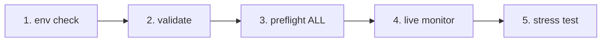

# इरसनाई टीपीएम एजेंट फोर्ज

[🇬🇧 English](./README.md) | [🇩🇪 Deutsch](./README.de.md) | [🇪🇸 Español](./docs/i18n/README.es.md) | [🇮🇹 Italiano](./docs/i18n/README.it.md) | [🇧🇦 Bosanski](./docs/i18n/README.bs.md) | [🇷🇺 Русский](./docs/i18n/README.ru.md) | [🇨🇳 中文](./docs/i18n/README.zh-CN.md) | [🇫🇷 Français](./docs/i18n/README.fr.md) | [🇧🇷 Português (BR)](./docs/i18n/README.pt-BR.md) | [🇮🇳 हिन्दी](./docs/i18n/README.hi.md) | [🇹🇷 Türkçe](./docs/i18n/README.tr.md) | [🇯🇵 日本語](./docs/i18n/README.ja.md)

क्रॉस-प्लेटफ़ॉर्म रनटाइम विकल्पों के साथ एक स्वायत्त मल्टी-एजेंट सेटअप (बीटीसी, कॉफी, और अधिक) के लिए एक स्वच्छ बूटस्ट्रैप।

## क्या शामिल है

- `production/preflight_manager.py` – अल्फा वेंटेज + फ़ॉलबैक चेन और स्थानीय कैश फ़ॉलबैक के साथ लचीला बाजार स्रोत जांच।
- `production/tpm_agent_process.py` – प्रति-बाजार एजेंट लूप।
- `production/tpm_live_monitor.py` – वैकल्पिक CSV वार्म-स्टार्ट और टर्मक्स नोटिफिकेशन के साथ लाइव BTC मॉनिटर।
- `core/tpm_scientific_validation.py` – बैकटेस्ट + सांख्यिकीय सत्यापन पाइपलाइन।
- `scripts/tpm_cli.py` – टर्मक्स/लिनक्स/मैकओएस/विंडोज के लिए एकीकृत लॉन्चर।
- `scripts/stress_test_suite.py` – फ़ेलओवर/विलंबता तनाव परीक्षण।
- `scripts/start_agents.sh`, `scripts/health_monitor_v3.sh` – प्रक्रिया संचालन सहायक।
- `core/scout.py`, `core/reserve_manager.py`, `core/init_db_v2.py` – परिचालन कोर टूलिंग।

## यूनिवर्सल क्विकस्टार्ट

```bash
python scripts/tpm_cli.py env
python scripts/tpm_cli.py validate
python scripts/tpm_cli.py preflight --market ALL
python scripts/tpm_cli.py live --history-csv btc_real_24h.csv --poll-seconds 3600
```

## रनटाइम चेन चेक (कारण/क्रम सुदृढ़ता)

लाइव रन के दौरान छिपी हुई-स्टेट ड्रिफ्ट और "झूठी आत्मविश्वास" से बचने के लिए डिफ़ॉल्ट रेपो प्रवाह जानबूझकर रैखिक है।


```mermaid
flowchart LR
  A[1. env check] --> B[2. validate]
  B --> C[3. preflight ALL]
  C --> D[4. live monitor]
  D --> E[5. stress test]
```

### गेट लॉजिक (अगले चरण से पहले क्या सही होना चाहिए)
- **गेट 1 – पर्यावरण:** पायथन/प्लेटफ़ॉर्म संदर्भ सही है (`env`)।
- **गेट 2 – वैज्ञानिक सुदृढ़ता:** बेसलाइन मॉडल व्यवहार प्रतिलिपि प्रस्तुत करने योग्य है (`validate`)।
- **गेट 3 – स्रोत विश्वसनीयता:** बाजार डेटा + फ़ॉलबैक चेन पहुंच योग्य हैं (`preflight --market ALL`)।
- **गेट 4 – रनटाइम निष्पादन:** लाइव लूप ज्ञात इनपुट इतिहास के साथ चलता है (`live`)।
- **गेट 5 – प्रतिकूल आत्मविश्वास:** तनाव के तहत विलंबता/फ़ेलओवर लक्ष्य रखते हैं (`stress_test_suite.py`)।

✅ कोड में पहले ही ठीक कर दिया गया है: CLI प्रीफ़्लाइट अब `--market ALL` का समर्थन करता है, जो क्विकस्टार्ट + डॉकर प्रवाह से मेल खाता है।

## अपना मिशन चुनें (भूमिका-आधारित CTA)

> **आप X हैं? अपनी लेन पर क्लिक करें। <60 सेकंड में शुरू करें।**

| व्यक्तित्व | आपको किस बात की परवाह है | क्लिक पथ | पहला कमांड |
|---|---|---|---|
| 📈 **ट्रेडर** | तेज़ गति, कार्रवाई योग्य रनटाइम | [`tpm_live_monitor.py`](./production/tpm_live_monitor.py) | `python scripts/tpm_cli.py live --history-csv btc_real_24h.csv --poll-seconds 3600` |
| 💼 **निवेशक** | स्थिरता, स्रोत विश्वास, लचीलापन | [`preflight_manager.py`](./production/preflight_manager.py) | `python scripts/tpm_cli.py preflight --market ALL` |
| 🔬 **वैज्ञानिक** | साक्ष्य, परीक्षण, सांख्यिकीय संकेत | [`tpm_scientific_validation.py`](./core/tpm_scientific_validation.py) | `python scripts/tpm_cli.py validate` |
| 🧠 **सिद्धांतकार** | कारण संरचना + भविष्य की वास्तुकला | [`core/scout.py`](./core/scout.py) + [`अगले कदम`](#अगले-कदम) | `python scripts/tpm_cli.py validate` |
| 🛡️ **संशयवादी (प्राथमिकता)** | उत्पादन से पहले मान्यताओं को तोड़ें | [`stress_test_suite.py`](./scripts/stress_test_suite.py) + [`preflight_manager.py`](./production/preflight_manager.py) | `python scripts/tpm_cli.py preflight --market ALL && python scripts/stress_test_suite.py` |
| ⚙️ **ऑपरेटर / DevOps** | अपटाइम, प्रक्रिया स्वास्थ्य, पुनर्प्राप्ति | [`start_agents.sh`](./scripts/start_agents.sh) + [`health_monitor_v3.sh`](./scripts/health_monitor_v3.sh) | `bash scripts/start_agents.sh` |

### संशयवादी चुनौती (नए आगंतुकों के लिए सबसे पहले अनुशंसित)
यदि आप **केवल एक चीज** करते हैं, तो इसे चलाएं और रिपोर्ट आउटपुट का निरीक्षण करें:

```bash
python scripts/tpm_cli.py preflight --market ALL
python scripts/stress_test_suite.py
```

यदि यह लेन आपको आश्वस्त करती है, तो बाकी रिपॉजिटरी भी संभवतः प्रतिध्वनित होगी।

## प्लेटफ़ॉर्म नोट्स

- **एंड्रॉइड / टर्मक्स (सैमसंग, आदि)**
  ```bash
  bash scripts/termux_bootstrap.sh
  cd ~/TPM-Agent
  python scripts/tpm_cli.py env
  python scripts/tpm_cli.py preflight --market ALL
  python scripts/tpm_cli.py live --history-csv btc_real_24h.csv --notify --vibrate-ms 1000
  ```
  प्रत्यक्ष एंड्रॉइड (टर्मक्स) वेब यूआई डेमो के लिए, फोर्ज रनटाइम को स्थानीय रूप से शुरू करें:
  ```bash
  cd ~/TPM-Agent
  bash scripts/termux_forge.sh start
  # stop: bash scripts/termux_forge.sh stop
  # status: bash scripts/termux_forge.sh status
  ```
  स्क्रिप्ट स्वचालित रूप से ब्राउज़र खोलती है (यदि उपलब्ध हो) और सेवा को पृष्ठभूमि में चलाती रहती है।
  यदि आपको एंड्रॉइड पर `pydantic-core`/Rust या `scipy`/Fortran बिल्ड त्रुटि दिखाई देती है, तो `python -m pip install -r requirements-termux.txt` (टर्मक्स-सुरक्षित सेट, कोई रस्ट टूलचेन आवश्यक नहीं) का उपयोग करें।
  वेब इंटरफ़ेस में आप रनटाइम स्टार्ट/स्टॉप को नियंत्रित कर सकते हैं; एक प्रगति पट्टी संक्रमण स्थिति दिखाती है।
- **आईफोन (सर्वोत्तम प्रयास)**: iSH / a-Shell जैसे शेल ऐप का उपयोग करें। टर्मक्स-विशिष्ट नोटिफिकेशन हुक वहां उपलब्ध नहीं हैं।
- **विंडोज / लिनक्स / मैकओएस**: समान सीएलआई कमांड का उपयोग करें; दृढ़ता के लिए tmux/शेड्यूलर/क्रॉन के माध्यम से चलाएं।

## डॉकर (क्रॉस-ओएस सबसे आसान रास्ता)

इस सटीक क्रम में डॉकर का उपयोग करें (कोई अनुमान नहीं):

### चरण 1: वेब रनटाइम इमेज बनाएं

```bash
docker compose build --no-cache tpm-forge-web
```

### चरण 2: वेब डैशबोर्ड सेवा शुरू करें

```bash
docker compose up tpm-forge-web
```

अब अपने ब्राउज़र में `http://localhost:8787` खोलें (**नहीं** `http://0.0.0.0:8787`)। उविकॉर्न आंतरिक रूप से `0.0.0.0` से जुड़ता है, लेकिन ग्राहकों को `localhost` (या होस्ट लैन आईपी) का उपयोग करना चाहिए।

### चरण 3 (वैकल्पिक जांच): गैर-वेब सेवाओं को समझें

```bash
docker compose run --rm tpm-preflight
docker compose run --rm tpm-live
```

- `tpm-preflight` = स्रोत/कनेक्टिविटी जांच (केवल सीएलआई आउटपुट)।
- `tpm-live` = टर्मिनल लाइव-मॉनिटर लॉग (केवल सीएलआई आउटपुट, **कोई वेब यूआई नहीं**)।
- `tpm-forge-web` = FastAPI + डैशबोर्ड यूआई (लेआउट/प्रगति/रनटाइम नियंत्रण वाला)।

यदि `tpm-preflight` `ALPHAVANTAGE_KEY not set` की रिपोर्ट करता है, तो कॉफी अभी भी फ़ॉलबैक के माध्यम से काम करता है।

यदि पृष्ठ खाली दिखता है:
- सीधे एपीआई का परीक्षण करें: `http://localhost:8787/api/frame`
- FastAPI डॉक्स का परीक्षण करें: `http://localhost:8787/docs`
- ब्राउज़र को हार्ड रिफ्रेश करें (`Ctrl+F5`)
- यदि आवश्यक हो, तो केवल वेब सेवा को पुनरारंभ करें: `docker compose restart tpm-forge-web`

बेहतर कॉफी गुणवत्ता के लिए वैकल्पिक:

```bash
export ALPHAVANTAGE_KEY="<your_key>"
docker compose run --rm tpm-preflight
```

## ग्लिच भविष्यवाणियां और मोबाइल अलर्ट

- फोर्ज लाइव कॉकपिट अब प्रति-बाजार लघु-क्षितिज दृष्टिकोण (`up/down/sideways`) को `/api/markets/live` में आत्मविश्वास के साथ उजागर करता है।
- जब एक बाजार ग्लिच का पता चलता है (त्वरण स्पाइक), रनटाइम ट्रिगर कर सकता है:
  - टर्मक्स टोस्ट + कंपन
  - वैकल्पिक अधिसूचना/बीप हुक
  - वैकल्पिक टेलीग्राम पुश (यदि `config/config.yaml` में बॉट टोकन/चैट आईडी कॉन्फ़िगर किया गया है)।
- डैशबोर्ड में **अलर्ट सहेजें** / **अलर्ट का परीक्षण करें** या एपीआई के माध्यम से कॉन्फ़िगर करें:
  - `GET /api/alerts/preferences`
  - `POST /api/alerts/preferences`
  - `POST /api/alerts/test`

## सत्यापन

वैज्ञानिक सत्यापन पाइपलाइन चलाएं:

```bash
python core/tpm_scientific_validation.py
```

कलाकृतियाँ:
- `state/TPM_Scientific_Report.md`
- `state/TPM_test_results.json`

## स्रोत और फ़ेलओवर

`production/preflight_manager.py` समर्थन करता है:
- कॉफी के लिए अल्फा वेंटेज सबसे पहले (जब `ALPHAVANTAGE_KEY` सेट होता है)
- ट्रेडिंगव्यू + याहू फ़ॉलबैक चेन
- `state/latest_prices.json` में स्थानीय कैश फ़ॉलबैक

सीधे प्रीफ़्लाइट चलाएं:

```bash
export ALPHAVANTAGE_KEY="<your_key>"
python production/preflight_manager.py --market ALL
```

आउटेज तनाव परीक्षण चलाएं (लक्ष्य `p95 < 1000ms`):

```bash
python scripts/stress_test_suite.py
```

आउटपुट: `state/stress_test_report.json`

## लाइव स्थिति: टीपीएम एजेंट आज क्या कर सकता है

**वर्तमान स्थिति:**
- उत्पादन फोर्ज वेब रनटाइम उपलब्ध है (`production.forge_runtime:app`)।
- वित्त-पहला स्टार्ट कॉन्फ़िगरेशन **BTC + COFFEE** का उपयोग करता है।
- लाइव फ्रेम, एजेंट फिटनेस, ट्रांसफर एंट्रॉपी और डोमेन सारांश वेब डैशबोर्ड में दिखाई देते हैं।
- उपयोगकर्ता रनटाइम पर नए बाजार एजेंट जोड़ सकते हैं (`POST /api/agents`)।

**लक्ष्य क्षमता (होनी चाहिए):**
- स्पष्ट स्वीकृति थ्रेशोल्ड (सटीकता/रिकॉल/FPR/ड्रिफ्ट) के साथ वास्तविक-डेटा बेंचमार्किंग।
- ऑटो सेफ-मोड के लिए सख्त रिफ्लेक्सिव गवर्नेंस नियम।
- संस्करणित प्रति-डोमेन सीखने के पैटर्न के लिए सामूहिक-स्मृति वर्कफ़्लो।

**अगला विस्तार चरण:**
- सभी एजेंटों में शासन-आधारित नीति ऑर्केस्ट्रेटर (प्रवृत्ति/झटका/साइडवेज़)।
- स्पष्ट डेटा अनुबंधों के साथ एक गैर-वित्त डोमेन पायलट (उदाहरण के लिए चिकित्सा या भूकंपीय)।

## पीआर मर्ज संघर्ष सहायक

- मर्ज-चेकलिस्ट (गिटहब संघर्ष): `docs/MERGE_CONFLICT_CHECKLIST.de.md`

### आज का दायरा: वित्त टीपीएम के लिए विंडोज + स्मार्टफोन

- **विंडोज:** फोर्ज रनटाइम + वेब इंटरफ़ेस + डॉकर/पॉवरशेल/क्लिक-स्टार्ट चालू हैं।
- **स्मार्टफोन:** एंड्रॉइड/टर्मक्स लाइव-मॉनिटरिंग चालू है; वेब यूआई मोबाइल पर प्रतिक्रियाशील है।
- **रीयलटाइम मल्टी-एजेंट:** बीटीसी + कॉफी डिफ़ॉल्ट रूप से सक्रिय; अतिरिक्त बाजार वेब यूआई में गतिशील रूप से जोड़े जा सकते हैं।
- **स्रोत सीमा नियम:** यदि अनुरोधित बाजार अंतर्निहित स्रोतों द्वारा कवर नहीं किया गया है, तो स्पष्ट स्रोत यूआरएल + प्राधिकरण डेटा प्रदान करें।

## विंडोज लाइव टेस्ट (द्वि-पथ प्रणाली)

### पथ ए — डेवलपर/पावर उपयोगकर्ता (पॉवरशेल, सीएमडी, पाईचार्म, आईडीई)

```powershell
python -m venv .venv
.\.venv\Scripts\Activate.ps1
pip install -r requirements.txt
python scripts/tpm_cli.py forge-dashboard --open-browser --port 8787
```

### पथ बी — निम्न-स्तर के उपयोगकर्ता (क्लिक करें और प्रारंभ करें)

1. `scripts/windows_click_start.bat` पर डबल-क्लिक करें
2. स्क्रिप्ट स्वचालित रूप से सर्वोत्तम उपलब्ध पथ का चयन करती है:
   - पायथन उपलब्ध -> venv + pip + रनटाइम
   - अन्यथा डॉकर कंपोज (यदि उपलब्ध हो)

तकनीकी आधार: `scripts/windows_bootstrap.ps1`।

## फोर्ज प्रोडक्शन वेब रनटाइम (बीटीसी + कॉफी, एक्स्टेंसिबल)

हां, यह रेपो में **पहले ही शुरू हो चुका है** और अब विस्तारित है:

- **बीटीसी** के लिए एक वित्त टीपीएम एजेंट और **कॉफी** के लिए एक के साथ डिफ़ॉल्ट रूप से शुरू होता है।
- उपयोगकर्ता वेब यूआई (`/api/agents`) से सीधे अधिक बाजार/एजेंट जोड़ सकते हैं।
- गहन अंतर्दृष्टि के लिए लाइव फ्रेम आउटपुट (`/api/frame`) के साथ एक स्थायी रनटाइम सेवा के रूप में चलता है।

### प्रारंभ (स्थानीय)

```bash
uvicorn production.forge_runtime:app --host 0.0.0.0 --port 8787
# open http://localhost:8787
```

### प्रारंभ (डॉकर)

```bash
docker compose up tpm-forge-web
# open http://localhost:8787
```

## टीपीएम प्लेग्राउंड (इंटरैक्टिव एमवीपी)

अब आप ब्राउज़र में टीपीएम व्यवहार को इंटरैक्टिव रूप से एक्सप्लोर कर सकते हैं:

```bash
python -m http.server 8765
# open http://localhost:8765/playground/index.html
```

शामिल हैं:
- सिंगल एजेंट कमजोर-सिग्नल विसंगति दृश्य
- मिनी झुंड (बीटीसी/कॉफी/वोल) आम सहमति दबाव
- क्रॉस-डोमेन ट्रांसफर रेजोनेंस (सिंथेटिक वित्त/मौसम/स्वास्थ्य)

देखें: `playground/README.md`।
## अगले कदम

- क्रॉस-मार्केट कारण विश्लेषण के लिए ट्रांसफर एंट्रॉपी मॉड्यूल।
- ऐतिहासिक प्रदर्शन के आधार पर नीति अपडेट के साथ ऑप्टिमाइज़र।
- अलर्ट चैनल (टेलीग्राम/सिग्नल) + बूट दृढ़ता।

---

## इरसानाई डीप डाइव: जटिल प्रणालियों में टीपीएम कोर कैसे "सोचता है"

### 1) दूरदर्शी परिवर्तन: ट्रेडिंग एजेंट से सार्वभौमिक टीपीएम पारिस्थितिकी तंत्र तक

### इरसानाई-टीपीएम एल्गोरिथम में क्या अद्वितीय है? (सुधारित फ्रेमिंग)

टीपीएम कोर की कार्य परिकल्पना:

- जटिल, अराजक प्रणालियों में, प्रारंभिक-चेतावनी संकेत अक्सर **माइक्रो-अवशिष्ट** में छिपा होता है: छोटे विचलन, कमजोर सहसंबंध, लगभग-खाली डेटा बिंदु।
- जहां क्लासिक सिस्टम केवल `0` या "पर्याप्त प्रासंगिकता नहीं" देखते हैं, टीपीएम संदर्भ प्रवाह में **संरचित विसंगतियों** (ग्लिच पैटर्न) की खोज करता है।
- टीपीएम न केवल एक मूल्य का मूल्यांकन करता है, बल्कि **समय के साथ संबंधों का परिवर्तन, स्रोत गुणवत्ता, शासन और कारण पड़ोस** का भी मूल्यांकन करता है।

महत्वपूर्ण शुद्धता नोट: टीपीएम जादुई रूप से भविष्य की भविष्यवाणी **नहीं** करता है। इसका उद्देश्य शासन परिवर्तन, ब्रेकआउट और व्यवधानों का **पहले संभाव्य पता लगाना** है - जब डेटा गुणवत्ता और सत्यापन गेट्स संतुष्ट होते हैं।

