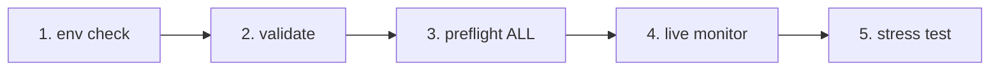

# IrsanAI TPM एजेंट फोर्ज
[🇬🇧 English](../../README.md) | [🇩🇪 Deutsch](../../README.de.md) | [🇪🇸 Español](../../docs/i18n/README.es.md) | [🇮🇹 Italiano](../../docs/i18n/README.it.md) | [🇧🇦 Bosanski](../../docs/i18n/README.bs.md) | [🇷🇺 Русский](../../docs/i18n/README.ru.md) | [🇨🇳 中文](../../docs/i18n/README.zh-CN.md) | [🇫🇷 Français](../../docs/i18n/README.fr.md) | [🇧🇷 Português (BR)](../../docs/i18n/README.pt-BR.md) | [🇮🇳 हिन्दी](../../docs/i18n/README.hi.md) | [🇹🇷 Türkçe](../../docs/i18n/README.tr.md) | [🇯🇵 日本語](../../docs/i18n/README.ja.md)

[🇬🇧 English](../../README.md) | [🇩🇪 Deutsch](../../README.de.md) | [🇪🇸 Español](./README.es.md) | [🇮🇹 Italiano](./README.it.md) | [🇧🇦 Bosanski](./README.bs.md) | [🇷🇺 Русский](./README.ru.md) | [🇨🇳 中文](./README.zh-CN.md) | [🇫🇷 Français](./README.fr.md) | [🇧🇷 Português (BR)](./README.pt-BR.md) | [🇮🇳 हिन्दी](./README.hi.md) | [🇹🇷 Türkçe](./README.tr.md) | [🇯🇵 日本語](./README.ja.md)

एक स्वायत्त मल्टी-एजेंट सेटअप (BTC, COFFEE, और अन्य) के लिए एक स्वच्छ बूटस्ट्रैप जिसमें क्रॉस-प्लेटफ़ॉर्म रनटाइम विकल्प मौजूद हैं।

## शामिल क्या है

- `production/preflight_manager.py` – Alpha Vantage के साथ विश्वसनीय मार्केट स्रोत जाँच, फॉलबैक चेन और स्थानीय कैश फॉलबैक।
- `production/tpm_agent_process.py` – सरल प्रति-मार्केट एजेंट लूप।
- `production/tpm_live_monitor.py` – लाइव BTC मॉनिटर जिसमें वैकल्पिक CSV वॉर्म-स्टार्ट और Termux नोटिफिकेशन।
- `core/tpm_scientific_validation.py` – बैकटेस्ट + सांख्यिकीय सत्यापन पाइपलाइन।
- `scripts/tpm_cli.py` – Termux/Linux/macOS/Windows के लिए एकीकृत लॉन्चर।
- `scripts/stress_test_suite.py` – फेलओवर/लेटेंसी स्ट्रेस टेस्ट।
- `scripts/start_agents.sh`, `scripts/health_monitor_v3.sh` – प्रोसेस ऑपरेशन्स के सहायक स्क्रिप्ट।
- `core/scout.py`, `core/reserve_manager.py`, `core/init_db_v2.py` – परिचालन कोर टूलिंग।

## सार्वभौमिक त्वरित शुरुआत

```bash
python scripts/tpm_cli.py env
python scripts/tpm_cli.py validate
python scripts/tpm_cli.py preflight --market ALL
python scripts/tpm_cli.py live --history-csv btc_real_24h.csv --poll-seconds 3600
```

## रनटाइम चेन चेक (कारण/ऑर्डर की सुसंगतता)

डिफ़ॉल्ट रिपोज़िटरी फ्लो जानबूझकर रैखिक है ताकि रनटाइम के दौरान छुपे हुए राज्य के बदलाव और "गलत विश्वास" से बचा जा सके।


```mermaid
flowchart LR
  A[1. env check] --> B[2. validate]
  B --> C[3. preflight ALL]
  C --> D[4. live monitor]
  D --> E[5. stress test]
```

### गेट लॉजिक (अगले चरण से पहले क्या सत्य होना चाहिए)
- **गेट 1 – पर्यावरण:** Python/प्लेटफ़ॉर्म संदर्भ सही है (`env`)।
- **गेट 2 – वैज्ञानिक सुसंगतता:** बेसलाइन मॉडल व्यवहार पुनरुत्पादित होता है (`validate`)।
- **गेट 3 – स्रोत विश्वसनीयता:** मार्केट डेटा + फॉलबैक चेन उपलब्ध है (`preflight --market ALL`)।
- **गेट 4 – रनटाइम निष्पादन:** लाइव लूप ज्ञात इनपुट इतिहास के साथ चलता है (`live`)।
- **गेट 5 – विरोधी विश्वास:** स्ट्रेस के तहत लेटेंसी/फेलओवर लक्ष्य बनें रहते हैं (`stress_test_suite.py`)।

✅ कोड में पहले से ठीक किया गया: CLI preflight अब `--market ALL` समर्थन करता है, क्विकस्टार्ट + डॉकर फ्लो के अनुरूप।

## अपना मिशन चुनें (भूमिका-आधारित CTA)

> **आप कौन हैं? अपनी श्रेणी चुनें। <60 सेकंड में शुरू करें।**

| व्यक्ति | आपकी प्राथमिकता | क्लिक पथ | पहला कमांड |
|---|---|---|---|
| 📈 **ट्रेडर** | तेज़ पल्स, क्रियाशील रनटाइम | [`tpm_live_monitor.py`](./production/tpm_live_monitor.py) | `python scripts/tpm_cli.py live --history-csv btc_real_24h.csv --poll-seconds 3600` |
| 💼 **निवेशक** | स्थिरता, स्रोत विश्वास, लचीलापन | [`preflight_manager.py`](./production/preflight_manager.py) | `python scripts/tpm_cli.py preflight --market ALL` |
| 🔬 **वैज्ञानिक** | प्रमाण, परीक्षण, सांख्यिकीय संकेत | [`tpm_scientific_validation.py`](./core/tpm_scientific_validation.py) | `python scripts/tpm_cli.py validate` |
| 🧠 **सैद्धांतिक व्यक्ति** | कारणात्मक संरचना + भविष्य की वास्तुकला | [`core/scout.py`](./core/scout.py) + [`Next Steps`](#next-steps) | `python scripts/tpm_cli.py validate` |
| 🛡️ **संदेहवादी (प्राथमिकता)** | उत्पादन से पहले मान्यताएँ तोड़ें | [`stress_test_suite.py`](./scripts/stress_test_suite.py) + [`preflight_manager.py`](./production/preflight_manager.py) | `python scripts/tpm_cli.py preflight --market ALL && python scripts/stress_test_suite.py` |
| ⚙️ **ऑपरेटर / DevOps** | अपटाइम, प्रक्रिया स्वास्थ्य, रिकवरी | [`start_agents.sh`](./scripts/start_agents.sh) + [`health_monitor_v3.sh`](./scripts/health_monitor_v3.sh) | `bash scripts/start_agents.sh` |

### संदेहवादी चुनौती (नए विज़िटर्स के लिए अनुशंसित प्रथम कदम)
यदि आप **केवल एक काम करना चाहते हैं**, तो इसे चलाएं और रिपोर्ट आउटपुट का निरीक्षण करें:

```bash
python scripts/tpm_cli.py preflight --market ALL
python scripts/stress_test_suite.py
```

अगर यह विकल्प आपको संतुष्ट करता है, तो बाकी रिपॉजिटरी भी आपके लिए सार्थक होगी।

## प्लेटफ़ॉर्म नोट्स

- **Android / Termux (Samsung, आदि)**  
  ```bash
  bash scripts/termux_bootstrap.sh
  cd ~/TPM-Agent
  python scripts/tpm_cli.py env
  python scripts/tpm_cli.py preflight --market ALL
  python scripts/tpm_cli.py live --history-csv btc_real_24h.csv --notify --vibrate-ms 1000
  ```  
  डाइरेक्ट Android (Termux) वेब UI डेमो के लिए फोर्ज रनटाइम लोकली शुरू करें:  
  ```bash
  cd ~/TPM-Agent
  bash scripts/termux_forge.sh start
  # बंद करने के लिए: bash scripts/termux_forge.sh stop
  # स्थिति देखने के लिए: bash scripts/termux_forge.sh status
  ```  
  स्क्रिप्ट ब्राउज़र अपने आप खोलती है (यदि उपलब्ध हो) और सेवा बैकग्राउंड में चलती रहती है।  
  यदि Android पर `pydantic-core`/Rust या `scipy`/Fortran बिल्ड त्रुटि देखी गई हो, तो उपयोग करें  
  `python -m pip install -r requirements-termux.txt` (Termux-सुरक्षित सेट, Rust टूलचेन आवश्यक नहीं)।  
  वेब इंटरफ़ेस में आप रनटाइम स्टार्ट/स्टॉप नियंत्रित कर सकते हैं; प्रोग्रेस बार ट्रांज़िशन स्थिति दिखाता है।  
- **iPhone (सर्वश्रेष्ठ प्रयास):** iSH / a-Shell जैसे शेल ऐप्स का उपयोग करें। Termux-विशिष्ट नोटिफिकेशन हुक वहाँ उपलब्ध नहीं हैं।  
- **Windows / Linux / macOS:** वही CLI कमांड का उपयोग करें; स्थिरता के लिए tmux/scheduler/cron से रन करें।

## डॉकर (क्रॉस-OS सबसे आसान तरीका)

डॉकर को इस क्रम में उपयोग करें (अनुमान न लगाएं):

### चरण 1: वेब रनटाइम इमेज बनाएं

```bash
docker compose build --no-cache tpm-forge-web
```

### चरण 2: वेब डैशबोर्ड सेवा शुरू करें

```bash
docker compose up tpm-forge-web
```

अब अपने ब्राउज़र में `http://localhost:8787` खोलें (**न कि** `http://0.0.0.0:8787`)। Uvicorn आंतरिक रूप से `0.0.0.0` से बाइंड करता है, लेकिन क्लाइंट को `localhost` (या होस्ट LAN IP) का इस्तेमाल करना चाहिए।

### चरण 3 (वैकल्पिक जांच): गैर-वेब सेवाओं को समझें

```bash
docker compose run --rm tpm-preflight
docker compose run --rm tpm-live
```

- `tpm-preflight` = स्रोत/कनेक्टिविटी जांच (सिर्फ CLI आउटपुट)।  
- `tpm-live` = टर्मिनल लाइव-मॉनिटर लॉग (सिर्फ CLI आउटपुट, **कोई वेब UI नहीं**)।  
- `tpm-forge-web` = FastAPI + डैशबोर्ड UI (लेआउट/प्रोग्रेस/रनटाइम कंट्रोल)।  

यदि `tpm-preflight` रिपोर्ट करता है कि `ALPHAVANTAGE_KEY not set`, तो COFFEE अभी भी फॉलबैक से काम करता है।

अगर पेज खाली दिखे:  
- API सीधे जांचें: `http://localhost:8787/api/frame`  
- FastAPI दस्तावेज़ जांचें: `http://localhost:8787/docs`  
- ब्राउज़र को हार्ड रिफ्रेश करें (`Ctrl+F5`)  
- ज़रूरत हो तो केवल वेब सेवा को पुनः प्रारंभ करें: `docker compose restart tpm-forge-web`  

बेहतर COFFEE गुणवत्ता के लिए वैकल्पिक:

```bash
export ALPHAVANTAGE_KEY="<your_key>"
docker compose run --rm tpm-preflight
```

## ग्लिच भविष्यवाणियाँ और मोबाइल अलर्ट

- Forge लाइव कॉकपिट अब प्रति-मार्केट शॉर्ट-हॉरिजन आउटलुक (`up/down/sideways`) और विश्वास स्तर के साथ `/api/markets/live` में उपलब्ध है।  
- जब किसी मार्केट ग्लिच का पता चलता है (त्वरण में अचानक तेज़ी), तो रनटाइम निम्नलिखित को ट्रिगर कर सकता है:  
  - Termux टोस्ट + वाइब्रेशन  
  - वैकल्पिक नोटिफिकेशन/बीप हुक  
  - वैकल्पिक Telegram पुश (यदि बॉट टोकन/चैट आईडी `config/config.yaml` में कॉन्फ़िगर हो)।  
- डैशबोर्ड में **Save Alerts** / **Test Alert** या API के माध्यम से विन्यास करें:  
  - `GET /api/alerts/preferences`  
  - `POST /api/alerts/preferences`  
  - `POST /api/alerts/test`  

## सत्यापन

वैज्ञानिक सत्यापन पाइपलाइन चलाएं:

```bash
python core/tpm_scientific_validation.py
```

उत्पाद:  
- `state/TPM_Scientific_Report.md`  
- `state/TPM_test_results.json`  

## स्रोत और फेलओवर

`production/preflight_manager.py` समर्थन करता है:  
- COFFEE के लिए पहले Alpha Vantage (जब `ALPHAVANTAGE_KEY` सेट हो)  
- TradingView + Yahoo फॉलबैक चेन  
- स्थानीय कैश्ड फॉलबैक `state/latest_prices.json` में  

सीधा preflight चलाएं:

```bash
export ALPHAVANTAGE_KEY="<your_key>"
python production/preflight_manager.py --market ALL
```

ऑउटेज स्ट्रेस टेस्ट चलाएं (लक्ष्य `p95 < 1000ms`):

```bash
python scripts/stress_test_suite.py
```

आउटपुट: `state/stress_test_report.json`


## लाइव स्थिति: TPM एजेंट आज क्या कर सकता है

**वर्तमान स्थिति:**  
- प्रोडक्शन फोर्ज वेब रनटाइम उपलब्ध है (`production.forge_runtime:app`)।  
- वित्तीय-पहचान प्रारंभ कॉन्फ़िगरेशन में **BTC + COFFEE** शामिल हैं।  
- लाइव फ़्रेम, एजेंट फिटनेस, ट्रांसफर एंट्रॉपी और डोमेन सारांश वेब डैशबोर्ड में दिखाई देते हैं।  
- उपयोगकर्ता रनटाइम में नए मार्केट एजेंट जोड़ सकते हैं (`POST /api/agents`)।

**लक्ष्य क्षमता (अनिवार्य):**  
- स्पष्ट स्वीकार्यता सीमाओं (precision/recall/FPR/drift) के साथ वास्तविक डेटा बेंचमार्किंग।  
- स्वत: सेफ़-मोड के लिए सख्त रिफ्लेक्सिव गवर्नेंस नियम।  
- संस्करणीय प्रति-डोमेन सीखने के लिए सामूहिक मेमोरी वर्कफ़्लो।  

**अगला विस्तार चरण:**  
- सभी एजेंट्स के लिए रेजिम-आधारित पॉलिसी ऑर्केस्ट्रेटर (ट्रेंड/शॉक/साइडवेज)।  
- एक गैर-वित्तीय डोमेन पायलट (जैसे मेडिकल या सिस्मिक) स्पष्ट डेटा कॉन्ट्रैक्ट के साथ।  


## PR मर्ज कॉन्फ्लिक्ट सहायक

- मर्ज चेकलिस्ट (GitHub कॉन्फ्लिक्ट): `docs/MERGE_CONFLICT_CHECKLIST.de.md`


### आज की सीमा: Windows + स्मार्टफोन के लिए वित्त TPM

- **Windows:** फोर्ज रनटाइम + वेब इंटरफ़ेस + Docker/PowerShell/click-start संचालित।  
- **स्मार्टफोन:** एंड्रॉइड/Termux लाइव-मॉनिटरिंग चालू; मोबाइल पर वेब UI उत्तरदायी।  
- **रियलटाइम मल्टी-एजेंट:** डिफ़ॉल्ट रूप से BTC + COFFEE सक्रिय; अतिरिक्त मार्केट वेब UI से जोड़ें।  
- **स्रोत सीमा नियम:** यदि मांगा गया मार्केट इनबिल्ट स्रोतों द्वारा कवर नहीं होता, तो स्पष्ट स्रोत URL + प्राधिकरण जानकारी दें।  

## Windows लाइव परीक्षण (दो-मार्ग प्रणाली)

### मार्ग A — डेवलपर/पावर उपयोगकर्ता (PowerShell, CMD, PyCharm, IDE)

```powershell
python -m venv .venv
.\.venv\Scripts\Activate.ps1
pip install -r requirements.txt
python scripts/tpm_cli.py forge-dashboard --open-browser --port 8787
```

### मार्ग B — कम-स्तरीय उपयोगकर्ता (क्लिक & स्टार्ट)

1. `scripts/windows_click_start.bat` पर डबल-क्लिक करें  
2. स्क्रिप्ट सबसे अच्छा उपलब्ध मार्ग ऑटो-चुनती है:  
   - Python उपलब्ध हो → venv + pip + रनटाइम  
   - अन्यथा Docker Compose (यदि उपलब्ध हो)  

तकनीकी आधार: `scripts/windows_bootstrap.ps1`।  

## फोर्ज प्रोडक्शन वेब रनटाइम (BTC + COFFEE, विस्तार योग्य)

हाँ, यह रिपोजिटरी में पहले से **शुरू हो चुका है** और अब विस्तारित हो रहा है:  

- डिफ़ॉल्ट रूप से एक वित्त TPM एजेंट **BTC** के लिए और एक **COFFEE** के लिए शुरू होता है।  
- उपयोगकर्ता सीधे वेब UI से अधिक मार्केट/एजेंट जोड़ सकते हैं (`/api/agents`)।  
- लाइव फ्रेम आउटपुट (`/api/frame`) के साथ एक परसिस्टेंट रनटाइम सेवा के रूप में चलता है।  

### शुरू करें (स्थानीय)

```bash
uvicorn production.forge_runtime:app --host 0.0.0.0 --port 8787
# http://localhost:8787 खोलें
```

### शुरू करें (Docker)

```bash
docker compose up tpm-forge-web
# http://localhost:8787 खोलें
```

## TPM प्लेग्राउंड (इंटरैक्टिव MVP)

अब आप ब्राउज़र में TPM व्यवहार इंटरैक्टिवली एक्सप्लोर कर सकते हैं:

```bash
python -m http.server 8765
# http://localhost:8765/playground/index.html खोलें
```

शामिल हैं:  
- सिंगल एजेंट कमजोर-सिग्नल एनॉमैली व्यू  
- मिनी स्वार्म (BTC/COFFEE/VOL) कंसेंसस प्रेशर  
- क्रॉस-डोमेन ट्रांसफर रेज़ोनेंस (सिंथेटिक वित्त/मौसम/स्वास्थ्य)  

देखें: `playground/README.md`।

## अगले कदम

- क्रॉस-मार्केट कारणात्मक विश्लेषण के लिए ट्रांसफर एंट्रॉपी मॉड्यूल।  
- ऐतिहासिक प्रदर्शन के आधार पर पॉलिसी अपडेट के साथ ऑप्टिमाइज़र।  
- अलर्ट चैनल (Telegram/Signal) + बूट स्थिरता।  


---

## IrsanAI गहन अवलोकन: TPM कोर जटिल प्रणालियों में "कैसे सोचता है"

### 1) दूरदर्शी परिवर्तन: ट्रेडिंग एजेंट से सार्वभौमिक TPM इकोसिस्टम तक

### IrsanAI-TPM एल्गोरिदम में क्या खास है? (सही ढांचे के साथ)

TPM कोर का कार्यानुमान:  

- जटिल, अराजक प्रणालियों में, पूर्व-चेतावनी संकेत अक्सर **माइक्रो-रिसिडुअल** में छिपे होते हैं: छोटे विचलन, कमजोर सहसंबंध, लगभग-खाली डेटा पॉइंट।  
- जहां पारंपरिक सिस्टम केवल `0` या "पर्याप्त महत्व नहीं" देखता है, TPM संदर्भ प्रवाह में **संगठित विषमताओं (ग्लिच पैटर्न)** की तलाश करता है।  
- TPM केवल मान को नहीं, बल्कि **समय के साथ संबंधों में परिवर्तन, स्रोत गुणवत्ता, रेजिम तथा कारणात्मक पड़ोस** का आकलन करता है।  

महत्वपूर्ण शुद्धता नोट: TPM भविष्य को जादू-टोना तरीके से भविष्यवाणी नहीं करता। इसका उद्देश्य **अधिक प्रारंभिक संभाव्य पहचान** है रेजिम शिफ्ट्स, ब्रेकआउट्स, और व्यवधानों का — जब डेटा गुणवत्ता और सत्यापन गेटस संतुष्ट हों।

### बड़ा सोचें: क्यों यह वित्त से परे है

यदि TPM वित्तीय उपकरणों में कमजोर प्रारंभिक पैटर्न पहचान सकता है (इंडेक्स/टिकर/ISIN-जैसे पहचानकर्ता, तरलता, माइक्रोस्ट्रक्चर), तो वही सिद्धांत कई डोमेन में सामान्यीकृत हो सकता है:  

- **इवेंट/सेंसर स्ट्रीम + संदर्भ मॉडल + एनॉमैली लेयर + फीडबैक लूप**  
- हर पेशे को "मार्केट" के रूप में मॉडल किया जा सकता है, जिसमें डोमेन-विशिष्ट विशेषताएँ, नोड्स, सहसंबंध, और विषमताएँ हों।  
- विशिष्ट TPM एजेंट डोमेनों के बीच सीख सकते हैं जबकि स्थानीय पेशेवर तर्क और नैतिकता बनाए रखते हैं।  

### 100 पेशे TPM लक्ष्य क्षेत्र के रूप में

| # | पेशा | TPM डेटा समकक्ष | विषमता/पैटर्न-डिटेक्शन लक्ष्य |
|---|---|---|---|
| 1 | पुलिस विश्लेषक | घटना लॉग, भू-कालिक अपराध मानचित्र, नेटवर्क | बढ़ते अपराध क्लस्टर के प्रारंभिक संकेत |
| 2 | अग्नि सेवा कमांडर | अलार्म चेन, सेंसर फीड, मौसम, भवन प्रोफ़ाइल | आग और खतरा प्रसार विंडो पूर्वानुमान |
| 3 | पैरामेडिक/EMS | डिस्पैच कारण, प्रतिक्रिया समय, अस्पताल लोड | विफलता से पहले क्षमता तनाव पता लगाना |
| 4 | आपातकालीन चिकित्सक | ट्रियाज फ्लो, जीवन लक्षण, प्रतीक्षा समय गतिशीलता | गंभीर बिगड़ने का जल्दी संकेत देना |
| 5 | ICU नर्स | वेंटिलेशन/प्रयोगशाला प्रवृत्तियां, दवा प्रतिक्रिया | सेप्सिस/शॉक सूक्ष्म संकेत पहचानना |
| 6 | महामारी विज्ञानी | केस दर, गतिशीलता, वेस्टवाटर/प्रयोगशाला डेटा | संचरण प्रारंभिक चेतावनी संक्रमण से पहले |
| 7 | पारिवारिक चिकित्सक | EHR पैटर्न, प्रिस्क्रिप्शंस, फ़ॉलो-अप गैप्स | दीर्घकालिक जोखिम संक्रमण जल्दी पहचानना |
| 8 | क्लिनिकल मनोवैज्ञानिक | सत्र प्रगति, भाषा संकेत, नींद/गतिविधि | वापसी/संकट संकेत जल्दी पता लगाना |
| 9 | फार्मा शोधकर्ता | यौगिक स्क्रीन, प्रतिकूल घटना प्रोफ़ाइल, जीनोमिक्स | छिपी प्रभावकारिता एवं साइड-इफ़ेक्ट क्लस्टर प्रकट करना |
| 10 | बायोटेक्नोलॉजिस्ट | अनुक्रम/प्रक्रिया/कोशिका-संस्कृति ट्रैजेक्टरीज़ | विचलन और संदूषण जोखिम पहचानना |
| 11 | जलवायु वैज्ञानिक | वायुमंडल/महासागर समय श्रृंखला, उपग्रह क्षेत्र | टिपिंग पॉइंट प्रारंभिक संकेत |
| 12 | मौसम विज्ञानी | दबाव/आर्द्रता/पवन/रडार क्षेत्र | स्थानीय अराजक मौसम बदलाव पूर्वानुमान |
| 13 | भूकंप विज्ञानी | माइक्रोक्वेक, तनाव क्षेत्र, सेंसर श्रृंखला | प्रमुख भूकंप के पूर्व संकेत पता लगाना |
| 14 | ज्वालामुखी विज्ञानी | गैस, कम्पन, विकृति समय श्रृंखला | प्रकोप संभावना विंडो सीमित करना |
| 15 | जल विज्ञानी | नदी मीटर, वर्षा, मिट्टी की नमी | फ्लैश-फ्लड और सूखा चरण परिवर्तन पता लगाना |
| 16 | महासागर विज्ञानी | धाराएँ, तापमान, लवणता, बायू स्ट्रीम | सुनामी/पर्यावरणीय विषमता पहचानना |
| 17 | ऊर्जा व्यापारी | लोड, स्पॉट प्राइस, मौसम, ग्रिड स्थिति | संभावित मूल्य/लोड ब्रेकआउट जल्दी संकेत |
| 18 | ग्रिड ऑपरेटर | ग्रिड आवृत्ति, लाइन स्थिति, स्विचिंग घटनाएं | झड़प-आधारित विफलता जोखिम पहचानना |
| 19 | विंड फार्म ऑपरेटर | टरबाइन टेलीमेट्री, पवन क्षेत्र, रख-रखाव लॉग | असफलता और प्रदर्शन विचलन भविष्यवाणी |
| 20 | सौर ऊर्जा संयंत्र ऑपरेटर | विकिरण, इन्वर्टर टेलीमेट्री, थर्मल लोड | गिरावट और उत्पादन विषमता पहचानना |
| 21 | जल उपयोगिता प्रबंधक | प्रवाह, गुणवत्ता सेंसर, उपभोग पैटर्न | संदूषण/कमी जल्दी पता लगाना |
| 22 | ट्रैफिक संचालन प्रबंधक | घनत्व, दुर्घटना, सड़क निर्माण, घटनाएँ | ट्रैफिक जाम और दुर्घटना वृद्धि पूर्वानुमान |
| 23 | रेलवे नियंत्रण प्रबंधक | टाइमटेबल पालन, ट्रैक स्थिति, विलंब श्रृंखला | प्रणालीगत विलंब श्रृंखला रोकना |
| 24 | एयर ट्रैफिक नियंत्रक | उड़ान ट्रैक, मौसम, स्लॉट संतृप्ति | टकराव पथ और बाधा क्षेत्र पहचानना |
| 25 | पोर्ट लॉजिस्टिक्स प्रबंधक | बर्थ समय, कंटेनर प्रवाह, कस्टम स्थिति | आपूर्ति व्यवधान प्रारंभिक चेतावनी |
| 26 | सप्लाई-चेन प्रबंधक | ETA, इन्वेंटरी, मांग पल्स, जोखिम घटनाएं | बुलव्हिप और स्टॉकआउट विषमताएं कम करना |
| 27 | मैन्युफैक्चरिंग लीड | OEE, प्रक्रिया टेलीमेट्री, स्क्रैप, सेटअप समय | गुणवत्ता विचलन और मशीन विषमता पहचानना |
| 28 | गुणवत्ता इंजीनियर | सहिष्णुता वितरण, प्रक्रिया संकेत | लगभग शून्य दोष प्रारंभिक चेतावनी |
| 29 | रोबोटिक्स इंजीनियर | गति ट्रैजेक्टरी, एक्ट्यूएटर लोड, नियंत्रण लूप | नियंत्रण अस्थिरता/विफलता भविष्यवाणी |
| 30 | विमानन रखरखाव इंजीनियर | इंजन/उड़ान टेलीमेट्री, रखरखाव इतिहास | पुर्जे-स्तरीय पूर्वानुमानित रखरखाव |
| 31 | निर्माण प्रबंधक | प्रगति, मौसम, आपूर्ति तिथियाँ, IoT सेंसर | समय-सारणी/लागत विषमता जोखिम मापन |
| 32 | संरचनात्मक इंजीनियर | लोड, कम्पन, थकावट/बुढ़ापा संकेतक | संरचनात्मक-गंभीर संक्रमण पता लगाना |
| 33 | शहरी योजनाकार | गतिशीलता, जनसांख्यिकी, उत्सर्जन, भूमि उपयोग | उभरते शहरी तनाव पैटर्न पहचानना |
| 34 | वास्तुकार | भवन परिचालन, अधिभोग, ऊर्जा वक्र | डिज़ाइन-उपयोग असंगति पैटर्न पहचानना |
| 35 | किसान | मिट्टी/मौसम/फसल/मार्केट स्ट्रीम | रोग/उत्पादन विषमता जल्दी पहचानना |
| 36 | एग्रोनॉमिस्ट | उपग्रह पोषण/जल स्तर डेटा | सटीक हस्तक्षेप लक्ष्यित करना |
| 37 | वन प्रबंधक | नमी, कीट पैटर्न, आग संकेतक | वनों का नुकसान/आग विंडो जल्दी पहचानना |
| 38 | मत्स्य प्रबंधक | पकड़ रिकॉर्ड, जल गुणवत्ता, प्रवासन | अति-मत्स्य पालन/पतन जोखिम पहचानना |
| 39 | खाद्य सुरक्षा निरीक्षक | प्रयोगशाला निष्कर्ष, ठंडा-चेन लॉग, आपूर्ति लिंक | संदूषण श्रृंखला जल्दी रोकना |
| 40 | कार्यकारी शेफ | मांग पल्स, स्टॉक स्वास्थ्य, अपशिष्ट अनुपात | खराबी और कमी विषमता कम करना |
| 41 | रिटेल ऑपरेटर | POS स्ट्रीम, फुटफॉल, इन्वेंटरी रोटेशन | मांग उछाल और नुकसान पैटर्न पहचानना |
| 42 | ई-कॉमर्स प्रबंधक | क्लिकस्ट्रीम, कार्ट यात्रा, रिटर्न | धोखाधड़ी/छूट प्रारंभिक पैटर्न पहचानना |
| 43 | मार्केटिंग विश्लेषक | अभियान मीट्रिक, सेगमेंट प्रतिक्रिया वक्र | माइक्रो-ट्रेंड मुख्यधारा से पहले पहचानना |
| 44 | सेल्स लीड | पाइपलाइन वेग, टचपॉइंट ग्राफ | डील जोखिम और समय के अवसर पहचानना |
| 45 | ग्राहक समर्थन लीड | टिकट प्रवाह, विषय क्लस्टर, SLA विचलन | वृद्धि/मूल कारण तरंगें पहचानना |
| 46 | उत्पाद प्रबंधक | फीचर अपनाना, रिटेंशन, फीडबैक | उत्पाद-बाजार असंगति जल्दी पहचानना |
| 47 | UX शोधकर्ता | हीटमैप्स, पाथिंग, ड्रॉप-ऑफ पॉइंट | छुपी इंटरैक्शन अटकन उजागर करना |
| 48 | सॉफ्टवेयर इंजीनियर | लॉग, ट्रेस, डिप्लॉय मीट्रिक | पूर्व-दुर्घटना दोष श्रृंखलाएं पता लगाना |
| 49 | साइट विश्वसनीयता इंजीनियर | लेटेंसी, त्रुटि बजट, संतृप्ति | आउटेज से पहले गिरावट पकड़ना |
| 50 | साइबरसुरक्षा विश्लेषक | नेटवर्क प्रवाह, IAM घटनाएं, SIEM अलर्ट | आक्रमण पथ और स्थानिक गतिविधि पहचानना |
| 51 | धोखाधड़ी विश्लेषक | लेन-देन ग्राफ, डिवाइस फिंगरप्रिंट | कमजोर-सिग्नल क्षेत्र में धोखाधड़ी पहचानना |
| 52 | बैंक जोखिम प्रबंधक | पोर्टफोलियो/मैक्रो/तरलता जोखिम | तनाव रेजिम और सांद्रता जोखिम पहचानना |
| 53 | बीमा मूर्तिकार | दावा प्रवाह, जोखिम मैप, जलवायु लिंक | दावा लहरें और आरक्षित तनाव पूर्वानुमान |
| 54 | कर सलाहकार | लेजर पैटर्न, फाइलिंग टाइमलाइन | अनुपालन जोखिम और अनुकूलन पथ पहचानना |
| 55 | लेखा परीक्षक | नियंत्रण ट्रेल, अपवाद पैटर्न | बड़े स्तर पर लेखांकन विषमता पता लगाना |
| 56 | वकील | केस कालक्रम, मिसाल ग्राफ, डेडलाइन | मुकदमेबाजी जोखिम और परिणाम पैटर्न पहचानना |
| 57 | न्यायाधीश/कोर्ट प्रशासक | कार्यभार मिश्रण, चक्र समय | न्याय प्रणाली बाधाएं पहचानना |
| 58 | सुधार प्रबंधक | अधिभोग, घटनाक्रम नेटवर्क, व्यवहार प्रवृत्ति | हिंसा/पुनरावृत्ति क्लस्टर पहचानना |
| 59 | सीमा शुल्क अधिकारी | व्यापार मैनिफेस्ट, घोषणाएं, मार्ग पैटर्न | तस्करी/चालाकी संकेत पहचानना |
| 60 | रक्षा खुफिया विश्लेषक | ISR फ़ीड, लॉजिस्टिक्स, परिचालन गति | बढ़ोतरी गतिकी जल्दी पहचानना |
| 61 | राजनयिक विश्लेषक | घटना श्रृंखलाएं, संचार संकेत | भू-राजनीतिक रेजिम शिफ्ट पहचानना |
| 62 | शिक्षक | शिक्षण प्रगति, उपस्थिति, जुड़ाव | ड्रॉपआउट जोखिम और सहायता आवश्यक पहचानना |
| 63 | स्कूल प्रिंसिपल | प्रदर्शन क्लस्टर, उपस्थिति, संसाधन | प्रणालीगत स्कूल तनाव पैटर्न पहचानना |
| 64 | विश्वविद्यालय व्याख्याता | कोर्स गतिविधि, वापस लेना, फीडबैक | छात्र सफलता जल्दी स्थिर करना |
| 65 | शिक्षा शोधकर्ता | समूह ट्रैजेक्टरीज, शिक्षण चर | मजबूत हस्तक्षेप प्रभाव पहचानना |
| 66 | सामाजिक कार्यकर्ता | केस नेटवर्क, नियुक्तियां, जोखिम संकेत | संकट वृद्धि मार्ग पहचानना |
| 67 | NGO समन्वयक | क्षेत्र रिपोर्ट, सहायता प्रवाह, आवश्यकता संकेत | प्रभाव अंतर और हॉटस्पॉट परिवर्तन पहचानना |
| 68 | रोजगार सलाहकार | कौशल प्रोफ़ाइल, श्रम मांग, संक्रमण | मेलबेस मिसमैच और अपस्किलिंग आवश्यकताएं पहचानना |
| 69 | HR प्रबंधक | भर्ती/छुट्टी/प्रदर्शन ट्रैजेक्टरीज | बर्नआउट और प्रतिधारण जोखिम जल्द पहचानना |
| 70 | भर्तीकर्ता | फ़नल दरें, कौशल टैक्सोनॉमी, बाजार पल्स | फिट जोखिम और भर्ती अवसर विंडो पहचानना |
| 71 | संगठन सलाहकार | निर्णय ताल, KPI विचलन, नेटवर्क पैटर्न | टीम विफलता जल्दी पहचानना |
| 72 | परियोजना प्रबंधक | मील के पत्थर, आश्रित, अवरोध ग्राफ | अनुसूची/व्याप्ति विफलता पूर्वानुमान |
| 73 | पत्रकार | स्रोत विश्वसनीयता ग्राफ, घटना स्ट्रीम | गलत सूचना क्लस्टर जल्दी पहचानना |
| 74 | जांच रिपोर्टर | दस्तावेज़ नेटवर्क, धन/संचार निशान | छिपी प्रणालीगत विषमताएँ उजागर करना |
| 75 | सामग्री मॉडरेटर | पोस्ट/टिप्पणी स्ट्रीम, भाषाई बदलाव | दुरुपयोग/कट्टरता तरंग frühzeitig पहचानना |
| 76 | कलाकार | दर्शक प्रतिक्रिया ट्रैजेक्टरीज, शैली वेक्टर | उभरती सौंदर्यशास्त्र पहचानना |
| 77 | संगीत निर्माता | सुनने की विशेषताएं, व्यवस्थित वेक्टर | प्रबोधन/विशिष्ट संभावनाएं जल्दी पहचानना |
| 78 | गेम डिजाइनर | टेलीमेट्री, प्रगति, छूट वक्र | हताशा और संतुलन विषमताएं पहचानना |
| 79 | खेल कोच | प्रदर्शन/बायोमेट्रिक लोड स्ट्रीम | चोट/फॉर्म गिरावट प्रारंभिक संकेत |
| 80 | एथलेटिक ट्रेनर | गति/पुनर्प्राप्ति संकेतक | डाउनटाइम से पहले अधिभार पहचानना |
| 81 | खेल चिकित्सक | निदान, पुनर्वसन लोड, पुनरावृत्ति जोखिम | खेल में वापसी के लिए अनुकूलन |
| 82 | रेफरी विश्लेषक | निर्णय स्ट्रीम, ताल, घटना संदर्भ | स्थिरता/न्याय विचलन पहचानना |
| 83 | इवेंट प्रबंधक | टिकटिंग, गतिशीलता, मौसम, सुरक्षा फ़ीड | भीड़ और सुरक्षा जोखिम वृद्धि पहचानना |
| 84 | पर्यटन प्रबंधक | बुकिंग पैटर्न, प्रतिष्ठा संकेत | मांग और भावना बदलाव पहचानना |
| 85 | होटल प्रबंधक | अधिभोग, सेवा गुणवत्ता, शिकायतें | गुणवत्ता-मांग अस्थिरता जल्दी पहचानना |
| 86 | संपत्ति प्रबंधक | किराया प्रवाह, रखरखाव, बाजार तुलनाएं | रिक्तता/डिफ़ॉल्ट जोखिम जल्दी पहचानना |
| 87 | सुविधा प्रबंधक | भवन IoT, ऊर्जा, रखरखाव अंतराल | विफलता और अक्षमता पैटर्न पहचानना |
| 88 | कचरा प्रबंधन ऑपरेटर | कचरा प्रवाह, मार्ग, पर्यावरण मीट्रिक | अवैध डंपिंग और प्रक्रिया अंतराल पता लगाना |
| 89 | पर्यावरण निरीक्षक | उत्सर्जन, रिपोर्ट, उपग्रह ओवरले | अनुपालन उल्लंघन और टिपिंग जोखिम पहचानना |
| 90 | सर्कुलर इकोनॉमी विश्लेषक | सामग्री पासपोर्ट, रिकवरी दर | रिसाव और लूप-समापन अवसर पहचानना |
| 91 | खगोल वैज्ञानिक | दूरबीन स्ट्रीम, स्पेक्ट्रा, शोर मॉडल | दुर्लभ ब्रह्मांडीय घटनाओं का पता लगाना |
| 92 | अंतरिक्ष संचालन इंजीनियर | टेलीमेट्री, कक्षा पैरामीटर, सिस्टम डायग्नोस्टिक्स | मिशन-गंभीर विषमताओं का शीघ्र पता लगाना |
| 93 | क्वांटम इंजीनियर | शोर प्रोफ़ाइल, कैलिब्रेशन विचलन, गेट त्रुटियां | डिकोहेरेंस और नियंत्रण विचलन पहचानना |
| 94 | डेटा वैज्ञानिक | फ़ीचर विचलन, मॉडल गुणवत्ता, डेटा अखंडता | मॉडल पतन और पूर्वाग्रह विचलन पहचानना |
| 95 | AI नीतिशास्त्री | निर्णय परिणाम, निष्पक्षता मीट्रिक्स | अनुचित पैटर्न/शासन अंतराल पहचानना |
| 96 | विज्ञान दर्शन शोधकर्ता | सिद्धांत-साक्ष्य मार्ग | पैराडाइम असंगति संकेत पहचानना |
| 97 | गणितज्ञ | अवशिष्ट संरचनाएं, अपरिवर्तनीय, त्रुटि पद | छिपी नियमितताएं/अपवाद वर्ग पहचानना |
| 98 | प्रणाली सिद्धांतकार | नोड-एज गतिशीलता, फीडबैक विलंब | नेटवर्क टिपिंग गतिकी पहचानना |
| 99 | मानव विज्ञानी | क्षेत्र अवलोकन, भाषा/सामाजिक नेटवर्क | सांस्कृतिक बदलाव संघर्ष प्रारंभिक संकेत |
| 100 | पूर्वदृष्टि रणनीतिकार | तकनीकी वक्र, विनियमन, व्यवहार डेटा | परिदृश्यों को प्रारंभिक संकेतकों से जोड़ना |

### देश-फिट नोट्स (पेशा समानता विभिन्न न्याय क्षेत्रों में)

सूची को क्षेत्रीय रूप से तार्किक बनाए रखने के लिए, TPM भूमिका-मैपिंग को **कार्यात्मक समकक्ष** के रूप में समझा जाना चाहिए, न कि शाब्दिक नौकरी शीर्षक अनुवाद के रूप में:  

- **जर्मनी ↔ US/UK:** `Polizei` बनाम विभाजित कार्य (`Police Department`, `Sheriff`, `State Trooper`) और अभियोजन में भिन्नता (`Staatsanwaltschaft` बनाम `District Attorney/Crown Prosecution`)।  
- **स्पेन / इटली:** नागरिक-न्याय संरचनाएं अलग-अलग अदालत और पुलिस प्रवाह के साथ; डेटा पाइपलाइनों में अक्सर क्षेत्रीय और राष्ट्रीय विभाजन।  
- **बोस्निया और हर्जेगोविना:** बहु-इकाई शासन के कारण डेटा स्वामित्व खंडित; TPM को संघीय विषमता फ्यूज़न से लाभ।  
- **रूस / चीन:** भूमिका परिभाषाएँ और डेटा-शासन सीमाएं भिन्न; TPM को स्थानीय अनुपालन सीमाओं और संस्थागत समकक्ष के अनुसार सेट करें।  
- **अतिरिक्त प्रभावी क्षेत्र:** फ्रांस, ब्राज़ील, भारत, जापान, MENA राज्यों, और उप-सहारा अफ्रीका को समकक्ष कार्यों और उपलब्ध टेलीमेट्री मैपिंग द्वारा ऑनबोर्ड किया जा सकता है।  

### दार्शनिक-सांवैज्ञानिक दृष्टिकोण

- उपकरण से **ज्ञानमूलक अवसंरचना** तक: डोमेन्स "कमजोर प्रारंभिक ज्ञान" को संचालित करते हैं।  
- पृथक प्रणालियों से **एजेंट संघ** तक: स्थानीय नैतिकताएँ + साझा विषमता व्याकरण।  
- प्रतिक्रियाशील प्रतिक्रिया से **प्री-चेतावनी शासन** तक: देर से संकट नियंत्रण के बजाय रोकथाम।  
- स्थैतिक मॉडलों से **जीवित सिद्धांतों** तक: वास्तविक दुनिया के झटकों के तहत निरंतर पुनर्संतुलन।  

मुख्य विचार: जिम्मेदार TPM क्लस्टर अराजकता को नियंत्रित नहीं कर सकता — लेकिन यह संस्थाओं को जल्दी समझने, बेहतर दिशा देने और अधिक मानवीय निर्णय लेने में सहायता कर सकता है।

## बहुभाषी विस्तार (प्रगति में)

क्रॉस-भाषाई तालमेल के लिए स्थानीयकृत रणनीतिक अवलोकन उपलब्ध हैं:  

- स्पेनिश (`docs/i18n/README.es.md`)  
- इटालियन (`docs/i18n/README.it.md`)  
- बोस्नियाई (`docs/i18n/README.bs.md`)  
- रूसी (`docs/i18n/README.ru.md`)  
- चीनी सरल (Simplified) (`docs/i18n/README.zh-CN.md`)  
- फ्रेंच (`docs/i18n/README.fr.md`)  
- पुर्तगाली ब्राज़ील (`docs/i18n/README.pt-BR.md`)  
- हिंदी (`docs/i18n/README.hi.md`)  
- तुर्की (`docs/i18n/README.tr.md`)  
- जापानी (`docs/i18n/README.ja.md`)  

प्रत्येक स्थानीयकृत फ़ाइल में क्षेत्र-फिट नोट्स शामिल हैं और इस मूल अंग्रेज़ी अनुभाग को 100-पेशा मैट्रिक्स के लिए लिंक करती हैं।

## IrsanAI गुणवत्ता मेटा (SOLL बनाम IST)

रिपॉजिटरी की वर्तमान परिपक्वता, गुणवत्ता की स्थिति और यथार्थ उपयोगकर्ता अपेक्षाओं पर आधारित कारणात्मक रोडमैप के लिए देखें:  

- `docs/IRSANAI_QUALITY_META.md`  

यह दस्तावेज अब संदर्भ है:  
- फ़ीचर की मांग स्तर (UX/UI + परिचालन मजबूती),  
- Docker/Android समानता आवश्यकताएँ,  
- साथ ही आगामी PR के लिए स्वीकार्यता-गुणवत्ता गेट।  

## i18n समता मोड (पूर्ण दर्पण)

सुनिश्चित करने के लिए कि कोई भाषा समुदाय असंतुष्ट न हो, i18n फ़ाइलें अब `README.md` के साथ पूर्ण canonical समता में रखी जाती हैं।

सिंक कमांड:

```bash
python scripts/i18n_full_mirror_sync.py
```

## डेवलपर के लिए सूचक (LOP – खुले मुद्दों की सूची)

मेरी दृष्टि से अभी खुला क्या है (तकनीकी रूप से अवरुद्ध नहीं):  

| मुद्दा | वर्तमान स्थिति | उपयुक्त सुझाव |
|---|---|---|
| **ट्रांसफर-एंट्रॉपी मॉड्यूल क्रॉस-मार्केट कारणात्मकता के लिए** | **संपन्न ✅** – `TransferEntropyEngine` के रूप में कार्यान्वित और फोर्ज ऑर्केस्ट्रेटर में जोड़ा गया। | डोमेन-विशिष्ट थ्रेसहोल्ड और व्याख्या नियम जोड़ें। |
| **इतिहास-आधारित ऑप्टिमाइज़र/पॉलिसी अपडेट** | **संपन्न ✅** – फिटनेस स्कोरिंग, रिवार्ड अपडेट और उम्मीदवार छंटनी टिक चक्र में चलते हैं। | संचालन मोड डोक्युमेंट करें (रूढ़िवादी/आक्रामक) और शासन प्रोफाइल के रूप में परखें। |
| **अलर्टिंग (Telegram/Signal)** | **आंशिक पूरा 🟡** – इंफ्रास्ट्रक्चर है, डिफ़ॉल्ट रूप से निष्क्रिय। | अलार्म नीति स्थापित करें: कौनसा घटना, गंभीरता, चैनल, कौन जवाबदेह। |
| **बूट-पर्सिस्टेंस / दीर्घकालिक संचालन** | **आंशिक पूरा 🟡** – tmux द्वारा स्टार्ट और हेल्थ मॉनिटरिंग मौजूद, पर सभी प्लेटफार्म के लिए एकीकृत बूट-रनबुक नहीं। | प्लेटफ़ॉर्म प्रोफ़ाइल (Termux/Linux/Docker) जोड़ें जिसमें बूट पर स्टार्ट, रिस्टार्ट नीति, और त्वरित मदद शामिल हो। |
| **समन्वित मेटा-लेयर (अगले विस्तार से)** | **आंशिक पूरा 🟡** – कुछ तत्व मौजूद (ऑर्केस्ट्रेटर + एंट्रॉपी + रिवार्ड), पर पूरा रेजिम-पॉलिसी ऑर्केस्ट्रेटर नहीं। | एजेंट भार के लिए स्पष्ट ट्रेंड/शॉक/साइडवेज पॉलिसी मॉडल जोड़ें। |
| **सामूहिक मेमोरी (संस्करित सीखने का पैटर्न संग्रह)** | **खुला 🔴** – विज़न में उल्लिखित, पर कोई स्पष्ट संग्राहण और समीक्षा प्रक्रिया नहीं। | सीखने के पैटर्न फॉर्मेट, संस्करण लॉजिक, और मान्यता मानक परिभाषित करें। |
| **रिफ्लेक्सिव गवर्नेंस (अनिश्चितता पर स्वचालित रूढ़िवादी मोड)** | **खुला 🔴** – लक्ष्य के रूप में चिन्हित, पर निर्णय नियम के रूप में नहीं। | अनिश्चितता संकेतक और सख्त स्विचिंग शर्तों को शासन नियमों में शामिल करें। |
| **वित्त/मौसम से परे डोमेन विस्तार** | **खुला 🔴** – अन्य डोमेन विज़न/टेम्पलेट में, पर उत्पादक डेटा अनुबंधों में नहीं। | अगला डोमेन पायलट (जैसे मेडिकल या सिस्मिक) स्पष्ट मेट्रिक्स और डेटा स्रोत के साथ शुरू करें। |
| **व्यावहारिक डेटा पर वैज्ञानिक प्रमाण विस्तार** | **खुला 🔴** – मौजूदा सत्यापन मजबूत है, पर सिंथेटिक रेजिम-सेगमेंट आधारित। | स्थिर स्वीकार्यता मानकों (Precision/Recall/FPR/Drift) के साथ असली डेटा बैचमार्किंग जोड़ें। |
| **भाषा पार अनुक्रिया / i18n विस्तार** | **आंशिक पूरा 🟡** – कई भाषाई लैंडिंग पृष्ठ मौजूद; विस्तार 'प्रगति में' चिह्नित। | समन्वय प्रक्रिया परिभाषित करें (कब मेन README से परिवर्तन सभी i18n में प्रसारित हों)। |

संक्षेप: पूर्व के "अगले कदम" **तकनीकी रूप से बड़े हिस्से में शुरू या पूरा हो चुके हैं**; अब सबसे बड़ा फोकस **प्रारंभिक कार्यान्वयन** (शासन, नीतियाँ, डोमेन लॉजिक, व्यावहारिक डेटा प्रमाण) और **संगत दस्तावेज़/i18n संचालन** पर है।

### LOP क्रियान्वयन योजना

कार्यान्वयन क्रम, पूर्णता मानदंड और साक्ष्य गेट के लिए देखें:

- `docs/LOP_EXECUTION_PLAN.md`

## LOP (अंतिम नोट – प्राथमिकता क्रम)

1. **P1 व्यावहारिक डेटा प्रमाण बढ़ाना:** सुसंगत मानक के तहत बैचमार्किंग (Precision/Recall/FPR/Drift)।  
2. **P2 रिफ्लेक्सिव गवर्नेंस अंतिम रूप देना:** अनिश्चितता पर सख्त सेफ़-मोड नियम।  
3. **P3 सामूहिक मेमोरी मानकीकरण:** संस्करण सुरक्षित सीखने का पैटर्न और समीक्षा प्रक्रिया प्रति डोमेन।  
4. **P4 वेब-इमर्सन का विस्तार:** नए उत्तरदायी लेआउट आधारित TPM उद्योगों के लिए भूमिका दृश्य।  

**प्लेटफॉर्म नोट:** वर्तमान में मुख्यतः **Windows + स्मार्टफोन** केंद्रित। **LOP के अंत में अतिरिक्त** macOS, Linux और अन्य प्लेटफ़ॉर्म प्रोफ़ाइल शामिल किए जाएंगे।