# IrsanAI TPM Agent Forge

[🇬🇧 English](../../README.md) | [🇩🇪 Deutsch](../../README.de.md) | [🇪🇸 Español](./README.es.md) | [🇮🇹 Italiano](./README.it.md) | [🇧🇦 Bosanski](./README.bs.md) | [🇷🇺 Русский](./README.ru.md) | [🇨🇳 中文](./README.zh-CN.md) | [🇫🇷 Français](./README.fr.md) | [🇧🇷 Português (BR)](./README.pt-BR.md) | [🇮🇳 हिन्दी](./README.hi.md) | [🇹🇷 Türkçe](./README.tr.md) | [🇯🇵 日本語](./README.ja.md)

स्वायत्त मल्टी-एजेंट सेटअप (BTC, COFFEE और अधिक) के लिए एक साफ़ बूटस्ट्रैप, जिसमें क्रॉस-प्लेटफ़ॉर्म रनटाइम विकल्प शामिल हैं।

## क्या शामिल है

- `production/preflight_manager.py` – resilient market source probing with Alpha Vantage + fallback chain and local cache fallback.
- `production/tpm_agent_process.py` – simple per-market agent loop.
- `production/tpm_live_monitor.py` – live BTC monitor with optional CSV warm-start and Termux notifications.
- `core/tpm_scientific_validation.py` – backtest + statistical validation pipeline.
- `scripts/tpm_cli.py` – unified launcher for Termux/Linux/macOS/Windows.
- `scripts/stress_test_suite.py` – failover/latency stress test.
- `scripts/start_agents.sh`, `scripts/health_monitor_v3.sh` – process ops helpers.
- `core/scout.py`, `core/reserve_manager.py`, `core/init_db_v2.py` – operational core tooling.

## यूनिवर्सल क्विकस्टार्ट

```bash
python scripts/tpm_cli.py env
python scripts/tpm_cli.py validate
python scripts/tpm_cli.py preflight --market ALL
python scripts/tpm_cli.py live --history-csv btc_real_24h.csv --poll-seconds 3600
```

## रनटाइम चेन जाँच (कारण/क्रम की संगति)

रिपॉज़िटरी का डिफ़ॉल्ट फ्लो जानबूझकर रेखीय रखा गया है ताकि लाइव रन के दौरान छिपी स्टेट ड्रिफ्ट और "झूठे आत्मविश्वास" से बचा जा सके।

```mermaid
flowchart LR
  A[1. एनव जांच] --> B[2. वैलिडेट]
  B --> C[3. preflight ALL]
  C --> D[4. लाइव मॉनिटर]
  D --> E[5. स्ट्रेस टेस्ट]
```



### गेट लॉजिक (अगले चरण से पहले क्या सही होना चाहिए)
- **Gate 1 – वातावरण:** Python/प्लेटफ़ॉर्म संदर्भ सही है (`env`)।
- **Gate 2 – वैज्ञानिक सुदृढ़ता:** बेसलाइन मॉडल व्यवहार पुनरुत्पादित हो सकता है (`validate`)।
- **Gate 3 – स्रोत विश्वसनीयता:** मार्केट डेटा + fallback chain उपलब्ध हैं (`preflight --market ALL`)।
- **Gate 4 – रनटाइम निष्पादन:** live लूप ज्ञात इनपुट हिस्ट्री के साथ चलता है (`live`)।
- **Gate 5 – एडवर्सेरियल भरोसा:** latency/failover लक्ष्य स्ट्रेस में टिकते हैं (`stress_test_suite.py`)।

✅ कोड में पहले से ठीक: CLI preflight अब `--market ALL` सपोर्ट करता है, quickstart + docker फ्लो के अनुरूप।

## अपना मिशन चुनें (भूमिका-आधारित CTA)

> **क्या आप X हैं? अपनी लेन चुनें। <60 सेकंड में शुरू करें।**

| पर्सोना | आपकी प्राथमिकता | पाथ | पहला कमांड |
|---|---|---|---|
| 📈 **Trader** | Fast pulse, actionable runtime | [`tpm_live_monitor.py`](./production/tpm_live_monitor.py) | `python scripts/tpm_cli.py live --history-csv btc_real_24h.csv --poll-seconds 3600` |
| 💼 **Investor** | Stability, source trust, resilience | [`preflight_manager.py`](./production/preflight_manager.py) | `python scripts/tpm_cli.py preflight --market ALL` |
| 🔬 **Scientist** | Evidence, tests, statistical signal | [`tpm_scientific_validation.py`](./core/tpm_scientific_validation.py) | `python scripts/tpm_cli.py validate` |
| 🧠 **Theoretician** | Causal structure + future architecture | [`core/scout.py`](./core/scout.py) + [`अगले कदम`](#अगले-कदम) | `python scripts/tpm_cli.py validate` |
| 🛡️ **Skeptic (priority)** | Break assumptions before production | [`stress_test_suite.py`](./scripts/stress_test_suite.py) + [`preflight_manager.py`](./production/preflight_manager.py) | `python scripts/tpm_cli.py preflight --market ALL && python scripts/stress_test_suite.py` |
| ⚙️ **Operator / DevOps** | Uptime, process health, recoverability | [`start_agents.sh`](./scripts/start_agents.sh) + [`health_monitor_v3.sh`](./scripts/health_monitor_v3.sh) | `bash scripts/start_agents.sh` |

### स्केप्टिक चैलेंज (नए विज़िटर्स के लिए पहले अनुशंसित)
अगर आप **सिर्फ एक काम** करें, तो इसे चलाएँ और रिपोर्ट आउटपुट देखें:

```bash
python scripts/tpm_cli.py preflight --market ALL
python scripts/stress_test_suite.py
```

अगर यह लेन आपको आश्वस्त करती है, तो रिपॉज़िटरी का बाकी हिस्सा भी आपको उपयोगी लगेगा।

## प्लेटफ़ॉर्म नोट्स

- **Android / Termux (Samsung आदि)**
  ```bash
  pkg install termux-api -y
  python scripts/tpm_cli.py live --history-csv btc_real_24h.csv --notify --vibrate-ms 1000
  ```
- **iPhone (best effort):** iSH / a-Shell जैसे shell ऐप्स का उपयोग करें। Termux-विशिष्ट notification hooks वहाँ उपलब्ध नहीं हैं।
- **Windows / Linux / macOS**: वही CLI कमांड्स उपयोग करें; निरंतरता के लिए tmux/scheduler/cron से चलाएँ।

## Docker (क्रॉस-ओएस सबसे आसान मार्ग)

```bash
docker compose run --rm tpm-preflight
docker compose run --rm tpm-live
```

COFFEE स्रोत गुणवत्ता सुधार के लिए वैकल्पिक:

```bash
export ALPHAVANTAGE_KEY="<your_key>"
docker compose run --rm tpm-preflight
```

## वैलिडेशन

वैज्ञानिक वैलिडेशन पाइपलाइन चलाएँ:

```bash
python core/tpm_scientific_validation.py
```

Artifacts:
- `state/TPM_Scientific_Report.md`
- `state/TPM_test_results.json`

## स्रोत और फेलओवर

`production/preflight_manager.py` supports:
- Alpha Vantage first for COFFEE (when `ALPHAVANTAGE_KEY` is set)
- TradingView + Yahoo fallback chain
- local cached fallback in `state/latest_prices.json`

Run preflight directly:

```bash
export ALPHAVANTAGE_KEY="<your_key>"
python production/preflight_manager.py --market ALL
```

Run outage stress test (target `p95 < 1000ms`):

```bash
python scripts/stress_test_suite.py
```

Output: `state/stress_test_report.json`


## TPM प्लेग्राउंड (इंटरैक्टिव MVP)

अब आप ब्राउज़र में TPM व्यवहार को इंटरैक्टिव तरीके से देख सकते हैं:

```bash
python -m http.server 8765
# open http://localhost:8765/playground/index.html
```

इसमें शामिल है:
- सिंगल एजेंट कमजोर-सिग्नल एनॉमली व्यू
- मिनी स्वार्म (BTC/COFFEE/VOL) कंसेंसस दबाव
- क्रॉस-डोमेन ट्रांसफर रेज़ोनेंस (सिंथेटिक: फाइनेंस/मौसम/हेल्थ)

See: `playground/README.md`.
## अगले कदम

- क्रॉस-मार्केट कारणात्मक विश्लेषण के लिए ट्रांसफर-एंट्रॉपी मॉड्यूल।
- ऐतिहासिक प्रदर्शन के आधार पर policy अपडेट वाला ऑप्टिमाइज़र।
- Alert channels (Telegram/Signal) + boot persistence.


---

## IrsanAI डीप डाइव: जटिल सिस्टम में TPM कोर कैसे "सोचता" है

### 1) विज़नरी रूपांतरण: ट्रेडिंग एजेंट से यूनिवर्सल TPM इकोसिस्टम तक

### IrsanAI-TPM एल्गोरिद्म को क्या विशिष्ट बनाता है? (सुधारित फ्रेमिंग)

TPM कोर की कार्यपरक परिकल्पना:

- जटिल और कैओटिक सिस्टम में early-warning संकेत अक्सर **micro-residual** में छिपे होते हैं: सूक्ष्म विचलन, कमजोर सहसंबंध, लगभग-खाली डेटा पॉइंट्स।
- जहाँ पारंपरिक सिस्टम केवल `0` या "पर्याप्त प्रासंगिकता नहीं" देखते हैं, TPM संदर्भ प्रवाह में **संरचित एनॉमलीज़** (glitch patterns) खोजता है।
- TPM केवल मान को नहीं, बल्कि **समय के साथ संबंधों का परिवर्तन, स्रोत गुणवत्ता, रेजीम और causal neighborhood** भी आकलित करता है।

महत्वपूर्ण स्पष्टता: TPM भविष्य की **जादुई** भविष्यवाणी नहीं करता। इसका लक्ष्य डेटा गुणवत्ता और validation gates पूरे होने पर रेजीम बदलाव, ब्रेकआउट और व्यवधान की **पहले से संभाव्य पहचान** है।

### बड़ा सोचें: यह वित्त से आगे क्यों जाता है

यदि TPM वित्तीय साधनों (index/ticker/ISIN जैसे पहचानकर्ता, liquidity, microstructure) में कमजोर अग्रसूचक पैटर्न पकड़ सकता है, तो यही सिद्धांत कई डोमेन्स में सामान्यीकृत हो सकता है:

- **Event/sensor stream + context model + anomaly layer + feedback loop**
- प्रत्येक पेशे को डोमेन-विशिष्ट फीचर्स, नोड्स, सहसंबंध और एनॉमलीज़ वाले "मार्केट" की तरह मॉडल किया जा सकता है
- विशेषीकृत TPM एजेंट डोमेन्स के बीच सीख सकते हैं, जबकि स्थानीय पेशेवर लॉजिक और एथिक्स बनाए रखते हैं

### TPM लक्ष्य-क्षेत्र के रूप में 100 पेशे

| # | पेशा | TPM डेटा अनुरूप | एनॉमली/पैटर्न डिटेक्शन लक्ष्य |
|---|---|---|---|
| 1 | Police analyst | Incident logs, geotemporal crime maps, networks | Early signals of escalating crime clusters |
| 2 | Fire service commander | Alarm chains, sensor feeds, weather, building profiles | Predict fire and hazard propagation windows |
| 3 | Paramedic/EMS | Dispatch reasons, response times, hospital load | Detect capacity stress before breakdown |
| 4 | Emergency physician | Triage flows, vitals, waiting-time dynamics | Flag critical decompensation earlier |
| 5 | ICU nurse | Ventilation/lab trends, medication responses | Identify sepsis/shock micro-signals |
| 6 | Epidemiologist | Case rates, mobility, wastewater/lab data | Outbreak early warning before exponential phase |
| 7 | Family physician | EHR patterns, prescriptions, follow-up gaps | Detect chronic-risk transitions early |
| 8 | Clinical psychologist | Session trajectories, language markers, sleep/activity | Detect relapse/crisis indicators sooner |
| 9 | Pharma researcher | Compound screens, adverse-event profiles, genomics | Reveal hidden efficacy and side-effect clusters |
| 10 | Biotechnologist | Sequence/process/cell-culture trajectories | Detect drift and contamination risk |
| 11 | Climate scientist | Atmosphere/ocean time series, satellite fields | Identify tipping-point precursors |
| 12 | Meteorologist | Pressure/humidity/wind/radar fields | Anticipate local chaotic weather shifts |
| 13 | Seismologist | Microquakes, stress fields, sensor arrays | Detect precursors to major releases |
| 14 | Volcanologist | Gas, tremor, deformation time series | Narrow eruption probability windows |
| 15 | Hydrologist | River gauges, rain, soil moisture | Detect flash-flood and drought phase changes |
| 16 | Oceanographer | Currents, temperature, salinity, buoy streams | Detect tsunami/ecosystem-relevant anomalies |
| 17 | Energy trader | Load, spot prices, weather, grid state | Signal probable price/load breakouts early |
| 18 | Grid operator | Grid frequency, line state, switching events | Detect cascading-failure risk |
| 19 | Wind farm operator | Turbine telemetry, wind fields, maintenance logs | Predict failures and performance drift |
| 20 | Solar plant operator | Irradiance, inverter telemetry, thermal load | Detect degradation and yield anomalies |
| 21 | Water utility manager | Flow, quality sensors, consumption patterns | Detect contamination/shortage early |
| 22 | Traffic operations manager | Density, collisions, roadworks, events | Predict congestion and crash escalation |
| 23 | Railway control manager | Timetable adherence, track state, delay chains | Break systemic delay cascades early |
| 24 | Air traffic controller | Flight tracks, weather, slot saturation | Detect conflict paths and bottlenecks |
| 25 | Port logistics manager | Berth times, container flow, customs status | Detect supply disruption precursors |
| 26 | Supply-chain manager | ETA, inventory, demand pulse, risk events | Minimize bullwhip and stockout anomalies |
| 27 | Manufacturing lead | OEE, process telemetry, scrap, setup times | Detect quality drift and machine anomalies |
| 28 | Quality engineer | Tolerance distributions, process signals | Detect near-zero defect precursors |
| 29 | Robotics engineer | Motion trajectories, actuator load, control loops | Predict control instability/failure |
| 30 | Aviation maintenance engineer | Engine/flight telemetry, maintenance history | Component-level predictive maintenance |
| 31 | Construction manager | Progress, weather, supply dates, IoT sensors | Quantify schedule/cost anomaly risk |
| 32 | Structural engineer | Load, vibration, fatigue/aging indicators | Detect structural-critical transitions |
| 33 | Urban planner | Mobility, demographics, emissions, land use | Detect emerging urban stress patterns |
| 34 | Architect | Building operations, occupancy, energy curves | Detect design-use mismatch patterns |
| 35 | Farmer | Soil/weather/crop/market streams | Detect disease/yield anomalies early |
| 36 | Agronomist | Satellite nutrition/hydration data | Target precise interventions early |
| 37 | Forestry manager | Moisture, pest patterns, fire indicators | Detect forest damage/fire windows early |
| 38 | Fisheries manager | Catch records, water quality, migration | Detect overfishing/collapse risks |
| 39 | Food safety inspector | Lab findings, cold-chain logs, supply links | Interrupt contamination chains early |
| 40 | Executive chef | Demand pulse, stock health, waste ratios | Minimize spoilage and shortage anomalies |
| 41 | Retail operator | POS streams, footfall, inventory rotation | Detect demand spikes and shrinkage patterns |
| 42 | E-commerce manager | Clickstream, cart journeys, returns | Detect fraud/churn precursor patterns |
| 43 | Marketing analyst | Campaign metrics, segment response curves | Detect micro-trends before mainstream |
| 44 | Sales lead | Pipeline velocity, touchpoint graph | Detect deal-risk and timing opportunities |
| 45 | Customer support lead | Ticket flow, topic clusters, SLA drift | Detect escalation/root-cause waves |
| 46 | Product manager | Feature adoption, retention, feedback | Detect product-market misfit early |
| 47 | UX researcher | Heatmaps, pathing, drop-off points | Surface hidden interaction friction |
| 48 | Software engineer | Logs, traces, deploy metrics | Detect fault cascades pre-incident |
| 49 | Site reliability engineer | Latency, error budgets, saturation | Catch degradation before outage |
| 50 | Cybersecurity analyst | Network flows, IAM events, SIEM alerts | Detect attack-path and lateral movement |
| 51 | Fraud analyst | Transaction graphs, device fingerprints | Detect fraud in weak-signal space |
| 52 | Bank risk manager | Portfolio/macro/liquidity exposures | Detect stress regimes and concentration risk |
| 53 | Insurance actuary | Claims flow, exposure maps, climate links | Anticipate claims waves and reserve stress |
| 54 | Tax advisor | Ledger patterns, filing timelines | Detect compliance risk and optimization paths |
| 55 | Auditor | Control trails, exception patterns | Detect accounting anomalies at scale |
| 56 | Attorney | Case chronology, precedent graphs, deadlines | Detect litigation risk and outcome patterns |
| 57 | Judge/court administrator | Caseload mix, cycle times | Detect justice-system bottlenecks |
| 58 | Corrections manager | Occupancy, incident networks, behavior trends | Detect violence/recidivism clusters |
| 59 | Customs officer | Trade manifests, declarations, routing patterns | Detect smuggling/evasion signals |
| 60 | Defense intelligence analyst | ISR feeds, logistics, operational tempo | Detect escalation dynamics early |
| 61 | Diplomatic analyst | Event chains, communications signals | Detect geopolitical regime shifts |
| 62 | Teacher | Learning progress, attendance, engagement | Detect dropout-risk and support need |
| 63 | School principal | Performance clusters, attendance, resources | Detect systemic school stress patterns |
| 64 | University lecturer | Course activity, withdrawals, feedback | Stabilize student success earlier |
| 65 | Education researcher | Cohort trajectories, pedagogy variables | Identify robust intervention effects |
| 66 | Social worker | Case networks, appointments, risk markers | Detect crisis escalation pathways |
| 67 | NGO coordinator | Field reports, aid flows, need signals | Detect impact gaps and hotspot changes |
| 68 | Employment advisor | Skill profiles, labor demand, transitions | Detect mismatch and upskilling needs |
| 69 | HR manager | Hiring/attrition/performance trajectories | Detect burnout and retention risk early |
| 70 | Recruiter | Funnel rates, skills taxonomy, market pulse | Detect fit risk and hiring opportunity windows |
| 71 | Org consultant | Decision cadence, KPI drift, network patterns | Detect team dysfunction early |
| 72 | Project manager | Milestones, dependencies, blocker graph | Anticipate schedule/scope breakdowns |
| 73 | Journalist | Source reliability graph, event streams | Detect misinformation clusters early |
| 74 | Investigative reporter | Document networks, money/communication traces | Expose hidden systemic anomalies |
| 75 | Content moderator | Post/comment streams, semantic shifts | Detect abuse/radicalization waves early |
| 76 | Artist | Audience response trajectories, style vectors | Detect emerging aesthetics |
| 77 | Music producer | Listening features, arrangement vectors | Detect breakout/niche potential early |
| 78 | Game designer | Telemetry, progression, churn curves | Detect frustration and balance anomalies |
| 79 | Sports coach | Performance/biometric load streams | Detect injury/form-drop precursors |
| 80 | Athletic trainer | Motion/recovery markers | Detect overload before downtime |
| 81 | Sports physician | Diagnostics, rehab load, recurrence risk | Optimize return-to-play windows |
| 82 | Referee analyst | Decision stream, tempo, incident context | Detect consistency/fairness drift |
| 83 | Event manager | Ticketing, mobility, weather, safety feeds | Detect crowd and safety risk escalation |
| 84 | Tourism manager | Booking patterns, reputation signals | Detect demand and sentiment shifts |
| 85 | Hotel manager | Occupancy, service quality, complaints | Detect quality-demand instability early |
| 86 | Property manager | Rent flow, maintenance, market comps | Detect vacancy/default risk early |
| 87 | Facility manager | Building IoT, energy, maintenance intervals | Detect failures and inefficiency patterns |
| 88 | Waste management operator | Waste streams, routing, environmental metrics | Detect illegal dumping and process gaps |
| 89 | Environmental inspector | Emissions, reports, satellite overlays | Detect compliance violations and tipping risk |
| 90 | Circular economy analyst | Material passports, recovery rates | Detect leakage and loop-closure opportunities |
| 91 | Astrophysicist | Telescope streams, spectra, noise models | Detect rare cosmic events |
| 92 | Space operations engineer | Telemetry, orbit params, system diagnostics | Detect mission-critical anomalies early |
| 93 | Quantum engineer | Noise profiles, calibration drifts, gate errors | Detect decoherence and control drift |
| 94 | Data scientist | Feature drift, model quality, data integrity | Detect model collapse and bias shift |
| 95 | AI ethicist | Decision outcomes, fairness metrics | Detect unfair patterns/governance gaps |
| 96 | Philosophy of science researcher | Theory-evidence pathways | Detect paradigm mismatch signals |
| 97 | Mathematician | Residual structures, invariants, error terms | Detect hidden regularities/outlier classes |
| 98 | Systems theorist | Node-edge dynamics, feedback delays | Detect network tipping dynamics |
| 99 | Anthropologist | Field observations, language/social networks | Detect cultural-shift conflict precursors |
| 100 | Foresight strategist | Tech curves, regulation, behavior data | Connect scenarios with early indicators |

### Country-fit नोट्स (विभिन्न न्यायक्षेत्रों में पेशागत समतुल्यता)

क्षेत्रों के बीच सूची को तार्किक रूप से सही रखने के लिए TPM role-mapping को **functional equivalents** के रूप में समझना चाहिए, न कि जॉब-टाइटल का शब्दशः अनुवाद:

- **Germany ↔ US/UK:** `Polizei` vs split functions (`Police Department`, `Sheriff`, `State Trooper`) and prosecution differences (`Staatsanwaltschaft` vs `District Attorney/Crown Prosecution`).
- **स्पेन / इटली:** civil-law ढाँचे में न्यायिक और पुलिस वर्कफ़्लो अलग होते हैं; डेटा पाइपलाइन्स अक्सर क्षेत्रीय और राष्ट्रीय सिस्टम में विभाजित रहती हैं।
- **बोस्निया और हर्जेगोविना:** multi-entity governance का मतलब खंडित डेटा-स्वामित्व; TPM को federated anomaly fusion से लाभ मिलता है।
- **रूस / चीन:** role definitions और data-governance constraints अलग हैं; TPM को स्थानीय compliance सीमाओं और institutional equivalents के साथ कॉन्फ़िगर करना होगा।
- **अन्य high-impact क्षेत्र:** फ्रांस, ब्राज़ील, भारत, जापान, MENA राज्य और Sub-Saharan Africa को equivalent functions और उपलब्ध telemetry मैप करके ऑनबोर्ड किया जा सकता है।

### दार्शनिक-वैज्ञानिक दृष्टिकोण

- टूल से **epistemic infrastructure** तक: डोमेन्स "weak early knowledge" को operationalize करते हैं।
- पृथक सिस्टम से **agent federations** तक: स्थानीय एथिक्स + साझा anomaly grammar।
- प्रतिक्रियात्मक प्रतिक्रिया से **anticipatory governance** तक: देर से संकट-नियंत्रण की बजाय रोकथाम।
- स्थिर मॉडलों से **living theories** तक: वास्तविक दुनिया के झटकों के बीच निरंतर पुनः-कैलिब्रेशन।

मुख्य विचार: जिम्मेदारी से संचालित TPM क्लस्टर अराजकता को नियंत्रित नहीं कर सकता, लेकिन संस्थाओं को उसे पहले समझने, अधिक मज़बूती से दिशा देने और अधिक मानवीय निर्णय लेने में मदद कर सकता है।

## बहुभाषीय विस्तार (प्रगति पर)

To support cross-language resonance, localized strategic overviews are available in:

- Spanish (`docs/i18n/README.es.md`)
- Italian (`docs/i18n/README.it.md`)
- Bosnian (`docs/i18n/README.bs.md`)
- Russian (`docs/i18n/README.ru.md`)
- Chinese Simplified (`docs/i18n/README.zh-CN.md`)
- French (`docs/i18n/README.fr.md`)
- Portuguese Brazil (`docs/i18n/README.pt-BR.md`)
- Hindi (`docs/i18n/README.hi.md`)
- Turkish (`docs/i18n/README.tr.md`)
- Japanese (`docs/i18n/README.ja.md`)

हर स्थानीयकृत फ़ाइल में क्षेत्रीय अनुकूलन नोट्स हैं और पूर्ण 100-पेशा मैट्रिक्स के लिए यह canonical सेक्शन संदर्भित है।

## Forge Production Web Runtime (BTC + COFFEE, extensible)

This runtime is now synchronized with the EN/DE canonical versions:

- Starts by default with one finance TPM agent for **BTC** and one for **COFFEE**.
- Users can add more markets/agents directly in the web UI (`/api/agents`).
- Runs as a persistent service with live frame visibility (`/api/frame`).

### Start (local)

```bash
uvicorn production.forge_runtime:app --host 0.0.0.0 --port 8787
# open http://localhost:8787
```

### Start (Docker)

```bash
docker compose up tpm-forge-web
# open http://localhost:8787
```

## LOP (Endnote – prioritized)

1. **P1 Expand real-data evidence:** benchmarking with explicit acceptance criteria (precision/recall/FPR/drift).
2. **P2 Finalize reflexive governance:** define strict auto safe-mode rules for uncertainty.
3. **P3 Standardize collective memory:** versioned learning patterns with per-domain review process.
4. **P4 Continue web immersion rollout:** role-based views for additional TPM sectors on top of the responsive runtime layout.

**Platform note:** current primary focus is **Windows + smartphone**. **Add later at the end of LOP:** macOS, Linux, and further platform profiles.

