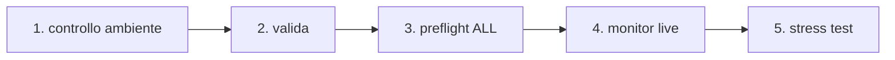

# IrsanAI TPM Agent Forge

[🇬🇧 English](../../README.md) | [🇩🇪 Deutsch](../../README.de.md) | [🇪🇸 Español](./README.es.md) | [🇮🇹 Italiano](./README.it.md) | [🇧🇦 Bosanski](./README.bs.md) | [🇷🇺 Русский](./README.ru.md) | [🇨🇳 中文](./README.zh-CN.md) | [🇫🇷 Français](./README.fr.md) | [🇧🇷 Português (BR)](./README.pt-BR.md) | [🇮🇳 हिन्दी](./README.hi.md) | [🇯🇵 日本語](./README.ja.md)

Bootstrap pulito per un setup multi-agente autonomo (BTC, COFFEE e altro), con opzioni runtime cross-platform.

## Cosa include

- `production/preflight_manager.py` – resilient market source probing with Alpha Vantage + fallback chain and local cache fallback.
- `production/tpm_agent_process.py` – simple per-market agent loop.
- `production/tpm_live_monitor.py` – live BTC monitor with optional CSV warm-start and Termux notifications.
- `core/tpm_scientific_validation.py` – backtest + statistical validation pipeline.
- `scripts/tpm_cli.py` – unified launcher for Termux/Linux/macOS/Windows.
- `scripts/stress_test_suite.py` – failover/latency stress test.
- `scripts/start_agents.sh`, `scripts/health_monitor_v3.sh` – process ops helpers.
- `core/scout.py`, `core/reserve_manager.py`, `core/init_db_v2.py` – operational core tooling.

## Avvio rapido universale

```bash
python scripts/tpm_cli.py env
python scripts/tpm_cli.py validate
python scripts/tpm_cli.py preflight --market ALL
python scripts/tpm_cli.py live --history-csv btc_real_24h.csv --poll-seconds 3600
```

## Verifica catena runtime (sanità causale/ordine)

Il flusso predefinito del repository è volutamente lineare per evitare deriva di stato nascosta e "falsa fiducia" durante l’esecuzione live.



### Logica dei gate (cosa deve essere vero prima del passo successivo)
- **Gate 1 – Ambiente:** il contesto Python/piattaforma è corretto (`env`).
- **Gate 2 – Solidità scientifica:** il comportamento baseline del modello è riproducibile (`validate`).
- **Gate 3 – Affidabilità delle fonti:** dati di mercato + catena fallback raggiungibili (`preflight --market ALL`).
- **Gate 4 – Esecuzione runtime:** il loop live gira con storico input noto (`live`).
- **Gate 5 – Fiducia avversariale:** i target latenza/failover reggono sotto stress (`stress_test_suite.py`).

✅ Già corretto nel codice: il preflight CLI ora supporta `--market ALL`, allineato a quickstart + flusso docker.

## Scegli la tua missione (CTA per ruolo)

> **Sei X? Scegli la tua corsia. Parti in <60 secondi.**

| Persona | Cosa ti interessa | Percorso | Primo comando |
|---|---|---|---|
| 📈 **Trader** | Fast pulse, actionable runtime | [`tpm_live_monitor.py`](./production/tpm_live_monitor.py) | `python scripts/tpm_cli.py live --history-csv btc_real_24h.csv --poll-seconds 3600` |
| 💼 **Investor** | Stability, source trust, resilience | [`preflight_manager.py`](./production/preflight_manager.py) | `python scripts/tpm_cli.py preflight --market ALL` |
| 🔬 **Scientist** | Evidence, tests, statistical signal | [`tpm_scientific_validation.py`](./core/tpm_scientific_validation.py) | `python scripts/tpm_cli.py validate` |
| 🧠 **Theoretician** | Causal structure + future architecture | [`core/scout.py`](./core/scout.py) + [`Prossimi passi`](#prossimi-passi) | `python scripts/tpm_cli.py validate` |
| 🛡️ **Skeptic (priority)** | Break assumptions before production | [`stress_test_suite.py`](./scripts/stress_test_suite.py) + [`preflight_manager.py`](./production/preflight_manager.py) | `python scripts/tpm_cli.py preflight --market ALL && python scripts/stress_test_suite.py` |
| ⚙️ **Operator / DevOps** | Uptime, process health, recoverability | [`start_agents.sh`](./scripts/start_agents.sh) + [`health_monitor_v3.sh`](./scripts/health_monitor_v3.sh) | `bash scripts/start_agents.sh` |

### Sfida dello scettico (consigliata per i nuovi visitatori)
Se fai **solo una cosa**, esegui questo e controlla l’output del report:

```bash
python scripts/tpm_cli.py preflight --market ALL
python scripts/stress_test_suite.py
```

Se questa corsia ti convince, probabilmente ti convincerà anche il resto del repository.

## Note piattaforma

- **Android / Termux (Samsung, ecc.)**
  ```bash
  pkg install termux-api -y
  python scripts/tpm_cli.py live --history-csv btc_real_24h.csv --notify --vibrate-ms 1000
  ```
- **iPhone (best effort):** usa app shell come iSH / a-Shell. Gli hook di notifica specifici di Termux non sono disponibili lì.
- **Windows / Linux / macOS**: usa gli stessi comandi CLI; esegui via tmux/scheduler/cron per persistenza.

## Docker (percorso più semplice cross-OS)

```bash
docker compose run --rm tpm-preflight
docker compose run --rm tpm-live
```

Opzionale per migliorare la qualità della fonte COFFEE:

```bash
export ALPHAVANTAGE_KEY="<your_key>"
docker compose run --rm tpm-preflight
```

## Validazione

Esegui la pipeline di validazione scientifica:

```bash
python core/tpm_scientific_validation.py
```

Artifacts:
- `state/TPM_Scientific_Report.md`
- `state/TPM_test_results.json`

## Fonti e failover

`production/preflight_manager.py` supports:
- Alpha Vantage first for COFFEE (when `ALPHAVANTAGE_KEY` is set)
- TradingView + Yahoo fallback chain
- local cached fallback in `state/latest_prices.json`

Run preflight directly:

```bash
export ALPHAVANTAGE_KEY="<your_key>"
python production/preflight_manager.py --market ALL
```

Run outage stress test (target `p95 < 1000ms`):

```bash
python scripts/stress_test_suite.py
```

Output: `state/stress_test_report.json`


## TPM Playground (MVP interattivo)

Ora puoi esplorare il comportamento TPM in modo interattivo nel browser:

```bash
python -m http.server 8765
# open http://localhost:8765/playground/index.html
```

Include:
- Vista anomalie weak-signal per singolo agente
- Mini sciame (BTC/COFFEE/VOL) con pressione di consenso
- Risonanza di trasferimento cross-domain (sintetico: finanza/meteo/salute)

See: `playground/README.md`.
## Prossimi passi

- Modulo di transfer entropy per analisi causale cross-market.
- Ottimizzatore con aggiornamenti di policy basati sulle performance storiche.
- Alert channels (Telegram/Signal) + boot persistence.


---

## IrsanAI Deep Dive: come "pensa" il core TPM nei sistemi complessi

### 1) Trasformazione visionaria: da trading agent a ecosistema TPM universale

### Cosa rende unico l’algoritmo IrsanAI-TPM? (impostazione corretta)

Ipotesi di lavoro del core TPM:

- Nei sistemi complessi e caotici, il segnale di early-warning è spesso nascosto nel **micro-residual**: piccole deviazioni, correlazioni deboli e datapoint quasi vuoti.
- Dove i sistemi classici vedono solo `0` o "rilevanza insufficiente", TPM cerca **anomalie strutturate** (glitch pattern) nel flusso di contesto.
- TPM valuta non solo il valore, ma anche il **cambiamento delle relazioni nel tempo, qualità fonte, regime e vicinato causale**.

Nota importante di correttezza: TPM **non** predice magicamente il futuro. Mira a una **rilevazione probabilistica anticipata** di cambi regime, breakout e disruption, quando qualità dati e gate di validazione sono soddisfatti.

### Pensare in GRANDE: perché supera la finanza

Se TPM può rilevare pattern precursori deboli negli strumenti finanziari (identificatori tipo index/ticker/ISIN, liquidità, microstruttura), lo stesso principio può generalizzarsi a molti domini:

- **Event/sensor stream + context model + anomaly layer + feedback loop**
- Ogni professione può essere modellata come un "mercato" con feature di dominio, nodi, correlazioni e anomalie
- Agenti TPM specializzati possono apprendere tra domini mantenendo logica professionale locale ed etica

### 100 professioni come spazi obiettivo TPM

| # | Professione | Analogo dati TPM | Target di rilevamento anomalie/pattern |
|---|---|---|---|
| 1 | Police analyst | Incident logs, geotemporal crime maps, networks | Early signals of escalating crime clusters |
| 2 | Fire service commander | Alarm chains, sensor feeds, weather, building profiles | Predict fire and hazard propagation windows |
| 3 | Paramedic/EMS | Dispatch reasons, response times, hospital load | Detect capacity stress before breakdown |
| 4 | Emergency physician | Triage flows, vitals, waiting-time dynamics | Flag critical decompensation earlier |
| 5 | ICU nurse | Ventilation/lab trends, medication responses | Identify sepsis/shock micro-signals |
| 6 | Epidemiologist | Case rates, mobility, wastewater/lab data | Outbreak early warning before exponential phase |
| 7 | Family physician | EHR patterns, prescriptions, follow-up gaps | Detect chronic-risk transitions early |
| 8 | Clinical psychologist | Session trajectories, language markers, sleep/activity | Detect relapse/crisis indicators sooner |
| 9 | Pharma researcher | Compound screens, adverse-event profiles, genomics | Reveal hidden efficacy and side-effect clusters |
| 10 | Biotechnologist | Sequence/process/cell-culture trajectories | Detect drift and contamination risk |
| 11 | Climate scientist | Atmosphere/ocean time series, satellite fields | Identify tipping-point precursors |
| 12 | Meteorologist | Pressure/humidity/wind/radar fields | Anticipate local chaotic weather shifts |
| 13 | Seismologist | Microquakes, stress fields, sensor arrays | Detect precursors to major releases |
| 14 | Volcanologist | Gas, tremor, deformation time series | Narrow eruption probability windows |
| 15 | Hydrologist | River gauges, rain, soil moisture | Detect flash-flood and drought phase changes |
| 16 | Oceanographer | Currents, temperature, salinity, buoy streams | Detect tsunami/ecosystem-relevant anomalies |
| 17 | Energy trader | Load, spot prices, weather, grid state | Signal probable price/load breakouts early |
| 18 | Grid operator | Grid frequency, line state, switching events | Detect cascading-failure risk |
| 19 | Wind farm operator | Turbine telemetry, wind fields, maintenance logs | Predict failures and performance drift |
| 20 | Solar plant operator | Irradiance, inverter telemetry, thermal load | Detect degradation and yield anomalies |
| 21 | Water utility manager | Flow, quality sensors, consumption patterns | Detect contamination/shortage early |
| 22 | Traffic operations manager | Density, collisions, roadworks, events | Predict congestion and crash escalation |
| 23 | Railway control manager | Timetable adherence, track state, delay chains | Break systemic delay cascades early |
| 24 | Air traffic controller | Flight tracks, weather, slot saturation | Detect conflict paths and bottlenecks |
| 25 | Port logistics manager | Berth times, container flow, customs status | Detect supply disruption precursors |
| 26 | Supply-chain manager | ETA, inventory, demand pulse, risk events | Minimize bullwhip and stockout anomalies |
| 27 | Manufacturing lead | OEE, process telemetry, scrap, setup times | Detect quality drift and machine anomalies |
| 28 | Quality engineer | Tolerance distributions, process signals | Detect near-zero defect precursors |
| 29 | Robotics engineer | Motion trajectories, actuator load, control loops | Predict control instability/failure |
| 30 | Aviation maintenance engineer | Engine/flight telemetry, maintenance history | Component-level predictive maintenance |
| 31 | Construction manager | Progress, weather, supply dates, IoT sensors | Quantify schedule/cost anomaly risk |
| 32 | Structural engineer | Load, vibration, fatigue/aging indicators | Detect structural-critical transitions |
| 33 | Urban planner | Mobility, demographics, emissions, land use | Detect emerging urban stress patterns |
| 34 | Architect | Building operations, occupancy, energy curves | Detect design-use mismatch patterns |
| 35 | Farmer | Soil/weather/crop/market streams | Detect disease/yield anomalies early |
| 36 | Agronomist | Satellite nutrition/hydration data | Target precise interventions early |
| 37 | Forestry manager | Moisture, pest patterns, fire indicators | Detect forest damage/fire windows early |
| 38 | Fisheries manager | Catch records, water quality, migration | Detect overfishing/collapse risks |
| 39 | Food safety inspector | Lab findings, cold-chain logs, supply links | Interrupt contamination chains early |
| 40 | Executive chef | Demand pulse, stock health, waste ratios | Minimize spoilage and shortage anomalies |
| 41 | Retail operator | POS streams, footfall, inventory rotation | Detect demand spikes and shrinkage patterns |
| 42 | E-commerce manager | Clickstream, cart journeys, returns | Detect fraud/churn precursor patterns |
| 43 | Marketing analyst | Campaign metrics, segment response curves | Detect micro-trends before mainstream |
| 44 | Sales lead | Pipeline velocity, touchpoint graph | Detect deal-risk and timing opportunities |
| 45 | Customer support lead | Ticket flow, topic clusters, SLA drift | Detect escalation/root-cause waves |
| 46 | Product manager | Feature adoption, retention, feedback | Detect product-market misfit early |
| 47 | UX researcher | Heatmaps, pathing, drop-off points | Surface hidden interaction friction |
| 48 | Software engineer | Logs, traces, deploy metrics | Detect fault cascades pre-incident |
| 49 | Site reliability engineer | Latency, error budgets, saturation | Catch degradation before outage |
| 50 | Cybersecurity analyst | Network flows, IAM events, SIEM alerts | Detect attack-path and lateral movement |
| 51 | Fraud analyst | Transaction graphs, device fingerprints | Detect fraud in weak-signal space |
| 52 | Bank risk manager | Portfolio/macro/liquidity exposures | Detect stress regimes and concentration risk |
| 53 | Insurance actuary | Claims flow, exposure maps, climate links | Anticipate claims waves and reserve stress |
| 54 | Tax advisor | Ledger patterns, filing timelines | Detect compliance risk and optimization paths |
| 55 | Auditor | Control trails, exception patterns | Detect accounting anomalies at scale |
| 56 | Attorney | Case chronology, precedent graphs, deadlines | Detect litigation risk and outcome patterns |
| 57 | Judge/court administrator | Caseload mix, cycle times | Detect justice-system bottlenecks |
| 58 | Corrections manager | Occupancy, incident networks, behavior trends | Detect violence/recidivism clusters |
| 59 | Customs officer | Trade manifests, declarations, routing patterns | Detect smuggling/evasion signals |
| 60 | Defense intelligence analyst | ISR feeds, logistics, operational tempo | Detect escalation dynamics early |
| 61 | Diplomatic analyst | Event chains, communications signals | Detect geopolitical regime shifts |
| 62 | Teacher | Learning progress, attendance, engagement | Detect dropout-risk and support need |
| 63 | School principal | Performance clusters, attendance, resources | Detect systemic school stress patterns |
| 64 | University lecturer | Course activity, withdrawals, feedback | Stabilize student success earlier |
| 65 | Education researcher | Cohort trajectories, pedagogy variables | Identify robust intervention effects |
| 66 | Social worker | Case networks, appointments, risk markers | Detect crisis escalation pathways |
| 67 | NGO coordinator | Field reports, aid flows, need signals | Detect impact gaps and hotspot changes |
| 68 | Employment advisor | Skill profiles, labor demand, transitions | Detect mismatch and upskilling needs |
| 69 | HR manager | Hiring/attrition/performance trajectories | Detect burnout and retention risk early |
| 70 | Recruiter | Funnel rates, skills taxonomy, market pulse | Detect fit risk and hiring opportunity windows |
| 71 | Org consultant | Decision cadence, KPI drift, network patterns | Detect team dysfunction early |
| 72 | Project manager | Milestones, dependencies, blocker graph | Anticipate schedule/scope breakdowns |
| 73 | Journalist | Source reliability graph, event streams | Detect misinformation clusters early |
| 74 | Investigative reporter | Document networks, money/communication traces | Expose hidden systemic anomalies |
| 75 | Content moderator | Post/comment streams, semantic shifts | Detect abuse/radicalization waves early |
| 76 | Artist | Audience response trajectories, style vectors | Detect emerging aesthetics |
| 77 | Music producer | Listening features, arrangement vectors | Detect breakout/niche potential early |
| 78 | Game designer | Telemetry, progression, churn curves | Detect frustration and balance anomalies |
| 79 | Sports coach | Performance/biometric load streams | Detect injury/form-drop precursors |
| 80 | Athletic trainer | Motion/recovery markers | Detect overload before downtime |
| 81 | Sports physician | Diagnostics, rehab load, recurrence risk | Optimize return-to-play windows |
| 82 | Referee analyst | Decision stream, tempo, incident context | Detect consistency/fairness drift |
| 83 | Event manager | Ticketing, mobility, weather, safety feeds | Detect crowd and safety risk escalation |
| 84 | Tourism manager | Booking patterns, reputation signals | Detect demand and sentiment shifts |
| 85 | Hotel manager | Occupancy, service quality, complaints | Detect quality-demand instability early |
| 86 | Property manager | Rent flow, maintenance, market comps | Detect vacancy/default risk early |
| 87 | Facility manager | Building IoT, energy, maintenance intervals | Detect failures and inefficiency patterns |
| 88 | Waste management operator | Waste streams, routing, environmental metrics | Detect illegal dumping and process gaps |
| 89 | Environmental inspector | Emissions, reports, satellite overlays | Detect compliance violations and tipping risk |
| 90 | Circular economy analyst | Material passports, recovery rates | Detect leakage and loop-closure opportunities |
| 91 | Astrophysicist | Telescope streams, spectra, noise models | Detect rare cosmic events |
| 92 | Space operations engineer | Telemetry, orbit params, system diagnostics | Detect mission-critical anomalies early |
| 93 | Quantum engineer | Noise profiles, calibration drifts, gate errors | Detect decoherence and control drift |
| 94 | Data scientist | Feature drift, model quality, data integrity | Detect model collapse and bias shift |
| 95 | AI ethicist | Decision outcomes, fairness metrics | Detect unfair patterns/governance gaps |
| 96 | Philosophy of science researcher | Theory-evidence pathways | Detect paradigm mismatch signals |
| 97 | Mathematician | Residual structures, invariants, error terms | Detect hidden regularities/outlier classes |
| 98 | Systems theorist | Node-edge dynamics, feedback delays | Detect network tipping dynamics |
| 99 | Anthropologist | Field observations, language/social networks | Detect cultural-shift conflict precursors |
| 100 | Foresight strategist | Tech curves, regulation, behavior data | Connect scenarios with early indicators |

### Note country-fit (equivalenza professionale tra giurisdizioni)

Per mantenere la lista logicamente corretta tra regioni, il role-mapping TPM va interpretato come **equivalenti funzionali**, non come traduzione letterale dei titoli professionali:

- **Germany ↔ US/UK:** `Polizei` vs split functions (`Police Department`, `Sheriff`, `State Trooper`) and prosecution differences (`Staatsanwaltschaft` vs `District Attorney/Crown Prosecution`).
- **Spagna / Italia:** strutture civil-law con workflow giudiziari e di polizia distinti; le pipeline dati sono spesso divise tra sistemi regionali e nazionali.
- **Bosnia ed Erzegovina:** la governance multi-entità implica ownership dati frammentata; TPM beneficia della fusione federata di anomalie.
- **Russia / Cina:** definizioni di ruolo e vincoli di data-governance differiscono; TPM va configurato con confini di compliance locali ed equivalenti istituzionali.
- **Ulteriori regioni ad alto impatto:** Francia, Brasile, India, Giappone, stati MENA e Africa subsahariana possono essere onboardate mappando funzioni equivalenti e telemetria disponibile.

### Prospettiva filosofico-scientifica

- Da strumento a **infrastruttura epistemica**: i domini operationalizzano la "weak early knowledge".
- Da sistemi isolati a **federazioni di agenti**: etica locale + grammatica condivisa delle anomalie.
- Da risposta reattiva a **governance anticipatoria**: prevenzione invece di controllo tardivo della crisi.
- Da modelli statici a **teorie viventi**: ricalibrazione continua sotto shock del mondo reale.

Idea centrale: un cluster TPM governato responsabilmente non controlla il caos, ma aiuta le istituzioni a capirlo prima, gestirlo in modo più robusto e decidere in modo più umano.

## Espansione multilingue (in corso)

To support cross-language resonance, localized strategic overviews are available in:

- Spanish (`docs/i18n/README.es.md`)
- Italian (`docs/i18n/README.it.md`)
- Bosnian (`docs/i18n/README.bs.md`)
- Russian (`docs/i18n/README.ru.md`)
- Chinese Simplified (`docs/i18n/README.zh-CN.md`)
- French (`docs/i18n/README.fr.md`)
- Portuguese Brazil (`docs/i18n/README.pt-BR.md`)
- Hindi (`docs/i18n/README.hi.md`)
- Japanese (`docs/i18n/README.ja.md`)

Ogni file localizzato include note di adattamento regionale e rimanda a questa sezione canonica per la matrice completa di 100 professioni.
