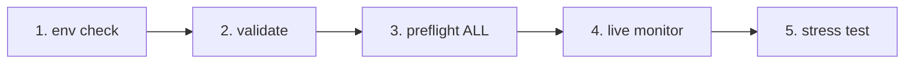

# IrsanAI TPM Agent Forge
[🇬🇧 English](../../README.md) | [🇩🇪 Deutsch](../../README.de.md) | [🇪🇸 Español](../../docs/i18n/README.es.md) | [🇮🇹 Italiano](../../docs/i18n/README.it.md) | [🇧🇦 Bosanski](../../docs/i18n/README.bs.md) | [🇷🇺 Русский](../../docs/i18n/README.ru.md) | [🇨🇳 中文](../../docs/i18n/README.zh-CN.md) | [🇫🇷 Français](../../docs/i18n/README.fr.md) | [🇧🇷 Português (BR)](../../docs/i18n/README.pt-BR.md) | [🇮🇳 हिन्दी](../../docs/i18n/README.hi.md) | [🇹🇷 Türkçe](../../docs/i18n/README.tr.md) | [🇯🇵 日本語](../../docs/i18n/README.ja.md)

[🇬🇧 English](../../README.md) | [🇩🇪 Deutsch](../../README.de.md) | [🇪🇸 Español](./README.es.md) | [🇮🇹 Italiano](./README.it.md) | [🇧🇦 Bosanski](./README.bs.md) | [🇷🇺 Русский](./README.ru.md) | [🇨🇳 中文](./README.zh-CN.md) | [🇫🇷 Français](./README.fr.md) | [🇧🇷 Português (BR)](./README.pt-BR.md) | [🇮🇳 हिन्दी](./README.hi.md) | [🇹🇷 Türkçe](./README.tr.md) | [🇯🇵 日本語](./README.ja.md)

Un bootstrap pulito per una configurazione multi-agente autonoma (BTC, COFFEE e altro) con opzioni runtime cross-platform.

## Cosa Include

- `production/preflight_manager.py` – sondaggio resiliente delle fonti di mercato con Alpha Vantage + catena di fallback e cache locale di riserva.
- `production/tpm_agent_process.py` – loop agente semplice per ogni mercato.
- `production/tpm_live_monitor.py` – monitoraggio live BTC con warm-start opzionale da CSV e notifiche Termux.
- `core/tpm_scientific_validation.py` – pipeline di backtest + validazione statistica.
- `scripts/tpm_cli.py` – launcher unificato per Termux/Linux/macOS/Windows.
- `scripts/stress_test_suite.py` – test di stress failover/latency.
- `scripts/start_agents.sh`, `scripts/health_monitor_v3.sh` – helper per operazioni di processo.
- `core/scout.py`, `core/reserve_manager.py`, `core/init_db_v2.py` – strumenti core operativi.

## Avvio Universale Rapido

```bash
python scripts/tpm_cli.py env
python scripts/tpm_cli.py validate
python scripts/tpm_cli.py preflight --market ALL
python scripts/tpm_cli.py live --history-csv btc_real_24h.csv --poll-seconds 3600
```

## Controllo Causalità Runtime (coerenza ordine/causalità)

Il flusso predefinito del repository è volutamente lineare per evitare deriva di stato nascosta e "falsa sicurezza" durante le esecuzioni live.


```mermaid
flowchart LR
  A[1. env check] --> B[2. validate]
  B --> C[3. preflight ALL]
  C --> D[4. live monitor]
  D --> E[5. stress test]
```

### Logica delle Gate (cosa deve essere vero prima del passo successivo)
- **Gate 1 – Ambiente:** contesto Python/piattaforma corretto (`env`).
- **Gate 2 – Sanità scientifica:** comportamento baseline del modello riproducibile (`validate`).
- **Gate 3 – Affidabilità fonte:** dati di mercato e catena di fallback raggiungibili (`preflight --market ALL`).
- **Gate 4 – Esecuzione Runtime:** loop live con cronologia input nota (`live`).
- **Gate 5 – Fiducia avversaria:** target di latenza/failover mantenuti sotto stress (`stress_test_suite.py`).

✅ Già risolto nel codice: CLI preflight ora supporta `--market ALL`, in linea con quickstart + flusso docker.

## Scegli la Tua Missione (CTA basata sul ruolo)

> **Sei X? Clicca la tua strada. Inizia in meno di 60 secondi.**

| Persona | Cosa ti interessa | Percorso clic | Primo comando |
|---|---|---|---|
| 📈 **Trader** | Impulso rapido, runtime azionabile | [`tpm_live_monitor.py`](./production/tpm_live_monitor.py) | `python scripts/tpm_cli.py live --history-csv btc_real_24h.csv --poll-seconds 3600` |
| 💼 **Investitore** | Stabilità, fiducia nella fonte, resilienza | [`preflight_manager.py`](./production/preflight_manager.py) | `python scripts/tpm_cli.py preflight --market ALL` |
| 🔬 **Scientist** | Evidenze, test, segnale statistico | [`tpm_scientific_validation.py`](./core/tpm_scientific_validation.py) | `python scripts/tpm_cli.py validate` |
| 🧠 **Teorico** | Struttura causale + architettura futura | [`core/scout.py`](./core/scout.py) + [`Next Steps`](#next-steps) | `python scripts/tpm_cli.py validate` |
| 🛡️ **Scettico (priorità)** | Rompiipotesi prima della produzione | [`stress_test_suite.py`](./scripts/stress_test_suite.py) + [`preflight_manager.py`](./production/preflight_manager.py) | `python scripts/tpm_cli.py preflight --market ALL && python scripts/stress_test_suite.py` |
| ⚙️ **Operatore / DevOps** | Uptime, salute processi, recuperabilità | [`start_agents.sh`](./scripts/start_agents.sh) + [`health_monitor_v3.sh`](./scripts/health_monitor_v3.sh) | `bash scripts/start_agents.sh` |

### Sfida Scettico (consigliata come prima scelta per nuovi visitatori)
Se fai **solo una cosa**, esegui questo e ispeziona il report prodotto:

```bash
python scripts/tpm_cli.py preflight --market ALL
python scripts/stress_test_suite.py
```

Se questa strada ti convince, probabilmente il resto del repository risuonerà con te.

## Note sulla Piattaforma

- **Android / Termux (Samsung, etc.)**
  ```bash
  bash scripts/termux_bootstrap.sh
  cd ~/TPM-Agent
  python scripts/tpm_cli.py env
  python scripts/tpm_cli.py preflight --market ALL
  python scripts/tpm_cli.py live --history-csv btc_real_24h.csv --notify --vibrate-ms 1000
  ```
  Per demo diretta UI web su Android (Termux), avvia localmente Forge runtime:
  ```bash
  cd ~/TPM-Agent
  bash scripts/termux_forge.sh start
  # stop: bash scripts/termux_forge.sh stop
  # status: bash scripts/termux_forge.sh status
  ```
  Lo script apre automaticamente il browser (se disponibile) e mantiene il servizio in background.
  Se hai riscontrato errori di build `pydantic-core`/Rust o `scipy`/Fortran su Android, usa
  `python -m pip install -r requirements-termux.txt` (set sicuro Termux, no toolchain Rust richiesto).
  Nell’interfaccia web puoi controllare start/stop runtime; una barra di progresso mostra lo stato della transizione.
- **iPhone (best effort)**: usa app shell come iSH / a-Shell. I ganci notifiche Termux non sono disponibili lì.
- **Windows / Linux / macOS**: usa gli stessi comandi CLI; esegui tramite tmux/scheduler/cron per persistenza.

## Docker (Metodo più semplice Cross-OS)

Usa Docker esattamente in questo ordine (senza tentativi):

### Step 1: Costruisci l’immagine runtime web

```bash
docker compose build --no-cache tpm-forge-web
```

### Step 2: Avvia il servizio dashboard web

```bash
docker compose up tpm-forge-web
```

Ora apri `http://localhost:8787` nel tuo browser (**non** `http://0.0.0.0:8787`). Internamente Uvicorn si lega a `0.0.0.0`, ma i client devono usare `localhost` (o l’IP LAN host).

### Step 3 (controlli opzionali): esplora i servizi non-web

```bash
docker compose run --rm tpm-preflight
docker compose run --rm tpm-live
```

- `tpm-preflight` = controlli sorgente/connettività (solo output CLI).
- `tpm-live` = log live monitor da terminale (solo output CLI, **senza UI web**).
- `tpm-forge-web` = FastAPI + dashboard UI (quella con layout/progress/controllo runtime).

Se `tpm-preflight` riporta `ALPHAVANTAGE_KEY not set`, COFFEE funziona ancora tramite fallback.

Se la pagina appare vuota:
- prova API direttamente: `http://localhost:8787/api/frame`
- prova FastAPI docs: `http://localhost:8787/docs`
- ricarica forzata del browser (`Ctrl+F5`)
- se serve, riavvia solo il servizio web: `docker compose restart tpm-forge-web`

Opzionale per migliorare la qualità COFFEE:

```bash
export ALPHAVANTAGE_KEY="<your_key>"
docker compose run --rm tpm-preflight
```

## Predizioni di glitch & avvisi mobili

- Il cockpit live di Forge ora espone outlook per mercato a breve orizzonte (`up/down/sideways`) con confidenza in `/api/markets/live`.
- Quando si rileva un glitch di mercato (picco di accelerazione), il runtime può attivare:
  - toast + vibrazione Termux
  - hook opzionale di notifica/alert acustico
  - push Telegram opzionale (se token bot/chat id configurati in `config/config.yaml`).
- Configura via dashboard tramite **Save Alerts** / **Test Alert** o API:
  - `GET /api/alerts/preferences`
  - `POST /api/alerts/preferences`
  - `POST /api/alerts/test`

## Validazione

Esegui la pipeline di validazione scientifica:

```bash
python core/tpm_scientific_validation.py
```

Artefatti:
- `state/TPM_Scientific_Report.md`
- `state/TPM_test_results.json`

## Fonti & Failover

`production/preflight_manager.py` supporta:
- Alpha Vantage come prima scelta per COFFEE (se `ALPHAVANTAGE_KEY` è settata)
- catena fallback TradingView + Yahoo
- fallback cache locale in `state/latest_prices.json`

Esegui preflight direttamente:

```bash
export ALPHAVANTAGE_KEY="<your_key>"
python production/preflight_manager.py --market ALL
```

Esegui test di stress in caso di outage (target `p95 < 1000ms`):

```bash
python scripts/stress_test_suite.py
```

Output: `state/stress_test_report.json`


## Stato live: cosa può fare oggi l’agente TPM

**Stato attuale:**
- Runtime Forge web di produzione è disponibile (`production.forge_runtime:app`).
- Configurazione start finance-first usa **BTC + COFFEE**.
- Frame live, fitness agente, entropia di trasferimento e riepilogo dominio sono visibili in dashboard web.
- Gli utenti possono aggiungere agenti di mercato nuovi a runtime (`POST /api/agents`).

**Capacità target (should-have):**
- Benchmark su dati reali con soglie esplicite di accettazione (precision/recall/FPR/drift).
- Regole rigorous di governance riflessiva per safe-mode automatico.
- Workflow di memoria collettiva per pattern di apprendimento versionati per dominio.

**Fase di espansione successiva:**
- Orchestratore policy basato su regime (trend/shock/sideways) per tutti gli agenti.
- Pilota in dominio non finanziario (es. medico o sismico) con contratti dati espliciti.


## Helper per conflitti merge PR

- Checklist Merge (conflitti GitHub): `docs/MERGE_CONFLICT_CHECKLIST.de.md`


### Campo di applicazione oggi: Windows + smartphone per TPM finance

- **Windows:** runtime Forge + interfaccia web + Docker/PowerShell/click-start operativi.
- **Smartphone:** monitoring live Android/Termux operativo; UI web responsive su mobile.
- **Multi-agente realtime:** BTC + COFFEE attivi di default; ulteriori mercati possono essere aggiunti dinamicamente via UI web.
- **Regola boundary sorgente:** se mercato richiesto non coperto da fonti integrate, fornire URL fonte esplicito + dati autorizzazione.

## Test live Windows (sistema a due percorsi)

### Percorso A — Sviluppatori/power user (PowerShell, CMD, PyCharm, IDE)

```powershell
python -m venv .venv
.\.venv\Scripts\Activate.ps1
pip install -r requirements.txt
python scripts/tpm_cli.py forge-dashboard --open-browser --port 8787
```

### Percorso B — Utenti basilari (click & start)

1. Doppio-click su `scripts/windows_click_start.bat`
2. Lo script seleziona automaticamente il percorso migliore disponibile:
   - Python disponibile -> venv + pip + runtime
   - altrimenti Docker Compose (se disponibile)

Base tecnica: `scripts/windows_bootstrap.ps1`.

## Forge Production Web Runtime (BTC + COFFEE, estendibile)

Sì, questo è **già iniziato** nel repo ed è ora esteso:

- Parte di default con un agente TPM finance per **BTC** e uno per **COFFEE**.
- Gli utenti possono aggiungere altri mercati/agenti direttamente dalla UI web (`/api/agents`).
- Esegue come servizio runtime persistente con output frame live (`/api/frame`) per insight immersivi.

### Avvio (locale)

```bash
uvicorn production.forge_runtime:app --host 0.0.0.0 --port 8787
# open http://localhost:8787
```

### Avvio (Docker)

```bash
docker compose up tpm-forge-web
# open http://localhost:8787
```

## TPM Playground (MVP interattivo)

Ora puoi esplorare il comportamento TPM interattivamente nel browser:

```bash
python -m http.server 8765
# open http://localhost:8765/playground/index.html
```

Include:
- Vista singolo agente di anomalie a segnale debole
- Mini sciame (BTC/COFFEE/VOL) per pressione di consenso
- Risonanza cross-dominio di trasferimento (finanza sintetica/meteo/salute)

Vedi: `playground/README.md`.

## Prossimi Passi

- Modulo entropia di trasferimento per analisi causale cross-market.
- Ottimizzatore con aggiornamenti policy basati su prestazioni storiche.
- Canali alert (Telegram/Signal) + persistenza boot.

---

## IrsanAI Deep Dive: Come "pensa" il core TPM nei sistemi complessi

### 1) Trasformazione visionaria: da agente di trading a ecosistema TPM universale

### Cosa rende unico l’algoritmo IrsanAI-TPM? (inquadramento corretto)

Ipotesi di lavoro del core TPM:

- Nei sistemi complessi e caotici, il segnale di early-warning è spesso nascosto nel **micro-residuo**: piccole deviazioni, deboli correlazioni, dati quasi vuoti.
- Dove i sistemi classici vedono solo `0` o "rilevanza insufficiente", TPM cerca **anomalie strutturate** (pattern glitch) nel flusso contestuale.
- TPM valuta non solo un valore in sé, ma il **cambiamento delle relazioni nel tempo, qualità della fonte, regime e vicinato causale**.

Nota importante di correttezza: TPM **non** predice magicamente il futuro. Mira a una **rilevazione probabilistica anticipata** di shift di regime, breakout e disruption — quando qualità dati e gate di validazione sono soddisfatti.

### Pensa in grande: perché si estende oltre la finanza

Se TPM può rilevare deboli pattern precursori negli strumenti finanziari (index/ticker/identificativi ISIN-like, liquidità, microstruttura), lo stesso principio si può generalizzare a molti domini:

- **Flusso evento/sensori + modello contestuale + layer anomalie + ciclo di feedback**
- Ogni professione può essere modellata come un "mercato" con feature, nodi, correlazioni e anomalie specifiche del dominio
- Agenti TPM specializzati possono imparare cross-dominio preservando logica professionale locale ed etica

### 100 professioni come target TPM

| # | Professione | Analogo dati TPM | Obiettivo detection anomalie/pattern |
|---|---|---|---|
| 1 | Analista polizia | Log incidenti, mappe crimine geotemporali, reti | Segnali precoci di cluster criminali in escalation |
| 2 | Comandante vigili del fuoco | Catene allarmi, feed sensori, meteo, profili edifici | Prevedere finestre di propagazione incendi/pericoli |
| 3 | Paramedico/EMS | Motivi dispatch, tempi risposta, carico ospedaliero | Rilevare stress di capacità prima del collasso |
| 4 | Medico di emergenza | Flussi triage, parametri vitali, dinamiche attesa | Segnalare decompensazioni critiche anticipatamente |
| 5 | Infermiere ICU | Trend ventilazione/lab, risposte farmaci | Identificare micro-segnali di sepsi/shock |
| 6 | Epidemiologo | Casi, mobilità, dati wastewater/lab | Early warning di outbreak prima della fase esponenziale |
| 7 | Medico di famiglia | Pattern EHR, prescrizioni, gap follow-up | Rilevare transizioni di rischio cronico anticipatamente |
| 8 | Psicologo clinico | Traiettorie sedute, marcatori linguistici, sonno/attività | Individuare segnali di ricadute o crisi prima |
| 9 | Ricercatore farmaceutico | Screening composti, profili eventi avversi, genomica | Scoprire cluster di efficacia ed effetti collaterali nascosti |
| 10 | Biotecnologo | Sequenze/processi/traiettorie colture cellulari | Rilevare derive e rischi contaminazione |
| 11 | Scienziato climatico | Serie temporali atmosfera/oceano, dati satellitari | Identificare precursori di tipping-point |
| 12 | Meteorologo | Pressione/umidità/vento/campi radar | Anticipare shift meteo locali caotici |
| 13 | Sismologo | Microterremoti, campi stress, array sensori | Rilevare precursori a grandi eventi |
| 14 | Vulcanologo | Gas, tremori, serie deformazioni | Restringere finestre probabilità eruzione |
| 15 | Idrologo | Misure fiumi, pioggia, umidità suolo | Individuare cambi di fase alluvioni/secche |
| 16 | Oceanografo | Correnti, temperatura, salinità, boe | Rilevare anomalie tsunami/eco-rilevanti |
| 17 | Trader energia | Carico, prezzi spot, meteo, stato rete | Segnalare breakout prezzo/carico probabili |
| 18 | Operatore rete elettrica | Frequenza rete, stato linee, eventi switch | Rilevare rischio cedimenti a cascata |
| 19 | Operatore parco eolico | Telemetria turbine, campi vento, manutenzione | Prevedere guasti e derive prestazioni |
| 20 | Operatore impianto solare | Irradianza, telemetria inverter, carico termico | Rilevare degradazione e anomalie resa |
| 21 | Gestore servizi idrici | Flusso, sensori qualità, consumi | Individuare contaminazioni/scarsità precocemente |
| 22 | Gestore traffico | Densità, incidenti, cantieri, eventi | Prevedere ingorghi e escalation incidenti |
| 23 | Gestore controllo ferrovia | Rispetto orari, stato binari, catene ritardo | Rompere cascata di ritardi sistemici |
| 24 | Controllore traffico aereo | Tracce volo, meteo, saturazione slot | Rilevare paths di conflitto e colli di bottiglia |
| 25 | Gestore logistica portuale | Tempi ormeggio, flusso container, status dogana | Rilevare precursori disruzioni supply chain |
| 26 | Gestore supply-chain | ETA, inventario, domanda, eventi rischio | Minimizzare anomalie bullwhip e stockout |
| 27 | Responsabile produzione | OEE, telemetria processo, scarti, setup | Rilevare derive qualità e anomalie macchina |
| 28 | Ingegnere qualità | Distribuzioni tolleranze, segnali processo | Precursor azzerati difetti |
| 29 | Ingegnere robotica | Traiettorie movimento, carichi attuatori, loop controllo | Prevedere instabilità/fallimenti controllo |
| 30 | Ingegnere manutenzione aviazione | Telemetria motore/volo, storico manutenzione | Manutenzione predittiva componenti |
| 31 | Responsabile cantiere | Avanzamento, meteo, date forniture, IoT | Quantificare rischio anomalie costi/tempi |
| 32 | Ingegnere strutturale | Carichi, vibrazioni, indicatori fatica/invecchiamento | Rilevare transizioni strutturali critiche |
| 33 | Urbanista | Mobilità, demografia, emissioni, uso suolo | Rilevare pattern stress urbani emergenti |
| 34 | Architetto | Operazioni edificio, occupazione, curve energetiche | Rilevare mismatch design-uso |
| 35 | Agricoltore | Suolo/tempo/coltura/mercato | Rilevare precoce anomalie malattie/resa |
| 36 | Agronomo | Dati satellite nutrizione/idrazione | Interventi precisi anticipati |
| 37 | Gestore foreste | Umidità, infestazioni, indicatori incendi | Segnali precoci danni/incendi boschivi |
| 38 | Gestore pesca | Registri pesca, qualità acqua, migrazione | Rilevare rischio sovrapesca/crolli |
| 39 | Ispettore sicurezza alimentare | Risultati lab, log cold-chain, supply link | Interrompere catene contaminazione precocemente |
| 40 | Chef esecutivo | Domanda, stato stock, rapporto sprechi | Minimizzare deperimento e anomalie carenze |
| 41 | Operatore retail | Flusso POS, affluenza, rotazione inventario | Rilevare picchi domanda e pattern furto |
| 42 | Manager e-commerce | Clickstream, percorsi carrello, resi | Rilevare frodi e precursori abbandono clienti |
| 43 | Analista marketing | Metriche campagna, curve risposta segmenti | Rilevare micro-trend prima del mainstream |
| 44 | Responsabile vendite | Velocità pipeline, grafo contatti | Rilevare rischio chiusure e timing opportunità |
| 45 | Responsabile supporto clienti | Flusso ticket, cluster topic, deriva SLA | Rilevare escalation / cause radice ondate |
| 46 | Product manager | Adozione funzionalità, retention, feedback | Precoce rilevazione misfit prodotto-mercato |
| 47 | Ricercatore UX | Heatmap, percorsi, drop-off | Scovare attrito d’interazione nascosto |
| 48 | Ingegnere software | Log, tracce, metriche deploy | Rilevare cascata guasti pre-incidente |
| 49 | SRE (Site reliability engineer) | Latency, budget errori, saturazione | Rilevare degrado prima outage |
| 50 | Analista cybersecurity | Flussi rete, eventi IAM, allarmi SIEM | Rilevare percorsi attacco e movimenti laterali |
| 51 | Analista frodi | Grafi transazioni, fingerprint dispositivi | Rilevare frodi in spazi segnale debole |
| 52 | Risk manager banca | Portafoglio/macro/esposizioni liquidità | Rilevare stress regime e rischio concentrazione |
| 53 | Attuario assicurativo | Flussi reclami, mappe esposizione, clima | Anticipare ondate reclami e stress riserve |
| 54 | Consulente fiscale | Pattern contabili, scadenze invio | Rilevare rischio compliance e ottimizzazione |
| 55 | Revisore contabile | Tracce controlli, pattern eccezioni | Rilevare anomalie contabili su larga scala |
| 56 | Avvocato | Cronologia casi, grafi precedenti, scadenze | Rilevare rischio contenzioso e pattern esiti |
| 57 | Giudice/amministratore tribunale | Mix carico casi, tempi ciclo | Rilevare colli di bottiglia sistema giustizia |
| 58 | Responsabile carceri | Occupazione, reti incidenti, trend comportamenti | Rilevare cluster violenza/recidiva |
| 59 | Doganiere | Manifesti, dichiarazioni, pattern routing | Rilevare segnali di contrabbando/evasione |
| 60 | Analista intelligence difesa | Feed ISR, logistica, ritmo operazioni | Rilevare dinamiche escalation anticipate |
| 61 | Analista diplomazia | Catene eventi, segnali comunicazioni | Rilevare shift regime geopolitici |
| 62 | Insegnante | Progresso apprendimento, frequenza, engagement | Rilevare rischio abbandono e bisogni supporto |
| 63 | Dirigente scolastico | Cluster performance, frequenza, risorse | Rilevare stress sistemico scuola |
| 64 | Docente universitario | Attività corso, ritiri, feedback | Stabilizzare successo studenti precoce |
| 65 | Ricercatore educazione | Traiettorie coorti, variabili pedagogiche | Identificare effetti interventi robusti |
| 66 | Assistente sociale | Reti casi, appuntamenti, marcatori rischio | Rilevare percorsi escalation crisi |
| 67 | Coordinatore ONG | Rapporti campo, flussi aiuti, segnali necessità | Rilevare gap impatto e hotspot dinamici |
| 68 | Consulente lavoro | Profili skill, domanda lavoro, transizioni | Rilevare mismatch e bisogni upskilling |
| 69 | HR manager | Traiettorie assunzioni/uscite/performance | Rilevare burnout e rischio retention precoce |
| 70 | Recruiter | Funnel, tassonomia skill, pulse mercato | Rilevare rischio fit e finestre opportunità assunzione |
| 71 | Consulente organizzativo | Cadenza decisioni, deriva KPI, pattern rete | Rilevare disfunzioni team precoce |
| 72 | Project manager | Milestone, dipendenze, grafo blocchi | Anticipare rotture programma/ambito |
| 73 | Giornalista | Grafi affidabilità fonti, flussi eventi | Rilevare cluster disinformazione precoci |
| 74 | Reporter investigativo | Reti documenti, tracce soldi/comunicazioni | Svelare anomalie sistemiche nascoste |
| 75 | Moderatore contenuti | Flussi post/commenti, shift semantici | Rilevare ondate abusi/radicalizzazione |
| 76 | Artista | Traiettorie audience, vettori stile | Rilevare estetiche emergenti |
| 77 | Produttore musicale | Feature ascolto, vettori arrangiamento | Rilevare breakout/nicchia potenziale precoce |
| 78 | Game designer | Telemetria, progressione, curve abbandono | Rilevare frustrazione e anomalie bilanciamento |
| 79 | Allenatore sportivo | Performance/biometria | Rilevare precursori infortuni/cal drop |
| 80 | Preparatore atletico | Movimento, markers recupero | Rilevare sovraccarico pre-stop attività |
| 81 | Medico sportivo | Diagnostica, carico rehab, rischio recidiva | Ottimizzare finestre ritorno attività |
| 82 | Analista arbitri | Flusso decisioni, ritmo, contesto incidenti | Rilevare deriva coerenza/equità |
| 83 | Organizzatore eventi | Ticketing, mobilità, meteo, sicurezza | Rilevare escalation rischio folla/sicurezza |
| 84 | Manager turismo | Prenotazioni, segnali reputazione | Rilevare domanda e sentiment shift |
| 85 | Direttore albergo | Occupazione, qualità servizi, reclami | Rilevare instabilità qualità-domanda precoce |
| 86 | Gestore proprietà | Flusso affitti, manutenzione, comparabili mercato | Rilevare rischio vacanza/mancati pagamenti |
| 87 | Responsabile struttura | IoT edificio, energia, manutenzione | Rilevare guasti e inefficienze |
| 88 | Operatore gestione rifiuti | Flussi rifiuti, routing, metriche ambientali | Rilevare discariche abusive e gap di processo |
| 89 | Ispettore ambientale | Emissioni, rapporti, overlay satellitari | Rilevare violazioni compliance e tipping risk |
| 90 | Analista economia circolare | Passaporti materiali, tassi recupero | Rilevare dispersioni e opportunità chiusura ciclo |
| 91 | Astrofisico | Flussi telescopio, spettri, modelli rumore | Rilevare eventi cosmici rari |
| 92 | Ingegnere operazioni spaziali | Telemetria, parametri orbita, diagnostica | Rilevare anomalie critiche missione |
| 93 | Ingegnere quantistico | Profili rumore, derive calibrazione, errori gate | Rilevare decoerenza e derive controllo |
| 94 | Data scientist | Deriva feature, qualità modello, integrità dati | Rilevare collasso modello e shift bias |
| 95 | Etico AI | Risultati decisioni, metriche equità | Rilevare pattern ingiusti / gap governance |
| 96 | Ricercatore filosofia scienza | Percorsi teoria-evidenza | Rilevare segnali mismatch paradigma |
| 97 | Matematico | Strutture residui, invarianti, termini errore | Rilevare regolarità nascoste/classi outlier |
| 98 | Teorico sistemi | Dinamiche nodo-laccio, ritardi feedback | Rilevare dinamiche tipping rete |
| 99 | Antropologo | Osservazioni campo, reti linguaggio/sociali | Rilevare precursori conflitti cambio culturale |
| 100 | Stratega foresight | Curve tecnologiche, regolamenti, dati comportamentali | Connettere scenari a indicatori precoci |

### Note fit paese (equivalenza professionale tra giurisdizioni)

Per mantenere la lista logica tra regioni, il mapping ruolo TPM va interpretato come **equivalenti funzionali**, non traduzione letterale titoli di lavoro:

- **Germania ↔ US/UK:** `Polizei` vs funzioni separate (`Police Department`, `Sheriff`, `State Trooper`) e differenze in procura (`Staatsanwaltschaft` vs `District Attorney/Crown Prosecution`).
- **Spagna / Italia:** strutture civil-law con workflow distinti per tribunali e polizia; pipeline dati spesso divise tra regioni e stato.
- **Bosnia ed Erzegovina:** governance multi-entità che causa frammentazione della proprietà dati; beneficia di fusione federata anomalie TPM.
- **Russia / Cina:** definizioni di ruolo e vincoli compliance dati differenti; TPM deve essere configurato con confini locali e equivalenti istituzionali.
- **Altre regioni ad alto impatto:** Francia, Brasile, India, Giappone, stati MENA e Sub-Saharan Africa possono essere integrati mappando funzioni equivalenti e telemetria disponibile.

### Visione filosofico-scientifica

- Da strumento a **infrastruttura epistemica**: i domini materializzano la "conoscenza debole precoce".
- Da sistemi isolati a **federazioni di agenti**: etiche locali + grammatica condivisa anomalie.
- Da reattività a **governance anticipatoria**: prevenzione > controllo crisi tardivo.
- Da modelli statici a **teorie viventi**: ritaratura continua sotto shock reali.

Idea centrale: un cluster TPM governance-responsabile non può controllare il caos — ma può aiutare le istituzioni a capirlo prima, guidarlo in modo più robusto e decidere più umanamente.

## Espansione multilingue (in corso)

Per supportare risonanza cross-lingua, panoramiche strategiche localizzate sono disponibili in:

- Spagnolo (`docs/i18n/README.es.md`)
- Italiano (`docs/i18n/README.it.md`)
- Bosniaco (`docs/i18n/README.bs.md`)
- Russo (`docs/i18n/README.ru.md`)
- Cinese Semplificato (`docs/i18n/README.zh-CN.md`)
- Francese (`docs/i18n/README.fr.md`)
- Portoghese Brasile (`docs/i18n/README.pt-BR.md`)
- Hindi (`docs/i18n/README.hi.md`)
- Turco (`docs/i18n/README.tr.md`)
- Giapponese (`docs/i18n/README.ja.md`)

Ogni file localizzato include note di adattamento regionale e rimanda a questa sezione inglese canonica per la matrice completa delle 100 professioni.

## IrsanAI Quality Meta (SOLL vs IST)

Per lo stato attuale di maturità del repo, lo stato qualità intermedio e la roadmap causale basata sulle aspettative reali degli utenti vedi:

- `docs/IRSANAI_QUALITY_META.md`

Questo documento è ora riferimento per:
- profondità feature (UX/UI + robustezza operativa),
- requisiti parità Docker/Android,
- gate di accettazione qualità per PR future.

## Modalità parità i18n (mirror completo)

Per assicurare che nessuna comunità linguistica sia svantaggiata, i file i18n sono ora mantenuti in piena parità canonica con `README.md`.

Comando sync:

```bash
python scripts/i18n_full_mirror_sync.py
```

## Nota per sviluppatori (LOP – Lista punti aperti)

Cosa rimane aperto secondo me (dal punto di vista funzionale, non tecnicamente bloccato):

| Punto | Stato attuale | Come procedere in modo sensato |
|---|---|---|
| **Modulo entropia di trasferimento cross-market** | **Completato ✅** – implementato come `TransferEntropyEngine` e cablato nell’Orchestrator Forge. | Aggiungere calibrazione funzionale: definire soglie e regole interpretative specifiche dominio. |
| **Optimizer / aggiornamento policy storico** | **Completato ✅** – scoring fitness, reward update e candidate culling nel ciclo tick. | Documentare modalità operative (conservativa/aggressiva) e rendere testabili come profili governance. |
| **Alerting (Telegram/Signal)** | **Parzialmente fatto 🟡** – infrastruttura presente, ma di default disattivata. | Definire politica alert: quali eventi, severità, canale, risposta. |
| **Persistenza boot / durata operativa** | **Parzialmente fatto 🟡** – esistono start e health monitoring via tmux, ma manca un runbook unificato per tutte le piattaforme target. | Definire per piattaforme (Termux/Linux/Docker) start-on-boot, policy riavvio ed escalation. |
| **Meta-layer coordinato (da “Next Expansion Stage”)** | **Parzialmente fatto 🟡** – parti presenti (orchestrator + entropia + reward) ma non descritto come orchestratore completo regime-policy. | Aggiungere modello di controllo funzionale esplicito (Trend/Shock/Sideways) per pesi agenti. |
| **Memoria collettiva (archivio pattern apprendimenti versionato)** | **Aperto 🔴** – segnalato in vision/evoluzioni ma senza processo chiaro di storage e review. | Definire formato pattern, logica versioni e criteri qualità (quando pattern è “validato”). |
| **Governance riflessiva (modalità conservativa automatica in caso di incertezza)** | **Aperto 🔴** – indicato come obiettivo ma non formalizzato in regola decisionale. | Tradurre indicatori incertezza e condizioni di switch dure in regole governance. |
| **Estensione domini oltre Finance/Weather** | **Aperto 🔴** – altri domini modellati in vision/templates ma non ancora contratti dati produttivi. | Avviare pilota dominio successivo (es. Medical o Sismico) con metriche e dati chiari. |
| **Evidenza scientifica su dati reali** | **Aperto 🔴** – validazione attuale robusta ma basata su segmenti regime sintetici. | Integrare benchmarking su dati reali con criteri fissi di accettazione (Precision/Recall/FPR/Drift). |
| **Risonanza multilingue / espansione i18n** | **Parzialmente fatto 🟡** – landingpage linguistiche esistenti; espansione marchiata "in progress". | Definire processo sincronizzazione (quando modifiche da root README propagare in tutte i18n). |

Sintesi breve: i “Next Steps” iniziali sono **in gran parte tecnicamente avviati o implementati**; il maggiore impatto ora è in **operazionalizzazione funzionale** (governance, policy, logica dominio, evidenza dati reali) e **gestione documentazione/i18n coerente**.

### Piano esecutivo LOP

Per sequenza implementazione, criteri done e gate evidenza per ogni punto LOP, vedi:

- `docs/LOP_EXECUTION_PLAN.md`

## LOP (endnote – priorità)

1. **P1 Espandere evidenza dati reali:** benchmarking con criteri fissi accettazione (Precision/Recall/FPR/Drift).
2. **P2 Finalizzare governance riflessiva:** regole hard auto-safe-mode su incertezza.
3. **P3 Standardizzare memoria collettiva:** pattern di apprendimento versionati con processo review per dominio.
4. **P4 Continuare rollout immersione web:** viste ruolo per altri settori TPM su nuovo layout responsive.

**Nota piattaforma:** attualmente focalizzato principalmente su **Windows + Smartphone**. **In futuro aggiungere:** macOS, Linux e altri profili piattaforma.