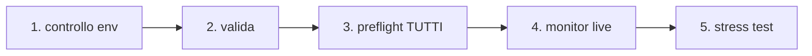

# IrsanAI TPM Agent Forge

[🇬🇧 English](./README.md) | [🇩🇪 Deutsch](./README.de.md) | [🇪🇸 Español](./docs/i18n/README.es.md) | [🇮🇹 Italiano](./docs/i18n/README.it.md) | [🇧🇦 Bosanski](./docs/i18n/README.bs.md) | [🇷🇺 Русский](./docs/i18n/README.ru.md) | [🇨🇳 中文](./docs/i18n/README.zh-CN.md) | [🇫🇷 Français](./docs/i18n/README.fr.md) | [🇧🇷 Português (BR)](./docs/i18n/README.pt-BR.md) | [🇮🇳 हिन्दी](./docs/i18n/README.hi.md) | [🇹🇷 Türkçe](./docs/i18n/README.tr.md) | [🇯🇵 日本語](./docs/i18n/README.ja.md)

Un bootstrap pulito per una configurazione multi-agente autonoma (BTC, COFFEE e altro) con opzioni di runtime multipiattaforma.

## Cosa è incluso

- `production/preflight_manager.py` – probing resiliente delle fonti di mercato con Alpha Vantage + catena di fallback e fallback di cache locale.
- `production/tpm_agent_process.py` – semplice loop dell'agente per mercato.
- `production/tpm_live_monitor.py` – monitor BTC in tempo reale con avvio a caldo CSV opzionale e notifiche Termux.
- `core/tpm_scientific_validation.py` – pipeline di backtest + validazione statistica.
- `scripts/tpm_cli.py` – launcher unificato per Termux/Linux/macOS/Windows.
- `scripts/stress_test_suite.py` – test di stress failover/latenza.
- `scripts/start_agents.sh`, `scripts/health_monitor_v3.sh` – helper per le operazioni di processo.
- `core/scout.py`, `core/reserve_manager.py`, `core/init_db_v2.py` – strumenti operativi di base.

## Avvio rapido universale

```bash
python scripts/tpm_cli.py env
python scripts/tpm_cli.py validate
python scripts/tpm_cli.py preflight --market ALL
python scripts/tpm_cli.py live --history-csv btc_real_24h.csv --poll-seconds 3600
```

## Controllo della catena di runtime (sanità causale/dell'ordine)

Il flusso predefinito del repository è intenzionalmente lineare per evitare la deriva dello stato nascosto e la "falsa fiducia" durante le esecuzioni in tempo reale.


```mermaid
flowchart LR
  A[1. controllo env] --> B[2. valida]
  B --> C[3. preflight TUTTI]
  C --> D[4. monitor live]
  D --> E[5. stress test]
```

### Logica del Gate (cosa deve essere vero prima del passo successivo)
- **Gate 1 – Ambiente:** Il contesto Python/piattaforma è corretto (`env`).
- **Gate 2 – Sanità scientifica:** Il comportamento del modello di base è riproducibile (`validate`).
- **Gate 3 – Affidabilità della sorgente:** I dati di mercato + la catena di fallback sono raggiungibili (`preflight --market ALL`).
- **Gate 4 – Esecuzione runtime:** Il loop live viene eseguito con una cronologia di input nota (`live`).
- **Gate 5 – Fiducia avversaria:** Gli obiettivi di latenza/failover sono mantenuti sotto stress (`stress_test_suite.py`).

✅ Già corretto nel codice: CLI preflight ora supporta `--market ALL`, corrispondente al quickstart + flusso docker.

## Scegli la tua missione (CTA basata sui ruoli)

> **Sei X? Clicca sulla tua corsia. Inizia in <60 secondi.**

| Persona | Cosa ti interessa | Percorso di clic | Primo comando |
|---|---|---|---|
| 📈 **Trader** | Polso veloce, runtime utilizzabile | [`tpm_live_monitor.py`](./production/tpm_live_monitor.py) | `python scripts/tpm_cli.py live --history-csv btc_real_24h.csv --poll-seconds 3600` |
| 💼 **Investitore** | Stabilità, fiducia nella fonte, resilienza | [`preflight_manager.py`](./production/preflight_manager.py) | `python scripts/tpm_cli.py preflight --market ALL` |
| 🔬 **Scienziato** | Evidenza, test, segnale statistico | [`tpm_scientific_validation.py`](./core/tpm_scientific_validation.py) | `python scripts/tpm_cli.py validate` |
| 🧠 **Teorico** | Struttura causale + architettura futura | [`core/scout.py`](./core/scout.py) + [`Prossimi passi`](#next-steps) | `python scripts/tpm_cli.py validate` |
| 🛡️ **Scettico (priorità)** | Rompere le ipotesi prima della produzione | [`stress_test_suite.py`](./scripts/stress_test_suite.py) + [`preflight_manager.py`](./production/preflight_manager.py) | `python scripts/tpm_cli.py preflight --market ALL && python scripts/stress_test_suite.py` |
| ⚙️ **Operatore / DevOps** | Uptime, stato del processo, recuperabilità | [`start_agents.sh`](./scripts/start_agents.sh) + [`health_monitor_v3.sh`](./scripts/health_monitor_v3.sh) | `bash scripts/start_agents.sh` |

### Sfida dello scettico (consigliata per i nuovi visitatori)
Se fai **solo una cosa**, esegui questo e ispeziona l'output del report:

```bash
python scripts/tpm_cli.py preflight --market ALL
python scripts/stress_test_suite.py
```

Se questa corsia ti convince, anche il resto del repository ti risuonerà.

## Note sulla piattaforma

- **Android / Termux (Samsung, ecc.)**
  ```bash
  bash scripts/termux_bootstrap.sh
  cd ~/TPM-Agent
  python scripts/tpm_cli.py env
  python scripts/tpm_cli.py preflight --market ALL
  python scripts/tpm_cli.py live --history-csv btc_real_24h.csv --notify --vibrate-ms 1000
  ```
  Per la demo diretta dell'interfaccia utente web di Android (Termux), avvia il runtime di Forge localmente:
  ```bash
  cd ~/TPM-Agent
  bash scripts/termux_forge.sh start
  # stop: bash scripts/termux_forge.sh stop
  # status: bash scripts/termux_forge.sh status
  ```
  Lo script apre automaticamente il browser (se disponibile) e mantiene il servizio in esecuzione in background.
  Se hai riscontrato un errore di compilazione di `pydantic-core`/Rust o `scipy`/Fortran su Android, usa
  `python -m pip install -r requirements-termux.txt` (set sicuro per Termux, non è richiesta la toolchain Rust).
  Nell'interfaccia web puoi controllare l'avvio/arresto del runtime; una barra di avanzamento mostra lo stato della transizione.
- **iPhone (miglior sforzo)**: usa app shell come iSH / a-Shell. I hook di notifica specifici di Termux non sono disponibili lì.
- **Windows / Linux / macOS**: usa gli stessi comandi CLI; esegui tramite tmux/scheduler/cron per la persistenza.

## Docker (il percorso più semplice per Cross-OS)

Usa Docker in quest'ordine esatto (senza indovinare):

### Passo 1: Costruisci l'immagine del runtime web

```bash
docker compose build --no-cache tpm-forge-web
```

### Passo 2: Avvia il servizio del dashboard web

```bash
docker compose up tpm-forge-web
```

Ora apri `http://localhost:8787` nel tuo browser (**non** `http://0.0.0.0:8787`). Uvicorn si lega a `0.0.0.0` internamente, ma i client dovrebbero usare `localhost` (o l'IP LAN dell'host).

### Passo 3 (controlli opzionali): comprendere i servizi non web

```bash
docker compose run --rm tpm-preflight
docker compose run --rm tpm-live
```

- `tpm-preflight` = controlli di sorgente/connettività (solo output CLI).
- `tpm-live` = log del monitoraggio live del terminale (solo output CLI, **nessuna interfaccia web**).
- `tpm-forge-web` = FastAPI + UI del dashboard (quella con layout/progresso/controllo runtime).

Se `tpm-preflight` riporta `ALPHAVANTAGE_KEY not set`, COFFEE funziona comunque tramite fallback.

Se la pagina appare vuota:
- testa l'API direttamente: `http://localhost:8787/api/frame`
- testa la documentazione di FastAPI: `http://localhost:8787/docs`
- ricarica il browser (`Ctrl+F5`)
- se necessario, riavvia solo il servizio web: `docker compose restart tpm-forge-web`

Opzionale per una migliore qualità di COFFEE:

```bash
export ALPHAVANTAGE_KEY="<la_tua_chiave>"
docker compose run --rm tpm-preflight
```

## Previsioni di glitch e avvisi mobili

- Il cockpit live di Forge ora espone le prospettive a breve termine per mercato (`up/down/sideways`) con fiducia in `/api/markets/live`.
- Quando viene rilevato un glitch di mercato (picco di accelerazione), il runtime può attivare:
  - Toast + vibrazione Termux
  - hook di notifica/beep opzionale
  - push di Telegram opzionale (se il token del bot/ID chat è configurato in `config/config.yaml`).
- Configura nel dashboard tramite **Salva avvisi** / **Test avviso** o API:
  - `GET /api/alerts/preferences`
  - `POST /api/alerts/preferences`
  - `POST /api/alerts/test`

## Validazione

Esegui la pipeline di validazione scientifica:

```bash
python core/tpm_scientific_validation.py
```

Artefatti:
- `state/TPM_Scientific_Report.md`
- `state/TPM_test_results.json`

## Fonti e Failover

`production/preflight_manager.py` supporta:
- Alpha Vantage prima per COFFEE (quando `ALPHAVANTAGE_KEY` è impostata)
- TradingView + catena di fallback Yahoo
- fallback cache locale in `state/latest_prices.json`

Esegui preflight direttamente:

```bash
export ALPHAVANTAGE_KEY="<la_tua_chiave>"
python production/preflight_manager.py --market ALL
```

Esegui il test di stress per interruzione (target `p95 < 1000ms`):

```bash
python scripts/stress_test_suite.py
```

Output: `state/stress_test_report.json`


## Stato live: cosa può fare l'agente TPM oggi

**Stato attuale:**
- Il runtime web di produzione di Forge è disponibile (`production.forge_runtime:app`).
- La configurazione di avvio "finance-first" utilizza **BTC + COFFEE**.
- Il frame live, la fitness dell'agente, l'entropia di trasferimento e il riepilogo del dominio sono visibili nel dashboard web.
- Gli utenti possono aggiungere nuovi agenti di mercato in fase di esecuzione (`POST /api/agents`).

**Capacità target (dovrebbe avere):**
- Benchmarking con dati reali con soglie di accettazione esplicite (precisione/richiamo/FPR/drift).
- Rigorose regole di governance riflessiva per la modalità di sicurezza automatica.
- Flusso di lavoro di memoria collettiva per modelli di apprendimento versionati per dominio.

**Prossima fase di espansione:**
- Orchestratore di policy basato sul regime (trend/shock/laterale) su tutti gli agenti.
- Un pilota di dominio non finanziario (es. medico o sismico) con contratti dati espliciti.


## Aiuto per i conflitti di merge delle PR

- Lista di controllo per il merge (conflitti GitHub): `docs/MERGE_CONFLICT_CHECKLIST.de.md`


### Ambito attuale: Windows + smartphone per TPM finanziario

- **Windows:** Runtime Forge + interfaccia web + Docker/PowerShell/click-start sono operativi.
- **Smartphone:** Il monitoraggio live di Android/Termux è operativo; l'interfaccia utente web è reattiva su mobile.
- **Multi-agente in tempo reale:** BTC + COFFEE attivi per impostazione predefinita; mercati aggiuntivi possono essere aggiunti dinamicamente nell'interfaccia utente web.
- **Regola del limite della fonte:** se il mercato richiesto non è coperto dalle fonti integrate, fornire URL della fonte esplicito + dati di autorizzazione.

## Test live di Windows (sistema a due percorsi)

### Percorso A — Sviluppatori/utenti esperti (PowerShell, CMD, PyCharm, IDE)

```powershell
python -m venv .venv
.\.venv\Scripts\Activate.ps1
pip install -r requirements.txt
python scripts/tpm_cli.py forge-dashboard --open-browser --port 8787
```

### Percorso B — Utenti di basso livello (clicca e avvia)

1. Doppio clic su `scripts/windows_click_start.bat`
2. Lo script seleziona automaticamente il percorso migliore disponibile:
   - Python disponibile -> venv + pip + runtime
   - altrimenti Docker Compose (se disponibile)

Base tecnica: `scripts/windows_bootstrap.ps1`.

## Runtime Web di Produzione Forge (BTC + COFFEE, estensibile)

Sì, questo è **già iniziato** nel repository ed è ora esteso:

- Si avvia per impostazione predefinita con un agente TPM finanziario per **BTC** e uno per **COFFEE**.
- Gli utenti possono aggiungere più mercati/agenti direttamente dall'interfaccia utente web (`/api/agents`).
- Funziona come un servizio runtime persistente con output di frame live (`/api/frame`) per una visione immersiva.

### Avvia (locale)

```bash
uvicorn production.forge_runtime:app --host 0.0.0.0 --port 8787
# apri http://localhost:8787
```

### Avvia (Docker)

```bash
docker compose up tpm-forge-web
# apri http://localhost:8787
```

## TPM Playground (MVP interattivo)

Ora puoi esplorare il comportamento del TPM in modo interattivo nel browser:

```bash
python -m http.server 8765
# apri http://localhost:8765/playground/index.html
```

Include:
- Vista anomalia a segnale debole di un singolo agente
- Pressione di consenso di un mini sciame (BTC/COFFEE/VOL)
- Risonanza di trasferimento inter-dominio (finanza/meteo/salute sintetica)

Vedi: `playground/README.md`.
## Prossimi passi

- Modulo di entropia di trasferimento per l'analisi causale cross-market.
- Ottimizzatore con aggiornamenti delle policy basati sulle prestazioni storiche.
- Canali di allerta (Telegram/Signal) + persistenza all'avvio.


---

## Approfondimento IrsanAI: Come il core TPM "pensa" nei sistemi complessi

### 1) Trasformazione visionaria: da agente di trading a ecosistema TPM universale

### Cosa c'è di unico nell'algoritmo IrsanAI-TPM? (inquadramento corretto)

Ipotesi di lavoro del core TPM:

- Nei sistemi complessi e caotici, il segnale di allarme precoce è spesso nascosto nel **micro-residuo**: piccole deviazioni, deboli correlazioni, punti dati quasi vuoti.
- Dove i sistemi classici vedono solo `0` o "non abbastanza rilevanza", TPM cerca **anomalie strutturate** (modelli di glitch) nel flusso del contesto.
- TPM valuta non solo un valore in sé, ma il **cambiamento delle relazioni nel tempo, la qualità della fonte, il regime e il vicinato causale**.

Nota importante sulla correttezza: TPM **non** prevede magicamente il futuro. Mira a una **rilevazione probabilistica più precoce** di cambiamenti di regime, breakout e interruzioni, quando la qualità dei dati e i gate di validazione sono soddisfatti.

### Pensa in GRANDE: perché questo si estende oltre la finanza

Se TPM può rilevare deboli modelli precursori negli strumenti finanziari (identificatori tipo indice/ticker/ISIN, liquidità, microstruttura), lo stesso principio può generalizzarsi a molti domini:

- **Flusso di eventi/sensori + modello di contesto + strato di anomalia + ciclo di feedback**
