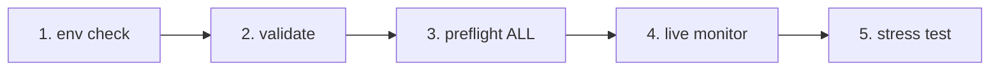

# IrsanAI TPM エージェント Forge
[🇬🇧 English](../../README.md) | [🇩🇪 Deutsch](../../README.de.md) | [🇪🇸 Español](../../docs/i18n/README.es.md) | [🇮🇹 Italiano](../../docs/i18n/README.it.md) | [🇧🇦 Bosanski](../../docs/i18n/README.bs.md) | [🇷🇺 Русский](../../docs/i18n/README.ru.md) | [🇨🇳 中文](../../docs/i18n/README.zh-CN.md) | [🇫🇷 Français](../../docs/i18n/README.fr.md) | [🇧🇷 Português (BR)](../../docs/i18n/README.pt-BR.md) | [🇮🇳 हिन्दी](../../docs/i18n/README.hi.md) | [🇹🇷 Türkçe](../../docs/i18n/README.tr.md) | [🇯🇵 日本語](../../docs/i18n/README.ja.md)

[🇬🇧 English](../../README.md) | [🇩🇪 Deutsch](../../README.de.md) | [🇪🇸 Español](./README.es.md) | [🇮🇹 Italiano](./README.it.md) | [🇧🇦 Bosanski](./README.bs.md) | [🇷🇺 Русский](./README.ru.md) | [🇨🇳 中文](./README.zh-CN.md) | [🇫🇷 Français](./README.fr.md) | [🇧🇷 Português (BR)](./README.pt-BR.md) | [🇮🇳 हिन्दी](./README.hi.md) | [🇹🇷 Türkçe](./README.tr.md) | [🇯🇵 日本語](./README.ja.md)

クロスプラットフォームのランタイムオプションを備えた、自律的なマルチエージェントセットアップ（BTC、COFFEE など）向けのクリーンなブートストラップ。

## 含まれる内容

- `production/preflight_manager.py` – Alpha Vantage + フォールバックチェーンおよびローカルキャッシュによる堅牢な市場データソース検査。
- `production/tpm_agent_process.py` – 市場ごとのシンプルなエージェントループ。
- `production/tpm_live_monitor.py` – 任意のCSVウォームスタートとTermux通知を備えたライブBTCモニター。
- `core/tpm_scientific_validation.py` – バックテスト＋統計的検証パイプライン。
- `scripts/tpm_cli.py` – Termux/Linux/macOS/Windows用の統一ランチャー。
- `scripts/stress_test_suite.py` – フェイルオーバー／レイテンシストレステスト。
- `scripts/start_agents.sh`, `scripts/health_monitor_v3.sh` – プロセス運用ヘルパー。
- `core/scout.py`, `core/reserve_manager.py`, `core/init_db_v2.py` – 運用コアツール。

## ユニバーサルクイックスタート

```bash
python scripts/tpm_cli.py env
python scripts/tpm_cli.py validate
python scripts/tpm_cli.py preflight --market ALL
python scripts/tpm_cli.py live --history-csv btc_real_24h.csv --poll-seconds 3600
```

## ランタイムチェーンチェック（因果／順序の整合性）

デフォルトのリポジトリフローは、ライブ実行中の隠れ状態のドリフトや「偽の信頼」を避けるため、意図的に線形に設計されています。


```mermaid
flowchart LR
  A[1. env check] --> B[2. validate]
  B --> C[3. preflight ALL]
  C --> D[4. live monitor]
  D --> E[5. stress test]
```

### ゲートロジック（次のステップ実行前に満たすべき条件）
- **ゲート 1 – 環境:** Python／プラットフォームのコンテキストが正しいこと（`env`）。
- **ゲート 2 – 科学的整合性:** ベースラインモデルの挙動が再現可能であること（`validate`）。
- **ゲート 3 – ソース信頼性:** 市場データ＋フォールバックチェーンにアクセス可能であること（`preflight --market ALL`）。
- **ゲート 4 – ランタイム実行:** 既知の入力履歴でライブループが動作すること（`live`）。
- **ゲート 5 – 逆境下の信頼性:** ストレス下でもレイテンシ／フェイルオーバー目標が満たされること（`stress_test_suite.py`）。

✅ すでにコードで修正済み：CLIのpreflightは現在 `--market ALL` をサポートしており、クイックスタートおよびDockerフローと整合。

## ミッション選択（役割別CTA）

> **あなたはXですか？自分のレーンを選択してください。<60秒で開始可能です。**

| ペルソナ | 関心事項 | クリック先 | 最初のコマンド |
|---|---|---|---|
| 📈 **トレーダー** | 高速パルス、実行可能なランタイム | [`tpm_live_monitor.py`](./production/tpm_live_monitor.py) | `python scripts/tpm_cli.py live --history-csv btc_real_24h.csv --poll-seconds 3600` |
| 💼 **投資家** | 安定性、ソースの信頼性、回復力 | [`preflight_manager.py`](./production/preflight_manager.py) | `python scripts/tpm_cli.py preflight --market ALL` |
| 🔬 **研究者** | 証拠、テスト、統計的シグナル | [`tpm_scientific_validation.py`](./core/tpm_scientific_validation.py) | `python scripts/tpm_cli.py validate` |
| 🧠 **理論家** | 因果構造＋将来のアーキテクチャ | [`core/scout.py`](./core/scout.py) + [`Next Steps`](#next-steps) | `python scripts/tpm_cli.py validate` |
| 🛡️ **懐疑派（優先）** | 本番前に仮定を破る | [`stress_test_suite.py`](./scripts/stress_test_suite.py) + [`preflight_manager.py`](./production/preflight_manager.py) | `python scripts/tpm_cli.py preflight --market ALL && python scripts/stress_test_suite.py` |
| ⚙️ **オペレーター／DevOps** | 稼働時間、プロセスの健康状態、回復力 | [`start_agents.sh`](./scripts/start_agents.sh) + [`health_monitor_v3.sh`](./scripts/health_monitor_v3.sh) | `bash scripts/start_agents.sh` |

### 懐疑派チャレンジ（新規訪問者に推奨最初の操作）
**もし一つだけするなら、以下を実行してレポート出力を確認してください：**

```bash
python scripts/tpm_cli.py preflight --market ALL
python scripts/stress_test_suite.py
```

このレーンが納得できれば、リポジトリの他部分も共鳴するでしょう。

## プラットフォームノート

- **Android / Termux（Samsung等）**
  ```bash
  bash scripts/termux_bootstrap.sh
  cd ~/TPM-Agent
  python scripts/tpm_cli.py env
  python scripts/tpm_cli.py preflight --market ALL
  python scripts/tpm_cli.py live --history-csv btc_real_24h.csv --notify --vibrate-ms 1000
  ```
  直接Android（Termux）Web UIデモを行うには、Forgeランタイムをローカルで起動：
  ```bash
  cd ~/TPM-Agent
  bash scripts/termux_forge.sh start
  # 停止: bash scripts/termux_forge.sh stop
  # 状態: bash scripts/termux_forge.sh status
  ```
  スクリプトはブラウザ（利用可能なら）を自動起動し、バックグラウンドでサービスを維持します。
  Android上で `pydantic-core`/Rust または `scipy`/Fortran ビルドエラーが出た場合は、
  `python -m pip install -r requirements-termux.txt` （Termux安全セット、Rustツールチェーン不要）を使用してください。
  Webインターフェースでランタイムの開始／停止を制御可能で、進行状況バーが遷移状態を表示します。
- **iPhone（ベストエフォート）**: iSHやa-Shellなどのシェルアプリを使用してください。Termux固有の通知フックは利用できません。
- **Windows / Linux / macOS**: 同じCLIコマンドを使用。tmuxやスケジューラ／cronを使って永続化してください。

## Docker（クロスOS最も簡単な方法）

以下の順番でDockerを使用してください（推測不要）：

### ステップ1: Webランタイムイメージをビルド

```bash
docker compose build --no-cache tpm-forge-web
```

### ステップ2: Webダッシュボードサービスを起動

```bash
docker compose up tpm-forge-web
```

ブラウザで `http://localhost:8787` を開いてください（**`http://0.0.0.0:8787` ではありません**）。Uvicornは内部的に `0.0.0.0` にバインドしますが、クライアントは `localhost`（またはホストのLAN IP）を使う必要があります。

### ステップ3（オプションチェック）: 非Webサービスの理解

```bash
docker compose run --rm tpm-preflight
docker compose run --rm tpm-live
```

- `tpm-preflight` = ソース／接続チェック（CLI出力のみ）。
- `tpm-live` = ターミナルライブモニターのログ（CLI出力のみ、**Web UIなし**）。
- `tpm-forge-web` = FastAPI + ダッシュボードUI（レイアウト／進行状況／ランタイム制御付き）。

`tpm-preflight` で `ALPHAVANTAGE_KEY not set` が報告されても、COFFEEはフォールバック経由で動作します。

ページが空白に見える場合：
- APIを直接テスト：`http://localhost:8787/api/frame`
- FastAPIドキュメント：`http://localhost:8787/docs`
- ブラウザのハードリフレッシュ（`Ctrl+F5`）
- 必要ならWebサービスのみ再起動：`docker compose restart tpm-forge-web`

COFFEE品質向上のためのオプション：

```bash
export ALPHAVANTAGE_KEY="<your_key>"
docker compose run --rm tpm-preflight
```

## グリッチ予測＆モバイル通知

- Forgeライブコックピットは現在、各市場の短期見通し (`up/down/sideways`) と信頼度を `/api/markets/live` で公開。
- 市場グリッチ（加速度スパイク）を検知すると、ランタイムは以下をトリガー可能：
  - Termuxのトースト＋バイブレーション
  - オプションの通知／ビープフック
  - オプションのTelegramプッシュ（`config/config.yaml` にボットトークン／チャットID設定が必要）
- ダッシュボードの**Save Alerts**／**Test Alert** またはAPIで設定可能：
  - `GET /api/alerts/preferences`
  - `POST /api/alerts/preferences`
  - `POST /api/alerts/test`

## 検証

科学的検証パイプラインを実行：

```bash
python core/tpm_scientific_validation.py
```

生成物：
- `state/TPM_Scientific_Report.md`
- `state/TPM_test_results.json`

## ソース＆フォールオーバー

`production/preflight_manager.py` は以下をサポート：
- COFFEE用にまずAlpha Vantage（`ALPHAVANTAGE_KEY` が設定されている場合）
- TradingView＋Yahooのフォールバックチェーン
- ローカルキャッシュフォールバックは `state/latest_prices.json`

直接preflightを実行：

```bash
export ALPHAVANTAGE_KEY="<your_key>"
python production/preflight_manager.py --market ALL
```

障害ストレステストを実行（目標 `p95 < 1000ms`）：

```bash
python scripts/stress_test_suite.py
```

出力：`state/stress_test_report.json`

## ライブステータス：現在のTPMエージェントの機能

**現状：**
- Production Forgeウェブランタイムが利用可能（`production.forge_runtime:app`）。
- ファイナンスファーストの初期設定は **BTC + COFFEE** を使用。
- ライブフレーム、エージェント適合度、転送エントロピー、ドメインサマリーがウェブダッシュボードで閲覧可能。
- ユーザーはランタイム中に新たな市場エージェントを追加可能（`POST /api/agents`）。

**目標能力（必須項目）：**
- 明示的な受容閾値（精度／再現率／FPR／ドリフト）による実データベンチマーク。
- 自動安全モードの厳格なリフレクシブ・ガバナンスルール。
- バージョン管理されたドメイン別学習パターンの集合記憶ワークフロー。

**次の拡張段階：**
- すべてのエージェントに跨るレジームベースのポリシーオーケストレーター（トレンド／ショック／サイドウェイズ）。
- 医療や地震など金融以外のドメインパイロット。

## PRマージコンフリクトヘルパー

- マージチェックリスト（GitHubコンフリクト用）：`docs/MERGE_CONFLICT_CHECKLIST.de.md`

### 本日の対象範囲：Windows＋スマホ向けファイナンスTPM

- **Windows:** Forgeランタイム＋ウェブインターフェース＋Docker/PowerShell/クリックスタートが稼働中。
- **スマホ:** Android/Termuxライブモニタリングが稼働中；ウェブUIはモバイルでレスポンシブ。
- **リアルタイムマルチエージェント:** デフォルトでBTC＋COFFEEがアクティブ；ウェブUIで動的に市場を追加可能。
- **ソース境界ルール:** 要求された市場が組み込みソースでカバーされていない場合は、明示的なソースURL＋認証情報を提供。

## Windowsライブテスト（２パスシステム）

### パスA — 開発者／上級ユーザー（PowerShell, CMD, PyCharm, IDE）

```powershell
python -m venv .venv
.\.venv\Scripts\Activate.ps1
pip install -r requirements.txt
python scripts/tpm_cli.py forge-dashboard --open-browser --port 8787
```

### パスB — 低レベルユーザー（クリック＆スタート）

1. `scripts/windows_click_start.bat` をダブルクリック
2. スクリプトが利用可能な最善パスを自動選択：
   - Pythonが利用可能なら→venv＋pip＋ランタイム
   - そうでなければDocker Compose（可能なら）

技術的基盤：`scripts/windows_bootstrap.ps1`。

## Forge プロダクションウェブランタイム（BTC＋COFFEE、拡張可能）

はい、この機能は**既にリポジトリで開始済み**で拡張されています：

- デフォルトで1つのBTC向けおよび1つのCOFFEE向けファイナンスTPMエージェントで起動。
- ユーザーはウェブUI（`/api/agents`）から直接より多くの市場／エージェントを追加可能。
- 持続的なランタイムサービスとして動作し、ライブフレーム出力（`/api/frame`）による直感的な洞察を提供。

### 起動（ローカル）

```bash
uvicorn production.forge_runtime:app --host 0.0.0.0 --port 8787
# http://localhost:8787 を開く
```

### 起動（Docker）

```bash
docker compose up tpm-forge-web
# http://localhost:8787 を開く
```

## TPM プレイグラウンド（インタラクティブMVP）

ブラウザ上でTPMの挙動をインタラクティブに探索可能：

```bash
python -m http.server 8765
# http://localhost:8765/playground/index.html を開く
```

含まれる内容：
- 単一エージェント弱シグナル異常検出ビュー
- ミニスウォーム（BTC/COFFEE/VOL）コンセンサス圧力
- クロスドメイン転送共鳴（合成ファイナンス／天気／健康）

詳細は：`playground/README.md` を参照。

## 次のステップ

- クロスマーケット因果解析のための転送エントロピーモジュール。
- 歴史的パフォーマンスに基づくポリシーアップデートを行う最適化ツール。
- アラートチャネル（Telegram／Signal）＋起動時の永続化。

---

## IrsanAI ディープダイブ：TPMコアの複雑系における「思考」方法

### 1) ビジョナリー変換：トレーディングエージェントから普遍的TPMエコシステムへ

### IrsanAI-TPMアルゴリズムのユニークな点とは？（修正されたフレーミング）

TPMコアの作業仮説：

- 複雑でカオスなシステムでは、早期警告シグナルはしばしば**マイクロ残差**に隠れる：微小な偏差、弱い相関、ほぼ空のデータポイント。
- 古典的システムが `0` や「関連性不足」しか見ないところを、TPMは文脈の流れから**構造化された異常（グリッチパターン）**を探す。
- TPMは値そのものだけでなく、**時間を通した関係変化、ソース品質、レジーム、因果的近隣性**も評価する。

重要な正確性ノート：TPMは未来を魔法のように予測するのではありません。データ品質と検証ゲートが満たされた場合にのみ、**レジームシフト、ブレイクアウト、混乱を早期に確率的に検知**することを目指しています。

### ビッグに考える：なぜこれが金融を越えて拡張するのか

もしTPMが金融商品（インデックス／ティッカー／ISIN類似識別子、流動性、マイクロ構造）における弱い前兆パターンを検出できれば、同じ原理は多くの領域に一般化可能：

- **イベント／センサーストリーム＋コンテキストモデル＋異常レイヤー＋フィードバックループ**
- すべての職業はドメイン固有の特徴、ノード、相関、異常のある「市場」としてモデリング可能
- 専門化されたTPMエージェントは、局所的な職業倫理と論理を維持しつつ、ドメイン横断的に学習可能

### TPM ターゲット領域としての100職業

| # | 職業 | TPM データ類似物 | 異常／パターン検出ターゲット |
|---|---|---|---|
| 1 | 警察アナリスト | 事件ログ、地理時空間犯罪マップ、ネットワーク | 犯罪クラスター拡大の早期シグナル |
| 2 | 消防隊指揮官 | アラームチェーン、センサーフィード、天候、建物情報 | 火災・危険拡散の予測窓 |
| 3 | 救急救命士 | 出動理由、対応時間、病院負荷 | 緊急度ストレスの事前検知 |
| 4 | 救急医 | トリアージ流、バイタル、待機時間動態 | 臨床悪化の早期警告 |
| 5 | ICU看護師 | 換気／検査傾向、投薬反応 | 敗血症／ショックの微小シグナル同定 |
| 6 | 疫学者 | 症例数、移動性、廃水／検査データ | 感染爆発前の早期警告 |
| 7 | 家庭医 | EHRパターン、処方、フォローギャップ | 慢性リスク遷移の早期検出 |
| 8 | 臨床心理士 | セッション軌跡、言語マーカー、睡眠／活動 | 再発／危機指標の早期検出 |
| 9 | 製薬研究者 | 化合物スクリーニング、副作用プロファイル、ゲノム | 効能・副作用クラスターの発見 |
| 10 | バイオテクノロジスト | シーケンス／プロセス／細胞培養軌跡 | ドリフト・汚染リスク検出 |
| 11 | 気候科学者 | 大気／海洋時系列、衛星データ | 転換点前兆の把握 |
| 12 | 気象学者 | 気圧／湿度／風／レーダー場 | 局所的なカオス気象変動の予測 |
| 13 | 地震学者 | マイクロクエイク、応力場、センサー配列 | 大規模地震の前兆検出 |
| 14 | 火山学者 | ガス、震動、変形時系列 | 噴火確率窓の絞り込み |
| 15 | 水文学者 | 河川計測、降雨、土壌水分 | 突発洪水や干ばつの位相変化検知 |
| 16 | 海洋学者 | 海流、温度、塩分、浮標データ | 津波／エコシステム関連異常検出 |
| 17 | エネルギートレーダー | 負荷、スポット価格、天候、グリッド状態 | 価格／負荷ブレイクアウトの早期警告 |
| 18 | グリッド運用者 | 周波数、ライン状態、切り替えイベント | 連鎖故障リスク検知 |
| 19 | 風力発電事業者 | タービンテレメトリ、風場、メンテ記録 | 故障・性能ドリフト予測 |
| 20 | 太陽光発電事業者 | 日射量、インバータテレメトリ、熱負荷 | 劣化・出力異常検知 |
| 21 | 水道管理者 | 流量、品質センサー、消費パターン | 汚染・不足の早期検知 |
| 22 | 交通運用管理者 | 密度、衝突、多目的工事、イベント | 渋滞・事故拡大の予測 |
| 23 | 鉄道制御管理者 | 時刻表遵守、軌道状態、遅延連鎖 | システム的遅延連鎖の早期阻止 |
| 24 | 航空管制官 | 飛行経路、天候、スロット飽和 | 進路衝突やボトルネック検出 |
| 25 | 港湾物流管理者 | 係留時間、コンテナフロー、税関状況 | 供給障害の前兆検知 |
| 26 | サプライチェーン管理者 | ETA、在庫、需要パルス、リスクイベント | ブルウィップ・在庫切れ異常の最小化 |
| 27 | 製造リード | OEE、プロセステレメトリ、不良、設定時間 | 品質ドリフト・機械異常検知 |
| 28 | 品質エンジニア | 許容範囲分布、プロセス信号 | ほぼゼロ欠陥前兆検知 |
| 29 | ロボティクスエンジニア | 動作軌跡、アクチュエータ負荷、制御ループ | 制御不安定性／故障予測 |
| 30 | 航空整備士 | エンジン／飛行テレメトリ、メンテ歴 | コンポーネントレベルの予知保全 |
| 31 | 建設マネージャー | 進捗、天候、納期、IoTセンサー | 予定／コスト異常リスクの定量化 |
| 32 | 構造エンジニア | 荷重、振動、疲労／老朽指標 | 構造的急変の検出 |
| 33 | 都市計画者 | 移動性、人口統計、排出、土地利用 | 新興都市ストレスパターン検知 |
| 34 | 建築家 | 建物運用、占有率、エネルギー曲線 | 設計－使用不整合パターン検出 |
| 35 | 農家 | 土壌／天候／作物／市場データ | 疾病・収量異常の早期検出 |
| 36 | 農学者 | 衛星栄養／水分データ | 精密介入の早期ターゲット化 |
| 37 | 森林管理者 | 水分、害虫パターン、火災指標 | 森林損傷／火災の早期検知 |
| 38 | 水産管理者 | 漁獲記録、水質、移動 | 過剰漁獲／崩壊リスク検出 |
| 39 | 食品安全検査官 | 検査所見、コールドチェーンログ、供給経路 | 汚染チェーンの早期遮断 |
| 40 | エグゼクティブシェフ | 需要パルス、在庫状態、廃棄比率 | 腐敗・不足異常の最小化 |
| 41 | 小売業者 | POSストリーム、来店数、在庫回転率 | 需要急増・縮小パターン検知 |
| 42 | ECマネージャー | クリックストリーム、カート利用、返品 | 詐欺・離脱前兆パターン検出 |
| 43 | マーケティング分析官 | キャンペーン指標、セグメント反応曲線 | マイクロトレンドの早期検出 |
| 44 | セールスリード | パイプライン速度、タッチポイントグラフ | 取引リスク・タイミング機会の検知 |
| 45 | カスタマーサポートリード | チケット流、トピッククラスタ、SLAドリフト | エスカレーション・根本原因の波検知 |
| 46 | プロダクトマネージャー | 機能採用、リテンション、フィードバック | プロダクトマーケットミスマッチ早期検知 |
| 47 | UXリサーチャー | ヒートマップ、行動経路、離脱点 | 隠れた操作の摩擦を可視化 |
| 48 | ソフトウェアエンジニア | ログ、トレース、デプロイ指標 | 障害連鎖の事前検知 |
| 49 | サイト信頼性エンジニア | レイテンシ、エラーバジェット、飽和状況 | 劣化の事前検出 |
| 50 | サイバーセキュリティ分析官 | ネットワークフロー、IAMイベント、SIEMアラート | 攻撃経路・横展開の検知 |
| 51 | 不正検出分析官 | 取引グラフ、デバイス指紋 | 弱シグナル領域の不正検知 |
| 52 | 銀行リスクマネージャー | ポートフォリオ／マクロ／流動性エクスポージャー | ストレスレジームおよび集中リスク検知 |
| 53 | 保険アクチュアリー | クレームフロー、エクスポージャーマップ、気候リンク | クレーム波及・準備金ストレス予測 |
| 54 | 税務アドバイザー | 帳簿パターン、申告タイムライン | コンプライアンスリスク・最適化ルート検知 |
| 55 | 監査人 | 管理履歴、例外パターン | 会計異常の大規模検知 |
| 56 | 弁護士 | 事件年代記、先例グラフ、期限 | 訴訟リスク・判決パターン検知 |
| 57 | 裁判官／裁判管理者 | 事件数構成、サイクルタイム | 司法システムのボトルネック検出 |
| 58 | 矯正施設管理者 | 収容状況、事件ネットワーク、行動トレンド | 暴力・再犯クラスター検出 |
| 59 | 税関職員 | 貿易マニフェスト、申告、配送パターン | 密輸／脱税シグナル検知 |
| 60 | 防衛情報分析官 | ISRフィード、ロジスティクス、作戦テンポ | エスカレーション動態の早期検知 |
| 61 | 外交分析官 | イベントチェーン、通信シグナル | 地政学的レジームシフト検知 |
| 62 | 教師 | 学習進捗、出席、エンゲージメント | 退学リスクおよび支援ニーズ検出 |
| 63 | 校長 | パフォーマンスクラスタ、出席、資源 | システム学校ストレスパターン検出 |
| 64 | 大学講師 | コース活動、撤退、フィードバック | 学生の成功安定化の早期支援 |
| 65 | 教育研究者 | コホート軌跡、教育変数 | 頑健な介入効果の特定 |
| 66 | ソーシャルワーカー | ケースネットワーク、予約、リスクマーカー | 危機エスカレーション経路の検知 |
| 67 | NGOコーディネーター | フィールドレポート、援助フロー、ニーズ信号 | 効果ギャップ・ホットスポット変化の検出 |
| 68 | 雇用アドバイザー | スキルプロファイル、労働需要、移行 | ミスマッチ・スキルアップニーズ検知 |
| 69 | HRマネージャー | 採用／離職／パフォーマンス軌跡 | バーンアウト・定着リスクの早期検知 |
| 70 | リクルーター | ファネル率、スキル分類、市場パルス | 適合リスク・採用機会の検知 |
| 71 | 組織コンサルタント | 意思決定頻度、KPIドリフト、ネットワークパターン | チーム機能不全の早期検知 |
| 72 | プロジェクトマネージャー | マイルストーン、依存関係、ブロッカーグラフ | 予定／範囲破綻の予測 |
| 73 | ジャーナリスト | ソース信頼グラフ、イベントストリーム | ミスインフォメーションクラスタの早期検出 |
| 74 | 調査報道記者 | 文書ネットワーク、資金／通信痕跡 | 隠れたシステム的異常の暴露 |
| 75 | コンテンツモデレーター | 投稿／コメントストリーム、意味変化 | 悪用／過激化の波の早期検知 |
| 76 | アーティスト | オーディエンス反応軌跡、スタイルベクトル | 新興美学の検出 |
| 77 | 音楽プロデューサー | リスニング特徴、アレンジメントベクトル | ブレイクアウト／ニッチ可能性の早期検知 |
| 78 | ゲームデザイナー | テレメトリ、進行状況、離脱曲線 | フラストレーション・バランス異常の検出 |
| 79 | スポーツコーチ | パフォーマンス／生体負荷ストリーム | ケガ・フォーム低下の前兆検知 |
| 80 | アスレチックトレーナー | 動作／回復マーカー | 過負荷の事前検知 |
| 81 | スポーツ医師 | 診断、リハビリ負荷、再発リスク | 復帰ウィンドウの最適化 |
| 82 | 審判分析官 | 決定ストリーム、テンポ、事件文脈 | 一貫性／公正性ドリフト検知 |
| 83 | イベントマネージャー | チケット、移動、天候、安全フィード | 群衆・安全リスクのエスカレーション検知 |
| 84 | 観光マネージャー | 予約パターン、評価シグナル | 需要および感情の変化検知 |
| 85 | ホテルマネージャー | 稼働率、サービス品質、苦情 | 品質・需要の不安定性の早期検知 |
| 86 | 物件管理者 | 家賃フロー、メンテ、市場比較 | 空室／滞納リスクの早期検知 |
| 87 | 設備管理者 | 建物IoT、エネルギー、メンテ間隔 | 故障・非効率パターン検知 |
| 88 | 廃棄物管理業者 | 廃棄物流、ルート、環境指標 | 不法投棄・プロセスギャップ検知 |
| 89 | 環境検査官 | 排出量、報告、衛星オーバーレイ | 遵守違反・転換点リスク検知 |
| 90 | 循環経済アナリスト | 材料パスポート、回収率 | 流出・ループ閉鎖機会検知 |
| 91 | 天体物理学者 | 望遠鏡データ、スペクトル、ノイズモデル | 稀有宇宙イベント検出 |
| 92 | 宇宙運用エンジニア | テレメトリ、軌道パラメータ、システム診断 | 重要ミッション異常の早期検出 |
| 93 | 量子エンジニア | ノイズプロファイル、キャリブレーションドリフト、ゲート誤差 | デコヒーレンス・制御ドリフト検出 |
| 94 | データサイエンティスト | 特徴ドリフト、モデル品質、データ整合性 | モデル崩壊・バイアス変化の検知 |
| 95 | AI倫理学者 | 意思決定結果、公平性指標 | 不公平パターン・ガバナンスギャップ検知 |
| 96 | 科学哲学研究者 | 理論－証拠経路 | パラダイム不整合シグナル検知 |
| 97 | 数学者 | 残差構造、不変量、誤差項 | 隠れた規則性／外れ値クラス検出 |
| 98 | システム理論家 | ノード－エッジ動態、フィードバック遅延 | ネットワーク転換点動態の検知 |
| 99 | 人類学者 | フィールド観察、言語／社会ネットワーク | 文化変化・対立前兆検出 |
| 100 | 予測戦略家 | 技術曲線、規制、行動データ | シナリオと早期指標の接続 |

### 国別適合メモ（職業の管轄間相当）

リストの論理的正確性を保つため、TPMの役割マッピングは**機能的相当物**として解釈すべきで、直訳の職名ではありません：

- **ドイツ ↔ 米国／英国:** `Polizei` と職務分割（`Police Department`、`Sheriff`、`State Trooper`）、検察の違い（`Staatsanwaltschaft` vs `District Attorney/Crown Prosecution`）。
- **スペイン／イタリア:** 民法制度で裁判・警察のワークフローが異なり、データパイプラインが地域と国家で分離される場合が多い。
- **ボスニア・ヘルツェゴビナ:** 複数政府体制によりデータ所有が断片化、TPMは連邦的異常融合の恩恵を受ける。
- **ロシア／中国:** 役割定義とデータガバナンス制約が異なり、TPMは地域のコンプライアンス境界と制度的等価物で設定される必要あり。
- **その他影響の大きい地域:** フランス、ブラジル、インド、日本、MENA諸国、サブサハラアフリカも相当する機能と利用可能なテレメトリをマッピングして導入可能。

### 哲学的・科学的展望

- ツールから**認識基盤へ**：ドメインが「弱い早期知識」を実践的に運用。
- 孤立系から**エージェント連邦へ**：局所倫理＋共有異常文法。
- 反応的対応から**先見的ガバナンスへ**：危機管理の後追いより予防重視。
- 静的モデルから**生きた理論へ**：実世界ショックに応じた継続的再調整。

核となる考え：責任あるTPMクラスタはカオスを制御できないが、早期理解、より堅牢な舵取り、より人道的な意思決定を支援する。

## 多言語展開（進行中）

言語間の共鳴を支援するため、以下の地域別概要が利用可能：

- スペイン語 (`docs/i18n/README.es.md`)
- イタリア語 (`docs/i18n/README.it.md`)
- ボスニア語 (`docs/i18n/README.bs.md`)
- ロシア語 (`docs/i18n/README.ru.md`)
- 中国語簡体字 (`docs/i18n/README.zh-CN.md`)
- フランス語 (`docs/i18n/README.fr.md`)
- ポルトガル語ブラジル (`docs/i18n/README.pt-BR.md`)
- ヒンディー語 (`docs/i18n/README.hi.md`)
- トルコ語 (`docs/i18n/README.tr.md`)
- 日本語 (`docs/i18n/README.ja.md`)

それぞれのローカライズファイルには地域適合ノートが含まれ、この英語の正典セクション（100職業マトリックス）へのリンクがあります。

## IrsanAI クオリティメタ（SOLL vs IST）

リポジトリの現成熟度、品質中間報告および実ユーザー期待に基づく因果ロードマップは以下参照：

- `docs/IRSANAI_QUALITY_META.md`

本ドキュメントは以下のリファレンスです：
- 機能の要求深度（UX/UI＋運用堅牢性）
- Docker／Androidパリティ要件
- 今後のPRの受容品質ゲート

## i18n パリティモード（フルミラー）

言語コミュニティの不利益を防ぐため、i18nファイルは`README.md`と完全な正典パリティで管理されています。

同期コマンド：

```bash
python scripts/i18n_full_mirror_sync.py
```

## 開発者向け注意（LOP – 未解決項目リスト）

私見で未解決の技術的にブロックされていない事項：

| 項目 | 現状 | 継続方法 |
|---|---|---|
| **クロスマーケット因果の転送エントロピーモジュール** | **済 ✅** – `TransferEntropyEngine` として実装済み、Forgeオーケストレータに組込済。 | 専門的調整追加：ドメイン別閾値と解釈規則を定義。 |
| **歴史に基づくOptimizer/Policy Update** | **済 ✅** – フィットネススコアリング、報酬アップデート、候補選択がティックサイクル内で稼働中。 | 動作モード文書化（保守的／攻撃的）とガバナンスプロファイルとしてテスト可能に。 |
| **アラート機能（Telegram/Signal）** | **一部完了 🟡** – インフラは存在するがデフォルトは無効。 | アラートポリシー設定：対象イベント、重要度、チャネル、応答者。 |
| **起動永続化／長期運用** | **一部完了 🟡** – tmuxによる起動・ヘルスモニターはあるが、全プラットフォーム共通の起動ランブックは未整備。 | プラットフォームプロファイル（Termux/Linux/Docker）に起動時起動、再起動ポリシー、エスカレーション道筋を文書化。 |
| **調整型メタレイヤー（「次の拡張段階(promoted)」に基づく）** | **一部完了 🟡** – 一部（オーケストレータ＋エントロピー＋報酬）はあるが、完全なレジームポリシーオーケストレーター記述は未実施。 | エージェント重み付けのための専門的なトレンド／ショック／サイドウェイズ制御モデル追加。 |
| **集合記憶（バージョン対応学習パターンアーカイブ）** | **未完了 🔴** – ビジョン／次代展開で言及済みだが、明確な保存・レビュー手続き未整備。 | 学習パターンフォーマット、バージョン管理論理、品質基準（パターンの「有効」条件）を定義。 |
| **リフレクシブ・ガバナンス（不確実性時の自動保守モード）** | **未完了 🔴** – 目標イメージとして掲げられているが、専門的決定ルールとして形式化されていない。 | 不確実性指標と厳格な切替条件をガバナンスルールに落とし込み。 |
| **ファイナンス／天気以外のドメイン拡張** | **未完了 🔴** – さらなるドメインはビジョン／テンプレートで用意済みだが、実データ契約に未変換。 | 次ドメインパイロット（例：医療、地震）を明確なメトリクス／データソース付きで開始。 |
| **実データに関する科学的証拠の拡大** | **未完了 🔴** – 現状は合成レジームセグメント上で堅牢だが、実データベンチマークは未実施。 | 実データベンチマークを固定受容条件（精度／再現率／FPR／ドリフト）で追加。 |
| **多言語共鳴／i18n拡充** | **一部完了 🟡** – 複数言語ランディングページあり。拡充は「進行中」と明示。 | 同期プロセスの定義（ルートREADMEからi18nREADMEへの変更伝播時期）。 |

総括：以前の「次のステップ」は**技術面でほぼ開始または完了しており**、現在の最大の課題は**専門的実装（ガバナンス、ポリシー、ドメインロジック、実データ証拠）と一貫した文書／i18n運用**。

### LOP 実行計画

実装の順序、達成基準、証拠ゲートは以下を参照：

- `docs/LOP_EXECUTION_PLAN.md`

## LOP（終章－優先順位付け）

1. **P1 実データ証拠の強化：** 固定受容条件によるベンチマーク（精度／再現率／FPR／ドリフト）。
2. **P2 リフレクシブ・ガバナンス最終化：** 不確実性時の厳格自動安全モードルール。
3. **P3 集合記憶標準化：** バージョン管理された学習パターンとドメイン別レビュープロセス。
4. **P4 Web没入型展開の継続：** 新しいレスポンシブレイアウトに基づくさらに多くのTPM業種向けロールビュー。

**プラットフォーム注意点：** 現時点で主に **Windows＋スマホ** 向け。**LOP完了時点でmacOS、Linux他プラットフォームプロファイルを追加予定。**