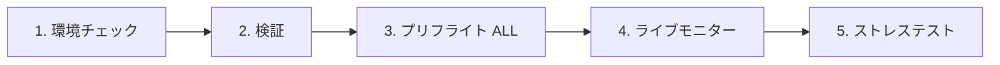

# IrsanAI TPM エージェントフォージ

[🇬🇧 English](./README.md) | [🇩🇪 Deutsch](./README.de.md) | [🇪🇸 Español](./docs/i18n/README.es.md) | [🇮🇹 Italiano](./docs/i18n/README.it.md) | [🇧🇦 Bosanski](./docs/i18n/README.bs.md) | [🇷🇺 Русский](./docs/i18n/README.ru.md) | [🇨🇳 中文](./docs/i18n/README.zh-CN.md) | [🇫🇷 Français](./docs/i18n/README.fr.md) | [🇧🇷 Português (BR)](./docs/i18n/README.pt-BR.md) | [🇮🇳 हिन्दी](./docs/i18n/README.hi.md) | [🇹🇷 Türkçe](./docs/i18n/README.tr.md) | [🇯🇵 日本語](./docs/i18n/README.ja.md)

自律型マルチエージェント設定（BTC、COFFEEなど）とクロスプラットフォームランタイムオプションのためのクリーンなブートストラップ。

## 含まれるもの

- `production/preflight_manager.py` – Alpha Vantage とフォールバックチェーン、ローカルキャッシュフォールバックによる回復力のある市場ソースプローブ。
- `production/tpm_agent_process.py` – 市場ごとのシンプルなエージェントループ。
- `production/tpm_live_monitor.py` – オプションの CSV ウォームスタートと Termux 通知を備えたライブ BTC モニター。
- `core/tpm_scientific_validation.py` – バックテスト + 統計的検証パイプライン。
- `scripts/tpm_cli.py` – Termux/Linux/macOS/Windows 用の統合ランチャー。
- `scripts/stress_test_suite.py` – フェイルオーバー/レイテンシーストレステスト。
- `scripts/start_agents.sh`, `scripts/health_monitor_v3.sh` – プロセス操作ヘルパー。
- `core/scout.py`, `core/reserve_manager.py`, `core/init_db_v2.py` – 運用コアツール。

## ユニバーサルクイックスタート

```bash
python scripts/tpm_cli.py env
python scripts/tpm_cli.py validate
python scripts/tpm_cli.py preflight --market ALL
python scripts/tpm_cli.py live --history-csv btc_real_24h.csv --poll-seconds 3600
```

## ランタイムチェーンチェック（因果/順序の健全性）

デフォルトのリポジトリフローは、ライブ実行中の隠れた状態のドリフトと「誤った信頼」を避けるために意図的に線形です。


```mermaid
flowchart LR
  A[1. 環境チェック] --> B[2. 検証]
  B --> C[3. プリフライト ALL]
  C --> D[4. ライブモニター]
  D --> E[5. ストレステスト]
```

### ゲートロジック（次のステップに進む前に真でなければならないこと）
- **ゲート1 – 環境:** Python/プラットフォームのコンテキストが正しいこと (`env`)。
- **ゲート2 – 科学的健全性:** ベースラインモデルの動作が再現可能であること (`validate`)。
- **ゲート3 – ソースの信頼性:** 市場データ + フォールバックチェーンに到達可能であること (`preflight --market ALL`)。
- **ゲート4 – ランタイム実行:** ライブループが既知の入力履歴で実行されること (`live`)。
- **ゲート5 – 敵対的信頼性:** レイテンシー/フェイルオーバーターゲットがストレス下で保持されること (`stress_test_suite.py`)。

✅ コードで修正済み: CLI プリフライトが `--market ALL` をサポートし、クイックスタート + Docker フローと一致しています。

## ミッションを選択してください（役割ベースのCTA）

> **あなたはXですか？あなたのレーンをクリックしてください。60秒以内に開始できます。**

| ペルソナ | 気になること | クリックパス | 最初のコマンド |
|---|---|---|---|
| 📈 **トレーダー** | 迅速な判断、実用的なランタイム | [`tpm_live_monitor.py`](./production/tpm_live_monitor.py) | `python scripts/tpm_cli.py live --history-csv btc_real_24h.csv --poll-seconds 3600` |
| 💼 **投資家** | 安定性、ソースの信頼、回復力 | [`preflight_manager.py`](./production/preflight_manager.py) | `python scripts/tpm_cli.py preflight --market ALL` |
| 🔬 **科学者** | 証拠、テスト、統計的シグナル | [`tpm_scientific_validation.py`](./core/tpm_scientific_validation.py) | `python scripts/tpm_cli.py validate` |
| 🧠 **理論家** | 因果構造 + 将来のアーキテクチャ | [`core/scout.py`](./core/scout.py) + [`次のステップ`](#次のステップ) | `python scripts/tpm_cli.py validate` |
| 🛡️ **懐疑論者（優先）** | 本番稼働前に仮定を破壊する | [`stress_test_suite.py`](./scripts/stress_test_suite.py) + [`preflight_manager.py`](./production/preflight_manager.py) | `python scripts/tpm_cli.py preflight --market ALL && python scripts/stress_test_suite.py` |
| ⚙️ **オペレーター / DevOps** | アップタイム、プロセスヘルス、復旧性 | [`start_agents.sh`](./scripts/start_agents.sh) + [`health_monitor_v3.sh`](./scripts/health_monitor_v3.sh) | `bash scripts/start_agents.sh` |

### 懐疑論者の挑戦（新規訪問者には最初にお勧め）
**これだけ**を行う場合、これを実行し、レポート出力を確認してください。

```bash
python scripts/tpm_cli.py preflight --market ALL
python scripts/stress_test_suite.py
```

このレーンで納得できれば、リポジトリの残りの部分も同様に響くでしょう。

## プラットフォームに関する注意点

- **Android / Termux (Samsungなど)**
  ```bash
  bash scripts/termux_bootstrap.sh
  cd ~/TPM-Agent
  python scripts/tpm_cli.py env
  python scripts/tpm_cli.py preflight --market ALL
  python scripts/tpm_cli.py live --history-csv btc_real_24h.csv --notify --vibrate-ms 1000
  ```
  直接 Android (Termux) ウェブ UI デモの場合、Forge ランタイムをローカルで開始します。
  ```bash
  cd ~/TPM-Agent
  bash scripts/termux_forge.sh start
  # 停止: bash scripts/termux_forge.sh stop
  # ステータス: bash scripts/termux_forge.sh status
  ```
  スクリプトはブラウザを自動的に開き（利用可能な場合）、サービスをバックグラウンドで実行し続けます。
  Android で `pydantic-core`/Rust または `scipy`/Fortran ビルドエラーが発生した場合は、
  `python -m pip install -r requirements-termux.txt` を使用してください (Termux-safe セット、Rust ツールチェーンは不要)。
  ウェブインターフェースでランタイムの開始/停止を制御できます。プログレスバーは遷移ステータスを表示します。
- **iPhone (最大限の努力)**: iSH / a-Shell などのシェルアプリを使用してください。Termux 固有の通知フックは利用できません。
- **Windows / Linux / macOS**: 同じ CLI コマンドを使用します。永続性のために tmux/scheduler/cron 経由で実行します。

## Docker (クロスOSで最も簡単なパス)

Docker をこの正確な順序で使用してください (推測なし):

### ステップ 1: ウェブランタイムイメージをビルドする

```bash
docker compose build --no-cache tpm-forge-web
```

### ステップ 2: ウェブダッシュボードサービスを開始する

```bash
docker compose up tpm-forge-web
```

次に、ブラウザで `http://localhost:8787` を開きます (**`http://0.0.0.0:8787` ではありません**)。Uvicorn は内部で `0.0.0.0` にバインドしますが、クライアントは `localhost` (またはホストの LAN IP) を使用する必要があります。

### ステップ 3 (オプションのチェック): 非ウェブサービスを理解する

```bash
docker compose run --rm tpm-preflight
docker compose run --rm tpm-live
```

- `tpm-preflight` = ソース/接続チェック (CLI 出力のみ)。
- `tpm-live` = ターミナルライブモニターログ (CLI 出力のみ、**ウェブ UI なし**)。
- `tpm-forge-web` = FastAPI + ダッシュボード UI (レイアウト/進捗/ランタイム制御のあるもの)。

`tpm-preflight` が `ALPHAVANTAGE_KEY not set` と報告しても、COFFEE はフォールバック経由で機能します。

ページが空白の場合:
- API を直接テスト: `http://localhost:8787/api/frame`
- FastAPI ドキュメントをテスト: `http://localhost:8787/docs`
- ブラウザをハードリフレッシュ (`Ctrl+F5`)
- 必要に応じて、ウェブサービスのみを再起動: `docker compose restart tpm-forge-web`

COFFEE の品質を向上させるためのオプション:

```bash
export ALPHAVANTAGE_KEY="<your_key>"
docker compose run --rm tpm-preflight
```

## グリッチ予測とモバイルアラート

- Forge ライブコックピットは、`/api/markets/live` で信頼度を伴う市場ごとの短期見通し (`up/down/sideways`) を公開するようになりました。
- 市場のグリッチが検出された場合（加速度スパイク）、ランタイムは以下をトリガーできます。
  - Termux トースト + 振動
  - オプションの通知/ビープ音フック
  - オプションの Telegram プッシュ（`config/config.yaml` でボットトークン/チャット ID が設定されている場合）。
- ダッシュボードで **アラートを保存** / **アラートをテスト** または API 経由で設定します。
  - `GET /api/alerts/preferences`
  - `POST /api/alerts/preferences`
  - `POST /api/alerts/test`

## 検証

科学的検証パイプラインを実行します。

```bash
python core/tpm_scientific_validation.py
```

成果物:
- `state/TPM_Scientific_Report.md`
- `state/TPM_test_results.json`

## ソースとフェイルオーバー

`production/preflight_manager.py` は以下をサポートします。
- COFFEE の場合は Alpha Vantage が最初（`ALPHAVANTAGE_KEY` が設定されている場合）
- TradingView + Yahoo フォールバックチェーン
- `state/latest_prices.json` にローカルキャッシュされたフォールバック

プリフライトを直接実行します。

```bash
export ALPHAVANTAGE_KEY="<your_key>"
python production/preflight_manager.py --market ALL
```

停止ストレステストを実行します（ターゲット `p95 < 1000ms`）。

```bash
python scripts/stress_test_suite.py
```

出力: `state/stress_test_report.json`


## ライブステータス：TPMエージェントが今日できること

**現在の状態:**
- 本番 Forge ウェブランタイムが利用可能です (`production.forge_runtime:app`)。
- 金融優先の開始設定では、**BTC + COFFEE** を使用します。
- ライブフレーム、エージェントの適応度、転送エントロピー、およびドメインの概要がウェブダッシュボードで確認できます。
- ユーザーはランタイムで新しい市場エージェントを追加できます (`POST /api/agents`)。

**目標機能（あるべき姿）:**
- 明示的な許容しきい値（精度/再現率/FPR/ドリフト）による実データベンチマーク。
- 自動セーフモードのための厳格な反射的ガバナンスルール。
- バージョン管理されたドメインごとの学習パターンに対する集合的記憶ワークフロー。

**次の拡張段階:**
- すべてのエージェントにわたるレジームベースのポリシーオーケストレーター（トレンド/ショック/横ばい）。
- 明示的なデータ契約を持つ非金融ドメインパイロット（例：医療または地震）。


## PRマージ競合ヘルパー

- マージチェックリスト（GitHubの競合）：`docs/MERGE_CONFLICT_CHECKLIST.de.md`


### 今日の範囲：Windows + 金融TPM用スマートフォン

- **Windows:** Forge ランタイム + ウェブインターフェース + Docker/PowerShell/クリックスタートが動作しています。
- **スマートフォン:** Android/Termux ライブ監視が動作しています。ウェブ UI はモバイルで応答します。
- **リアルタイムマルチエージェント:** BTC + COFFEE がデフォルトでアクティブ。追加の市場はウェブ UI で動的に追加できます。
- **ソース境界ルール:** 要求された市場が組み込みソースでカバーされていない場合、明示的なソース URL + 認証データを提供します。

## Windows ライブテスト (2つのパスシステム)

### パス A — 開発者/パワーユーザー (PowerShell, CMD, PyCharm, IDE)

```powershell
python -m venv .venv
.\.venv\Scripts\Activate.ps1
pip install -r requirements.txt
python scripts/tpm_cli.py forge-dashboard --open-browser --port 8787
```

### パス B — 低レベルユーザー (クリック＆スタート)

1. `scripts/windows_click_start.bat` をダブルクリックする
2. スクリプトが利用可能な最良のパスを自動選択します:
   - Python が利用可能 -> venv + pip + ランタイム
   - それ以外の場合は Docker Compose (利用可能な場合)

技術的な基盤: `scripts/windows_bootstrap.ps1`。

## Forge Production Web Runtime (BTC + COFFEE, 拡張可能)

はい、これはリポジトリ内で**すでに開始されており**、現在拡張されています。

- デフォルトでは、**BTC** 用と **COFFEE** 用の金融 TPM エージェントをそれぞれ1つずつで起動します。
- ユーザーは Web UI (`/api/agents`) から直接、より多くの市場/エージェントを追加できます。
- 没入型の洞察のために、ライブフレーム出力 (`/api/frame`) を備えた永続的なランタイムサービスとして実行されます。

### 起動 (ローカル)

```bash
uvicorn production.forge_runtime:app --host 0.0.0.0 --port 8787
# http://localhost:8787 を開く
```

### 起動 (Docker)

```bash
docker compose up tpm-forge-web
# http://localhost:8787 を開く
```

## TPM プレイグラウンド (インタラクティブ MVP)

ブラウザで TPM の動作をインタラクティブに探索できるようになりました。

```bash
python -m http.server 8765
# http://localhost:8765/playground/index.html を開く
```

含まれるもの:
- 単一エージェントの微弱シグナル異常ビュー
- ミニスワーム (BTC/COFFEE/VOL) コンセンサス圧力
- クロスドメイン転送共鳴 (合成金融/気象/健康)

参照: `playground/README.md`。
## 次のステップ

- クロスマーケット因果分析のための転送エントロピーモジュール。
- 過去のパフォーマンスに基づいたポリシー更新を伴うオプティマイザー。
- アラートチャネル（Telegram/Signal）+ ブート永続性。


---

## IrsanAI ディープダイブ：複雑なシステムにおける TPM コアの「思考」

### 1) 先見的な変革：トレーディングエージェントからユニバーサル TPM エコシステムへ

### IrsanAI-TPM アルゴリズムのユニークな点は何ですか？（修正されたフレームワーク）

TPM コアの作業仮説：

- 複雑で混沌としたシステムでは、早期警戒信号はしばしば**マイクロ残差**に隠されています。つまり、わずかな偏差、弱い相関、ほとんど空のデータポイントです。
- 従来のシステムが「0」または「十分な関連性がない」としか見なさない場所で、TPM はコンテキストフロー内の**構造化された異常**（グリッチパターン）を検索します。
- TPM は、値そのものだけでなく、**時間の経過に伴う関係の変化、ソースの品質、レジーム、および因果関係の近傍**も評価します。

重要な正確性の注意：TPM は未来を魔法のように予測するものでは**ありません**。データ品質と検証ゲートが満たされている場合に、レジームシフト、ブレイクアウト、および混乱の**より早期の確率的検出**を目指します。

### 大きく考える：なぜこれが金融以外にも広がるのか

TPM が金融商品（インデックス/ティッカー/ISINのような識別子、流動性、ミクロ構造）における弱い先行パターンを検出できる場合、同じ原則は多くのドメインに一般化できます。

- **イベント/センサー ストリーム + コンテキスト モデル + 異常