# IrsanAI TPM Agent Forge

[🇬🇧 English](../../README.md) | [🇩🇪 Deutsch](../../README.de.md) | [🇪🇸 Español](./README.es.md) | [🇮🇹 Italiano](./README.it.md) | [🇧🇦 Bosanski](./README.bs.md) | [🇷🇺 Русский](./README.ru.md) | [🇨🇳 中文](./README.zh-CN.md) | [🇫🇷 Français](./README.fr.md) | [🇧🇷 Português (BR)](./README.pt-BR.md) | [🇮🇳 हिन्दी](./README.hi.md) | [🇹🇷 Türkçe](./README.tr.md) | [🇯🇵 日本語](./README.ja.md)

BTC・COFFEE などを対象にした自律マルチエージェント構成を、クロスプラットフォームで動かせるクリーンなブートストラップです。

## 含まれる内容

- `production/preflight_manager.py` – resilient market source probing with Alpha Vantage + fallback chain and local cache fallback.
- `production/tpm_agent_process.py` – simple per-market agent loop.
- `production/tpm_live_monitor.py` – live BTC monitor with optional CSV warm-start and Termux notifications.
- `core/tpm_scientific_validation.py` – backtest + statistical validation pipeline.
- `scripts/tpm_cli.py` – unified launcher for Termux/Linux/macOS/Windows.
- `scripts/stress_test_suite.py` – failover/latency stress test.
- `scripts/start_agents.sh`, `scripts/health_monitor_v3.sh` – process ops helpers.
- `core/scout.py`, `core/reserve_manager.py`, `core/init_db_v2.py` – operational core tooling.

## ユニバーサル・クイックスタート

```bash
python scripts/tpm_cli.py env
python scripts/tpm_cli.py validate
python scripts/tpm_cli.py preflight --market ALL
python scripts/tpm_cli.py live --history-csv btc_real_24h.csv --poll-seconds 3600
```

## ランタイムチェーン確認（因果/順序の健全性）

デフォルトのリポジトリフローは、ライブ実行時の隠れ状態ドリフトと「誤った確信」を避けるため、意図的に線形です。

```mermaid
flowchart LR
  A[1. 環境チェック] --> B[2. 検証]
  B --> C[3. preflight ALL]
  C --> D[4. ライブ監視]
  D --> E[5. ストレステスト]
```



### ゲートロジック（次のステップ前に満たす条件）
- **Gate 1 – 環境:** Python/プラットフォームの文脈が正しい（`env`）。
- **Gate 2 – 科学的妥当性:** ベースラインモデル挙動は再現可能（`validate`）。
- **Gate 3 – ソース信頼性:** 市場データ + フォールバックチェーンに到達可能（`preflight --market ALL`）。
- **Gate 4 – ランタイム実行:** 既知の入力履歴で live ループが動作（`live`）。
- **Gate 5 – 敵対的信頼性:** latency/failover 目標がストレス下でも維持（`stress_test_suite.py`）。

✅ コードで修正済み：CLI preflight は `--market ALL` をサポートし、quickstart + docker フローに一致します。

## ミッションを選ぶ（ロール別CTA）

> **あなたはXですか？自分のレーンを選んで、60秒以内に開始。**

| ペルソナ | 重視する点 | 導線 | 最初のコマンド |
|---|---|---|---|
| 📈 **Trader** | Fast pulse, actionable runtime | [`tpm_live_monitor.py`](./production/tpm_live_monitor.py) | `python scripts/tpm_cli.py live --history-csv btc_real_24h.csv --poll-seconds 3600` |
| 💼 **Investor** | Stability, source trust, resilience | [`preflight_manager.py`](./production/preflight_manager.py) | `python scripts/tpm_cli.py preflight --market ALL` |
| 🔬 **Scientist** | Evidence, tests, statistical signal | [`tpm_scientific_validation.py`](./core/tpm_scientific_validation.py) | `python scripts/tpm_cli.py validate` |
| 🧠 **Theoretician** | Causal structure + future architecture | [`core/scout.py`](./core/scout.py) + [`次のステップ`](#次のステップ) | `python scripts/tpm_cli.py validate` |
| 🛡️ **Skeptic (priority)** | Break assumptions before production | [`stress_test_suite.py`](./scripts/stress_test_suite.py) + [`preflight_manager.py`](./production/preflight_manager.py) | `python scripts/tpm_cli.py preflight --market ALL && python scripts/stress_test_suite.py` |
| ⚙️ **Operator / DevOps** | Uptime, process health, recoverability | [`start_agents.sh`](./scripts/start_agents.sh) + [`health_monitor_v3.sh`](./scripts/health_monitor_v3.sh) | `bash scripts/start_agents.sh` |

### スケプティック・チャレンジ（新規訪問者に推奨）
**ひとつだけ**実行するなら、これを動かしてレポート出力を確認してください：

```bash
python scripts/tpm_cli.py preflight --market ALL
python scripts/stress_test_suite.py
```

このレーンで納得できれば、リポジトリの他の部分もおそらくしっくりくるはずです。

## プラットフォームノート

- **Android / Termux（Samsung など）**
  ```bash
  pkg install termux-api -y
  python scripts/tpm_cli.py live --history-csv btc_real_24h.csv --notify --vibrate-ms 1000
  ```
- **iPhone（ベストエフォート）:** iSH / a-Shell などのシェルアプリを使用。Termux 固有の通知フックは利用できません。
- **Windows / Linux / macOS**: 同じ CLI コマンドを使用し、永続運用には tmux/scheduler/cron 経由で実行します。

## Docker（クロスOSで最も簡単な方法）

```bash
docker compose run --rm tpm-preflight
docker compose run --rm tpm-live
```

COFFEE ソース品質向上のための任意設定：

```bash
export ALPHAVANTAGE_KEY="<your_key>"
docker compose run --rm tpm-preflight
```

## 検証

科学的バリデーションパイプラインを実行：

```bash
python core/tpm_scientific_validation.py
```

Artifacts:
- `state/TPM_Scientific_Report.md`
- `state/TPM_test_results.json`

## ソースとフェイルオーバー

`production/preflight_manager.py` supports:
- Alpha Vantage first for COFFEE (when `ALPHAVANTAGE_KEY` is set)
- TradingView + Yahoo fallback chain
- local cached fallback in `state/latest_prices.json`

Run preflight directly:

```bash
export ALPHAVANTAGE_KEY="<your_key>"
python production/preflight_manager.py --market ALL
```

Run outage stress test (target `p95 < 1000ms`):

```bash
python scripts/stress_test_suite.py
```

Output: `state/stress_test_report.json`


## Forge Production Web Runtime (BTC + COFFEE, extensible)

This runtime is now synchronized with the EN/DE canonical versions:

- Starts by default with one finance TPM agent for **BTC** and one for **COFFEE**.
- Users can add more markets/agents directly in the web UI (`/api/agents`).
- Runs as a persistent service with live frame visibility (`/api/frame`).

### Start (local)

```bash
uvicorn production.forge_runtime:app --host 0.0.0.0 --port 8787
# open http://localhost:8787
```

### Start (Docker)

```bash
docker compose up tpm-forge-web
# open http://localhost:8787
```

## TPM Playground（インタラクティブMVP）

ブラウザで TPM の挙動をインタラクティブに確認できます：

```bash
python -m http.server 8765
# open http://localhost:8765/playground/index.html
```

含まれるもの：
- 単一エージェントの弱信号アノマリービュー
- ミニスウォーム（BTC/COFFEE/VOL）のコンセンサス圧
- クロスドメイン転移共鳴（合成：金融/天気/ヘルス）

See: `playground/README.md`.
## 次のステップ

- クロスマーケット因果分析のための Transfer Entropy モジュール。
- 履歴パフォーマンスに基づくポリシー更新付きオプティマイザ。
- Alert channels (Telegram/Signal) + boot persistence.


---

## IrsanAI Deep Dive：複雑系でTPMコアがどう"考える"か

### 1) ビジョナリー転換：トレーディングエージェントから汎用TPMエコシステムへ

### IrsanAI-TPMアルゴリズムの独自性とは？（修正版フレーミング）

TPMコアの作業仮説：

- 複雑でカオスな系では、早期警告シグナルはしばしば **micro-residual**（微小偏差・弱い相関・ほぼ空のデータ点）に隠れます。
- 従来システムが `0` や「関連性不足」しか見ない箇所で、TPM は文脈フロー内の**構造化異常**（glitch パターン）を探索します。
- TPM は値そのものだけでなく、**時間的関係変化・ソース品質・レジーム・因果近傍**も評価します。

重要な正確性メモ：TPM は未来を魔法のように予測**しません**。データ品質と検証ゲートが満たされる場合に、レジーム変化・ブレイクアウト・破綻の**より早い確率的検知**を目指します。

### 大きく考える：なぜ金融を超えるのか

TPM が金融商品（index/ticker/ISIN 系識別子、流動性、マイクロ構造）の弱い前駆パターンを検知できるなら、同じ原理は多くのドメインへ一般化できます：

- **Event/sensor stream + context model + anomaly layer + feedback loop**
- すべての職種は、ドメイン固有特徴・ノード・相関・異常を持つ"市場"としてモデル化可能
- 専門 TPM エージェントは、地域の職業ロジックと倫理を保ちながらドメイン横断学習が可能

### TPMターゲット空間としての100職種

| # | 職種 | TPMデータ類推 | 異常/パターン検知ターゲット |
|---|---|---|---|
| 1 | Police analyst | Incident logs, geotemporal crime maps, networks | Early signals of escalating crime clusters |
| 2 | Fire service commander | Alarm chains, sensor feeds, weather, building profiles | Predict fire and hazard propagation windows |
| 3 | Paramedic/EMS | Dispatch reasons, response times, hospital load | Detect capacity stress before breakdown |
| 4 | Emergency physician | Triage flows, vitals, waiting-time dynamics | Flag critical decompensation earlier |
| 5 | ICU nurse | Ventilation/lab trends, medication responses | Identify sepsis/shock micro-signals |
| 6 | Epidemiologist | Case rates, mobility, wastewater/lab data | Outbreak early warning before exponential phase |
| 7 | Family physician | EHR patterns, prescriptions, follow-up gaps | Detect chronic-risk transitions early |
| 8 | Clinical psychologist | Session trajectories, language markers, sleep/activity | Detect relapse/crisis indicators sooner |
| 9 | Pharma researcher | Compound screens, adverse-event profiles, genomics | Reveal hidden efficacy and side-effect clusters |
| 10 | Biotechnologist | Sequence/process/cell-culture trajectories | Detect drift and contamination risk |
| 11 | Climate scientist | Atmosphere/ocean time series, satellite fields | Identify tipping-point precursors |
| 12 | Meteorologist | Pressure/humidity/wind/radar fields | Anticipate local chaotic weather shifts |
| 13 | Seismologist | Microquakes, stress fields, sensor arrays | Detect precursors to major releases |
| 14 | Volcanologist | Gas, tremor, deformation time series | Narrow eruption probability windows |
| 15 | Hydrologist | River gauges, rain, soil moisture | Detect flash-flood and drought phase changes |
| 16 | Oceanographer | Currents, temperature, salinity, buoy streams | Detect tsunami/ecosystem-relevant anomalies |
| 17 | Energy trader | Load, spot prices, weather, grid state | Signal probable price/load breakouts early |
| 18 | Grid operator | Grid frequency, line state, switching events | Detect cascading-failure risk |
| 19 | Wind farm operator | Turbine telemetry, wind fields, maintenance logs | Predict failures and performance drift |
| 20 | Solar plant operator | Irradiance, inverter telemetry, thermal load | Detect degradation and yield anomalies |
| 21 | Water utility manager | Flow, quality sensors, consumption patterns | Detect contamination/shortage early |
| 22 | Traffic operations manager | Density, collisions, roadworks, events | Predict congestion and crash escalation |
| 23 | Railway control manager | Timetable adherence, track state, delay chains | Break systemic delay cascades early |
| 24 | Air traffic controller | Flight tracks, weather, slot saturation | Detect conflict paths and bottlenecks |
| 25 | Port logistics manager | Berth times, container flow, customs status | Detect supply disruption precursors |
| 26 | Supply-chain manager | ETA, inventory, demand pulse, risk events | Minimize bullwhip and stockout anomalies |
| 27 | Manufacturing lead | OEE, process telemetry, scrap, setup times | Detect quality drift and machine anomalies |
| 28 | Quality engineer | Tolerance distributions, process signals | Detect near-zero defect precursors |
| 29 | Robotics engineer | Motion trajectories, actuator load, control loops | Predict control instability/failure |
| 30 | Aviation maintenance engineer | Engine/flight telemetry, maintenance history | Component-level predictive maintenance |
| 31 | Construction manager | Progress, weather, supply dates, IoT sensors | Quantify schedule/cost anomaly risk |
| 32 | Structural engineer | Load, vibration, fatigue/aging indicators | Detect structural-critical transitions |
| 33 | Urban planner | Mobility, demographics, emissions, land use | Detect emerging urban stress patterns |
| 34 | Architect | Building operations, occupancy, energy curves | Detect design-use mismatch patterns |
| 35 | Farmer | Soil/weather/crop/market streams | Detect disease/yield anomalies early |
| 36 | Agronomist | Satellite nutrition/hydration data | Target precise interventions early |
| 37 | Forestry manager | Moisture, pest patterns, fire indicators | Detect forest damage/fire windows early |
| 38 | Fisheries manager | Catch records, water quality, migration | Detect overfishing/collapse risks |
| 39 | Food safety inspector | Lab findings, cold-chain logs, supply links | Interrupt contamination chains early |
| 40 | Executive chef | Demand pulse, stock health, waste ratios | Minimize spoilage and shortage anomalies |
| 41 | Retail operator | POS streams, footfall, inventory rotation | Detect demand spikes and shrinkage patterns |
| 42 | E-commerce manager | Clickstream, cart journeys, returns | Detect fraud/churn precursor patterns |
| 43 | Marketing analyst | Campaign metrics, segment response curves | Detect micro-trends before mainstream |
| 44 | Sales lead | Pipeline velocity, touchpoint graph | Detect deal-risk and timing opportunities |
| 45 | Customer support lead | Ticket flow, topic clusters, SLA drift | Detect escalation/root-cause waves |
| 46 | Product manager | Feature adoption, retention, feedback | Detect product-market misfit early |
| 47 | UX researcher | Heatmaps, pathing, drop-off points | Surface hidden interaction friction |
| 48 | Software engineer | Logs, traces, deploy metrics | Detect fault cascades pre-incident |
| 49 | Site reliability engineer | Latency, error budgets, saturation | Catch degradation before outage |
| 50 | Cybersecurity analyst | Network flows, IAM events, SIEM alerts | Detect attack-path and lateral movement |
| 51 | Fraud analyst | Transaction graphs, device fingerprints | Detect fraud in weak-signal space |
| 52 | Bank risk manager | Portfolio/macro/liquidity exposures | Detect stress regimes and concentration risk |
| 53 | Insurance actuary | Claims flow, exposure maps, climate links | Anticipate claims waves and reserve stress |
| 54 | Tax advisor | Ledger patterns, filing timelines | Detect compliance risk and optimization paths |
| 55 | Auditor | Control trails, exception patterns | Detect accounting anomalies at scale |
| 56 | Attorney | Case chronology, precedent graphs, deadlines | Detect litigation risk and outcome patterns |
| 57 | Judge/court administrator | Caseload mix, cycle times | Detect justice-system bottlenecks |
| 58 | Corrections manager | Occupancy, incident networks, behavior trends | Detect violence/recidivism clusters |
| 59 | Customs officer | Trade manifests, declarations, routing patterns | Detect smuggling/evasion signals |
| 60 | Defense intelligence analyst | ISR feeds, logistics, operational tempo | Detect escalation dynamics early |
| 61 | Diplomatic analyst | Event chains, communications signals | Detect geopolitical regime shifts |
| 62 | Teacher | Learning progress, attendance, engagement | Detect dropout-risk and support need |
| 63 | School principal | Performance clusters, attendance, resources | Detect systemic school stress patterns |
| 64 | University lecturer | Course activity, withdrawals, feedback | Stabilize student success earlier |
| 65 | Education researcher | Cohort trajectories, pedagogy variables | Identify robust intervention effects |
| 66 | Social worker | Case networks, appointments, risk markers | Detect crisis escalation pathways |
| 67 | NGO coordinator | Field reports, aid flows, need signals | Detect impact gaps and hotspot changes |
| 68 | Employment advisor | Skill profiles, labor demand, transitions | Detect mismatch and upskilling needs |
| 69 | HR manager | Hiring/attrition/performance trajectories | Detect burnout and retention risk early |
| 70 | Recruiter | Funnel rates, skills taxonomy, market pulse | Detect fit risk and hiring opportunity windows |
| 71 | Org consultant | Decision cadence, KPI drift, network patterns | Detect team dysfunction early |
| 72 | Project manager | Milestones, dependencies, blocker graph | Anticipate schedule/scope breakdowns |
| 73 | Journalist | Source reliability graph, event streams | Detect misinformation clusters early |
| 74 | Investigative reporter | Document networks, money/communication traces | Expose hidden systemic anomalies |
| 75 | Content moderator | Post/comment streams, semantic shifts | Detect abuse/radicalization waves early |
| 76 | Artist | Audience response trajectories, style vectors | Detect emerging aesthetics |
| 77 | Music producer | Listening features, arrangement vectors | Detect breakout/niche potential early |
| 78 | Game designer | Telemetry, progression, churn curves | Detect frustration and balance anomalies |
| 79 | Sports coach | Performance/biometric load streams | Detect injury/form-drop precursors |
| 80 | Athletic trainer | Motion/recovery markers | Detect overload before downtime |
| 81 | Sports physician | Diagnostics, rehab load, recurrence risk | Optimize return-to-play windows |
| 82 | Referee analyst | Decision stream, tempo, incident context | Detect consistency/fairness drift |
| 83 | Event manager | Ticketing, mobility, weather, safety feeds | Detect crowd and safety risk escalation |
| 84 | Tourism manager | Booking patterns, reputation signals | Detect demand and sentiment shifts |
| 85 | Hotel manager | Occupancy, service quality, complaints | Detect quality-demand instability early |
| 86 | Property manager | Rent flow, maintenance, market comps | Detect vacancy/default risk early |
| 87 | Facility manager | Building IoT, energy, maintenance intervals | Detect failures and inefficiency patterns |
| 88 | Waste management operator | Waste streams, routing, environmental metrics | Detect illegal dumping and process gaps |
| 89 | Environmental inspector | Emissions, reports, satellite overlays | Detect compliance violations and tipping risk |
| 90 | Circular economy analyst | Material passports, recovery rates | Detect leakage and loop-closure opportunities |
| 91 | Astrophysicist | Telescope streams, spectra, noise models | Detect rare cosmic events |
| 92 | Space operations engineer | Telemetry, orbit params, system diagnostics | Detect mission-critical anomalies early |
| 93 | Quantum engineer | Noise profiles, calibration drifts, gate errors | Detect decoherence and control drift |
| 94 | Data scientist | Feature drift, model quality, data integrity | Detect model collapse and bias shift |
| 95 | AI ethicist | Decision outcomes, fairness metrics | Detect unfair patterns/governance gaps |
| 96 | Philosophy of science researcher | Theory-evidence pathways | Detect paradigm mismatch signals |
| 97 | Mathematician | Residual structures, invariants, error terms | Detect hidden regularities/outlier classes |
| 98 | Systems theorist | Node-edge dynamics, feedback delays | Detect network tipping dynamics |
| 99 | Anthropologist | Field observations, language/social networks | Detect cultural-shift conflict precursors |
| 100 | Foresight strategist | Tech curves, regulation, behavior data | Connect scenarios with early indicators |

### 国別適合ノート（法域間の職種等価）

地域間でリストの論理的一貫性を保つため、TPM の role-mapping は職名の直訳ではなく **機能的同等性** として解釈すべきです：

- **Germany ↔ US/UK:** `Polizei` vs split functions (`Police Department`, `Sheriff`, `State Trooper`) and prosecution differences (`Staatsanwaltschaft` vs `District Attorney/Crown Prosecution`).
- **スペイン / イタリア:** 民法系構造で司法・警察ワークフローが分かれ、データパイプラインも地域・国家で分割されがちです。
- **ボスニア・ヘルツェゴビナ:** 多主体ガバナンスによりデータ所有が分散し、TPM は連邦型異常融合の恩恵を受けます。
- **ロシア / 中国:** 役割定義とデータガバナンス制約が異なるため、TPM は現地コンプライアンス境界と制度的同等性で設定する必要があります。
- **追加の高インパクト地域:** フランス、ブラジル、インド、日本、MENA 諸国、サブサハラアフリカは、機能等価と利用可能テレメトリのマッピングで導入可能です。

### 哲学・科学的展望

- ツールから**認識基盤**へ：各ドメインが「弱い早期知識」を運用化する。
- 孤立システムから**エージェント連邦**へ：ローカル倫理 + 共有異常文法。
- 反応的対応から**先取り型ガバナンス**へ：遅い危機対処より予防を優先。
- 静的モデルから**生きた理論**へ：現実ショック下での継続的再較正。

中核的な考え：責任ある統治下の TPM クラスターはカオスを制御できないが、組織がより早く理解し、より堅牢に舵を取り、より人間的に意思決定する助けになる。

## 多言語展開（進行中）

To support cross-language resonance, localized strategic overviews are available in:

- Spanish (`docs/i18n/README.es.md`)
- Italian (`docs/i18n/README.it.md`)
- Bosnian (`docs/i18n/README.bs.md`)
- Russian (`docs/i18n/README.ru.md`)
- Chinese Simplified (`docs/i18n/README.zh-CN.md`)
- French (`docs/i18n/README.fr.md`)
- Portuguese Brazil (`docs/i18n/README.pt-BR.md`)
- Hindi (`docs/i18n/README.hi.md`)
- Turkish (`docs/i18n/README.tr.md`)
- Japanese (`docs/i18n/README.ja.md`)

各ローカライズファイルには地域適合ノートが含まれ、100職種の完全マトリクスはこの正準セクションを参照します。

## LOP (Endnote – prioritized)

1. **P1 Expand real-data evidence:** benchmarking with explicit acceptance criteria (precision/recall/FPR/drift).
2. **P2 Finalize reflexive governance:** define strict auto safe-mode rules for uncertainty.
3. **P3 Standardize collective memory:** versioned learning patterns with per-domain review process.
4. **P4 Continue web immersion rollout:** role-based views for additional TPM sectors on top of the responsive runtime layout.

**Platform note:** current primary focus is **Windows + smartphone**. **Add later at the end of LOP:** macOS, Linux, and further platform profiles.

