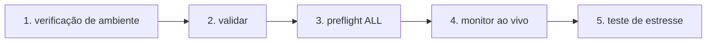

# IrsanAI TPM Agent Forge

[🇬🇧 English](./README.md) | [🇩🇪 Deutsch](./README.de.md) | [🇪🇸 Español](./docs/i18n/README.es.md) | [🇮🇹 Italiano](./docs/i18n/README.it.md) | [🇧🇦 Bosanski](./docs/i18n/README.bs.md) | [🇷🇺 Русский](./docs/i18n/README.ru.md) | [🇨🇳 中文](./docs/i18n/README.zh-CN.md) | [🇫🇷 Français](./docs/i18n/README.fr.md) | [🇧🇷 Português (BR)](./docs/i18n/README.pt-BR.md) | [🇮🇳 हिन्दी](./docs/i18n/README.hi.md) | [🇹🇷 Türkçe](./docs/i18n/README.tr.md) | [🇯🇵 日本語](./docs/i18n/README.ja.md)

Um bootstrap limpo para uma configuração de multiagente autônomo (BTC, COFFEE e mais) com opções de tempo de execução multiplataforma.

## O que está incluído

- `production/preflight_manager.py` – Sondagem resiliente de fontes de mercado com Alpha Vantage + cadeia de fallback e fallback de cache local.
- `production/tpm_agent_process.py` – Loop de agente simples por mercado.
- `production/tpm_live_monitor.py` – Monitor BTC ao vivo com inicialização a quente CSV opcional e notificações Termux.
- `core/tpm_scientific_validation.py` – Backtest + pipeline de validação estatística.
- `scripts/tpm_cli.py` – Lançador unificado para Termux/Linux/macOS/Windows.
- `scripts/stress_test_suite.py` – Teste de estresse de failover/latência.
- `scripts/start_agents.sh`, `scripts/health_monitor_v3.sh` – Auxiliares de operações de processo.
- `core/scout.py`, `core/reserve_manager.py`, `core/init_db_v2.py` – Ferramentas operacionais centrais.

## Início Rápido Universal

```bash
python scripts/tpm_cli.py env
python scripts/tpm_cli.py validate
python scripts/tpm_cli.py preflight --market ALL
python scripts/tpm_cli.py live --history-csv btc_real_24h.csv --poll-seconds 3600
```

## Verificação da Cadeia de Execução (sanidade causal/ordem)

O fluxo padrão do repositório é intencionalmente linear para evitar o desvio de estado oculto e a "falsa confiança" durante as execuções ao vivo.



### Lógica de portão (o que deve ser verdadeiro antes da próxima etapa)
- **Portão 1 – Ambiente:** O contexto Python/plataforma está correto (`env`).
- **Portão 2 – Sanidade científica:** O comportamento do modelo de linha de base é reproduzível (`validate`).
- **Portão 3 – Confiabilidade da fonte:** Os dados de mercado + cadeia de fallback são acessíveis (`preflight --market ALL`).
- **Portão 4 – Execução em tempo de execução:** O loop ao vivo é executado com um histórico de entrada conhecido (`live`).
- **Portão 5 – Confiança adversarial:** Os alvos de latência/failover são mantidos sob estresse (`stress_test_suite.py`).

✅ Já corrigido no código: o preflight da CLI agora suporta `--market ALL`, combinando com o início rápido + fluxo do docker.

## Escolha Sua Missão (CTA baseado em função)

> **Você é X? Clique na sua pista. Comece em <60 segundos.**

| Persona | O que você se importa | Caminho do clique | Primeiro comando |
|---|---|---|---|
| 📈 **Trader** | Pulso rápido, tempo de execução acionável | [`tpm_live_monitor.py`](./production/tpm_live_monitor.py) | `python scripts/tpm_cli.py live --history-csv btc_real_24h.csv --poll-seconds 3600` |
| 💼 **Investidor** | Estabilidade, confiança na fonte, resiliência | [`preflight_manager.py`](./production/preflight_manager.py) | `python scripts/tpm_cli.py preflight --market ALL` |
| 🔬 **Cientista** | Evidência, testes, sinal estatístico | [`tpm_scientific_validation.py`](./core/tpm_scientific_validation.py) | `python scripts/tpm_cli.py validate` |
| 🧠 **Teórico** | Estrutura causal + arquitetura futura | [`core/scout.py`](./core/scout.py) + [`Próximos Passos`](#next-steps) | `python scripts/tpm_cli.py validate` |
| 🛡️ **Cético (prioridade)** | Quebre as suposições antes da produção | [`stress_test_suite.py`](./scripts/stress_test_suite.py) + [`preflight_manager.py`](./production/preflight_manager.py) | `python scripts/tpm_cli.py preflight --market ALL && python scripts/stress_test_suite.py` |
| ⚙️ **Operador / DevOps** | Tempo de atividade, saúde do processo, recuperabilidade | [`start_agents.sh`](./scripts/start_agents.sh) + [`health_monitor_v3.sh`](./scripts/health_monitor_v3.sh) | `bash scripts/start_agents.sh` |

### Desafio do Cético (recomendado primeiro para novos visitantes)
Se você fizer **apenas uma coisa**, execute isso e inspecione a saída do relatório:

```bash
python scripts/tpm_cli.py preflight --market ALL
python scripts/stress_test_suite.py
```

Se esta pista te convencer, o resto do repositório provavelmente também vai ressoar.

## Notas da Plataforma

- **Android / Termux (Samsung, etc.)**
  ```bash
  bash scripts/termux_bootstrap.sh
  cd ~/TPM-Agent
  python scripts/tpm_cli.py env
  python scripts/tpm_cli.py preflight --market ALL
  python scripts/tpm_cli.py live --history-csv btc_real_24h.csv --notify --vibrate-ms 1000
  ```
  Para demonstração direta da interface web do Android (Termux), inicie o tempo de execução do Forge localmente:
  ```bash
  cd ~/TPM-Agent
  bash scripts/termux_forge.sh start
  # parar: bash scripts/termux_forge.sh stop
  # status: bash scripts/termux_forge.sh status
  ```
  O script abre automaticamente o navegador (se disponível) e mantém o serviço funcionando em segundo plano.
  Se você viu um erro de compilação `pydantic-core`/Rust ou `scipy`/Fortran no Android, use
  `python -m pip install -r requirements-termux.txt` (conjunto seguro para Termux, sem necessidade de toolchain Rust).
  Na interface web você pode controlar o início/parada do tempo de execução; uma barra de progresso mostra o status da transição.
- **iPhone (melhor esforço)**: use aplicativos de shell como iSH / a-Shell. Os hooks de notificação específicos do Termux não estão disponíveis lá.
- **Windows / Linux / macOS**: use os mesmos comandos CLI; execute via tmux/scheduler/cron para persistência.

## Docker (Caminho Mais Fácil Entre SOs)

Use o Docker nesta ordem exata (sem adivinhação):

### Passo 1: Construa a imagem de tempo de execução da web

```bash
docker compose build --no-cache tpm-forge-web
```

### Passo 2: Inicie o serviço de painel da web

```bash
docker compose up tpm-forge-web
```

Agora abra `http://localhost:8787` no seu navegador (**não** `http://0.0.0.0:8787`). O Uvicorn se liga a `0.0.0.0` internamente, mas os clientes devem usar `localhost` (ou o IP da LAN do host).

### Passo 3 (verificações opcionais): entenda os serviços não-web

```bash
docker compose run --rm tpm-preflight
docker compose run --rm tpm-live
```

- `tpm-preflight` = verificações de fonte/conectividade (apenas saída CLI).
- `tpm-live` = logs do monitor ao vivo do terminal (apenas saída CLI, **sem interface web**).
- `tpm-forge-web` = FastAPI + interface do painel (aquele com layout/progresso/controle de tempo de execução).

Se `tpm-preflight` relatar `ALPHAVANTAGE_KEY not set`, o COFFEE ainda funciona via fallbacks.

Se a página parecer em branco:
- teste a API diretamente: `http://localhost:8787/api/frame`
- teste a documentação do FastAPI: `http://localhost:8787/docs`
- atualize o navegador com força (`Ctrl+F5`)
- se necessário, reinicie apenas o serviço web: `docker compose restart tpm-forge-web`

Opcional para melhor qualidade de COFFEE:

```bash
export ALPHAVANTAGE_KEY="<your_key>"
docker compose run --rm tpm-preflight
```

## Previsões de falhas e alertas móveis

- O cockpit ao vivo do Forge agora expõe perspectivas de curto prazo por mercado (`para cima/para baixo/lateral`) com confiança em `/api/markets/live`.
- Quando uma falha de mercado é detectada (pico de aceleração), o tempo de execução pode acionar:
  - Toast + vibração do Termux
  - hook de notificação/bipe opcional
  - push do Telegram opcional (se o token do bot/ID do chat estiver configurado em `config/config.yaml`).
- Configure no painel via **Salvar Alertas** / **Testar Alerta** ou API:
  - `GET /api/alerts/preferences`
  - `POST /api/alerts/preferences`
  - `POST /api/alerts/test`

## Validação

Execute o pipeline de validação científica:

```bash
python core/tpm_scientific_validation.py
```

Artefatos:
- `state/TPM_Scientific_Report.md`
- `state/TPM_test_results.json`

## Fontes e Failover

`production/preflight_manager.py` suporta:
- Alpha Vantage primeiro para COFFEE (quando `ALPHAVANTAGE_KEY` está definido)
- TradingView + cadeia de fallback do Yahoo
- fallback de cache local em `state/latest_prices.json`

Execute o preflight diretamente:

```bash
export ALPHAVANTAGE_KEY="<your_key>"
python production/preflight_manager.py --market ALL
```

Execute o teste de estresse de interrupção (alvo `p95 < 1000ms`):

```bash
python scripts/stress_test_suite.py
```

Saída: `state/stress_test_report.json`

## Status ao vivo: o que o agente TPM pode fazer hoje

**Estado atual:**
- O tempo de execução da web do Forge de produção está disponível (`production.forge_runtime:app`).
- A configuração de início financeiro usa **BTC + COFFEE**.
- O quadro ao vivo, a adequação do agente, a entropia de transferência e o resumo do domínio são visíveis no painel da web.
- Os usuários podem adicionar novos agentes de mercado em tempo de execução (`POST /api/agents`).

**Capacidade alvo (deve ter):**
- Benchmarking de dados reais com limites de aceitação explícitos (precisão/recall/FPR/drift).
- Regras estritas de governança reflexiva para modo de segurança automático.
- Fluxo de trabalho de memória coletiva para padrões de aprendizado por domínio versionados.

**Próxima fase de expansão:**
- Orquestrador de políticas baseado em regime (tendência/choque/lateral) em todos os agentes.
- Um piloto de domínio não financeiro (por exemplo, médico ou sísmico) com contratos de dados explícitos.

## Auxiliar de conflito de mesclagem de PR

- Lista de verificação de mesclagem (conflitos do GitHub): `docs/MERGE_CONFLICT_CHECKLIST.de.md`

### Escopo hoje: Windows + smartphone para finanças TPM

- **Windows:** Tempo de execução do Forge + interface web + Docker/PowerShell/click-start estão operacionais.
- **Smartphone:** O monitoramento ao vivo do Android/Termux está operacional; a interface web é responsiva no celular.
- **Multiagente em tempo real:** BTC + COFFEE ativos por padrão; mercados adicionais podem ser adicionados dinamicamente na interface web.
- **Regra de limite de fonte:** se o mercado solicitado não for coberto por fontes integradas, forneça URL de fonte explícita + dados de autorização.

## Teste ao vivo do Windows (sistema de dois caminhos)

### Caminho A — Desenvolvedores/usuários avançados (PowerShell, CMD, PyCharm, IDE)

```powershell
python -m venv .venv
.\.venv\Scripts\Activate.ps1
pip install -r requirements.txt
python scripts/tpm_cli.py forge-dashboard --open-browser --port 8787
```

### Caminho B — Usuários de baixo nível (clicar e iniciar)

1. Clique duas vezes em `scripts/windows_click_start.bat`
2. O script seleciona automaticamente o melhor caminho disponível:
   - Python disponível -> venv + pip + tempo de execução
   - caso contrário, Docker Compose (se disponível)

Base técnica: `scripts/windows_bootstrap.ps1`.

## Tempo de Execução Web de Produção do Forge (BTC + COFFEE, extensível)

Sim, isso **já começou** no repositório e agora foi estendido:

- Inicia por padrão com um agente TPM financeiro para **BTC** e um para **COFFEE**.
- Os usuários podem adicionar mais mercados/agentes diretamente da interface web (`/api/agents`).
- Executa como um serviço de tempo de execução persistente com saída de quadro ao vivo (`/api/frame`) para uma visão imersiva.

### Iniciar (local)

```bash
uvicorn production.forge_runtime:app --host 0.0.0.0 --port 8787
# abrir http://localhost:8787
```

### Iniciar (Docker)

```bash
docker compose up tpm-forge-web
# abrir http://localhost:8787
```

## Playground TPM (MVP interativo)

Agora você pode explorar o comportamento do TPM interativamente no navegador:

```bash
python -m http.server 8765
# abrir http://localhost:8765/playground/index.html
```

Inclui:
- Visualização de anomalias de sinal fraco de agente único
- Pressão de consenso de mini enxame (BTC/COFFEE/VOL)
- Ressonância de transferência entre domínios (finanças/clima/saúde sintéticos)

Veja: `playground/README.md`.
## Próximos Passos

- Módulo de entropia de transferência para análise causal entre mercados.
- Otimizador com atualizações de política com base no desempenho histórico.
- Canais de alerta (Telegram/Signal) + persistência de inicialização.

---

## IrsanAI Deep Dive: Como o núcleo TPM "pensa" em sistemas complexos

### 1) Transformação visionária: de agente de negociação a ecossistema TPM universal

### O que é único no algoritmo IrsanAI-TPM? (enquadramento corrigido)

Hipótese de trabalho do núcleo TPM:

- Em sistemas complexos e caóticos, o sinal de alerta precoce geralmente está oculto no **microrresíduo**: minúsculas desvios, correlações fracas, pontos de dados quase vazios.
- Onde os sistemas clássicos veem apenas `0` ou "não há relevância suficiente", o TPM procura **anomalias estruturadas** (padrões de falha) no fluxo de contexto.
- O TPM avalia não apenas um valor em si, mas a **mudança de relacionamentos ao longo do tempo, qualidade da fonte, regime e vizinhança causal**.

Nota importante de correção: o TPM **não** prevê magicamente o futuro. Ele visa a **detecção probabilística mais precoce** de mudanças de regime, fugas e interrupções — quando a qualidade dos dados e os portões de validação são satisfeitos.

### Pense GRANDE: por que isso se estende além das finanças

Se o TPM pode detectar padrões precursores fracos em instrumentos financeiros (identificadores de índice/ticker/ISIN, liquidez, microestrutura), o mesmo princípio pode generalizar para muitos domínios:

- **Fluxo de eventos/sensores + modelo de contexto + camada de anomalias + loop de feedback**
- Toda profissão pode ser modelada como um "mercado" com características, nós, correlações e anomalias específicas do domínio
- Agentes TPM especializados podem aprender