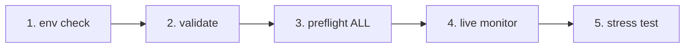

# IrsanAI TPM Agent Forge
[🇬🇧 English](../../README.md) | [🇩🇪 Deutsch](../../README.de.md) | [🇪🇸 Español](../../docs/i18n/README.es.md) | [🇮🇹 Italiano](../../docs/i18n/README.it.md) | [🇧🇦 Bosanski](../../docs/i18n/README.bs.md) | [🇷🇺 Русский](../../docs/i18n/README.ru.md) | [🇨🇳 中文](../../docs/i18n/README.zh-CN.md) | [🇫🇷 Français](../../docs/i18n/README.fr.md) | [🇧🇷 Português (BR)](../../docs/i18n/README.pt-BR.md) | [🇮🇳 हिन्दी](../../docs/i18n/README.hi.md) | [🇹🇷 Türkçe](../../docs/i18n/README.tr.md) | [🇯🇵 日本語](../../docs/i18n/README.ja.md)

[🇬🇧 English](../../README.md) | [🇩🇪 Deutsch](../../README.de.md) | [🇪🇸 Español](./README.es.md) | [🇮🇹 Italiano](./README.it.md) | [🇧🇦 Bosanski](./README.bs.md) | [🇷🇺 Русский](./README.ru.md) | [🇨🇳 中文](./README.zh-CN.md) | [🇫🇷 Français](./README.fr.md) | [🇧🇷 Português (BR)](./README.pt-BR.md) | [🇮🇳 हिन्दी](./README.hi.md) | [🇹🇷 Türkçe](./README.tr.md) | [🇯🇵 日本語](./README.ja.md)

Um bootstrap limpo para uma configuração autônoma multiagente (BTC, COFFEE e mais) com opções de runtime multiplataforma.

## O que Está Incluso

- `production/preflight_manager.py` – sondagem resiliente da fonte de mercado com Alpha Vantage + cadeia fallback e fallback de cache local.
- `production/tpm_agent_process.py` – loop simples do agente por mercado.
- `production/tpm_live_monitor.py` – monitor ao vivo de BTC com warm-start opcional via CSV e notificações Termux.
- `core/tpm_scientific_validation.py` – pipeline de backtest + validação estatística.
- `scripts/tpm_cli.py` – lançador unificado para Termux/Linux/macOS/Windows.
- `scripts/stress_test_suite.py` – teste de estresse de failover/latência.
- `scripts/start_agents.sh`, `scripts/health_monitor_v3.sh` – auxiliares para operações de processos.
- `core/scout.py`, `core/reserve_manager.py`, `core/init_db_v2.py` – ferramentas centrais operacionais.

## Início Rápido Universal

```bash
python scripts/tpm_cli.py env
python scripts/tpm_cli.py validate
python scripts/tpm_cli.py preflight --market ALL
python scripts/tpm_cli.py live --history-csv btc_real_24h.csv --poll-seconds 3600
```

## Verificação da Cadeia de Runtime (causalidade/sanidade de ordem)

O fluxo padrão do repositório é intencionalmente linear para evitar deriva oculta de estado e "falsa confiança" durante execuções ao vivo.



### Lógica dos gates (o que deve ser verdadeiro antes do próximo passo)
- **Gate 1 – Ambiente:** contexto Python/plataforma está correto (`env`).
- **Gate 2 – Sanidade científica:** comportamento do modelo base é reprodutível (`validate`).
- **Gate 3 – Confiabilidade da fonte:** dados de mercado + cadeia fallback são acessíveis (`preflight --market ALL`).
- **Gate 4 – Execução em runtime:** loop ao vivo roda com histórico de entrada conhecido (`live`).
- **Gate 5 – Confiança adversarial:** metas de latência/failover se mantêm sob estresse (`stress_test_suite.py`).

✅ Já corrigido no código: CLI preflight agora suporta `--market ALL`, alinhando com o quickstart + fluxo docker.

## Escolha Sua Missão (CTA baseada em função)

> **Você é X? Clique na sua área. Comece em <60 segundos.**

| Persona | O que importa para você | Caminho para clicar | Primeiro comando |
|---|---|---|---|
| 📈 **Trader** | Pulso rápido, runtime acionável | [`tpm_live_monitor.py`](./production/tpm_live_monitor.py) | `python scripts/tpm_cli.py live --history-csv btc_real_24h.csv --poll-seconds 3600` |
| 💼 **Investidor** | Estabilidade, confiança na fonte, resiliência | [`preflight_manager.py`](./production/preflight_manager.py) | `python scripts/tpm_cli.py preflight --market ALL` |
| 🔬 **Cientista** | Evidências, testes, sinal estatístico | [`tpm_scientific_validation.py`](./core/tpm_scientific_validation.py) | `python scripts/tpm_cli.py validate` |
| 🧠 **Teórico** | Estrutura causal + arquitetura futura | [`core/scout.py`](./core/scout.py) + [`Próximos Passos`](#next-steps) | `python scripts/tpm_cli.py validate` |
| 🛡️ **Cético (prioridade)** | Quebrar suposições antes da produção | [`stress_test_suite.py`](./scripts/stress_test_suite.py) + [`preflight_manager.py`](./production/preflight_manager.py) | `python scripts/tpm_cli.py preflight --market ALL && python scripts/stress_test_suite.py` |
| ⚙️ **Operador / DevOps** | Uptime, saúde do processo, recuperabilidade | [`start_agents.sh`](./scripts/start_agents.sh) + [`health_monitor_v3.sh`](./scripts/health_monitor_v3.sh) | `bash scripts/start_agents.sh` |

### Desafio Cético (recomendado primeiro para novos visitantes)
Se você fizer **apenas uma coisa**, rode isto e inspecione o relatório de saída:

```bash
python scripts/tpm_cli.py preflight --market ALL
python scripts/stress_test_suite.py
```

Se esta área te convencer, o restante do repositório provavelmente também terá ressonância.

## Notas da Plataforma

- **Android / Termux (Samsung, etc.)**
  ```bash
  bash scripts/termux_bootstrap.sh
  cd ~/TPM-Agent
  python scripts/tpm_cli.py env
  python scripts/tpm_cli.py preflight --market ALL
  python scripts/tpm_cli.py live --history-csv btc_real_24h.csv --notify --vibrate-ms 1000
  ```
  Para demonstração direta da UI web no Android (Termux), inicie o Forge runtime localmente:
  ```bash
  cd ~/TPM-Agent
  bash scripts/termux_forge.sh start
  # parar: bash scripts/termux_forge.sh stop
  # status: bash scripts/termux_forge.sh status
  ```
  O script abre automaticamente o navegador (se disponível) e mantém o serviço rodando em background.
  Se você encontrou um erro de build `pydantic-core`/Rust ou `scipy`/Fortran no Android, use
  `python -m pip install -r requirements-termux.txt` (conjunto seguro para Termux, sem necessidade de toolchain Rust).
  Na interface web, é possível controlar início/parada do runtime; uma barra de progresso mostra o status da transição.
- **iPhone (melhor esforço):** use aplicativos shell como iSH / a-Shell. Ganchos específicos de notificação do Termux não estão disponíveis aí.
- **Windows / Linux / macOS:** use os mesmos comandos CLI; execute via tmux/scheduler/cron para persistência.

## Docker (Caminho mais fácil Cross-OS)

Use Docker nesta ordem exata (sem adivinhações):

### Passo 1: Construa a imagem do runtime web

```bash
docker compose build --no-cache tpm-forge-web
```

### Passo 2: Inicie o serviço do dashboard web

```bash
docker compose up tpm-forge-web
```

Agora abra `http://localhost:8787` no seu navegador (**não** `http://0.0.0.0:8787`). Uvicorn vincula a `0.0.0.0` internamente, mas os clientes devem usar `localhost` (ou o IP LAN do host).

### Passo 3 (checagens opcionais): entenda os serviços não-web

```bash
docker compose run --rm tpm-preflight
docker compose run --rm tpm-live
```

- `tpm-preflight` = checagens de fonte/conectividade (apenas saída CLI).
- `tpm-live` = logs do monitor ao vivo no terminal (apenas saída CLI, **sem UI web**).
- `tpm-forge-web` = FastAPI + dashboard UI (aquele com layout/progresso/controle de runtime).

Se `tpm-preflight` reportar `ALPHAVANTAGE_KEY not set`, COFFEE ainda funciona via fallbacks.

Se a página parecer em branco:
- teste a API diretamente: `http://localhost:8787/api/frame`
- teste a documentação do FastAPI: `http://localhost:8787/docs`
- faça um hard refresh no navegador (`Ctrl+F5`)
- se necessário, reinicie apenas o serviço web: `docker compose restart tpm-forge-web`

Opcional para melhor qualidade COFFEE:

```bash
export ALPHAVANTAGE_KEY="<your_key>"
docker compose run --rm tpm-preflight
```

## Previsões de glitches & alertas móveis

- O cockpit ao vivo do Forge agora expõe previsões de curto horizonte por mercado (`up/down/sideways`) com confiança em `/api/markets/live`.
- Quando um glitch de mercado é detectado (pico de aceleração), o runtime pode disparar:
  - notificação toast + vibração no Termux
  - gancho opcional de notificação/alerta sonoro
  - push opcional via Telegram (se token do bot/ID do chat configurados em `config/config.yaml`).
- Configure no dashboard via **Save Alerts** / **Test Alert** ou API:
  - `GET /api/alerts/preferences`
  - `POST /api/alerts/preferences`
  - `POST /api/alerts/test`

## Validação

Execute o pipeline de validação científica:

```bash
python core/tpm_scientific_validation.py
```

Artefatos gerados:
- `state/TPM_Scientific_Report.md`
- `state/TPM_test_results.json`

## Fontes & Failover

`production/preflight_manager.py` suporta:
- Alpha Vantage prioritariamente para COFFEE (quando `ALPHAVANTAGE_KEY` está definido)
- Cadeia fallback TradingView + Yahoo
- fallback de cache local em `state/latest_prices.json`

Execute preflight diretamente:

```bash
export ALPHAVANTAGE_KEY="<your_key>"
python production/preflight_manager.py --market ALL
```

Execute o teste de estresse de falhas (meta `p95 < 1000ms`):

```bash
python scripts/stress_test_suite.py
```

Saída: `state/stress_test_report.json`

## Status ao vivo: o que o agente TPM pode fazer hoje

**Estado atual:**
- Runtime web de produção Forge está disponível (`production.forge_runtime:app`).
- Configuração inicial focada em finanças usa **BTC + COFFEE**.
- Frame ao vivo, fitness do agente, entropia de transferência e resumo de domínio são visíveis no dashboard web.
- Usuários podem adicionar novos agentes de mercado em runtime (`POST /api/agents`).

**Capacidade alvo (deve ter):**
- Benchmarking com dados reais com limites explícitos de aceitação (precisão/recall/FPR/deriva).
- Regras estritas de governança reflexiva para auto modo seguro.
- Workflow de memória coletiva para padrões de aprendizado versionados por domínio.

**Próximo estágio de expansão:**
- Orquestrador de políticas baseado em regimes (tendência/choque/lateral) para todos os agentes.
- Piloto de domínio não financeiro (ex.: médico ou sísmico) com contratos de dados explícitos.

## Auxiliar para conflitos de merge de PR

- Checklist de merge (conflitos GitHub): `docs/MERGE_CONFLICT_CHECKLIST.de.md`

### Escopo atual: Windows + smartphone para TPM financeiro

- **Windows:** runtime Forge + interface web + Docker/PowerShell/click-start estão operacionais.
- **Smartphone:** monitoramento ao vivo Android/Termux está operacional; UI web é responsiva no mobile.
- **Multi-agente em tempo real:** BTC + COFFEE ativos por padrão; mercados adicionais podem ser adicionados dinamicamente na UI web.
- **Regra de fronteira da fonte:** se o mercado solicitado não estiver coberto por fontes internas, forneça URL explícita da fonte + dados de autorização.

## Teste ao vivo no Windows (sistema de dois caminhos)

### Caminho A — Desenvolvedores/usuários avançados (PowerShell, CMD, PyCharm, IDE)

```powershell
python -m venv .venv
.\.venv\Scripts\Activate.ps1
pip install -r requirements.txt
python scripts/tpm_cli.py forge-dashboard --open-browser --port 8787
```

### Caminho B — Usuários iniciantes (clicar e iniciar)

1. Clique duas vezes em `scripts/windows_click_start.bat`
2. O script seleciona automaticamente o melhor caminho disponível:
   - Python disponível -> venv + pip + runtime
   - caso contrário, Docker Compose (se disponível)

Base técnica: `scripts/windows_bootstrap.ps1`.

## Runtime Web de Produção Forge (BTC + COFFEE, extensível)

Sim, isso já está **em andamento** no repositório e está agora estendido:

- Inicia por padrão com um agente TPM financeiro para **BTC** e um para **COFFEE**.
- Usuários podem adicionar mais mercados/agentes diretamente pela UI web (`/api/agents`).
- Roda como serviço de runtime persistente com saída do frame ao vivo (`/api/frame`) para insights imersivos.

### Iniciar (local)

```bash
uvicorn production.forge_runtime:app --host 0.0.0.0 --port 8787
# abrir http://localhost:8787
```

### Iniciar (Docker)

```bash
docker compose up tpm-forge-web
# abrir http://localhost:8787
```

## Playground TPM (MVP interativo)

Agora você pode explorar o comportamento TPM interativamente no navegador:

```bash
python -m http.server 8765
# abrir http://localhost:8765/playground/index.html
```

Inclui:
- Visão de anomalia de sinal fraco de agente único
- Mini enxame (BTC/COFFEE/VOL) com pressão de consenso
- Ressonância cross-domain de transferência (financeiro sintético/clima/saúde)

Veja: `playground/README.md`.

## Próximos Passos

- Módulo de entropia de transferência para análise causal cross-market.
- Otimizador com atualizações de política baseado em desempenho histórico.
- Canais de alerta (Telegram/Signal) + persistência de boot.

---

## IrsanAI Deep Dive: Como o núcleo TPM “pensa” em sistemas complexos

### 1) Transformação visionária: de agente de trading a ecossistema TPM universal

### O que há de único no algoritmo IrsanAI-TPM? (enquadramento corrigido)

Hipótese de trabalho do núcleo TPM:

- Em sistemas complexos e caóticos, o sinal de alerta antecipado está frequentemente escondido no **micro-residual**: pequenas divergências, correlações fracas, pontos de dados quase vazios.
- Onde sistemas clássicos veem apenas `0` ou "relevância insuficiente", o TPM procura **anomalias estruturadas** (padrões glitch) no fluxo de contexto.
- TPM avalia não só um valor em si, mas a **mudança das relações ao longo do tempo, qualidade da fonte, regime e vizinhança causal**.

Nota importante de correção: TPM **não** prediz o futuro magicamente. Seu objetivo é a **detecção probabilística antecipada** de mudanças de regime, rompimentos e disrupções — quando a qualidade dos dados e os gates de validação estão satisfeitos.

### Pense GRANDE: por que isso vai além das finanças

Se o TPM pode detectar padrões fracos precursores em instrumentos financeiros (índice/ticker/identificadores tipo ISIN, liquidez, microestrutura), o mesmo princípio pode ser generalizado para muitos domínios:

- **Fluxo de eventos/sensores + modelo de contexto + camada de anomalias + loop de feedback**
- Toda profissão pode ser modelada como um “mercado” com características, nós, correlações e anomalias específicas do domínio
- Agentes TPM especializados podem aprender entre domínios preservando lógica profissional local e ética

### 100 profissões como espaços-alvo do TPM

| # | Profissão | Análogo de dados TPM | Alvo de detecção de anomalia/padrão |
|---|---|---|---|
| 1 | Analista policial | Registros de incidentes, mapas criminais geotemporais, redes | Sinais precoces de clusters criminais em escalada |
| 2 | Comandante do corpo de bombeiros | Cadeias de alarme, feeds de sensores, clima, perfis de edifícios | Prever janelas de propagação de fogo e perigos |
| 3 | Paramédico/SAMU | Motivos de despacho, tempos de resposta, carga hospitalar | Detectar estresse de capacidade antes do colapso |
| 4 | Médico de emergência | Fluxos de triagem, sinais vitais, dinâmica de tempo de espera | Sinalizar descompensação crítica antecipadamente |
| 5 | Enfermeiro de UTI | Tendências de ventilação/laboratório, respostas a medicação | Identificar micro-sinais de sepse/choque |
| 6 | Epidemiologista | Taxas de casos, mobilidade, dados de esgoto/laboratório | Alerta precoce de surtos antes da fase exponencial |
| 7 | Médico de família | Padrões em prontuários, prescrições, lacunas de acompanhamento | Detectar transições de risco crônico precocemente |
| 8 | Psicólogo clínico | Trajetórias de sessões, marcadores linguísticos, sono/atividade | Detectar indicadores de recaída/crise mais cedo |
| 9 | Pesquisador farmacêutico | Triagens de compostos, perfis de eventos adversos, genômica | Revelar clusters ocultos de eficácia e efeitos colaterais |
| 10 | Biotecnólogo | Sequências/processos/trajectórias de cultivo celular | Detectar deriva e risco de contaminação |
| 11 | Cientista climático | Séries temporais atmosfera/oceano, campos satelitais | Identificar precursores de pontos de inflexão |
| 12 | Meteorologista | Campos de pressão/umidade/vento/radar | Antecipar mudanças climáticas locais caóticas |
| 13 | Sismólogo | Microterremotos, campos de estresse, redes de sensores | Detectar precursores a grandes liberações |
| 14 | Vulcanólogo | Séries de gás, tremor, deformação | Restringir janelas de probabilidade de erupção |
| 15 | Hidrólogo | Medidores de rios, chuvas, umidade do solo | Detectar mudanças em enchentes súbitas e secas |
| 16 | Oceanógrafo | Correntes, temperatura, salinidade, bóias | Detectar anomalias relacionadas a tsunami/ecossistema |
| 17 | Trader de energia | Carga, preços spot, clima, estado da rede | Sinalizar rompimentos prováveis de preço/carga cedo |
| 18 | Operador de rede elétrica | Frequência da rede, estado das linhas, eventos de chaveamento | Detectar risco de falha em cascata |
| 19 | Operador de parque eólico | Telemetria de turbinas, campos de vento, logs manutenção | Prever falhas e deriva de performance |
| 20 | Operador de usina solar | Irradiância, telemetria de inversores, carga térmica | Detectar degradação e anomalias de rendimento |
| 21 | Gerente de saneamento | Fluxo, sensores de qualidade, padrões de consumo | Detectar contaminação/falta precocemente |
| 22 | Gestor de operações de tráfego | Densidade, colisões, obras, eventos | Prever congestionamentos e escaladas de acidentes |
| 23 | Gestor de controle ferroviário | Cumprimento de horários, estado dos trilhos, cadeias de atraso | Quebrar cascatas de atraso sistêmico cedo |
| 24 | Controlador de tráfego aéreo | Trajetórias de voo, clima, saturação de slots | Detectar rotas de conflito e gargalos |
| 25 | Gerente de logística portuária | Tempos de atracação, fluxo de containers, status alfandegário | Detectar precursores de interrupção de suprimento |
| 26 | Gerente de cadeia de suprimentos | ETA, inventário, pulso de demanda, eventos de risco | Minimizar efeitos bullwhip e anomalias de falta |
| 27 | Líder de manufatura | OEE, telemetria de processo, sucata, tempos de setup | Detectar deriva de qualidade e anomalias de máquinas |
| 28 | Engenheiro de qualidade | Distribuições de tolerância, sinais do processo | Detectar precursores de quase zero defeitos |
| 29 | Engenheiro de robótica | Trajetórias de movimento, carga de atuadores, loops de controle | Prever instabilidade/queda de controle |
| 30 | Engenheiro de manutenção aeronáutica | Telemetria de motores/voos, histórico de manutenção | Manutenção preditiva ao nível de componentes |
| 31 | Gerente de construção | Progresso, clima, datas de suprimento, sensores IoT | Quantificar risco de anomalia em cronograma/custo |
| 32 | Engenheiro estrutural | Cargas, vibração, indicadores de fadiga/envelhecimento | Detectar transições críticas estruturais |
| 33 | Urbanista | Mobilidade, demografia, emissões, uso do solo | Detectar padrões emergentes de estresse urbano |
| 34 | Arquiteto | Operações do edifício, ocupação, curvas de energia | Detectar padrões de incompatibilidade projeto-uso |
| 35 | Agricultor | Fluxos de solo/clima/cultivo/mercado | Detectar anomalias de doença/rendimento precocemente |
| 36 | Agrônomo | Nutrição/hidratação por satélite | Alvo para intervenções precisas antecipadas |
| 37 | Gestor florestal | Umidade, padrões de pragas, indicadores de fogo | Detectar danos florestais/janelas de incêndio cedo |
| 38 | Gestor de pescaria | Registros de pesca, qualidade da água, migração | Detectar risco de sobrepesca/colapso |
| 39 | Inspetor de segurança alimentar | Achados laboratoriais, logs da cadeia fria, vínculos de fornecimento | Interromper cadeias de contaminação cedo |
| 40 | Chef executivo | Pulso de demanda, saúde do estoque, índices de desperdício | Minimizar perdas e anomalias de falta |
| 41 | Operador varejista | Fluxos POS, fluxo de clientes, rotação de estoque | Detectar picos de demanda e padrões de encolhimento |
| 42 | Gestor de e-commerce | Clickstream, jornadas de carrinho, devoluções | Detectar padrões precursores de fraude/churn |
| 43 | Analista de marketing | Métricas de campanha, curvas de resposta por segmento | Detectar microtendências antes da massa |
| 44 | Líder de vendas | Velocidade de pipeline, grafo de pontos de contato | Detectar risco de negócio e oportunidades temporais |
| 45 | Líder de suporte ao cliente | Fluxo de tickets, clusters de tópicos, deriva de SLA | Detectar ondas de escalonamento/causa raiz |
| 46 | Gerente de produto | Adoção de funcionalidades, retenção, feedback | Detectar desajuste produto-mercado cedo |
| 47 | Pesquisador de UX | Heatmaps, caminhos, pontos de abandono | Revelar atrito oculto na interação |
| 48 | Engenheiro de software | Logs, traces, métricas de deploy | Detectar cascatas de falha pré-incidente |
| 49 | Engenheiro de confiabilidade de sites | Latência, orçamentos de erro, saturação | Detectar degradação antes de queda |
| 50 | Analista de segurança cibernética | Fluxos de rede, eventos IAM, alertas SIEM | Detectar caminhos de ataque e movimentos laterais |
| 51 | Analista de fraude | Grafos de transação, impressões digitais de dispositivos | Detectar fraude no espaço de sinal fraco |
| 52 | Gerente de risco bancário | Portfólio/macro/exposições líquidas | Detectar regimes de estresse e risco de concentração |
| 53 | Atuário de seguros | Fluxo de sinistros, mapas de exposição, vínculos climáticos | Antecipar ondas de sinistros e estresse de reservas |
| 54 | Consultor tributário | Padrões de livros contábeis, prazos de declaração | Detectar risco de conformidade e rotas de otimização |
| 55 | Auditor | Trilhas de controle, padrões de exceção | Detectar anomalias contábeis em escala |
| 56 | Advogado | Cronologia de casos, grafos de precedentes, prazos | Detectar risco de litígio e padrões de resultado |
| 57 | Juiz/administrador do tribunal | Mistura de carga de casos, tempos de ciclo | Detectar gargalos no sistema de justiça |
| 58 | Gestor de penitenciárias | Ocupação, redes de incidentes, tendências comportamentais | Detectar clusters de violência/recidiva |
| 59 | Oficial da alfândega | Manifestos, declarações, padrões de roteamento | Detectar sinais de contrabando/evasão |
| 60 | Analista de inteligência de defesa | Feeds ISR, logística, ritmo operacional | Detectar dinâmicas de escalada cedo |
| 61 | Analista diplomático | Cadeias de eventos, sinais de comunicação | Detectar mudanças de regime geopolítico |
| 62 | Professor | Progresso de aprendizagem, frequência, engajamento | Detectar risco de evasão e necessidade de suporte |
| 63 | Diretor escolar | Cluster de desempenho, frequência, recursos | Detectar padrões de estresse escolar sistêmicos |
| 64 | Professor universitário | Atividade do curso, desistências, feedback | Estabilizar sucesso estudantil mais cedo |
| 65 | Pesquisador em educação | Trajetórias de coortes, variáveis pedagógicas | Identificar efeitos robustos de intervenção |
| 66 | Assistente social | Redes de casos, agendamentos, marcadores de risco | Detectar caminhos de escalada de crise |
| 67 | Coordenador de ONG | Relatórios de campo, fluxos de ajuda, sinais de necessidade | Detectar lacunas de impacto e mudanças de hotspots |
| 68 | Consultor de emprego | Perfis de habilidades, demanda de trabalho, transições | Detectar desajustes e necessidades de upskilling |
| 69 | Gestor de RH | Contratação/desligamento/trajetórias de desempenho | Detectar burnout e risco de retenção cedo |
| 70 | Recrutador | Taxas do funil, taxonomia de habilidades, pulso de mercado | Detectar risco de encaixe e janelas de oportunidade |
| 71 | Consultor organizacional | Cadência de decisão, deriva de KPIs, padrões de rede | Detectar disfunção de equipes cedo |
| 72 | Gerente de projetos | Marcos, dependências, grafo de bloqueios | Antecipar falhas em cronograma/escopo |
| 73 | Jornalista | Grafo de confiabilidade da fonte, fluxos de eventos | Detectar clusters de desinformação cedo |
| 74 | Repórter investigativo | Redes de documentos, rastros de dinheiro/comunicação | Expor anomalias sistêmicas ocultas |
| 75 | Moderador de conteúdo | Fluxos de posts/comentários, mudanças semânticas | Detectar ondas de abuso/radicalização cedo |
| 76 | Artista | Trajetórias de resposta da audiência, vetores de estilo | Detectar estéticas emergentes |
| 77 | Produtor musical | Features de escuta, vetores de arranjo | Detectar potencial de breakout/nicho cedo |
| 78 | Designer de jogos | Telemetria, progressão, curvas de churn | Detectar frustração e anomalias de balanceamento |
| 79 | Treinador esportivo | Fluxos de performance/biométricos | Detectar precursores de lesão/queda de forma |
| 80 | Treinador atlético | Marcadores de movimento/recuperação | Detectar sobrecarga antes de downtime |
| 81 | Médico esportivo | Diagnósticos, carga de reabilitação, risco de recorrência | Otimizar janelas de retorno ao jogo |
| 82 | Analista de árbitros | Fluxo de decisão, ritmo, contexto de incidentes | Detectar deriva de consistência/justiça |
| 83 | Gerente de eventos | Bilhetagem, mobilidade, clima, feeds de segurança | Detectar escalada de risco de multidões e segurança |
| 84 | Gestor de turismo | Padrões de reservas, sinais de reputação | Detectar mudanças de demanda e sentimento |
| 85 | Gerente de hotel | Ocupação, qualidade do serviço, reclamações | Detectar instabilidade qualidade-demanda cedo |
| 86 | Gestor de propriedades | Fluxo de aluguel, manutenção, comparativos de mercado | Detectar risco de vacância/inadimplência cedo |
| 87 | Gestor de instalações | IoT predial, energia, intervalos de manutenção | Detectar falhas e padrões de ineficiência |
| 88 | Operador de gestão de resíduos | Fluxos de resíduos, roteamento, métricas ambientais | Detectar descarte ilegal e lacunas de processo |
| 89 | Inspetor ambiental | Emissões, relatórios, sobreposições por satélite | Detectar violações de conformidade e risco de tipping |
| 90 | Analista de economia circular | Passaportes materiais, taxas de recuperação | Detectar vazamentos e oportunidades de fechamento de ciclo |
| 91 | Astrofísico | Fluxos de telescópios, espectros, modelos de ruído | Detectar eventos cósmicos raros |
| 92 | Engenheiro de operações espaciais | Telemetria, parâmetros orbitais, diagnósticos de sistema | Detectar anomalias críticas de missão cedo |
| 93 | Engenheiro quântico | Perfis de ruído, deriva de calibração, erros de gate | Detectar decoerência e deriva de controle |
| 94 | Cientista de dados | Deriva de features, qualidade do modelo, integridade dos dados | Detectar colapso do modelo e mudança de viés |
| 95 | Ético de IA | Resultados de decisão, métricas de justiça | Detectar padrões injustos/falhas de governança |
| 96 | Pesquisador em filosofia da ciência | Caminhos teoria-evidência | Detectar sinais de desajuste paradigmático |
| 97 | Matemático | Estruturas residuais, invariantes, termos de erro | Detectar regularidades ocultas/classes de outliers |
| 98 | Teórico de sistemas | Dinâmicas nó-aresta, atrasos de feedback | Detectar dinâmicas de tipping em rede |
| 99 | Antropólogo | Observações de campo, redes linguísticas/sociais | Detectar precursores de conflito cultural |
| 100 | Estrategista de foresight | Curvas tecnológicas, regulação, dados comportamentais | Conectar cenários com indicadores precoces |

### Notas de adequação por país (equivalência profissional entre jurisdições)

Para manter a lista logicamente correta entre regiões, o mapeamento de papéis do TPM deve ser interpretado como **equivalentes funcionais**, não como tradução literal de cargos:

- **Alemanha ↔ US/UK:** `Polizei` vs funções divididas (`Police Department`, `Sheriff`, `State Trooper`) e diferenças de acusação (`Staatsanwaltschaft` vs `District Attorney/Crown Prosecution`).
- **Espanha / Itália:** estruturas de direito civil com fluxos distintos em tribunais e polícia; pipelines de dados frequentemente separados regional/nacionalmente.
- **Bósnia e Herzegovina:** governança multi-entidade resulta em fragmentação da propriedade de dados; TPM aproveita fusão federada de anomalias.
- **Rússia / China:** definições de papel e restrições de governança de dados diferem; TPM deve ser configurado com limites de compliance locais e equivalentes institucionais.
- **Regiões de alto impacto adicionais:** França, Brasil, Índia, Japão, estados MENA e África Subsaariana podem ser incorporados mapeando funções equivalentes e telemetria disponível.

### Perspectiva filosófico-científica

- De ferramenta a **infraestrutura epistêmica**: domínios operacionalizam "conhecimento precoce fraco".
- De sistemas isolados a **federações de agentes**: ética local + gramática compartilhada de anomalias.
- De resposta reativa a **governança antecipatória**: prevenção sobre controle tardio de crises.
- De modelos estáticos a **teorias vivas**: recalibração contínua frente a choques do mundo real.

Ideia central: um cluster TPM governado responsavelmente não controla o caos — mas pode ajudar instituições a compreendê-lo mais cedo, conduzi-lo com mais robustez e decidir com mais humanidade.

## Expansão multilíngue (em andamento)

Para apoiar ressonância entre línguas, visões estratégicas localizadas estão disponíveis em:

- Espanhol (`docs/i18n/README.es.md`)
- Italiano (`docs/i18n/README.it.md`)
- Bósnio (`docs/i18n/README.bs.md`)
- Russo (`docs/i18n/README.ru.md`)
- Chinês Simplificado (`docs/i18n/README.zh-CN.md`)
- Francês (`docs/i18n/README.fr.md`)
- Português Brasil (`docs/i18n/README.pt-BR.md`)
- Hindi (`docs/i18n/README.hi.md`)
- Turco (`docs/i18n/README.tr.md`)
- Japonês (`docs/i18n/README.ja.md`)

Cada arquivo localizado inclui notas sobre adequação regional e aponta de volta para esta seção canônica em inglês para a matriz completa das 100 profissões.

## IrsanAI Meta de Qualidade (SOLL vs IST)

Para o atual grau de maturidade do repositório, status de qualidade intermediário e roadmap causal baseado em expectativas reais de usuários, veja:

- `docs/IRSANAI_QUALITY_META.md`

Este documento é referência para:
- profundidade de requisitos em features (UX/UI + robustez operacional),
- requisitos de paridade Docker/Android,
- bem como gates de aceitação de qualidade para PRs futuros.

## Modo parity i18n (espelho completo)

Para garantir que nenhuma comunidade linguística fique em desvantagem, arquivos i18n agora são mantidos em paridade canônica completa com `README.md`.

Comando de sincronização:

```bash
python scripts/i18n_full_mirror_sync.py
```

## Nota para desenvolvedores (LOP – Lista de pontos abertos)

O que ainda vejo pendente (conceitualmente, não tecnicamente bloqueado):

| Ponto | Status Atual | Como proceder de forma sensata |
|---|---|---|
| **Módulo de Entropia de Transferência para causalidade cross-market** | **Concluído ✅** – implementado como `TransferEntropyEngine` e integrado no Orquestrador Forge. | Completar calibração conceitual: definir limiares por domínio e regras de interpretação. |
| **Otimizador/Atualização de política baseado em histórico** | **Concluído ✅** – scoring de fitness, atualização de recompensa e filtragem de candidatos rodando no ciclo tick. | Documentar modos operacionais (conservador/agressivo) e criar perfis de governança testáveis. |
| **Alertas (Telegram/Signal)** | **Parcialmente concluído 🟡** – infraestrutura existente, mas desativada por padrão. | Estabelecer política de alarmes: quais eventos, severidades, canais, responsáveis. |
| **Persistência de boot / operação contínua** | **Parcialmente concluído 🟡** – start e health monitoring via tmux existe, mas não há runbook unificado para boot em todas as plataformas alvo. | Definir por escrito perfis para plataformas (Termux/Linux/Docker) com start no boot, política de restart e caminhos de escalonamento. |
| **Meta-layer coordenado (do “Próximo estágio de expansão (promovido)”)** | **Parcialmente concluído 🟡** – partes presentes (orquestrador + entropia + recompensa), mas não descrito como orquestrador completo de política de regimes. | Complementar com modelo conceitual explícito (Trend/Shock/Sideways) para pesos de agentes. |
| **Memória coletiva (arquivo versionado de padrões de aprendizado)** | **Aberto 🔴** – citado em visões e desenvolvimento futuro, sem processo claro de armazenamento e revisão. | Definir formato de padrões, lógica de versão e critérios de qualidade (quando padrão é “válido”). |
| **Governança reflexiva (modo conservador automático sob incerteza)** | **Aberto 🔴** – objetivo declarado, porém sem formalização em regra decisória conceitual. | Conduzir indicadores de incerteza e condições rígidas para mudança em regras de governança. |
| **Expansão de domínios além de Finanças/Clima** | **Aberto 🔴** – outros domínios estruturados como visão/templates, mas ainda não em contratos produtivos. | Iniciar piloto de domínio (ex.: médico ou sísmico) com métricas claras e fontes de dados. |
| **Evidência científica com dados reais** | **Aberto 🔴** – validação atual robusta, porém baseada em segmentos sintéticos de regimes. | Completar benchmarking com dados reais e critérios de aceitação fixos (Precision/Recall/FPR/Drift). |
| **Ressonância multilíngue / expansão i18n** | **Parcialmente concluído 🟡** – várias landing pages de idioma existem; expansão marcada como “em andamento”. | Definir processo de sincronização (quando alterações do README raiz propagam para todos i18n-READMEs). |

Resumo rápido: os “Próximos Passos” anteriores estão **em grande parte tecnicamente iniciados ou implementados**; o maior impacto agora está na **operacionalização conceitual** (governança, políticas, lógica de domínio, evidência real) e **operações consistentes de documentação/i18n**.

### Plano de execução LOP

Para sequenciamento de implementação, critérios de done e gates de evidência para cada ponto LOP aberto, veja:

- `docs/LOP_EXECUTION_PLAN.md`

## LOP (nota final – priorizada)

1. **P1 Aumentar evidência com dados reais:** benchmarking com critérios fixos (Precision/Recall/FPR/Drift).
2. **P2 Finalizar governança reflexiva:** definir regras rígidas de auto modo seguro em incerteza.
3. **P3 Padronizar memória coletiva:** padrões versionados de aprendizado com processo de revisão por domínio.
4. **P4 Expandir imersão web:** visões por função para outras indústrias TPM com novo layout responsivo.

**Nota de plataforma:** Atualmente focado principalmente em **Windows + smartphone**. **Complementar no fim da LOP:** macOS, Linux e outros perfis de plataforma.