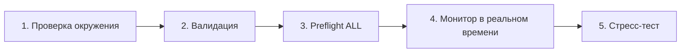

# IrsanAI TPM Agent Forge
[🇬🇧 English](../../README.md) | [🇩🇪 Deutsch](../../README.de.md) | [🇪🇸 Español](../../docs/i18n/README.es.md) | [🇮🇹 Italiano](../../docs/i18n/README.it.md) | [🇧🇦 Bosanski](../../docs/i18n/README.bs.md) | [🇷🇺 Русский](../../docs/i18n/README.ru.md) | [🇨🇳 中文](../../docs/i18n/README.zh-CN.md) | [🇫🇷 Français](../../docs/i18n/README.fr.md) | [🇧🇷 Português (BR)](../../docs/i18n/README.pt-BR.md) | [🇮🇳 हिन्दी](../../docs/i18n/README.hi.md) | [🇹🇷 Türkçe](../../docs/i18n/README.tr.md) | [🇯🇵 日本語](../../docs/i18n/README.ja.md)

[🇬🇧 English](../../README.md) | [🇩🇪 Deutsch](../../README.de.md) | [🇪🇸 Español](./README.es.md) | [🇮🇹 Italiano](./README.it.md) | [🇧🇦 Bosanski](./README.bs.md) | [🇷🇺 Русский](./README.ru.md) | [🇨🇳 中文](./README.zh-CN.md) | [🇫🇷 Français](./README.fr.md) | [🇧🇷 Português (BR)](./README.pt-BR.md) | [🇮🇳 हिन्दी](./README.hi.md) | [🇹🇷 Türkçe](./README.tr.md) | [🇯🇵 日本語](./README.ja.md)

Чистый bootstrap для автономной мультиагентной установки (BTC, COFFEE и др.) с кроссплатформенными опциями времени выполнения.

## Что Включено

- `production/preflight_manager.py` – надежное опробование рыночных источников с Alpha Vantage + цепочкой резервных вариантов и локальным кешем.
- `production/tpm_agent_process.py` – простой цикл агента на каждый рынок.
- `production/tpm_live_monitor.py` – мониторинг BTC в реальном времени с опциональным CSV warm-start и уведомлениями Termux.
- `core/tpm_scientific_validation.py` – pipeline обратного тестирования и статистической валидации.
- `scripts/tpm_cli.py` – унифицированный запуск для Termux/Linux/macOS/Windows.
- `scripts/stress_test_suite.py` – стресс-тест на отказоустойчивость и задержки.
- `scripts/start_agents.sh`, `scripts/health_monitor_v3.sh` – помощники по операциям с процессами.
- `core/scout.py`, `core/reserve_manager.py`, `core/init_db_v2.py` – операционные инструменты ядра.

## Универсальный Быстрый Старт

```bash
python scripts/tpm_cli.py env
python scripts/tpm_cli.py validate
python scripts/tpm_cli.py preflight --market ALL
python scripts/tpm_cli.py live --history-csv btc_real_24h.csv --poll-seconds 3600
```

## Проверка Цепочки Времени Выполнения (каузальная/порядковая целостность)

Стандартный поток репозитория намеренно линейный, чтобы избежать дрейфа скрытого состояния и “ложной уверенности” во время живых запусков.


```mermaid
flowchart LR
  A[1. Проверка окружения] --> B[2. Валидация]
  B --> C[3. Preflight ALL]
  C --> D[4. Монитор в реальном времени]
  D --> E[5. Стресс-тест]
```

### Логика проходных точек (что должно быть истинным перед следующим шагом)
- **Проход 1 – Окружение:** контекст Python/платформы корректен (`env`).
- **Проход 2 – Научная достоверность:** базовое поведение модели воспроизводимо (`validate`).
- **Проход 3 – Надежность источников:** рыночные данные + цепочка резервов доступны (`preflight --market ALL`).
- **Проход 4 – Исполнение во времени:** живой цикл запускается с известной историей входных данных (`live`).
- **Проход 5 – Прочные гарантии:** цели по задержкам/отказоустойчивости выдерживаются под нагрузкой (`stress_test_suite.py`).

✅ Уже исправлено в коде: CLI preflight теперь поддерживает `--market ALL`, что согласуется с quickstart и docker-потоком.

## Выберите Вашу Задачу (призыв к действию по ролям)

> **Вы — X? Выберите своё направление. Запуск меньше 60 секунд.**

| Персона | Что важно | Путь клика | Первая команда |
|---|---|---|---|
| 📈 **Трейдер** | Быстрый отклик, оперативное выполнение | [`tpm_live_monitor.py`](./production/tpm_live_monitor.py) | `python scripts/tpm_cli.py live --history-csv btc_real_24h.csv --poll-seconds 3600` |
| 💼 **Инвестор** | Стабильность, доверие к источникам, устойчивость | [`preflight_manager.py`](./production/preflight_manager.py) | `python scripts/tpm_cli.py preflight --market ALL` |
| 🔬 **Ученый** | Доказательства, тесты, статистические сигналы | [`tpm_scientific_validation.py`](./core/tpm_scientific_validation.py) | `python scripts/tpm_cli.py validate` |
| 🧠 **Теоретик** | Каузальная структура + архитектура будущего | [`core/scout.py`](./core/scout.py) + [`Следующие шаги`](#next-steps) | `python scripts/tpm_cli.py validate` |
| 🛡️ **Скептик (приоритет)** | Ломайте предположения до продакшена | [`stress_test_suite.py`](./scripts/stress_test_suite.py) + [`preflight_manager.py`](./production/preflight_manager.py) | `python scripts/tpm_cli.py preflight --market ALL && python scripts/stress_test_suite.py` |
| ⚙️ **Оператор / DevOps** | Время работы, здоровье процессов, восстановление | [`start_agents.sh`](./scripts/start_agents.sh) + [`health_monitor_v3.sh`](./scripts/health_monitor_v3.sh) | `bash scripts/start_agents.sh` |

### Вызов Скептика (рекомендуется новичкам)
Если вы сделаете **только одно**, запустите это и изучите отчет:

```bash
python scripts/tpm_cli.py preflight --market ALL
python scripts/stress_test_suite.py
```

Если этот сценарий вас убедит, остальная часть репозитория, вероятно, тоже будет вам полезна.

## Заметки по Платформе

- **Android / Termux (Samsung и др.)**
  ```bash
  bash scripts/termux_bootstrap.sh
  cd ~/TPM-Agent
  python scripts/tpm_cli.py env
  python scripts/tpm_cli.py preflight --market ALL
  python scripts/tpm_cli.py live --history-csv btc_real_24h.csv --notify --vibrate-ms 1000
  ```
  Для демонстрации веб-интерфейса Android (Termux) запустите Forge runtime локально:
  ```bash
  cd ~/TPM-Agent
  bash scripts/termux_forge.sh start
  # остановка: bash scripts/termux_forge.sh stop
  # статус: bash scripts/termux_forge.sh status
  ```
  Скрипт автоматически откроет браузер (если доступен) и запустит сервис в фоне.
  Если на Android возникала ошибка сборки `pydantic-core`/Rust или `scipy`/Fortran, используйте
  `python -m pip install -r requirements-termux.txt` (безопасный набор для Termux, Rust toolchain не требуется).
  В веб-интерфейсе можно управлять запуском и остановкой runtime; индикатор прогресса отображает статус перехода.
- **iPhone (максимум возможностей):** используйте shell-приложения, такие как iSH / a-Shell. Специфические уведомления Termux тут недоступны.
- **Windows / Linux / macOS:** используйте те же команды CLI; для постоянного запуска рекомендован tmux/scheduler/cron.

## Docker (Самый Легкий Кросс-ОС Путь)

Используйте Docker в этом точном порядке (без догадок):

### Шаг 1: Соберите Docker-образ для веб-runtime

```bash
docker compose build --no-cache tpm-forge-web
```

### Шаг 2: Запустите сервис веб-панели

```bash
docker compose up tpm-forge-web
```

Теперь откройте в браузере `http://localhost:8787` (**не** `http://0.0.0.0:8787`). Uvicorn связывается с `0.0.0.0` внутри, но клиенты должны использовать `localhost` (или IP локальной сети хоста).

### Шаг 3 (опционально): изучите не веб-сервисы

```bash
docker compose run --rm tpm-preflight
docker compose run --rm tpm-live
```

- `tpm-preflight` = проверки источников/связи (только вывод CLI).
- `tpm-live` = логи мониторинга в терминале (только CLI, **без веб UI**).
- `tpm-forge-web` = FastAPI + пользовательский дашборд (тот, что с интерфейсом и контролем прогресса/runtime).

Если `tpm-preflight` сообщает, что `ALPHAVANTAGE_KEY не установлен`, COFFEE всё равно работает через резервные источники.

Если страница пустая:
- протестируйте API напрямую: `http://localhost:8787/api/frame`
- проверьте документацию FastAPI: `http://localhost:8787/docs`
- сделайте жесткое обновление страницы (`Ctrl+F5`)
- при необходимости перезапустите только веб-сервис: `docker compose restart tpm-forge-web`

Опционально для улучшения качества COFFEE:

```bash
export ALPHAVANTAGE_KEY="<ваш_ключ>"
docker compose run --rm tpm-preflight
```

## Предсказания сбоев и мобильные уведомления

- Live cockpит Forge теперь показывает краткосрочные прогнозы по рынкам (`up/down/sideways`) с уровнем уверенности в `/api/markets/live`.
- При обнаружении рыночного сбоя (всплеск ускорения) runtime может инициировать:
  - toast и вибрацию в Termux
  - опциональный хук уведомления/звука
  - опциональный пуш в Telegram (если токен бота и chat id настроены в `config/config.yaml`).
- Настройка в дашборде через **Save Alerts** / **Test Alert** или через API:
  - `GET /api/alerts/preferences`
  - `POST /api/alerts/preferences`
  - `POST /api/alerts/test`

## Валидация

Запустите научный pipeline валидации:

```bash
python core/tpm_scientific_validation.py
```

Артефакты:
- `state/TPM_Scientific_Report.md`
- `state/TPM_test_results.json`

## Источники и Резервы

`production/preflight_manager.py` поддерживает:
- Alpha Vantage в первую очередь для COFFEE (при наличии `ALPHAVANTAGE_KEY`)
- Цепочку резервов TradingView + Yahoo
- локальный кеш fallback в `state/latest_prices.json`

Запуск preflight напрямую:

```bash
export ALPHAVANTAGE_KEY="<ваш_ключ>"
python production/preflight_manager.py --market ALL
```

Запуск стресс-теста отказов (цель `p95 < 1000ms`):

```bash
python scripts/stress_test_suite.py
```

Вывод: `state/stress_test_report.json`


## Статус в реальном времени: возможности TPM агента на сегодня

**Текущее состояние:**
- Производственный веб-runtime Forge доступен (`production.forge_runtime:app`).
- Начальная финансовая конфигурация использует **BTC + COFFEE**.
- Веб-панель показывает живой фрейм, состояние агента, transfer entropy и сводку домена.
- Пользователи могут добавлять новых агентов рынков во время выполнения (`POST /api/agents`).

**Целевой функционал (желательно иметь):**
- Бенчмаркинг с реальными данными и явными порогами приемлемости (precision/recall/FPR/drift).
- Строгие правила рефлексивного управления для авто-режима безопасности.
- Коллективная память для версии и паттернов обучения по доменам.

**Следующий этап расширения:**
- Оркестратор политики на основе режима (тренд/шок/флэт) для всех агентов.
- Один пилотный не финансовый домен (например, медицина или сейсмика) с явными договорённостями по данным.

## Помощник по слиянию PR и конфликтам

- Список проверки слияния (конфликты GitHub): `docs/MERGE_CONFLICT_CHECKLIST.de.md`

### Область сегодня: Windows + смартфон для финансов TPM

- **Windows:** Runtime Forge + веб-интерфейс + Docker/PowerShell/клик-старт работают.
- **Смартфон:** Android/Termux live-мониторинг работает; веб UI отзывчив на мобильных.
- **Мультиагент в реальном времени:** BTC + COFFEE по умолчанию активны; в UI можно динамически добавлять рынки.
- **Правило пределов источников:** если запрашиваемый рынок не покрывается встроенными источниками, предоставьте явный URL источника и авторизационные данные.

## Тест в реальном времени на Windows (двухпутевая система)

### Путь A — Для разработчиков/продвинутых (PowerShell, CMD, PyCharm, IDE)

```powershell
python -m venv .venv
.\.venv\Scripts\Activate.ps1
pip install -r requirements.txt
python scripts/tpm_cli.py forge-dashboard --open-browser --port 8787
```

### Путь B — Для рядовых пользователей (клик и запуск)

1. Дважды кликните `scripts/windows_click_start.bat`
2. Скрипт автоматически выбирает лучший доступный путь:
   - Если есть Python -> venv + pip + runtime
   - Иначе Docker Compose (если есть)

Техническая основа: `scripts/windows_bootstrap.ps1`.

## Производственный Web Runtime Forge (BTC + COFFEE, расширяемый)

Да, работа уже **началась** в репозитории и сейчас расширяется:

- Запускается по умолчанию с одним финансовым TPM агентом для **BTC** и одним для **COFFEE**.
- Пользователи могут добавлять больше рынков/агентов прямо из веб UI (`/api/agents`).
- Работает как постоянный сервис runtime с выводом живого фрейма (`/api/frame`) для погружения.

### Запуск (локально)

```bash
uvicorn production.forge_runtime:app --host 0.0.0.0 --port 8787
# откройте http://localhost:8787
```

### Запуск (Docker)

```bash
docker compose up tpm-forge-web
# откройте http://localhost:8787
```

## TPM Playground (интерактивный MVP)

Теперь можно исследовать поведение TPM интерактивно через браузер:

```bash
python -m http.server 8765
# откройте http://localhost:8765/playground/index.html
```

Включает:
- Отображение аномалий слаботочных сигналов одного агента
- Мини-роевое давление консенсуса (BTC/COFFEE/VOL)
- Перекрестно-доменные резонансы передачи (синтетика финансов/погода/здоровье)

См. `playground/README.md`.

## Следующие шаги

- Модуль transfer entropy для каузального анализа между рынками.
- Оптимизатор с обновлениями политики на основе исторической производительности.
- Каналы оповещений (Telegram/Signal) + постоянство загрузки.


---

## Глубокий анализ IrsanAI: как ядро TPM “мыслит” в сложных системах

### 1) Визионерское преобразование: от торгового агента к универсальной экосистеме TPM

### Чем уникален алгоритм IrsanAI-TPM? (исправленная формулировка)

Рабочая гипотеза ядра TPM:

- В сложных, хаотичных системах ранний предупредительный сигнал часто скрыт в **микро-остатке**: крошечные отклонения, слабые корреляции, почти пустые точки данных.
- Там, где классические системы видят только `0` или "недостаточную релевантность", TPM ищет **структурированные аномалии** (паттерны глюков) в потоке контекста.
- TPM оценивает не только само значение, но и **изменения отношений во времени, качество источника, режим и каузальное окружение**.

Важное замечание о корректности: TPM **не предсказывает будущее волшебным образом**. Его задача — обеспечить **раннее вероятностное обнаружение** смен режимов, пробоев и сбоев — при условии хорошего качества данных и прохождения валидационных проходных точек.

### Думайте масштабно: почему это применимо не только в финансах

Если TPM может выявлять слабые предвестники в финансовых инструментах (индексы/тикеры/ISIN, ликвидность, микроструктура), этот же принцип применим ко многим другим областям:

- **Поток событий/датчиков + модель контекста + слой аномалий + цикл обратной связи**
- Каждая профессия может быть смоделирована как "рынок" с доменно-специфичными признаками, узлами, корреляциями и аномалиями
- Специализированные агенты TPM могут учиться по доменам, сохраняя локальную профессиональную логику и этику

### 100 профессий как целевые области TPM

| # | Профессия | Аналог TPM данных | Цель обнаружения аномалий/паттернов |
|---|---|---|---|
| 1 | Аналитик полиции | Журналы происшествий, геовременные карты преступности, сети | Ранние сигналы эскалации кластеров преступлений |
| 2 | Командир пожарной службы | Цепочки тревог, сенсоры, погода, профиль зданий | Прогноз окон распространения пожаров и опасностей |
| 3 | Медработник скорой помощи | Причины вызовов, время реагирования, нагрузка больниц | Обнаружение стресса возможностей до срыва |
| 4 | Врач неотложки | Потоки триажа, витальные показатели, динамика ожидания | Раннее оповещение о критической декомпенсации |
| 5 | Медсестра ICU | Тенденции вентиляции/лабораторных, реакции на медикаменты | Выявление микросигналов сепсиса/шока |
| 6 | Эпидемиолог | Частота случаев, мобильность, сточные/лабораторные данные | Ранняя тревога вспышек до экспоненциальной фазы |
| 7 | Семейный врач | ЕHR паттерны, назначение лекарств, пробелы в наблюдении | Обнаружение переходов к хроническим рискам |
| 8 | Клинический психолог | Траектории сессий, языковые маркеры, сон/активность | Раннее выявление рецидивов и кризисных индикаторов |
| 9 | Исследователь фармацевтики | Скрининг соединений, профили побочек, геномика | Выявление скрытой эффективности и кластеров побочек |
| 10 | Биотехнолог | Последовательности/процессы/культуры клеток | Выявление дрейфа и риска загрязнения |
| 11 | Климатолог | Атмосферные/океанические временные ряды, спутниковые данные | Определение предвестников точек переломов |
| 12 | Метеоролог | Давление/влажность/ветер/радар | Предсказание локальных хаотичных погодных сдвигов |
| 13 | Сейсмолог | Микроземлетрясения, поля напряжений, сенсорные массивы | Обнаружение предвестников крупных сдвижек |
| 14 | Вулканолог | Газ, тремор, деформации во времени | Сужение окон вероятности извержений |
| 15 | Гидролог | Контроль уровня рек, осадки, влажность почвы | Выявление фаз паводков и засух |
| 16 | Океанолог | Течения, температура, солёность, буи | Выявление цунами/анomalий экосистемы |
| 17 | Трейдер энергии | Нагрузка, спотовые цены, погода, состояние сетей | Ранний сигнал пробоев цен и нагрузки |
| 18 | Оператор электросети | Частота сети, состояние линий, переключения | Обнаружение риска каскадных сбоев |
| 19 | Оператор ветропарка | Телеметрия турбин, ветровые данные, журналы обслуживания | Прогноз отказов и дрейфа производительности |
| 20 | Оператор солнечной станции | Облученность, телеметрия инверторов, тепловая нагрузка | Выявление деградации и аномалий выработки |
| 21 | Менеджер водных ресурсов | Поток, датчики качества, модели потребления | Раннее выявление загрязнений/дефицита |
| 22 | Менеджер дорожного движения | Плотность, аварии, дорожные работы, мероприятия | Предсказание пробок и роста аварийности |
| 23 | Менеджер управления ж/д | Соблюдение расписаний, состояние путей, цепочки задержек | Раннее прерывание системных каскадов задержек |
| 24 | Диспетчер воздушного движения | Траектории полётов, погода, загруженность слотов | Обнаружение конфликтов и узких мест |
| 25 | Менеджер портовой логистики | Время стоянки, потоки контейнеров, таможня | Предвестники срывов в поставках |
| 26 | Менеджер цепочки поставок | ETA, инвентарь, пульс спроса, риски | Минимизация бурных и дефицитных аномалий |
| 27 | Руководитель производства | OEE, телеметрия процессов, брак, время настройки | Обнаружение дрейфа качества и аномалий машин |
| 28 | Инженер по качеству | Распределения допусков, сигналы процесса | Раннее выявление близких к нулю дефектов |
| 29 | Инженер по робототехнике | Траектории движений, нагрузка актуаторов, циклы управления | Прогноз нестабильности/отказа управления |
| 30 | Инженер авиационного обслуживания | Телеметрия двигателя/полетов, история обслуживания | Предиктивная диагностика компонентов |
| 31 | Руководитель строительства | Прогресс, погода, даты поставок, IoT сенсоры | Оценка риска сбоев графика и бюджета |
| 32 | Конструктор | Нагрузка, вибрации, усталость/старение | Обнаружение критических переходов конструкции |
| 33 | Урбанист | Мобильность, демография, выбросы, землепользование | Выявление формирующихся городских стрессов |
| 34 | Архитектор | Работа зданий, заполняемость, энергокурвы | Выявление несоответствий проектирования и эксплуатации |
| 35 | Фермер | Почва/погода/урожай/рынок | Раннее выявление болезней и аномалий урожая |
| 36 | Агроном | Спутниковые данные по питанию/влагосодержанию | Точное раннее целевое вмешательство |
| 37 | Лесоуправление | Влажность, паттерны вредителей, индикаторы пожаров | Раннее обнаружение повреждений леса/пожаров |
| 38 | Рыбохозяйство | Учёт улова, качество воды, миграция | Обнаружение переловов и рисков коллапса |
| 39 | Инспектор продбезопасности | Лабораторные данные, цепочки холодоснабжения, поставки | Раннее прерывание цепочек загрязнения |
| 40 | Главный повар | Пульс спроса, запас здоровья, коэффициенты отходов | Минимизация порчи и дефицитов |
| 41 | Оператор розницы | Потоки POS, трафик, ротация запасов | Обнаружение всплесков спроса и убыли товаров |
| 42 | Менеджер e-commerce | Кликовые треки, поведение в корзине, возвраты | Выявление подозрительных и уходящих клиентов |
| 43 | Маркетинговый аналитик | Метрики кампаний, ответ сегментов | Обнаружение микро-трендов до массового распространения |
| 44 | Руководитель продаж | Скорость конвейера, граф касаний | Обнаружение рисков сделок и точных моментов |
| 45 | Руководитель поддержки | Поток тикетов, кластеры тем, дрейф SLA | Выявление волн эскалаций и корневых причин |
| 46 | Продукт-менеджер | Принятие функций, удержание, обратная связь | Раннее обнаружение несоответствия продукта рынку |
| 47 | UX-исследователь | Тепловые карты, пути пользователей, точки ухода | Выявление скрытых трений взаимодействия |
| 48 | Программист | Логи, трассировки, метрики деплоя | Обнаружение каскадов ошибок до инцидента |
| 49 | Инженер надежности сайта | Задержки, бюджеты ошибок, насыщение | Обнаружение деградации до сбоев |
| 50 | Аналитик по кибербезопасности | Сетевые потоки, события IAM, SIEM-оповещения | Обнаружение путей атаки и бокового перемещения |
| 51 | Аналитик мошенничества | Графы транзакций, отпечатки устройств | Обнаружение мошенничества в слаботочных сигналах |
| 52 | Менеджер рисков банка | Портфель/макро/ликвидность | Обнаружение стрессовых режимов и концентраций риска |
| 53 | Актуарий страхования | Потоки претензий, карты экспозиций, климат | Прогноз волн требований и стресс резервов |
| 54 | Налоговый консультант | Паттерны бухгалтерии, сроки подачи | Обнаружение рисков соответствия и пути оптимизации |
| 55 | Аудитор | Треки контроля, исключительные паттерны | Обнаружение аномалий в учёте в масштабе |
| 56 | Юрист | Хронология дел, графы прецедентов, сроки | Обнаружение рисков судебных процессов |
| 57 | Судья/администратор суда | Нагрузка дел, циклы | Обнаружение узких мест системы правосудия |
| 58 | Руководитель исправительных учреждений | Заполняемость, сети происшествий, поведенческие тренды | Обнаружение кластеров насилия/рецидива |
| 59 | Таможенник | Торговые манифесты, декларации, маршруты | Обнаружение сигналов контрабанды/уклонения |
| 60 | Аналитик оборонной разведки | ISR-данные, логистика, темп операций | Раннее обнаружение динамики эскалации |
| 61 | Дипломатический аналитик | Цепочки событий, коммуникации | Обнаружение сдвигов геополитических режимов |
| 62 | Учитель | Процесс усвоения, посещаемость, вовлеченность | Обнаружение риска отсева и потребности в поддержке |
| 63 | Директор школы | Кластеры успеваемости, посещаемость, ресурсы | Обнаружение системных стрессов школы |
| 64 | Преподаватель университета | Активность курсов, отказы, отзывы | Раннее стабилизирование успехов студентов |
| 65 | Исследователь образования | Траектории когорт, педагогические переменные | Выявление устойчивых эффектов интервенций |
| 66 | Социальный работник | Сети дел, встречи, рисковые маркеры | Обнаружение путей эскалации кризиса |
| 67 | Координатор НПО | Отчёты с поля, потоки помощи, сигналы потребности | Выявление пробелов в эффекте и горячих точек |
| 68 | Консультант по трудоустройству | Профили навыков, спрос на труд, переходы | Обнаружение дисбалансов и потребности в переквалификации |
| 69 | HR-менеджер | Набор/текучка/производительность | Раннее выявление выгорания и риска ухода |
| 70 | Рекрутер | Воронка, таксономия навыков, пульс рынка | Обнаружение рисков несоответствия и окон возможностей |
| 71 | Организационный консультант | Каденция решений, дрейф KPI, сетевые паттерны | Раннее обнаружение дисфункций команды |
| 72 | Руководитель проектов | Вехи, зависимости, граф блокеров | Прогноз срывов графика и объёмов |
| 73 | Журналист | Граф надежности источников, потоки событий | Раннее обнаружение кластеров дезинформации |
| 74 | Следственный журналист | Сети документов, финансовых/коммуникационных следов | Обнажение скрытых системных аномалий |
| 75 | Модератор контента | Потоки постов/комментариев, семантические сдвиги | Раннее выявление волн злоупотреблений и радикализации |
| 76 | Художник | Траектории реакции аудитории, стилистические векторы | Обнаружение формирующейся эстетики |
| 77 | Музыкальный продюсер | Характеристики прослушиваний, аранжировочные векторы | Обнаружение потенциала прорыва или ниши |
| 78 | Дизайнер игр | Телеметрия, прогрессия, кривые ухода | Обнаружение фрустрации и дисбаланса |
| 79 | Тренер по спорту | Показатели производительности/биометрии | Обнаружение предвестников травм и спадов формы |
| 80 | Тренер по атлетике | Маркеры движений/восстановления | Обнаружение перегрузок до вынужденного простоя |
| 81 | Спортивный врач | Диагностика, нагрузка на реабилитацию, риск рецидива | Оптимизация окон возвращения к игре |
| 82 | Аналитик судейства | Поток решений, темп, контекст происшествий | Обнаружение дрейфа консистентности/справедливости |
| 83 | Организатор мероприятий | Продажа билетов, мобильность, погода, безопасность | Обнаружение эскалации рисков толпы и безопасности |
| 84 | Менеджер туризма | Бронирования, сигналы репутации | Обнаружение сдвигов спроса и настроений |
| 85 | Менеджер отеля | Заполняемость, качество услуг, жалобы | Раннее выявление нестабильности качества и спроса |
| 86 | Управляющий недвижимостью | Потоки аренды, обслуживание, рыночные сравнения | Раннее выявление рисков вакантности/дефолтов |
| 87 | Менеджер объекта | IoT здания, энергия, интервалы обслуживания | Обнаружение сбоев и неэффективных паттернов |
| 88 | Оператор по утилизации отходов | Потоки мусора, маршруты, экологические показатели | Выявление нелегальных свалок и пробелов процессов |
| 89 | Экологический инспектор | Выбросы, отчёты, спутниковые слои | Обнаружение нарушений и риска точек перегиба |
| 90 | Аналитик циркулярной экономики | Паспорт материалов, уровни восстановления | Обнаружение утечек и возможностей замкнутых циклов |
| 91 | Астрофизик | Потоки телескопа, спектры, модели шума | Обнаружение редких космических событий |
| 92 | Инженер космических операций | Телеметрия, параметры орбиты, диагностика систем | Раннее обнаружение критических миссионных аномалий |
| 93 | Квантовый инженер | Профили шума, дрейфы калибровки, ошибки вентилей | Обнаружение декогеренции и дрейфа контроля |
| 94 | Data Scientist | Дрейф признаков, качество модели, целостность данных | Обнаружение коллапса модели и смещения |
| 95 | Этик AI | Результаты решений, метрики честности | Обнаружение несправедливых паттернов и пробелов управления |
| 96 | Исследователь философии науки | Пути теория-данные | Обнаружение сигналов несоответствия парадигм |
| 97 | Математик | Остаточные структуры, инварианты, ошибки | Обнаружение скрытых регулярностей и классов выбросов |
| 98 | Системный теоретик | Динамика узлов/рёбер, задержки обратной связи | Обнаружение динамики склонения сетей |
| 99 | Антрополог | Полевые наблюдения, языковые/социальные сети | Обнаружение предвестников конфликтов культурных сдвигов |
| 100 | Стратег форсайта | Техно-кривые, регуляция, данные поведения | Связь сценариев с ранними индикаторами |

### Особенности для стран (эквиваленты профессий по юрисдикциям)

Чтобы сохранить логическую правильность списка по регионам, сопоставление ролей TPM следует рассматривать как **функциональные аналоги**, а не буквальный перевод должностей:

- **Германия ↔ США/Великобритания:** `Polizei` против разграниченных функций (`Police Department`, `Sheriff`, `State Trooper`) и различий в прокуратуре (`Staatsanwaltschaft` vs `District Attorney/Crown Prosecution`).
- **Испания / Италия:** структуры цивильного права с раздельными судебными и полицейскими процессами; данные часто разнесены по региональному и национальному уровням.
- **Босния и Герцеговина:** многоуровневое управление приводит к фрагментации данных; TPM выигрывает от федеративного слияния аномалий.
- **Россия / Китай:** определения ролей и правила управления данными отличаются; TPM должен настраиваться с учетом локальных нормативных ограничений и институциональных аналогов.
- **Другие важные регионы:** Франция, Бразилия, Индия, Япония, страны MENA и Африка к югу от Сахары могут быть подключены через сопоставление аналогичных функций и доступных данных.

### Философско-научный взгляд

- От инструмента к **эпистемической инфраструктуре**: домены реализуют "слабое раннее знание".
- От изолированных систем к **федерациям агентов**: локальная этика + общая грамматика аномалий.
- От реактивного отклика к **антиципативному управлению**: предотвращение вместо позднего контроля кризисов.
- От статических моделей к **живым теориям**: постоянная перенастройка под реальные шоки.

Ключевая идея: ответственно управляемый клaster TPM не может контролировать хаос — но может помочь институтам понять его раньше, управлять устойчивее и принимать более гуманные решения.

## Многоязычное расширение (в процессе)

Для поддержки языковой резонансности доступны локализованные стратегические обзоры:

- Испанский (`docs/i18n/README.es.md`)
- Итальянский (`docs/i18n/README.it.md`)
- Боснийский (`docs/i18n/README.bs.md`)
- Русский (`docs/i18n/README.ru.md`)
- Китайский упрощённый (`docs/i18n/README.zh-CN.md`)
- Французский (`docs/i18n/README.fr.md`)
- Португальский Бразилия (`docs/i18n/README.pt-BR.md`)
- Хинди (`docs/i18n/README.hi.md`)
- Турецкий (`docs/i18n/README.tr.md`)
- Японский (`docs/i18n/README.ja.md`)

Каждый локализованный файл включает заметки об адаптации к региону и ссылку на этот канонический английский раздел с полной матрицей из 100 профессий.

## IrsanAI Meta Качества (SOLL vs IST)

Для текущего уровня зрелости репозитория, промежуточного состояния качества и каузальной дорожной карты на основе реальных ожиданий пользователей смотрите:

- `docs/IRSANAI_QUALITY_META.md`

Этот документ является теперь справочником для:
- Глубины требований по функциям (UX/UI + операционная устойчивость),
- Требований по паритету Docker/Android,
- А также приемочных контролей качества для будущих PR.

## Режим паритета i18n (полное зеркалирование)

Чтобы ни одна языковая аудитория не была в проигрыше, файлы i18n теперь поддерживаются в полном каноническом паритете с `README.md`.

Команда синхронизации:

```bash
python scripts/i18n_full_mirror_sync.py
```

## Замечание для разработчиков (LOP – Список открытых пунктов)

Что, на мой взгляд, еще открыто (содержательно, а не технически заблокировано):

| Пункт | Текущее состояние | Как эффективно продолжить |
|---|---|---|
| **Модуль Transfer Entropy для кросс-маркет каузальности** | **Выполнено ✅** – реализован как `TransferEntropyEngine` и подключен в Forge-оркестраторе. | Довести настройку: определить доменно-специфичные пороги и правила интерпретации. |
| **Оптимизатор/обновление политики на основе истории** | **Выполнено ✅** – оценка фитнеса, обновление награды и отбор кандидатов проходят по циклу Tick. | Документировать режимы работы (консервативный/агрессивный) и сделать тестируемыми как профили управления. |
| **Оповещения (Telegram/Signal)** | **Частично 🟡** – инфраструктура есть, по умолчанию отключена. | Определить политику тревог: какие события, уровни серьезности, каналы и ответственные. |
| **Устойчивость загрузки / постоянная работа** | **Частично 🟡** – есть запуск и монитор здоровья в tmux, но нет универсального runbook для всех платформ. | Определить документально профили платформ (Termux/Linux/Docker) со стартом при загрузке, политикой рестартов и путями эскалации. |
| **Координированный мета-слой (из “Следующего Этапа Расширения”)** | **Частично 🟡** – части есть (оркестратор + энтропия + награда), но нет полноценного описания агрегатора политик по режимам. | Добавить явную модель управления политиками (тренд/шок/флэт) для весов агентов. |
| **Коллективная память (версионированный архив паттернов обучения)** | **Открыто 🔴** – названо в видении, но нет четкого процесса хранения и ревью. | Определить формат паттернов, логику версий и критерии качества (когда паттерн “действует”). |
| **Рефлексивное управление (автоматический консервативный режим при неопределенности)** | **Открыто 🔴** – как целевая модель указано, не формализовано как правило принятия решений. | Перевести индикаторы неопределенности и жёсткие условия переключения в набор правил управления. |
| **Расширение доменов сверх Finance/Weather** | **Открыто 🔴** – другие домены как видение/шаблоны есть, не переведено в продакшенные договоры данных. | Запустить следующий пилот домена (например, медицина или сейсмика) с четкими метриками и источниками данных. |
| **Расширение научной доказательности на реальные данные** | **Открыто 🔴** – валидация робастна, но построена на синтетических сегментах режимов. | Добавить бенчмаркинг по реальным данным с жесткими приемочными критериями (Precision/Recall/FPR/Drift). |
| **Языковое расширение / развитие i18n** | **Частично 🟡** – несколько посадочных страниц есть; отмечено как “в процессе”. | Определить процесс синхронизации (когда изменения из корневого README распространять во все i18n файлы). |

Краткий итог: предыдущие “Следующие шаги” **в значительной мере уже запущены или реализованы технически**; главный потенциал сейчас в **содержательной операционализации** (управление, политики, доменная логика, доказательности по реальным данным) и **консистентном документообороте и i18n-поддержке**.

### План исполнения LOP

Для последовательности реализации, критериев выполнения и доказательств каждого открытого пункта см.:

- `docs/LOP_EXECUTION_PLAN.md`

## LOP (финал - приоритизация)

1. **P1 Расширение доказательности по реальным данным:** бенчмаркинг с жёсткими критериями (Precision/Recall/FPR/Drift).
2. **P2 Финализация рефлексивного управления:** жёсткие правила автоматического безопасного режима при неопределённости.
3. **P3 Стандартизация коллективной памяти:** версионированные паттерны обучения с процессом ревью по доменам.
4. **P4 Дальнейшее развертывание Web-Immersion:** Ролевые представления для дополнительных отраслей TPM на основе нового адаптивного интерфейса.

**Примечание по платформам:** сейчас акцент на **Windows + смартфоны**. **Дополнительно в конце LOP:** macOS, Linux и дополнительные профили платформ.