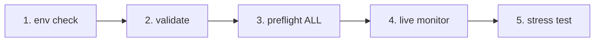

# IrsanAI TPM Agent Forge

[🇬🇧 English](./README.md) | [🇩🇪 Deutsch](./README.de.md) | [🇪🇸 Español](./docs/i18n/README.es.md) | [🇮🇹 Italiano](./docs/i18n/README.it.md) | [🇧🇦 Bosanski](./docs/i18n/README.bs.md) | [🇷🇺 Русский](./docs/i18n/README.ru.md) | [🇨🇳 中文](./docs/i18n/README.zh-CN.md) | [🇫🇷 Français](./docs/i18n/README.fr.md) | [🇧🇷 Português (BR)](./docs/i18n/README.pt-BR.md) | [🇮🇳 हिन्दी](./docs/i18n/README.hi.md) | [🇹🇷 Türkçe](./docs/i18n/README.tr.md) | [🇯🇵 日本語](./docs/i18n/README.ja.md)

Чистый бутстрап для автономной многоагентной системы (BTC, COFFEE и др.) с кроссплатформенными вариантами исполнения.

## Что включено

- `production/preflight_manager.py` – надежное зондирование источников рынка с Alpha Vantage + резервная цепочка и локальный кэш.
- `production/tpm_agent_process.py` – простой цикл агента для каждого рынка.
- `production/tpm_live_monitor.py` – живой монитор BTC с опциональным CSV-разогревом и уведомлениями Termux.
- `core/tpm_scientific_validation.py` – пайплайн бэктестинга + статистической валидации.
- `scripts/tpm_cli.py` – унифицированный лаунчер для Termux/Linux/macOS/Windows.
- `scripts/stress_test_suite.py` – стресс-тест на отказоустойчивость/задержку.
- `scripts/start_agents.sh`, `scripts/health_monitor_v3.sh` – помощники по операциям с процессами.
- `core/scout.py`, `core/reserve_manager.py`, `core/init_db_v2.py` – основной операционный инструментарий.

## Универсальный быстрый старт

```bash
python scripts/tpm_cli.py env
python scripts/tpm_cli.py validate
python scripts/tpm_cli.py preflight --market ALL
python scripts/tpm_cli.py live --history-csv btc_real_24h.csv --poll-seconds 3600
```

## Проверка цепочки выполнения (причинно-следственная/логическая последовательность)

Поток репозитория по умолчанию намеренно линеен, чтобы избежать дрейфа скрытого состояния и "ложной уверенности" во время живых запусков.


```mermaid
flowchart LR
  A[1. env check] --> B[2. validate]
  B --> C[3. preflight ALL]
  C --> D[4. live monitor]
  D --> E[5. stress test]
```

### Логика ворот (что должно быть истинным перед следующим шагом)
- **Ворота 1 – Окружение:** Контекст Python/платформы верен (`env`).
- **Ворота 2 – Научная обоснованность:** Базовое поведение модели воспроизводимо (`validate`).
- **Ворота 3 – Надежность источника:** Рыночные данные + резервная цепочка доступны (`preflight --market ALL`).
- **Ворота 4 – Выполнение в реальном времени:** Живой цикл работает с известной историей ввода (`live`).
- **Ворота 5 – Уверенность в противодействии:** Цели по задержке/отказоустойчивости сохраняются в условиях стресса (`stress_test_suite.py`).

✅ Уже исправлено в коде: CLI preflight теперь поддерживает `--market ALL`, соответствует быстрому старту + потоку docker.

## Выбери свою миссию (CTA на основе ролей)

> **Вы X? Выберите свой путь. Начните менее чем за 60 секунд.**

| Персона | Что вас волнует | Путь | Первая команда |
|---|---|---|---|
| 📈 **Трейдер** | Быстрый пульс, действенное время выполнения | [`tpm_live_monitor.py`](./production/tpm_live_monitor.py) | `python scripts/tpm_cli.py live --history-csv btc_real_24h.csv --poll-seconds 3600` |
| 💼 **Инвестор** | Стабильность, доверие к источнику, устойчивость | [`preflight_manager.py`](./production/preflight_manager.py) | `python scripts/tpm_cli.py preflight --market ALL` |
| 🔬 **Ученый** | Доказательства, тесты, статистический сигнал | [`tpm_scientific_validation.py`](./core/tpm_scientific_validation.py) | `python scripts/tpm_cli.py validate` |
| 🧠 **Теоретик** | Причинная структура + будущая архитектура | [`core/scout.py`](./core/scout.py) + [`Следующие шаги`](#next-steps) | `python scripts/tpm_cli.py validate` |
| 🛡️ **Скептик (приоритет)** | Разрушение предположений перед производством | [`stress_test_suite.py`](./scripts/stress_test_suite.py) + [`preflight_manager.py`](./production/preflight_manager.py) | `python scripts/tpm_cli.py preflight --market ALL && python scripts/stress_test_suite.py` |
| ⚙️ **Оператор / DevOps** | Время безотказной работы, работоспособность процессов, восстанавливаемость | [`start_agents.sh`](./scripts/start_agents.sh) + [`health_monitor_v3.sh`](./scripts/health_monitor_v3.sh) | `bash scripts/start_agents.sh` |

### Вызов скептика (рекомендуется для новых посетителей)
Если вы сделаете **только одно**, запустите это и изучите вывод отчета:

```bash
python scripts/tpm_cli.py preflight --market ALL
python scripts/stress_test_suite.py
```

Если этот путь убедит вас, остальная часть репозитория, вероятно, также найдет отклик.

## Примечания к платформе

- **Android / Termux (Samsung и т.д.)**
  ```bash
  bash scripts/termux_bootstrap.sh
  cd ~/TPM-Agent
  python scripts/tpm_cli.py env
  python scripts/tpm_cli.py preflight --market ALL
  python scripts/tpm_cli.py live --history-csv btc_real_24h.csv --notify --vibrate-ms 1000
  ```
  Для прямой демонстрации веб-интерфейса Android (Termux) запустите Forge runtime локально:
  ```bash
  cd ~/TPM-Agent
  bash scripts/termux_forge.sh start
  # stop: bash scripts/termux_forge.sh stop
  # status: bash scripts/termux_forge.sh status
  ```
  Скрипт автоматически открывает браузер (если доступен) и поддерживает работу сервиса в фоновом режиме.
  Если вы увидели ошибку сборки `pydantic-core`/Rust или `scipy`/Fortran на Android, используйте
  `python -m pip install -r requirements-termux.txt` (набор, безопасный для Termux, не требует инструментария Rust).
  В веб-интерфейсе вы можете управлять запуском/остановкой runtime; индикатор выполнения показывает статус перехода.
- **iPhone (по мере возможности)**: используйте приложения-оболочки, такие как iSH / a-Shell. Уведомления, специфичные для Termux, там недоступны.
- **Windows / Linux / macOS**: используйте те же команды CLI; запускайте через tmux/scheduler/cron для обеспечения постоянства.

## Docker (самый простой кросс-ОС путь)

Используйте Docker в этом точном порядке (без догадок):

### Шаг 1: Соберите образ веб-среды выполнения

```bash
docker compose build --no-cache tpm-forge-web
```

### Шаг 2: Запустите службу веб-панели управления

```bash
docker compose up tpm-forge-web
```

Теперь откройте `http://localhost:8787` в вашем браузере (**не** `http://0.0.0.0:8787`). Uvicorn привязывается к `0.0.0.0` внутренне, но клиенты должны использовать `localhost` (или IP-адрес хоста в локальной сети).

### Шаг 3 (необязательные проверки): поймите не-веб-сервисы

```bash
docker compose run --rm tpm-preflight
docker compose run --rm tpm-live
```

- `tpm-preflight` = проверки источника/подключения (только вывод CLI).
- `tpm-live` = логи терминального живого монитора (только вывод CLI, **без веб-интерфейса**).
- `tpm-forge-web` = FastAPI + UI панели управления (с макетом/прогрессом/управлением runtime).

Если `tpm-preflight` сообщает `ALPHAVANTAGE_KEY not set`, COFFEE все еще работает через резервные механизмы.

Если страница выглядит пустой:
- проверьте API напрямую: `http://localhost:8787/api/frame`
- проверьте документацию FastAPI: `http://localhost:8787/docs`
- жесткое обновление браузера (`Ctrl+F5`)
- при необходимости перезапустите только веб-сервис: `docker compose restart tpm-forge-web`

Необязательно для лучшего качества COFFEE:

```bash
export ALPHAVANTAGE_KEY="<your_key>"
docker compose run --rm tpm-preflight
```

## Прогнозы сбоев и мобильные оповещения

- Live-кокпит Forge теперь предоставляет краткосрочный прогноз для каждого рынка (`up/down/sideways`) с уровнем доверия в `/api/markets/live`.
- При обнаружении сбоя на рынке (всплеск ускорения) runtime может вызвать:
  - Всплывающее сообщение + вибрацию Termux
  - опциональное уведомление/звуковой сигнал
  - опциональное Telegram-уведомление (если токен бота/chat id настроены в `config/config.yaml`).
- Настройте на панели управления через **Save Alerts** / **Test Alert** или API:
  - `GET /api/alerts/preferences`
  - `POST /api/alerts/preferences`
  - `POST /api/alerts/test`

## Валидация

Запустите пайплайн научной валидации:

```bash
python core/tpm_scientific_validation.py
```

Артефакты:
- `state/TPM_Scientific_Report.md`
- `state/TPM_test_results.json`

## Источники и отказоустойчивость

`production/preflight_manager.py` поддерживает:
- Alpha Vantage в первую очередь для COFFEE (когда `ALPHAVANTAGE_KEY` установлен)
- TradingView + резервная цепочка Yahoo
- локальный кэшированный резерв в `state/latest_prices.json`

Запустите префлайт напрямую:

```bash
export ALPHAVANTAGE_KEY="<your_key>"
python production/preflight_manager.py --market ALL
```

Запустите стресс-тест на сбой (целевое значение `p95 < 1000ms`):

```bash
python scripts/stress_test_suite.py
```

Вывод: `state/stress_test_report.json`

## Статус в реальном времени: что TPM-агент может делать сегодня

**Текущее состояние:**
- Доступна производственная веб-среда выполнения Forge (`production.forge_runtime:app`).
- Конфигурация запуска, ориентированная на финансы, использует **BTC + COFFEE**.
- Живой кадр, пригодность агента, энтропия переноса и сводка домена видны на веб-панели управления.
- Пользователи могут добавлять новых рыночных агентов во время выполнения (`POST /api/agents`).

**Целевая возможность (должны быть):**
- Бенчмаркинг реальных данных с явными порогами приемлемости (точность/полнота/FPR/дрейф).
- Строгие рефлексивные правила управления для автоматического безопасного режима.
- Рабочий процесс коллективной памяти для версионированных шаблонов обучения по доменам.

**Следующий этап расширения:**
- Оркестратор политики на основе режимов (тренд/шок/боковик) для всех агентов.
- Один нефинансовый пилотный домен (например, медицинский или сейсмический) с явными контрактами данных.

## Помощник по конфликтам слияния PR

- Контрольный список слияний (конфликты GitHub): `docs/MERGE_CONFLICT_CHECKLIST.de.md`

### Область применения сегодня: Windows + смартфон для финансового TPM

- **Windows:** Forge runtime + веб-интерфейс + Docker/PowerShell/запуск по клику работают.
- **Смартфон:** Мониторинг в реальном времени Android/Termux работает; веб-интерфейс адаптивен на мобильных устройствах.
- **Многоагентная система в реальном времени:** BTC + COFFEE активны по умолчанию; дополнительные рынки могут быть добавлены динамически через веб-интерфейс.
- **Правило границы источника:** если запрошенный рынок не покрывается встроенными источниками, предоставьте явный URL-адрес источника + данные авторизации.

## Тест Windows в реальном времени (система с двумя путями)

### Путь A — Разработчики/опытные пользователи (PowerShell, CMD, PyCharm, IDE)

```powershell
python -m venv .venv
.\.venv\Scripts\Activate.ps1
pip install -r requirements.txt
python scripts/tpm_cli.py forge-dashboard --open-browser --port 8787
```

### Путь B — Неопытные пользователи (клик и запуск)

1. Дважды щелкните `scripts/windows_click_start.bat`
2. Скрипт автоматически выбирает лучший доступный путь:
   - Python доступен -> venv + pip + runtime
   - в противном случае Docker Compose (если доступен)

Техническая база: `scripts/windows_bootstrap.ps1`.

## Forge Production Web Runtime (BTC + COFFEE, расширяемый)

Да, это **уже началось** в репозитории и теперь расширено:

- Запускается по умолчанию с одним финансовым TPM-агентом для **BTC** и одним для **COFFEE**.
- Пользователи могут добавлять больше рынков/агентов непосредственно из веб-интерфейса (`/api/agents`).
- Работает как постоянный сервис времени выполнения с выводом живого кадра (`/api/frame`) для полного погружения.

### Запуск (локально)

```bash
uvicorn production.forge_runtime:app --host 0.0.0.0 --port 8787
# open http://localhost:8787
```

### Запуск (Docker)

```bash
docker compose up tpm-forge-web
# open http://localhost:8787
```

## TPM Playground (интерактивный MVP)

Теперь вы можете интерактивно исследовать поведение TPM в браузере:

```bash
python -m http.server 8765
# open http://localhost:8765/playground/index.html
```

Включает:
- Просмотр аномалий слабого сигнала одного агента
- Консенсусное давление мини-роя (BTC/COFFEE/VOL)
- Резонанс кросс-доменного переноса (синтетические финансы/погода/здоровье)

См.: `playground/README.md`.
## Следующие шаги

- Модуль энтропии переноса для причинно-следственного анализа между рынками.
- Оптимизатор с обновлениями политики на основе исторических результатов.
- Каналы оповещения (Telegram/Signal) + сохранение загрузки.

---

## IrsanAI Deep Dive: Как ядро TPM "мыслит" в сложных системах

### 1) Визионерская трансформация: от торгового агента к универсальной экосистеме TPM

### Что уникального в алгоритме IrsanAI-TPM? (скорректированная формулировка)

Рабочая гипотеза ядра TPM:

- В сложных, хаотичных системах сигнал раннего предупреждения часто скрывается в **микро-остатке**: крошечных отклонениях, слабых корреляциях, почти пустых точках данных.
- Там, где классические системы видят только `0` или "недостаточную релевантность", TPM ищет **структурированные аномалии** (шаблоны сбоев) в контекстном потоке.
- TPM оценивает не только само значение, но и **изменение отношений с течением времени, качество источника, режим и причинно-следственную связь**.

Важное замечание о