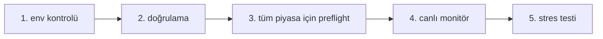

# IrsanAI TPM Agent Forge
[🇬🇧 English](../../README.md) | [🇩🇪 Deutsch](../../README.de.md) | [🇪🇸 Español](../../docs/i18n/README.es.md) | [🇮🇹 Italiano](../../docs/i18n/README.it.md) | [🇧🇦 Bosanski](../../docs/i18n/README.bs.md) | [🇷🇺 Русский](../../docs/i18n/README.ru.md) | [🇨🇳 中文](../../docs/i18n/README.zh-CN.md) | [🇫🇷 Français](../../docs/i18n/README.fr.md) | [🇧🇷 Português (BR)](../../docs/i18n/README.pt-BR.md) | [🇮🇳 हिन्दी](../../docs/i18n/README.hi.md) | [🇹🇷 Türkçe](../../docs/i18n/README.tr.md) | [🇯🇵 日本語](../../docs/i18n/README.ja.md)

[🇬🇧 English](../../README.md) | [🇩🇪 Deutsch](../../README.de.md) | [🇪🇸 Español](./README.es.md) | [🇮🇹 Italiano](./README.it.md) | [🇧🇦 Bosanski](./README.bs.md) | [🇷🇺 Русский](./README.ru.md) | [🇨🇳 中文](./README.zh-CN.md) | [🇫🇷 Français](./README.fr.md) | [🇧🇷 Português (BR)](./README.pt-BR.md) | [🇮🇳 हिन्दी](./README.hi.md) | [🇹🇷 Türkçe](./README.tr.md) | [🇯🇵 日本語](./README.ja.md)

Çapraz platform çalışma zamanı seçenekleri ile otonom çoklu ajan kurulumu için temiz bir başlangıç kiti (BTC, COFFEE ve daha fazlası).

## Dahil Olanlar

- `production/preflight_manager.py` – Alpha Vantage + yedek zinciri ve yerel önbellek yedeği ile dayanıklı piyasa kaynağı sorgulama.
- `production/tpm_agent_process.py` – her piyasa için basit ajan döngüsü.
- `production/tpm_live_monitor.py` – isteğe bağlı CSV ile başlatma ve Termux bildirimli canlı BTC monitörü.
- `core/tpm_scientific_validation.py` – geriye dönük test + istatistiksel doğrulama hattı.
- `scripts/tpm_cli.py` – Termux/Linux/macOS/Windows için birleşik başlatıcı.
- `scripts/stress_test_suite.py` – hata kurtarma/gecikme stres testi.
- `scripts/start_agents.sh`, `scripts/health_monitor_v3.sh` – işlem yardımcıları.
- `core/scout.py`, `core/reserve_manager.py`, `core/init_db_v2.py` – operasyonel temel araçlar.

## Evrensel Hızlı Başlangıç

```bash
python scripts/tpm_cli.py env
python scripts/tpm_cli.py validate
python scripts/tpm_cli.py preflight --market ALL
python scripts/tpm_cli.py live --history-csv btc_real_24h.csv --poll-seconds 3600
```

## Çalışma Zamanı Zinciri Kontrolü (nedensellik/düzen tutarlılığı)

Varsayılan repo akışı, canlı çalışmalarda gizli durum sapması ve "yanlış güven"ü önlemek adına kasıtlı olarak doğrusal tasarlanmıştır.



### Geçiş mantığı (bir sonraki adım öncesi doğrulanması gerekenler)
- **Geçiş 1 – Çevre:** Python/Platform ortamı doğru (`env`).
- **Geçiş 2 – Bilimsel tutarlılık:** temel model davranışı tekrarlanabilir (`validate`).
- **Geçiş 3 – Kaynak güvenilirliği:** piyasa verisi + yedek zinciri erişilebilir (`preflight --market ALL`).
- **Geçiş 4 – Çalışma zamanı yürütme:** canlı döngü bilinen girdilerle çalışıyor (`live`).
- **Geçiş 5 – Karşı taraf güvencesi:** gecikme/hata kurtarma hedefleri strestesinde sağlanıyor (`stress_test_suite.py`).

✅ Kodda zaten düzeltildi: CLI preflight artık `--market ALL` desteği ile hızlı başlangıç ve docker akışına uyumlu.

## Görevinizi Seçin (rol bazlı CTA)

> **Siz X misiniz? Kendi yolunuza tıklayın. <60 saniyede başlayın.**

| Persona | Önem verdiğiniz  | Tıklama yolu | İlk komut |
|---|---|---|---|
| 📈 **Trader** | Hızlı nabız, pratik çalışma zamanı  | [`tpm_live_monitor.py`](./production/tpm_live_monitor.py) | `python scripts/tpm_cli.py live --history-csv btc_real_24h.csv --poll-seconds 3600` |
| 💼 **Investor** | İstikrar, kaynak güveni, dayanıklılık | [`preflight_manager.py`](./production/preflight_manager.py) | `python scripts/tpm_cli.py preflight --market ALL` |
| 🔬 **Scientist** | Kanıtlar, testler, istatistiksel sinyal | [`tpm_scientific_validation.py`](./core/tpm_scientific_validation.py) | `python scripts/tpm_cli.py validate` |
| 🧠 **Theoretician** | Nedensel yapı + gelecek mimarisi | [`core/scout.py`](./core/scout.py) + [`Sonraki Adımlar`](#next-steps) | `python scripts/tpm_cli.py validate` |
| 🛡️ **Skeptik (öncelikli)** | Üretim öncesi varsayımları kır | [`stress_test_suite.py`](./scripts/stress_test_suite.py) + [`preflight_manager.py`](./production/preflight_manager.py) | `python scripts/tpm_cli.py preflight --market ALL && python scripts/stress_test_suite.py` |
| ⚙️ **Operatör / DevOps** | Süreklilik, işlem sağlığı, kurtarılabilirlik | [`start_agents.sh`](./scripts/start_agents.sh) + [`health_monitor_v3.sh`](./scripts/health_monitor_v3.sh) | `bash scripts/start_agents.sh` |

### Skeptik Mücadelesi (yeni ziyaretçiler için önerilir)
Eğer **yalnızca bir şey yapacaksanız**, bunu çalıştırın ve rapor çıktısını inceleyin:

```bash
python scripts/tpm_cli.py preflight --market ALL
python scripts/stress_test_suite.py
```

Bu yol size güven verirse, depo geri kalanı da büyük ihtimalle uyum sağlayacaktır.

## Platform Notları

- **Android / Termux (Samsung vb.)**
  ```bash
  bash scripts/termux_bootstrap.sh
  cd ~/TPM-Agent
  python scripts/tpm_cli.py env
  python scripts/tpm_cli.py preflight --market ALL
  python scripts/tpm_cli.py live --history-csv btc_real_24h.csv --notify --vibrate-ms 1000
  ```
  Doğrudan Android (Termux) web UI demosu için yerel Forge çalışma zamanını başlatın:
  ```bash
  cd ~/TPM-Agent
  bash scripts/termux_forge.sh start
  # durdurmak için: bash scripts/termux_forge.sh stop
  # durum için: bash scripts/termux_forge.sh status
  ```
  Script tarayıcıyı (varsa) otomatik açar ve servisi arka planda çalışır tutar.
  Android’de `pydantic-core`/Rust veya `scipy`/Fortran derleme hatası alırsanız, şunu kullanın:
  `python -m pip install -r requirements-termux.txt` (Termux’a uygun, Rust toolchain gerektirmez).
  Web arayüzünde çalışma zamanını başlatma/durdurma kontrolü yapılabilir; ilerleme çubuğu geçiş durumunu gösterir.
- **iPhone (mümkün olduğunca)**: iSH / a-Shell gibi shell uygulamaları kullanın. Termux’a özel bildirim numaralandırmaları mevcut değildir.
- **Windows / Linux / macOS**: Aynı CLI komutlarını kullanın; süreklilik için tmux/zamanlayıcı/cron ile çalıştırın.

## Docker (Çapraz-İşletim Sistemi Kolay Yolu)

Docker’ı tam olarak şu sırayla kullanın (tahmin gerektirmez):

### Adım 1: Web çalışma zamanı imajını oluşturma

```bash
docker compose build --no-cache tpm-forge-web
```

### Adım 2: Web gösterge paneli servisini başlatma

```bash
docker compose up tpm-forge-web
```

Tarayıcınızda `http://localhost:8787` adresini açın (**`http://0.0.0.0:8787` değil**). Uvicorn dahili olarak `0.0.0.0` adresine bağlanır, ancak istemciler `localhost` veya yerel ağ IP’sini kullanmalıdır.

### Adım 3 (isteğe bağlı kontroller): web dışı servisleri anlama

```bash
docker compose run --rm tpm-preflight
docker compose run --rm tpm-live
```

- `tpm-preflight` = kaynak/bağlantı kontrolleri (yalnızca CLI çıktısı).
- `tpm-live` = terminal canlı-monitör kayıtları (yalnızca CLI, **web UI yok**).
- `tpm-forge-web` = FastAPI + gösterge paneli arayüzü (düzen/ilerleme/çalışma zamanı kontrolü).

Eğer `tpm-preflight` `ALPHAVANTAGE_KEY not set` rapor ederse, COFFEE fallbacks ile çalışmaya devam eder.

Sayfa boş görünüyorsa:
- API’yi doğrudan test edin: `http://localhost:8787/api/frame`
- FastAPI belgelerini test edin: `http://localhost:8787/docs`
- Tarayıcıyı zorla yenileyin (`Ctrl+F5`)
- Gerekirse sadece web servisini yeniden başlatın: `docker compose restart tpm-forge-web`

COFFEE kalitesi için isteğe bağlı:

```bash
export ALPHAVANTAGE_KEY="<anahtarınız>"
docker compose run --rm tpm-preflight
```

## Glitch Tahminleri & Mobil Uyarılar

- Forge canlı panel şimdi her piyasa için kısa vadeli görünümü (`yukarı/aşağı/yatay`) ve güven düzeyini `/api/markets/live` içinde sunar.
- Bir piyasa hatası (ivme artışı) algılandığında çalışma zamanı şu bildirimleri tetikleyebilir:
  - Termux toast + titreşim
  - isteğe bağlı bildirim/ses efekti
  - isteğe bağlı Telegram push (bot tokenı/sohbet kimliği config/config.yaml içerisine ayarlıysa).
- Gösterge panelinde **Uyarıları Kaydet** / **Uyarıyı Test Et** fonksiyonları veya API ile yapılandırma:
  - `GET /api/alerts/preferences`
  - `POST /api/alerts/preferences`
  - `POST /api/alerts/test`

## Doğrulama

Bilimsel doğrulama hattını çalıştırın:

```bash
python core/tpm_scientific_validation.py
```

Üretilenler:
- `state/TPM_Scientific_Report.md`
- `state/TPM_test_results.json`

## Kaynaklar & Hata Kurtarma

`production/preflight_manager.py` destekler:
- COFFEE için önce Alpha Vantage (eğer `ALPHAVANTAGE_KEY` ayarlanmışsa)
- TradingView + Yahoo yedek zinciri
- `state/latest_prices.json` içinde yerel önbellek yedeği

Preflight’ı doğrudan çalıştırın:

```bash
export ALPHAVANTAGE_KEY="<anahtarınız>"
python production/preflight_manager.py --market ALL
```

Kesinti stres testini çalıştırın (hedef `p95 < 1000ms`):

```bash
python scripts/stress_test_suite.py
```

Çıktı: `state/stress_test_report.json`

## Canlı durum: TPM ajanının bugün yapabilecekleri

**Mevcut durum:**
- Üretim Forge web çalışma zamanı mevcut (`production.forge_runtime:app`).
- Finans odaklı başlangıç konfigürasyonu **BTC + COFFEE** kullanıyor.
- Canlı frame, ajan uygunluğu, transfer entropisi ve alan özeti web panelde görünür.
- Kullanıcılar çalışma zamanında yeni piyasa ajanları ekleyebilirler (`POST /api/agents`).

**Hedef yetenekler (olması gereken):**
- Açık kabul eşiklerine sahip gerçek veri performans karşılaştırmaları (precision/recall/FPR/sapma).
- Otomatik güvenli mod için katı refleksif yönetişim kuralları.
- Versiyonlanmış alan bazlı öğrenme kalıpları için kolektif hafıza iş akışı.

**Sonraki genişleme aşaması:**
- Tüm ajanlar arasında rejim bazlı politika yöneticisi (trend/şok/yatay).
- Açık veri sözleşmelerine sahip bir finans dışı alan pilotu (örneğin tıbbi veya sismik).

## PR Birleştirme Çakışma Yardımcısı

- Birleştirme kontrol listesi (GitHub Çakışmaları): `docs/MERGE_CONFLICT_CHECKLIST.de.md`

### Bugünkü kapsam: Windows + akıllı telefon için finans TPM

- **Windows:** Forge çalışma zamanı + web arayüzü + Docker/PowerShell/tek tıkla başlatma çalışır durumda.
- **Akıllı telefon:** Android/Termux canlı izleme çalışır durumda; web UI mobilde de uyumlu.
- **Gerçek zamanlı çok ajan:** BTC + COFFEE varsayılan aktif; ek piyasalar dinamik olarak web UI’den eklenebilir.
- **Kaynak sınır kuralı:** istenen piyasa yerleşik kaynaklarda yoksa açık kaynak URL + yetkilendirme verisi sağlanır.

## Windows canlı test (iki yol sistemi)

### Yol A — Geliştirici/güç kullanıcılar (PowerShell, CMD, PyCharm, IDE)

```powershell
python -m venv .venv
.\.venv\Scripts\Activate.ps1
pip install -r requirements.txt
python scripts/tpm_cli.py forge-dashboard --open-browser --port 8787
```

### Yol B — Düz kullanıcılar (tıklayıp başlat)

1. `scripts/windows_click_start.bat` dosyasına çift tıklayın
2. Script en uygun yolu otomatik seçer:
   - Python varsa -> venv + pip + çalışma zamanı
   - yoksa Docker Compose (varsa)

Teknik temel: `scripts/windows_bootstrap.ps1`.

## Forge Üretim Web Çalışma Zamanı (BTC + COFFEE, genişletilebilir)

Evet, bu zaten repoda **başladı** ve şu anda genişletiliyor:

- Varsayılan olarak bir finans TPM ajanı **BTC** ve bir ajan **COFFEE** için başlar.
- Kullanıcılar web UI’den doğrudan daha fazla piyasa/ajan ekleyebilir (`/api/agents`).
- Kalıcı bir çalışma zamanı servisi olarak çalışır ve canlı frame çıktısı (`/api/frame`) ile derin iç görü sağlar.

### Başlat (yerel)

```bash
uvicorn production.forge_runtime:app --host 0.0.0.0 --port 8787
# http://localhost:8787 adresini açın
```

### Başlat (Docker)

```bash
docker compose up tpm-forge-web
# http://localhost:8787 adresini açın
```

## TPM Playground (etkileşimli MVP)

Artık tarayıcıda TPM davranışını etkileşimli keşfedebilirsiniz:

```bash
python -m http.server 8765
# http://localhost:8765/playground/index.html adresini açın
```

İçerir:
- Tek ajan zayıf sinyal anomali görünümü
- Mini sürü (BTC/COFFEE/VOL) konsensüs baskısı
- Alanlar arası transfer rezonansı (sentetik finans/hava durumu/sağlık)

Bkz: `playground/README.md`.

## Sonraki Adımlar

- Piyasalararası nedensel analiz için transfer entropisi modülü.
- Tarihsel performansa dayalı politika güncellemeleri ile optimizatör.
- Uyarı kanalları (Telegram/Signal) + boot kalıcılığı.

---

## IrsanAI Derin Dalışı: TPM çekirdeği karmaşık sistemlerde "nasıl düşünür"

### 1) Vizyoner dönüşüm: ticaret ajanından evrensel TPM ekosistemine

### IrsanAI-TPM algoritmasının benzersizliği nedir? (düzeltilmiş çerçeve)

TPM çekirdeğinin çalışma varsayımı:

- Karmaşık, kaotik sistemlerde erken uyarı sinyali genellikle **mikro artık** içinde gizlidir: küçük sapmalar, zayıf korelasyonlar, neredeyse boş veri noktaları.
- Klasik sistemlerin sadece `0` veya "yetersiz alaka" gördüğü yerde TPM bağlam akışında **yapılandırılmış anomaliler** (glitch desenleri) arar.
- TPM sadece değerleri değil, **zamana göre ilişki değişimlerini, kaynak kalitesini, rejimi ve nedensel komşuluğu** değerlendirir.

Önemli doğruluk notu: TPM geleceği sihirli biçimde tahmin etmez. Veri kalitesi ve doğrulama kapıları sağlandığında **rejim değişiklikleri, kopuşlar ve bozulmaların daha erken olasılıksal algılanmasını** hedefler.

### Büyük düşünün: neden finansın ötesine geçer

TPM finansal araçlarda (endeks/simge/ISIN benzeri tanımlayıcılar, likidite, mikro yapı) zayıf öncül desenleri algılayabiliyorsa, aynı ilke birçok alana genellenebilir:

- **Olay/sensör akışı + bağlam modeli + anomali katmanı + geri besleme döngüsü**
- Her meslek alanına özgü özellikler, düğümler, korelasyonlar ve anomalilerle bir "pazar" modeli uygulanabilir
- Uzman TPM ajanları yerel mesleki mantığı ve etiği koruyarak alanlar arası öğrenebilir

### TPM’nin hedeflediği 100 meslek alanı

| # | Meslek | TPM veri benzeri | Anomali/desen tespiti hedefi |
|---|---|---|---|
| 1 | Polis analisti | Olay kayıtları, coğrafi-zamansal suç haritaları, ağlar | Artan suç küme erken sinyalleri |
| 2 | İtfaiye komutanı | Alarm zincirleri, sensör verileri, hava durumu, bina profilleri | Yangın ve tehlike yayılım pencereleri tahmini |
| 3 | Paramedik/EMS | Görev sebepleri, tepki süreleri, hastane yükü | Kapasite stresini çökmeden önce tespit |
| 4 | Acil hekimi | Triaj akışları, hayati belirtiler, bekleme dinamikleri | Kritik kötüleşmeyi daha erken işaretle |
| 5 | Yoğun bakım hemşiresi | Ventilasyon/laboratuvar trendleri, ilaç yanıtları | Sepsis/şok mikro sinyallerini yakala |
| 6 | Epidemiyolog | Vaka oranları, hareketlilik, atık su/veri laboratuvarı | Salgın erken uyarı, üstel büyüme öncesi |
| 7 | Aile hekimi | EHR desenleri, reçeteler, takip boşlukları | Kronik-risk geçişlerini erken tespit et |
| 8 | Klinik psikolog | Seans rotaları, dil işaretleri, uyku/aktivite | Nüks/kriz göstergelerini daha erken algıla |
| 9 | İlaç araştırmacısı | Bileşik taramaları, advers olay profilleri, genomik | Gizli etkinlik ve yan etki kümeleri ortaya çıkar |
| 10 | Biyoteknolog | Dizilim/süreç/hücre kültürü rotaları | Sapma ve kontaminasyon riskini algıla |
| 11 | İklim bilimci | Atmosfer/okyanus zaman serileri, uydu verileri | Kritik eşik öncülerini tespit et |
| 12 | Meteorolog | Basınç/nem/rüzgar/radar verileri | Yerel kaotik hava değişimlerini önceden gör |
| 13 | Sismolog | Mikrodeprem, gerilim alanları, sensör dizileri | Büyük serbest bırakmanın öncülerini yakala |
| 14 | Volkanolog | Gaz, titreşim, deformasyon zaman serileri | Patlama olasılık pencerelerini daralt |
| 15 | Hidrolog | Nehir ölçüleri, yağış, toprak nemi | Ani sel ve kuraklık evre değişimlerini tespit et |
| 16 | Oşinograf | Akıntılar, sıcaklık, tuzluluk, şamandıralar | Tsunami ve ekosistem anomalilerini bul |
| 17 | Enerji tüccarı | Yük, spot fiyatlar, hava durumu, şebeke durumu | Fiyat/yük kopuşlarını erken sinyalle |
| 18 | Şebeke operatörü | Şebeke frekansı, hat durumu, anahtarlama olayları | Zincirleme arıza riskini algıla |
| 19 | Rüzgar santrali operatörü | Türbin telemetri, rüzgar verileri, bakım kayıtları | Arızaları ve performans sapmalarını tahmin et |
| 20 | Güneş santrali operatörü | Işınım, inverter telemetri, termal yük | Azalma ve üretim anomalilerini tespit et |
| 21 | Su hizmetleri yöneticisi | Akış, kalite sensörleri, tüketim desenleri | Kirlenme/kıtlık erken uyarısı |
| 22 | Trafik operasyonları müdürü | Yoğunluk, çarpışmalar, yol çalışmaları, olaylar | Trafik sıkışıklığı ve kaza artışını öngör |
| 23 | Demiryolu kontrol müdürü | Sefer uyumu, hat durumu, gecikme zincirleri | Sistemik gecikme zincirlerini erken kır |
| 24 | Hava trafik kontrolörü | Uçuş yolları, hava durumu, slot doluluğu | Çatışma rotaları ve darboğazları tespit et |
| 25 | Liman lojistik yöneticisi | İskele süreleri, konteyner akışı, gümrük durumu | Tedarik kesintisi öncülerini yakala |
| 26 | Tedarik zinciri yöneticisi | Tahmini varış zamanı, stok, talep nabzı, risk olayları | Bullwhip ve stok tükenmesi anomali minimi |
| 27 | Üretim yöneticisi | OEE, proses telemetri, atık, kurulum süreleri | Kalite sapmaları ve makine anomalileri tespiti |
| 28 | Kalite mühendisi | Tolerans dağılımları, proses sinyalleri | Neredeyse sıfır hata öncülerini yakala |
| 29 | Robotik mühendisi | Hareket rotaları, aktüatör yükü, kontrol döngüleri | Kontrol kararsızlığı/arıza tahmini |
| 30 | Havacılık bakım mühendisi | Motor/uçuş telemetri, bakım geçmişi | Parça seviyesi tahmine dayalı bakım |
| 31 | İnşaat yöneticisi | İlerleme, hava durumu, tedarik tarihleri, IoT sensörleri | Takvim/maliyet anomali riskini ölç |
| 32 | Yapısal mühendis | Yük, titreşim, yorgunluk/yaşlanma göstergeleri | Yapısal kritik geçişleri tespit et |
| 33 | Şehir plancısı | Hareketlilik, demografi, emisyonlar, arazi kullanımı | Ortaya çıkan kentsel stres desenleri |
| 34 | Mimar | Bina işletmeleri, doluluk, enerji eğrileri | Tasarım-kullanım uyumsuzluğu desenleri |
| 35 | Çiftçi | Toprak/hava durumu/ürün/pazar akışları | Hastalık/verim anomali erken tespiti |
| 36 | Agronom | Uydu besin/nem verileri | Hassas müdahaleleri erken hedefle |
| 37 | Orman yöneticisi | Nem, haşere desenleri, yangın göstergeleri | Orman hasarı/yangın pencerelerini erken tespit |
| 38 | Balıkçılık yöneticisi | Av kayıtları, su kalitesi, göçler | Aşırı avlanma/çöküş risklerini yakala |
| 39 | Gıda güvenliği denetçisi | Laboratuvar bulguları, soğuk zincir kayıtları, tedarik bağlantıları | Kirlenme zincirlerini erken kır |
| 40 | Baş aşçı | Talep nabzı, stok sağlığı, israf oranları | Bozulma ve eksiklik anomali azaltımı |
| 41 | Perakende işletmecisi | POS verileri, müşteri sayısı, stok dönüşümleri | Talep sıçramaları ve kayıp desenleri tespiti |
| 42 | E-ticaret yöneticisi | Tıklama akışı, sepet yolculukları, iadeler | Dolandırıcılık/terk öncü desenleri |
| 43 | Pazarlama analisti | Kampanya metrikleri, segment tepki eğrileri | Ana akımdan önce mikro trendler |
| 44 | Satış yöneticisi | Pipeline hızı, temas noktası grafiği | Anlaşma riski ve zamanlama fırsatları |
| 45 | Müşteri destek lideri | Bilet akışı, konu kümeleri, SLA kayması | Yükseliş/kök neden dalgaları tespiti |
| 46 | Ürün yöneticisi | Özellik benimseme, tutundurma, geri bildirim | Ürün-pazar uyumsuzluğunu erken yakala |
| 47 | UX araştırmacısı | Isı haritaları, yol haritaları, terk noktaları | Gizli etkileşim sürtünmesini ortaya çıkar |
| 48 | Yazılım mühendisi | Kayıtlar, izler, dağıtım metrikleri | Arıza zincirlerini olay öncesi tespit et |
| 49 | Site güvenilirlik mühendisi | Gecikme, hata bütçeleri, doygunluk | Degradasyonu kesinti öncesi yakala |
| 50 | Siber güvenlik analisti | Ağ akışları, IAM olayları, SIEM uyarıları | Saldırı yolu ve yatay hareketi tespit et |
| 51 | Dolandırıcılık analisti | İşlem grafikleri, cihaz parmak izleri | Zayıf sinyal alanında dolandırıcılığı bul |
| 52 | Banka risk yöneticisi | Portföy/makro/likidite riskleri | Stres rejimleri ve konsantrasyon risklerini algıla |
| 53 | Sigorta aktueri | Talep akışı, risk haritaları, iklim ilişkileri | Talep dalgaları ve rezerv stresi öngörüsü |
| 54 | Vergi danışmanı | Defter desenleri, dosyalama zamanları | Uyumluluk riski ve optimizasyon yolları |
| 55 | Denetçi | Kontrol kayıtları, istisna desenleri | Muhasebe anomali ölçek tespiti |
| 56 | Avukat | Dava kronolojisi, emsal grafikleri, son tarihler | Dava riski ve sonuç desenleri |
| 57 | Hakim/adli idareci | Dava yükü karışımı, döngü süreleri | Adalet sistemi darboğazları |
| 58 | Cezaevi yöneticisi | Doluluk, olay ağları, davranış trendleri | Şiddet/tekrar suç kümeleri algısı |
| 59 | Gümrük memuru | Ticaret manifestoları, beyanlar, rota desenleri | Kaçakçılık/kaçınma sinyalleri |
| 60 | Savunma istihbarat analisti | ISR beslemeleri, lojistik, operasyon hızı | Tırmanma dinamiklerini erken yakala |
| 61 | Diplomatik analist | Olay zincirleri, iletişim sinyalleri | Jeopolitik rejim değişimleri |
| 62 | Öğretmen | Öğrenme ilerlemesi, devam, katılım | Okul terk riski ve destek ihtiyacı |
| 63 | Okul müdürü | Performans kümeleri, devam, kaynaklar | Sistemik okul stres desenleri |
| 64 | Üniversite öğretim görevlisi | Ders aktiviteleri, çekilmeler, geri bildirim | Öğrenci başarısını öncele |
| 65 | Eğitim araştırmacısı | Grup rotaları, pedagojik değişkenler | Sağlam müdahale etkileri |
| 66 | Sosyal hizmet uzmanı | Vaka ağları, randevular, risk işaretleri | Kriz artış yolları |
| 67 | STK koordinatörü | Saha raporları, yardım akışı, ihtiyaç sinyalleri | Etki boşlukları ve sıcak nokta değişimleri |
| 68 | İşe yerleştirme danışmanı | Beceri profilleri, iş gücü talebi, geçişler | Uyum ve yeniden becerilendirme ihtiyacı |
| 69 | İK yöneticisi | İşe alım/ayrılma/performans rotaları | Tükenmişlik ve kalıcı risk erken tespiti |
| 70 | İşe alım uzmanı | Funnel oranları, yetkinlik taksonomisi, piyasa nabzı | Uyum riski ve işe alım fırsat pencereleri |
| 71 | Organizasyon danışmanı | Karar temposu, KPI kayması, ağ desenleri | Takım işleyiş bozukluğu erken tespiti |
| 72 | Proje yöneticisi | Kilometre taşları, bağımlılıklar, engel grafiği | Takvim/alan aksaklıklarını önceden gör |
| 73 | Gazeteci | Kaynak güvenilirlik grafiği, olay akışları | Yanlış bilgi kümeleri erken tespiti |
| 74 | Araştırmacı muhabir | Belge ağları, para/iletişim izleri | Gizli sistemik anomalileri açığa çıkar |
| 75 | İçerik moderatörü | Gönderi/yorum akışları, anlamsal değişimler | Kötüye kullanım/radikalleşme dalgaları |
| 76 | Sanatçı | İzleyici tepki rotaları, stil vektörleri | Ortaya çıkan estetikleri algıla |
| 77 | Müzik yapımcısı | Dinleme özellikleri, düzenleme vektörleri | Çıkış/niche potansiyeli erken tespit |
| 78 | Oyun tasarımcısı | Telemetri, ilerleme, terk eğrileri | Hata ve denge anomalilerini bul |
| 79 | Spor koçu | Performans/bedensel yük akışları | Yaralanma/form düşüşü öncüsü |
| 80 | Atletik antrenör | Hareket/iyileşme işaretçileri | Fazla yüklenmeyi duruş öncesi tespit et |
| 81 | Spor hekimi | Teşhis, rehabilitasyon yükü, nüks riski | Oyun dönüşü pencerelerini optimize et |
| 82 | Hakem analisti | Karar akışı, tempo, olay bağlamı | Tutarlılık/adalet kayması |
| 83 | Etkinlik yöneticisi | Biletleme, hareketlilik, hava durumu, güvenlik | Kalabalık ve güvenlik risk artışı |
| 84 | Turizm yöneticisi | Rezervasyon desenleri, itibar sinyalleri | Talep ve duygu değişimlerini yakala |
| 85 | Otel müdürü | Doluluk, hizmet kalitesi, şikayetler | Kalite-talep istikrarsızlığı erken tespiti |
| 86 | Emlak yöneticisi | Kira akışı, bakım, piyasa karşılaştırmaları | Boşluk/temerrüt riski erken yakala |
| 87 | Tesis yöneticisi | Bina IoT, enerji, bakım periyotları | Arıza ve verimsizlik desenleri |
| 88 | Atık yönetimi operatörü | Atık akışları, güzergah, çevresel ölçümler | Kanunsuz döküm ve süreç boşlukları |
| 89 | Çevre denetçisi | Emisyonlar, raporlar, uydu kaplamaları | Uyumluluk ihlalleri ve kritik eşik riskleri |
| 90 | Döngüsel ekonomi analisti | Malzeme pasaportları, geri kazanım oranları | Sızıntı ve döngü kapatma fırsatları |
| 91 | Astrofizikçi | Teleskop akışları, spektrum, gürültü modelleri | Nadir kozmik olaylar tespiti |
| 92 | Uzay operasyon mühendisi | Telemetri, yörünge parametreleri, sistem teşhisleri | Görev kritik anomalilerini erken tespit |
| 93 | Kuantum mühendisi | Gürültü profilleri, kalibrasyon sapmaları, kapı hataları | Dekohorans ve kontrol sapması |
| 94 | Veri bilimci | Özellik sapması, model kalitesi, veri bütünlüğü | Model çöküşü ve önyargı kayması |
| 95 | AI etikçisi | Karar sonuçları, adalet metrikleri | Adaletsiz desenler/yönetim boşlukları |
| 96 | Bilim felsefesi araştırmacısı | Teori-kanıt yolları | Paradigma uyumsuzluğu sinyalleri |
| 97 | Matematikçi | Artık yapılar, değişmezler, hata terimleri | Gizli düzenlilikler/outlier sınıfları |
| 98 | Sistem teorisyeni | Düğüm-köşe dinamikleri, gecikmeli geri bildirim | Ağ kritik eşik dinamikleri |
| 99 | Antropolog | Alan gözlemleri, dil/sosyal ağlar | Kültürel değişim çatışma öncüleri |
| 100 | Gelecek stratejisti | Teknoloji eğrileri, düzenleme, davranış verisi | Senaryoları erken göstergelerle bağla |

### Ülkeye özgü notlar (meslek eşdeğeri)

Listede mantıksal tutarlılık için TPM rol haritalaması **işlevsel eşdeğerler** olarak yorumlanmalıdır, kelime kelime değil:

- **Almanya ↔ ABD/İngiltere:** `Polizei` vs ayrıştırılmış roller (`Police Department`, `Sheriff`, `State Trooper`) ve kovuşturma farkları (`Staatsanwaltschaft` vs `District Attorney/Crown Prosecution`).
- **İspanya / İtalya:** farklı mahkeme ve polis iş akışları içeren medeni hukuk yapıları; veri hatları çoğunlukla bölgesel ve ulusal arasında bölünür.
- **Bosna Hersek:** çoklu varlık yönetimi nedeniyle parçalanmış veri sahipliği; TPM federatif anomali birleşimi avantajı sağlar.
- **Rusya / Çin:** rol tanımları ve veri yönetimi kısıtlamaları farklıdır; TPM yerel uyumluluk ve kurumsal eşdeğerler ile yapılandırılmalıdır.
- **Diğer yüksek etkili bölgeler:** Fransa, Brezilya, Hindistan, Japonya, MENA ülkeleri ve Sahra Altı Afrika da eşdeğer işlevler ve kullanılabilir telemetri haritalaması ile entegre edilebilir.

### Felsefi-bilimsel bakış açısı

- Alet olmaktan **epistemik altyapıya**: alanlar “zayıf erken bilgi”yi işletir.
- İzole sistemlerden **ajan federasyonlarına**: yerel etik + paylaşılan anomali grameri.
- Tepkisel yanıt yerine **öngörülü yönetişim**: geç kriz kontrolü yerine önleme.
- Statik modellerden **canlı teorilere**: gerçek dünyadaki şoklar altında sürekli kalibrasyon.

Temel fikir: sorumlu yönetilmiş TPM kümesi kaosu kontrol edemez, ama kurumların onu daha erken anlamasına, daha sağlam yönlendirmesine ve daha insanca karar vermesine yardımcı olur.

## Çokdilli genişleme (devam etmekte)

Çapraz dil uyumu için yerelleştirilmiş stratejik özetler mevcuttur:

- İspanyolca (`docs/i18n/README.es.md`)
- İtalyanca (`docs/i18n/README.it.md`)
- Boşnakça (`docs/i18n/README.bs.md`)
- Rusça (`docs/i18n/README.ru.md`)
- Basitleştirilmiş Çince (`docs/i18n/README.zh-CN.md`)
- Fransızca (`docs/i18n/README.fr.md`)
- Brezilya Portekizcesi (`docs/i18n/README.pt-BR.md`)
- Hintçe (`docs/i18n/README.hi.md`)
- Türkçe (`docs/i18n/README.tr.md`)
- Japonca (`docs/i18n/README.ja.md`)

Her yerelleştirilmiş dosya bölge uyumu notları içerir ve tam 100 meslek matrisi için bu İngilizce bölüme geri referans verir.

## IrsanAI Kalite Meta (SOLL vs IST)

Repo’nun mevcut olgunluk seviyesi, kalite ara durumu ve kullanıcı beklentilerine dayalı nedensel yol haritası için bakınız:

- `docs/IRSANAI_QUALITY_META.md`

Bu belge artık şunlar için referanstır:
- Özellik derinliği (UX/UI + operasyonel dayanıklılık)
- Docker/Android eşitlik gereksinimleri
- ve gelecek PR’lar için kabul kalite kapıları.

## i18n eşitlik modu (tam yansıma)

Hiçbir dil topluluğunun içerik dezavantajı yaşamaması için i18n dosyaları artık `README.md` ile tam kanonik eşitlikte yönetilmektedir.

Senkronizasyon komutu:

```bash
python scripts/i18n_full_mirror_sync.py
```

## Geliştiricilere Not (LOP – Açık Nokta Listesi)

Bana göre hâlâ açık olanlar (konusal, teknik engel yok):

| Madde | Mevcut Durum | Makul devam şekli |
|---|---|---|
| **Piyasalararası Nedensellik için Transfer Entropisi Modülü** | **Tamamlandı ✅** – `TransferEntropyEngine` olarak uygulandı ve Forge Orkestratörüne bağlandı. | Uzman kalibrasyon: alan özgü eşikler ve yorum kuralları ekleyin. |
| **Performansa Dayalı Optimizatör/Politika Güncellemesi** | **Tamamlandı ✅** – Fitness skoru, ödül güncelleme ve aday elemeleri tick döngüsünde çalışıyor. | Çalışma modları dokümante edilsin (temkinli/agresif), yönetim profilleri olarak test edilsin. |
| **Uyarı Sistemi (Telegram/Signal)** | **Kısmen tamamlandı 🟡** – Altyapı hazır, varsayılan kapalı. | Uyarı politikası: hangi olay, hangi şiddet, hangi kanal, kim yanıtlar belirlenmeli. |
| **Boot Kalıcılığı / Sürekli Çalışma** | **Kısmen tamamlandı 🟡** – Tmux tabanlı başlatma ve sağlık izleme var, ama tüm hedef platformlar için standart boot-runbook yok. | Platform profilleri (Termux/Linux/Docker) ile boot başlatma, yeniden başlatma ve yükseltme yol haritası yazılı hâle getirilmeli. |
| **Koordineli Meta Katmanı (Nächste Ausbaustufe “promotet” bölümünden)** | **Kısmen tamamlandı 🟡** – Parçalar mevcut (Orkestratör + Entropi + Ödül) ama tam bir rejim-politika yöneticisi olarak tanımlanmadı. | Ajan ağırlıkları için açık bir konu uzmanı kontrol modeli (trend/şok/hareketlilik) ekleyin. |
| **Kolektif Bellek (versiyonlu öğrenme kalıbı arşivi)** | **Açık 🔴** – Vizyon/gelişim bölümlerinde var ama açık tanımlı saklama ve inceleme süreci yok. | Öğrenme kalıbı formatı, versiyon kayıtları ve kalite kriterleri belirleyin (hangi şartlarda kalıp “geçerli” sayılır). |
| **Refleksif Yönetim (şüphede otomatik emniyet modu)** | **Açık 🔴** – Hedef olarak koyuldu, ama karar kuralı olarak henüz tanımlanmadı. | Belirsizlik göstergeleri ve kesin geçiş koşulları yönetim kurallarına aktarılmalı. |
| **Finans/Hava dışı Alan Genişlemesi** | **Açık 🔴** – Başka alanlar vizyon/şablon olarak var, ama henüz veri sözleşmelerinde ürüne dönüşmedi. | Bir sonraki alan pilotunu başlatın (örn. Tıp veya Sismik) net ölçütlerle ve veri kaynaklarıyla. |
| **Gerçek Veriler Üzerinde Bilimsel Kanıt Genişletme** | **Açık 🔴** – Mevcut doğrulama sağlam ama sentetik rejim segmentlerine dayalı. | Kesin kabul kriterleri ile gerçek veri karşılaştırmaları ekleyin (Precision/Recall/FPR/Drift). |
| **Dilarası Uyum / i18n Geliştirme** | **Kısmen tamamlandı 🟡** – Birkaç dil için açılış sayfası var; genişleme “devam ediyor” olarak işaretlendi. | Senkronizasyon süreci tanımlansın (root README değişiklikleri ne zaman tüm i18n dosyalarında güncellenir). |

Kısa özet: Önceki “Sonraki Adımlar” çoğunlukla **teknik olarak başlatıldı veya hayata geçirildi**; en büyük etki alanı şimdi **konusal işletme (yönetim, politikalar, alan mantığı, gerçek veri kanıtları)** ve **tutarlı dokümantasyon/i18n işletimi** olacaktır.

### LOP uygulama planı

Uygulama sıralaması, tamamlanma kriterleri ve her LOP noktası için kanıt kapıları için bakınız:

- `docs/LOP_EXECUTION_PLAN.md`

## LOP (Son Not – öncelikli)

1. **P1 Gerçek veri kanıtını genişlet:** Kesin kabul kriterlerine dayalı kıyaslama (Precision/Recall/FPR/Drift).
2. **P2 Refleksif yönetimi finalize et:** Belirsizlikte otomatik güvenli mod için katı kurallar tanımla.
3. **P3 Kolektif belleği standartlaştır:** Versiyonlu öğrenme kalıpları ve alan bazlı inceleme süreci.
4. **P4 Web Immersiyonu genişlet:** Yeni duyarlı düzenle daha çok TPM sektörlerine rol görünümleri ekle.

**Platform notu:** Şu anda öncelikli olarak **Windows + Akıllı Telefon** odaklı. **LOP sonunda eklenecek:** macOS, Linux ve diğer platform profilleri.