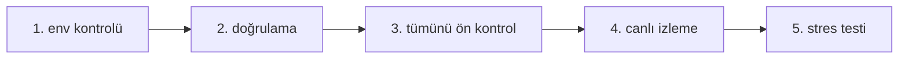

# IrsanAI TPM Ajan Forge

[🇬🇧 English](./README.md) | [🇩🇪 Deutsch](./README.de.md) | [🇪🇸 Español](./docs/i18n/README.es.md) | [🇮🇹 Italiano](./docs/i18n/README.it.md) | [🇧🇦 Bosanski](./docs/i18n/README.bs.md) | [🇷🇺 Русский](./docs/i18n/README.ru.md) | [🇨🇳 中文](./docs/i18n/README.zh-CN.md) | [🇫🇷 Français](./docs/i18n/README.fr.md) | [🇧🇷 Português (BR)](./docs/i18n/README.pt-BR.md) | [🇮🇳 हिन्दी](./docs/i18n/README.hi.md) | [🇹🇷 Türkçe](./docs/i18n/README.tr.md) | [🇯🇵 日本語](./docs/i18n/README.ja.md)

Çapraz platform çalışma zamanı seçenekleriyle otonom çoklu ajan kurulumu (BTC, COFFEE ve daha fazlası) için temiz bir başlangıç.

## Neler Dahil

- `production/preflight_manager.py` – Alpha Vantage + yedek zincir ve yerel önbellek yedeklemesi ile dayanıklı piyasa kaynağı araştırması.
- `production/tpm_agent_process.py` – piyasa başına basit ajan döngüsü.
- `production/tpm_live_monitor.py` – isteğe bağlı CSV sıcak başlatma ve Termux bildirimleri ile canlı BTC monitörü.
- `core/tpm_scientific_validation.py` – geriye dönük test + istatistiksel doğrulama hattı.
- `scripts/tpm_cli.py` – Termux/Linux/macOS/Windows için birleşik başlatıcı.
- `scripts/stress_test_suite.py` – yük devretme/gecikme stres testi.
- `scripts/start_agents.sh`, `scripts/health_monitor_v3.sh` – süreç işlemleri yardımcıları.
- `core/scout.py`, `core/reserve_manager.py`, `core/init_db_v2.py` – operasyonel çekirdek araçları.

## Evrensel Hızlı Başlangıç

```bash
python scripts/tpm_cli.py env
python scripts/tpm_cli.py validate
python scripts/tpm_cli.py preflight --market ALL
python scripts/tpm_cli.py live --history-csv btc_real_24h.csv --poll-seconds 3600
```

## Çalışma Zamanı Zincir Kontrolü (nedensel/sıra sağduyusu)

Varsayılan depo akışı, canlı çalıştırmalar sırasında gizli durum kaymasını ve "yanlış güveni" önlemek için kasıtlı olarak doğrusaldır.



### Geçit mantığı (bir sonraki adımdan önce doğru olması gerekenler)
- **Geçit 1 – Ortam:** Python/platform bağlamı doğru (`env`).
- **Geçit 2 – Bilimsel sağduyu:** temel model davranışı tekrarlanabilir (`validate`).
- **Geçit 3 – Kaynak güvenilirliği:** piyasa verileri + yedek zincir erişilebilir (`preflight --market ALL`).
- **Geçit 4 – Çalışma zamanı yürütme:** canlı döngü bilinen girdi geçmişiyle çalışır (`live`).
- **Geçit 5 – Adverser güven:** gecikme/yük devretme hedefleri stres altında tutulur (`stress_test_suite.py`).

✅ Koda zaten düzeltildi: CLI ön kontrolü artık `--market ALL`'u destekliyor, hızlı başlangıç + docker akışıyla eşleşiyor.

## Görevinizi Seçin (rol tabanlı CTA)

> **X misiniz? Şeridinize tıklayın. <60 saniyede başlayın.**

| Kişi | Neyi önemsiyorsunuz | Tıklama yolu | İlk komut |
|---|---|---|---|
| 📈 **Tüccar** | Hızlı nabız, uygulanabilir çalışma zamanı | [`tpm_live_monitor.py`](./production/tpm_live_monitor.py) | `python scripts/tpm_cli.py live --history-csv btc_real_24h.csv --poll-seconds 3600` |
| 💼 **Yatırımcı** | Kararlılık, kaynak güveni, dayanıklılık | [`preflight_manager.py`](./production/preflight_manager.py) | `python scripts/tpm_cli.py preflight --market ALL` |
| 🔬 **Bilim İnsanı** | Kanıt, testler, istatistiksel sinyal | [`tpm_scientific_validation.py`](./core/tpm_scientific_validation.py) | `python scripts/tpm_cli.py validate` |
| 🧠 **Teorisyen** | Nedensel yapı + gelecek mimarisi | [`core/scout.py`](./core/scout.py) + [`Sonraki Adımlar`](#next-steps) | `python scripts/tpm_cli.py validate` |
| 🛡️ **Şüpheci (öncelik)** | Üretimden önce varsayımları kırın | [`stress_test_suite.py`](./scripts/stress_test_suite.py) + [`preflight_manager.py`](./production/preflight_manager.py) | `python scripts/tpm_cli.py preflight --market ALL && python scripts/stress_test_suite.py` |
| ⚙️ **Operatör / DevOps** | Çalışma süresi, süreç sağlığı, kurtarılabilirlik | [`start_agents.sh`](./scripts/start_agents.sh) + [`health_monitor_v3.sh`](./scripts/health_monitor_v3.sh) | `bash scripts/start_agents.sh` |

### Şüpheci Mücadelesi (yeni ziyaretçiler için ilk önerilen)
Sadece **tek bir şey** yapacaksanız, bunu çalıştırın ve rapor çıktısını inceleyin:

```bash
python scripts/tpm_cli.py preflight --market ALL
python scripts/stress_test_suite.py
```

Bu yol sizi ikna ederse, depodaki diğer her şey de size hitap edecektir.

## Platform Notları

- **Android / Termux (Samsung, vb.)**
  ```bash
  bash scripts/termux_bootstrap.sh
  cd ~/TPM-Agent
  python scripts/tpm_cli.py env
  python scripts/tpm_cli.py preflight --market ALL
  python scripts/tpm_cli.py live --history-csv btc_real_24h.csv --notify --vibrate-ms 1000
  ```
  Doğrudan Android (Termux) web UI demosu için, Forge çalışma zamanını yerel olarak başlatın:
  ```bash
  cd ~/TPM-Agent
  bash scripts/termux_forge.sh start
  # durdur: bash scripts/termux_forge.sh stop
  # durum: bash scripts/termux_forge.sh status
  ```
  Komut dosyası tarayıcıyı otomatik olarak açar (varsa) ve hizmeti arka planda çalışır durumda tutar.
  Android'de bir `pydantic-core`/Rust veya `scipy`/Fortran derleme hatası gördüyseniz, `python -m pip install -r requirements-termux.txt` (Termux-safe set, Rust araç zinciri gerektirmez) kullanın.
  Web arayüzünde çalışma zamanı başlatma/durdurma kontrolünü yapabilirsiniz; bir ilerleme çubuğu geçiş durumunu gösterir.
- **iPhone (en iyi çaba)**: iSH / a-Shell gibi kabuk uygulamalarını kullanın. Termux'a özgü bildirim kancaları orada mevcut değildir.
- **Windows / Linux / macOS**: aynı CLI komutlarını kullanın; kalıcılık için tmux/scheduler/cron aracılığıyla çalıştırın.

## Docker (Çapraz İşletim Sistemi En Kolay Yolu)

Docker'ı tam olarak bu sırayla kullanın (tahmin yok):

### Adım 1: Web çalışma zamanı görüntüsünü oluşturun

```bash
docker compose build --no-cache tpm-forge-web
```

### Adım 2: Web kontrol paneli hizmetini başlatın

```bash
docker compose up tpm-forge-web
```

Şimdi tarayıcınızda `http://localhost:8787` adresini açın (**değil** `http://0.0.0.0:8787`). Uvicorn dahili olarak `0.0.0.0`'a bağlanır, ancak istemciler `localhost` (veya ana bilgisayarın LAN IP'si) kullanmalıdır.

### Adım 3 (isteğe bağlı kontroller): web dışı hizmetleri anlayın

```bash
docker compose run --rm tpm-preflight
docker compose run --rm tpm-live
```

- `tpm-preflight` = kaynak/bağlantı kontrolleri (yalnızca CLI çıktısı).
- `tpm-live` = terminal canlı izleme günlükleri (yalnızca CLI çıktısı, **web UI yok**).
- `tpm-forge-web` = FastAPI + kontrol paneli UI (düzen/ilerleme/çalışma zamanı kontrolü olan).

`tpm-preflight` `ALPHAVANTAGE_KEY not set` rapor ederse, COFFEE yine de yedeklemeler aracılığıyla çalışır.

Sayfa boş görünüyorsa:
- API'yi doğrudan test edin: `http://localhost:8787/api/frame`
- FastAPI belgelerini test edin: `http://localhost:8787/docs`
- tarayıcıyı zorla yenileyin (`Ctrl+F5`)
- gerekirse, sadece web hizmetini yeniden başlatın: `docker compose restart tpm-forge-web`

Daha iyi COFFEE kalitesi için isteğe bağlı:

```bash
export ALPHAVANTAGE_KEY="<anahtarınız>"
docker compose run --rm tpm-preflight
```

## Arıza tahminleri ve mobil uyarılar

- Forge canlı kokpit artık `/api/markets/live` içinde piyasa başına kısa ufuklu görünümü (`yukarı/aşağı/yatay`) güvenle gösteriyor.
- Bir piyasa aksaklığı tespit edildiğinde (ivme artışı), çalışma zamanı şunları tetikleyebilir:
  - Termux tost + titreşim
  - isteğe bağlı bildirim/bip kancası
  - isteğe bağlı Telegram bildirimi (bot token/sohbet kimliği `config/config.yaml` içinde yapılandırılmışsa).
- Kontrol panelinde **Uyarıları Kaydet** / **Uyarıyı Test Et** veya API aracılığıyla yapılandırın:
  - `GET /api/alerts/preferences`
  - `POST /api/alerts/preferences`
  - `POST /api/alerts/test`

## Doğrulama

Bilimsel doğrulama hattını çalıştırın:

```bash
python core/tpm_scientific_validation.py
```

Eserler:
- `state/TPM_Scientific_Report.md`
- `state/TPM_test_results.json`

## Kaynaklar ve Yük Devretme

`production/preflight_manager.py` şunları destekler:
- COFFEE için önce Alpha Vantage (`ALPHAVANTAGE_KEY` ayarlandığında)
- TradingView + Yahoo yedek zinciri
- `state/latest_prices.json` içinde yerel önbelleğe alınmış yedek

Ön kontrolü doğrudan çalıştırın:

```bash
export ALPHAVANTAGE_KEY="<anahtarınız>"
python production/preflight_manager.py --market ALL
```

Kesinti stres testi çalıştırın (hedef `p95 < 1000ms`):

```bash
python scripts/stress_test_suite.py
```

Çıktı: `state/stress_test_report.json`

## Canlı durum: TPM ajanı bugün ne yapabilir?

**Mevcut durum:**
- Üretim Forge web çalışma zamanı kullanılabilir (`production.forge_runtime:app`).
- Finans öncelikli başlangıç yapılandırması **BTC + COFFEE** kullanır.
- Canlı çerçeve, ajan uygunluğu, transfer entropisi ve etki alanı özeti web kontrol panelinde görülebilir.
- Kullanıcılar çalışma zamanında yeni piyasa ajanları ekleyebilir (`POST /api/agents`).

**Hedef yetenek (olması gereken):**
- Açık kabul eşikleri (hassasiyet/geri çağırma/FPR/kayma) ile gerçek veri karşılaştırması.
- Otomatik güvenli mod için katı refleksif yönetim kuralları.
- Sürüm kontrollü alan başına öğrenme modelleri için kolektif bellek iş akışı.

**Sonraki genişleme aşaması:**
- Tüm ajanlarda rejim tabanlı politika orkestratörü (eğilim/şok/yatay).
- Açık veri sözleşmeleri ile bir finans dışı alan pilotu (örn. tıbbi veya sismik).

## PR birleşme çakışması yardımcısı

- Birleşme Kontrol Listesi (GitHub Çakışmaları): `docs/MERGE_CONFLICT_CHECKLIST.de.md`

### Bugünün kapsamı: finans TPM için Windows + akıllı telefon

- **Windows:** Forge çalışma zamanı + web arayüzü + Docker/PowerShell/tıkla-başlat çalışır durumda.
- **Akıllı telefon:** Android/Termux canlı izleme çalışır durumda; web UI mobilde duyarlı.
- **Gerçek zamanlı çoklu ajan:** BTC + COFFEE varsayılan olarak aktif; ek piyasalar web UI'de dinamik olarak eklenebilir.
- **Kaynak sınırı kuralı:** istenen piyasa yerleşik kaynaklar tarafından kapsanmıyorsa, açık kaynak URL'si + yetkilendirme verileri sağlayın.

## Windows canlı testi (iki yollu sistem)

### Yol A — Geliştiriciler/güçlü kullanıcılar (PowerShell, CMD, PyCharm, IDE)

```powershell
python -m venv .venv
.\.venv\Scripts\Activate.ps1
pip install -r requirements.txt
python scripts/tpm_cli.py forge-dashboard --open-browser --port 8787
```

### Yol B — Düşük seviyeli kullanıcılar (tıkla ve başlat)

1. `scripts/windows_click_start.bat` çift tıklayın
2. Komut dosyası otomatik olarak en iyi mevcut yolu seçer:
   - Python mevcutsa -> venv + pip + çalışma zamanı
   - aksi takdirde Docker Compose (varsa)

Teknik temel: `scripts/windows_bootstrap.ps1`.

## Forge Üretim Web Çalışma Zamanı (BTC + COFFEE, genişletilebilir)

Evet, bu depoda **zaten başladı** ve şimdi genişletildi:

- Varsayılan olarak **BTC** için bir finans TPM ajanı ve **COFFEE** için bir tane ile başlar.
- Kullanıcılar doğrudan web UI'den daha fazla piyasa/ajan ekleyebilir (`/api/agents`).
- Sürükleyici içgörü için canlı çerçeve çıktısı (`/api/frame`) ile kalıcı bir çalışma zamanı hizmeti olarak çalışır.

### Başlat (yerel)

```bash
uvicorn production.forge_runtime:app --host 0.0.0.0 --port 8787
# http://localhost:8787 adresini açın
```

### Başlat (Docker)

```bash
docker compose up tpm-forge-web
# http://localhost:8787 adresini açın
```

## TPM Oyun Alanı (etkileşimli MVP)

Artık TPM davranışını tarayıcıda etkileşimli olarak keşfedebilirsiniz:

```bash
python -m http.server 8765
# http://localhost:8765/playground/index.html adresini açın
```

İçerir:
- Tek ajan zayıf sinyal anomali görünümü
- Mini sürü (BTC/COFFEE/VOL) konsensüs baskısı
- Çapraz etki alanı transfer rezonansı (sentetik finans/hava durumu/sağlık)

Bkz: `playground/README.md`.
## Sonraki Adımlar

- Çapraz piyasa nedensel analizi için transfer entropisi modülü.
- Geçmiş performansa dayalı politika güncellemeleri ile optimize edici.
- Uyarı kanalları (Telegram/Signal) + önyükleme kalıcılığı.

---

## IrsanAI Derinlemesine İnceleme: TPM çekirdeği karmaşık sistemlerde nasıl "düşünür"

### 1) Vizyoner dönüşüm: ticaret ajanından evrensel TPM ekosistemine

### IrsanAI-TPM algoritmasının benzersizliği nedir? (düzeltilmiş çerçeve)

TPM çekirdeğinin çalışma hipotezi:

- Karmaşık, kaotik sistemlerde, erken uyarı sinyali genellikle **mikro-kalıntıda** gizlidir: küçük sapmalar, zayıf korelasyonlar, neredeyse boş veri noktaları.
- Klasik sistemlerin sadece `0` veya