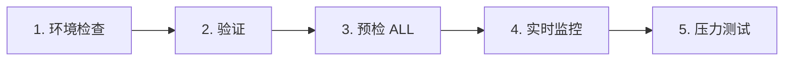

# IrsanAI TPM 代理锻造

[🇬🇧 English](./README.md) | [🇩🇪 Deutsch](./README.de.md) | [🇪🇸 Español](./docs/i18n/README.es.md) | [🇮🇹 Italiano](./docs/i18n/README.it.md) | [🇧🇦 Bosanski](./docs/i18n/README.bs.md) | [🇷🇺 Русский](./docs/i18n/README.ru.md) | [🇨🇳 中文](./docs/i18n/README.zh-CN.md) | [🇫🇷 Français](./docs/i18n/README.fr.md) | [🇧🇷 Português (BR)](./docs/i18n/README.pt-BR.md) | [🇮🇳 हिन्दी](./docs/i18n/README.hi.md) | [🇹🇷 Türkçe](./docs/i18n/README.tr.md) | [🇯🇵 日本語](./docs/i18n/README.ja.md)

一个用于自主多代理设置（BTC、COFFEE 等）的干净引导程序，具有跨平台运行时选项。

## 包含内容

- `production/preflight_manager.py` – 使用 Alpha Vantage + 回退链和本地缓存回退进行弹性市场源探测。
- `production/tpm_agent_process.py` – 简单的每个市场代理循环。
- `production/tpm_live_monitor.py` – 实时 BTC 监控器，带可选 CSV 热启动和 Termux 通知。
- `core/tpm_scientific_validation.py` – 回测 + 统计验证管道。
- `scripts/tpm_cli.py` – Termux/Linux/macOS/Windows 的统一启动器。
- `scripts/stress_test_suite.py` – 故障转移/延迟压力测试。
- `scripts/start_agents.sh`, `scripts/health_monitor_v3.sh` – 进程操作助手。
- `core/scout.py`, `core/reserve_manager.py`, `core/init_db_v2.py` – 核心操作工具。

## 通用快速入门

```bash
python scripts/tpm_cli.py env
python scripts/tpm_cli.py validate
python scripts/tpm_cli.py preflight --market ALL
python scripts/tpm_cli.py live --history-csv btc_real_24h.csv --poll-seconds 3600
```

## 运行时链检查（因果/顺序健全性）

默认仓库流是故意线性的，以避免实时运行期间的隐藏状态漂移和“虚假信心”。


```mermaid
flowchart LR
  A[1. 环境检查] --> B[2. 验证]
  B --> C[3. 预检 ALL]
  C --> D[4. 实时监控]
  D --> E[5. 压力测试]
```

### 门逻辑（下一步之前必须为真）
- **门 1 – 环境：** Python/平台上下文正确 (`env`)。
- **门 2 – 科学健全性：** 基线模型行为可重现 (`validate`)。
- **门 3 – 源可靠性：** 市场数据 + 回退链可达 (`preflight --market ALL`)。
- **门 4 – 运行时执行：** 实时循环以已知输入历史运行 (`live`)。
- **门 5 – 对抗性信心：** 延迟/故障转移目标在压力下保持 (`stress_test_suite.py`)。

✅ 已在代码中修复：CLI 预检现在支持 `--market ALL`，与快速入门 + Docker 流匹配。

## 选择你的任务（基于角色的 CTA）

> **你是 X？点击你的通道。在 60 秒内开始。**

| 角色 | 你关心什么 | 点击路径 | 第一个命令 |
|---|---|---|---|
| 📈 **交易员** | 快速脉搏，可操作的运行时 | [`tpm_live_monitor.py`](./production/tpm_live_monitor.py) | `python scripts/tpm_cli.py live --history-csv btc_real_24h.csv --poll-seconds 3600` |
| 💼 **投资者** | 稳定性、源信任、弹性 | [`preflight_manager.py`](./production/preflight_manager.py) | `python scripts/tpm_cli.py preflight --market ALL` |
| 🔬 **科学家** | 证据、测试、统计信号 | [`tpm_scientific_validation.py`](./core/tpm_scientific_validation.py) | `python scripts/tpm_cli.py validate` |
| 🧠 **理论家** | 因果结构 + 未来架构 | [`core/scout.py`](./core/scout.py) + [`下一步`](#next-steps) | `python scripts/tpm_cli.py validate` |
| 🛡️ **怀疑论者（优先）** | 在生产之前打破假设 | [`stress_test_suite.py`](./scripts/stress_test_suite.py) + [`preflight_manager.py`](./production/preflight_manager.py) | `python scripts/tpm_cli.py preflight --market ALL && python scripts/stress_test_suite.py` |
| ⚙️ **操作员 / DevOps** | 正常运行时间、进程健康、可恢复性 | [`start_agents.sh`](./scripts/start_agents.sh) + [`health_monitor_v3.sh`](./scripts/health_monitor_v3.sh) | `bash scripts/start_agents.sh` |

### 怀疑论者挑战（推荐新访问者优先）
如果你**只做一件事**，运行它并检查报告输出：

```bash
python scripts/tpm_cli.py preflight --market ALL
python scripts/stress_test_suite.py
```

如果这条通道说服了你，那么仓库的其余部分也可能会引起共鸣。

## 平台说明

- **Android / Termux (三星等)**
  ```bash
  bash scripts/termux_bootstrap.sh
  cd ~/TPM-Agent
  python scripts/tpm_cli.py env
  python scripts/tpm_cli.py preflight --market ALL
  python scripts/tpm_cli.py live --history-csv btc_real_24h.csv --notify --vibrate-ms 1000
  ```
  对于直接的 Android (Termux) Web UI 演示，在本地启动 Forge 运行时：
  ```bash
  cd ~/TPM-Agent
  bash scripts/termux_forge.sh start
  # 停止：bash scripts/termux_forge.sh stop
  # 状态：bash scripts/termux_forge.sh status
  ```
  脚本会自动打开浏览器（如果可用）并保持服务在后台运行。
  如果你在 Android 上看到 `pydantic-core`/Rust 或 `scipy`/Fortran 构建错误，请使用
  `python -m pip install -r requirements-termux.txt`（Termux 安全集，无需 Rust 工具链）。
  在 Web 界面中，你可以控制运行时的启动/停止；进度条显示转换状态。
- **iPhone (尽力而为)**：使用 iSH / a-Shell 等 shell 应用程序。Termux 特定的通知钩子在那里不可用。
- **Windows / Linux / macOS**：使用相同的 CLI 命令；通过 tmux/调度器/cron 运行以实现持久性。

## Docker（跨 OS 最简单的路径）

按此确切顺序使用 Docker（无需猜测）：

### 步骤 1：构建 Web 运行时镜像

```bash
docker compose build --no-cache tpm-forge-web
```

### 步骤 2：启动 Web 仪表板服务

```bash
docker compose up tpm-forge-web
```

现在在浏览器中打开 `http://localhost:8787`（**不是** `http://0.0.0.0:8787`）。Uvicorn 内部绑定到 `0.0.0.0`，但客户端应使用 `localhost`（或主机局域网 IP）。

### 步骤 3（可选检查）：了解非 Web 服务

```bash
docker compose run --rm tpm-preflight
docker compose run --rm tpm-live
```

- `tpm-preflight` = 源/连接检查（仅限 CLI 输出）。
- `tpm-live` = 终端实时监控日志（仅限 CLI 输出，**无 Web UI**）。
- `tpm-forge-web` = FastAPI + 仪表板 UI（具有布局/进度/运行时控制的那个）。

如果 `tpm-preflight` 报告 `ALPHAVANTAGE_KEY not set`，COFFEE 仍然可以通过回退工作。

如果页面看起来空白：
- 直接测试 API：`http://localhost:8787/api/frame`
- 测试 FastAPI 文档：`http://localhost:8787/docs`
- 硬刷新浏览器 (`Ctrl+F5`)
- 如果需要，仅重启 Web 服务：`docker compose restart tpm-forge-web`

可选，以获得更好的 COFFEE 质量：

```bash
export ALPHAVANTAGE_KEY="<你的密钥>"
docker compose run --rm tpm-preflight
```

## 故障预测和移动警报

- Forge 实时驾驶舱现在通过 `/api/markets/live` 暴露每个市场的短期前景（`上涨/下跌/横盘`）和置信度。
- 当检测到市场故障时（加速峰值），运行时可以触发：
  - Termux 吐司和振动
  - 可选通知/蜂鸣器钩子
  - 可选 Telegram 推送（如果在 `config/config.yaml` 中配置了机器人令牌/聊天 ID）。
- 通过仪表板中的 **保存警报** / **测试警报** 或 API 进行配置：
  - `GET /api/alerts/preferences`
  - `POST /api/alerts/preferences`
  - `POST /api/alerts/test`

## 验证

运行科学验证管道：

```bash
python core/tpm_scientific_validation.py
```

工件：
- `state/TPM_Scientific_Report.md`
- `state/TPM_test_results.json`

## 来源和故障转移

`production/preflight_manager.py` 支持：
- Alpha Vantage 优先用于 COFFEE（当设置 `ALPHAVANTAGE_KEY` 时）
- TradingView + Yahoo 回退链
- `state/latest_prices.json` 中的本地缓存回退

直接运行预检：

```bash
export ALPHAVANTAGE_KEY="<你的密钥>"
python production/preflight_manager.py --market ALL
```

运行中断压力测试（目标 `p95 < 1000ms`）：

```bash
python scripts/stress_test_suite.py
```

输出：`state/stress_test_report.json`

## 实时状态：TPM 代理今天能做什么

**当前状态：**
- 生产 Forge Web 运行时可用 (`production.forge_runtime:app`)。
- 金融优先启动配置使用 **BTC + COFFEE**。
- 实时帧、代理适应度、转移熵和领域摘要在 Web 仪表板中可见。
- 用户可以在运行时添加新的市场代理 (`POST /api/agents`)。

**目标能力（应该具备）：**
- 具有明确接受阈值（精度/召回率/FPR/漂移）的真实数据基准测试。
- 严格的自反治理规则，用于自动安全模式。
- 用于版本化每个领域学习模式的集体记忆工作流。

**下一个扩展阶段：**
- 跨所有代理的基于政权的策略协调器（趋势/冲击/横盘）。
- 一个非金融领域试点（例如医疗或地震）与明确的数据合同。

## PR 合并冲突助手

- 合并检查清单 (GitHub 冲突): `docs/MERGE_CONFLICT_CHECKLIST.de.md`

### 今天范围：Windows + 智能手机用于金融 TPM

- **Windows：** Forge 运行时 + Web 界面 + Docker/PowerShell/点击启动已投入运营。
- **智能手机：** Android/Termux 实时监控已投入运营；Web UI 在移动设备上响应迅速。
- **实时多代理：** BTC + COFFEE 默认激活；可以通过 Web UI 动态添加其他市场。
- **源边界规则：** 如果请求的市场不在内置源覆盖范围内，请提供明确的源 URL + 授权数据。

## Windows 实时测试（双路径系统）

### 路径 A — 开发人员/高级用户 (PowerShell, CMD, PyCharm, IDE)

```powershell
python -m venv .venv
.\.venv\Scripts\Activate.ps1
pip install -r requirements.txt
python scripts/tpm_cli.py forge-dashboard --open-browser --port 8787
```

### 路径 B — 低级用户（点击并启动）

1. 双击 `scripts/windows_click_start.bat`
2. 脚本自动选择最佳可用路径：
   - Python 可用 -> venv + pip + 运行时
   - 否则 Docker Compose（如果可用）

技术基础：`scripts/windows_bootstrap.ps1`。

## Forge 生产 Web 运行时（BTC + COFFEE，可扩展）

是的，这**已在仓库中启动**并正在扩展：

- 默认启动时带有一个用于 **BTC** 的金融 TPM 代理和一个用于 **COFFEE** 的金融 TPM 代理。
- 用户可以直接从 Web UI (`/api/agents`) 添加更多市场/代理。
- 作为持久运行时服务运行，具有实时帧输出 (`/api/frame`)，以提供沉浸式洞察。

### 启动（本地）

```bash
uvicorn production.forge_runtime:app --host 0.0.0.0 --port 8787
# 打开 http://localhost:8787
```

### 启动（Docker）

```bash
docker compose up tpm-forge-web
# 打开 http://localhost:8787
```

## TPM 游乐场（交互式 MVP）

您现在可以在浏览器中交互式地探索 TPM 行为：

```bash
python -m http.server 8765
# 打开 http://localhost:8765/playground/index.html
```

包括：
- 单代理弱信号异常视图
- 迷你群（BTC/COFFEE/VOL）共识压力
- 跨领域转移共振（合成金融/天气/健康）

参见：`playground/README.md`。
## 下一步

- 用于跨市场因果分析的转移熵模块。
- 基于历史表现进行策略更新的优化器。
- 警报通道（Telegram/Signal）+ 启动持久性。

---

## IrsanAI 深度解析：TPM 核心如何在复杂系统中“思考”

### 1) 愿景转型：从交易代理到通用 TPM 生态系统

### IrsanAI-TPM 算法的独特之处是什么？（修正后的框架）

TPM 核心的工作假设：

- 在复杂、混沌的系统中，预警信号通常隐藏在**微小残差**中：微小的偏差、微弱的相关性、几乎为空的数据点。
- 当经典系统只看到 `0` 或“不够相关”时，TPM 会在上下文流中搜索**结构化异常**（故障模式）。
- TPM 不仅评估值本身，还评估**关系随时间的变化、源质量、制度和因果邻域**。

重要的正确性说明：TPM **不**会神奇地预测未来。它旨在**更早地概率性地检测**制度转变、突破和中断——当数据质量和验证门满足时。

### 远大设想：为什么这超越了金融领域

如果 TPM 能够检测金融工具（指数/股票代码/ISIN 类标识符、流动性、微观结构）中的微弱前兆模式，那么同样的原理可以推广到许多领域：

- **事件/传感器流 + 上下文模型 + 异常层 + 反馈循环**
- 每个职业都可以建模为一个“市场”，具有领域特定的特征、节点、关联和异常
- 专业 TPM 代理可以跨领域学习，同时保留本地专业逻辑和道德

### 100 个职业作为 TPM 目标空间

| # | 职业 | TPM 数据模拟 | 异常/模式检测目标 |
|---|---|---|---|
| 1 | 警察分析师 | 事件日志、地理时间犯罪地图、网络 | 犯罪集群升级的早期信号 |
| 2 | 消防指挥官 | 警报链、传感器馈送、天气、建筑概况 | 预测火灾和危险蔓延窗口 |
| 3 | 辅助医护人员/EMS | 调度原因、响应时间、医院负荷 | 在崩溃前检测容量压力 |
| 4 | 急诊医生 | 分诊流程、生命体征、等待时间动态 | 更早地标记危急失代偿 |
| 5 | ICU 护士 | 通气/实验室趋势、药物反应 | 识别败血症/休克微信号 |
| 6 | 流行病学家 | 病例率、流动性、废水/实验室数据 | 指数增长阶段前的疫情预警 |
| 7 | 家庭医生 | EHR 模式、处方、随访间隔 | 更早地检测慢性风险转变 |
| 8 | 临床心理学家 | 会话轨迹、语言标记、睡眠/活动 | 更早地检测复发/危机指标 |
| 9 | 制药研究员 | 化合物筛选、不良事件概况、基因组学 | 揭示隐藏的疗效和副作用集群 |
| 10 | 生物技术专家 | 序列/过程/细胞培养轨迹 | 检测漂移和污染风险 |
| 11 | 气候科学家 | 大气/海洋时间序列、卫星场 | 识别临界点前兆 |
|