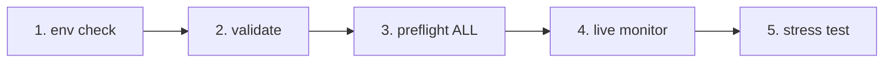

# IrsanAI TPM Agent Forge

[🇬🇧 English](./README.md) | [ZH-CN Zh-cn](./docs/i18n/README.zh-CN.md) |

A clean bootstrap for an autonomous multi-agent setup (BTC, COFFEE, and more) with cross-platform runtime options.

## What's Included

- `production/preflight_manager.py` – resilient market source probing with Alpha Vantage + fallback chain and local cache fallback.
- `production/tpm_agent_process.py` – simple per-market agent loop.
- `production/tpm_live_monitor.py` – live BTC monitor with optional CSV warm-start and Termux notifications.
- `core/tpm_scientific_validation.py` – backtest + statistical validation pipeline.
- `scripts/tpm_cli.py` – unified launcher for Termux/Linux/macOS/Windows.
- `scripts/stress_test_suite.py` – failover/latency stress test.
- `scripts/start_agents.sh`, `scripts/health_monitor_v3.sh` – process ops helpers.
- `core/scout.py`, `core/reserve_manager.py`, `core/init_db_v2.py` – operational core tooling.

## Universal Quickstart

```bash
python scripts/tpm_cli.py env
python scripts/tpm_cli.py validate
python scripts/tpm_cli.py preflight --market ALL
python scripts/tpm_cli.py live --history-csv btc_real_24h.csv --poll-seconds 3600
```

## Runtime Chain Check (causal/order sanity)

The default repo flow is intentionally linear to avoid hidden-state drift and "false confidence" during live runs.


```mermaid
flowchart LR
  A[1. env check] --> B[2. validate]
  B --> C[3. preflight ALL]
  C --> D[4. live monitor]
  D --> E[5. stress test]
```

### Gate logic (what must be true before the next step)
- **Gate 1 – 环境：** Python/平台上下文正确（`env`）。
- **Gate 2 – 科学校验：** 基线模型行为可复现（`validate`）。
- **Gate 3 – 来源可靠性：** 市场数据 + fallback 链可达（`preflight --market ALL`）。
- **Gate 4 – Runtime 执行：** live 循环使用已知输入历史运行（`live`）。
- **Gate 5 – 对抗置信度：** 延迟/故障切换目标在压力下可保持（`stress_test_suite.py`）。

✅ Already fixed in code: CLI preflight now supports `--market ALL`, matching quickstart + docker flow.

## Choose Your Mission (role-based CTA)

> **You are X? Click your lane. Start in <60 seconds.**

| Persona | What you care about | Click path | First command |
|---|---|---|---|
| 📈 **Trader** | Fast pulse, actionable runtime | [`tpm_live_monitor.py`](./production/tpm_live_monitor.py) | `python scripts/tpm_cli.py live --history-csv btc_real_24h.csv --poll-seconds 3600` |
| 💼 **Investor** | Stability, source trust, resilience | [`preflight_manager.py`](./production/preflight_manager.py) | `python scripts/tpm_cli.py preflight --market ALL` |
| 🔬 **Scientist** | Evidence, tests, statistical signal | [`tpm_scientific_validation.py`](./core/tpm_scientific_validation.py) | `python scripts/tpm_cli.py validate` |
| 🧠 **Theoretician** | Causal structure + future architecture | [`core/scout.py`](./core/scout.py) + [`Next Steps`](#next-steps) | `python scripts/tpm_cli.py validate` |
| 🛡️ **Skeptic (priority)** | Break assumptions before production | [`stress_test_suite.py`](./scripts/stress_test_suite.py) + [`preflight_manager.py`](./production/preflight_manager.py) | `python scripts/tpm_cli.py preflight --market ALL && python scripts/stress_test_suite.py` |
| ⚙️ **Operator / DevOps** | Uptime, process health, recoverability | [`start_agents.sh`](./scripts/start_agents.sh) + [`health_monitor_v3.sh`](./scripts/health_monitor_v3.sh) | `bash scripts/start_agents.sh` |

### Skeptic Challenge (recommended first for new visitors)
If you do **only one thing**, run this and inspect the report output:

```bash
python scripts/tpm_cli.py preflight --market ALL
python scripts/stress_test_suite.py
```

If this lane convinces you, the rest of the repository will likely resonate too.

## Platform Notes

- **Android / Termux (Samsung, etc.)**
  ```bash
  bash scripts/termux_bootstrap.sh
  cd ~/TPM-Agent
  python scripts/tpm_cli.py env
  python scripts/tpm_cli.py preflight --market ALL
  python scripts/tpm_cli.py live --history-csv btc_real_24h.csv --notify --vibrate-ms 1000
  ```
  For direct Android (Termux) web UI demo, start Forge runtime locally:
  ```bash
  cd ~/TPM-Agent
  bash scripts/termux_forge.sh start
  # stop: bash scripts/termux_forge.sh stop
  # status: bash scripts/termux_forge.sh status
  ```
  The script auto-opens browser (if available) and keeps service running in background.
  If you saw a `pydantic-core`/Rust or `scipy`/Fortran build error on Android, use
  `python -m pip install -r requirements-termux.txt` (Termux-safe set, no Rust toolchain required).
  In the web interface you can control runtime start/stop; a progress bar shows transition status.
- **iPhone（尽力而为）：** 可使用 iSH / a-Shell 等 shell 应用。Termux 专用通知钩子在该平台不可用。
- **Windows / Linux / macOS**：使用同一套 CLI 命令；通过 tmux/scheduler/cron 保持持续运行。

## Docker (Cross-OS Easiest Path)

Use Docker in this exact order (no guessing):

### Step 1: Build the web runtime image

```bash
docker compose build --no-cache tpm-forge-web
```

### Step 2: Start the web dashboard service

```bash
docker compose up tpm-forge-web
```

Now open `http://localhost:8787` in your browser (**not** `http://0.0.0.0:8787`). Uvicorn binds to `0.0.0.0` internally, but clients should use `localhost` (or the host LAN IP).

### Step 3 (optional checks): understand the non-web services

```bash
docker compose run --rm tpm-preflight
docker compose run --rm tpm-live
```

- `tpm-preflight` = source/connectivity checks (CLI output only).
- `tpm-live` = terminal live-monitor logs (CLI output only, **no web UI**).
- `tpm-forge-web` = FastAPI + dashboard UI (the one with layout/progress/runtime control).

If `tpm-preflight` reports `ALPHAVANTAGE_KEY not set`, COFFEE still works via fallbacks.

If you previously saw `sqlite3.OperationalError: no such table: price_history` in optional Step 3, update to the latest repo state. Preflight now auto-initializes DB schema before probing sources in CLI and runtime paths.

If the page looks blank:
- test API directly: `http://localhost:8787/api/frame`
- test FastAPI docs: `http://localhost:8787/docs`
- hard refresh browser (`Ctrl+F5`)
- if needed, restart only web service: `docker compose restart tpm-forge-web`

Optional for better COFFEE quality:

```bash
export ALPHAVANTAGE_KEY="<your_key>"
docker compose run --rm tpm-preflight
```

## Glitch predictions & mobile alerts

- Forge live cockpit now exposes per-market short-horizon outlook (`up/down/sideways`) with confidence in `/api/markets/live`.
- When a market glitch is detected (acceleration spike), runtime can trigger:
  - Termux toast + vibration
  - optional notification/beep hook
  - optional Telegram push (if bot token/chat id configured in `config/config.yaml`).
- Configure in dashboard via **Save Alerts** / **Test Alert** or API:
  - `GET /api/alerts/preferences`
  - `POST /api/alerts/preferences`
  - `POST /api/alerts/test`

## Validation

运行科学验证流水线：

```bash
python core/tpm_scientific_validation.py
```

Artifacts:
- `state/TPM_Scientific_Report.md`
- `state/TPM_test_results.json`

## Sources & Failover

`production/preflight_manager.py` supports:
- Alpha Vantage first for COFFEE (when `ALPHAVANTAGE_KEY` is set)
- TradingView + Yahoo fallback chain
- local cached fallback in `state/latest_prices.json`

Run preflight directly:

```bash
export ALPHAVANTAGE_KEY="<your_key>"
python production/preflight_manager.py --market ALL
```

Run outage stress test (target `p95 < 1000ms`):

```bash
python scripts/stress_test_suite.py
```

Output: `state/stress_test_report.json`


## Live status: what the TPM agent can do today

**Current state:**
- Production Forge web runtime is available (`production.forge_runtime:app`).
- Finance-first start configuration uses **BTC + COFFEE**.
- Live frame, agent fitness, transfer entropy, and domain summary are visible in the web dashboard.
- Users can add new market agents at runtime (`POST /api/agents`).

**Target capability (should-have):**
- Real-data benchmarking with explicit acceptance thresholds (precision/recall/FPR/drift).
- Strict reflexive governance rules for auto safe-mode.
- Collective-memory workflow for versioned per-domain learning patterns.

**Next expansion stage:**
- Regime-based policy orchestrator (trend/shock/sideways) across all agents.
- One non-finance domain pilot (e.g. medical or seismic) with explicit data contracts.


## PR merge conflict helper

- Merge-Checkliste (GitHub Konflikte): `docs/MERGE_CONFLICT_CHECKLIST.de.md`


### Scope today: Windows + smartphone for finance TPM

- **Windows:** Forge runtime + web interface + Docker/PowerShell/click-start are operational.
- **Smartphone:** Android/Termux live-monitoring is operational; web UI is responsive on mobile.
- **Realtime multi-agent:** BTC + COFFEE active by default; additional markets can be added dynamically in the web UI.
- **Source boundary rule:** if requested market is not covered by built-in sources, provide explicit source URL + authorization data.

## Windows live test (two-path system)

### Path A — Developer/power users (PowerShell, CMD, PyCharm, IDE)

```powershell
python -m venv .venv
.\.venv\Scripts\Activate.ps1
pip install -r requirements.txt
python scripts/tpm_cli.py forge-dashboard --open-browser --port 8787
```

### Path B — Low-level users (click & start)

1. Double-click `scripts/windows_click_start.bat`
2. Script auto-selects best available path:
   - Python available -> venv + pip + runtime
   - otherwise Docker Compose (if available)

Technical base: `scripts/windows_bootstrap.ps1`.

## Forge Production Web Runtime (BTC + COFFEE, extensible)

Yes, this has **already started** in the repo and is now extended:

- Starts by default with one finance TPM agent for **BTC** and one for **COFFEE**.
- Users can add more markets/agents directly from the web UI (`/api/agents`).
- Runs as a persistent runtime service with live frame output (`/api/frame`) for immersive insight.

### Start (local)

```bash
uvicorn production.forge_runtime:app --host 0.0.0.0 --port 8787
# open http://localhost:8787
```

### Start (Docker)

```bash
docker compose up tpm-forge-web
# open http://localhost:8787
```

## TPM Playground (interactive MVP)

现在你可以在浏览器中交互式探索 TPM 行为：

```bash
python -m http.server 8765
# open http://localhost:8765/playground/index.html
```

包含：
- 单代理弱信号异常视图
- 迷你群体（BTC/COFFEE/VOL）共识压力
- 跨域迁移共振（合成：金融/天气/健康）

See: `playground/README.md`.
## Next Steps

- 用于跨市场因果分析的传递熵模块。
- 基于历史表现进行策略更新的优化器。
- Alert channels (Telegram/Signal) + boot persistence.


---

## IrsanAI Deep Dive: How the TPM core "thinks" in complex systems

### 1) Visionary transformation: from trading agent to universal TPM ecosystem

### What is unique about the IrsanAI-TPM algorithm? (corrected framing)

Working hypothesis of the TPM core:

- 在复杂且混沌的系统中，早期预警信号常隐藏在 **微残差** 中：细微偏差、弱相关、近乎空白的数据点。
- Where classic systems see only `0` or "not enough relevance", TPM searches for **structured anomalies** (glitch patterns) in context flow.
- TPM 不仅评估单个数值，还评估**关系随时间变化、来源质量、状态区间与因果邻域**。

重要说明：TPM **并不**会“神奇预测未来”。其目标是在数据质量与验证 gate 满足时，实现对状态切换、突破和扰动的**更早期概率检测**。

### Think BIG: why this extends beyond finance

If TPM can detect weak precursor patterns in financial instruments (index/ticker/ISIN-like identifiers, liquidity, microstructure), the same principle can generalize to many domains:

- **Event/sensor stream + context model + anomaly layer + feedback loop**
- 每个职业都可建模为一个"市场"：含领域特征、节点、相关性与异常
- 专用 TPM 代理可跨域学习，同时保留本地专业逻辑与伦理

### 100 个职业作为 TPM 目标空间

| # | 职业 | TPM 数据类比 | 异常/模式检测目标 |
|---|---|---|---|
| 1 | Police analyst | Incident logs, geotemporal crime maps, networks | Early signals of escalating crime clusters |
| 2 | Fire service commander | Alarm chains, sensor feeds, weather, building profiles | Predict fire and hazard propagation windows |
| 3 | Paramedic/EMS | Dispatch reasons, response times, hospital load | Detect capacity stress before breakdown |
| 4 | Emergency physician | Triage flows, vitals, waiting-time dynamics | Flag critical decompensation earlier |
| 5 | ICU nurse | Ventilation/lab trends, medication responses | Identify sepsis/shock micro-signals |
| 6 | Epidemiologist | Case rates, mobility, wastewater/lab data | Outbreak early warning before exponential phase |
| 7 | Family physician | EHR patterns, prescriptions, follow-up gaps | Detect chronic-risk transitions early |
| 8 | Clinical psychologist | Session trajectories, language markers, sleep/activity | Detect relapse/crisis indicators sooner |
| 9 | Pharma researcher | Compound screens, adverse-event profiles, genomics | Reveal hidden efficacy and side-effect clusters |
| 10 | Biotechnologist | Sequence/process/cell-culture trajectories | Detect drift and contamination risk |
| 11 | Climate scientist | Atmosphere/ocean time series, satellite fields | Identify tipping-point precursors |
| 12 | Meteorologist | Pressure/humidity/wind/radar fields | Anticipate local chaotic weather shifts |
| 13 | Seismologist | Microquakes, stress fields, sensor arrays | Detect precursors to major releases |
| 14 | Volcanologist | Gas, tremor, deformation time series | Narrow eruption probability windows |
| 15 | Hydrologist | River gauges, rain, soil moisture | Detect flash-flood and drought phase changes |
| 16 | Oceanographer | Currents, temperature, salinity, buoy streams | Detect tsunami/ecosystem-relevant anomalies |
| 17 | Energy trader | Load, spot prices, weather, grid state | Signal probable price/load breakouts early |
| 18 | Grid operator | Grid frequency, line state, switching events | Detect cascading-failure risk |
| 19 | Wind farm operator | Turbine telemetry, wind fields, maintenance logs | Predict failures and performance drift |
| 20 | Solar plant operator | Irradiance, inverter telemetry, thermal load | Detect degradation and yield anomalies |
| 21 | Water utility manager | Flow, quality sensors, consumption patterns | Detect contamination/shortage early |
| 22 | Traffic operations manager | Density, collisions, roadworks, events | Predict congestion and crash escalation |
| 23 | Railway control manager | Timetable adherence, track state, delay chains | Break systemic delay cascades early |
| 24 | Air traffic controller | Flight tracks, weather, slot saturation | Detect conflict paths and bottlenecks |
| 25 | Port logistics manager | Berth times, container flow, customs status | Detect supply disruption precursors |
| 26 | Supply-chain manager | ETA, inventory, demand pulse, risk events | Minimize bullwhip and stockout anomalies |
| 27 | Manufacturing lead | OEE, process telemetry, scrap, setup times | Detect quality drift and machine anomalies |
| 28 | Quality engineer | Tolerance distributions, process signals | Detect near-zero defect precursors |
| 29 | Robotics engineer | Motion trajectories, actuator load, control loops | Predict control instability/failure |
| 30 | Aviation maintenance engineer | Engine/flight telemetry, maintenance history | Component-level predictive maintenance |
| 31 | Construction manager | Progress, weather, supply dates, IoT sensors | Quantify schedule/cost anomaly risk |
| 32 | Structural engineer | Load, vibration, fatigue/aging indicators | Detect structural-critical transitions |
| 33 | Urban planner | Mobility, demographics, emissions, land use | Detect emerging urban stress patterns |
| 34 | Architect | Building operations, occupancy, energy curves | Detect design-use mismatch patterns |
| 35 | Farmer | Soil/weather/crop/market streams | Detect disease/yield anomalies early |
| 36 | Agronomist | Satellite nutrition/hydration data | Target precise interventions early |
| 37 | Forestry manager | Moisture, pest patterns, fire indicators | Detect forest damage/fire windows early |
| 38 | Fisheries manager | Catch records, water quality, migration | Detect overfishing/collapse risks |
| 39 | Food safety inspector | Lab findings, cold-chain logs, supply links | Interrupt contamination chains early |
| 40 | Executive chef | Demand pulse, stock health, waste ratios | Minimize spoilage and shortage anomalies |
| 41 | Retail operator | POS streams, footfall, inventory rotation | Detect demand spikes and shrinkage patterns |
| 42 | E-commerce manager | Clickstream, cart journeys, returns | Detect fraud/churn precursor patterns |
| 43 | Marketing analyst | Campaign metrics, segment response curves | Detect micro-trends before mainstream |
| 44 | Sales lead | Pipeline velocity, touchpoint graph | Detect deal-risk and timing opportunities |
| 45 | Customer support lead | Ticket flow, topic clusters, SLA drift | Detect escalation/root-cause waves |
| 46 | Product manager | Feature adoption, retention, feedback | Detect product-market misfit early |
| 47 | UX researcher | Heatmaps, pathing, drop-off points | Surface hidden interaction friction |
| 48 | Software engineer | Logs, traces, deploy metrics | Detect fault cascades pre-incident |
| 49 | Site reliability engineer | Latency, error budgets, saturation | Catch degradation before outage |
| 50 | Cybersecurity analyst | Network flows, IAM events, SIEM alerts | Detect attack-path and lateral movement |
| 51 | Fraud analyst | Transaction graphs, device fingerprints | Detect fraud in weak-signal space |
| 52 | Bank risk manager | Portfolio/macro/liquidity exposures | Detect stress regimes and concentration risk |
| 53 | Insurance actuary | Claims flow, exposure maps, climate links | Anticipate claims waves and reserve stress |
| 54 | Tax advisor | Ledger patterns, filing timelines | Detect compliance risk and optimization paths |
| 55 | Auditor | Control trails, exception patterns | Detect accounting anomalies at scale |
| 56 | Attorney | Case chronology, precedent graphs, deadlines | Detect litigation risk and outcome patterns |
| 57 | Judge/court administrator | Caseload mix, cycle times | Detect justice-system bottlenecks |
| 58 | Corrections manager | Occupancy, incident networks, behavior trends | Detect violence/recidivism clusters |
| 59 | Customs officer | Trade manifests, declarations, routing patterns | Detect smuggling/evasion signals |
| 60 | Defense intelligence analyst | ISR feeds, logistics, operational tempo | Detect escalation dynamics early |
| 61 | Diplomatic analyst | Event chains, communications signals | Detect geopolitical regime shifts |
| 62 | Teacher | Learning progress, attendance, engagement | Detect dropout-risk and support need |
| 63 | School principal | Performance clusters, attendance, resources | Detect systemic school stress patterns |
| 64 | University lecturer | Course activity, withdrawals, feedback | Stabilize student success earlier |
| 65 | Education researcher | Cohort trajectories, pedagogy variables | Identify robust intervention effects |
| 66 | Social worker | Case networks, appointments, risk markers | Detect crisis escalation pathways |
| 67 | NGO coordinator | Field reports, aid flows, need signals | Detect impact gaps and hotspot changes |
| 68 | Employment advisor | Skill profiles, labor demand, transitions | Detect mismatch and upskilling needs |
| 69 | HR manager | Hiring/attrition/performance trajectories | Detect burnout and retention risk early |
| 70 | Recruiter | Funnel rates, skills taxonomy, market pulse | Detect fit risk and hiring opportunity windows |
| 71 | Org consultant | Decision cadence, KPI drift, network patterns | Detect team dysfunction early |
| 72 | Project manager | Milestones, dependencies, blocker graph | Anticipate schedule/scope breakdowns |
| 73 | Journalist | Source reliability graph, event streams | Detect misinformation clusters early |
| 74 | Investigative reporter | Document networks, money/communication traces | Expose hidden systemic anomalies |
| 75 | Content moderator | Post/comment streams, semantic shifts | Detect abuse/radicalization waves early |
| 76 | Artist | Audience response trajectories, style vectors | Detect emerging aesthetics |
| 77 | Music producer | Listening features, arrangement vectors | Detect breakout/niche potential early |
| 78 | Game designer | Telemetry, progression, churn curves | Detect frustration and balance anomalies |
| 79 | Sports coach | Performance/biometric load streams | Detect injury/form-drop precursors |
| 80 | Athletic trainer | Motion/recovery markers | Detect overload before downtime |
| 81 | Sports physician | Diagnostics, rehab load, recurrence risk | Optimize return-to-play windows |
| 82 | Referee analyst | Decision stream, tempo, incident context | Detect consistency/fairness drift |
| 83 | Event manager | Ticketing, mobility, weather, safety feeds | Detect crowd and safety risk escalation |
| 84 | Tourism manager | Booking patterns, reputation signals | Detect demand and sentiment shifts |
| 85 | Hotel manager | Occupancy, service quality, complaints | Detect quality-demand instability early |
| 86 | Property manager | Rent flow, maintenance, market comps | Detect vacancy/default risk early |
| 87 | Facility manager | Building IoT, energy, maintenance intervals | Detect failures and inefficiency patterns |
| 88 | Waste management operator | Waste streams, routing, environmental metrics | Detect illegal dumping and process gaps |
| 89 | Environmental inspector | Emissions, reports, satellite overlays | Detect compliance violations and tipping risk |
| 90 | Circular economy analyst | Material passports, recovery rates | Detect leakage and loop-closure opportunities |
| 91 | Astrophysicist | Telescope streams, spectra, noise models | Detect rare cosmic events |
| 92 | Space operations engineer | Telemetry, orbit params, system diagnostics | Detect mission-critical anomalies early |
| 93 | Quantum engineer | Noise profiles, calibration drifts, gate errors | Detect decoherence and control drift |
| 94 | Data scientist | Feature drift, model quality, data integrity | Detect model collapse and bias shift |
| 95 | AI ethicist | Decision outcomes, fairness metrics | Detect unfair patterns/governance gaps |
| 96 | Philosophy of science researcher | Theory-evidence pathways | Detect paradigm mismatch signals |
| 97 | Mathematician | Residual structures, invariants, error terms | Detect hidden regularities/outlier classes |
| 98 | Systems theorist | Node-edge dynamics, feedback delays | Detect network tipping dynamics |
| 99 | Anthropologist | Field observations, language/social networks | Detect cultural-shift conflict precursors |
| 100 | Foresight strategist | Tech curves, regulation, behavior data | Connect scenarios with early indicators |

### 国家适配说明（跨司法辖区职业等价）

To keep the list logically correct across regions, TPM role-mapping should be interpreted as **functional equivalents**, not literal job-title translation:

- **Germany ↔ US/UK:** `Polizei` vs split functions (`Police Department`, `Sheriff`, `State Trooper`) and prosecution differences (`Staatsanwaltschaft` vs `District Attorney/Crown Prosecution`).
- **Spain / Italy:** civil-law structures with distinct court and policing workflows; data pipelines often split between regional and national systems.
- **Bosnia and Herzegovina:** multi-entity governance means fragmented data ownership; TPM benefits from federated anomaly fusion.
- **Russia / China:** role definitions and data-governance constraints differ; TPM must be configured with local compliance boundaries and institutional equivalents.
- **Additional high-impact regions:** France, Brazil, India, Japan, MENA states, and Sub-Saharan Africa can be onboarded by mapping equivalent functions and available telemetry.

### 哲学与科学视角

- From tool to **epistemic infrastructure**: domains operationalize "weak early knowledge".
- From isolated systems to **agent federations**: local ethics + shared anomaly grammar.
- From reactive response to **anticipatory governance**: prevention over late crisis control.
- From static models to **living theories**: continuous recalibration under real-world shocks.

Core idea: a responsibly governed TPM cluster cannot control chaos — but it can help institutions understand it earlier, steer it more robustly, and decide more humanely.

## Multilingual expansion (in progress)

To support cross-language resonance, localized strategic overviews are available in:

- Spanish (`docs/i18n/README.es.md`)
- Italian (`docs/i18n/README.it.md`)
- Bosnian (`docs/i18n/README.bs.md`)
- Russian (`docs/i18n/README.ru.md`)
- Chinese Simplified (`docs/i18n/README.zh-CN.md`)
- French (`docs/i18n/README.fr.md`)
- Portuguese Brazil (`docs/i18n/README.pt-BR.md`)
- Hindi (`docs/i18n/README.hi.md`)
- Turkish (`docs/i18n/README.tr.md`)
- Japanese (`docs/i18n/README.ja.md`)

Each localized file includes region-fit notes and points back to this canonical English section for the full 100-profession matrix.

## IrsanAI Quality Meta (SOLL vs IST)

Für den aktuellen Reifegrad des Repos, den Qualitätszwischenstand und die kausale Roadmap auf Basis realer Nutzererwartungen siehe:

- `docs/IRSANAI_QUALITY_META.md`

Dieses Dokument ist ab sofort Referenz für:
- Anspruchstiefe bei Features (UX/UI + operative Robustheit),
- Docker/Android-Paritätsanforderungen,
- sowie Akzeptanz-Qualitätsgates für kommende PRs.

## i18n parity mode (full mirror)

To ensure no language community is content-disadvantaged, i18n files are now maintained in full canonical parity with `README.md`.

Sync command:

```bash
python scripts/i18n_full_mirror_sync.py
```

## Hinweis für Entwickler (LOP – Liste offener Punkte)

Was aus meiner Sicht noch offen ist (fachlich, nicht technisch blockiert):

| Punkt | Aktueller Stand | Wie man sinnvoll fortsetzt |
|---|---|---|
| **Transfer-Entropy-Modul für Cross-Market-Kausalität** | **Erledigt ✅** – als `TransferEntropyEngine` implementiert und im Forge-Orchestrator verdrahtet. | Fachliche Kalibrierung ergänzen: domänenspezifische Schwellen und Interpretationsregeln definieren. |
| **Optimizer/Policy-Update auf Basis Historie** | **Erledigt ✅** – Fitness-Scoring, Reward-Update und Candidate-Culling laufen im Tick-Zyklus. | Betriebsmodi dokumentieren (konservativ/aggressiv) und als Governance-Profile testbar machen. |
| **Alerting (Telegram/Signal)** | **Teilweise erledigt 🟡** – Infrastruktur ist vorhanden, standardmäßig aber deaktiviert. | Alarmrichtlinie festlegen: welche Events, welche Schweregrade, welcher Kanal, wer reagiert. |
| **Boot-Persistenz / Dauerbetrieb** | **Teilweise erledigt 🟡** – Start- und Health-Monitoring per tmux existieren, aber kein einheitliches Boot-Runbook für alle Zielplattformen. | Plattformprofile (Termux/Linux/Docker) mit Start-bei-Boot, Restart-Policy und Eskalationspfad schriftlich definieren. |
| **Koordiniertes Meta-Layer (aus „Nächste Ausbaustufe (promotet)“)** | **Teilweise erledigt 🟡** – Teile sind vorhanden (Orchestrator + Entropie + Reward), aber noch nicht als vollständiger Regime-Policy-Orchestrator beschrieben. | Ein explizites fachliches Steuerungsmodell (Trend/Schock/Sideways) für Agentengewichte ergänzen. |
| **Collective Memory (versionssicheres Lernmuster-Archiv)** | **Offen 🔴** – in den Vision/Weiterentwicklungsabschnitten genannt, aber noch ohne klaren fachlichen Speicher- und Review-Prozess. | Lernmuster-Format, Versionslogik und Qualitätskriterien (wann Muster „gültig“ wird) definieren. |
| **Reflexive Governance (automatisch konservativer Modus bei Unsicherheit)** | **Offen 🔴** – als Zielbild benannt, aber noch nicht als fachliche Entscheidungsregel formalisiert. | Unsicherheitsindikatoren und harte Umschaltbedingungen in ein Governance-Regelwerk überführen. |
| **Domänenausbau über Finance/Weather hinaus** | **Offen 🔴** – weitere Domänen sind als Vision/Templates angelegt, aber fachlich noch nicht in produktive Datenverträge überführt. | Einen nächsten Domänenpiloten (z. B. Medical oder Seismic) mit klaren Metriken und Datenquellen starten. |
| **Wissenschaftliche Evidenz auf Realdaten erweitern** | **Offen 🔴** – aktuelle Validierung ist robust, jedoch auf synthetischen Regime-Segmenten aufgebaut. | Realdaten-Benchmarking mit festen Akzeptanzkriterien (Precision/Recall/FPR/Drift) ergänzen. |
| **Sprachübergreifende Resonanz / i18n-Ausbau** | **Teilweise erledigt 🟡** – mehrere Sprach-Landingpages existieren; Ausbau ist explizit als „in progress“ markiert. | Synchronisationsprozess definieren (wann Änderungen aus Root-README in alle i18n-READMEs propagiert werden). |

Kurzfazit: Die früheren „Next Steps“ sind **technisch zu großen Teilen gestartet oder umgesetzt**; der größte Hebel liegt jetzt in **fachlicher Operationalisierung** (Governance, Policies, Domänenlogik, Realdaten-Evidenz) und **konsistentem Doku-/i18n-Betrieb**.

### LOP execution plan

For implementation sequencing, done-criteria and evidence gates for each open LOP point, see:

- `docs/LOP_EXECUTION_PLAN.md`

## LOP (Endnote – priorisiert)

1. **P1 Realdaten-Evidenz ausbauen:** Benchmarking mit festen Akzeptanzkriterien (Precision/Recall/FPR/Drift).
2. **P2 Reflexive Governance finalisieren:** harte Auto-Safe-Mode-Regeln bei Unsicherheit definieren.
3. **P3 Collective Memory standardisieren:** versionssichere Lernmuster inkl. Review-Prozess je Domäne.
4. **P4 Web-Immersion weiter ausrollen:** Rollenansichten für weitere TPM-Branchen auf Basis des neuen responsiven Layouts.

**Plattform-Hinweis:** Aktuell primär auf **Windows + Smartphone** ausgerichtet. **Später am Ende der LOP ergänzen:** macOS, Linux und weitere Plattformprofile.
