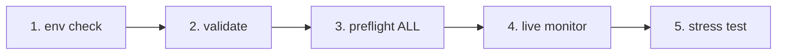

# IrsanAI TPM Agent Forge
[🇬🇧 English](../../README.md) | [🇩🇪 Deutsch](../../README.de.md) | [🇪🇸 Español](../../docs/i18n/README.es.md) | [🇮🇹 Italiano](../../docs/i18n/README.it.md) | [🇧🇦 Bosanski](../../docs/i18n/README.bs.md) | [🇷🇺 Русский](../../docs/i18n/README.ru.md) | [🇨🇳 中文](../../docs/i18n/README.zh-CN.md) | [🇫🇷 Français](../../docs/i18n/README.fr.md) | [🇧🇷 Português (BR)](../../docs/i18n/README.pt-BR.md) | [🇮🇳 हिन्दी](../../docs/i18n/README.hi.md) | [🇹🇷 Türkçe](../../docs/i18n/README.tr.md) | [🇯🇵 日本語](../../docs/i18n/README.ja.md)

[🇬🇧 English](../../README.md) | [🇩🇪 Deutsch](../../README.de.md) | [🇪🇸 Español](./README.es.md) | [🇮🇹 Italiano](./README.it.md) | [🇧🇦 Bosanski](./README.bs.md) | [🇷🇺 Русский](./README.ru.md) | [🇨🇳 中文](./README.zh-CN.md) | [🇫🇷 Français](./README.fr.md) | [🇧🇷 Português (BR)](./README.pt-BR.md) | [🇮🇳 हिन्दी](./README.hi.md) | [🇹🇷 Türkçe](./README.tr.md) | [🇯🇵 日本語](./README.ja.md)

一个为自治多代理设置（BTC、COFFEE 等）提供简洁启动方案的项目，具备跨平台运行时选项。

## 包含内容

- `production/preflight_manager.py` – 具备 Alpha Vantage + 备用链和本地缓存回退的稳健市场数据探测。
- `production/tpm_agent_process.py` – 简单的每市场代理循环。
- `production/tpm_live_monitor.py` – 实时 BTC 监控，支持可选的 CSV 热启动和 Termux 通知。
- `core/tpm_scientific_validation.py` – 回测与统计验证流水线。
- `scripts/tpm_cli.py` – 统一启动器，支持 Termux/Linux/macOS/Windows。
- `scripts/stress_test_suite.py` – 故障恢复与延迟压力测试。
- `scripts/start_agents.sh`, `scripts/health_monitor_v3.sh` – 进程操作辅助脚本。
- `core/scout.py`, `core/reserve_manager.py`, `core/init_db_v2.py` – 运行核心工具。

## 通用快速入门

```bash
python scripts/tpm_cli.py env
python scripts/tpm_cli.py validate
python scripts/tpm_cli.py preflight --market ALL
python scripts/tpm_cli.py live --history-csv btc_real_24h.csv --poll-seconds 3600
```

## 运行时链检查（因果/顺序合理性）

默认仓库流程设计成线性，避免在实时运行中出现隐藏状态偏移和“虚假信心”。


```mermaid
flowchart LR
  A[1. env check] --> B[2. validate]
  B --> C[3. preflight ALL]
  C --> D[4. live monitor]
  D --> E[5. stress test]
```

### 门控逻辑（下一步骤必须成立的条件）
- **门控 1 – 环境：** Python/平台环境符合要求（`env`）。
- **门控 2 – 科学合理性：** 基线模型行为可复现（`validate`）。
- **门控 3 – 数据源可靠性：** 市场数据及备用链可达（`preflight --market ALL`）。
- **门控 4 – 运行时执行：** 实时循环运行，输入历史清晰（`live`）。
- **门控 5 – 对抗信心：** 延迟与故障切换指标在压力测试下符合要求（`stress_test_suite.py`）。

✅ 代码中已修复：CLI 预检现支持 `--market ALL`，与快速入门和 Docker 流程保持一致。

## 选择您的任务（基于角色的行动号召）

> **您是 X？点击对应路径。60 秒内启动。**

| 角色 | 关注重点 | 路径 | 首个命令 |
|---|---|---|---|
| 📈 **交易员** | 快速脉动，可操作的运行时数据 | [`tpm_live_monitor.py`](./production/tpm_live_monitor.py) | `python scripts/tpm_cli.py live --history-csv btc_real_24h.csv --poll-seconds 3600` |
| 💼 **投资者** | 稳定性、数据源信任与韧性 | [`preflight_manager.py`](./production/preflight_manager.py) | `python scripts/tpm_cli.py preflight --market ALL` |
| 🔬 **科学家** | 证据、测试、统计信号 | [`tpm_scientific_validation.py`](./core/tpm_scientific_validation.py) | `python scripts/tpm_cli.py validate` |
| 🧠 **理论家** | 因果结构与未来架构 | [`core/scout.py`](./core/scout.py) + [`下一步`](#next-steps) | `python scripts/tpm_cli.py validate` |
| 🛡️ **怀疑论者（优先）** | 制造假设破坏以防止上线风险 | [`stress_test_suite.py`](./scripts/stress_test_suite.py) + [`preflight_manager.py`](./production/preflight_manager.py) | `python scripts/tpm_cli.py preflight --market ALL && python scripts/stress_test_suite.py` |
| ⚙️ **运维/DevOps** | 在线时间、进程健康与可恢复性 | [`start_agents.sh`](./scripts/start_agents.sh) + [`health_monitor_v3.sh`](./scripts/health_monitor_v3.sh) | `bash scripts/start_agents.sh` |

### 怀疑论者挑战（建议新访客首先尝试）
如果您**只能做一件事**，请运行并检查输出报告：

```bash
python scripts/tpm_cli.py preflight --market ALL
python scripts/stress_test_suite.py
```

如果这一测试路径令您信服，其它仓库内容也将产生共鸣。

## 平台说明

- **Android / Termux (三星等)**
  ```bash
  bash scripts/termux_bootstrap.sh
  cd ~/TPM-Agent
  python scripts/tpm_cli.py env
  python scripts/tpm_cli.py preflight --market ALL
  python scripts/tpm_cli.py live --history-csv btc_real_24h.csv --notify --vibrate-ms 1000
  ```
  若需直接体验 Android（Termux）Web UI 演示，可本地启动 Forge 运行时：
  ```bash
  cd ~/TPM-Agent
  bash scripts/termux_forge.sh start
  # 停止：bash scripts/termux_forge.sh stop
  # 状态：bash scripts/termux_forge.sh status
  ```
  脚本会自动打开浏览器（若可用）并在后台保持服务运行。
  若在安卓上遇到 `pydantic-core`/Rust 或 `scipy`/Fortran 构建错误，请使用
  `python -m pip install -r requirements-termux.txt`（Termux 安全依赖，无需 Rust 工具链）。
  Web 界面可控制运行时启动/停止，进度条显示切换状态。
- **iPhone（尽力支持）**：使用 iSH / a-Shell 等 Shell 应用。Termux 特定的通知钩子不可用。
- **Windows / Linux / macOS**：相同 CLI 命令；建议通过 tmux/调度器/cron 持续运行。

## Docker（跨操作系统的最简路径）

请按此确切顺序使用 Docker（无需猜测）：

### 第一步：构建 Web 运行时镜像

```bash
docker compose build --no-cache tpm-forge-web
```

### 第二步：启动 Web 仪表盘服务

```bash
docker compose up tpm-forge-web
```

然后在浏览器中打开 `http://localhost:8787`（**不是** `http://0.0.0.0:8787`）。Uvicorn 内部监听 `0.0.0.0`，但客户端应使用 `localhost`（或主机局域网IP）。

### 第三步（可选检查）：理解非 Web 服务

```bash
docker compose run --rm tpm-preflight
docker compose run --rm tpm-live
```

- `tpm-preflight` = 数据源与连通性检查（仅 CLI 输出）。
- `tpm-live` = 终端实时监控日志（仅 CLI 输出，无 Web UI）。
- `tpm-forge-web` = FastAPI + 仪表盘 UI（具备布局/进度/运行时控制）。

若 `tpm-preflight` 报告 `ALPHAVANTAGE_KEY not set`，COFFEE 仍可通过备用链工作。

页面空白时尝试：
- 直接测试 API：`http://localhost:8787/api/frame`
- 测试 FastAPI 文档：`http://localhost:8787/docs`
- 浏览器强制刷新（`Ctrl+F5`）
- 如需，可仅重启 Web 服务：`docker compose restart tpm-forge-web`

建议提升 COFFEE 质量：

```bash
export ALPHAVANTAGE_KEY="<your_key>"
docker compose run --rm tpm-preflight
```

## 异常预测与移动告警

- Forge 实时驾驶舱现于 `/api/markets/live` 暴露每市场短期前景（上涨/下跌/横盘）及置信度。
- 市场异常（加速度峰值）检测时，运行时可触发：
  - Termux 提示 + 震动
  - 可选通知/蜂鸣钩子
  - 可选 Telegram 推送（需在 `config/config.yaml` 配置机器人令牌和聊天 ID）。
- 可以在仪表盘通过 **保存告警** / **测试告警** 或 API 配置：
  - `GET /api/alerts/preferences`
  - `POST /api/alerts/preferences`
  - `POST /api/alerts/test`

## 验证

运行科学验证流水线：

```bash
python core/tpm_scientific_validation.py
```

产物：
- `state/TPM_Scientific_Report.md`
- `state/TPM_test_results.json`

## 数据源与故障切换

`production/preflight_manager.py` 支持：
- 优先使用 Alpha Vantage（配置 `ALPHAVANTAGE_KEY` 时）获取 COFFEE 数据
- TradingView + Yahoo 备用链
- 本地缓存回退于 `state/latest_prices.json`

直接运行预检：

```bash
export ALPHAVANTAGE_KEY="<your_key>"
python production/preflight_manager.py --market ALL
```

运行故障压力测试（目标 `p95 < 1000ms`）：

```bash
python scripts/stress_test_suite.py
```

输出：`state/stress_test_report.json`

## 实时状态：TPM 代理当前能力

**当前状态：**
- 生产Forge Web运行时可用（`production.forge_runtime:app`）。
- 财务优先启动配置支持 **BTC + COFFEE**。
- 网页仪表盘中可查看实时框架、代理适应度、转移熵和领域摘要。
- 用户可运行时新增市场代理（`POST /api/agents`）。

**目标功能（应具备）：**
- 真实数据基准测试及明确接受阈值（准确率/召回率/假正率/漂移）。
- 自动安全模式下严格的反射性治理规则。
- 具备版本控制的领域学习模式集体记忆工作流。

**下一扩展阶段：**
- 跨所有代理的基于状态（趋势/冲击/横盘）的策略协调器。
- 一个非金融领域的试点（如医疗或地震），带有明确数据协议。

## PR 合并冲突辅助

- 合并检查清单（GitHub 冲突）：`docs/MERGE_CONFLICT_CHECKLIST.de.md`

### 当前范围：Windows + 智能手机支持金融 TPM

- **Windows:** Forge 运行时 + Web 界面 + Docker/PowerShell/点击启动均可用。
- **智能手机:** Android/Termux 实时监控可用；移动端 Web UI 响应良好。
- **实时多代理:** 默认激活 BTC + COFFEE；可在 Web UI 动态添加其他市场。
- **数据源边界规则:** 请求的市场若不在内置数据源覆盖范围，需提供明确数据源 URL 与授权信息。

## Windows 实时测试（双路径系统）

### 路径 A — 开发者/高级用户（PowerShell、CMD、PyCharm、IDE）

```powershell
python -m venv .venv
.\.venv\Scripts\Activate.ps1
pip install -r requirements.txt
python scripts/tpm_cli.py forge-dashboard --open-browser --port 8787
```

### 路径 B — 低级用户（点击启动）

1. 双击 `scripts/windows_click_start.bat`
2. 脚本自动选择最佳可用路径：
   - 若 Python 可用，则使用 venv + pip + 运行时
   - 否则启用 Docker Compose（如果可用）

技术基础：`scripts/windows_bootstrap.ps1`。

## Forge 生产 Web 运行时（BTC + COFFEE，支持扩展）

此功能已在仓库中**启动**，且正在拓展中：

- 默认启动一个针对 **BTC** 的金融 TPM 代理和一个针对 **COFFEE** 的金融代理。
- 用户可直接通过 Web UI (`/api/agents`) 添加更多市场/代理。
- 作为持久运行时服务，提供实时框架输出（`/api/frame`），实现沉浸式洞察。

### 启动（本地）

```bash
uvicorn production.forge_runtime:app --host 0.0.0.0 --port 8787
# 打开 http://localhost:8787
```

### 启动（Docker）

```bash
docker compose up tpm-forge-web
# 打开 http://localhost:8787
```

## TPM Playground（交互式 MVP）

您现在可以在浏览器中交互探索 TPM 行为：

```bash
python -m http.server 8765
# 打开 http://localhost:8765/playground/index.html
```

包含：
- 单代理弱信号异常视图
- 微型蜂群（BTC/COFFEE/VOL）共识压力
- 跨领域传递共振（合成金融/天气/健康）

参见：`playground/README.md`。

## 下一步

- 跨市场因果分析的转移熵模块。
- 基于历史表现的策略优化器与更新。
- 告警渠道（Telegram/Signal）+ 启动持久化。

---

## IrsanAI 深度解析：TPM 核心在复杂系统中的“思考”方式

### 1）愿景转型：从交易代理到通用 TPM 生态系统

### IrsanAI-TPM 算法独特之处？（修正框架）

TPM 核心工作假设：

- 在复杂混沌系统中，早期预警信号常隐藏于**微残差**：微小偏差、弱相关、近乎空白的数据点。
- 经典系统往往仅识别 `0` 或“相关性不足”，而 TPM 寻找**上下文流程中的结构化异常**（故障模式）。
- TPM 不仅评估数值本身，还关注**随时间变化的关系、数据源质量、状态体制，以及因果邻域**。

重要正确性说明：TPM 并非魔法般预言未来，而是力求在数据质量和验证门控满足条件时，**更早概率性地检出状态转变、突破和扰动**。

### 大视野思考：为何超越金融范畴

若 TPM 能检测金融工具中弱前兆（指数/代码/ISIN 类标识、流动性、微结构）模式，原理可泛化至众多领域：

- **事件/传感器数据流 + 上下文模型 + 异常层 + 反馈环**
- 各行业均可被建模成“市场”，具备领域特定特征、节点、相关性与异常
- 专业 TPM 代理可跨域学习，同时保留地方职业逻辑与伦理

### 100 个职业作为 TPM 目标空间

| 序号 | 职业 | TPM 数据类比 | 异常/模式检测目标 |
|---|---|---|---|
| 1 | 警务分析员 | 事件日志、时空犯罪地图、网络 | 逐步扩大犯罪群体的早期信号 |
| 2 | 消防指挥官 | 警报链、传感器数据、天气、建筑档案 | 预测火灾与灾害传播窗口 |
| 3 | 急救医护 | 出警原因、响应时间、医院负载 | 破坏前的容量压力检测 |
| 4 | 急诊医生 | 分诊流程、生命体征、等待动态 | 提前标记重要恶化 |
| 5 | ICU 护士 | 通气、实验室趋势、用药反应 | 识别败血症/休克微信号 |
| 6 | 流行病学家 | 病例率、流动性、污水/实验数据 | 指数阶段前疫情预警 |
| 7 | 家庭医生 | 电子病历模式、处方、随访缺失 | 早期慢性风险转换 |
| 8 | 临床心理师 | 会谈轨迹、语言标记、睡眠/活动 | 提早检测复发/危机 |
| 9 | 药物研究员 | 化合物筛选、不良反应资料、基因组 | 揭示隐含疗效与副作用群 |
| 10 | 生物技术专家 | 序列/过程/细胞培养轨迹 | 检测漂移与污染风险 |
| 11 | 气候科学家 | 大气/海洋时间序列、卫星数据 | 识别临界点前兆 |
| 12 | 气象学家 | 气压/湿度/风/雷达场 | 预测局部混沌气象转变 |
| 13 | 地震学家 | 微震、应力场、传感器阵列 | 预测大地震前兆 |
| 14 | 火山学家 | 气体、震动、形变时间序列 | 缩小喷发概率窗口 |
| 15 | 水文学家 | 河流监测、降雨、土壤湿度 | 识别闪洪和干旱阶段变换 |
| 16 | 海洋学家 | 洋流、温度、盐度、浮标数据流 | 检测海啸/生态异常 |
| 17 | 能源交易员 | 负载、现货价格、天气、电网状态 | 早期预警价格/负载突破 |
| 18 | 电网操控员 | 电网频率、线路状态、切换事件 | 发现连锁故障风险 |
| 19 | 风电场运营 | 涡轮遥测、风场、维护日志 | 预测故障与性能漂移 |
| 20 | 太阳能厂运营 | 辐射、逆变器遥测、热负载 | 发现退化与产出异常 |
| 21 | 水务经理 | 流量、质量传感器、用水模式 | 早期检测污染/短缺 |
| 22 | 交通管理 | 密度、事故、道路施工、事件 | 预测拥堵与事故升级 |
| 23 | 铁路调度 | 时刻遵守、轨道状态、延误链 | 早期打断系统性延误 |
| 24 | 空中交通管制 | 飞行轨迹、天气、时隙饱和 | 检测冲突路径和瓶颈 |
| 25 | 港口物流经理 | 泊位时间、集装箱流、海关状态 | 发现供应中断预兆 |
| 26 | 供应链经理 | 预计到货、库存、需求脉冲、风险事件 | 最小化牛鞭效应和缺货 |
| 27 | 制造主管 | 设备效率、过程遥测、废品、设置时间 | 检测质量漂移与设备异常 |
| 28 | 质量工程师 | 公差分布、过程信号 | 发现近零缺陷前兆 |
| 29 | 机器人工程师 | 运动轨迹、执行器负载、控制环 | 预防控制不稳和失败 |
| 30 | 航空维修工程师 | 引擎/飞行遥测、维修历史 | 组件级预测性维护 |
| 31 | 建筑经理 | 进度、天气、供应日期、物联网传感 | 量化计划/成本异常风险 |
| 32 | 结构工程师 | 载荷、振动、疲劳/老化指标 | 发现结构临界转变 |
| 33 | 城市规划师 | 出行、人口、排放、土地利用 | 检测新兴城市压力模式 |
| 34 | 建筑师 | 运营数据、占用、能耗曲线 | 查找设计使用不匹配 |
| 35 | 农民 | 土壤/天气/作物/市场数据流 | 早期发现病害/产量异常 |
| 36 | 农学家 | 卫星营养/水分信息 | 目标精准干预 |
| 37 | 林业经理 | 湿度、害虫模式、火灾指标 | 早期发现林木破坏和火灾窗口 |
| 38 | 渔业经理 | 捕捞记录、水质、迁徙 | 检测过度捕捞/崩溃风险 |
| 39 | 食品安全检查员 | 实验室结果、冷链日志、供应链 | 预防污染链断裂 |
| 40 | 行政主厨 | 需求脉冲、存货状况、废弃比例 | 最小化腐败和短缺 |
| 41 | 零售运营 | POS 数据流、客流、库存流转 | 发现需求激增与库存亏损 |
| 42 | 电商经理 | 点击流、购物车路径、退货 | 检测欺诈/流失前兆 |
| 43 | 市场分析师 | 活动指标、细分响应曲线 | 捕捉主流前的微趋势 |
| 44 | 销售主管 | 销售管道速度、接触图谱 | 发现潜在交易风险与时机 |
| 45 | 客服主管 | 工单流、话题群集、SLA漂移 | 预警升级和根源波动 |
| 46 | 产品经理 | 功能采纳、留存、反馈 | 及早检测产品市场不匹配 |
| 47 | 用户体验研究 | 热图、路径、流失点 | 揭示隐蔽交互摩擦 |
| 48 | 软件工程师 | 日志、追踪、部署指标 | 预警故障连锁反应 |
| 49 | 站点可靠性工程师 | 延迟、错误预算、饱和度 | 发现降级，防止宕机 |
| 50 | 网络安全分析师 | 网络流量、IAM 事件、安全信息 | 发现攻击路径及横向移动 |
| 51 | 欺诈分析师 | 交易图谱、设备指纹 | 弱信号空间检测欺诈 |
| 52 | 银行风险经理 | 组合/宏观/流动性暴露 | 探测压力状态与集中风险 |
| 53 | 保险精算师 | 理赔流、风险地图、气候关联 | 预测理赔高峰与储备压力 |
| 54 | 税务顾问 | 账目模式、申报时间表 | 发现合规风险及优化路径 |
| 55 | 审计师 | 控制轨迹、异常模式 | 规模化发现会计异常 |
| 56 | 律师 | 案件时间线、判例图、期限 | 识别诉讼风险与结果趋势 |
| 57 | 法官/法院管理员 | 案件负载、处理周期 | 发现司法瓶颈 |
| 58 | 监狱管理 | 占用率、事件网络、行为趋势 | 发现暴力/再犯群集 |
| 59 | 海关官员 | 贸易清单、报关、路径模式 | 发现走私/逃避信号 |
| 60 | 国防情报分析师 | ISR 数据、后勤、作战节奏 | 及早识别升级态势 |
| 61 | 外交分析师 | 事件链、通信信号 | 发现地缘政治状态转变 |
| 62 | 教师 | 学习进度、出勤、参与度 | 发现辍学风险与支持需求 |
| 63 | 校长 | 绩效群集、出勤、资源 | 识别系统性学校压力模式 |
| 64 | 大学讲师 | 课程参与度、退课、反馈 | 更早稳定学生成功率 |
| 65 | 教育研究员 | 同期群轨迹、教学变量 | 识别稳健干预效果 |
| 66 | 社工 | 案件网络、预约、风险标记 | 探测危机升级路径 |
| 67 | NGO 协调员 | 现场报告、援助流、需求信号 | 发现影响差距和热点变化 |
| 68 | 就业顾问 | 技能档案、劳动力需求、转型 | 发现错配与技能升级需求 |
| 69 | 人事经理 | 招聘/流失/绩效轨迹 | 早识别倦怠与留任风险 |
| 70 | 招聘人员 | 漏斗率、技能分类、市场脉冲 | 发现匹配风险与招聘窗口 |
| 71 | 组织顾问 | 决策节奏、KPI 漂移、网络模式 | 提前发现团队功能失调 |
| 72 | 项目经理 | 里程碑、依赖、阻塞图 | 预测计划/范围崩溃 |
| 73 | 记者 | 来源可靠性图、事件流 | 早期发现错误信息群 |
| 74 | 调查记者 | 文档网络、资金/通信痕迹 | 揭露隐蔽系统异常 |
| 75 | 内容审核员 | 帖子/评论流、语义变化 | 早期检测滥用/极端化 |
| 76 | 艺术家 | 受众反馈轨迹、风格向量 | 检测新兴美学 |
| 77 | 音乐制片 | 听众特征、编曲向量 | 早期发现突破/小众潜力 |
| 78 | 游戏设计师 | 遥测、进展、流失曲线 | 预判挫败和平衡异常 |
| 79 | 运动教练 | 绩效/生物负荷数据流 | 预测伤病/状态下滑前兆 |
| 80 | 运动训练师 | 动作/恢复标记 | 提前识别过劳防停赛 |
| 81 | 运动医师 | 诊断、康复负荷、复发风险 | 优化复出窗口 |
| 82 | 裁判分析师 | 判罚流、节奏、事件上下文 | 检测一致性与公平漂移 |
| 83 | 活动经理 | 门票、出行、天气、安全数据 | 预警人群与安全风险升级 |
| 84 | 旅游经理 | 预订模式、声誉信号 | 捕捉需求与情绪转变 |
| 85 | 酒店经理 | 入住率、服务质量、投诉 | 早期发现质量与需求不稳 |
| 86 | 物业经理 | 租金流、维护、市况比较 | 提前识别空置/违约风险 |
| 87 | 设施管理 | 建筑物联网、能源、维护周期 | 检测故障与效率缺陷 |
| 88 | 废弃物处理运营 | 废物流、线路、环境指标 | 发现非法倾倒与流程漏洞 |
| 89 | 环境检查员 | 排放、报告、卫星叠加 | 发现违规与临界风险 |
| 90 | 循环经济分析师 | 物料通行证、回收率 | 发现泄漏和闭环机会 |
| 91 | 天体物理学家 | 望远镜数据流、光谱、噪声模型 | 检测罕见宇宙事件 |
| 92 | 空间运营工程师 | 遥测、轨道参数、系统诊断 | 提前发现任务关键异常 |
| 93 | 量子工程师 | 噪声特征、校准漂移、门控误差 | 识别相干破坏与控制漂移 |
| 94 | 数据科学家 | 特征漂移、模型质量、数据完整性 | 预警模型崩溃与偏差转变 |
| 95 | AI 伦理学家 | 决策结果、公平性指标 | 识别不公模式与治理缺口 |
| 96 | 科学哲学研究者 | 理论-证据路径 | 检测范式错配信号 |
| 97 | 数学家 | 残差结构、不变量、误差项 | 发现隐藏规律/异常类 |
| 98 | 系统理论家 | 节点-边动态、反馈延迟 | 识别网络临界动态 |
| 99 | 人类学家 | 田野观察、语言/社交网络 | 识别文化冲突前兆 |
| 100 | 未来战略师 | 技术曲线、法规、行为数据 | 连接场景与早期指标 |

### 国家适配说明（职业对应在各司法辖区的含义）

为保持列表在不同地区逻辑正确，TPM 角色映射应理解为**功能等价**，而非字面职位翻译：

- **德国 ↔ 美国/英国：** 如 `Polizei` 对应多个职能分离（警察局、治安官、州巡警）及检控区别（`Staatsanwaltschaft` vs 区检察官/皇家检控）。
- **西班牙 / 意大利：** 民法体系，法院及警务流程分明；数据管道通常分区域与国家系统。
- **波黑：** 多实体治理，数据所有权分散；TPM 利用联合异常融合优势。
- **俄罗斯 / 中国：** 角色定义与数据治理限制不同；TPM 需结合本地合规边界与机构等效体。
- **其他重点地区：** 法国、巴西、印度、日本、中东和非洲撒哈拉以南区域，均可通过功能等价与遥测数据接入实现支持。

### 哲学与科学视角

- 从工具到**认知基础设施**：领域实现“弱早期知识”。
- 从孤立系统到**代理联邦**：本地伦理 + 共享异常语法。
- 从被动响应到**预见性治理**：预防优先于事后危机管理。
- 从静态模型到**活理论**：真实世界冲击下持续重校准。

核心理念：负责任治理的 TPM 集群无法控制混沌，但可帮助机构更早理解、稳健引导，并人性化决策。

## 多语言扩展（进行中）

为支持跨语共鸣，提供以下本地化战略概览：

- 西班牙语（`docs/i18n/README.es.md`）
- 意大利语（`docs/i18n/README.it.md`）
- 波斯尼亚语（`docs/i18n/README.bs.md`）
- 俄语（`docs/i18n/README.ru.md`）
- 简体中文（`docs/i18n/README.zh-CN.md`）
- 法语（`docs/i18n/README.fr.md`）
- 巴西葡萄牙语（`docs/i18n/README.pt-BR.md`）
- 印地语（`docs/i18n/README.hi.md`）
- 土耳其语（`docs/i18n/README.tr.md`）
- 日语（`docs/i18n/README.ja.md`）

每个本地化文件包含区域适应性说明，并链接至此标准英文版的 100 职业矩阵。

## IrsanAI 质量元信息（目标 vs 实际）

关于当前仓库成熟度、质量中间状态及基于真实用户期望的因果路线图，请参阅：

- `docs/IRSANAI_QUALITY_META.md`

此文档现作为参考标准涵盖：
- 功能深度（UX/UI + 运行稳定性）
- Docker/Android 等价性要求
- 未来 PR 接受质量门控

## i18n 等价模式（全量镜像）

为确保无语言社群处于内容劣势，i18n 文件现与 `README.md` 完全保持规范级同步。

同步命令：

```bash
python scripts/i18n_full_mirror_sync.py
```

## 开发者提示（LOP – 待解决事项列表）

我认为尚未完成的事项（业务优先，非技术阻塞）：

| 项目 | 当前状态 | 合理的推进方式 |
|---|---|---|
| **跨市场转移熵模块** | **完成 ✅** – 已实现 `TransferEntropyEngine` 并在 Forge 协调器中接线 | 增加业务校准：定义领域阈值与解释规则 |
| **基于历史的优化器/策略更新** | **完成 ✅** – 评估打分、奖励更新及候选裁剪周期内运行 | 文档化运行模式（保守/激进）并测试为治理配置 |
| **告警（Telegram/Signal）** | **部分完成 🟡** – 基础设施已具备，默认为关闭 | 制定告警策略：事件、严重等级、渠道、响应人员 |
| **启动持久化/长时运行** | **部分完成 🟡** – 具备 tmux 启动与健康监控，但缺统一启动手册 | 明确平台配置（Termux/Linux/Docker）及启动规则、重启策略、升级路径 |
| **协调元层（“下一扩展阶段”内）** | **部分完成 🟡** – 有部分组件（协调器、熵、奖励），尚未成型为完整策略协调器 | 添加入代理权重的业务控制模型（趋势/冲击/横盘） |
| **集体记忆（版本控制学习模板库）** | **未完成 🔴** – 愿景阶段提出，无明确定义的存储与审查流程 | 定义学习模板格式、版本逻辑及有效性质量标准 |
| **反射式治理（不确定性时自动保守模式）** | **未完成 🔴** – 目标明确，但未形成正式决策规则 | 建立不确定度指标及强制切换治理规则 |
| **领域扩展超越金融/天气** | **未完成 🔴** – 其他领域列为愿景/模板，尚未转入生产性数据合同 | 启动下一领域试点（如医疗或地震），配备指标与数据源 |
| **真实数据科学证据深化** | **未完成 🔴** – 当前验证基于合成状态段，较为稳健 | 补充真实数据基准测试与明确接受标准（精度/召回/误警/漂移） |
| **跨语共鸣/i18n建设** | **部分完成 🟡** – 多语言着陆页已存在，标记为进行中 | 定义同步流程（根 README 变更何时传播到所有 i18n） |

总结：之前的“下一步”已**大部分技术启动或完成**，当前最大价值在于**业务层面落地**（治理、策略、领域逻辑、真实数据证据）及**文档/i18n 运营的持续性**。

### LOP 执行计划

关于实施顺序、完成标准和证据门控，详见：

- `docs/LOP_EXECUTION_PLAN.md`

## LOP（尾声——优先级排序）

1. **P1 拓展真实数据证据：** 明确接受标准的基准测试（精度/召回/误警/漂移）。
2. **P2 完善反射式治理：** 定义不确定时自动安全模式的强制规则。
3. **P3 标准化集体记忆：** 版本控制的学习模板及领域审查流程。
4. **P4 推广 Web 沉浸体验：** 基于新响应式布局的多角色视图，覆盖更多 TPM 行业。

**平台说明：** 当前主要针对 **Windows + 智能手机**。**LOP 完结时补充：** macOS、Linux 及更多平台配置。

